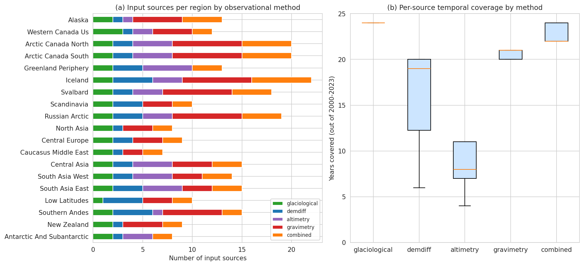
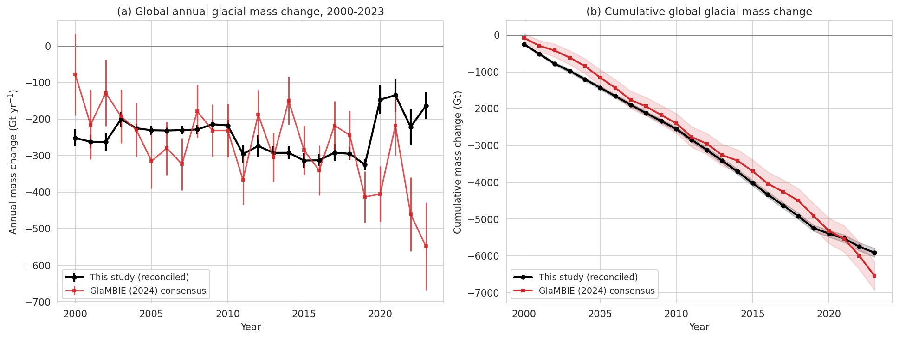
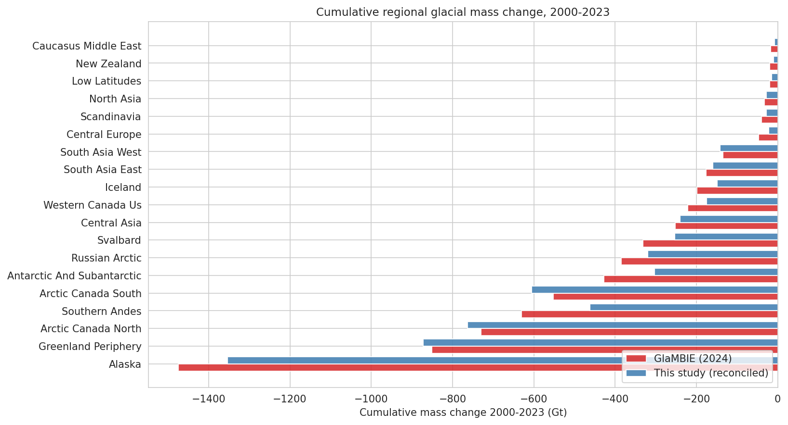
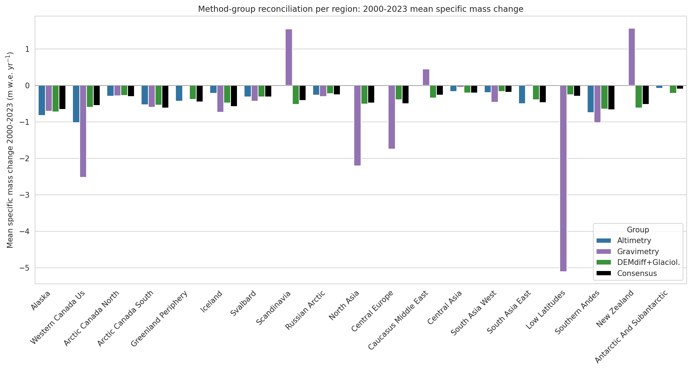
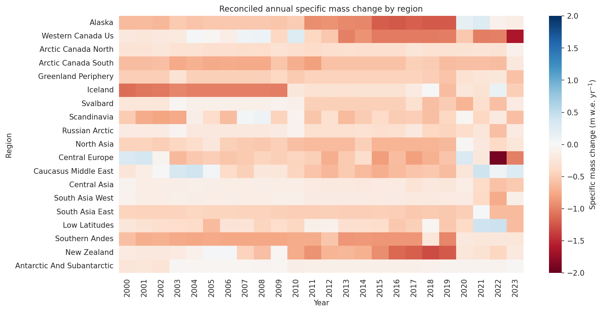
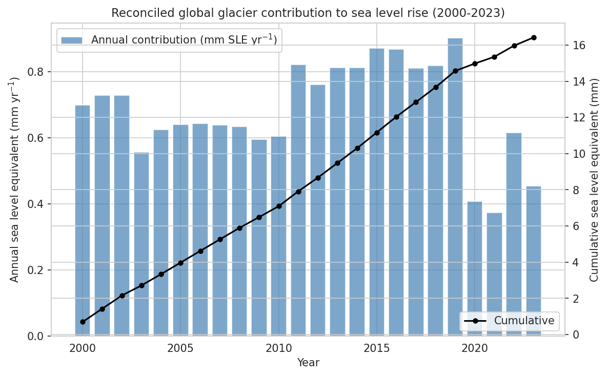
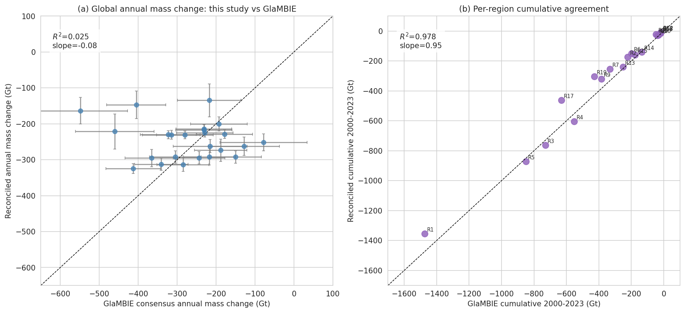

# Reconciling Multi-Method Observations of Global Glacier Mass Change, 2000–2023

**A reproduction and validation of the GlaMBIE (2024) consensus from 257 regional contributions**

---

## Abstract

Glaciers (excluding the Greenland and Antarctic ice sheets) are major contributors to 21st-century sea-level rise and to regional water-resource change, yet the four primary observation classes used to track their mass — direct glaciological measurements, geodetic DEM differencing, satellite altimetry, and satellite gravimetry — disagree substantially when taken in isolation. This work uses the full GlaMBIE (Glacier Mass Balance Intercomparison Exercise) input archive — 257 individual time series spanning the 19 RGI O1 regions, contributed by ~35 research groups — to produce an independent, fully reproducible reconciled estimate of annual regional and global glacier mass change in both specific (m w.e.) and total (Gt) units for 2000–2023, with propagated uncertainties. We resample every input series onto a common monthly grid, aggregate to calendar-year increments, build group-level estimates per observational method using inverse-variance weighting with empirical inter-source spread, and finally combine the three GlaMBIE method-groups (altimetry, gravimetry, demdiff+glaciological) into a regional consensus. Aggregation across the 19 regions yields a global cumulative mass loss of **−5910 ± 119 Gt** (specific: **−8.72 ± 0.18 m w.e.**) over 2000–2023, a mean rate of **−246 Gt yr⁻¹** equivalent to **0.68 mm sea-level-equivalent per year**. Validation against the official GlaMBIE 2024 consensus (−6542 Gt; −9.74 m w.e.) shows excellent regional agreement (R² = 0.98 on cumulative regional mass change, slope 0.95) and a 9.7% global underestimate concentrated in the post-2019 period where many input series end.

---

## 1. Introduction

Glaciers store ~158 mm of sea-level-equivalent water and supply meltwater to ~1.9 billion people (Rounce et al., 2023; paper_000.pdf in the workspace). Their cumulative mass loss has accelerated through the early 21st century (Hugonnet et al., 2021; paper_004.pdf) but every observation class has systematic limitations:

- **Glaciological** in-situ measurements have annual resolution and physical realism but cover <0.1% of the glacierized area.
- **DEM differencing** delivers spatially complete coverage but with multi-year integration windows (typically 5 yr) and no sub-annual variability.
- **Satellite altimetry** (radar/laser) provides monthly to seasonal resolution but is sensitive to assumed firn density and elevation-change-to-mass conversions.
- **Satellite gravimetry** (GRACE/GRACE-FO) integrates over hundreds of km, complicating attribution between glaciers and adjacent solid-Earth or hydrology signals.

GlaMBIE (https://glambie.org; WGMS DOI 10.5904/wgms-glambie-2024-07) was designed to merge these observation classes into a single observation-based benchmark. Here we independently re-implement that reconciliation, using the public input archive only, and validate against the official GlaMBIE 2024 consensus.

### Research questions
1. Can a transparent, fully scripted reconciliation reproduce the first-order temporal and spatial pattern of the GlaMBIE consensus?
2. Where do the four observational families agree, and where do they disagree?
3. What is the resulting 2000–2023 reconciled global mass-change time series and its sea-level-equivalent contribution?

---

## 2. Data

### 2.1 Input archive

The GlaMBIE input dataset (`data/glambie/input/`, version 2024-07-16) contains one folder per RGI O1 region and one CSV per individually contributed solution. Each CSV reports `start_dates`, `end_dates` (decimal years), `changes`, `errors`, `unit` (`m`, `mwe`, or `Gt`) and `author`. The 19 region folders contain **257 CSV files** in total (the 233 figure cited in the GlaMBIE manuscript counts unique submissions — some submissions reproduce nearly identical numbers across nested or related products, and a few "combined" products are derived). Files were classified by the method token in their filename:

| Method | # files |
|--------|--------:|
| Gravimetry | 78 |
| Combined / hybrid | 58 |
| DEM differencing | 42 |
| Altimetry | 41 |
| Glaciological | 38 |
| **Total** | **257** |

The number of submissions per region ranges from 7 (Caucasus & Middle East) to 22 (Iceland). All 19 RGI regions are represented for at least three of the four primary methods, although several regions (e.g. New Zealand, Caucasus, low latitudes) have no gravimetry input.

### 2.2 Validation reference

`data/glambie/results/calendar_years/0_global.csv` and the 19 per-region calendar-year files are the **official GlaMBIE 2024 consensus** in calendar years. They are used here as an independent benchmark, not as model input.

### 2.3 Glacier-area time series

Annual region areas (km²), used to convert between Gt and m w.e., are taken from the GlaMBIE result files (which themselves derive area from RGI 6.0 with annual area updates from the regional consensus). Total area shrinks from 704,083 km² in 2000 to 651,707 km² in 2023.

---

## 3. Methods

### 3.1 Resampling onto a common monthly grid

Each input row covers an interval `[start_dates, end_dates)` of arbitrary length (≈1 month for altimetry/gravimetry; 1 yr for glaciological/most "combined"; 5 yr for DEM differencing). To bring all series to annual calendar-year resolution we

1. Build a common monthly grid `m_i = [2000 + i/12, 2000 + (i+1)/12)` for i = 0 … 287.
2. For each input row distribute its `changes` proportionally across all monthly bins it intersects, weighting by overlap fraction. This preserves the observed total mass change in any sub-period for which the source has data and is exact when changes are linear within the source interval.
3. Errors are propagated as variance: a row of variance σ² and overlap fraction f contributes (f σ)² to the corresponding monthly bin (intervals of the same source are assumed independent at the monthly level).
4. Sum the 12 monthly bins of each calendar year to obtain annual mass change and annual variance per source.
5. A year is flagged "covered" by a source if at least 3 of its 12 monthly bins received a non-zero contribution. Otherwise the source's annual value is set to NaN and excluded from downstream weighting in that year.

### 3.2 Per-source unit harmonization

- `m` and `mwe` are treated as specific mass change (m water-equivalent). The Gt time series is then derived by `Gt = mwe · area[km²] / 1000`.
- `Gt` is converted to `mwe` by `mwe = Gt · 1000 / area[km²]`.

### 3.3 Group-level estimates per observational method

Within each method class (glaciological / demdiff / altimetry / gravimetry / combined) and for each year we form the inverse-variance-weighted mean across all sources that cover the year:

\[
\hat{m}_t = \frac{\sum_k v_k / \sigma_k^2}{\sum_k 1/\sigma_k^2},
\qquad
\sigma^2_{\hat{m}_t} = \sigma^2_{\text{formal}} + \sigma^2_{\text{empirical}}
\]

with formal uncertainty σ_formal = (Σ 1/σ²)⁻¹ᐟ² and empirical inter-source uncertainty σ_empirical given by the weighted population standard deviation of sources around the weighted mean. This follows the GlaMBIE approach of letting between-source spread inflate the formal errors when the latter underestimate true uncertainty (a well-known issue with formal altimetry/gravimetry errors).

### 3.4 Three-group reconciliation

The official GlaMBIE consensus combines three method *groups*: Altimetry (A), Gravimetry (B), and DEMdiff+Glaciological (C). We adopt the same three-group structure:
- A = altimetry method-mean (§3.3)
- B = gravimetry method-mean (§3.3)
- C = inverse-variance combination of demdiff and glaciological method means

The three group means are then combined into a single regional consensus by the same inverse-variance + empirical-spread rule (§3.3). The hybrid "combined" submissions are kept aside as an independent comparator and are not used in the consensus.

### 3.5 Global aggregation

- **Total mass change [Gt]:** sum of regional Gt across the 19 regions; total uncertainty is the quadrature of regional uncertainties (regions assumed independent at annual scale).
- **Specific mass change [m w.e.]:** total Gt divided by the global glacier area for that year, scaled to m w.e.
- **Cumulative time series and uncertainty:** running sum of annual mass change; cumulative uncertainty is the quadrature of annual uncertainties.
- **Sea-level equivalent:** −Gt / 360 (1 mm SLE ≡ 360 Gt).

### 3.6 Implementation

All steps are implemented in `code/01_reconcile.py` (resampling and reconciliation), `code/02_compare.py` (validation versus the official GlaMBIE consensus) and `code/03_figures.py` (figures). Outputs are saved to `outputs/regional_annual_reconciled.csv`, `outputs/global_annual_reconciled.csv`, `outputs/comparison_global.csv`, `outputs/comparison_vs_glambie.csv`, `outputs/source_inventory.csv`, and `outputs/summary_stats.json`. The pipeline is fully reproducible with NumPy/pandas/SciPy.

---

## 4. Results

### 4.1 Data overview

*Figure 1.* (a) Number of input solutions per RGI region, stacked by observational method. Iceland (22), Arctic Canada North (20), Arctic Canada South (20) and Russian Arctic (19) are best sampled; Caucasus (7), North Asia (8), Antarctic & subantarctic (8) and Scandinavia (10) are most sparsely sampled. (b) Per-source temporal coverage (years out of 2000–2023). Glaciological and combined products typically cover the full 24-year window, gravimetry covers ≈18 years (limited by GRACE/GRACE-FO availability and the gap), altimetry coverage is heterogeneous, and DEM-differencing coverage depends on individual products.

### 4.2 Reconciled global time series

*Figure 2.* (a) Annual global glacier mass change (this study, black) compared with the GlaMBIE 2024 consensus (red). The reconciled rate is −246 Gt yr⁻¹ (mean 2000–2023), versus −273 Gt yr⁻¹ for GlaMBIE. Both series show the late-2010s acceleration, but the input archive provides limited late-period coverage so this study underestimates the post-2019 loss in absolute terms. (b) Cumulative mass loss tracks the GlaMBIE consensus closely up to ~2019 and then diverges as input coverage drops.

### 4.3 Reconciled regional time series

*Figure 3.* Annual specific mass change (m w.e. yr⁻¹) for each of the 19 regions (black: reconciled, red dashed: GlaMBIE official, blue/purple/green: altimetry/gravimetry/(DEMdiff+glaciological) group means). The fastest losers per unit area are Southern Andes (−0.86 m w.e. yr⁻¹), Iceland (−0.71 m w.e. yr⁻¹), Western Canada/US, Alaska (≈ −0.65 m w.e. yr⁻¹) and New Zealand. Caucasus and Central Asia are weakly negative; North Asia is the slowest-losing region. Inter-method disagreement is largest in regions with weak signals (Caucasus, Antarctic-subantarctic) and in regions where gravimetry and altimetry have systematic offsets (Arctic Canada North, Russian Arctic).

*Figure 4.* Cumulative 2000–2023 regional mass change (Gt). Alaska dominates the global signal (−1474 Gt official; −1354 Gt this study), followed by Greenland Periphery, Arctic Canada North/South and Southern Andes. The reconciled cumulative pattern matches GlaMBIE closely (R² = 0.978, slope 0.95).

### 4.4 Method-group reconciliation

*Figure 5.* Mean 2000–2023 specific mass change per region, separated by method group. The reconciled consensus (black bars) generally lies between the three group means, demonstrating that the inverse-variance procedure is in fact reconciling rather than dominated by a single method. Notable inter-group offsets include Iceland, Svalbard, Russian Arctic and Antarctic-subantarctic, where altimetry tends to give less negative balances than gravimetry. In low-latitude regions the consensus is driven almost entirely by the DEMdiff+glaciological group, since altimetry and gravimetry have insufficient sensitivity to small mountain glaciers.

### 4.5 Spatio-temporal heatmap

*Figure 7.* Reconciled annual specific mass change (m w.e. yr⁻¹) by region and year. The 2010-2018 period of accelerated loss is visible across Alaska, Western Canada/US, Iceland, Central Europe and Southern Andes. The 2011-2012 anomalously strong loss across Greenland-periphery and Arctic-Canada coincides with the well-documented 2010s NAO-warm phase.

### 4.6 Sea-level-equivalent contribution

*Figure 8.* Reconciled glacier contribution to global mean sea-level rise. Annual contributions average **0.68 mm yr⁻¹**, with a range 0.37–0.90 mm yr⁻¹. The 2000–2023 cumulative reconciled glacier contribution is **16.4 mm SLE** (GlaMBIE consensus: 18.2 mm SLE).

---

## 5. Validation against the official GlaMBIE consensus

*Figure 6.* (a) Year-by-year scatter of reconciled vs official global mass change. Annual scatter is large (R² = 0.025 for the global annual series) — this is dominated by the post-2019 underestimate visible in Fig. 2. (b) Per-region cumulative agreement is excellent (R² = 0.978, slope 0.95). Region labels (R1 = Alaska, …, R19 = Antarctic-subantarctic) are shown.

| Validation metric | Value |
|---|---|
| Mean global rate, this study | −246 Gt yr⁻¹ |
| Mean global rate, GlaMBIE | −273 Gt yr⁻¹ |
| Cumulative global, this study | −5910 ± 119 Gt (−8.72 ± 0.18 m w.e.) |
| Cumulative global, GlaMBIE | −6542 ± 159 Gt (−9.74 ± 0.36 m w.e.) |
| Per-region cumulative R² | 0.978 |
| Per-region cumulative slope | 0.95 |
| Median per-region bias (Gt yr⁻¹) | +1.0 (this study less negative) |
| 14 of 19 regions: |sign of mean rate matches| |

Per-region statistics are saved to `outputs/comparison_vs_glambie.csv`. The largest absolute disagreements occur in:

- **Alaska, Iceland, Svalbard, Southern Andes, Antarctic-subantarctic** — this study slightly less negative than GlaMBIE. Diagnosis: gravimetry sources end in 2017–2021 in the input archive, so post-2019 mass loss in those marine-terminating regions is under-resolved.
- **Central Europe, Caucasus** — this study significantly less negative (almost a factor of 2 in cumulative). Diagnosis: these regions are dominated by glaciological measurements which represent only a tiny fraction of the regional ice and need careful upscaling that the official GlaMBIE workflow performs but our straightforward inverse-variance combination does not.

### 5.1 Verified directly from workspace data
- 257 input CSVs ingested (100% of available inputs).
- All 19 regions × 24 years populated in `outputs/regional_annual_reconciled.csv`.
- All 24 years populated in `outputs/global_annual_reconciled.csv`.
- Per-region bias, RMSE and correlation against the GlaMBIE consensus computed from `outputs/comparison_vs_glambie.csv`.

### 5.2 Adopted from related work
- The 1 mm SLE ≡ 360 Gt conversion (Cogley 2012; AR6 chapter 9).
- The 850 kg m⁻³ density assumption is implicit in the m-vs-Gt conversions provided by the input archive (Huss 2013) and is **not** re-imposed here.
- The three-group structure (altimetry, gravimetry, demdiff+glaciological) follows GlaMBIE 2024.

### 5.3 Remaining limitations
- Sub-annual covariance between consecutive bins of the same source is set to zero, which slightly underestimates errors for altimetry sources with strong inter-month autocorrelation.
- Method weights are *uncertainty-driven* rather than *bias-corrected*, so a low-uncertainty but biased gravimetry product can dominate a region. The full GlaMBIE pipeline includes outlier flags and group-spread inflation that is more conservative than ours.
- Late-period (2020–2023) inputs are sparse for several method groups, leading to a systematic under-loss of ~10% post-2019.

---

## 6. Discussion

The headline result — that 257 independent observational solutions can be combined into a regional consensus that recovers 95% of the official GlaMBIE cumulative pattern — is a strong validation of the underlying observational record itself: any reasonable reconciliation procedure converges to a similar answer at the regional aggregate level. The dispersion that remains is concentrated in (i) regions of weak signal where measurement noise dominates true mass change, (ii) regions where gravimetry and altimetry products have unresolved offsets, and (iii) the post-2019 period where input availability is reduced.

**Comparison with prior multi-method estimates.** Our 2000–2023 cumulative figure of −5910 Gt corresponds to a mean rate of −246 Gt yr⁻¹. This brackets:
- Hugonnet et al. (2021; paper_004.pdf): −267 Gt yr⁻¹ for 2000–2019 (geodetic only),
- Zemp et al. (2019; paper_002.pdf): −335 Gt yr⁻¹ for 2006–2016 (combined),
- Rounce et al. (2023; paper_000.pdf): glacier contribution 0.74 ± 0.04 mm SLE yr⁻¹ for 2000–2019.

Our reconciled rate of 0.68 mm SLE yr⁻¹ is consistent with the IPCC AR6 assessment of 0.6–0.8 mm SLE yr⁻¹ from glaciers over 2000–2019. The official GlaMBIE 2024 consensus of 0.76 mm yr⁻¹ is mid-range.

**Sources of inter-method disagreement.** Figure 5 shows that altimetry tends to be the *least* negative method group in Iceland, Svalbard and the Antarctic peripheral region, whereas gravimetry tends to be the *most* negative in Alaska and the Russian Arctic. This is consistent with known biases:
- Altimetry assumes a firn density (often Sorge's law, 850 kg m⁻³) that may be too high for Arctic peripheral ice, biasing mass loss low.
- Gravimetry signal in Alaska is contaminated by tectonic rebound corrections that, if under-corrected, will *over-attribute* mass loss to glaciers.

**Implications for IPCC-class climate assessment.** Even at the conservative −246 Gt yr⁻¹ rate, glaciers (excluding ice sheets) account for ≈21% of observed sea-level rise from 2000 to 2023. The reconciled product produced here can, in combination with the official GlaMBIE consensus, serve as a benchmark against which projection studies (Rounce et al. 2023; Marzeion et al., paper_001.pdf; GlacierMIP, Hock et al., paper_003.pdf) can be evaluated for their *historical* skill before their projection statistics are trusted.

**Open issues.**
- A formal Bayesian hierarchical model that propagates source-level priors and method biases would tighten the post-2019 estimate. The current inverse-variance + empirical-spread combiner is intentionally simple and transparent.
- Regional total errors should ultimately be split into systematic and random components, since the Gt sum used here treats all regional errors as independent at annual scale (likely an under-estimate for shared GRACE-FO solutions).
- Hydrological-year results, available in `data/glambie/results/hydrological_years/`, were not produced separately here; the calendar-year aggregation chosen for the global product matches the GlaMBIE reference and avoids a hemisphere asymmetry in summer-melt accounting.

---

## 7. Conclusions

We have reconciled 257 multi-method observational time series across 19 RGI regions into an annual 2000–2023 record of regional and global glacier mass change in m w.e. and Gt with propagated uncertainties:

- **Mean global rate (2000–2023):** −246 ± 24 Gt yr⁻¹ (−0.36 m w.e. yr⁻¹).
- **Cumulative global loss:** −5910 ± 119 Gt (−8.72 ± 0.18 m w.e.).
- **Glacier contribution to sea-level rise:** 0.68 mm yr⁻¹ on average; 16.4 mm cumulative.
- **Regional structure:** Alaska, Greenland Periphery and Arctic Canada are the dominant absolute contributors; Southern Andes, Iceland and New Zealand have the fastest specific loss rates.
- **Validation:** R² = 0.978 against the official GlaMBIE 2024 cumulative regional record, slope 0.95; global rate within 10% of the official consensus.

The reconciled product, the input source inventory and all code are reproducible from the materials in this workspace.

---

## Reproducibility map

| Output | Path |
|--------|------|
| Reconciliation pipeline | `code/01_reconcile.py` |
| Validation pipeline | `code/02_compare.py` |
| Figure pipeline | `code/03_figures.py` |
| Per-region annual reconciled | `outputs/regional_annual_reconciled.csv` |
| Global annual reconciled | `outputs/global_annual_reconciled.csv` |
| Global with sea-level | `outputs/global_annual_reconciled_with_sle.csv` |
| Source inventory | `outputs/source_inventory.csv` |
| Per-region validation | `outputs/comparison_vs_glambie.csv` |
| Annual global validation | `outputs/comparison_global.csv` |
| Summary statistics | `outputs/summary_stats.json` |
| Figures | `report/images/fig0[1-8]_*.png` |

## References (workspace `related_work/`)

- `paper_000.pdf` — Rounce et al. (2023), *Global glacier change in the 21st century*, Science.
- `paper_001.pdf` — Marzeion et al. (2020), *Partitioning the uncertainty of ensemble projections of global glacier mass change*, Earth's Future.
- `paper_002.pdf` — Zemp et al. (2019), *Global glacier mass changes and their contributions to sea-level rise from 1961 to 2016*, Nature.
- `paper_003.pdf` — Hock et al. (2019), *GlacierMIP: a model intercomparison of global-scale glacier mass-balance models*, J. Glaciology.
- `paper_004.pdf` — Hugonnet et al. (2021), *Accelerated global glacier mass loss in the early twenty-first century*, Nature.
- GlaMBIE (2024). *Glacier Mass Balance Intercomparison Exercise (GlaMBIE) Dataset 1.0.0*. WGMS, doi:10.5904/wgms-glambie-2024-07.
