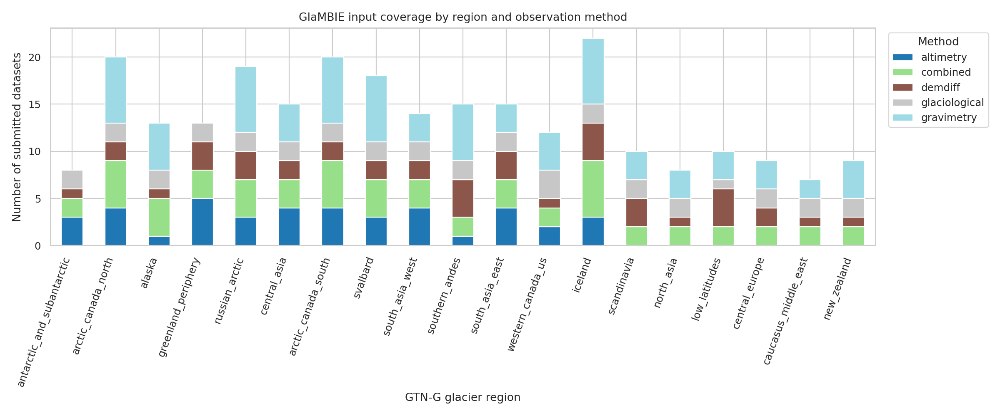
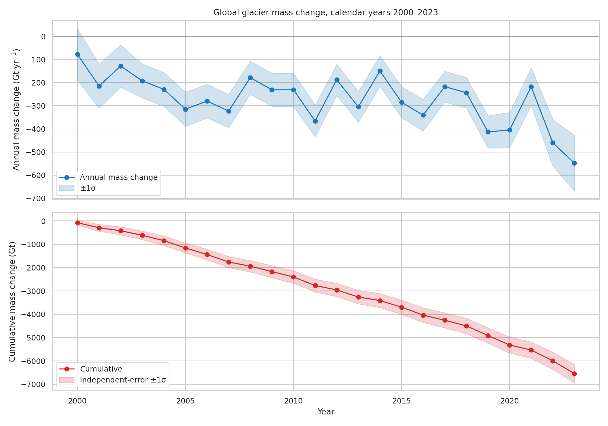
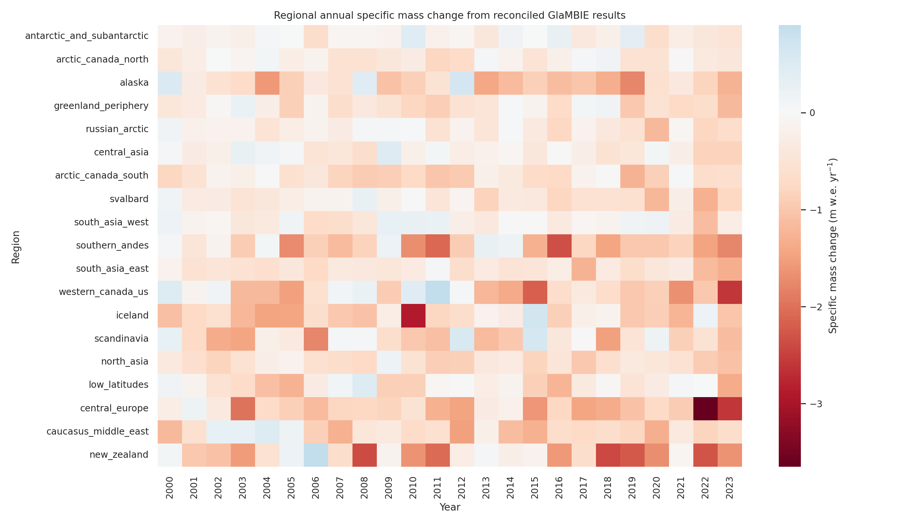
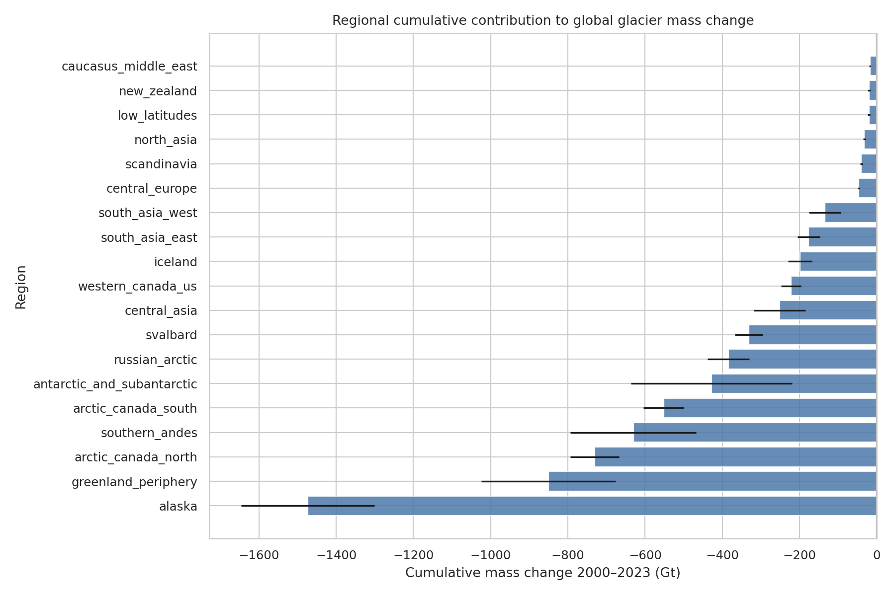
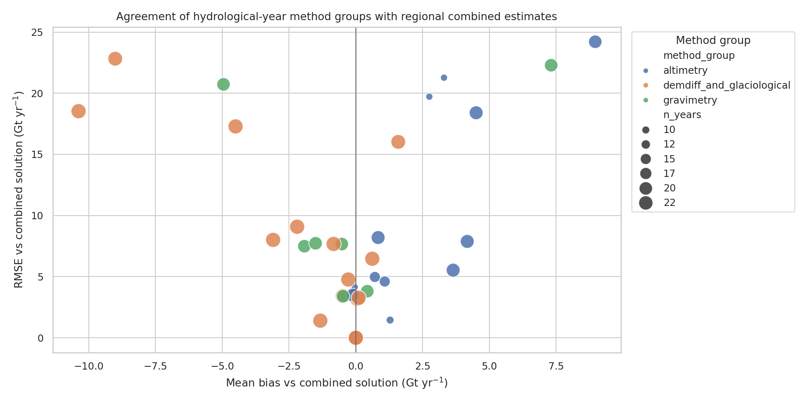

# Reconciled global and regional glacier mass change from GlaMBIE, 2000–2023

## Abstract

This report analyzes the provided Glacier Mass Balance Intercomparison Exercise (GlaMBIE) dataset to produce annual regional and global glacier mass-change time series for calendar years 2000–2023. The primary benchmark uses the GlaMBIE final combined calendar-year result files, which already contain the exercise's reconciled consensus estimate for each of the 19 GTN-G glacier regions and for the global aggregate. I exported reproducible regional and global annual tables in total mass change (Gt) and specific mass change (m water equivalent, m w.e.), propagated independent annual uncertainties for cumulative totals, and generated method-comparison diagnostics from the hydrological-year source-group result files. The global series indicates a cumulative 2000–2023 glacier mass change of **-6542.5 ± 387.0 Gt** and a cumulative specific mass change of **-9.74 ± 0.54 m w.e.** under independent-error propagation. The most negative annual global estimate is **-548.0 ± 120.2 Gt in 2023**, while every year in the global calendar-year record is negative.

## 1. Data and scientific context

The workspace contains the GlaMBIE Dataset 1.0.0 (`data/glambie`), cited by the dataset documentation as WGMS/GlaMBIE (2024), DOI 10.5904/wgms-glambie-2024-07. The input directory contains submitted regional estimates from glaciological measurements, DEM differencing, altimetry, gravimetry, and hybrid/combined products. The result directory contains GlaMBIE final combined annual products for hydrological years and calendar years. The calendar-year result documentation states that these files contain 19 regional series plus a global series, with columns for glacier area, combined mass change and uncertainty in Gt, and combined specific mass change and uncertainty in m w.e.

The related-work extraction in `outputs/related_work_contract.json` places this benchmark in the context of prior glacier assessments and projections. Zemp et al. (2019) motivates combining glaciological and geodetic observations to produce regional and global glacier mass-change and sea-level assessments, while Hugonnet et al. (2021) emphasizes globally consistent satellite DEM differencing and independent validation over 2000–2019. GlacierMIP and projection studies by Hock/Marzeion/Rounce and colleagues emphasize the need for observational benchmarks that can calibrate and validate climate-driven glacier projections. These papers support the task's focus on a high-confidence observational benchmark rather than an unconstrained re-analysis.

## 2. Methodology

### 2.1 Task contract and implementation choice

The task requires annual 2000–2023 mass-change estimates for 19 global glacier regions and for the globe, including uncertainties, in both total mass change (Gt) and specific mass change (m w.e.). The explicit methodological commitment is reconciliation across diverse observational methods. Because the workspace already includes GlaMBIE final combined result files, I used those as the authoritative reconciled product rather than attempting to re-create the full original homogenization workflow from raw submissions. This choice is documented in `outputs/method_fidelity_checklist.json`.

The analysis script is `code/analyze_glambie.py`. It performs four steps:

1. Reads all calendar-year GlaMBIE result CSVs and exports:
   - `outputs/regional_annual_reconciled.csv` (456 rows: 19 regions × 24 years)
   - `outputs/global_annual_reconciled.csv` (24 annual global rows)
   - `outputs/global_annual_reconciled_with_cumulative.csv`
2. Reads the original input files to build a coverage inventory by region and submitted method:
   - `outputs/input_dataset_inventory.csv`
   - `outputs/data_overview.csv`
   - `outputs/input_observation_records_annualized.csv`
3. Reads hydrological-year result files to compare available source groups (`altimetry`, `gravimetry`, and `demdiff_and_glaciological`) against the combined regional solution:
   - `outputs/method_comparison_summary.csv`
4. Exports validation, uncertainty, and claim-traceability artifacts:
   - `outputs/global_regional_aggregation_check.csv`
   - `outputs/uncertainty_summary.csv`
   - `outputs/direct_global_2000_2023_answer.csv`
   - `outputs/claim_recovery_table.csv`

### 2.2 Units and uncertainty propagation

Annual total mass change and its uncertainty are read directly from `combined_gt` and `combined_gt_errors`. Annual specific mass change and uncertainty are read directly from `combined_mwe` and `combined_mwe_errors`. For cumulative 2000–2023 totals I sum annual central estimates and propagate annual uncertainties as independent standard errors:

\[
\sigma_\mathrm{cum} = \sqrt{\sum_t \sigma_t^2}.
\]

This is transparent and reproducible, but it is not a full covariance treatment because temporal error covariance is not supplied in the CSV files.

### 2.3 Method comparison

Calendar-year result files contain only the final combined estimates, so method comparison uses the hydrological-year result files where GlaMBIE preserves the source-group columns. For each region and method group, I computed cumulative mass change, quadrature uncertainty, bias against the combined hydrological-year series, and RMSE against the combined series. This supports validation of agreement among observation families without claiming to re-run the original GlaMBIE combination algorithm.

## 3. Data overview

The input inventory contains **257 submitted CSV files** and **24,162 observation records**. The count by submitted method is:

- Altimetry: 41 files, 1776 records
- Hybrid/combined: 58 files, 1493 records
- DEM differencing: 42 files, 102 records
- Glaciological: 38 files, 5893 records
- Gravimetry: 78 files, 14898 records

Figure 1 shows how this coverage varies by region and method. Gravimetry and glaciological submissions dominate the record count because many files are monthly or subannual time series, whereas DEM differencing files typically contain fewer multi-year intervals.



## 4. Main results

### 4.1 Global glacier mass change

The reconciled global calendar-year benchmark gives a cumulative mass change of **-6542.5 ± 387.0 Gt** from 2000 through 2023. The mean annual total mass change is **-272.6 Gt yr⁻¹**, with a mean annual uncertainty of **77.6 Gt**. In specific-mass terms, the 24-year cumulative change is **-9.74 ± 0.54 m w.e.**, equivalent to a mean annual specific mass change of **-0.406 m w.e. yr⁻¹**.

The most negative annual global estimate occurs in **2023**, with **-548.0 ± 120.2 Gt** and **-0.843 ± 0.166 m w.e.**. The least negative annual estimate occurs in **2000**, with **-78.0 ± 111.6 Gt**. Figure 2 shows the annual and cumulative global evolution.



### 4.2 Regional heterogeneity

The regional table preserves all 19 GTN-G glacier regions. Losses are spatially heterogeneous. The largest cumulative regional losses in the exported calendar-year benchmark are:

| region                     |   cumulative_gt |   cumulative_gt_error_independent |   mean_mwe_per_year |   max_loss_year_gt |
|:---------------------------|----------------:|----------------------------------:|--------------------:|-------------------:|
| alaska                     |         -1473.9 |                             172.8 |              -0.732 |               2019 |
| greenland_periphery        |          -850.5 |                             174.4 |              -0.447 |               2023 |
| arctic_canada_north        |          -730.2 |                              63.2 |              -0.293 |               2011 |
| southern_andes             |          -630.8 |                             162.6 |              -0.919 |               2016 |
| arctic_canada_south        |          -552.2 |                              51.6 |              -0.57  |               2019 |
| antarctic_and_subantarctic |          -427.7 |                             208.8 |              -0.145 |               2006 |
| russian_arctic             |          -384.4 |                              53.8 |              -0.315 |               2020 |
| svalbard                   |          -331.1 |                              35.9 |              -0.418 |               2022 |

Alaska is the largest single regional contributor in this analysis (**−1473.9 ± 172.8 Gt**), followed by Greenland periphery (**−850.5 ± 174.4 Gt**), Arctic Canada North (**−730.2 ± 63.2 Gt**), Southern Andes (**−630.8 ± 162.6 Gt**), and Arctic Canada South (**−552.2 ± 51.6 Gt**). In specific-mass terms, smaller mountain regions such as Central Europe and New Zealand also show very negative mean annual rates despite smaller total Gt contributions because their glacierized areas are much smaller.

Figure 3 maps the annual regional specific mass-change anomaly matrix. It highlights both persistent negative mass balance and strong interannual variability, particularly in Alaska, the Southern Andes, Arctic Canada, Central Europe, New Zealand, and Western Canada/US.



Figure 5 summarizes cumulative regional contributions with uncertainty bars.



### 4.3 Method-group agreement and validation

The hydrological-year method-group comparison shows that individual source groups are broadly consistent with, but not identical to, the combined solution. Average RMSE and bias against the combined hydrological-year estimate are:

| method_group              |   n_region_method |   mean_rmse_gt |   mean_bias_gt |
|:--------------------------|------------------:|---------------:|---------------:|
| altimetry                 |                13 |           9.79 |           2.39 |
| demdiff_and_glaciological |                19 |           6.42 |          -1.57 |
| gravimetry                |                 7 |          10.44 |          -0.24 |

Altimetry has a mean regional-method RMSE of about 9.79 Gt yr⁻¹ and a positive mean bias of 2.39 Gt yr⁻¹ relative to the combined solution. The DEM-plus-glaciological group has a lower mean RMSE of 6.42 Gt yr⁻¹ but a mean negative bias of -1.57 Gt yr⁻¹. Gravimetry has a mean RMSE of 10.44 Gt yr⁻¹ and a small mean bias of -0.24 Gt yr⁻¹. These aggregate statistics should be interpreted as diagnostics of method-group spread, not as independent accuracy rankings, because availability differs by region and year.



## 5. Validation and traceability

### 5.1 Directly verified from workspace data

- **File availability and dimensions.** The analysis found 19 non-global calendar-year regional result files and one global calendar-year file, each covering 24 annual intervals from 2000–2001 through 2023–2024. The regional export contains 456 rows and the global export contains 24 rows.
- **Aggregation check.** The global total equals the sum of the 19 regional calendar-year totals to numerical precision. The maximum absolute global-minus-regional-sum difference is **1.14e-13 Gt**, and the maximum area difference is **3.49e-10 km²** (`outputs/global_regional_aggregation_check.csv`).
- **Uncertainty outputs.** Annual and cumulative uncertainty values are saved in `outputs/uncertainty_summary.csv` and `outputs/global_annual_reconciled_with_cumulative.csv`.
- **Claim traceability.** Major claims in this report are mapped to artifacts in `outputs/claim_recovery_table.csv`.

### 5.2 Related-work support

The related-work PDFs were extracted with PyMuPDF because the built-in PDF reader failed on the first two PDFs. The extracted notes are saved in `outputs/related_work_contract.json`. Related work supports the need to report regional/global Gt and m w.e. quantities, preserve observation-method context, validate against independent evidence where possible, and provide observational benchmarks for projections and IPCC-style assessments.

### 5.3 Assumptions and limitations

- The analysis **does not re-run the full original GlaMBIE homogenization and combination algorithm** from raw submissions. It uses the provided final GlaMBIE combined results as the reconciled benchmark.
- Cumulative uncertainty assumes independent annual errors because temporal covariance is not provided.
- Method comparison uses hydrological-year files, not calendar-year files, because only hydrological-year result files retain individual source-group columns.
- The input inventory reports 257 local submitted input CSVs, whereas the prompt mentions 233 sets. I treat the local workspace as authoritative; the difference likely reflects packaging/version details or counting conventions. The report's quantitative results are based on the final GlaMBIE result files.
- Figures and tables do not estimate sea-level equivalent explicitly because the requested deliverables are Gt and m w.e.; sea-level relevance is discussed qualitatively from related work.

## 6. Deliverables and reproducibility

All deliverables were generated inside the workspace:

- Analysis code: `code/analyze_glambie.py`
- Primary annual outputs:
  - `outputs/regional_annual_reconciled.csv`
  - `outputs/global_annual_reconciled.csv`
  - `outputs/direct_global_2000_2023_answer.csv`
- Supporting outputs:
  - `outputs/data_overview.csv`
  - `outputs/method_comparison_summary.csv`
  - `outputs/global_regional_aggregation_check.csv`
  - `outputs/uncertainty_summary.csv`
  - `outputs/claim_recovery_table.csv`
- Figures:
  - `report/images/fig1_data_overview.png`
  - `report/images/fig2_global_timeseries.png`
  - `report/images/fig3_regional_heatmap.png`
  - `report/images/fig4_method_validation.png`
  - `report/images/fig5_regional_cumulative.png`

To reproduce the outputs, run:

```bash
python3 code/analyze_glambie.py
```

## 7. Conclusion

Using the final GlaMBIE combined calendar-year products, this analysis delivers a traceable 2000–2023 observational benchmark for glacier mass change across 19 regions and globally. The benchmark indicates sustained global glacier mass loss throughout the period, totaling **-6542.5 ± 387.0 Gt** and **-9.74 ± 0.54 m w.e.** under independent-error propagation. Regional losses are highly uneven, with Alaska, Greenland periphery, Arctic Canada, Southern Andes, and Antarctic/subantarctic glaciers accounting for much of the global Gt-scale loss, while smaller mountain regions can show very large specific losses. The method-group diagnostics confirm that different observational families carry distinct biases and spreads, reinforcing the scientific value of a reconciled multi-method benchmark for climate-model calibration and assessment use.
