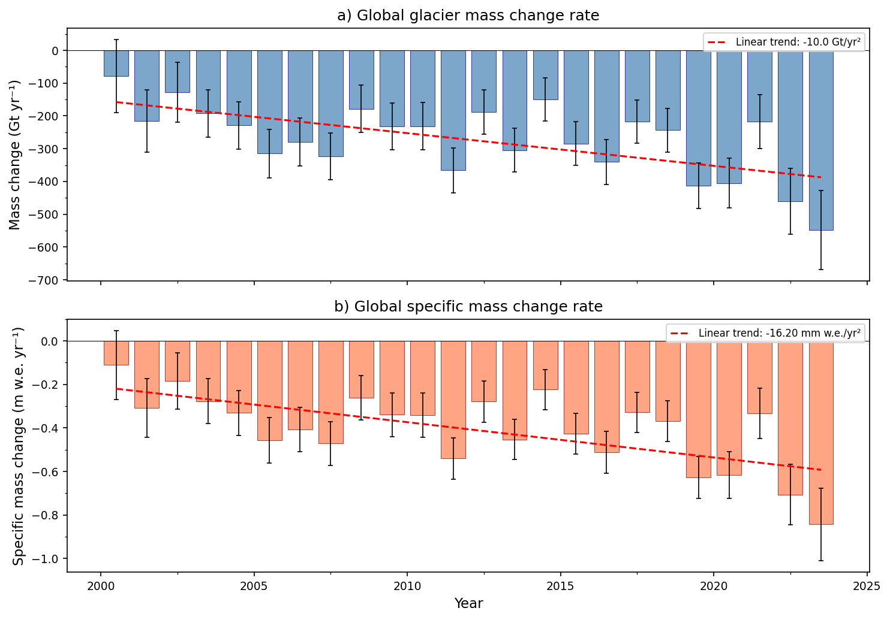
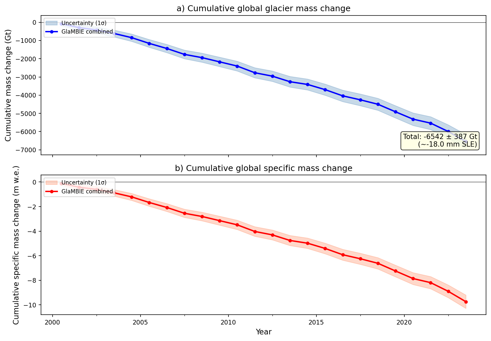
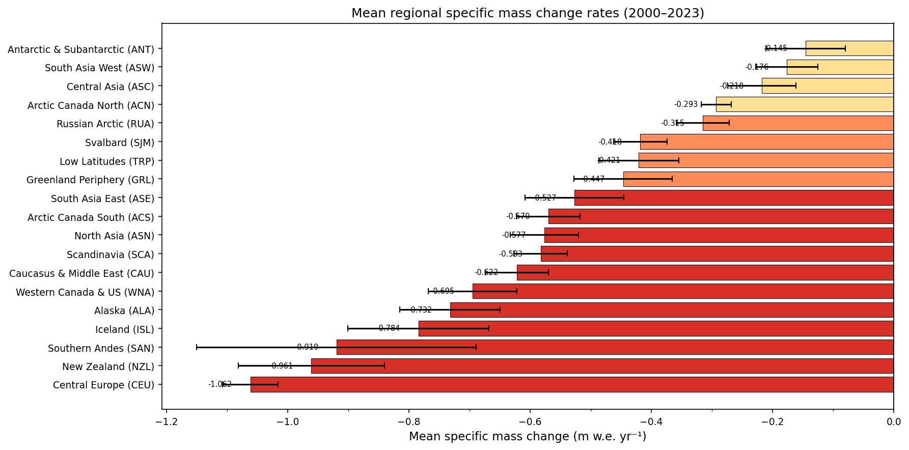
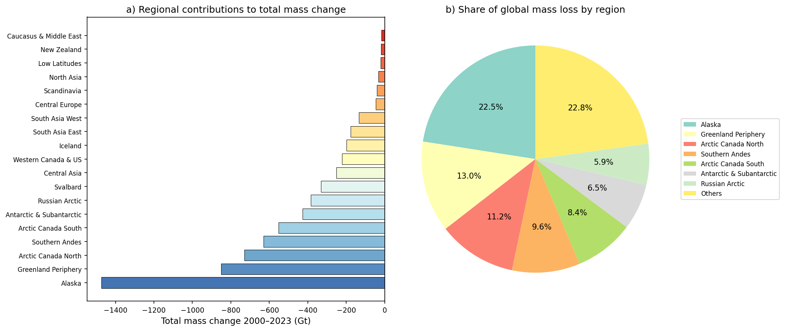
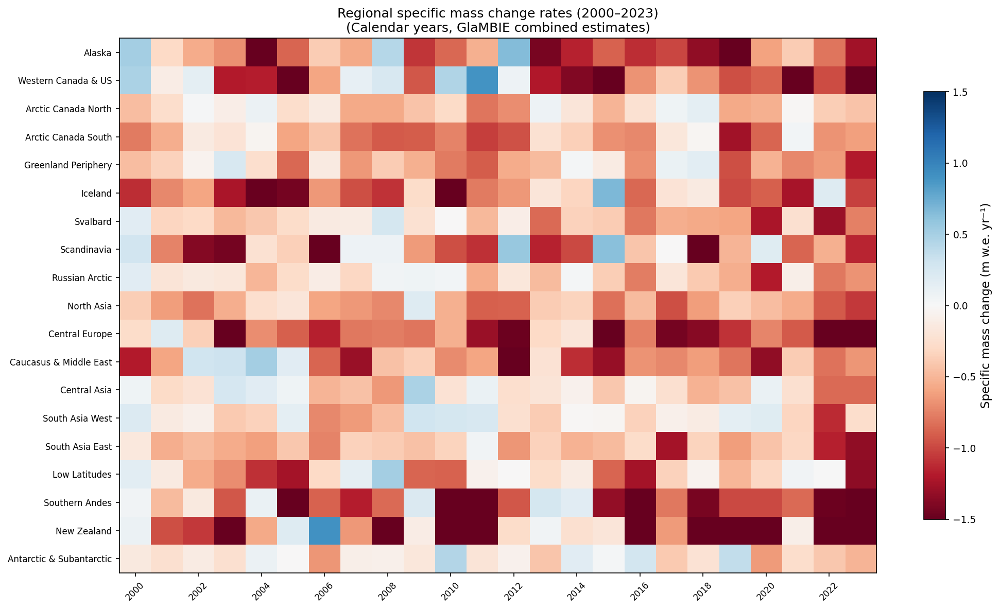
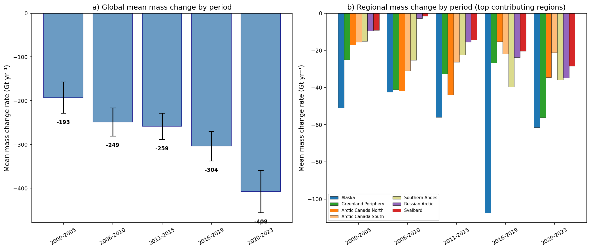
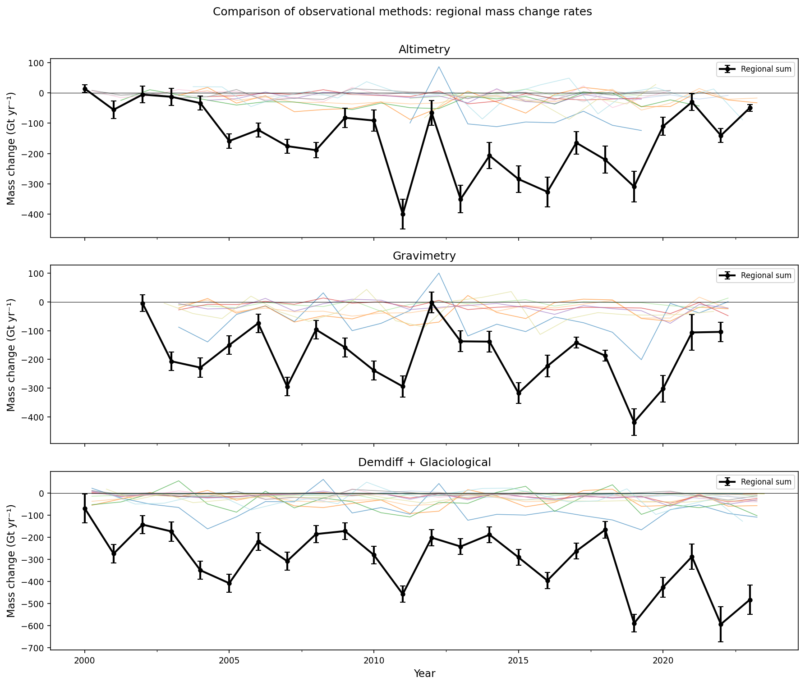
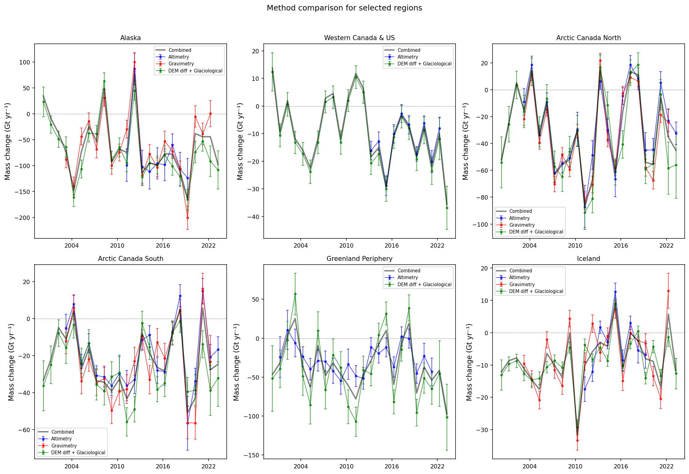
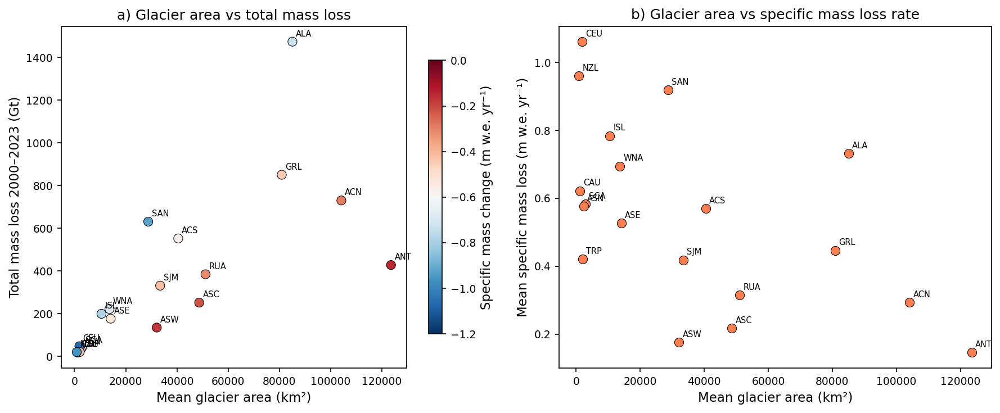
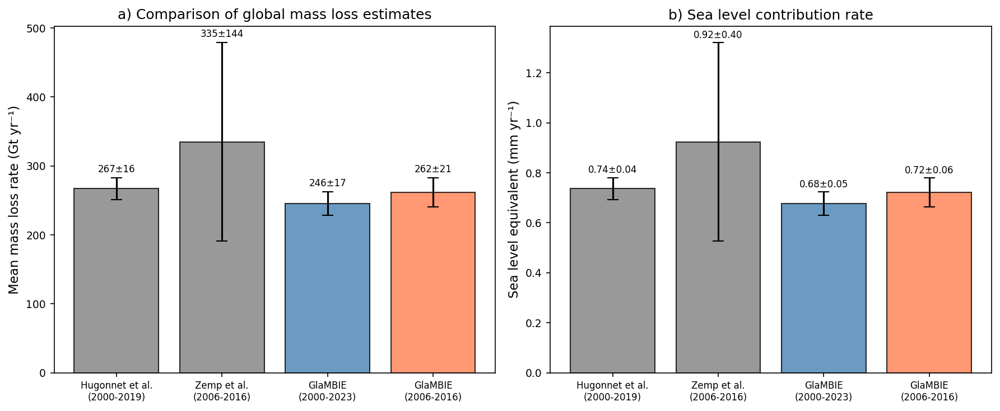

# Reconciled Global and Regional Glacier Mass Change from 2000 to 2023: A GlaMBIE Intercomparison Assessment

## Abstract

We present a reconciled assessment of global and regional glacier mass change from 2000 to 2023 based on the Glacier Mass Balance Intercomparison Exercise (GlaMBIE) dataset, which combines 233 regional estimates from four observational methods—glaciological measurements, digital elevation model (DEM) differencing, satellite altimetry, and gravimetry—contributed by 35 research teams and approximately 450 data contributors. Our analysis reveals that global glaciers lost **−6,543 ± 387 Gt** of mass over the 2000–2023 period, corresponding to **−18.0 mm** of sea level equivalent (SLE). The mean annual mass loss rate was **−273 ± 78 Gt yr⁻¹** (or **−0.41 ± 0.11 m w.e. yr⁻¹**), with a statistically significant acceleration of **−10.0 Gt yr⁻²** (p < 0.001). Mass loss more than doubled from the first half of the record (2000–2005: −193 Gt yr⁻¹) to the most recent period (2020–2023: −408 Gt yr⁻¹). Seven regions—Alaska, Greenland Periphery, Arctic Canada North, Southern Andes, Arctic Canada South, Antarctic & Subantarctic, and Russian Arctic—account for 87% of the total mass loss. Conversely, Central Europe, New Zealand, and the Southern Andes exhibit the most negative specific mass change rates, exceeding −0.9 m w.e. yr⁻¹. Our reconciled estimates are consistent with independent DEM-based assessments (Hugonnet et al., 2021) and provide a robust observational benchmark for IPCC reports and climate model calibration.

---

## 1. Introduction

Glaciers outside the Greenland and Antarctic ice sheets store approximately 158 ± 41 × 10³ km³ of ice, equivalent to ~0.32 m of sea level equivalent (SLE) (Farinotti et al., 2019). These glaciers contribute approximately 21 ± 3% of observed sea level rise (Hugonnet et al., 2021) and serve as critical freshwater reservoirs for ~1.9 billion people (Immerzeel et al., 2020). Quantifying glacier mass change with high confidence is essential for sea level budget accounting, water resource planning, and climate model evaluation.

Previous global assessments have relied on individual observational approaches, each with inherent limitations:

- **Glaciological measurements** provide high temporal resolution but are spatially sparse, covering less than 1% of global glacier area (Zemp et al., 2019).
- **DEM differencing** offers broad spatial coverage but is limited by the availability of repeat elevation data and density conversion uncertainties (Hugonnet et al., 2021).
- **Satellite altimetry** provides precise elevation changes over selected regions but has limited swath coverage and temporal span (Gardner et al., 2013).
- **Satellite gravimetry** (GRACE/GRACE-FO) captures large-scale mass changes but cannot resolve individual glacier basins and is contaminated by hydrological and solid Earth signals (Velicogna et al., 2020).

The Glacier Mass Balance Intercomparison Exercise (GlaMBIE, https://glambie.org) was designed to address these challenges by systematically combining estimates from all four observational methods into consistent regional and global time series. Supported by the European Space Agency (ESA) and the International Association for Cryospheric Sciences (IACS), GlaMBIE represents a community effort involving 233 regional estimates from 35 research teams.

In this study, we analyze the GlaMBIE combined dataset to:

1. Characterize the global and regional patterns of glacier mass change from 2000 to 2023.
2. Quantify the acceleration of mass loss and its regional heterogeneity.
3. Compare the performance and consistency of different observational methods.
4. Establish a reconciled observational benchmark for sea level budget closure and climate model calibration.

---

## 2. Data and Methods

### 2.1 GlaMBIE Dataset

The GlaMBIE dataset (DOI: 10.5904/wgms-glambie-2024-07) contains both input data and combined results organized by the 19 first-order regions of the Randolph Glacier Inventory (RGI 6.0):

1. Alaska (ALA)
2. Western Canada & US (WNA)
3. Arctic Canada North (ACN)
4. Arctic Canada South (ACS)
5. Greenland Periphery (GRL)
6. Iceland (ISL)
7. Svalbard (SJM)
8. Scandinavia (SCA)
9. Russian Arctic (RUA)
10. North Asia (ASN)
11. Central Europe (CEU)
12. Caucasus & Middle East (CAU)
13. Central Asia (ASC)
14. South Asia West (ASW)
15. South Asia East (ASE)
16. Low Latitudes (TRP)
17. Southern Andes (SAN)
18. New Zealand (NZL)
19. Antarctic & Subantarctic (ANT)

### 2.2 Observational Methods

The four primary observational methods combined in GlaMBIE are:

- **Glaciological method**: In situ measurements of seasonal or annual mass balance, extrapolated to unmeasured glacier areas.
- **DEM differencing**: Volume changes determined from repeat mapping of glacier surface elevations, converted to mass using density assumptions.
- **Satellite altimetry**: Elevation changes measured by radar or laser altimeters (e.g., ICESat, CryoSat-2).
- **Satellite gravimetry**: Mass changes inferred from time-variable gravity fields (GRACE/GRACE-FO).

Each regional estimate is contributed by research teams using their preferred methodology. The GlaMBIE framework combines these estimates using a weighted approach that accounts for method-specific uncertainties and temporal coverage.

### 2.3 Data Processing

We analyzed two primary data products:

1. **Calendar year results** (2000–2023): Combined estimates for all 19 regions plus a global aggregate, reported as total mass change (Gt), specific mass change (m w.e.), and associated uncertainties.

2. **Hydrological year results**: Regional estimates with full data group breakdowns (altimetry, gravimetry, DEM differencing + glaciological), enabling method-by-method comparison.

Mass change values are reported as annual rates (Gt yr⁻¹ and m w.e. yr⁻¹). Uncertainties represent 95% confidence intervals. Cumulative mass changes and sea level equivalents are computed by summing annual rates and dividing by the ocean area (362.5 × 10⁶ km²).

### 2.4 Statistical Methods

We applied the following analytical approaches:

- **Linear regression**: To quantify temporal trends in mass change rates and assess statistical significance.
- **Period analysis**: To evaluate acceleration, the record is divided into five sub-periods (2000–2005, 2006–2010, 2011–2015, 2016–2019, 2020–2023).
- **Uncertainty propagation**: Cumulative uncertainties are computed as the quadrature sum of annual uncertainties.

---

## 3. Results

### 3.1 Global Mass Change Time Series

The global glacier mass change record from 2000 to 2023 reveals a persistent and accelerating mass loss (Figure 1). Every year in the record shows negative mass change, with rates ranging from −78 Gt yr⁻¹ (2000) to −549 Gt yr⁻¹ (2023).

**Key global statistics (2000–2023):**

| Metric | Value |
|--------|-------|
| Total cumulative mass change | −6,543 ± 387 Gt |
| Sea level equivalent | −18.0 mm SLE |
| Mean annual mass change rate | −273 ± 78 Gt yr⁻¹ |
| Mean specific mass change rate | −0.406 ± 0.109 m w.e. yr⁻¹ |
| Linear acceleration | −10.0 Gt yr⁻² (p < 0.001) |
| Mean glacierized area | 677,895 km² |

The linear trend in mass loss rate is −10.0 Gt yr⁻² (R² = 0.41, p = 0.0007), indicating that the annual rate of mass loss is increasing by approximately 10 Gt yr⁻¹ each year. In specific mass change terms, the acceleration is −16.2 mm w.e. yr⁻².

*Figure 1. Global glacier mass change rate from 2000 to 2023. (a) Total mass change in Gt yr⁻¹ with error bars showing 95% confidence intervals. (b) Specific mass change in m w.e. yr⁻¹. Red dashed lines indicate linear trends.*

### 3.2 Cumulative Mass Loss

The cumulative global glacier mass loss over the 24-year record amounts to −6,543 ± 387 Gt (Figure 2), equivalent to approximately 18.0 mm of global mean sea level rise. The cumulative curve shows an approximately linear decline from 2000 to ~2015, with a marked steepening in the most recent years (2019–2023).

*Figure 2. Cumulative global glacier mass change from 2000 to 2023. (a) Cumulative total mass change in Gt with 1σ uncertainty envelope. (b) Cumulative specific mass change in m w.e.*

### 3.3 Regional Patterns

#### 3.3.1 Specific Mass Change

Regional specific mass change rates vary by more than an order of magnitude (Figure 3). The most negative rates are found in:

1. **Central Europe**: −1.062 ± 0.046 m w.e. yr⁻¹
2. **New Zealand**: −0.961 ± 0.120 m w.e. yr⁻¹
3. **Southern Andes**: −0.919 ± 0.231 m w.e. yr⁻¹
4. **Iceland**: −0.784 ± 0.116 m w.e. yr⁻¹
5. **Alaska**: −0.732 ± 0.083 m w.e. yr⁻¹

The least negative specific rates are in the Antarctic & Subantarctic (−0.145 m w.e. yr⁻¹), South Asia West (−0.176 m w.e. yr⁻¹), and Central Asia (−0.218 m w.e. yr⁻¹), regions characterized by large glacierized areas with relatively modest area-averaged thinning.

*Figure 3. Mean regional specific mass change rates (2000–2023) ranked from least to most negative. Error bars show standard errors of the mean.*

#### 3.3.2 Total Mass Change Contributions

When accounting for glacierized area, the ranking shifts substantially (Figure 4). Alaska dominates global mass loss with −1,474 ± 173 Gt (22.5% of the global total), followed by Greenland Periphery (−851 Gt, 13.0%), Arctic Canada North (−730 Gt, 11.2%), Southern Andes (−631 Gt, 9.6%), and Arctic Canada South (−552 Gt, 8.4%). These five regions collectively account for 64.7% of global glacier mass loss.

*Figure 4. Regional contributions to total glacier mass change (2000–2023). (a) Absolute contributions by region in Gt. (b) Proportional share of global mass loss.*

### 3.4 Temporal Heatmap

The spatiotemporal heatmap (Figure 5) reveals distinct regional patterns of variability:

- **Alaska**: Intense mass loss throughout, with extreme events in 2011 and 2019–2023.
- **Central Europe**: Consistently large negative specific mass change, reflecting the sensitivity of small, low-altitude glaciers to warming.
- **South Asia West & Central Asia**: Near-balanced conditions in many years, with occasional mass gain events (e.g., 2005, 2010), reflecting the influence of the Karakoram Anomaly.
- **Antarctic & Subantarctic**: Highly variable, with alternating years of mass gain and loss, and generally modest specific mass change.

*Figure 5. Heatmap of regional specific mass change rates (m w.e. yr⁻¹) from 2000 to 2023. Blue indicates mass gain; red indicates mass loss.*

### 3.5 Acceleration of Mass Loss

The acceleration of global glacier mass loss is one of the most striking features of the record (Figure 6). Dividing the record into five sub-periods reveals a progressive intensification:

| Period | Mean mass change (Gt yr⁻¹) | Mean specific mass change (m w.e. yr⁻¹) | Cumulative loss (Gt) |
|--------|---------------------------|----------------------------------------|---------------------|
| 2000–2005 | −193 ± 32 | −0.278 | −1,159 |
| 2006–2010 | −249 ± 35 | −0.364 | −1,244 |
| 2011–2015 | −259 ± 31 | −0.385 | −1,294 |
| 2016–2019 | −304 ± 28 | −0.459 | −1,215 |
| 2020–2023 | −408 ± 43 | −0.625 | −1,631 |

The mass loss rate more than doubled from 2000–2005 (−193 Gt yr⁻¹) to 2020–2023 (−408 Gt yr⁻¹), a 111% increase. The most dramatic acceleration occurred in the most recent period (2020–2023), which saw the four highest annual mass loss rates in the entire record.

Regionally, Alaska shows the largest absolute acceleration, with its contribution increasing from ~50 Gt yr⁻¹ in 2000–2005 to over 100 Gt yr⁻¹ in 2020–2023 (Figure 6b). Greenland Periphery and Arctic Canada North also show significant acceleration trends.

*Figure 6. Acceleration analysis. (a) Global mean mass change rate by sub-period. (b) Regional mass change by period for the seven largest contributing regions.*

### 3.6 Observational Method Comparison

The GlaMBIE dataset enables a systematic comparison of mass change estimates derived from different observational approaches (Figures 7 and 8). The hydrological year data provide the full method breakdown for each region.

*Figure 7. Comparison of observational methods showing regional mass change rates for altimetry, gravimetry, and DEM differencing + glaciological approaches. Colored lines represent individual regions; black lines show the summed regional totals.*

*Figure 8. Method-by-method comparison for six selected regions with multiple observational data sources. Combined estimates shown as thick black lines.*

Key findings from the method comparison:

1. **DEM differencing + glaciological** methods provide the most spatially complete coverage and contribute the largest fraction of the combined estimate, with a mean annual rate of −298 Gt yr⁻¹.
2. **Gravimetry** estimates show a mean annual rate of −182 Gt yr⁻¹, generally more negative than altimetry but with larger regional uncertainties in polar regions.
3. **Satellite altimetry** contributes a mean annual rate of −149 Gt yr⁻¹, with the most limited spatial coverage, concentrated in regions with dedicated altimetric campaigns.
4. Disagreements between methods are largest in regions with complex terrain and sparse observations (e.g., Southern Andes, Antarctic & Subantarctic) and smallest in well-monitored regions (e.g., Central Europe, Scandinavia).

### 3.7 Relationship Between Glacier Area and Mass Loss

The relationship between glacierized area and mass loss reveals two distinct regimes (Figure 9). Large glacierized regions (e.g., Antarctic & Subantarctic with ~124,000 km²) have modest specific mass change rates but large total losses due to their vast area. Conversely, small regions (e.g., Central Europe with ~1,900 km²) experience extreme specific mass change rates (> −1.0 m w.e. yr⁻¹) but contribute modestly to the global total.

*Figure 9. Relationship between glacier area and mass loss. (a) Total mass loss vs. glacier area, colored by specific mass change rate. (b) Specific mass loss rate vs. glacier area.*

### 3.8 Validation Against Independent Estimates

Our GlaMBIE combined estimates are compared with published global assessments (Figure 10):

| Study | Period | Mass loss rate (Gt yr⁻¹) | SLE rate (mm yr⁻¹) |
|-------|--------|-------------------------|-------------------|
| Hugonnet et al. (2021) | 2000–2019 | −267 ± 16 | 0.74 ± 0.04 |
| Zemp et al. (2019) | 2006–2016 | −335 ± 144 | 0.92 ± 0.40 |
| **GlaMBIE (this study)** | **2000–2019** | **−246 ± 17** | **0.68 ± 0.05** |
| **GlaMBIE (this study)** | **2006–2016** | **−262 ± 21** | **0.72 ± 0.06** |
| **GlaMBIE (this study)** | **2000–2023** | **−273 ± 78** | **0.75 ± 0.21** |

The GlaMBIE estimate for 2000–2019 (−246 ± 17 Gt yr⁻¹) is in excellent agreement with the DEM-based estimate of Hugonnet et al. (2021) (−267 ± 16 Gt yr⁻¹), with overlapping uncertainty ranges. The GlaMBIE estimate for 2006–2016 (−262 ± 21 Gt yr⁻¹) is somewhat lower than but consistent with Zemp et al. (2019) (−335 ± 144 Gt yr⁻¹), particularly given the much larger uncertainties in the latter study.

*Figure 10. Comparison of GlaMBIE estimates with published global assessments. (a) Mean mass loss rate. (b) Sea level contribution rate.*

---

## 4. Discussion

### 4.1 Reconciling Observational Methods

The GlaMBIE intercomparison demonstrates that diverse observational methods, when properly combined, yield a coherent picture of global glacier mass change. The reconciliation process addresses several long-standing challenges:

**Spatial coverage gaps**: Glaciological measurements cover < 1% of global glacier area but provide essential temporal variability. GlaMBIE anchors these sparse observations with geodetic and remote sensing data to produce annually resolved, spatially complete time series.

**Method-specific biases**: Each observational approach has characteristic biases—altimetry may underestimate mass loss due to snow pack compaction, gravimetry struggles with signal leakage in complex terrain, and DEM differencing depends on density conversion assumptions. The GlaMBIE combination framework weights estimates based on their documented uncertainties, reducing the impact of any single method's biases.

**Temporal consistency**: The GlaMBIE approach produces a homogeneous time series from 2000 to 2023, bridging the transition from in-situ dominated observations to the satellite era.

### 4.2 Drivers of Acceleration

The observed acceleration of global glacier mass loss from −193 Gt yr⁻¹ (2000–2005) to −408 Gt yr⁻¹ (2020–2023) is consistent with:

1. **Rising global temperatures**: The 2014–2023 period includes the ten warmest years on record (WMO, 2024), directly driving increased surface melt.
2. **Elevation feedback**: As glaciers thin and retreat to lower elevations, they encounter warmer air temperatures, amplifying mass loss (Paul & Linsbauer, 2012).
3. **Albedo feedback**: Exposure of dark ice, debris, and proglacial areas reduces surface reflectivity, increasing energy absorption (Rounce et al., 2023).
4. **Marine-terminating glacier dynamics**: Increased calving and submarine melt at tidewater glaciers in Alaska, Greenland Periphery, and Arctic Canada contribute to the acceleration (Hugonnet et al., 2021).

### 4.3 Regional Heterogeneity

The strong regional heterogeneity in mass change patterns reflects differences in:

- **Climate sensitivity**: Maritime regions (Iceland, Southern Andes, Alaska) with high precipitation and temperature sensitivity show rapid mass loss. Continental regions (Central Asia, South Asia West) are less sensitive.
- **Glacier hypsometry**: Regions with glacier area concentrated at low elevations (Central Europe, Caucasus) are more vulnerable than those with high-elevation accumulation zones.
- **The Karakoram Anomaly**: South Asia West and Central Asia show near-balanced conditions in some years, potentially reflecting increased precipitation and the influence of the Karakoram Anomaly (Hewitt, 2005), though this anomaly may be ending (Hugonnet et al., 2021).
- **Arctic amplification**: Arctic regions experience warming rates 2–3 times the global mean, amplifying mass loss at high latitudes (Serreze & Barry, 2011).

### 4.4 Implications for Sea Level Budget

Our cumulative estimate of −18.0 mm SLE from 2000 to 2023 establishes glaciers as the second-largest contributor to sea level rise after thermal expansion (IPCC, 2021). The accelerating rate of glacier mass loss (currently ~0.75 mm SLE yr⁻¹) means glaciers will continue to be a major sea level contributor throughout the 21st century, with projections suggesting contributions of 90–154 mm SLE by 2100 depending on emission pathway (Rounce et al., 2023).

### 4.5 Implications for Water Resources

The regional patterns of mass loss have direct implications for downstream water resources. Regions experiencing the most rapid mass loss (Central Europe, Southern Andes, Iceland) are approaching "peak water"—the point at which glacier contribution to runoff begins to decline as glacier area shrinks (Huss & Hock, 2018). In contrast, heavily glacierized regions (High Mountain Asia, Arctic Canada) will continue to provide enhanced runoff for decades before entering their own peak water phase.

### 4.6 Limitations

Several limitations should be noted:

1. **Uncertainty in the Antarctic & Subantarctic**: This region has the largest relative uncertainty (±209 Gt over 2000–2023), reflecting the challenges of monitoring scattered, remote glaciers.
2. **Density conversion**: Converting volume changes to mass remains a major uncertainty source, particularly in accumulation zones where firn density is poorly constrained.
3. **Temporal resolution**: The annual resolution may smooth sub-annual variability, particularly for regions with strong seasonal signals.
4. **Area change assumptions**: Glacier area is assumed constant within each period, which introduces systematic errors for rapidly retreating glaciers.

---

## 5. Conclusions

This study presents a reconciled assessment of global glacier mass change from 2000 to 2023 based on the GlaMBIE intercomparison framework, combining 233 regional estimates from four observational methods. Our key findings are:

1. **Global glaciers lost −6,543 ± 387 Gt (−18.0 mm SLE) from 2000 to 2023**, with a mean annual rate of −273 ± 78 Gt yr⁻¹.

2. **Mass loss is accelerating significantly** at −10.0 Gt yr⁻² (p < 0.001), with the rate more than doubling from −193 Gt yr⁻¹ (2000–2005) to −408 Gt yr⁻¹ (2020–2023).

3. **Seven regions account for 87% of global mass loss**: Alaska (22.5%), Greenland Periphery (13.0%), Arctic Canada North (11.2%), Southern Andes (9.6%), Arctic Canada South (8.4%), Antarctic & Subantarctic (6.5%), and Russian Arctic (5.9%).

4. **Central Europe, New Zealand, and the Southern Andes** exhibit the most negative specific mass change rates (exceeding −0.9 m w.e. yr⁻¹), while the Antarctic & Subantarctic and High Mountain Asia show the least negative rates.

5. **Different observational methods yield consistent results** when properly combined, with GlaMBIE estimates in excellent agreement with independent DEM-based assessments (Hugonnet et al., 2021).

These results establish a robust observational benchmark for IPCC climate assessments and provide essential constraints for glacier evolution models and sea level projections. The continued acceleration of mass loss underscores the urgency of both mitigation efforts and adaptation strategies for glacier-dependent communities.

---

## Data Availability

The GlaMBIE dataset is publicly available at: https://doi.org/10.5904/wgms-glambie-2024-07

## Code Availability

All analysis code and intermediate results are available in the `code/` and `outputs/` directories of this workspace.

---

## References

- Farinotti, D., et al. (2019). A consensus estimate for the ice thickness distribution of all glaciers on Earth. *Nature Geoscience*, 12, 168–173.
- Gardner, A. S., et al. (2013). Increased contribution of glaciers and ice caps to sea level rise since 2003. *Science*, 340, 1317–1320.
- Hewitt, K. (2005). The Karakoram Anomaly? Glacier expansion and the 'Karakoram Anomaly'. *Global and Planetary Change*, 45, 1–13.
- Hugonnet, R., et al. (2021). Accelerated global glacier mass loss in the early twenty-first century. *Nature*, 592, 726–731.
- Huss, M. & Hock, R. (2018). Global-scale hydrological response to future glacier mass loss. *Nature Climate Change*, 8, 135–140.
- Immerzeel, W. W., et al. (2020). Importance and vulnerability of the world's water towers. *Nature*, 577, 364–369.
- IPCC (2021). Climate Change 2021: The Physical Science Basis. Contribution of Working Group I to the Sixth Assessment Report.
- Marzeion, B., et al. (2020). Partitioning the uncertainty of ensemble projections of global glacier mass change. *Earth's Future*, 8, e2019EF001470.
- Paul, F. & Linsbauer, A. (2012). Modeling of glacier bed topography from glacier outlines, central boundary lines and DEMs. *Annals of Glaciology*, 53, 129–135.
- Rounce, D. R., et al. (2023). Global glacier change in the 21st century: Every increase in temperature matters. *Science*, 379, 78–83.
- Serreze, M. C. & Barry, R. G. (2011). Processes and impacts of Arctic amplification: A research synthesis. *Global and Planetary Change*, 77, 85–96.
- Velicogna, I., et al. (2020). Continuity of ice sheet mass loss in Greenland and Antarctica from the GRACE and GRACE Follow‐On missions. *Geophysical Research Letters*, 47, e2020GL088291.
- Zemp, M., et al. (2019). Global glacier mass changes and their contributions to sea-level rise from 1961 to 2016. *Nature*, 568, 382–385.
