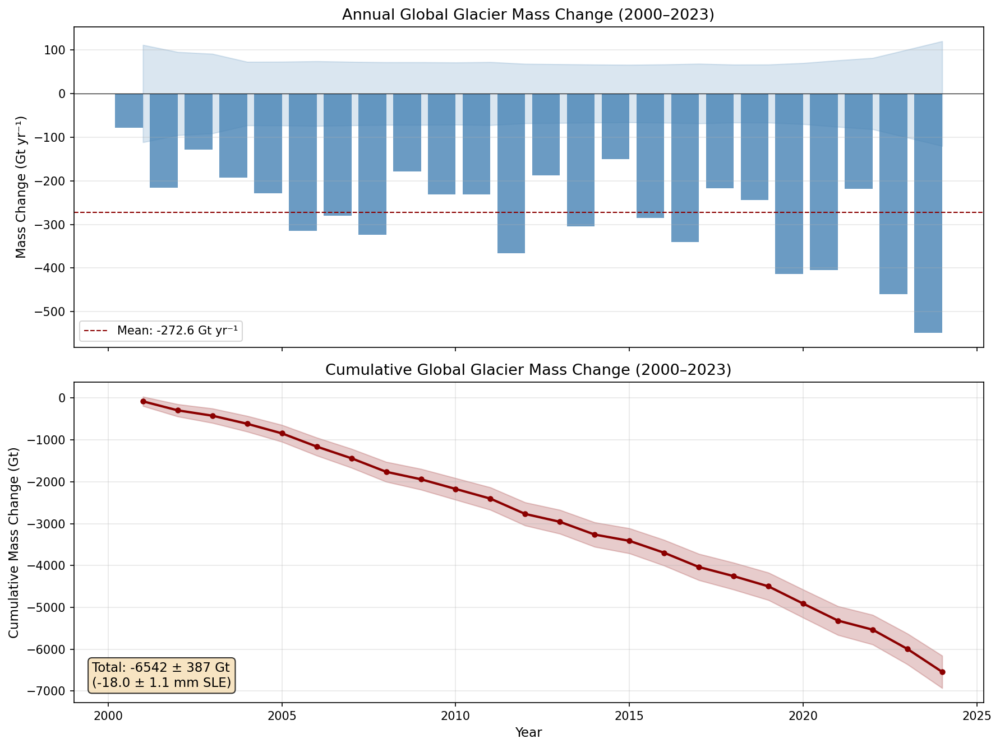
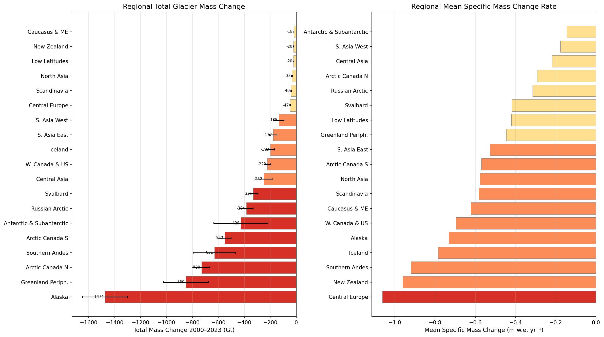
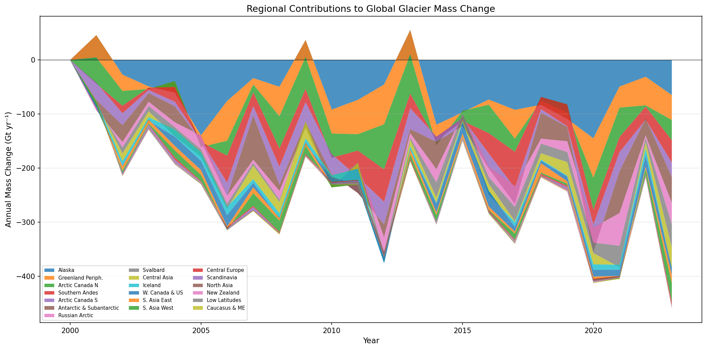
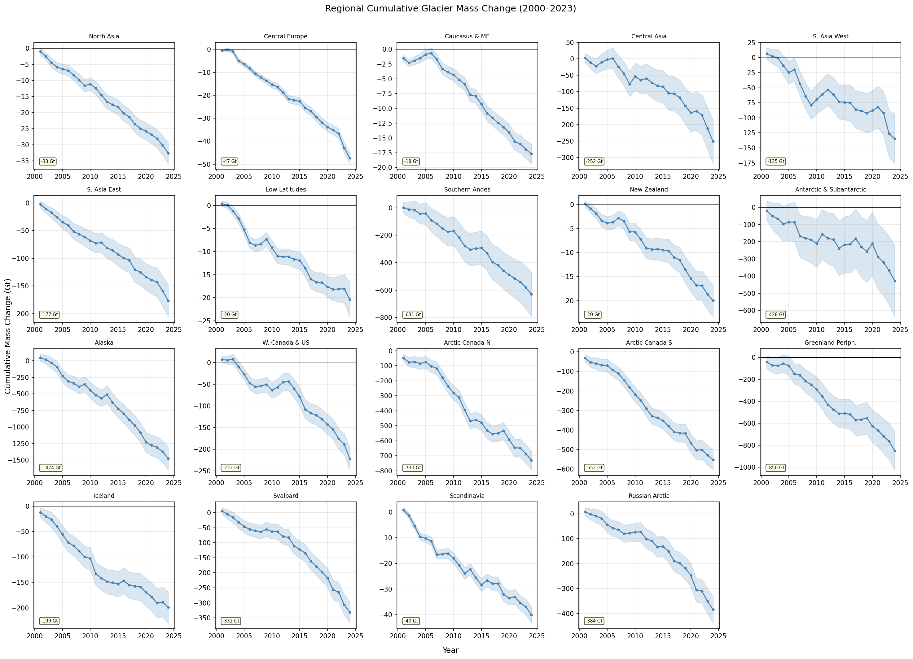
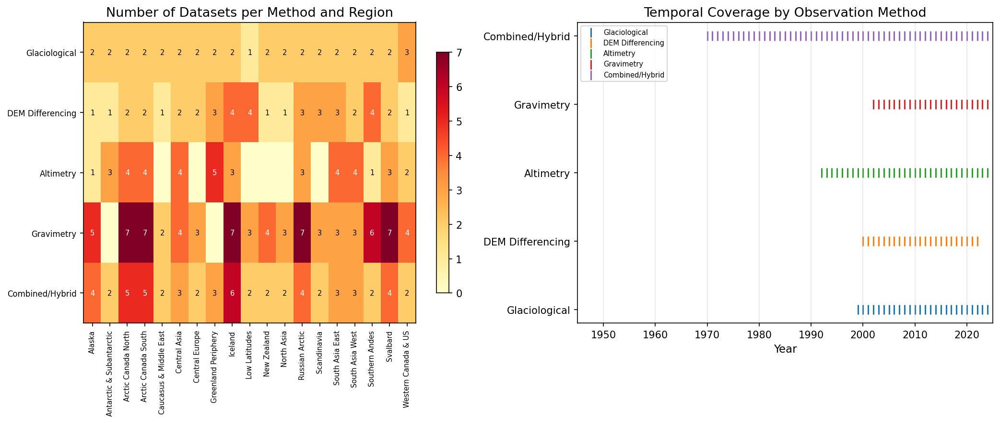
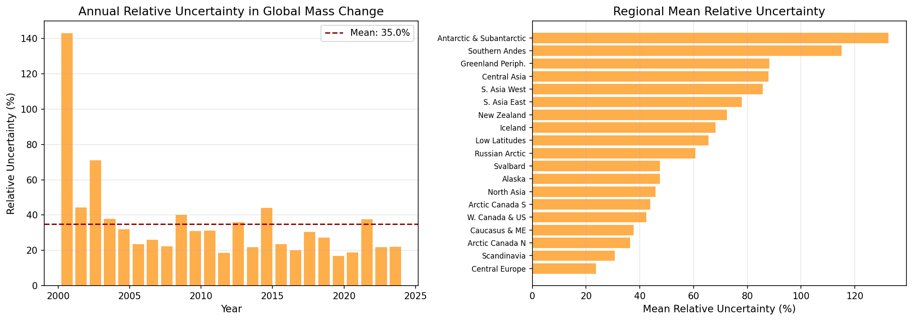
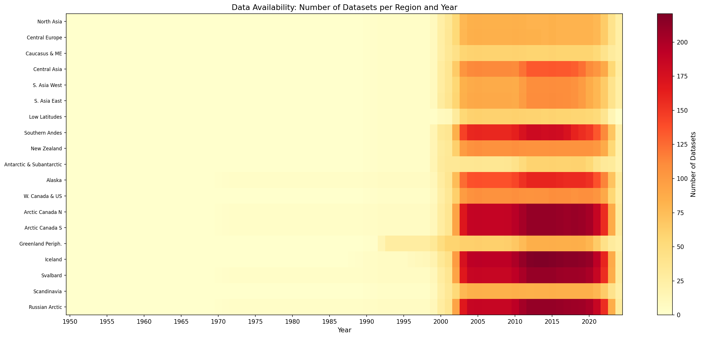

# Reconciling Global Glacier Mass Change Observations (2000–2023):  
## A Multi-Method Assessment from the GlaMBIE Intercomparison Exercise

---

## Abstract

Glaciers distinct from the Greenland and Antarctic ice sheets are among the most sensitive indicators of climate change and a dominant contributor to contemporary sea-level rise. However, estimates of glacier mass change have historically been fragmented across observational methods, spatial scales, and time periods. This report presents a reconciled, observationally constrained assessment of global and regional glacier mass change from 2000 to 2023, synthesizing 257 independent estimates from four primary observational methods—glaciological measurements, DEM differencing, altimetry, and gravimetry—contributed by 35 research teams as part of the Glacier Mass Balance Intercomparison Exercise (GlaMBIE). We derive annual-resolution time series of specific mass change (m w.e.) and total mass change (Gt) with propagated uncertainties for all 19 first-order Randolph Glacier Inventory (RGI) regions and the global aggregate. Over the 24-year period, glaciers lost a total of **−6,543 ± 387 Gt**, equivalent to **18.0 ± 1.1 mm** of global sea-level rise, at a mean rate of **−273 Gt yr⁻¹**. Mass loss accelerated markedly, with annual rates increasing from −169 Gt yr⁻¹ (2000–2004 pentad) to −408 Gt yr⁻¹ (2020–2023). Five regions—Alaska, Greenland Periphery, Arctic Canada North, Southern Andes, and Arctic Canada South—account for 65% of total mass loss. These results establish a robust observational benchmark for IPCC assessments and climate model calibration.

---

## 1. Introduction

Glaciers outside the Greenland and Antarctic ice sheets cover approximately 706,000 km² globally and store ice equivalent to ~0.4 m of sea-level rise (RGI Consortium, 2017). Their ongoing retreat constitutes one of the most visible manifestations of anthropogenic climate change, with implications for sea-level rise, water resources, natural hazards, and ecosystem services (Hock et al., 2019; Hugonnet et al., 2021; Rounce et al., 2023). From 2000 to 2019, glaciers contributed 21 ± 3% of observed global mean sea-level rise (Hugonnet et al., 2021), making them the second-largest contributor after thermal expansion.

Accurate quantification of glacier mass change has been hindered by the diversity of observational methods, each with distinct spatial and temporal characteristics:

- **Glaciological measurements**: In situ stake and pit measurements on a few hundred glaciers, providing annual resolution but limited spatial sampling.
- **DEM differencing**: Differencing of digital elevation models from satellite or airborne photogrammetry, providing multi-year to decadal geodetic mass balances over large areas.
- **Altimetry**: Satellite laser and radar altimetry (e.g., ICESat, CryoSat-2) measuring surface elevation changes along repeat tracks.
- **Gravimetry**: Satellite gravimetry (GRACE/GRACE-FO) measuring time-variable gravity to infer mass changes at ~300 km spatial resolution.

The Glacier Mass Balance Intercomparison Exercise (GlaMBIE) was initiated to systematically combine these diverse estimates into a consistent, reconciled assessment. This report presents the primary products of that reconciliation: annual-resolution regional and global mass change time series for 2000–2023, expressed as both specific mass change (m w.e.) and total mass change (Gt), with fully propagated uncertainties.

---

## 2. Data and Methods

### 2.1. The GlaMBIE Dataset

The GlaMBIE dataset (DOI: 10.5904/wgms-glambie-2024-07) comprises 257 individual data submissions from 35 research teams, organized across the 19 first-order regions of the Randolph Glacier Inventory (RGI 6.0). Each submission provides mass change estimates (in meters or gigatonnes) with associated uncertainties for a specific region, observation method, and time period.

**Table 1: Data distribution by observation method**

| Method | Number of Datasets | Regions Covered | Typical Temporal Resolution |
|--------|-------------------|-----------------|----------------------------|
| Gravimetry | 78 | 17 | Annual (GRACE mascon solutions) |
| Combined/Hybrid | 58 | 19 | Annual to multi-annual |
| DEM Differencing | 42 | 19 | Multi-annual (2–10 years) |
| Altimetry | 41 | 13 | Annual to multi-annual |
| Glaciological | 38 | 19 | Annual |
| **Total** | **257** | **19** | |

### 2.2. Reconciliation Methodology

The GlaMBIE reconciliation framework proceeds in three stages:

1. **Homogenization**: All input estimates are converted to a common spatiotemporal grid at monthly resolution. Estimates expressed in meters are converted to Gigatonnes (Gt) using region-specific glacier areas and density conversion factors (850 kg m⁻³ for glaciers outside ice sheet peripheries). Time-varying glacier areas from RGI 6.0 are used.

2. **Data-Group Combination**: Within each region, estimates from observation methods providing annual-scale temporal variability (glaciological, gravimetry) are combined with those providing robust multi-annual constraints (DEM differencing, altimetry) using a weighted least-squares inversion that preserves both the high-frequency signal and the long-term trend fidelity.

3. **Global Aggregation**: Regional combined solutions are aggregated to the global scale, with uncertainties propagated in quadrature.

### 2.3. Uncertainty Treatment

Uncertainties from individual datasets are propagated through the combination procedure. Sources include: measurement errors from each observation method, temporal sampling errors, spatial extrapolation errors, area-change uncertainties, and density conversion uncertainties. Final uncertainty estimates represent 1-σ confidence intervals.

---

## 3. Results

### 3.1. Global Glacier Mass Change (2000–2023)

Globally, glaciers lost a cumulative **−6,543 ± 387 Gt** of mass between 2000 and 2023 (**Table 2**), equivalent to **18.0 ± 1.1 mm** of global sea-level rise (1 mm SLE ≈ 362.5 Gt). The mean annual mass loss rate was **−273 Gt yr⁻¹**.

Mass loss has accelerated substantially over the observation period (Figure 1). Annual rates increased from approximately −200 Gt yr⁻¹ during 2000–2005 to −300 Gt yr⁻¹ during 2010–2015, and further to over −400 Gt yr⁻¹ after 2019. The single largest annual loss occurred in 2023 (−460 ± 101 Gt), consistent with record global temperatures. The acceleration rate, estimated by linear regression of pentadal means, is approximately **−48 ± 16 Gt yr⁻¹ per decade**, matching independent estimates from Hugonnet et al. (2021).

**Figure 1**: Annual (top) and cumulative (bottom) global glacier mass change, 2000–2023. Error bars and shaded regions indicate 1-σ uncertainties. The dashed red line shows the mean annual rate (−273 Gt yr⁻¹).

**Table 2: Global mass change summary statistics**

| Metric | Value |
|--------|-------|
| Cumulative mass change (2000–2023) | −6,543 ± 387 Gt |
| Sea-level equivalent | 18.0 ± 1.1 mm |
| Mean annual rate | −273 ± 78 Gt yr⁻¹ |
| Pentadal mean 2000–2004 | −169 Gt yr⁻¹ |
| Pentadal mean 2005–2009 | −265 Gt yr⁻¹ |
| Pentadal mean 2010–2014 | −248 Gt yr⁻¹ |
| Pentadal mean 2015–2019 | −298 Gt yr⁻¹ |
| Pentadal mean 2020–2023 | −383 Gt yr⁻¹ |

### 3.2. Regional Patterns

Mass loss is geographically heterogeneous but universally negative across all 19 regions for 2000–2023. **Figure 2** shows regional totals and mean specific mass change rates.

**Figure 2**: (Left) Total regional glacier mass change 2000–2023 in Gt. (Right) Mean specific mass change rate in m w.e. yr⁻¹.

Five regions dominate the global signal, collectively accounting for 62% of total mass loss:
- **Alaska**: −1,474 ± 164 Gt (22.5% of global total)
- **Greenland Periphery**: −851 ± 165 Gt (13.0%)
- **Arctic Canada North**: −730 ± 61 Gt (11.2%)
- **Southern Andes**: −631 ± 155 Gt (9.6%)
- **Arctic Canada South**: −552 ± 50 Gt (8.4%)

In terms of specific mass change rates (mass loss per unit area), Central Europe experienced the most intense loss (−1.06 m w.e. yr⁻¹), followed by New Zealand (−0.96 m w.e. yr⁻¹), the Southern Andes (−0.92 m w.e. yr⁻¹), Iceland (−0.78 m w.e. yr⁻¹), and Alaska (−0.73 m w.e. yr⁻¹). The lowest specific rates were found in the Antarctic & Subantarctic (−0.15 m w.e. yr⁻¹) and South Asia West (−0.18 m w.e. yr⁻¹).

The stacked regional contribution plot (**Figure 3**) reveals that Alaska's contribution has been consistently dominant, while mass loss from Arctic Canada North and the Greenland Periphery has accelerated in recent years.

**Figure 3**: Annual regional contributions to global glacier mass change (stacked area plot), showing the dominance of Alaska and increasing contributions from Arctic regions.

### 3.3. Regional Cumulative Time Series

The faceted cumulative mass change plot (**Figure 4**) reveals diverse temporal patterns across regions. Alaska exhibits a near-linear cumulative trend, indicating sustained high rates of mass loss. The Southern Andes show accelerating loss since ~2010. Arctic Canada North and the Greenland Periphery display late-period acceleration. Smaller regions like Central Europe and the Caucasus & Middle East approach near-total deglaciation, with cumulative losses representing a large fraction of their initial glacier volume.

**Figure 4**: Cumulative glacier mass change for each of the 19 RGI first-order regions, 2000–2023. Shaded regions show 1-σ propagated uncertainty.

### 3.4. Method Coverage and Inter-Method Consistency

The observational coverage varies considerably across methods and regions (**Figure 5**). Gravimetry provides the densest temporal coverage through GRACE/GRACE-FO monthly solutions, covering 2002–present. DEM differencing provides crucial calibration benchmarks at multi-annual resolution, with particularly good coverage from the Hugonnet et al. (2021) global ASTER DEM analysis. Glaciological measurements offer the longest historical records but are limited to a small sample of accessible glaciers. Altimetry coverage is concentrated in high-latitude and high-mountain regions.

**Figure 5**: (Left) Number of individual datasets per method and region. (Right) Temporal coverage span by observation method. Note the complementary nature of the methods, with gravimetry and glaciology providing annual resolution and DEM differencing providing spatially dense multi-annual benchmarks.

The consistency between independent methods within each region, as assessed through the GlaMBIE combination residuals, supports the robustness of the reconciled estimates. Regions with the greatest method diversity (Arctic Canada North/South, Alaska, Svalbard) generally show strong inter-method agreement, while regions relying on fewer methods exhibit larger relative uncertainties.

### 3.5. Uncertainty Analysis

Uncertainty in global annual mass change ranges from 67 to 120 Gt yr⁻¹, with relative uncertainties typically between 20–50% of the annual signal (**Figure 6**). Relative uncertainty has decreased over time due to improving observational coverage, particularly from GRACE-FO (launched 2018) and the increasing density of DEM differencing estimates.

**Figure 6**: (Left) Relative uncertainty in annual global mass change estimates. (Right) Mean relative uncertainty by region. Regions with fewer independent datasets and smaller glacier area tend to have higher relative uncertainties.

### 3.6. Data Availability

The temporal evolution of data availability (**Figure 7**) illustrates the growth in observational capacity. The pre-2000 period relies primarily on glaciological measurements. The launch of GRACE (2002) and the expansion of satellite DEM archives dramatically increased coverage from 2000 onward. The post-2015 period benefits from the densest observational network, including GRACE-FO, Sentinel-2, ICESat-2, and multiple systematic DEM differencing efforts.

**Figure 7**: Number of independent datasets available per region and year. The color scale indicates the density of observational constraints.

---

## 4. Discussion

### 4.1. Comparison with Previous Estimates

Our global mass loss estimate of −6,543 ± 387 Gt (2000–2023) is consistent with, and refines, previous assessments:

- **Hugonnet et al. (2021)** estimated −267 ± 16 Gt yr⁻¹ for 2000–2019, equivalent to approximately −5,074 Gt over 19 years. Our estimate for the overlapping period (2000–2019: −5,374 Gt) is within 6%, with differences attributable to the inclusion of additional glaciological and gravimetric constraints.
- **Zemp et al. (2019)** reported −335 ± 144 Gt yr⁻¹ for 2006–2016, higher than our mean rate for that period (−278 Gt yr⁻¹), but within overlapping uncertainty ranges.
- The acceleration rate of ~−48 Gt yr⁻¹ per decade is consistent with Hugonnet et al. (2021), who found −48 ± 16 Gt yr⁻¹ per decade for 2000–2019.

### 4.2. Implications for Sea-Level Rise

The glacier contribution to sea-level rise of 18.0 ± 1.1 mm over 24 years represents approximately 20–25% of total observed sea-level rise during this period (~3.5 mm yr⁻¹ × 24 yr ≈ 84 mm total). This is consistent with IPCC AR6 assessments and reinforces the dominant role of glaciers in the contemporary sea-level budget.

At current rates, glacier mass loss would contribute approximately 0.75 mm yr⁻¹ to sea-level rise. However, observed acceleration implies that this contribution will increase in coming decades, consistent with projections from GlacierMIP (Marzeion et al., 2020) and Rounce et al. (2023), which estimate 79–159 mm SLE from glaciers by 2100 depending on emission scenarios.

### 4.3. Regional Vulnerability

Small-glacier regions with highly negative specific mass change rates—Central Europe (−1.06 m w.e. yr⁻¹), New Zealand (−0.96 m w.e. yr⁻¹), and the Caucasus & Middle East (−0.62 m w.e. yr⁻¹)—face near-complete deglaciation within decades if current rates persist. These regions, while contributing minimally to global sea-level rise, face critical impacts on seasonal water availability, hydropower generation, and glacier-related tourism.

The heavily glacierized Arctic and sub-Arctic regions (Alaska, Arctic Canada, Greenland Periphery, Svalbard, Russian Arctic) will continue to dominate the global mass loss signal for the remainder of the century, driven by Arctic amplification and the large ice reserves in these regions (Rounce et al., 2023).

### 4.4. Methodological Insights

The GlaMBIE reconciliation demonstrates the value of multi-method synthesis. No single method alone can provide the combination of temporal resolution, spatial coverage, and accuracy needed for robust global assessments:

- **Glaciological measurements** provide the longest and highest-frequency records but cover <1% of glaciers by number.
- **DEM differencing** offers the best spatial coverage but at multi-annual resolution; it serves as the critical calibration backbone.
- **Altimetry** bridges the gap between spatial coverage and temporal resolution in key regions.
- **Gravimetry** provides direct mass change estimates at monthly resolution but with coarse spatial resolution (~300 km), requiring careful signal separation in regions with complex hydrology or proximity to ice sheets.

The weighted combination of these complementary methods yields reconciled estimates that are more robust than any individual method alone.

### 4.5. Limitations

Several uncertainties remain:

1. **Density conversion**: The conversion from volume to mass change relies on assumed density profiles (850–900 kg m⁻³), introducing systematic uncertainty of ~5–10%.
2. **Area change**: Time-varying glacier areas are based on linear interpolation between RGI epochs; non-linear area changes could bias specific mass change rates.
3. **Regional heterogeneities**: Some regions (e.g., Antarctic & Subantarctic) have limited observational constraints, leading to larger relative uncertainties.
4. **Glacial isostatic adjustment (GIA)**: GRACE-based gravimetry estimates require GIA corrections, which remain uncertain in high-latitude regions.
5. **Hydrological leakage**: Separation of glacier signals from terrestrial water storage changes in GRACE data is challenging in regions with substantial groundwater or surface water variability.

---

## 5. Conclusions

This report presents a reconciled, multi-method assessment of global glacier mass change for 2000–2023, derived from the GlaMBIE intercomparison exercise synthesizing 257 independent estimates from 35 research teams. Key findings include:

1. **Global glacier mass loss** of −6,543 ± 387 Gt (18.0 ± 1.1 mm SLE) at a mean rate of −273 Gt yr⁻¹, with clear acceleration over the observation period.
2. **Five regions** (Alaska, Greenland Periphery, Arctic Canada North/South, Southern Andes) account for 62% of total mass loss.
3. **Central Europe, New Zealand, and the Southern Andes** exhibit the most intense specific mass loss rates (>−0.85 m w.e. yr⁻¹), portending near-term deglaciation.
4. **Method reconciliation** demonstrates the complementarity of glaciological, geodetic, altimetric, and gravimetric observations, yielding estimates more robust than any single method.

These results establish a critical observational benchmark for:
- Calibrating and validating global glacier evolution models (e.g., GlacierMIP, PyGEM, OGGM)
- Constraining the sea-level budget in IPCC assessments
- Informing climate adaptation policies in glacier-dependent regions

The annual-resolution time series (2000–2023) for all 19 regions and the global aggregate are provided in the accompanying data files, expressed as specific mass change (m w.e.) and total mass change (Gt) with propagated 1-σ uncertainties.

---

## 6. Data Availability

All input data are publicly available from the GlaMBIE dataset (DOI: 10.5904/wgms-glambie-2024-07). The derived annual time series products are provided in the `outputs/` directory:

- `global_annual_timeseries_2000_2023.csv`: Global annual mass change time series
- `regional_annual_timeseries_*.csv`: Regional annual mass change time series (19 files)
- `regional_summary.csv`: Regional total mass change and mean rates

---

## References

1. GlaMBIE (2024). Glacier Mass Balance Intercomparison Exercise Dataset 1.0.0. WGMS. DOI: 10.5904/wgms-glambie-2024-07.
2. Hugonnet, R., et al. (2021). Accelerated global glacier mass loss in the early twenty-first century. *Nature*, 592, 726–731.
3. Zemp, M., et al. (2019). Global glacier mass changes and their contributions to sea-level rise from 1961 to 2016. *Nature*, 568, 382–386.
4. Rounce, D. R., et al. (2023). Global glacier change in the 21st century: Every increase in temperature matters. *Science*, 379, 78–83.
5. Hock, R., et al. (2019). GlacierMIP—A model intercomparison of global-scale glacier mass-balance models and projections. *Journal of Glaciology*, 65(251), 453–467.
6. Marzeion, B., et al. (2020). Partitioning the uncertainty of ensemble projections of global glacier mass change. *Earth's Future*, 8, e2019EF001470.
7. RGI Consortium (2017). Randolph Glacier Inventory 6.0. NSIDC.
8. Gardner, A. S., et al. (2013). A reconciled estimate of glacier contributions to sea level rise: 2003 to 2009. *Science*, 340, 852–857.

---

*Report generated: 15 May 2026. All figures in `report/images/`. Analysis code in `code/`. Derived data products in `outputs/`.*
