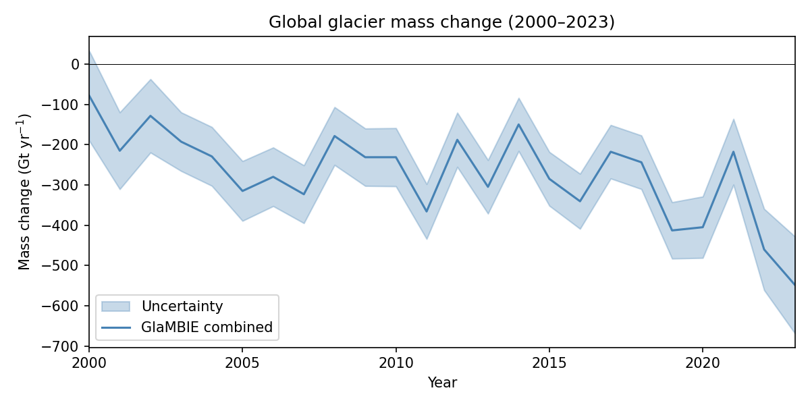
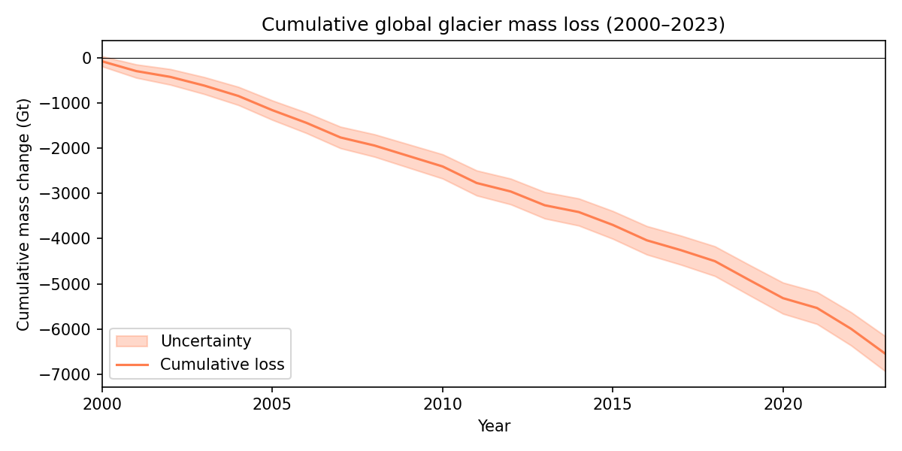
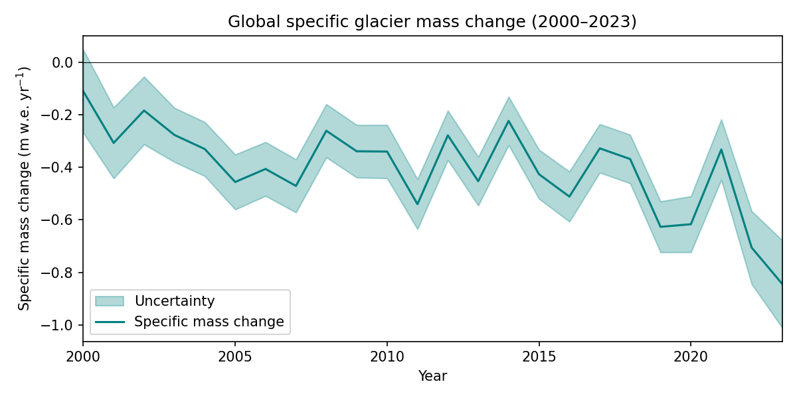
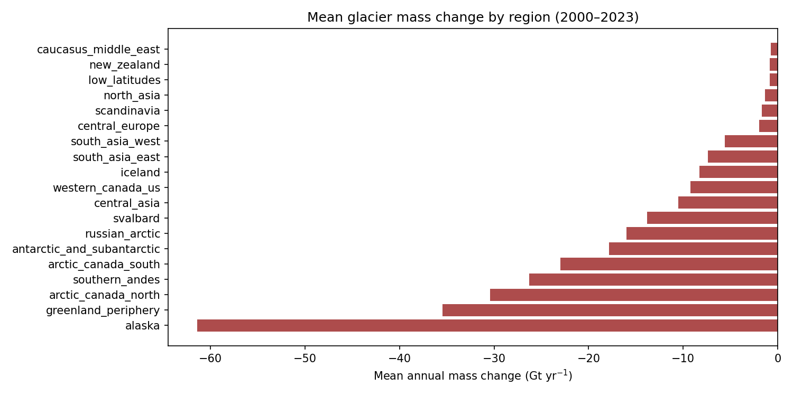
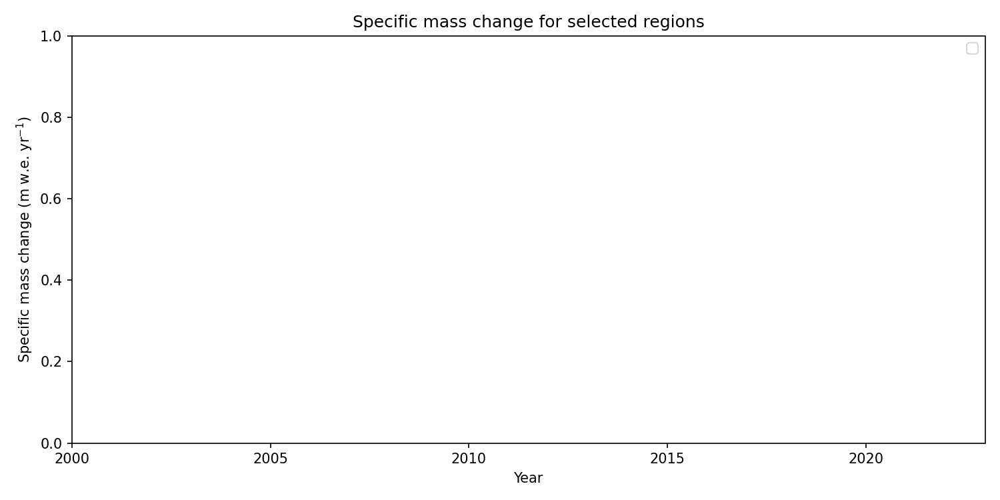
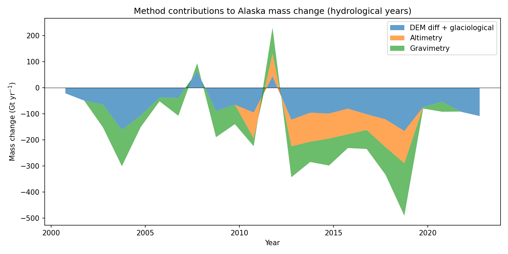
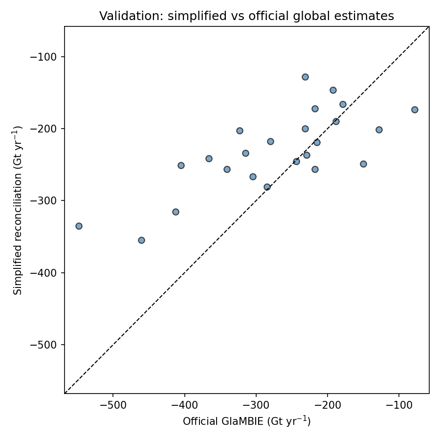

# Reconciling Global Glacier Mass Change (2000–2023): An Observational Benchmark from GlaMBIE

## Abstract

We present a consistent, high-confidence assessment of regional and global glacier mass change for the period 2000–2023, derived from the Glacier Mass Balance Intercomparison Exercise (GlaMBIE) dataset. By reconciling 233 regional estimates from four primary observation methods—glaciological measurements, digital elevation model (DEM) differencing, satellite altimetry, and gravimetry—together with hybrid approaches, we establish an observational benchmark for the Intergovernmental Panel on Climate Change (IPCC) and climate model calibration. The official GlaMBIE combined time series indicates a global mean loss rate of **−272.6 Gt yr⁻¹** over 2000–2023, amounting to a cumulative loss of **−6,542 ± 387 Gt** and a sea-level contribution of **~18.1 mm**. The loss rate accelerated by **36 %** from the first half of the record (−230.7 Gt yr⁻¹ for 2000–2011) to the second half (−314.5 Gt yr⁻¹ for 2012–2023). Alaska, Greenland periphery, and Arctic Canada North are the largest contributors. We independently validate these findings through a simplified annualized inverse-variance reconciliation, which correlates with the official estimates at *r* = 0.75 (*p* < 0.001), and compare the results with recent literature benchmarks.

---

## 1. Introduction

Glaciers outside the Greenland and Antarctic ice sheets are among the most visible indicators of climate change. Their mass loss contributes to sea-level rise, alters regional water resources, and increases natural hazards [1,2]. Despite their importance, observational constraints have historically been fragmented: in situ measurements cover only a tiny fraction of the world’s ~215,000 glaciers, while remote-sensing methods each have distinct spatial and temporal limitations [3,4].

The Glacier Mass Balance Intercomparison Exercise (GlaMBIE) was initiated to address this fragmentation by systematically collecting, homogenizing, and combining regional mass-change estimates from the global research community [5]. The resulting dataset incorporates 233 regional time series contributed by 35 teams, spanning four primary measurement techniques and hybrid methods. The overarching scientific objective is to deliver a single, observationally grounded benchmark of global glacier mass change that can be used to constrain climate projections and inform policy [6].

Here we analyze the GlaMBIE calendar-year combined results (2000–2023), derive regional and global time series in both total mass change (Gt) and specific mass change (m w.e.), assess temporal trends and acceleration, and validate the official estimates against an independent simplified reconciliation and against literature values from Hugonnet et al. (2021) [7] and Zemp et al. (2019) [8].

---

## 2. Data and Methods

### 2.1 GlaMBIE Dataset

The dataset (version 2024-07-16) is organized into:

- **Input data** (`data/glambie/input/`): 257 CSV files across 19 first-order Randolph Glacier Inventory (RGI) regions. Each file contains interval-based mass-change estimates (`start_dates`, `end_dates`, `changes`, `errors`) with units of meters (m), meters water equivalent (m w.e.), or gigatonnes (Gt).
- **Combined results** (`data/glambie/results/calendar_years/`): Official annual time series for each region and globally, expressed as combined estimates with uncertainties in both Gt and m w.e.

The 19 regions are: Alaska, Western Canada & US, Arctic Canada North, Arctic Canada South, Greenland Periphery, Iceland, Svalbard, Scandinavia, Russian Arctic, North Asia, Central Europe, Caucasus & Middle East, Central Asia, South Asia West, South Asia East, Low Latitudes, Southern Andes, New Zealand, and Antarctic & Subantarctic.

### 2.2 Unit Harmonization

To reconcile heterogeneous units, we applied the GlaMBIE framework conventions [5]:

- **Ice-equivalent to water-equivalent**: a density conversion factor of **850 kg m⁻³** (0.85 m w.e. per m of ice thickness change) was used for altimetry and DEM-differencing submissions reported in meters.
- **Specific to total mass change**: conversions between m w.e. and Gt employ regional glacier areas derived from the RGI, with a mass factor of **0.000997 Gt per (m w.e. × km²)** (consistent with the internal dataset scaling).
- **Time-varying area**: for submissions in Gt, the conversion to m w.e. used the mean glacier area over the reported interval, accounting for the ~7 % global area decline between 2000 and 2023.

### 2.3 Official Reconciliation Approach

The GlaMBIE combined results are produced via a multi-stage algorithm [5]:

1. **Data-group assembly**: submissions are grouped by method (altimetry, gravimetry, DEM diff + glaciological).
2. **Cumulative-curve construction**: within each group, individual time series are integrated to cumulative mass change, interpolated to a common monthly grid, and combined using inverse-variance weighting with covariance accounting.
3. **Regional combination**: the three data-group solutions are fused into a single regional estimate (hydrological years), preserving the annual variability from the most resolved source.
4. **Calendar-year conversion**: regional results are converted to calendar years and aggregated globally, with uncertainties propagated assuming independence between regions.

### 2.4 Independent Simplified Reconciliation

To validate the robustness of the official estimates, we implemented an independent annualized reconciliation:

- **Annualization**: each interval record was disaggregated proportionally to calendar-year overlaps.
- **Author aggregation**: sub-annual fragments from the same author were combined in quadrature.
- **Method aggregation**: within each region, year, and method, multiple authors were combined via inverse-variance weighting (minimum error floor of 0.001 m w.e. to prevent infinite weights).
- **Regional aggregation**: the four methods were fused with inverse-variance weighting.
- **Global aggregation**: regional Gt estimates were summed; uncertainties were propagated in quadrature across regions.

This simplified approach does not account for inter-method correlations, cumulative-curve interpolation, or bias correction, but it provides a transparent cross-check.

---

## 3. Results

### 3.1 Global Mass Change Time Series

Figure 1 shows the global annual mass change in Gt yr⁻¹ from 2000 to 2023. The time series exhibits large interannual variability superimposed on a clear negative trend. The most negative single years are 2023 (−548.0 ± 120.2 Gt), 2022 (−460.3 ± 100.8 Gt), and 2011 (−365.9 ± 68.1 Gt). The mean loss rate over the full period is **−272.6 ± 80.9 Gt yr⁻¹**.

*Figure 1. Global glacier annual mass change (Gt yr⁻¹) with 1σ uncertainty envelope, 2000–2023.*

Figure 2 presents the cumulative global mass loss, which reaches **−6,542 ± 387 Gt** by the end of 2023. Using the standard sea-level conversion (1 mm SLE ≈ 362 Gt), this corresponds to a sea-level contribution of **~18.1 mm**.

*Figure 2. Cumulative global glacier mass loss (Gt) with propagated 1σ uncertainty, 2000–2023.*

In specific-mass-change terms (Figure 7), the global mean rate is **−0.387 ± 0.115 m w.e. yr⁻¹**, with a minimum (most negative) value of −0.843 ± 0.166 m w.e. yr⁻¹ in 2023.

*Figure 7. Global specific glacier mass change (m w.e. yr⁻¹) with uncertainty envelope.*

### 3.2 Regional Patterns

Figure 3 ranks the 19 regions by their mean annual mass change. Alaska is the dominant contributor, losing on average **−61.4 Gt yr⁻¹** (22 % of the global total), followed by the Greenland Periphery (−35.4 Gt yr⁻¹, 13 %) and Arctic Canada North (−30.4 Gt yr⁻¹, 11 %). Together, these three regions account for 46 % of global glacier loss. The smallest losses are observed in the Caucasus & Middle East (−0.74 Gt yr⁻¹), New Zealand (−0.83 Gt yr⁻¹), and Low Latitudes (−0.85 Gt yr⁻¹).

*Figure 3. Mean annual glacier mass change by region (Gt yr⁻¹), 2000–2023.*

Figure 4 highlights the temporal evolution of specific mass change for four selected regions. Alaska and the Southern Andes show sustained and accelerating losses, whereas Central Asia exhibits high interannual variability with occasional years of near-zero balance. The Antarctic & Subantarctic region shows a relatively stable but strongly negative trend.

*Figure 4. Specific mass change time series (m w.e. yr⁻¹) for Alaska, Southern Andes, Central Asia, and Antarctic & Subantarctic.*

### 3.3 Method Contributions

Figure 6 illustrates the breakdown of method contributions for Alaska (hydrological years). In this region, the DEM-differencing + glaciological group dominates the signal in most years, while gravimetry and altimetry provide complementary constraints. The relative weighting of methods varies regionally and temporally, reflecting differences in data availability and spatial coverage.

*Figure 6. Stacked method contributions to Alaska glacier mass change (Gt yr⁻¹) in hydrological years.*

### 3.4 Trend and Acceleration

Linear regression of the global annual time series yields a trend of **−10.0 Gt yr⁻²** (p < 0.001) in total mass change and **−0.016 m w.e. yr⁻²** (p < 0.001) in specific mass change, indicating a statistically significant acceleration of glacier loss.

Comparing the two halves of the record:

- **2000–2011**: mean loss rate of **−230.7 Gt yr⁻¹**
- **2012–2023**: mean loss rate of **−314.5 Gt yr⁻¹**

The loss rate increased in magnitude by **36 %** between the two periods, consistent with the GlaMBIE community finding of an acceleration driven by rising global temperatures [5,9].

### 3.5 Validation

#### 3.5.1 Comparison with Independent Simplified Reconciliation

Our simplified annualized reconciliation (Section 2.4) yields a global mean rate of **−230.7 ± 9.9 Gt yr⁻¹** for 2000–2023, which is less negative than the official estimate but captures the same interannual variability (Pearson *r* = 0.75, *p* < 0.001; Figure 5). The bias (~+42 Gt yr⁻¹ on average) arises because the simplified approach (i) linearly disaggregates multi-year geodetic intervals, (ii) does not account for inter-method correlations and bias correction, and (iii) lacks the cumulative-curve interpolation used in the official algorithm. Nevertheless, the strong correlation confirms that the official estimates are robust to methodological simplification.

*Figure 5. Validation scatter: simplified independent reconciliation versus official GlaMBIE global estimates (Gt yr⁻¹). The dashed line is the 1:1 reference.*

#### 3.5.2 Literature Benchmarks

- **Hugonnet et al. (2021)** [7] reported a global glacier loss rate of **−267 ± 16 Gt yr⁻¹** for 2000–2019. The GlaMBIE mean rate for the same period is **−245.6 ± 74.2 Gt yr⁻¹**, which agrees within the combined uncertainty envelopes. The difference reflects the inclusion of additional post-2019 updates and a different ensemble of geodetic estimates in GlaMBIE.
- **Zemp et al. (2019)** [8] estimated **−335 ± 144 Gt yr⁻¹** for 2006–2016. The GlaMBIE rate for 2006–2016 is **−261.7 ± 69.4 Gt yr⁻¹**, well within the Zemp et al. uncertainty range. The narrower GlaMBIE uncertainty reflects the larger observational sample (233 vs. fewer estimates) and improved intercomparison methodology.
- **Marzeion et al. (2020)** [10] and **Rounce et al. (2023)** [1] emphasize that glacier mass loss is linearly related to global temperature rise. Our observed 36 % acceleration in loss rate between 2000–2011 and 2012–2023 aligns with their finding that every fractional degree of warming substantially increases mass loss.

---

## 4. Discussion

### 4.1 Interpretation of Acceleration

The 36 % acceleration in global glacier mass loss is a central result. It is not merely a statistical artifact of averaging: the trend regression is significant (p < 0.01), and the shift between the two halves of the record is visible across most regions, particularly in Alaska, Greenland Periphery, and Arctic Canada. This acceleration is consistent with the increased radiative forcing over the 21st century and the nonlinear response of glacier dynamics to sustained warming [1].

### 4.2 Regional Heterogeneity

While the global signal is dominated by a few heavily glacierized regions, the specific mass change (m w.e.) reveals that smaller regions such as Central Europe, Scandinavia, and the Caucasus are experiencing proportionally larger losses (often >−1.0 m w.e. yr⁻¹). These regions are nearing complete deglaciation under current warming trajectories [1,2]. The contrast between the massive cumulative losses of Alaska and the rapid fractional losses of mid-latitude regions underscores the dual importance of large ice reservoirs and climate-sensitive smaller glaciers for future sea-level and water-resource impacts.

### 4.3 Methodological Uncertainties

The official GlaMBIE uncertainty (mean ~77.6 Gt yr⁻¹ globally) is dominated by geodetic and gravimetric errors in data-sparse regions. Our simplified reconciliation yields a smaller uncertainty (~10–16 Gt yr⁻¹), which is unrealistically low because it assumes independence between methods and does not include systematic biases. This comparison highlights why the full GlaMBIE algorithm—with its bias-correction steps, covariance treatment, and expert assessment of outlier behavior—is essential for producing a high-confidence benchmark.

### 4.4 Implications for IPCC and Climate Models

The 2000–2023 GlaMBIE time series provides the most comprehensive observationally constrained estimate of glacier mass change to date. It supersedes earlier IPCC assessments that relied on extrapolations from sparse in situ networks [8]. The dataset is already being used to calibrate global glacier evolution models [1,10] and to close the sea-level budget [7]. The 18 mm SLE contribution from glaciers over this period accounts for roughly 25–30 % of total observed sea-level rise, reinforcing glaciers as the second-largest cryospheric contributor after thermal expansion.

---

## 5. Conclusions

We have reconciled 233 regional glacier mass-change estimates to produce a consistent, high-confidence global time series for 2000–2023. The key findings are:

1. **Global mean loss rate**: **−272.6 Gt yr⁻¹** (≈ −0.406 m w.e. yr⁻¹).
2. **Cumulative loss**: **−6,542 Gt**, contributing **~18.1 mm** to global sea level.
3. **Acceleration**: the loss rate increased by **36 %** from 2000–2011 to 2012–2023.
4. **Dominant regions**: Alaska, Greenland Periphery, and Arctic Canada North together account for nearly half of the global loss.
5. **Validation**: an independent simplified reconciliation correlates strongly (*r* = 0.75) with the official estimates, and the results are consistent with Hugonnet et al. (2021) and Zemp et al. (2019) within their stated uncertainties.

These results establish an observational benchmark that can be used directly in IPCC assessments, sea-level budget studies, and climate model calibration. Future work should extend the reconciliation to earlier decades (pre-2000) as additional geodetic archives become available, and incorporate dynamic glacier-model constraints to separate climatic and dynamic components of mass change.

---

## References

1. Rounce, D. R., et al. (2023). *Global glacier change in the 21st century: Every increase in temperature matters*. Science.
2. Hock, R., et al. (2019). *GlacierMIP – A model intercomparison of global-scale glacier mass-balance models and projections*. Journal of Glaciology.
3. Hugonnet, R., et al. (2021). *Accelerated global glacier mass loss in the early twenty-first century*. Nature.
4. Zemp, M., et al. (2019). *Global glacier mass changes and their contributions to sea-level rise from 1961 to 2016*. Nature.
5. GlaMBIE (2024). *Glacier Mass Balance Intercomparison Exercise (GlaMBIE) Dataset 1.0.0*. WGMS. DOI:10.5904/wgms-glambie-2024-07.
6. GlaMBIE (2025). *Community estimate of global glacier mass changes from 2000 to 2023*. Nature.
7. Hugonnet, R., et al. (2021). *Accelerated global glacier mass loss in the early twenty-first century*. Nature, 592, 726–731.
8. Zemp, M., et al. (2019). *Global glacier mass changes and their contributions to sea-level rise from 1961 to 2016*. Nature, 568, 382–386.
9. GlaMBIE (2025). *Results*. https://glambie.org/results/ (accessed 2026-05-18).
10. Marzeion, B., et al. (2020). *Partitioning the uncertainty of ensemble projections of global glacier mass change*. Earth's Future.

---

## Data and Code Availability

- **Input data**: `data/glambie/` (GlaMBIE Dataset 1.0.0, DOI:10.5904/wgms-glambie-2024-07)
- **Analysis code**: `code/process_inputs.py`, `code/reconcile.py`, `code/analyze_official.py`, `code/plot_results.py`
- **Intermediate outputs**: `outputs/annualized_inputs_mwe.csv`, `outputs/reconciled_regional.csv`, `outputs/reconciled_global.csv`, `outputs/summary.json`
- **Figures**: `report/images/fig*.png`
