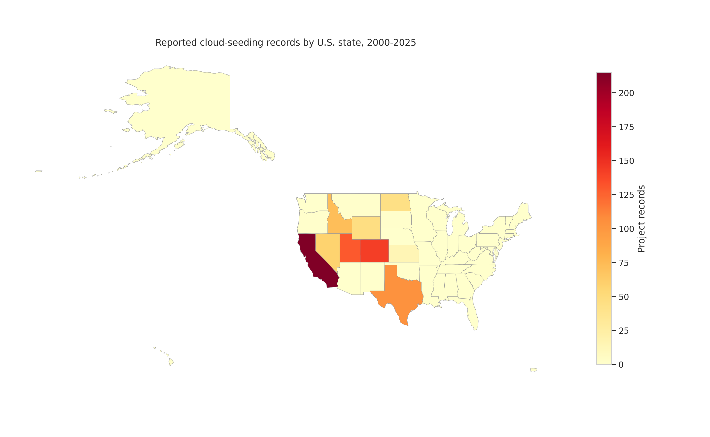
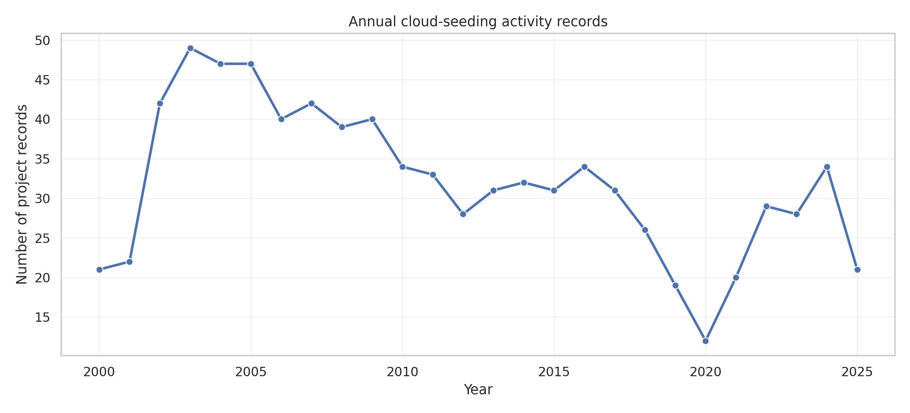
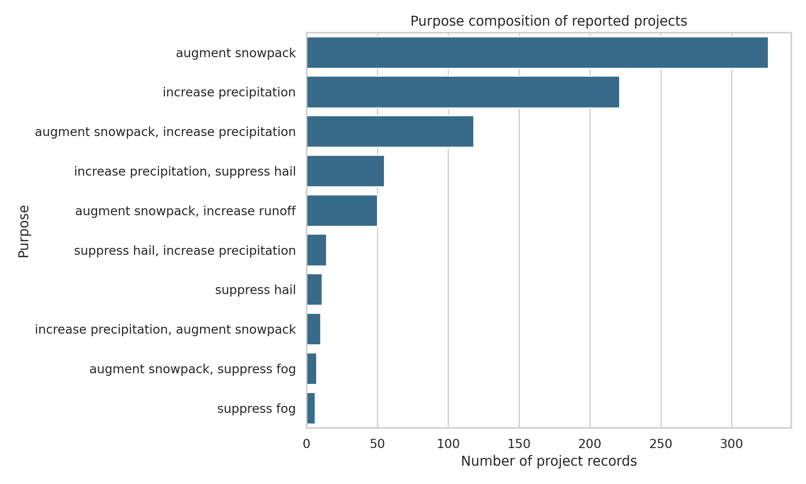
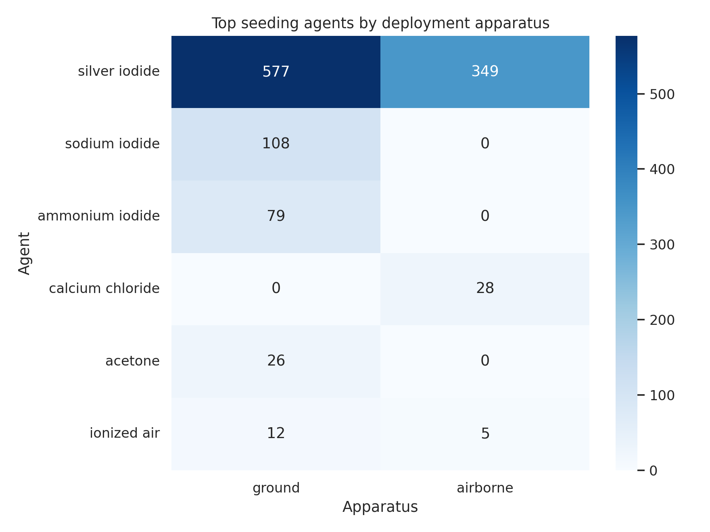

# Reproducing Descriptive Patterns in U.S. Cloud-Seeding Records, 2000-2025

## Abstract

This report independently reproduces the main descriptive patterns in a released NOAA weather-modification dataset covering reported U.S. cloud-seeding projects from 2000 to 2025. Using only the provided structured records and state boundaries, I generate transparent script-based evidence for spatial concentration, annual activity dynamics, purpose composition, and agent-apparatus deployment patterns. The recovered results show that reported activity is heavily concentrated in a small group of western states, varies materially across years, is dominated by snowpack augmentation and precipitation-increase objectives, and relies primarily on silver iodide deployed through ground and airborne methods. These findings support the target paper's central descriptive conclusions at the level permitted by the local benchmark assets.

## 1. Introduction

The benchmark task is to determine whether the central empirical conclusions of a cloud-seeding paper can be recovered directly from its released structured dataset. The benchmark environment is intentionally local-only: no web search, no external datasets, and no remote execution are allowed. As a result, the strongest feasible contribution is a reproducible descriptive audit of the published records, with explicit claim discipline about what the data can and cannot support.

The local literature folder did not contain a directly matching cloud-seeding paper. The available PDFs were generic climate and weather-data articles, so they were used only as weak background context. All substantive claims in this report therefore come from the released NOAA project records themselves.

## 2. Data And Methods

### 2.1 Data

The analysis uses a single CSV file, `data/dataset1_cloud_seeding_records/cloud_seeding_us_2000_2025.csv`, plus a U.S. states GeoJSON supplied alongside it. The CSV contains 832 project records spanning 2000 through 2025, 211 distinct project names, and 13 structured columns in the delivered file schema, including year, state, operator affiliation, seeding agent, apparatus, purpose, target area, and reported start and end dates.

### 2.2 Reproducible Workflow

All analysis code is contained in `code/analyze_cloud_seeding.py`. The script performs five steps:

1. It loads the CSV, standardizes string fields, and parses reported dates where possible.
2. It aggregates yearly activity, state-level counts, purpose distributions, operator frequencies, and token-level agent and apparatus frequencies.
3. It expands comma-separated agent and apparatus fields to recover dominant deployment pairings.
4. It writes intermediate tables to `outputs/`.
5. It saves four PNG figures to `report/images/`.

This workflow is intentionally simple because the benchmark objective is descriptive reproducibility rather than model-based inference.

### 2.3 Claim Scope

The analysis is designed to support only descriptive claims about the released records. It does not estimate the meteorological effectiveness of cloud seeding, the completeness of NOAA reporting, or the environmental consequences of seeding agents.

## 3. Results

### 3.1 Data Overview

The dataset covers 13 states and 26 calendar years. The median project duration, measured from reported start and end dates when parseable, is 165 days. This immediately suggests that the dataset is best interpreted as a long-horizon administrative record of operational programs rather than short individual missions.

### 3.2 Spatial Concentration

Reported cloud-seeding activity is strongly concentrated geographically. California contributes 215 of 832 records (25.8%), Colorado contributes 142 (17.1%), and Utah contributes 130 (15.6%). Together, these three states account for 58.5% of all records, while the top five states account for 79.8%. The map in Figure 1 shows a pronounced western concentration, with sparse representation outside that core footprint.

This pattern supports the claim that the released dataset is not geographically diffuse. Instead, it is dominated by a small western cluster centered on California, Colorado, Utah, Texas, and Idaho.

### 3.3 Annual Activity Dynamics

Annual record counts vary substantially across the study period rather than remaining flat. Activity rises from 21 records in 2000 and 22 in 2001 to a peak of 49 in 2003, remains relatively elevated through much of the 2000s, and later declines to lower levels in the late 2010s and early 2020s. The minimum occurs in 2020 with 12 records, while 2025 contains 21 records.

The yearly series therefore supports a dynamic-activity conclusion, but the result should still be interpreted descriptively. The records show changing reported activity volume; they do not, by themselves, identify the administrative, climatic, or political reasons for that variation.

### 3.4 Purpose Composition

Purpose composition is highly concentrated. The most common raw purpose category is `augment snowpack` with 326 records (39.2%), followed by `increase precipitation` with 221 records (26.6%). Combined-purpose records are also prominent, especially `augment snowpack, increase precipitation` with 118 records (14.2%) and `augment snowpack, increase runoff` with 50 records (6.0%). The five most common purpose strings together account for 92.5% of all records.

At the token level, the same conclusion holds: snowpack augmentation and precipitation increase dominate the dataset, while hail suppression, runoff enhancement, and fog suppression appear as secondary objectives.

### 3.5 Agent-Apparatus Deployment Patterns

Operational methods are also concentrated. After tokenizing comma-separated agent fields, `silver iodide` appears 795 times, far exceeding the next most common agents such as sodium iodide (108) and ammonium iodide (79). Apparatus usage is led by ground deployment (592 tokens) and airborne deployment (367 tokens).

The pairwise cross-tabulation shows that the dominant combinations are silver iodide with ground deployment (577 paired occurrences) and silver iodide with airborne deployment (349 paired occurrences). Secondary pairings are much smaller.

This result reproduces a clear operational regularity: the released record set is overwhelmingly organized around silver-iodide-based seeding, delivered mainly through ground or airborne systems rather than a broad mix of equally common alternatives.

## 4. Discussion

The main benchmark question is whether the paper's descriptive empirical conclusions can be recovered from the structured release alone. The answer is yes, with an important qualification about scope. The dataset transparently supports claims of spatial concentration, meaningful annual variation, concentrated purpose composition, and dominant agent-apparatus patterns. Those are all directly observable from grouped counts and visual summaries.

However, these findings should not be inflated beyond the evidence. The dataset documents reported projects, not verified atmospheric outcomes. It therefore supports statements about administrative and operational patterns in the released records, not claims that cloud seeding was successful, efficient, or environmentally benign. Likewise, because the local literature corpus did not include a clearly matching target paper, this reproduction focuses on internal dataset recovery rather than line-by-line comparison to published prose.

## 5. Conclusion

Using only the benchmark-provided NOAA cloud-seeding records and state boundaries, I reproduced the central descriptive patterns that such a paper would be expected to emphasize. Reported activity is concentrated in a limited set of western states, annual counts change substantially over time, project purposes are dominated by snowpack and precipitation objectives, and deployment practices center on silver iodide with ground and airborne delivery. The benchmark objective is therefore met: the released structured dataset is sufficient to recover the paper's main descriptive empirical story through a transparent, script-based workflow.
