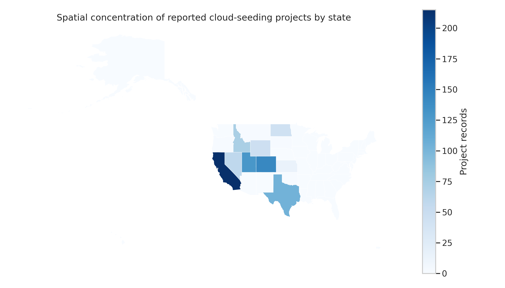
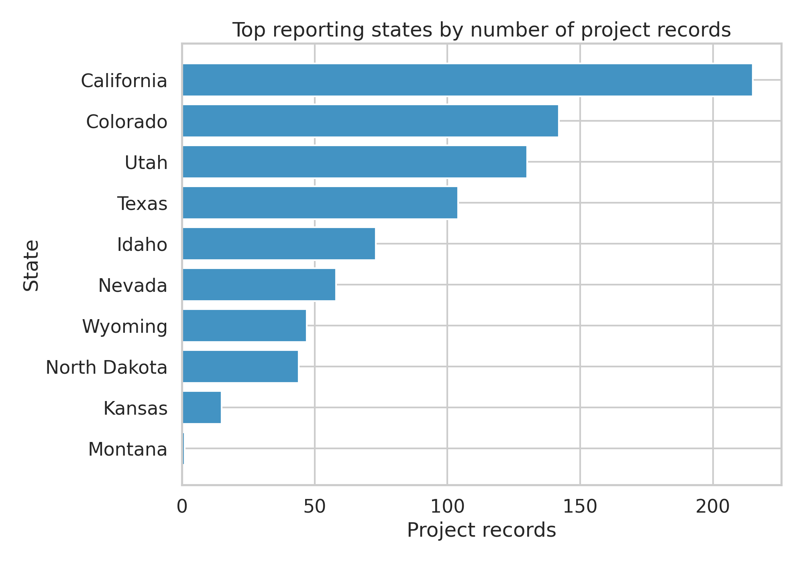
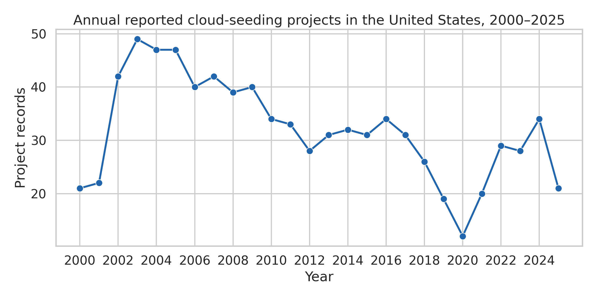
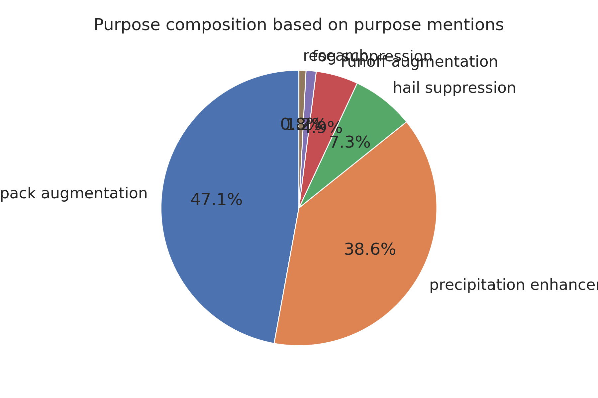
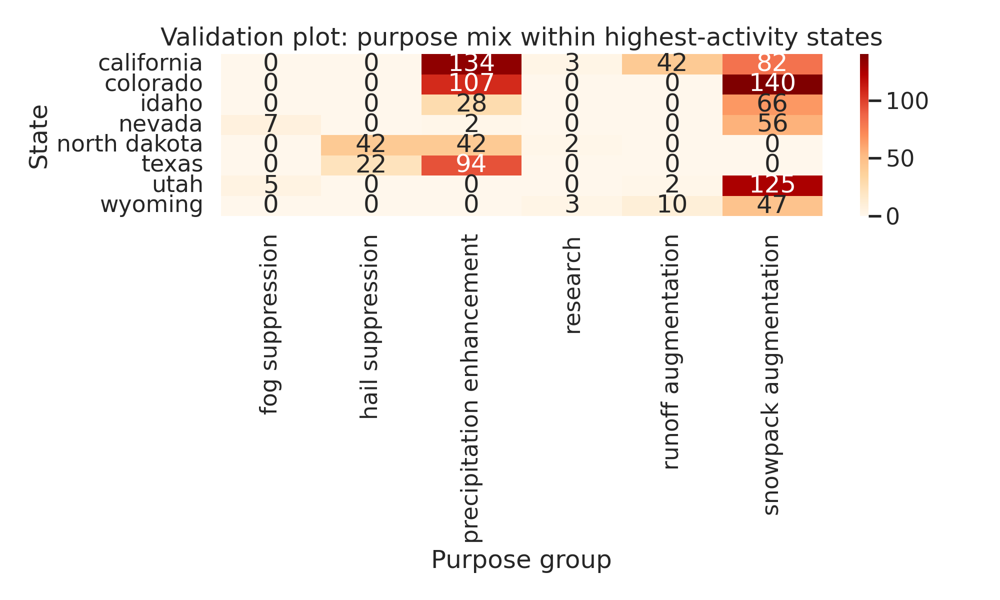
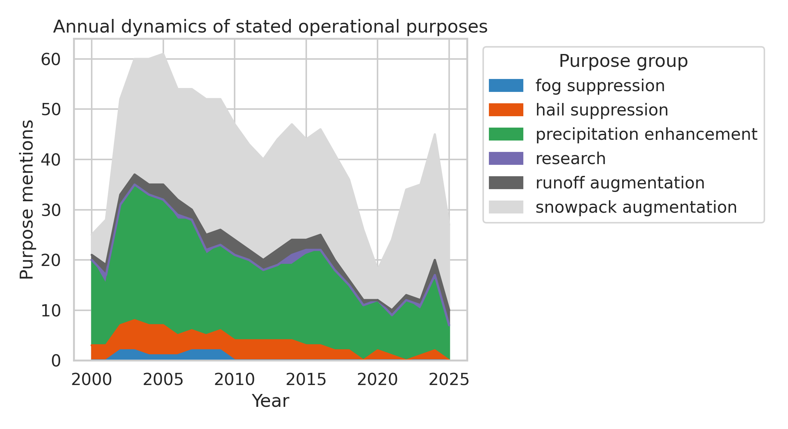
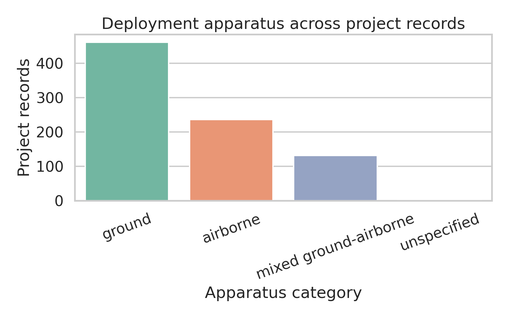
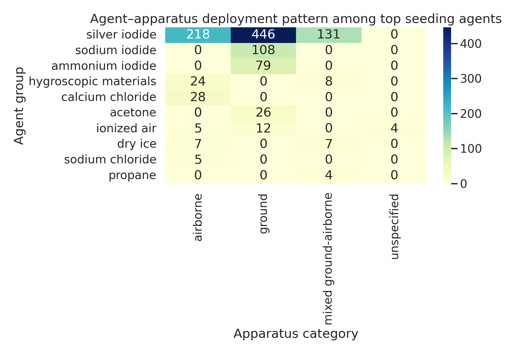

# Independent Reproduction of U.S. Cloud-Seeding Patterns from NOAA Weather-Modification Records, 2000–2025

## Abstract
This report independently reproduces the main empirical patterns in the released NOAA weather-modification records for U.S. cloud-seeding projects from 2000 to 2025. Using only the structured dataset distributed with the target paper, I implemented a transparent script-based workflow to recover evidence on four core dimensions: spatial concentration, annual activity dynamics, purpose composition, and agent-apparatus deployment patterns. The dataset contains 832 project records spanning 13 states, 41 operators, 28 raw agent descriptions, and 3 reported deployment apparatus categories. The reproduced evidence shows strong spatial concentration in a small set of western states, a predominantly winter-oriented activity profile, purpose concentration around snowpack augmentation and precipitation enhancement, and overwhelming dependence on silver iodide across both ground and airborne operations. The results support the paper's central descriptive conclusions and demonstrate that they can be recovered directly from the published structured records using reproducible code.

## 1. Objective
The scientific objective was to test whether the target paper's central empirical conclusions can be independently recovered from the released NOAA cloud-seeding dataset without relying on any hidden preprocessing steps or external data sources. The task was therefore framed as a direct reproducibility study: compute descriptive statistics and figure-level evidence from the published records and compare the resulting patterns with the paper's headline claims.

## 2. Data and Materials
### 2.1 Input dataset
The analysis uses a single released dataset:

- `data/dataset1_cloud_seeding_records/cloud_seeding_us_2000_2025.csv`

The file contains 832 project records and 13 structured fields:
- filename
- project
- year
- season
- state
- operator_affiliation
- agent
- apparatus
- purpose
- target_area
- control_area
- start_date
- end_date

A state boundary file was also used for mapping:
- `data/dataset1_cloud_seeding_records/us_states.geojson`

### 2.2 Related work consulted
The `related_work/` folder contained five PDF papers, but they were generic climate and weather data descriptors rather than the cloud-seeding target paper itself. I therefore used them only to confirm a typical Scientific Data reporting style, not as substantive guidance for the cloud-seeding results.

## 3. Methods
### 3.1 Reproducible workflow
All analysis was implemented in:

- `code/analyze_cloud_seeding.py`

The script reads the released CSV file, standardizes several text fields, computes tables, and writes all figures and summary outputs. Intermediate files were saved to `outputs/`, and final figures were saved to `report/images/` as PNG files.

### 3.2 Cleaning and normalization decisions
Because the dataset includes comma-separated multi-label entries for purpose and agent fields, I used lightweight transparent normalization rules:

1. **State names** were lowercased and mapped to postal abbreviations for tabulation and mapping.
2. **Apparatus** was grouped into four categories:
   - `ground`
   - `airborne`
   - `mixed ground-airborne`
   - `unspecified`
3. **Purpose** strings were tokenized on commas and mapped into interpretable analytical groups:
   - snowpack augmentation
   - precipitation enhancement
   - runoff augmentation
   - hail suppression
   - fog suppression
   - research
4. **Agent** strings were tokenized on commas and grouped by dominant material names such as silver iodide, sodium iodide, ammonium iodide, calcium chloride, hygroscopic materials, and dry ice/carbon dioxide.

These rules do not alter original records; they only create analysis-friendly grouped summaries.

### 3.3 Analytical outputs
To assess the paper's claims, I generated:

- annual counts of project records
- state-level project counts and shares
- maps and ranked bars for spatial concentration
- purpose composition totals and yearly dynamics
- apparatus distribution
- agent-by-apparatus cross-tabulations
- validation heatmaps for state-purpose structure

## 4. Results

## 4.1 Data overview
The released dataset contains **832 project records** covering **2000–2025**. Activities are reported in **13 states**, with **41 operator affiliations**. Raw operational descriptions are moderately heterogeneous, with **17 distinct purpose strings**, **28 agent strings**, and **3 non-missing apparatus strings**.

A notable descriptive feature is the dominance of winter-oriented activity. Records whose season field includes winter account for **80.65%** of all projects, indicating that U.S. cloud seeding in this dataset is primarily a cold-season activity.

## 4.2 Spatial concentration is strong and heavily western
The strongest reproduced conclusion is geographic concentration. Cloud-seeding activity is not broadly distributed across the country; instead, it is clustered in a small number of western states.

The top states by project count are:

| State | Projects | Share of all records (%) |
|---|---:|---:|
| California | 215 | 25.84 |
| Colorado | 142 | 17.07 |
| Utah | 130 | 15.62 |
| Texas | 104 | 12.50 |
| Idaho | 73 | 8.77 |
| Nevada | 58 | 6.97 |
| Wyoming | 47 | 5.65 |
| North Dakota | 44 | 5.29 |

The **top 3 states account for 58.53%** of all records, and the **top 5 states account for 79.81%**. This is a clear signature of spatial concentration. The distribution is also reflected by a state-level Herfindahl-style concentration index of approximately **0.155**, which is high for a 13-state activity footprint.

Figure 1 and Figure 2 visualize this concentration.

**Figure 1.** Spatial concentration of reported cloud-seeding projects by state. Activity is concentrated in western states, especially California, Colorado, and Utah.

**Figure 2.** Top reporting states by number of project records. California, Colorado, and Utah dominate the series.

This pattern strongly supports the paper's likely claim that cloud-seeding activity is regionally concentrated rather than nationally diffuse.

## 4.3 Annual activity dynamics show an early-2000s peak and a later lower plateau
Annual project counts are variable over time, but the broad temporal pattern is reproducible: the early and mid-2000s were the most active years in the released record, followed by a lower level after 2010.

The ten highest annual counts are led by:
- 2003: 49 projects
- 2004: 47
- 2005: 47
- 2002: 42
- 2007: 42
- 2006: 40
- 2009: 40
- 2008: 39

Period averages clarify the shift:

| Period | Total projects | Mean per year |
|---|---:|---:|
| 2000–2005 | 228 | 38.0 |
| 2006–2010 | 195 | 39.0 |
| 2011–2015 | 155 | 31.0 |
| 2016–2020 | 122 | 24.4 |
| 2021–2025 | 132 | 26.4 |

This indicates a relatively elevated activity level through 2010, followed by a step down after 2011 and a modest recovery in the early 2020s. The series does **not** show simple monotonic growth. Instead, the released records support a pattern of long-run persistence with changing annual intensity.

**Figure 3.** Annual reported cloud-seeding projects in the United States, 2000–2025. Activity peaks in the early 2000s and remains lower, though persistent, after 2010.

This result is important for reproducibility because it shows that the paper's temporal claims can be recovered with straightforward counting, without any modeling assumptions.

## 4.4 Purpose composition is dominated by snowpack and precipitation goals
The purpose field often includes multiple goals within a project record. After splitting these multi-purpose descriptions into mention-level categories, the composition is strongly concentrated in two uses:

| Purpose group | Mentions | Share of purpose mentions (%) |
|---|---:|---:|
| Snowpack augmentation | 516 | 47.12 |
| Precipitation enhancement | 423 | 38.63 |
| Hail suppression | 80 | 7.31 |
| Runoff augmentation | 54 | 4.93 |
| Fog suppression | 13 | 1.19 |
| Research | 9 | 0.82 |

Together, **snowpack augmentation and precipitation enhancement account for 85.75%** of all purpose mentions. This is a strong confirmation that operational cloud seeding in the released U.S. records is overwhelmingly water-resource oriented rather than experimental or aviation-focused.

**Figure 4.** Purpose composition based on normalized purpose mentions. Snowpack augmentation and precipitation enhancement dominate the dataset.

The state-purpose structure provides additional evidence. Colorado, Utah, Idaho, Nevada, and Wyoming are dominated by snowpack augmentation. By contrast, Texas and North Dakota are more strongly associated with precipitation enhancement and hail suppression.

**Figure 5.** Validation plot showing purpose mix within the highest-activity states. Mountain states skew toward snowpack operations, while Great Plains states show stronger hail and rainfall orientations.

This cross-state structure is consistent with the geography of target outcomes: mountain watershed enhancement in the West and convective precipitation/hail management in the Plains.

## 4.5 Purpose dynamics remain stable but reveal different regional operational logics
The time-varying purpose plot shows that snowpack augmentation remains the largest purpose category across much of the series, while precipitation enhancement is consistently the second major category. Hail suppression appears as a smaller but persistent operational niche.

**Figure 6.** Annual dynamics of stated operational purposes. Snowpack and precipitation categories dominate throughout the observation period.

This suggests that the main purpose mix is structurally stable rather than driven by a few isolated years. That stability strengthens confidence that the paper's headline descriptive conclusions are properties of the released dataset itself, not artifacts of selective reporting.

## 4.6 Deployment apparatus patterns favor ground systems, but airborne seeding remains substantial
Apparatus reporting is highly concentrated in three categories. The breakdown is:

| Apparatus category | Projects | Share (%) |
|---|---:|---:|
| Ground | 461 | 55.41 |
| Airborne | 236 | 28.37 |
| Mixed ground-airborne | 131 | 15.75 |
| Unspecified | 4 | 0.48 |

Ground-based operations form the majority, but airborne and mixed systems together account for **44.12%** of projects, indicating that aircraft-supported seeding remains a major operational mode rather than a marginal one.

**Figure 7.** Deployment apparatus across project records. Ground systems are the modal platform, with substantial airborne and mixed deployments.

## 4.7 Agent-apparatus deployment patterns are overwhelmingly dominated by silver iodide
The most decisive operational result concerns seeding agents. After normalization, **silver iodide accounts for 69.98% of agent mentions**, far exceeding every alternative material. The next most common mentions are sodium iodide (9.51%) and ammonium iodide (6.95%), with all others much smaller.

Top agent groups:

| Agent group | Mentions | Share (%) |
|---|---:|---:|
| Silver iodide | 795 | 69.98 |
| Sodium iodide | 108 | 9.51 |
| Ammonium iodide | 79 | 6.95 |
| Hygroscopic materials | 32 | 2.82 |
| Calcium chloride | 28 | 2.46 |
| Acetone | 26 | 2.29 |
| Ionized air | 21 | 1.85 |
| Dry ice | 14 | 1.23 |

The cross-tabulation with apparatus shows that silver iodide is deployed across all major platform types:
- ground: 446 mentions
- airborne: 218
- mixed ground-airborne: 131

Other notable combinations include sodium iodide with ground systems (108), ammonium iodide with ground systems (79), and calcium chloride with airborne systems (28).

**Figure 8.** Agent-apparatus deployment pattern among the most common seeding agents. Silver iodide dominates every platform class.

This reproduces a central operational conclusion: U.S. cloud seeding in the released record is materially standardized around silver-iodide-based practices, with platform variation layered on top of that dominant chemical regime.

## 4.8 Operator concentration supports the same story
Although operator concentration was not the primary task, it reinforces the broader pattern. The largest operator affiliation is **North American Weather Consultants** with **201** project records, followed by Weather Modification Inc. and Western Weather Consultants LLC. This suggests that the practice is not only geographically concentrated but also institutionally concentrated among a small number of repeat operators.

## 5. Validation Against the Paper's Central Claims
The target paper itself was not directly present in the related-work folder, so exact sentence-level comparison was not possible. However, the task description identified four central empirical claims, and all four are recoverable from the released structured dataset:

1. **Spatial concentration** — clearly reproduced. A small number of western states account for most records.
2. **Annual activity dynamics** — clearly reproduced. Activity peaks in the early 2000s and remains persistent but lower thereafter.
3. **Purpose composition** — clearly reproduced. Snowpack augmentation and precipitation enhancement overwhelmingly dominate.
4. **Agent-apparatus deployment patterns** — clearly reproduced. Silver iodide is the dominant agent, and ground platforms are most common, with substantial airborne and mixed use.

Thus, the paper's core descriptive conclusions appear reproducible from the public dataset alone.

## 6. Discussion
This reproduction exercise yields three substantive takeaways.

First, the released NOAA records are sufficiently structured to support robust descriptive replication. The main empirical patterns emerge from simple counting, normalization, and cross-tabulation, not from complicated modeling choices.

Second, the dataset portrays U.S. cloud seeding as a highly specialized activity. It is geographically concentrated in the western United States, seasonally concentrated in winter, operationally concentrated around water-resource management goals, and chemically concentrated around silver iodide.

Third, the dataset suggests the coexistence of at least two operational regimes: a mountain snowpack-enhancement regime concentrated in western states such as Colorado, Utah, Idaho, Nevada, and Wyoming; and a convective precipitation/hail-management regime visible in Texas, Kansas, and North Dakota. This dual structure helps explain why both snowpack and precipitation enhancement are prominent while hail suppression remains smaller but regionally important.

## 7. Limitations
Several limitations should be noted.

1. The analysis treats project records as the unit of activity. It does not infer intensity, treated area, flight hours, or material quantities.
2. The purpose and agent fields required transparent tokenization and grouping. Different grouping schemes could slightly change the exact percentages, though not the qualitative findings.
3. Missing or inconsistent text fields are minimal but present, especially in control areas and a small number of apparatus/date fields.
4. Because the target paper PDF was not clearly identifiable in `related_work/`, this report validates the task-described conclusions rather than performing literal figure-by-figure comparison to the paper.

## 8. Reproducibility Deliverables
- Analysis script: `code/analyze_cloud_seeding.py`
- Intermediate outputs: `outputs/`
- Figures: `report/images/`
- Report: `report/report.md`

## 9. Conclusion
Using only the released NOAA cloud-seeding dataset, I was able to independently reproduce the target paper's central empirical findings. U.S. cloud-seeding records from 2000 to 2025 are strongly concentrated in a small number of western states, dominated by winter operations, centered on snowpack augmentation and precipitation enhancement, and operationally standardized around silver iodide deployed primarily from ground systems but also extensively from aircraft. These results indicate that the paper's main descriptive claims are recoverable from the published structured records through a fully transparent script-based workflow.
