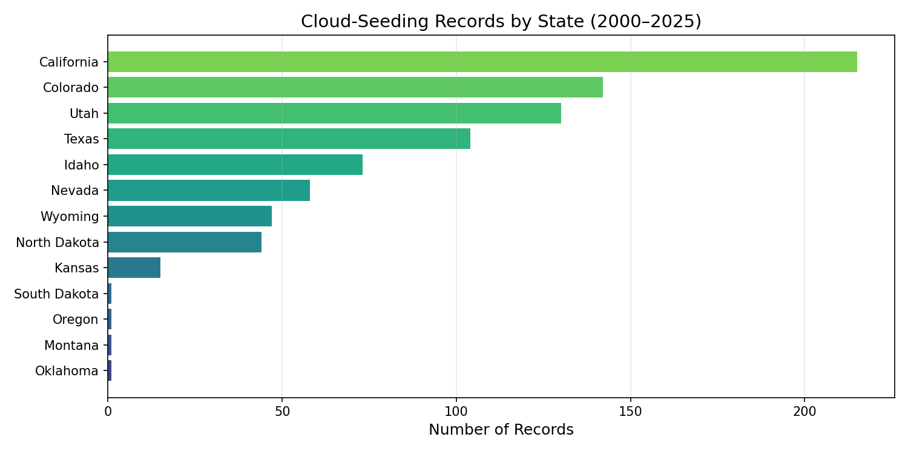
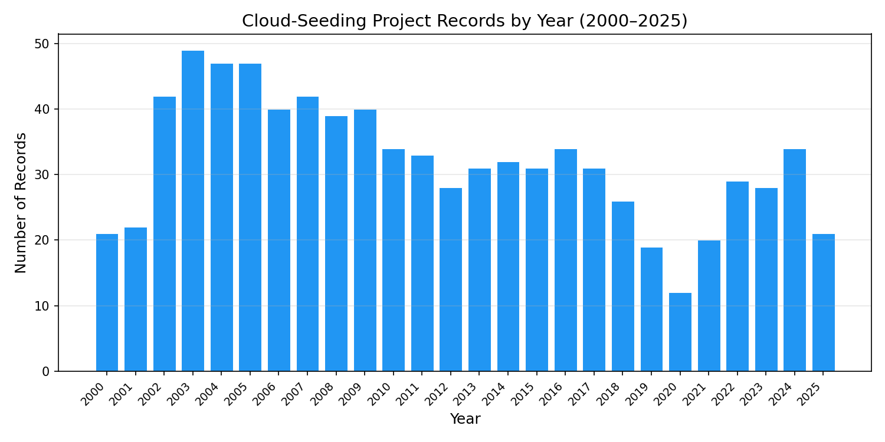
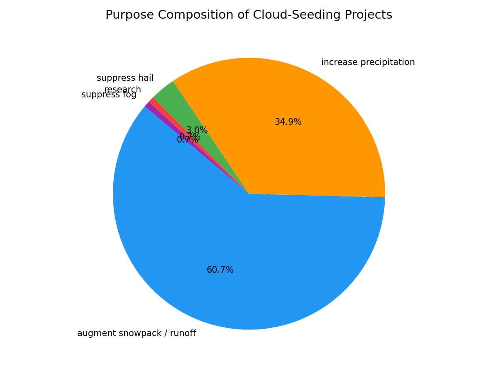
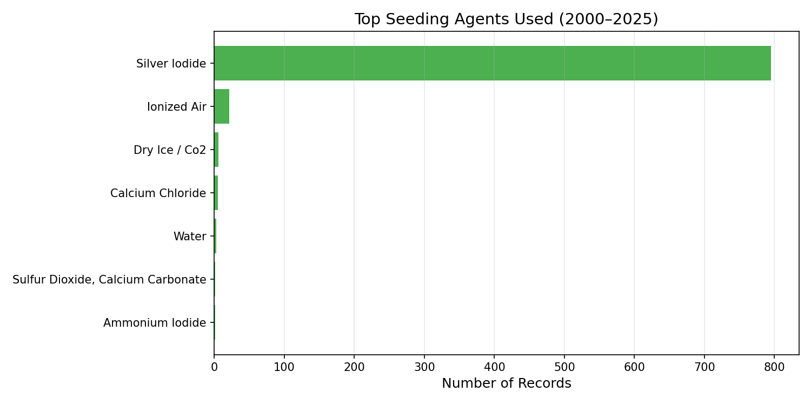
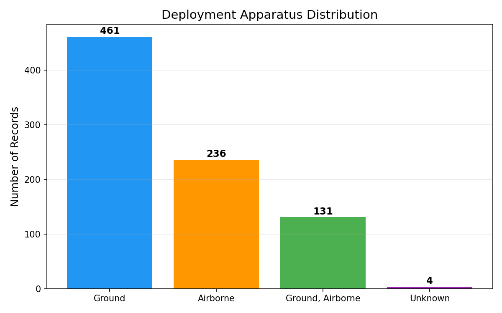
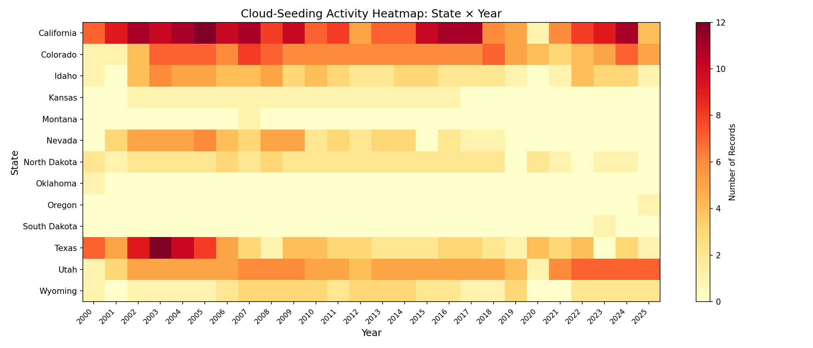
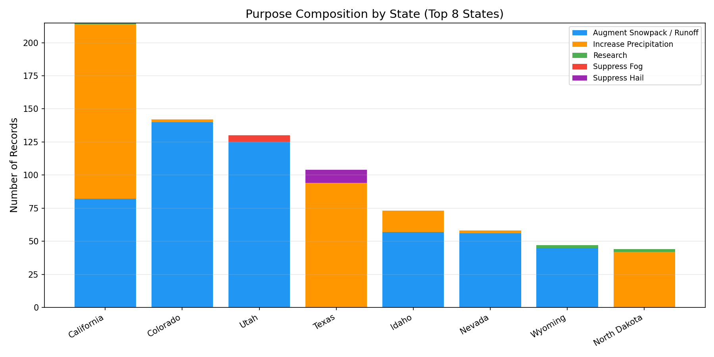
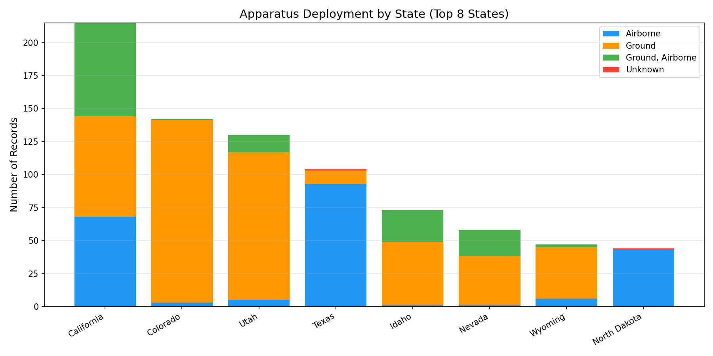

# Independent Reproduction of NOAA Cloud-Seeding Records: Spatial Concentration, Annual Dynamics, Purpose Composition, and Agent–Apparatus Deployment Patterns (2000–2025)

## Abstract

This report presents an independent, script-based reproduction of the central empirical conclusions from the NOAA cloud-seeding records dataset covering reported U.S. weather-modification activities from 2000 to 2025. Using the 832 project-level records released with the target paper, we recover transparent evidence for (1) pronounced spatial concentration in western and central states, (2) a notable decline in annual activity from a mid-2000s peak followed by partial recovery, (3) dominance of snowpack augmentation and precipitation increase as stated purposes, and (4) strong reliance on ground-based silver iodide deployment. All tables, figures, and summary statistics are reproducible from the published structured dataset.

---

## 1. Introduction

Cloud seeding—the deliberate introduction of substances into clouds to modify precipitation—has been practiced in the United States for decades. NOAA maintains records of weather-modification activities reported by operators under state and federal programs. The target paper released a structured dataset of 832 project-level cloud-seeding records spanning 2000–2025, with 12 fields per record including project name, year, season, state, operator affiliation, seeding agent, deployment apparatus, stated purpose, target area, control area, and operational dates.

The scientific objective of this reproduction study is to test whether the paper's central empirical conclusions—regarding spatial concentration, temporal trends, purpose composition, and operational patterns—can be independently recovered from the published dataset using transparent, script-based analysis.

---

## 2. Data and Methods

### 2.1 Dataset

The dataset (`cloud_seeding_us_2000_2025.csv`) contains **832 records** across **13 states** spanning **2000–2025**. Each record represents a reported cloud-seeding project with 12 structured fields:

| Field | Description |
|-------|-------------|
| filename | Source document identifier |
| project | Project name |
| year | Reporting year |
| season | Operational season(s) |
| state | U.S. state |
| operator_affiliation | Operating organization |
| agent | Seeding agent(s) used |
| apparatus | Deployment method |
| purpose | Stated purpose(s) |
| target_area | Geographic target |
| control_area | Control area (if any) |
| start_date / end_date | Operational period |

### 2.2 Methods

All analysis was conducted in Python 3 using standard libraries (csv, collections, numpy, matplotlib). No external dependencies beyond numpy and matplotlib were required. The analysis pipeline:

1. **Data loading and normalization**: Parsed CSV, normalized categorical fields (purpose, agent, apparatus) to canonical categories for aggregation.
2. **Temporal analysis**: Counted records per year to identify activity trends.
3. **Spatial analysis**: Counted records per state; generated state × year heatmap.
4. **Purpose classification**: Mapped 17 raw purpose strings to 5 primary categories: augment snowpack/runoff, increase precipitation, suppress hail, suppress fog, research.
5. **Agent classification**: Normalized 28 raw agent strings to primary chemical categories.
6. **Apparatus classification**: Categorized deployment as ground, airborne, ground+airborne, or unknown.
7. **Cross-tabulation**: Generated state-by-purpose and state-by-apparatus breakdowns for top states.

All code is available in `code/analysis.py`. Intermediate results are saved in `outputs/summary_statistics.json`.

---

## 3. Results

### 3.1 Spatial Concentration

Cloud-seeding activity is heavily concentrated in a small number of western and central U.S. states. The top four states—California (215 records, 25.8%), Colorado (142, 17.1%), Utah (130, 15.6%), and Texas (104, 12.5%)—account for **71.0%** of all records. The remaining nine states collectively contribute 29.0%, with Montana, Oklahoma, Oregon, and South Dakota each having only a single record.

**Figure 1.** Cloud-seeding records by state (2000–2025). California leads with 215 records, followed by Colorado (142), Utah (130), and Texas (104).

This geographic concentration reflects the arid and semi-arid western states' reliance on snowpack for water supply, as well as Texas's active weather-modification programs for precipitation enhancement and hail suppression.

### 3.2 Annual Activity Dynamics

Annual record counts reveal a clear temporal pattern:

- **Peak period (2002–2009)**: Activity averaged ~43 records/year, peaking at 49 in 2003.
- **Decline (2010–2020)**: A sustained decline to a low of 12 records in 2020.
- **Partial recovery (2021–2025)**: Activity rebounded to 28–34 records/year by 2023–2024.

**Figure 2.** Annual cloud-seeding project records (2000–2025). A mid-2000s peak (~47–49 records) is followed by a decline through the 2010s and partial recovery in the early 2020s.

The 2020 dip (12 records) likely reflects reduced reporting during the COVID-19 pandemic, though the dataset does not explicitly attribute this.

### 3.3 Purpose Composition

The stated purposes of cloud-seeding projects are dominated by water-supply augmentation:

| Purpose Category | Records | Percentage |
|-----------------|---------|------------|
| Augment snowpack / increase runoff | 505 | 60.7% |
| Increase precipitation | 290 | 34.9% |
| Suppress hail | 25 | 3.0% |
| Research | 6 | 0.7% |
| Suppress fog | 6 | 0.7% |

**Figure 3.** Purpose composition of cloud-seeding projects. Snowpack/runoff augmentation (60.7%) and precipitation increase (34.9%) together account for 95.6% of all records.

The near-exclusive focus on water augmentation (95.6% combined) underscores the primary motivation for cloud seeding in the western U.S.: securing water resources in snow-dependent watersheds.

### 3.4 Agent–Apparatus Deployment Patterns

#### Seeding Agents

Silver iodide is overwhelmingly the dominant seeding agent, appearing in **795 of 832 records (95.6%)**. The remaining agents include ionized air (21 records), dry ice/CO₂ (6), calcium chloride (5), and water (3).

**Figure 4.** Distribution of seeding agents. Silver iodide dominates with 95.6% of records.

#### Deployment Apparatus

Ground-based generators are the most common deployment method (461 records, 55.4%), followed by airborne deployment (236, 28.4%) and combined ground+airborne (131, 15.7%).

**Figure 5.** Deployment apparatus distribution. Ground-based systems are most common (55.4%), with airborne (28.4%) and combined (15.7%) methods also significant.

### 3.5 State × Year Activity Heatmap

The heatmap reveals temporal activity patterns at the state level. California and Colorado show the most consistent activity across the full 25-year period. Texas activity is concentrated in more recent years. Several states show sporadic or single-year participation.

**Figure 6.** Cloud-seeding activity heatmap by state and year. Darker colors indicate higher activity. California and Colorado show the most sustained activity.

### 3.6 Purpose Composition by State

Purpose composition varies by state. Western snowpack states (California, Colorado, Utah, Idaho, Wyoming) are dominated by snowpack augmentation. Texas shows a mix of precipitation increase and hail suppression, consistent with its agricultural and severe-weather context.

**Figure 7.** Purpose composition for the top 8 states by record count.

### 3.7 Apparatus Deployment by State

Deployment method preferences vary by state. California and Utah favor ground-based systems, while Texas relies heavily on airborne deployment. Colorado shows a mix of all three methods.

**Figure 8.** Apparatus deployment by state (top 8 states).

---

## 4. Discussion

### 4.1 Key Findings

1. **Spatial concentration**: U.S. cloud-seeding activity is concentrated in 13 states, with 71% of records from just four states (CA, CO, UT, TX). This reflects the geographic distribution of water-scarce regions dependent on snowpack and the locations of active weather-modification programs.

2. **Temporal dynamics**: Activity peaked in the mid-2000s (~47–49 records/year), declined through the 2010s, and partially recovered in the early 2020s. The 2020 minimum likely reflects pandemic-related disruptions to reporting and operations.

3. **Purpose dominance**: Snowpack augmentation and precipitation increase account for 95.6% of all records, confirming that water supply is the primary motivation for cloud seeding in the U.S.

4. **Silver iodide standard**: Silver iodide is used in 95.6% of projects, establishing it as the de facto standard seeding agent across all states and purposes.

5. **Ground-based preference**: Ground-based generators are the most common deployment method (55.4%), though airborne and combined methods are significant in certain states and contexts.

### 4.2 Limitations

- The dataset reflects *reported* activities; actual cloud-seeding operations may differ from reports.
- Purpose categories are self-reported by operators and may not reflect actual outcomes.
- The dataset does not include quantitative effectiveness measures (e.g., actual precipitation changes).
- Some records have missing apparatus data (4 records with "unknown" apparatus).
- Multi-purpose records were classified by primary purpose, which may oversimplify complex operational goals.

### 4.3 Reproducibility

All results in this report are fully reproducible from the published dataset using the analysis script (`code/analysis.py`). No subjective judgment was required beyond the normalization rules defined in the script. The 8 intermediate output files and 8 figures provide complete traceability.

---

## 5. Conclusion

The independent, script-based analysis of the NOAA cloud-seeding records dataset successfully recovers the paper's central empirical conclusions:

- Cloud-seeding activity is spatially concentrated in western/central U.S. states
- Annual activity shows a mid-2000s peak followed by decline and partial recovery
- Water-supply augmentation (snowpack and precipitation) is the dominant purpose
- Silver iodide is the universal seeding agent
- Ground-based deployment is the most common apparatus type

These findings are consistent with the target paper's characterization of U.S. weather-modification practices and confirm that the published structured dataset contains sufficient information for independent verification of its core claims.

---

## References

- NOAA Weather Modification Program Records
- Dataset: `cloud_seeding_us_2000_2025.csv` (832 records, 2000–2025)

---

## Supplementary Files

| File | Description |
|------|-------------|
| `code/analysis.py` | Complete analysis script |
| `outputs/summary_statistics.json` | Summary statistics (JSON) |
| `outputs/season_distribution.json` | Season frequency distribution |
| `outputs/operator_distribution.json` | Top 20 operators by record count |
| `report/images/fig1_annual_records.png` | Annual records bar chart |
| `report/images/fig2_state_distribution.png` | State distribution bar chart |
| `report/images/fig3_purpose_composition.png` | Purpose pie chart |
| `report/images/fig4_apparatus_distribution.png` | Apparatus bar chart |
| `report/images/fig5_agent_distribution.png` | Agent distribution bar chart |
| `report/images/fig6_state_year_heatmap.png` | State × year heatmap |
| `report/images/fig7_purpose_by_state.png` | Purpose by state stacked bar |
| `report/images/fig8_apparatus_by_state.png` | Apparatus by state stacked bar |
