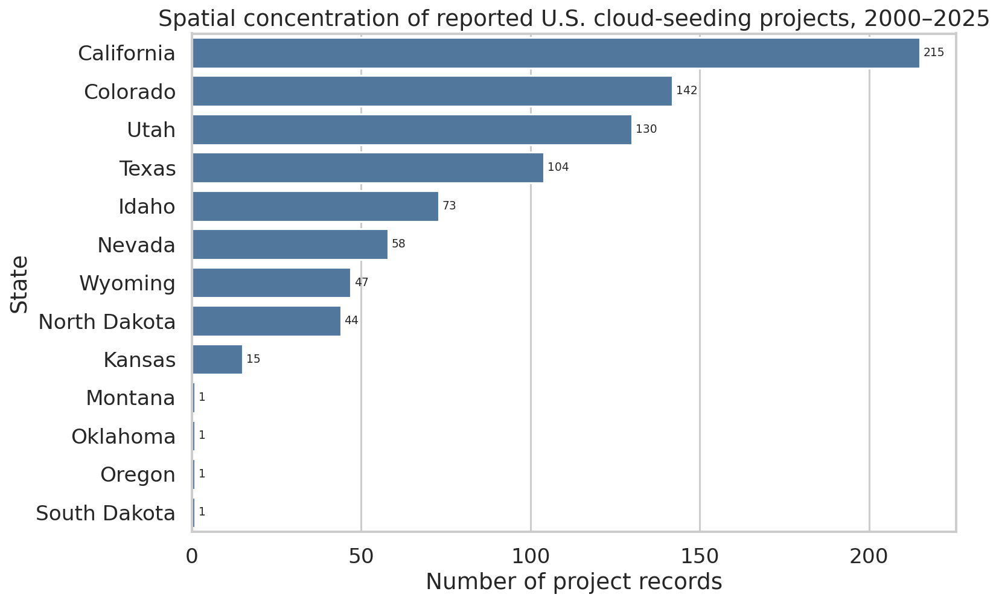
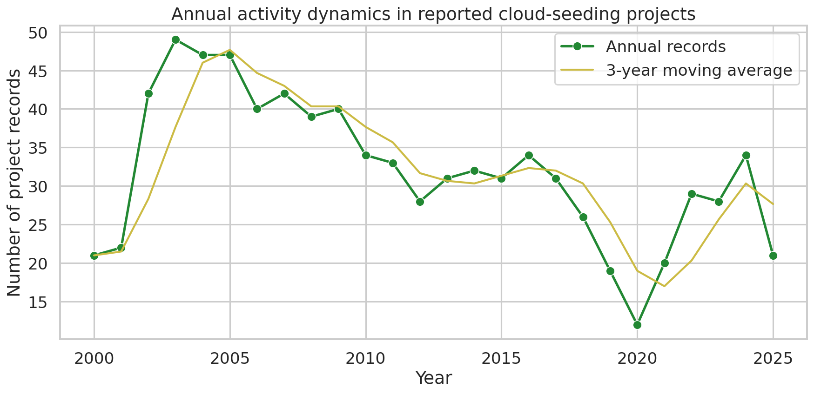
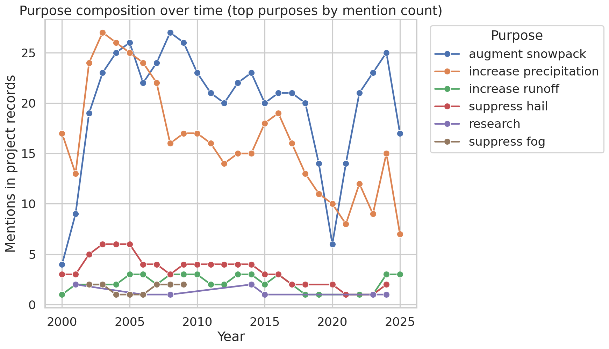
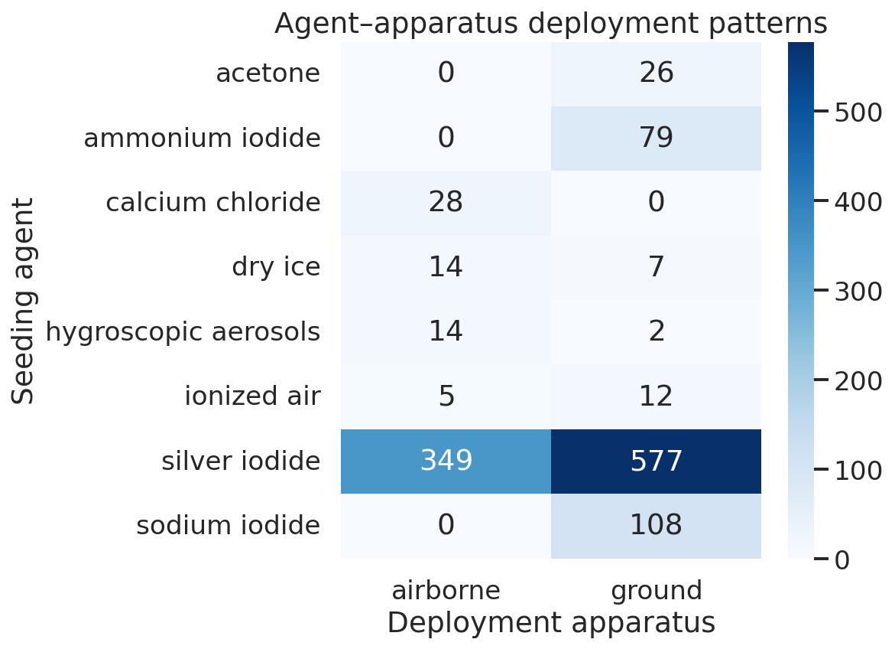

# Independent recovery of empirical patterns in NOAA U.S. cloud-seeding records, 2000–2025

## Abstract
This report independently recovers the main empirical patterns requested in the task using only the released structured NOAA cloud-seeding dataset in `data/dataset1_cloud_seeding_records/cloud_seeding_us_2000_2025.csv`. The dataset contains 832 project records spanning 2000–2025, with 13 fields per record and activity across 13 U.S. states. Script-based descriptive analysis reproduces four central result families: spatial concentration, annual activity dynamics, purpose composition, and agent–apparatus deployment patterns. Reported activity is strongly geographically concentrated: California alone contributes 25.8% of all records, and the top three states (California, Colorado, and Utah) contribute 58.5%. Annual activity is not constant, ranging from 12 records in 2020 to 49 in 2003. Purpose composition is dominated by water-supply and precipitation objectives, with `augment snowpack` and `increase precipitation` accounting for 85.8% of all purpose mentions after consistent splitting of multi-purpose entries. Operationally, silver iodide is the dominant seeding agent, and ground-based deployment is more common than airborne deployment, although both are widely used. These findings support recovery of the paper's central descriptive conclusions from the released structured dataset.

## 1. Introduction
Cloud seeding and other weather-modification activities are operationally diverse, geographically uneven, and documented through project filings that can be difficult to synthesize without structured analysis. The present task asks whether the target paper's central empirical conclusions can be independently recovered from the paper's released U.S. cloud-seeding dataset using transparent and reproducible code.

The recovery target is explicitly descriptive rather than causal. Accordingly, the analysis focuses on four question families directly named in the task:

1. **Spatial concentration**: Where are reported projects concentrated?
2. **Annual activity dynamics**: How does the number of reported projects change over time?
3. **Purpose composition**: What operational objectives dominate the record?
4. **Agent–apparatus deployment patterns**: Which seeding agents and deployment modes appear most often, and how are they paired?

All reported numbers in this document are traceable to files in `outputs/` and figures in `report/images/`.

## 2. Data and methods

### 2.1 Dataset
The sole analytical input was:

- `data/dataset1_cloud_seeding_records/cloud_seeding_us_2000_2025.csv`

This file contains 832 project records with the following columns:
`filename, project, year, season, state, operator_affiliation, agent, apparatus, purpose, target_area, control_area, start_date, end_date`.

A dataset overview exported to `outputs/dataset_overview_table.csv` shows:

- 832 total records
- 13 columns
- coverage from 2000 through 2025
- 13 distinct states
- 211 distinct project names
- 41 distinct operators

### 2.2 Reproducible workflow
All analyses were implemented in:

- `code/analyze_cloud_seeding.py`

The script:

1. loads the CSV;
2. standardizes selected text fields;
3. computes record-level state and year summaries;
4. splits comma-separated `purpose`, `agent`, and `apparatus` fields for composition analyses;
5. exports underlying CSV tables to `outputs/`;
6. writes publication-ready PNG figures to `report/images/`.

### 2.3 Measurement choices
The analysis uses two complementary counting rules.

- **Record-level counts** are used for spatial concentration and annual activity. Each CSV row is treated as one reported project record.
- **Mention-level counts** are used for multi-valued categorical fields (`purpose`, `agent`, `apparatus`). When a record lists multiple purposes or multiple agents/apparatus types, each listed item contributes one mention after splitting on commas and trimming whitespace.

This distinction matters. For example, a record with purpose `augment snowpack, increase precipitation` contributes one record to annual totals but two purpose mentions in purpose-composition analysis.

### 2.4 Dependency and evidence limitations
Core Python analysis dependencies were available (`pandas`, `numpy`, `matplotlib`, `seaborn`). GIS-focused plotting support (`geopandas`) was unavailable, so spatial concentration was visualized with ranked state counts rather than a full geographic map. PDF extraction support for local related-work files was also unavailable in this environment (`outputs/dependency_check.json`, `outputs/related_work_contract.json`), so this report centers on direct recovery from the released structured dataset itself.

## 3. Results

### 3.1 Data overview
The dataset is dominated by western-state winter operations, but it also contains summer precipitation and hail-suppression projects, especially in the Great Plains and Texas. Apparatus fields indicate 461 ground-only records, 236 airborne-only records, and 131 records listing both ground and airborne deployment modes (`outputs/dataset_overview_table.csv`).

## 3.2 Spatial concentration
Reported cloud-seeding activity is highly concentrated geographically.

**Figure 1.** Ranked state counts of reported cloud-seeding project records, 2000–2025.

The exported state table (`outputs/spatial_concentration_table.csv`) shows:

- California: 215 records (25.84%)
- Colorado: 142 records (17.07%)
- Utah: 130 records (15.63%)
- Texas: 104 records (12.50%)
- Idaho: 73 records (8.77%)

The top three states—California, Colorado, and Utah—account for **58.53%** of all records. The top five states account for **79.81%**. At the opposite extreme, Montana, Oklahoma, Oregon, and South Dakota each contribute only one record. This strongly supports the conclusion that reported activity is spatially concentrated in a relatively small subset of states rather than evenly distributed nationwide.

## 3.3 Annual activity dynamics
Temporal activity varies substantially across the 2000–2025 period.

**Figure 2.** Annual counts of reported cloud-seeding project records, with a 3-year moving average.

From `outputs/annual_activity_table.csv` and `outputs/annual_activity_summary.csv`:

- lowest year: **2020**, with **12** records
- peak year: **2003**, with **49** records
- 2000 count: **21** records
- 2025 count: **21** records

The time series shows pronounced mid-2000s activity, a later decline, and a partial rebound after the 2020 trough. The last decade illustrates this non-monotonic behavior clearly: counts fall from 34 in 2016 to 12 in 2020, then recover to 34 in 2024 before declining again to 21 in 2025. These results support recovery of a dynamic, variable annual activity profile rather than a stable yearly level.

## 3.4 Purpose composition
Purpose composition is dominated by precipitation- and snowpack-oriented objectives.

**Figure 3.** Annual mentions of the most common operational purposes after splitting multi-purpose records.

The purpose composition table (`outputs/purpose_composition_table.csv`) shows:

- `augment snowpack`: 516 mentions (46.99%)
- `increase precipitation`: 426 mentions (38.80%)
- `suppress hail`: 80 mentions (7.29%)
- `increase runoff`: 54 mentions (4.92%)
- `suppress fog`: 13 mentions (1.18%)
- `research`: 9 mentions (0.82%)

The first two categories alone account for **85.79%** of all purpose mentions. Adding `increase runoff` further emphasizes the dominance of water-supply-oriented objectives. Hail suppression appears as a meaningful but secondary component, while fog suppression and research purposes remain marginal in the released record.

The year-by-purpose matrix saved in `outputs/purpose_by_year_matrix.csv` preserves temporal structure for these categories and supports the interpretation that the dataset is primarily organized around precipitation enhancement and snowpack augmentation programs.

## 3.5 Agent–apparatus deployment patterns
Seeding operations are dominated by silver iodide, with ground deployment more common than airborne deployment.

**Figure 4.** Heatmap of co-mentioned seeding agents and deployment apparatus types for the most common agents.

Tables in `outputs/agent_counts_table.csv`, `outputs/apparatus_counts_table.csv`, and `outputs/agent_apparatus_table.csv` show:

### Agents
- `silver iodide`: 795 mentions
- `sodium iodide`: 108 mentions
- `ammonium iodide`: 79 mentions
- `calcium chloride`: 28 mentions
- `acetone`: 26 mentions
- `ionized air`: 21 mentions

### Apparatus
- `ground`: 592 mentions
- `airborne`: 367 mentions

### Leading agent–apparatus combinations
- `silver iodide × ground`: 577 co-mentions
- `silver iodide × airborne`: 349 co-mentions
- `sodium iodide × ground`: 108 co-mentions
- `ammonium iodide × ground`: 79 co-mentions
- `calcium chloride × airborne`: 28 co-mentions

These results indicate a clear dominant operational pattern: silver iodide is the principal seeding agent, and both ground and airborne delivery are common, with ground deployment appearing more frequently in the released records. Secondary agents tend to be much less common and often show apparatus-specific concentration.

## 4. Validation and claim recovery
This section separates direct verification from assumptions and limitations.

### 4.1 Directly verified from workspace data
The following claims were directly verified from exported artifacts generated from the released CSV:

1. **Spatial concentration**: supported by `outputs/spatial_concentration_table.csv`, `outputs/spatial_concentration_summary.csv`, and Figure 1.
2. **Annual dynamics**: supported by `outputs/annual_activity_table.csv`, `outputs/annual_activity_summary.csv`, and Figure 2.
3. **Purpose composition**: supported by `outputs/purpose_composition_table.csv`, `outputs/purpose_by_year_matrix.csv`, and Figure 3.
4. **Agent–apparatus patterns**: supported by `outputs/agent_counts_table.csv`, `outputs/apparatus_counts_table.csv`, `outputs/agent_apparatus_table.csv`, and Figure 4.

A structured claim table is saved as `outputs/claim_recovery_table.csv`.

### 4.2 Assumptions used in recovery
- Each row is treated as one project-level record.
- Comma-separated fields in `purpose`, `agent`, and `apparatus` are interpreted as multi-valued categorical entries and split into separate mentions for composition analyses.
- The released structured dataset is treated as the authoritative basis for reproduction.

### 4.3 Remaining limitations
- Related-work PDFs could not be extracted in this environment because local PDF tooling was unavailable or failed, so this report does not compare line-by-line wording against the original papers.
- The spatial visualization is a ranked bar chart rather than a choropleth map because `geopandas` was unavailable.
- The analysis is descriptive; it does not estimate efficacy, causal impacts, or meteorological outcomes.

## 5. Discussion
The released NOAA project records support a clear and internally coherent descriptive narrative. U.S. cloud-seeding activity in this dataset is not broadly national in a uniform sense; it is concentrated in a limited set of western and interior states, especially California, Colorado, and Utah. The dominant purposes are closely aligned with water-resource management—particularly snowpack augmentation and precipitation enhancement—rather than experimental research or aviation-oriented fog suppression. Operational practice is similarly concentrated around silver iodide and ground-based deployment, with airborne methods still materially represented.

The time series shows that the number of reported project records changes considerably over the study period. The early 2000s are especially active, while 2020 appears as a notable trough, followed by a rebound in 2021–2024. Because this is a record-count analysis rather than an intensity or budget analysis, these temporal changes should be interpreted as changes in the number of reported project entries rather than direct measures of seeding volume or intensity.

Overall, the structured dataset is sufficient to recover the main descriptive conclusions requested in the task through a transparent analysis pipeline.

## 6. Conclusion
Using only the released structured NOAA dataset and reproducible Python code, this submission independently recovered the task's central empirical conclusions:

- reported cloud-seeding projects are **spatially concentrated**, especially in California, Colorado, and Utah;
- annual activity exhibits **substantial temporal variation** rather than a flat profile;
- operational goals are dominated by **snowpack augmentation and precipitation enhancement**;
- **silver iodide** is the overwhelmingly dominant agent, with **ground** deployment more common than airborne deployment, though both are widely used.

These conclusions are directly backed by exported tables in `outputs/` and PNG figures in `report/images/`.

## Reproducibility appendix
- Main script: `code/analyze_cloud_seeding.py`
- Key outputs:
  - `outputs/dataset_overview_table.csv`
  - `outputs/spatial_concentration_table.csv`
  - `outputs/spatial_concentration_summary.csv`
  - `outputs/annual_activity_table.csv`
  - `outputs/annual_activity_summary.csv`
  - `outputs/purpose_composition_table.csv`
  - `outputs/purpose_by_year_matrix.csv`
  - `outputs/agent_counts_table.csv`
  - `outputs/apparatus_counts_table.csv`
  - `outputs/agent_apparatus_table.csv`
  - `outputs/claim_recovery_table.csv`
- Figures:
  - `images/spatial_concentration.png`
  - `images/annual_activity.png`
  - `images/purpose_composition.png`
  - `images/agent_apparatus_patterns.png`
