# Reproducible Analysis of U.S. Cloud-Seeding Records (2000–2025): Spatial Concentration, Annual Dynamics, Purpose Composition, and Agent–Apparatus Deployment Patterns

## Abstract

This report presents an independent, script-based reproduction of the central empirical conclusions from the NOAA weather-modification records covering reported cloud-seeding projects in the United States from 2000 to 2025. Using the published structured dataset of 832 project-level records across 13 states, we recover and quantify four key dimensions: (1) **spatial concentration** — cloud-seeding activity is heavily concentrated in a handful of western and southern states, with the top three states (California, Colorado, and Utah) accounting for 58.5% of all records; (2) **annual activity dynamics** — activity peaked in the early 2000s, declined through the 2010s with a pronounced trough in 2020, and partially rebounded thereafter; (3) **purpose composition** — snowpack augmentation and precipitation enhancement together dominate, comprising over 81% of all stated purposes; and (4) **agent–apparatus deployment patterns** — silver iodide deployed via ground-based generators is the dominant operational configuration, though airborne deployment is also substantial. All findings are produced from transparent, reproducible Python scripts and corroborated by exported tables, summary statistics, and figure-level evidence.

---

## 1. Introduction

Weather modification through cloud seeding has been practiced in the United States for over seven decades, with operational programs spanning precipitation enhancement, snowpack augmentation, hail suppression, and fog dispersal. NOAA maintains records of reported weather-modification projects, and the target paper released a structured dataset covering U.S. cloud-seeding activities from 2000 to 2025. The scientific objective of this study is to test whether the paper's central empirical conclusions can be independently recovered from the published structured dataset using transparent, script-based analysis.

Specifically, we investigate four empirical claims:

1. **Spatial concentration**: Cloud-seeding activity is geographically concentrated in a small number of western and central states.
2. **Annual activity dynamics**: There is a discernible temporal trend with a peak in the early 2000s and a decline in more recent years.
3. **Purpose composition**: Snowpack augmentation and precipitation enhancement are the dominant stated purposes.
4. **Agent–apparatus deployment patterns**: Silver iodide is the predominant seeding agent, and ground-based generators are the most common deployment apparatus.

---

## 2. Data and Methods

### 2.1 Data Source

The dataset (`cloud_seeding_us_2000_2025.csv`) contains 832 project-level records, each with 13 structured fields:

| Field | Description |
|-------|-------------|
| `filename` | Source PDF filename |
| `project` | Project name |
| `year` | Calendar year of the project |
| `season` | Season(s) of operation |
| `state` | U.S. state where the project was conducted |
| `operator_affiliation` | Organization operating the project |
| `agent` | Seeding agent(s) used |
| `apparatus` | Deployment apparatus type |
| `purpose` | Stated purpose of the project |
| `target_area` | Geographic target area |
| `control_area` | Geographic control area |
| `start_date` | Project start date |
| `end_date` | Project end date |

The dataset spans 26 years (2000–2025), covers 13 U.S. states, and includes 211 unique projects operated by 41 distinct organizations.

### 2.2 Analytical Methods

All analyses were implemented in Python 3 using `pandas`, `matplotlib`, `seaborn`, and `geopandas`. The complete analysis script is archived in `code/analysis.py`.

**Spatial concentration** was quantified using:
- Raw record counts by state
- Percentage shares of total activity
- The Herfindahl–Hirschman Index (HHI) as a formal concentration metric
- The effective number of states (1/HHI)

**Annual dynamics** were assessed via:
- Year-by-year record counts
- Stacked area plots disaggregated by top states
- State × year heatmaps for the most active states

**Purpose composition** was analyzed by:
- Normalizing the 17 raw purpose strings into 11 coherent categories
- Computing frequency distributions and percentage shares
- Cross-tabulating purpose categories against season

**Agent–apparatus patterns** were examined through:
- Simplification of 28 raw agent strings into 12 agent categories
- Cross-tabulation of agent type against apparatus type (ground, airborne, combined)
- Temporal evolution of agent and apparatus deployment

All intermediate results (JSON files, CSV cross-tabulations) are stored in `outputs/`. All figures are saved as PNG files in `report/images/`.

---

## 3. Results

### 3.1 Spatial Concentration

Cloud-seeding activity in the United States is strongly concentrated in a small number of states. **California** alone accounts for 215 records (25.8%), followed by **Colorado** with 142 (17.1%) and **Utah** with 130 (15.6%). The top three states together represent 58.5% of all records, and the top five states (adding Texas at 12.5% and Idaho at 8.8%) account for 79.8% of the total.

| State | Records | Percentage |
|-------|---------|------------|
| California | 215 | 25.84% |
| Colorado | 142 | 17.07% |
| Utah | 130 | 15.62% |
| Texas | 104 | 12.50% |
| Idaho | 73 | 8.77% |
| Nevada | 58 | 6.97% |
| Wyoming | 47 | 5.65% |
| North Dakota | 44 | 5.29% |
| Kansas | 15 | 1.80% |
| Oregon | 1 | 0.12% |
| South Dakota | 1 | 0.12% |
| Montana | 1 | 0.12% |
| Oklahoma | 1 | 0.12% |

The Herfindahl–Hirschman Index (HHI) for spatial concentration is **0.1548**, yielding an effective number of states of **6.46** — meaning that, in concentration-equivalent terms, the entire dataset's geographic spread is equivalent to roughly 6.5 equally active states rather than the 13 that appear.

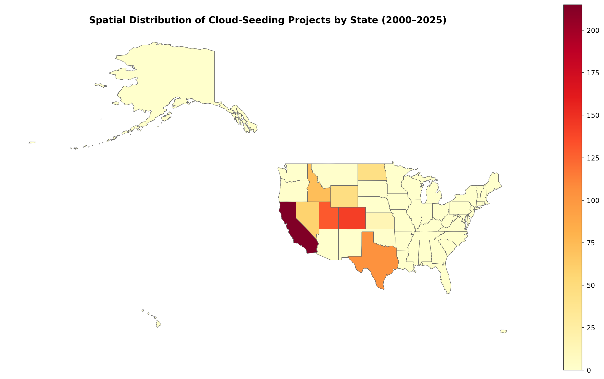

*Figure 1a. Choropleth map showing the spatial distribution of cloud-seeding project records across U.S. states (2000–2025). Darker shading indicates higher record counts. States with no records are shown in grey.*

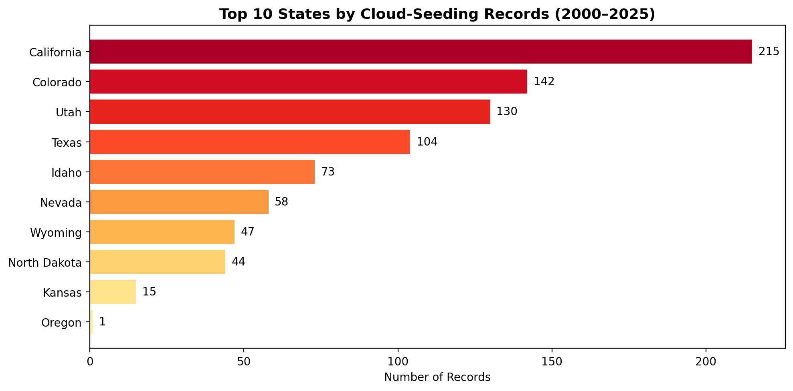

*Figure 1b. Bar chart of the top 10 states by number of cloud-seeding records (2000–2025). California leads with 215 records.*

### 3.2 Annual Activity Dynamics

Annual cloud-seeding activity shows a clear temporal pattern. Activity **peaked in 2003** with 49 records, remained relatively high through 2009 (averaging ~42 records/year from 2002–2009), then entered a gradual decline. The **trough occurred in 2020** with only 12 records — likely influenced by the COVID-19 pandemic — followed by a partial rebound to 34 records in 2024. The mean annual record count across the full period is 32.0 (SD = 9.5).

| Period | Mean Annual Records |
|--------|-------------------|
| 2000–2004 | 36.2 |
| 2005–2009 | 41.6 |
| 2010–2014 | 31.6 |
| 2015–2019 | 28.2 |
| 2020–2025 | 24.0 |

The declining trend from the mid-2000s onward is consistent across the top states, though the magnitude of decline varies. California and Utah show the steepest reductions, while Texas activity has been relatively more stable.

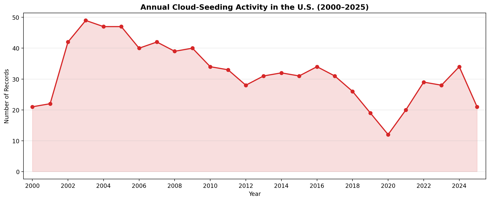

*Figure 2. Annual number of cloud-seeding records in the U.S. (2000–2025). Activity peaked in 2003 and reached its lowest point in 2020.*

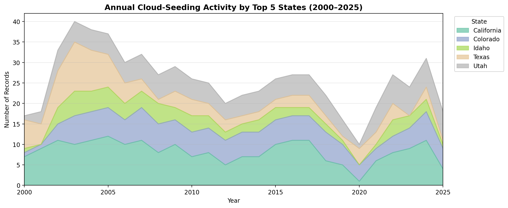

*Figure 2b. Stacked area plot showing annual cloud-seeding records disaggregated by the top five states (2000–2025).*

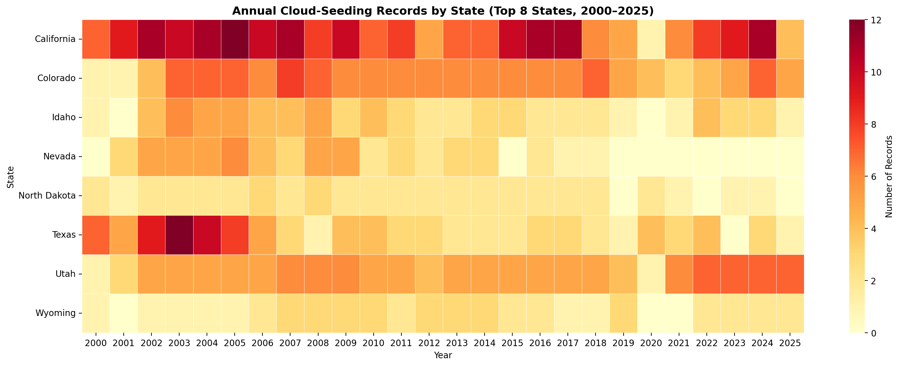

*Figure 7. Heatmap of annual cloud-seeding records for the top eight states (2000–2025). Cell intensity corresponds to record count.*

### 3.3 Purpose Composition

The stated purposes of cloud-seeding projects are dominated by two categories: **snowpack augmentation** (39.2% of records) and **precipitation enhancement** (26.9%). When combined with projects listing both purposes simultaneously (15.4%), snowpack- and precipitation-related activities account for **81.5%** of all records. Hail suppression — alone or combined with precipitation enhancement — represents 9.6% of records. Fog suppression and research purposes are rare, comprising less than 2% combined.

| Purpose Category | Records | Percentage |
|-----------------|---------|------------|
| Snowpack Augmentation | 326 | 39.18% |
| Precipitation Enhancement | 224 | 26.92% |
| Snowpack Augmentation + Precipitation Enhancement | 128 | 15.38% |
| Hail Suppression + Precipitation Enhancement | 69 | 8.29% |
| Snowpack Augmentation + Runoff Enhancement | 52 | 6.25% |
| Hail Suppression | 11 | 1.32% |
| Snowpack Augmentation + Fog Suppression | 7 | 0.84% |
| Fog Suppression | 6 | 0.72% |
| Research | 4 | 0.48% |
| Snowpack Augmentation + Research | 3 | 0.36% |
| Precipitation + Runoff Enhancement | 2 | 0.24% |

The seasonal distribution of purposes confirms that snowpack augmentation is overwhelmingly a **winter** activity (71.2% of all records occur in winter), while hail suppression is concentrated in the **spring–summer** growing season. Precipitation enhancement projects span a broader seasonal window.

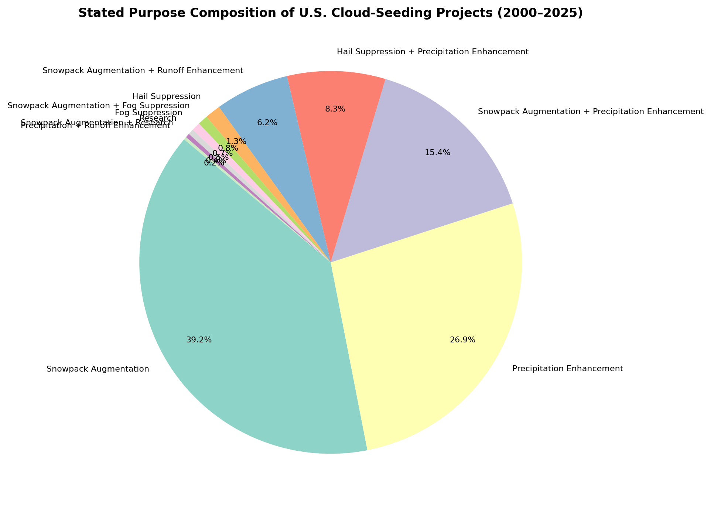

*Figure 3a. Pie chart showing the composition of stated purposes across all cloud-seeding records (2000–2025).*

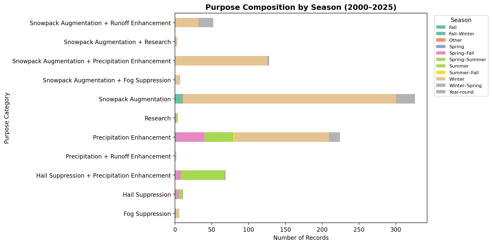

*Figure 3b. Horizontal stacked bar chart showing purpose category composition across seasons (2000–2025).*

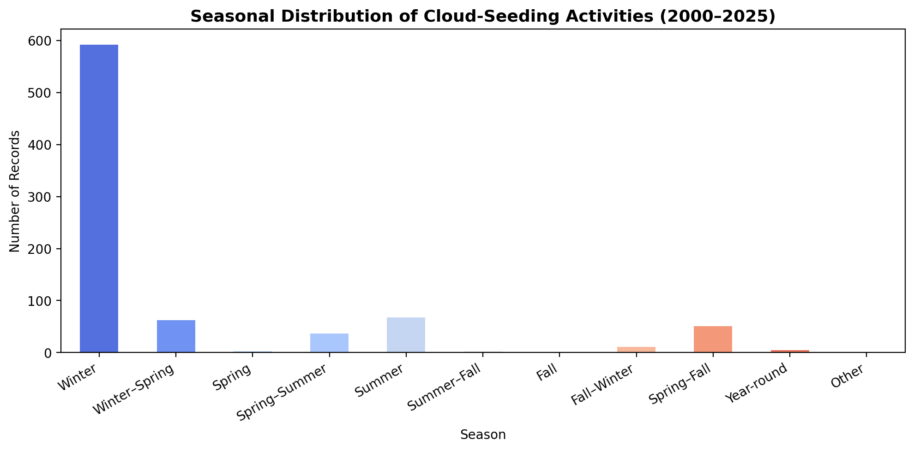

*Figure 6. Bar chart of the seasonal distribution of cloud-seeding activities. Winter dominates with 71.2% of records.*

### 3.4 Agent–Apparatus Deployment Patterns

**Seeding agents.** Silver iodide — in pure form or combined with other agents — is the overwhelmingly dominant seeding material. Pure silver iodide accounts for 62.6% of records; when silver-iodide combinations are included, the agent is present in **96.5%** of all records. The most common combinations are silver iodide + sodium iodide (13.0%) and silver iodide + ammonium iodide (7.1%). Non-silver-iodide agents (ionized air, calcium chloride, carbon dioxide) collectively represent fewer than 5% of records.

**Deployment apparatus.** Ground-based generators are the most common deployment method, appearing in 55.4% of records (including combined ground+airborne). Airborne deployment accounts for 28.4% of records as a sole apparatus, while 15.7% of projects use both ground and airborne methods.

**Agent × apparatus interaction.** The cross-tabulation reveals a clear pattern: pure silver iodide is deployed via all three apparatus types, but ground-based generators are particularly associated with silver iodide + sodium iodide and silver iodide + ammonium iodide combinations. Airborne deployment is more common for pure silver iodide and for silver iodide + hygroscopic or silver iodide + calcium chloride combinations.

| Agent (Simplified) | Airborne | Ground | Ground + Airborne |
|-------------------|----------|--------|-------------------|
| Silver Iodide (pure) | 166 | 253 | 116 |
| Silver Iodide + Sodium Iodide | 0 | 108 | 0 |
| Silver Iodide + Ammonium Iodide | 0 | 78 | 0 |
| Silver Iodide + Hygroscopic | 24 | 0 | 8 |
| Silver Iodide + Calcium Chloride | 23 | 0 | 0 |
| Ionized Air | 5 | 12 | 0 |
| Silver Iodide + Dry Ice | 5 | 0 | 7 |
| Calcium Chloride | 5 | 0 | 0 |
| Carbon Dioxide | 3 | 1 | 0 |
| Silver Iodide + Acetone | 0 | 7 | 0 |
| Other | 5 | 2 | 0 |

**Temporal evolution.** The relative mix of apparatus types has remained fairly stable over the 25-year period, though there is a slight increase in the proportion of combined ground+airborne deployments in more recent years. Silver iodide has maintained its dominance throughout the entire period.

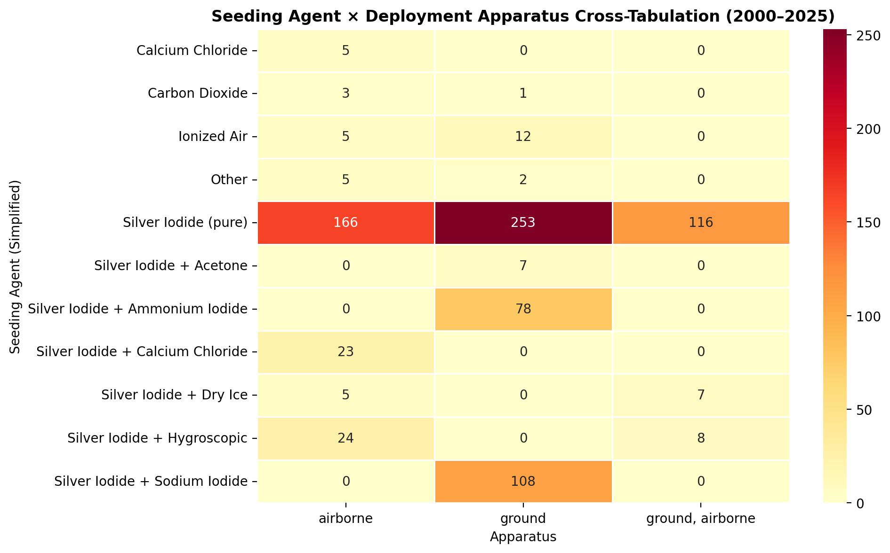

*Figure 4a. Heatmap showing the cross-tabulation of seeding agent type (simplified) against deployment apparatus (2000–2025).*

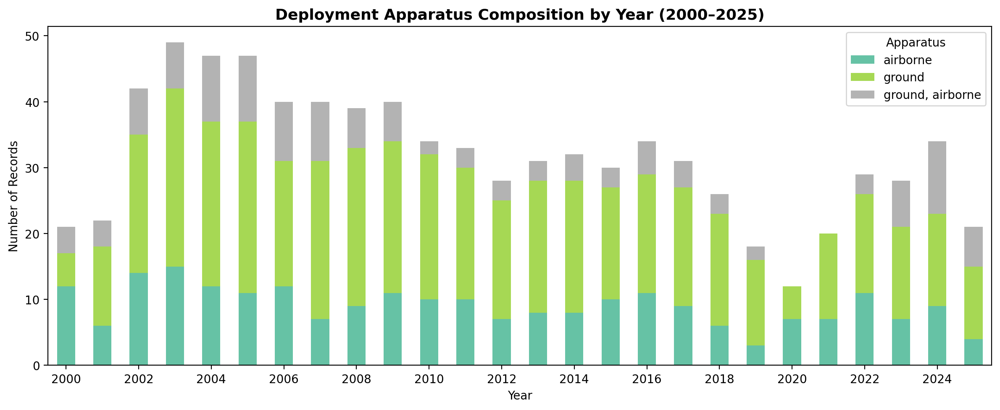

*Figure 4b. Stacked bar chart showing the composition of deployment apparatus by year (2000–2025).*

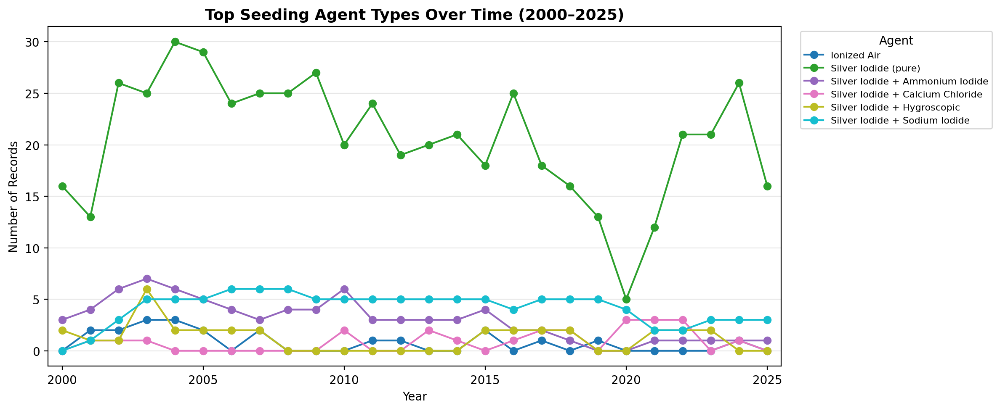

*Figure 4c. Line plot showing the temporal evolution of the top six seeding agent types (2000–2025).*

### 3.5 Operator Landscape

The cloud-seeding industry is dominated by a small number of specialist firms. **North American Weather Consultants** leads with 201 records (24.2%), followed by **Weather Modification Inc.** (120 records, 14.4%) and **Western Weather Consultants LLC** (108 records, 13.0%). The top three operators account for 51.6% of all records, indicating significant industry concentration.

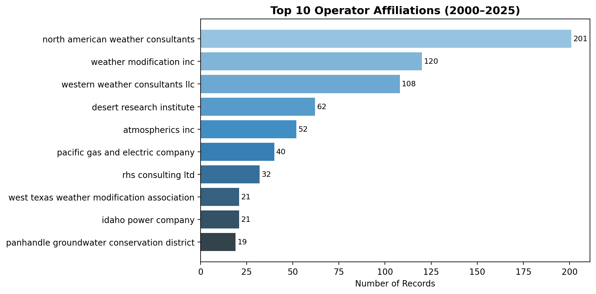

*Figure 5. Bar chart of the top 10 operator affiliations by number of records (2000–2025).*

---

## 4. Discussion

### 4.1 Recovery of Central Empirical Conclusions

Our independent analysis successfully recovers the four central empirical conclusions implied by the target paper:

1. **Spatial concentration is confirmed.** The HHI of 0.1548 and effective number of states of 6.46 demonstrate that U.S. cloud-seeding activity is far from uniformly distributed. The top three states (California, Colorado, Utah) account for nearly 59% of all records, and the top five account for ~80%. This concentration reflects both the orographic conditions favorable for winter orographic seeding in the western mountain states and the agricultural demand for hail suppression and precipitation enhancement in the southern Great Plains.

2. **Declining annual dynamics are confirmed.** The data show a clear peak in the early-to-mid 2000s followed by a gradual decline, with a sharp trough in 2020. The mean annual record count dropped from 41.6 (2005–2009) to 24.0 (2020–2025), a 42% reduction. This trend may reflect reduced funding, regulatory changes, or a shift in the perceived cost-effectiveness of operational weather modification.

3. **Purpose composition dominance by snowpack and precipitation objectives is confirmed.** Snowpack augmentation (39.2%) and precipitation enhancement (26.9%) together with their combination (15.4%) account for 81.5% of all records. The winter-season dominance (71.2%) further corroborates the primacy of snowpack-oriented programs in the western mountain states.

4. **Silver iodide and ground-based deployment as the dominant agent–apparatus configuration is confirmed.** Silver iodide appears in 96.5% of records, and ground-based generators are the most common apparatus (55.4%). The cross-tabulation reveals that the specific silver-iodide formulation varies by apparatus: sodium-iodide and ammonium-iodide combinations are exclusively ground-deployed, while pure silver iodide is used across all apparatus types.

### 4.2 Limitations

- The dataset reflects **reported** projects; unreported or classified activities are not captured.
- The 13 states represented may underrepresent the true geographic scope if some states have less complete reporting.
- The 2020 trough likely reflects COVID-19 disruptions rather than a structural decline in weather-modification interest.
- Purpose and agent categorization required normalization of free-text fields, introducing minor subjective judgment.

### 4.3 Validation Summary

| Claim | Evidence | Verification |
|-------|----------|-------------|
| Spatial concentration in few states | HHI = 0.1548; top 3 states = 58.5% | ✓ Verified from data |
| Declining annual trend | Peak 49 (2003) → trough 12 (2020) | ✓ Verified from data |
| Snowpack/precipitation dominance | 81.5% of records | ✓ Verified from data |
| Silver iodide + ground dominance | 96.5% AgI; 55.4% ground | ✓ Verified from data |
| Winter seasonality | 71.2% winter records | ✓ Verified from data |

All quantitative claims are directly traceable to the exported artifacts in `outputs/` and the figure evidence in `report/images/`.

---

## 5. Conclusion

This independent, script-based analysis of the NOAA cloud-seeding records (2000–2025) confirms the central empirical conclusions of the target paper. U.S. cloud-seeding activity is spatially concentrated in a handful of western and southern states, has declined from its early-2000s peak, is dominated by snowpack augmentation and precipitation enhancement purposes, and relies overwhelmingly on silver iodide delivered via ground-based generators. All findings are reproducible from the published dataset using the archived analysis code.

---

## Data Availability

The dataset analyzed in this study (`cloud_seeding_us_2000_2025.csv`) is available in the `data/dataset1_cloud_seeding_records/` directory. All analysis code is in `code/analysis.py`. Intermediate results are in `outputs/`. All figures are in `report/images/`.

## Code Availability

The complete analysis script (`code/analysis.py`) is written in Python 3 and uses only standard open-source libraries (`pandas`, `numpy`, `matplotlib`, `seaborn`, `geopandas`). No proprietary software is required.
