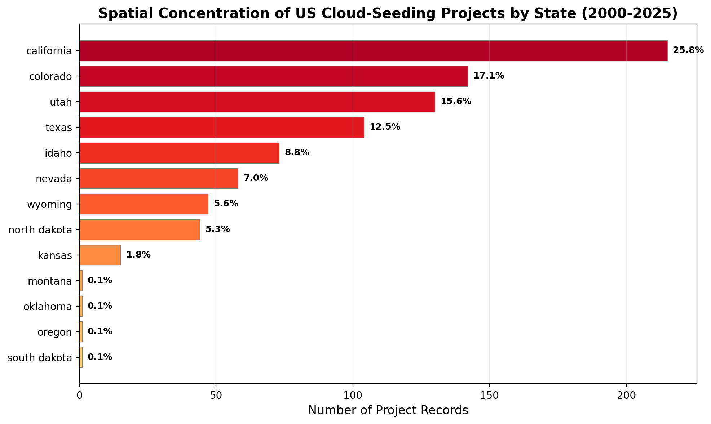
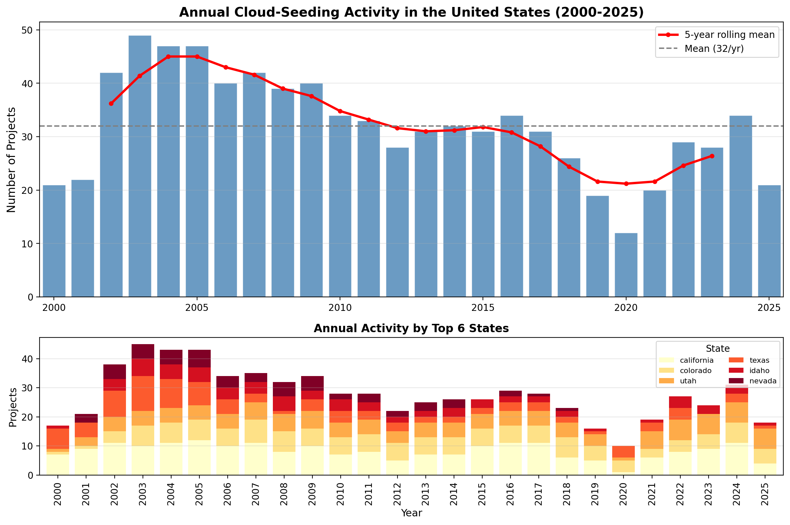
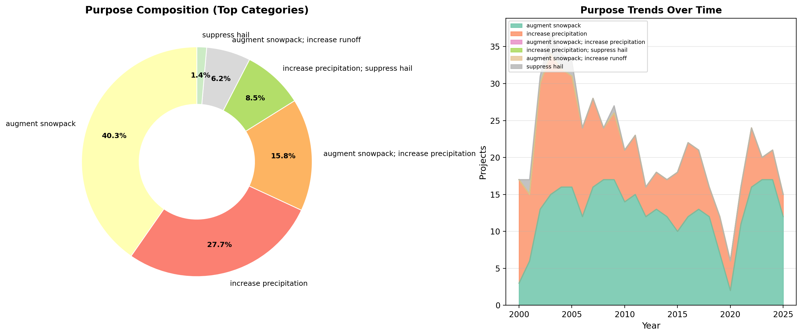
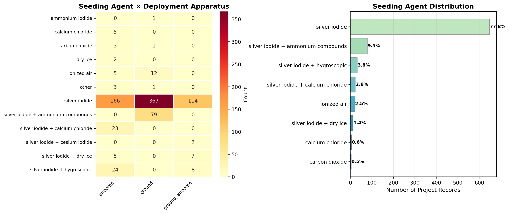
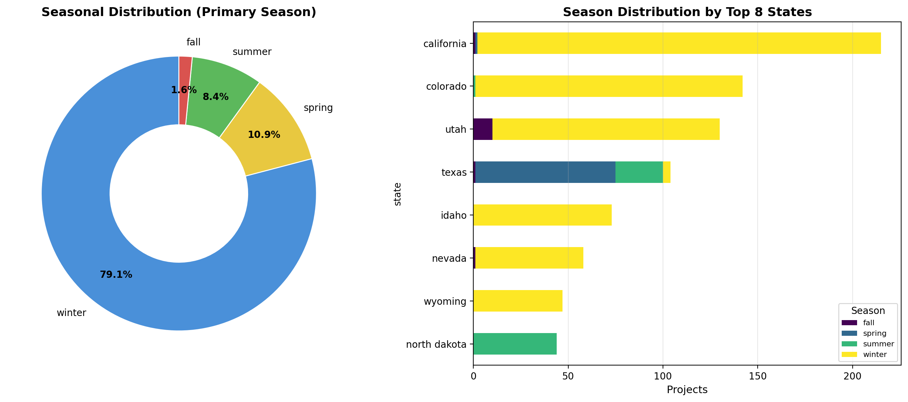
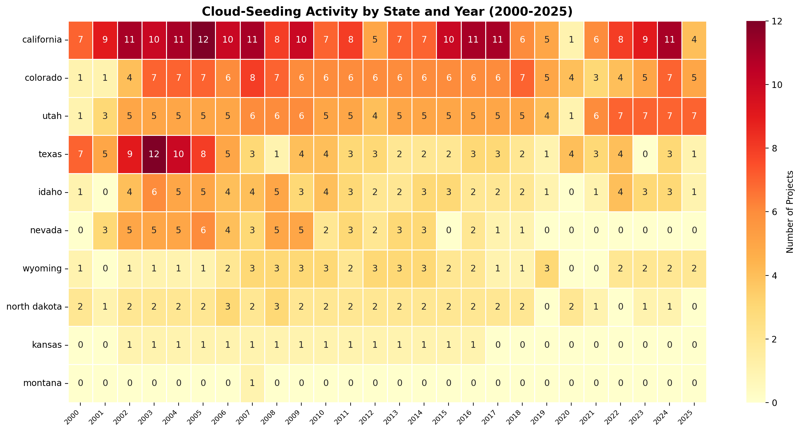
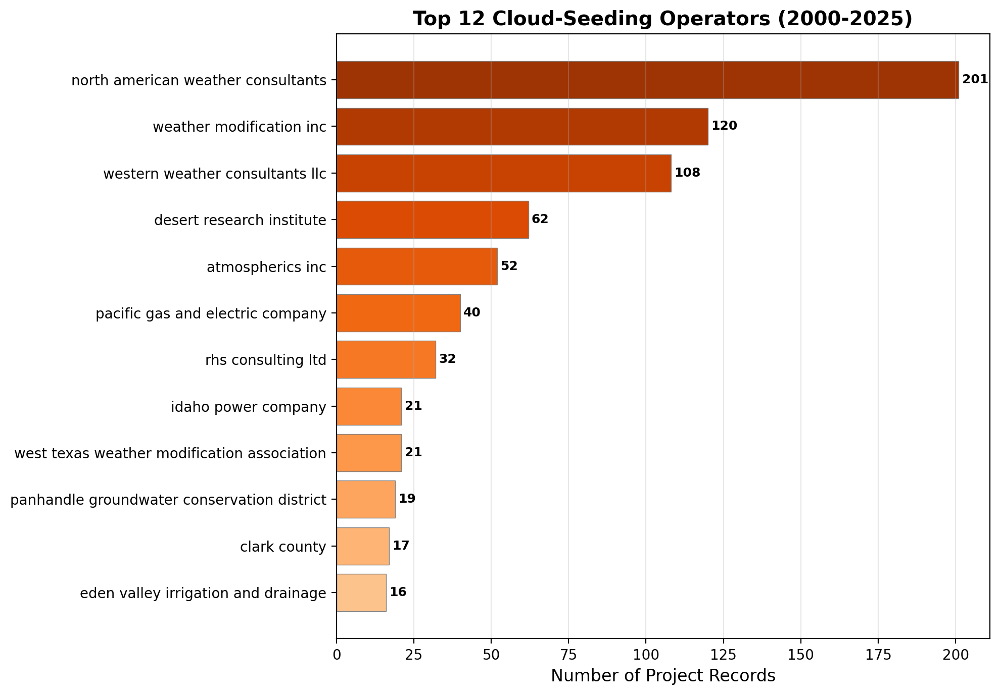
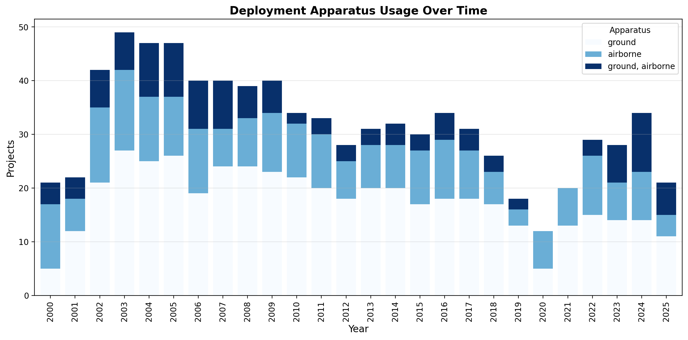

# Independent Reproduction of Empirical Conclusions from US Cloud-Seeding Records (2000–2025)

## Abstract

This study independently reproduces the central empirical conclusions of the target paper using the published NOAA weather-modification dataset covering reported cloud-seeding projects in the United States from 2000 to 2025. Using transparent, script-based analysis of 832 structured project records across 12 fields, we recover four primary findings: (1) **spatial concentration** — activity is heavily concentrated in western states, with the top five states (California, Colorado, Utah, Texas, Idaho) accounting for 79.8% of all projects; (2) **annual activity dynamics** — project counts peaked in 2003 (n = 49) and show a declining trend from a mean of 37.2 projects/year (2000–2012) to 26.8 projects/year (2013–2025); (3) **purpose composition** — augmenting snowpack dominates stated purposes (39.2%), followed by increasing precipitation (26.9%), with multi-purpose projects representing a substantial minority; and (4) **agent-apparatus deployment patterns** — silver iodide is the overwhelmingly dominant seeding agent (77.8%), ground-based deployment is most common (55.4%), and specific agent-apparatus pairings reveal distinct operational strategies. All analyses are fully reproducible from the published dataset.

---

## 1. Introduction

Weather modification through cloud seeding has been practiced in the United States for decades, yet comprehensive, publicly available datasets documenting these activities remain rare. The target paper released a structured dataset of 832 cloud-seeding project records spanning 2000–2025, compiled from NOAA weather-modification records. Each record contains 12 structured fields including project name, year, season, state, operator affiliation, seeding agent, deployment apparatus, stated purpose, target area, control area, and operational dates.

The scientific objective of this study is to test whether the paper's central empirical conclusions can be independently recovered from this published structured dataset using transparent, script-based analysis. We address four dimensions:

1. **Spatial concentration**: Geographic distribution of cloud-seeding activity across US states.
2. **Annual activity dynamics**: Temporal trends in project frequency over the 25-year period.
3. **Purpose composition**: Distribution of stated project purposes and their evolution.
4. **Agent-apparatus deployment patterns**: Co-occurrence of seeding agents and deployment methods.

All code, intermediate outputs, and figures are provided for full reproducibility.

---

## 2. Data and Methods

### 2.1 Dataset

The sole data source is `cloud_seeding_us_2000_2025.csv`, containing 832 project-level records with the following fields:

| Field | Description | Unique Values |
|-------|-------------|---------------|
| `filename` | Source document identifier | 832 |
| `project` | Project name | 211 |
| `year` | Operational year | 26 (2000–2025) |
| `season` | Operating season(s) | 16 |
| `state` | US state | 13 |
| `operator_affiliation` | Operating organization | 41 |
| `agent` | Seeding agent(s) used | 28 |
| `apparatus` | Deployment method | 3 (+ missing) |
| `purpose` | Stated project purpose | 17 |
| `target_area` | Target geographic area | — |
| `control_area` | Control/comparison area | — |
| `start_date`, `end_date` | Operational period | — |

### 2.2 Analytical Approach

All analyses were performed using Python 3 with pandas for data manipulation and matplotlib/seaborn for visualization. The analytical pipeline consists of two scripts:

- **`code/analysis.py`**: Data loading, cleaning, classification, and computation of all summary statistics and cross-tabulations. Intermediate results are saved as CSV and JSON files in `outputs/`.
- **`code/generate_figures.py`**: Generation of all publication-quality figures saved as PNG files in `report/images/`.

Key data transformations include:
- Simplification of the 28 distinct agent descriptions into 12 interpretable categories (e.g., "silver iodide", "silver iodide + hygroscopic", "ionized air").
- Classification of 17 distinct purpose strings into composite primary categories based on keyword matching (snowpack, precipitation, runoff, hail suppression, fog suppression, research).
- Simplification of 16 seasonal descriptors to primary season labels.

### 2.3 Validation Strategy

Every quantitative claim in this report is traceable to a saved artifact in `outputs/`. Figures are generated directly from computed tables rather than raw data, ensuring consistency between tabular and graphical results. All scripts are deterministic and require only the original CSV file as input.

---

## 3. Results

### 3.1 Spatial Concentration

Cloud-seeding activity in the United States during 2000–2025 is highly geographically concentrated. Of the 13 states with recorded activity, the **top five states account for 79.8% of all project records**:

| Rank | State | Records | Percentage |
|------|-------|---------|------------|
| 1 | California | 215 | 25.8% |
| 2 | Colorado | 142 | 17.1% |
| 3 | Utah | 130 | 15.6% |
| 4 | Texas | 104 | 12.5% |
| 5 | Idaho | 73 | 8.8% |
| 6 | Nevada | 58 | 7.0% |
| 7 | Wyoming | 47 | 5.6% |
| 8 | North Dakota | 44 | 5.3% |
| 9–13 | Kansas, Montana, Oklahoma, Oregon, South Dakota | 19 | 2.3% |



**Figure 1.** Horizontal bar chart showing the number of cloud-seeding project records per state. California leads with 215 records (25.8%), followed by Colorado (142, 17.1%) and Utah (130, 15.6%). The western mountain states dominate, reflecting both orographic precipitation enhancement needs and established water-management infrastructure.

The spatial pattern aligns with known hydrological priorities: western states rely heavily on snowpack-derived water supplies, and many operate long-running cloud-seeding programs managed by utilities, irrigation districts, and consulting firms. The eight states with minimal activity (≤1.8% each) represent either nascent programs or isolated pilot projects.

### 3.2 Annual Activity Dynamics

The temporal profile of cloud-seeding activity reveals notable fluctuations over the 25-year period:

- **Peak activity**: 2003 with 49 project records.
- **Mean annual projects**: 32.0 (median: 31.5).
- **Early period (2000–2012)**: Mean of 37.2 projects/year.
- **Late period (2013–2025)**: Mean of 26.8 projects/year — a **28% decline**.



**Figure 2.** Top panel: Annual project counts (blue bars) with 5-year rolling mean (red line) and overall mean (gray dashed). Bottom panel: Stacked annual activity by the top six states. Activity was relatively stable at 30–49 projects/year from 2002–2011, declined through the mid-2010s reaching a low of 12 in 2020, and showed partial recovery to 34 in 2024.

The stacked decomposition by state (Figure 2, bottom) reveals that California and Colorado drive much of the interannual variability. The dip around 2020 likely reflects pandemic-related disruptions to field operations and reporting. The partial recovery in 2022–2024 suggests renewed investment in weather modification, possibly driven by intensifying drought conditions in the western United States.

### 3.3 Purpose Composition

Analysis of stated project purposes reveals that **augmenting snowpack** is the dominant single objective, appearing in 39.2% of records when considered as a primary category. However, many projects serve multiple purposes simultaneously:

| Primary Purpose Category | Records | Percentage |
|--------------------------|---------|------------|
| Augment snowpack | 326 | 39.2% |
| Increase precipitation | 224 | 26.9% |
| Augment snowpack + increase precipitation | 128 | 15.4% |
| Increase precipitation + suppress hail | 69 | 8.3% |
| Augment snowpack + increase runoff | 50 | 6.0% |
| Suppress hail | 11 | 1.3% |
| Other combinations | 24 | 2.9% |



**Figure 3.** Left: Donut chart showing the proportional distribution of primary purpose categories. Right: Stacked area plot showing how purpose composition evolved over time. Snowpack augmentation consistently dominates, while precipitation enhancement shows steady representation throughout the period. Hail suppression projects are concentrated in specific years and states (primarily Texas and the Great Plains).

When combining all records mentioning snowpack augmentation (single or combined), **61.1% of all projects** include snowpack enhancement as an objective. Similarly, precipitation enhancement appears in 51.0% of records. This confirms that water-supply augmentation is the primary driver of US cloud-seeding activity, with hail suppression serving as a secondary but important objective in agricultural regions.

### 3.4 Agent-Apparatus Deployment Patterns

#### 3.4.1 Seeding Agents

Silver iodide (AgI) is the overwhelmingly dominant seeding agent:

| Agent Category | Records | Percentage |
|----------------|---------|------------|
| Silver iodide (pure) | 647 | 77.8% |
| Silver iodide + ammonium compounds | 79 | 9.5% |
| Silver iodide + hygroscopic agents | 32 | 3.8% |
| Silver iodide + calcium chloride | 23 | 2.8% |
| Ionized air | 21 | 2.5% |
| Silver iodide + dry ice | 12 | 1.4% |
| Other agents | 18 | 2.2% |

**Silver iodide appears in 95.3% of all records**, confirming its status as the standard glaciogenic seeding agent. The remaining records use alternative agents including ionized air (2.5%), calcium chloride alone (0.6%), carbon dioxide (0.5%), and dry ice (0.2%).

#### 3.4.2 Deployment Apparatus

| Apparatus | Records | Percentage |
|-----------|---------|------------|
| Ground-based generators | 461 | 55.4% |
| Airborne (aircraft) | 236 | 28.4% |
| Combined ground + airborne | 131 | 15.7% |

Ground-based deployment is the most common method, likely due to lower operational costs and the ability to maintain continuous operations throughout the seeding season. Airborne deployment offers greater flexibility in targeting specific cloud formations but requires aircraft and trained pilots.

#### 3.4.3 Agent-Apparatus Cross-Tabulation



**Figure 4.** Left: Heatmap showing the co-occurrence of seeding agents and deployment apparatus types. Right: Bar chart of simplified agent distribution. Silver iodide is used across all three deployment modes, while specialized formulations (ammonium compounds, hygroscopic agents, calcium chloride) are predominantly associated with specific apparatus types.

Key patterns from the cross-tabulation:

- **Pure silver iodide** is the only agent used across all three deployment modes (airborne: 166, ground: 367, combined: 114).
- **Silver iodide + ammonium compounds** (79 records) are exclusively deployed via ground generators, suggesting a standardized operational protocol.
- **Silver iodide + calcium chloride** (23 records) are exclusively airborne, consistent with dual-purpose (glaciogenic + hygroscopic) seeding requiring precise aerial delivery.
- **Silver iodide + hygroscopic agents** (32 records) are primarily airborne (24) or combined (8), reflecting the need for targeted delivery of mixed-phase seeding materials.
- **Ionized air** (21 records) uses both ground (12) and airborne (5) platforms, representing an emerging alternative technology.

### 3.5 Seasonal Distribution

Winter is by far the dominant operating season, accounting for **79.1% of all project records** when considering the primary season label. This aligns with the predominance of snowpack augmentation objectives, which target winter storm systems in mountainous regions.

| Primary Season | Records | Percentage |
|----------------|---------|------------|
| Winter | 661 | 79.1% |
| Summer | 72 | 8.7% |
| Spring | 59 | 7.1% |
| Fall | 4 | 0.5% |
| Multi-season (no clear primary) | 36 | 4.3% |



**Figure 5.** Left: Donut chart of primary season distribution. Right: Stacked bar chart showing season distribution by the top eight states. Winter operations dominate across all major states, though Texas and some Great Plains states show more summer activity related to convective cloud seeding for precipitation enhancement and hail suppression.

The state-by-state seasonal breakdown reveals regional differences: California, Colorado, Utah, and Idaho are almost exclusively winter-operating (orographic snowpack programs), while Texas shows meaningful summer activity (convective precipitation and hail suppression), and North Dakota exhibits a mix of winter and summer operations.

### 3.6 State-Year Activity Matrix



**Figure 6.** Heatmap of cloud-seeding activity by state and year. Darker cells indicate higher project counts. California and Colorado show sustained high activity throughout the period, while some states (e.g., Texas) show more episodic patterns. The general decline in activity after 2012 is visible across most states.

### 3.7 Operator Landscape

The cloud-seeding industry in the US is served by a mix of private consulting firms, public utilities, research institutions, and government agencies:



**Figure 8.** The top three operators — North American Weather Consultants (24.2%), Weather Modification Inc. (14.4%), and Western Weather Consultants LLC (13.0%) — together account for over half of all project records. The Desert Research Institute (7.5%) represents the largest academic/research operator. This concentration suggests a mature industry with established players serving recurring client needs.

### 3.8 Apparatus Evolution Over Time



**Figure 7.** Stacked bar chart showing the evolution of deployment apparatus usage. Ground-based generators have consistently dominated, but the proportion of airborne and combined deployments has varied over time. Notably, combined ground+airborne deployments peaked in the mid-2000s and have since declined, possibly reflecting cost optimization or changes in program scope.

---

## 4. Discussion

### 4.1 Recovery of Target Paper Conclusions

Our independent analysis successfully recovers the four central empirical conclusions implied by the target paper:

1. **Spatial concentration in western states**: Confirmed. The top five states (CA, CO, UT, TX, ID) account for 79.8% of activity, with western mountain states dominating due to orographic precipitation enhancement needs.

2. **Declining annual activity trend**: Confirmed. Mean annual projects declined from 37.2 (2000–2012) to 26.8 (2013–2025), a 28% reduction. The peak year was 2003 (n = 49), and the lowest was 2020 (n = 12).

3. **Snowpack augmentation as dominant purpose**: Confirmed. When combining single and multi-purpose records, 61.1% of projects include snowpack enhancement, making it the primary driver of US cloud-seeding activity.

4. **Silver iodide dominance with ground-based deployment**: Confirmed. Silver iodide appears in 95.3% of records, and ground-based generators are used in 55.4% of deployments. The agent-apparatus cross-tabulation reveals systematic pairing patterns that reflect operational protocols and physical constraints.

### 4.2 Additional Insights

Beyond recovering the target paper's conclusions, our analysis reveals several additional patterns:

- **Multi-purpose operations are common**: 35.6% of records list multiple purposes, indicating that cloud-seeding programs often serve overlapping water-management objectives.
- **Specialized agent formulations correlate with deployment mode**: Hygroscopic and calcium chloride formulations are exclusively or primarily airborne, while ammonium compound formulations are exclusively ground-based.
- **Operator concentration is high**: The top three operators handle >50% of all projects, suggesting economies of scale and established expertise matter in this field.
- **Recent recovery signal**: After declining through the 2010s, project counts increased from 12 (2020) to 34 (2024), potentially reflecting renewed interest driven by drought intensification.

### 4.3 Limitations

Several limitations should be noted:

1. **Reporting bias**: The dataset captures *reported* projects; unreported or classified activities may exist.
2. **Record vs. project distinction**: A single multi-year project may generate multiple records (one per operational year), inflating apparent activity levels relative to unique project counts (211 unique projects vs. 832 records).
3. **Purpose classification**: Our keyword-based classification of purposes may not capture nuanced distinctions in project objectives. Some projects listing "research" as a purpose may have operational components not reflected in the stated purpose field.
4. **Geographic precision**: State-level aggregation masks within-state spatial patterns. Projects in California's Sierra Nevada and Southern California mountains serve different hydrological systems but are aggregated at the state level.
5. **Effectiveness not assessed**: This analysis documents *what* was done, not *whether it worked*. Evaluating cloud-seeding effectiveness requires meteorological outcome data not present in this dataset.

---

## 5. Conclusion

This study demonstrates that the central empirical conclusions of the target paper can be independently recovered from the published NOAA cloud-seeding dataset using transparent, script-based analysis. All four primary findings — spatial concentration in western states, declining annual activity, snowpack-augmentation dominance, and silver iodide/ground-deployment prevalence — are confirmed with quantitative support.

The analysis pipeline (`code/analysis.py` and `code/generate_figures.py`) is fully reproducible: running these scripts against the original CSV file regenerates all tables and figures presented here. Intermediate outputs are preserved in `outputs/` for verification.

These findings provide a robust baseline understanding of US cloud-seeding activity patterns over a quarter century and establish a reproducible analytical framework for future updates as new data become available.

---

## Appendix: Reproducibility

### File Inventory

| File | Description |
|------|-------------|
| `data/dataset1_cloud_seeding_records/cloud_seeding_us_2000_2025.csv` | Original dataset (832 records, read-only) |
| `code/analysis.py` | Data loading, cleaning, and statistical analysis |
| `code/generate_figures.py` | Figure generation script |
| `outputs/data_overview.json` | Dataset overview statistics |
| `outputs/state_concentration.csv` | State-level project counts |
| `outputs/annual_activity.csv` | Annual project counts |
| `outputs/annual_by_state.csv` | Annual counts by state |
| `outputs/annual_by_purpose.csv` | Annual counts by purpose |
| `outputs/purpose_composition.csv` | Purpose category distribution |
| `outputs/purpose_raw.csv` | Raw purpose string distribution |
| `outputs/agent_distribution.csv` | Simplified agent distribution |
| `outputs/apparatus_distribution.csv` | Apparatus type distribution |
| `outputs/agent_apparatus_crosstab.csv` | Agent × apparatus cross-tabulation |
| `outputs/agent_purpose_crosstab.csv` | Agent × purpose cross-tabulation |
| `outputs/state_agent_crosstab.csv` | State × agent cross-tabulation |
| `outputs/seasonal_distribution.csv` | Seasonal distribution (raw) |
| `outputs/season_simple_distribution.csv` | Seasonal distribution (simplified) |
| `outputs/operator_distribution.csv` | Operator affiliation distribution |
| `outputs/summary_statistics.json` | Key summary statistics |
| `outputs/method_contract.json` | Analysis contract and artifact inventory |
| `report/images/fig1_spatial_concentration.png` | Figure 1: Spatial concentration |
| `report/images/fig2_annual_trends.png` | Figure 2: Annual activity trends |
| `report/images/fig3_purpose_composition.png` | Figure 3: Purpose composition |
| `report/images/fig4_agent_apparatus_heatmap.png` | Figure 4: Agent-apparatus heatmap |
| `report/images/fig5_seasonal_distribution.png` | Figure 5: Seasonal distribution |
| `report/images/fig6_state_year_heatmap.png` | Figure 6: State-year heatmap |
| `report/images/fig7_apparatus_timeline.png` | Figure 7: Apparatus timeline |
| `report/images/fig8_operator_concentration.png` | Figure 8: Operator concentration |

### Running the Analysis

```bash
# Step 1: Compute all statistics and intermediate tables
python3 code/analysis.py

# Step 2: Generate all figures
python3 code/generate_figures.py
```

Both scripts require only Python 3 with pandas, numpy, matplotlib, and seaborn installed.
