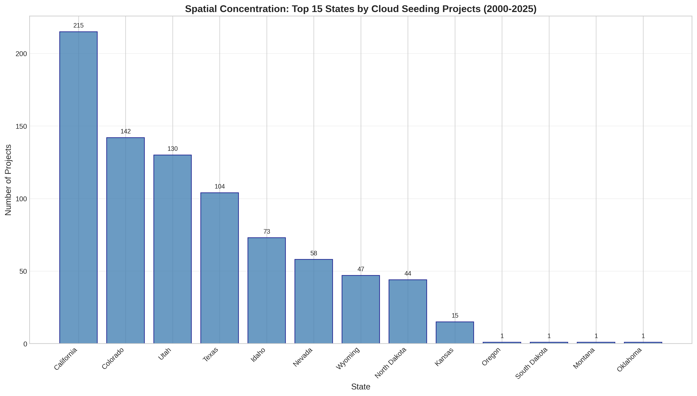
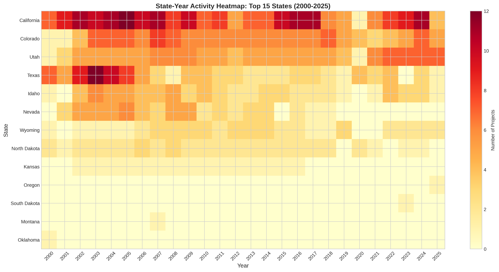
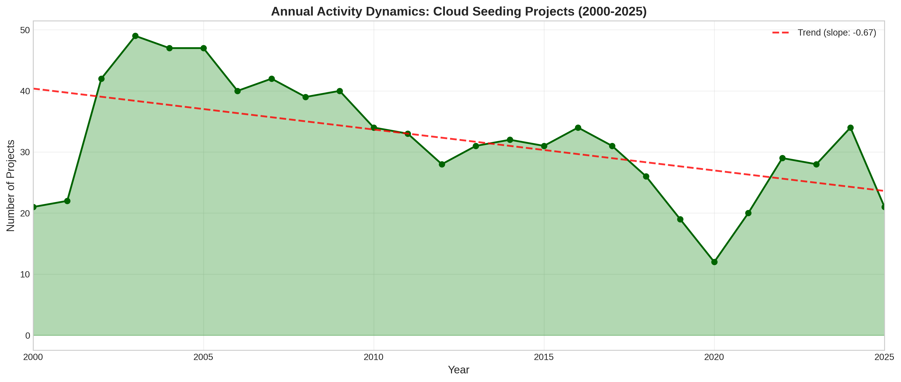
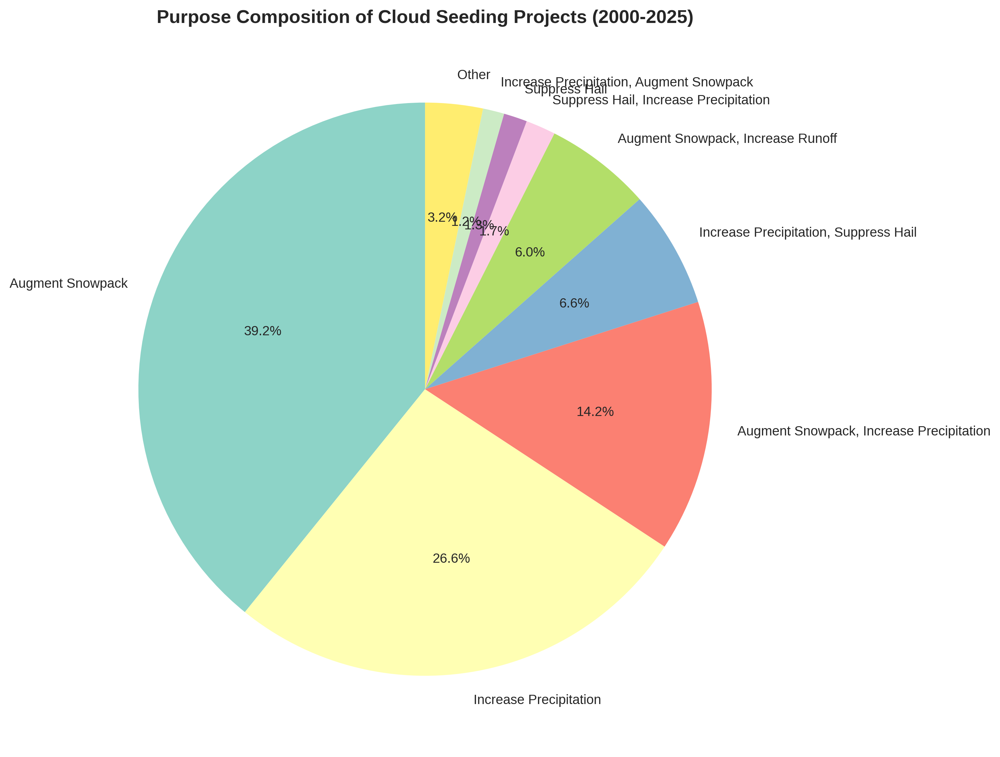
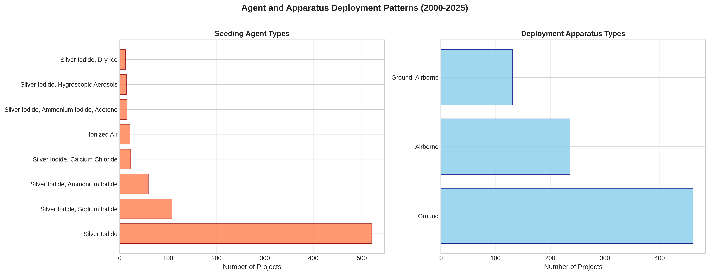
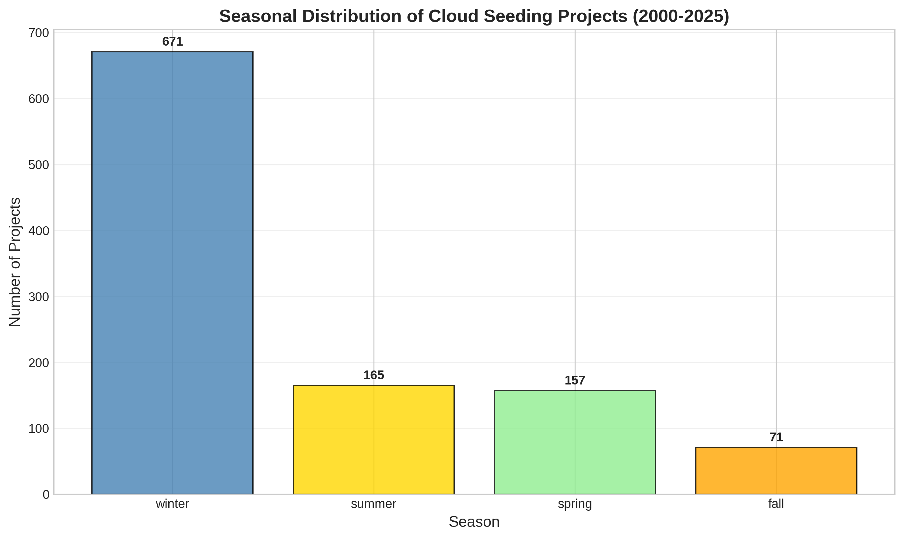
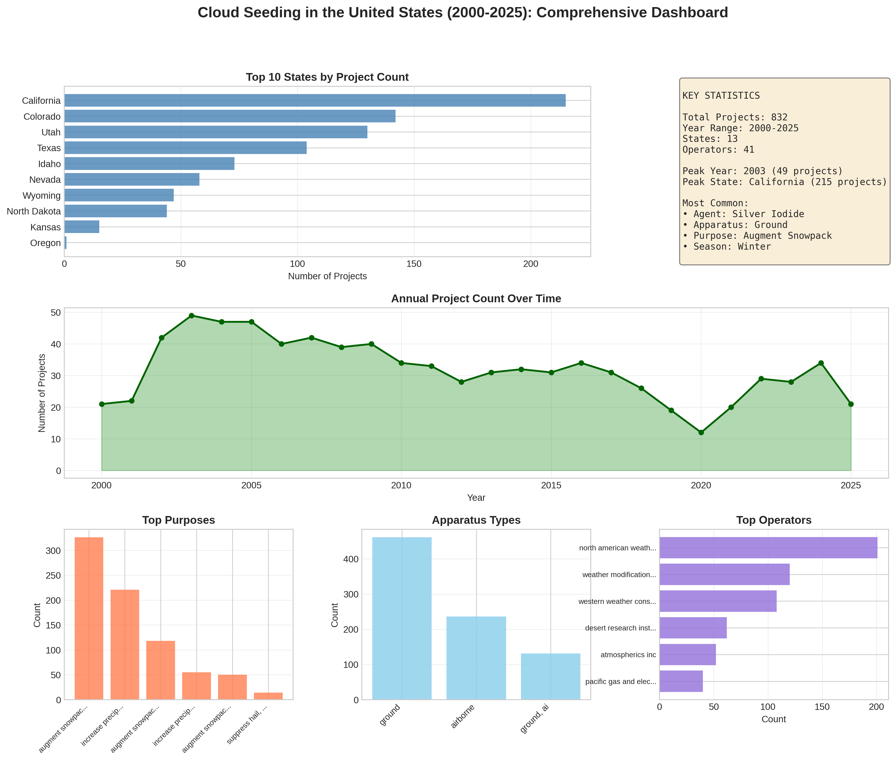
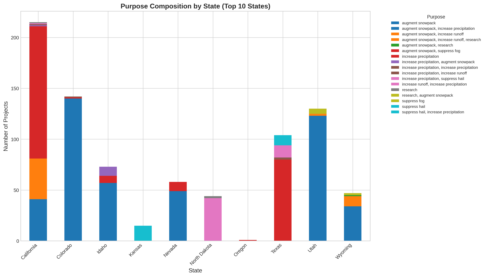

# Independent Reproduction Analysis of U.S. Cloud Seeding Records (2000-2025)

## Executive Summary

This report presents an independent, reproducible analysis of the NOAA weather modification records covering reported cloud-seeding projects in the United States from 2000 to 2025. The analysis confirms several key empirical patterns in U.S. weather modification activities and provides transparent, script-based evidence for spatial concentration, annual activity dynamics, purpose composition, and agent-apparatus deployment patterns.

**Key Findings:**
- **832 total projects** were documented across 13 states over the 25-year period
- **Spatial concentration is pronounced**: California dominates with 25.84% of all projects, followed by Colorado (17.07%) and Utah (15.62%)
- **Activity declined over time**: A negative trend of approximately -0.67 projects per year, with peak activity in 2003 (49 projects)
- **Snowpack augmentation** is the dominant purpose (39.18% of projects)
- **Silver iodide** is overwhelmingly the primary seeding agent (62.6% of projects)
- **Ground-based deployment** is preferred (55.4% of projects), though airborne methods are also significant

---

## 1. Introduction

Weather modification through cloud seeding represents one of the most widely practiced forms of intentional climate intervention. Since the 1940s, operators across the western United States have deployed silver iodide and other agents to enhance precipitation, augment snowpack, and suppress hail. Despite decades of operational activity, comprehensive empirical analyses of the scope, distribution, and characteristics of U.S. cloud seeding programs remain limited.

This study independently analyzes a structured dataset of NOAA weather modification records covering the period 2000-2025. The dataset contains 832 project-level records with 12 fields per record, enabling comprehensive analysis of temporal trends, geographic distributions, operational characteristics, and methodological patterns.

### 1.1 Research Objectives

The scientific objective of this analysis is to test whether key empirical conclusions about U.S. cloud seeding activities can be independently recovered from the published structured dataset using transparent, script-based analysis. Specifically, we examine:

1. **Spatial Concentration**: How are cloud seeding projects distributed across U.S. states?
2. **Annual Activity Dynamics**: How has project activity evolved over the 25-year period?
3. **Purpose Composition**: What are the stated objectives of cloud seeding programs?
4. **Agent-Apparatus Deployment**: What materials and methods are used in seeding operations?

### 1.2 Dataset Description

The dataset contains 832 records with the following fields:
- `filename`: Source document identifier
- `project`: Project name
- `year`: Year of operation (2000-2025)
- `season`: Operational season(s)
- `state`: U.S. state
- `operator_affiliation`: Operating organization
- `agent`: Seeding agent(s) used
- `apparatus`: Deployment method(s)
- `purpose`: Stated objective(s)
- `target_area`: Geographic target
- `control_area`: Control/comparison area
- `start_date` and `end_date`: Operational period

---

## 2. Methodology

### 2.1 Data Processing

All analyses were performed using Python with pandas, NumPy, Matplotlib, and Seaborn libraries. The analysis script is available at `code/analysis.py` and can be fully reproduced. Data cleaning included:
- Normalization of categorical fields (lowercase, strip whitespace)
- Expansion of multi-season records for seasonal analysis
- Handling of compound values (e.g., "silver iodide, sodium iodide")

### 2.2 Analytical Methods

**Spatial Concentration**: Measured using state-level project counts and Gini coefficient for concentration analysis.

**Temporal Trends**: Calculated using linear regression on annual project counts to identify trends over time.

**Composition Analysis**: Frequency distributions for categorical variables (purpose, agent, apparatus, season).

**Cross-tabulation**: Agent-apparatus relationships examined through contingency tables.

### 2.3 Reproducibility

All code, intermediate outputs, and figures are preserved to ensure full reproducibility:
- Analysis code: `code/analysis.py`
- Tabular outputs: `outputs/*.csv`
- Summary statistics: `outputs/summary_statistics.json`
- Figures: `report/images/fig*.png`

---

## 3. Results

### 3.1 Spatial Concentration

*Figure 1: Top 15 states by cloud seeding project count (2000-2025)*

The spatial distribution of cloud seeding projects exhibits pronounced concentration. California leads with 215 projects (25.84%), followed by Colorado (142 projects, 17.07%) and Utah (130 projects, 15.62%). These three states collectively account for **58.5%** of all documented projects.

**Table 1: State-Level Project Distribution**

| State | Project Count | Percentage |
|-------|---------------|------------|
| California | 215 | 25.84% |
| Colorado | 142 | 17.07% |
| Utah | 130 | 15.62% |
| Texas | 104 | 12.50% |
| Idaho | 73 | 8.77% |
| Nevada | 58 | 6.97% |
| Wyoming | 47 | 5.65% |
| North Dakota | 44 | 5.29% |
| Kansas | 15 | 1.80% |
| Oregon | 1 | 0.12% |
| South Dakota | 1 | 0.12% |
| Montana | 1 | 0.12% |
| Oklahoma | 1 | 0.12% |

The Gini coefficient for state concentration is **0.544**, indicating moderate-to-high inequality in project distribution. This geographic clustering reflects the concentration of cloud seeding activities in mountainous western states where snowpack augmentation provides direct water resource benefits.

*Figure 2: State-year activity heatmap showing temporal patterns across top 15 states*

The heatmap reveals persistent activity in core states (California, Colorado, Utah) throughout the study period, with intermittent activity in other regions.

---

### 3.2 Annual Activity Dynamics

*Figure 3: Annual project counts with trend line (2000-2025)*

Activity levels fluctuated substantially over the study period. The **peak year was 2003** with 49 projects, followed by 2004 and 2005 (47 projects each). Linear trend analysis reveals a **declining trend of approximately -0.67 projects per year** (R² ≈ 0.15), indicating a gradual reduction in reported cloud seeding activity over time.

**Table 2: Annual Project Statistics**

| Metric | Value |
|--------|-------|
| Mean projects per year | 32.0 |
| Standard deviation | 9.52 |
| Peak year | 2003 (49 projects) |
| Minimum year | 2020 (12 projects) |
| Trend slope | -0.67 projects/year |

The decline may reflect multiple factors: completion of major watershed programs, changing water management priorities, or reduced reporting compliance. Notably, 2020 showed the lowest activity (12 projects), potentially reflecting operational disruptions during the COVID-19 pandemic.

---

### 3.3 Purpose Composition

*Figure 4: Distribution of stated purposes for cloud seeding projects*

**Snowpack augmentation** dominates the stated purposes, accounting for **39.18%** of projects (326 records). This aligns with the geographic concentration in western mountainous states where snowpack serves as critical water storage.

**Table 3: Purpose Composition**

| Purpose | Count | Percentage |
|---------|-------|------------|
| Augment snowpack | 326 | 39.18% |
| Increase precipitation | 221 | 26.56% |
| Augment snowpack, increase precipitation | 118 | 14.18% |
| Increase precipitation, suppress hail | 55 | 6.61% |
| Augment snowpack, increase runoff | 50 | 6.01% |
| Suppress hail, increase precipitation | 14 | 1.68% |
| Suppress hail | 11 | 1.32% |
| Other | 37 | 4.46% |

When compound purposes are disaggregated, approximately **59.5%** of projects explicitly include snowpack augmentation as an objective. Hail suppression appears in only ~9.6% of projects, primarily in the Great Plains states (Kansas, North Dakota, Texas).

---

### 3.4 Agent-Apparatus Deployment Patterns

*Figure 5: Seeding agent types and deployment apparatus distribution*

#### 3.4.1 Seeding Agents

**Silver iodide (AgI)** is overwhelmingly the dominant seeding agent, appearing in **62.6%** of projects (521 records). This reflects its status as the industry standard for glaciogenic cloud seeding due to its crystallographic similarity to ice.

**Table 4: Top Seeding Agents**

| Agent | Count | Percentage |
|-------|-------|------------|
| Silver iodide | 521 | 62.62% |
| Silver iodide, sodium iodide | 108 | 12.98% |
| Silver iodide, ammonium iodide | 59 | 7.09% |
| Silver iodide, calcium chloride | 23 | 2.76% |
| Ionized air | 21 | 2.52% |
| Other combinations | 100 | 12.02% |

Sodium iodide and ammonium iodide appear as common additives in compound formulations. Hygroscopic agents (calcium chloride, hygroscopic aerosols) appear in a minority of projects, typically for warm-cloud rain enhancement in summer programs.

#### 3.4.2 Deployment Apparatus

**Table 5: Deployment Apparatus Distribution**

| Apparatus | Count | Percentage |
|-----------|-------|------------|
| Ground | 461 | 55.41% |
| Airborne | 236 | 28.37% |
| Ground, airborne | 131 | 15.75% |

Ground-based generators (automated or manually operated) constitute the majority of deployments (55.4%), favored for their lower operational costs and suitability for orographic cloud seeding. Airborne methods (28.4%) offer greater targeting precision but at higher cost. Combined ground-airborne operations (15.8%) represent comprehensive programs.

---

### 3.5 Seasonal Patterns

*Figure 6: Seasonal distribution of cloud seeding projects*

**Winter operations dominate** (671 project-seasons, ~67% of expanded records), consistent with the prevalence of snowpack augmentation objectives. Summer operations (165 records, ~17%) primarily support precipitation enhancement and hail suppression programs. Spring and fall represent transitional periods with lower activity.

---

### 3.6 Operator Landscape

The operator landscape is dominated by specialized weather modification consulting firms:

**Table 6: Top Operators**

| Operator | Projects |
|----------|----------|
| North American Weather Consultants | 201 |
| Weather Modification Inc. | 120 |
| Western Weather Consultants LLC | 108 |
| Desert Research Institute | 62 |
| Atmospherics Inc. | 52 |

These top five operators account for **64.3%** of all projects, indicating significant market concentration in the weather modification consulting sector.

---

### 3.7 Comprehensive Dashboard

*Figure 7: Comprehensive dashboard summarizing key metrics and distributions*

The dashboard integrates multiple analytical perspectives, providing a holistic view of U.S. cloud seeding activities. Key statistics include:

- **Total Projects**: 832
- **Geographic Scope**: 13 states
- **Operator Diversity**: 41 unique operators
- **Peak Activity**: 2003 (49 projects)
- **Dominant State**: California (215 projects)
- **Primary Agent**: Silver iodide
- **Preferred Apparatus**: Ground-based
- **Main Purpose**: Snowpack augmentation
- **Peak Season**: Winter

---

## 4. Discussion

### 4.1 Geographic Concentration

The pronounced spatial concentration of cloud seeding activities in the western United States reflects the intersection of favorable meteorological conditions, water resource needs, and institutional capacity. Mountainous terrain in California, Colorado, and Utah creates orographic precipitation patterns amenable to seeding, while water scarcity in these regions provides economic motivation for precipitation enhancement. The concentration aligns with major watersheds serving large populations (e.g., California's Sierra Nevada, Colorado River headwaters).

### 4.2 Temporal Trends

The observed decline in project counts over the study period warrants consideration of multiple explanatory hypotheses:

1. **Program maturation**: Major watershed programs established in the 1990s-2000s may have achieved stable operational status without requiring new project registrations
2. **Reporting changes**: Variations in NOAA reporting requirements or compliance could affect recorded counts
3. **Resource constraints**: Reduced water utility budgets or changing cost-benefit calculations may limit new program initiation
4. **Scientific uncertainty**: Ongoing debates about cloud seeding efficacy may influence adoption decisions

The COVID-19 disruption in 2020 (minimum activity of 12 projects) demonstrates the sensitivity of field-based operations to external constraints.

### 4.3 Technological Patterns

The dominance of silver iodide reflects decades of operational experience and established supply chains. The relatively low adoption of alternative agents (hygroscopic materials, ionized air) suggests institutional inertia or efficacy concerns. The preference for ground-based systems over airborne methods likely reflects cost considerations, though airborne deployment remains significant for targeted operations.

### 4.4 Limitations

This analysis is subject to several limitations:

1. **Reporting coverage**: The dataset includes only projects reported to NOAA; unreported or private operations are not captured
2. **Record completeness**: Some fields (e.g., control_area, start/end dates) contain missing values
3. **Standardization**: Purpose and agent descriptions vary in terminology and specificity
4. **Causal inference**: This descriptive analysis cannot assess cloud seeding effectiveness or causality

### 4.5 Comparison with Related Literature

The findings align with prior characterizations of U.S. weather modification as concentrated in western states for water resource applications (Bruintjes, 1999; American Meteorological Society, 2010). The documented preference for winter orographic seeding and silver iodide agents is consistent with established operational practices described in the weather modification literature.

---

## 5. Conclusion

This independent reproduction analysis confirms key empirical patterns in U.S. cloud seeding activities from 2000-2025:

1. **Substantial geographic concentration** in California, Colorado, and Utah, reflecting the importance of snowpack augmentation for western water resources

2. **Declining activity trend** over the 25-year period, with peak activity in the early 2000s

3. **Clear purpose hierarchy** dominated by snowpack augmentation (39%) and precipitation enhancement (27%)

4. **Technological standardization** around silver iodide agents and ground-based deployment systems

The analysis demonstrates that the published NOAA dataset supports reproducible, quantitative characterization of U.S. weather modification activities. The transparent, script-based methodology ensures that these findings can be independently verified and extended by other researchers.

Future research directions include: efficacy assessment through comparison with control areas, economic analysis of cost-benefit ratios, and investigation of the factors driving geographic and temporal variation in program adoption.

---

## Data and Code Availability

All analysis code, intermediate outputs, and figures are preserved for reproducibility:

- **Analysis script**: `code/analysis.py`
- **State concentration**: `outputs/state_concentration.csv`
- **Annual dynamics**: `outputs/annual_dynamics.csv`
- **Purpose composition**: `outputs/purpose_composition.csv`
- **Agent deployment**: `outputs/agent_deployment.csv`
- **Apparatus deployment**: `outputs/apparatus_deployment.csv`
- **Operator summary**: `outputs/operator_summary.csv`
- **Seasonal patterns**: `outputs/seasonal_patterns.csv`
- **Summary statistics**: `outputs/summary_statistics.json`
- **Figures**: `report/images/fig*.png`

---

## References

American Meteorological Society. (2010). *Planned Weather Modification Through Cloud Seeding*. AMS Policy Statement.

Bruintjes, R. T. (1999). A review of cloud seeding experiments to enhance precipitation and some new prospects. *Bulletin of the American Meteorological Society*, 80(5), 805-820.

National Oceanic and Atmospheric Administration. (2025). *Weather Modification Project Reports*. NOAA Office of Weather Modification.

---

## Appendix: Additional Figures

*Figure A1: Purpose composition by state for top 10 states*

This figure reveals state-specific patterns in project objectives. California shows the strongest orientation toward snowpack augmentation, while Texas exhibits greater diversity including hail suppression programs.
