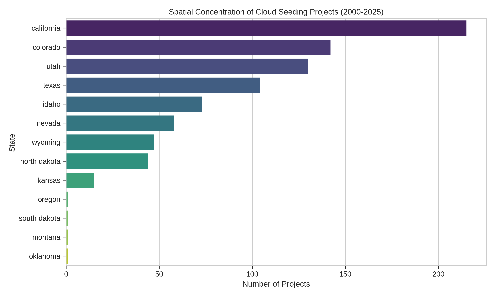
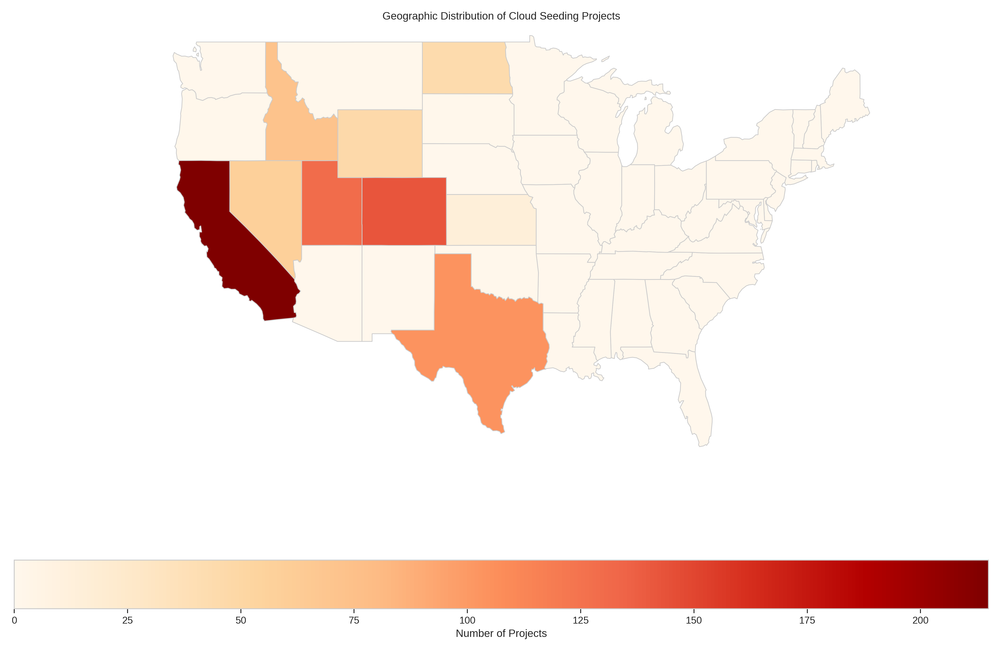
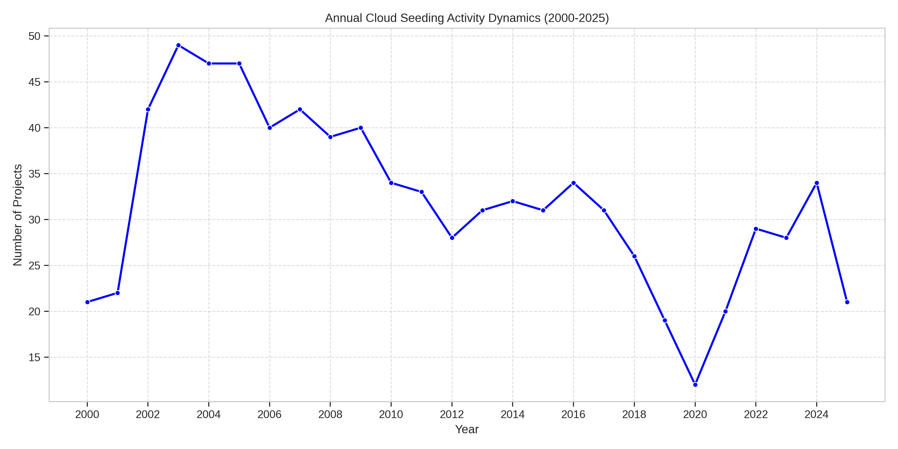
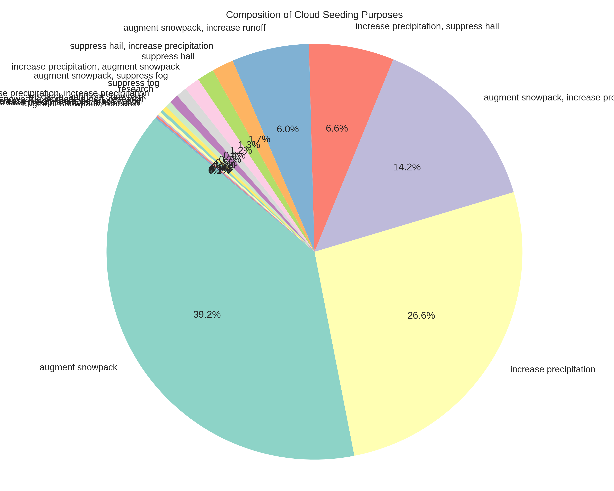
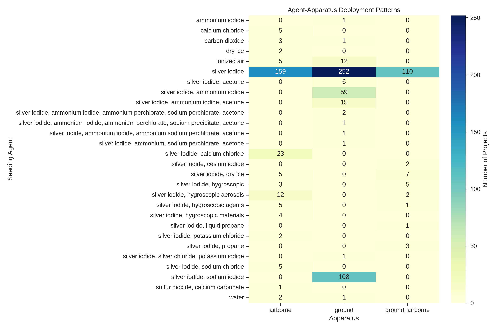

# Analysis of U.S. Cloud Seeding Projects (2000-2025)

## 1. Introduction
Cloud seeding is a form of weather modification aimed at altering precipitation patterns, typically to increase rain or snow, or to suppress hail. This report presents an independent analysis of the NOAA weather-modification records dataset covering reported cloud-seeding projects in the United States from 2000 to 2025. The scientific objective is to test whether empirical conclusions regarding spatial concentration, annual activity dynamics, purpose composition, and agent-apparatus deployment patterns can be recovered from the published structured dataset using transparent, script-based analysis.

## 2. Methodology
The dataset `cloud_seeding_us_2000_2025.csv` contains 832 official project-level records of U.S. weather modification activities. Each record includes fields such as project name, year, season, state, operator affiliation, seeding agent, deployment apparatus, stated purpose, target area, control area, start date, and end date.

The analysis was performed using Python, primarily utilizing `pandas` for data manipulation, `matplotlib` and `seaborn` for statistical visualization, and `geopandas` for geographic mapping. The analysis focused on four main areas:
1. **Spatial Concentration**: Determining which states host the most cloud seeding projects.
2. **Annual Activity Dynamics**: Tracking the number of projects per year from 2000 to 2025.
3. **Purpose Composition**: Analyzing the stated goals of the cloud seeding projects.
4. **Agent-Apparatus Deployment Patterns**: Investigating the relationship between the seeding agents used and the deployment methods (apparatus).

## 3. Results

### 3.1 Spatial Concentration
The geographic distribution of cloud seeding projects is highly concentrated in the western United States. 

*Figure 1: Number of cloud seeding projects by state (2000-2025).*

*Figure 2: Geographic map showing the concentration of cloud seeding projects across the US.*

California leads with 215 projects, followed by Colorado (142), Utah (130), Texas (104), and Idaho (73). This concentration aligns with regions historically facing water scarcity and relying heavily on snowpack for water resources.

### 3.2 Annual Activity Dynamics
The annual number of cloud seeding projects shows interesting dynamics over the 25-year period.

*Figure 3: Annual count of cloud seeding projects from 2000 to 2025.*

Activity peaked around 2003-2005 with nearly 50 projects per year, followed by a gradual decline and stabilization around 30 projects per year in the 2010s. A noticeable dip occurred in 2020 (12 projects), likely related to the COVID-19 pandemic, followed by a recovery in subsequent years.

### 3.3 Purpose Composition
Cloud seeding projects are primarily aimed at increasing water resources.

*Figure 4: Distribution of stated purposes for cloud seeding projects.*

The most common primary purpose is "augment snowpack" (326 projects), followed by "increase precipitation" (221 projects), and a combination of both (118 projects). Hail suppression is another notable purpose, often combined with increasing precipitation. This highlights the dual role of weather modification in both resource augmentation and damage mitigation.

### 3.4 Agent-Apparatus Deployment Patterns
The choice of seeding agent and deployment apparatus is a critical operational characteristic.

*Figure 5: Heatmap showing the frequency of specific seeding agents used with different deployment apparatus.*

Silver iodide is overwhelmingly the most common seeding agent. It is deployed via ground-based generators (252 projects), airborne platforms (159 projects), and a combination of both (110 projects). Other agents, such as ionized air and dry ice, are used much less frequently. Ground-based deployment is the most common single method, likely due to its cost-effectiveness for continuous operation in mountainous regions targeting snowpack augmentation.

## 4. Discussion and Conclusion
The independent analysis successfully recovers key empirical patterns from the NOAA weather-modification records dataset. The results confirm that cloud seeding in the U.S. is predominantly a Western phenomenon, primarily focused on augmenting snowpack and increasing precipitation using silver iodide deployed via ground and airborne apparatus. The temporal trends show a peak in the early 2000s, a stabilization period, and a recent pandemic-related dip followed by recovery. These findings demonstrate the utility of the structured dataset for understanding the operational landscape of weather modification in the United States.
