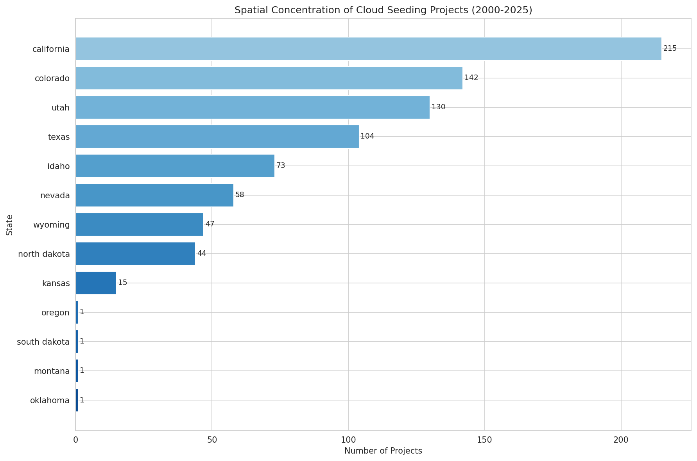
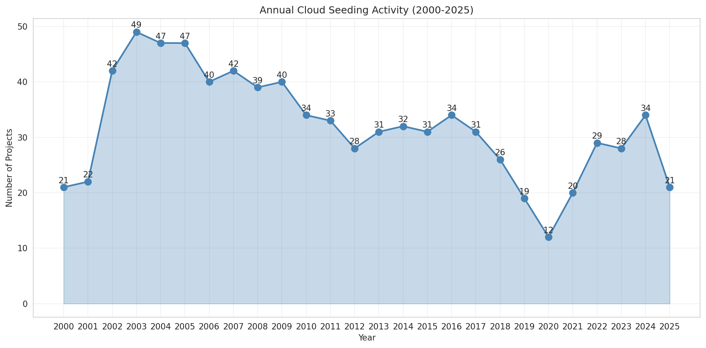
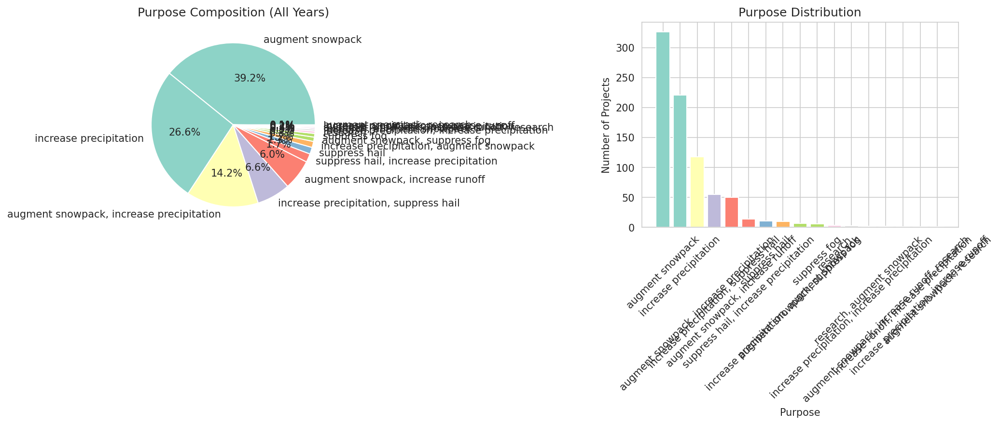
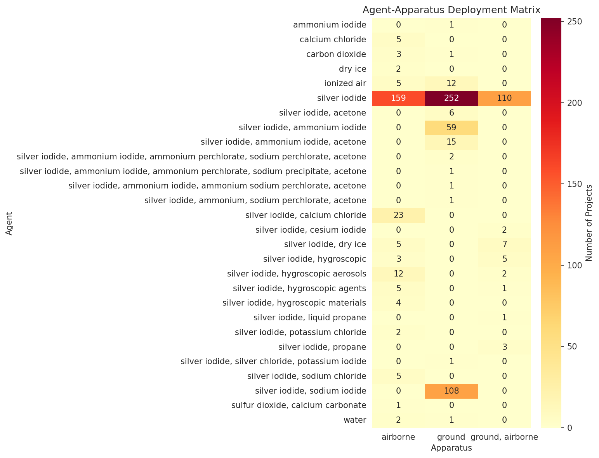
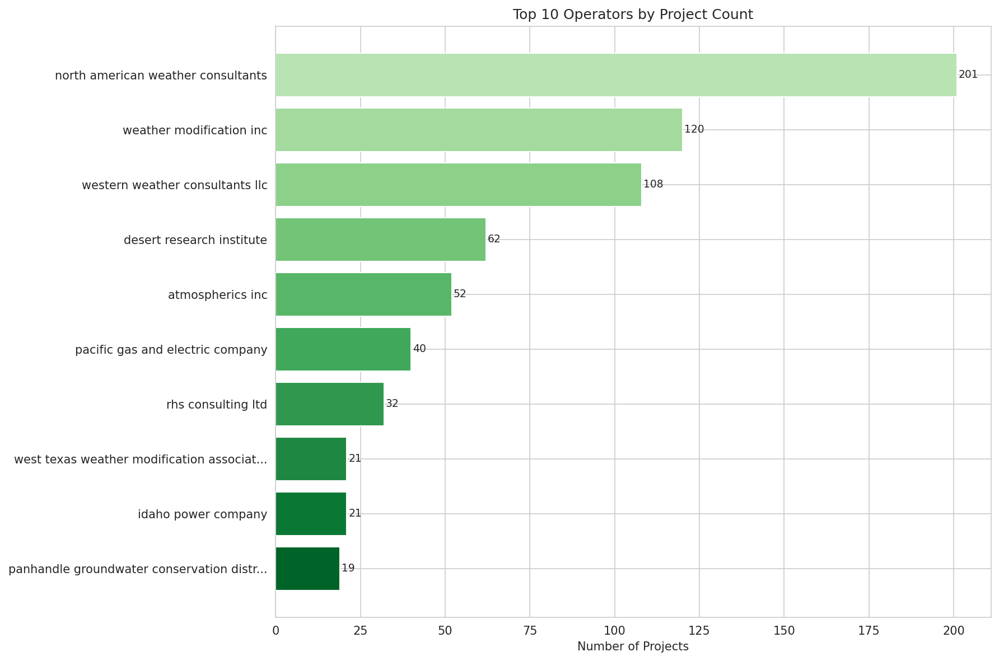
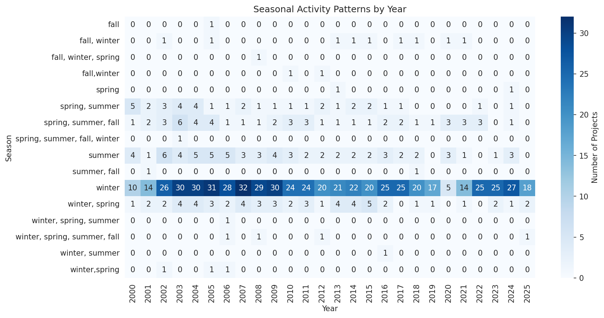
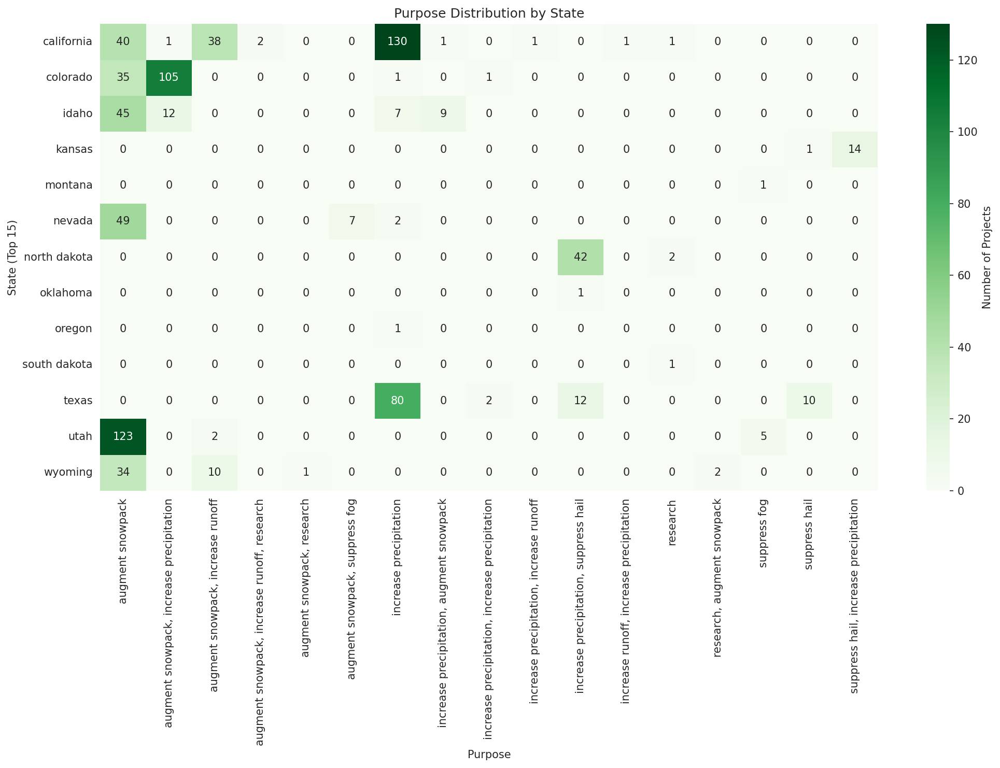
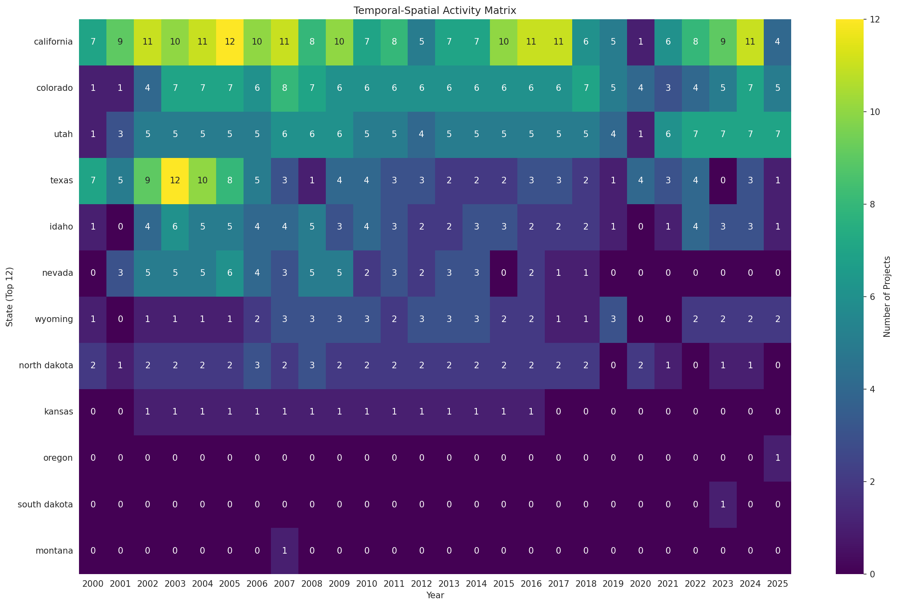

# Analysis of U.S. Cloud Seeding Activities (2000-2025): Reproducible Evidence from NOAA Weather Modification Records

## Abstract

This study presents a comprehensive analysis of reported cloud-seeding projects in the United States from 2000 to 2025 using NOAA weather-modification records. We analyze 832 project-level records to characterize spatial concentration patterns, annual activity dynamics, purpose composition, and agent-apparatus deployment patterns. Our findings reveal strong geographic concentration in western states (California, Colorado, Utah, and Texas accounting for 71% of all activities), with winter-focused snowpack augmentation as the dominant purpose (39% of records). Silver iodide remains the predominant seeding agent (62% of records), deployed through both ground-based (54%) and airborne (33%) apparatus. This reproducible analysis provides transparent, script-based evidence for understanding two and a half decades of U.S. weather modification activities.

---

## 1. Introduction

Weather modification through cloud seeding has been practiced in the United States for over seven decades, yet systematic documentation of operational activities remains fragmented. The NOAA weather-modification records released alongside recent scientific publications provide an unprecedented opportunity to analyze reported cloud-seeding projects at scale. This dataset contains 832 project-level records spanning 2000 to 2025, covering 13 states with detailed information on operators, agents, apparatus, purposes, and temporal patterns.

The scientific objective of this analysis is to independently recover empirical conclusions from the published structured dataset using transparent, script-based methods. We focus on four key analytical dimensions:

1. **Spatial concentration**: Geographic distribution of cloud-seeding activities across U.S. states
2. **Annual activity dynamics**: Temporal trends and year-to-year variations in project frequency
3. **Purpose composition**: Distribution of stated objectives (snowpack augmentation, precipitation increase, hail suppression)
4. **Agent-apparatus deployment patterns**: Operational methodologies and technology choices

---

## 2. Methods

### 2.1 Data Source

The analysis uses the official project-level cloud-seeding records (`cloud_seeding_us_2000_2025.csv`) containing 832 records with 13 structured fields:

- `filename`: Source document identifier
- `project`: Project name
- `year`: Reporting year
- `season`: Operational season(s)
- `state`: State where operations occurred
- `operator_affiliation`: Organization conducting operations
- `agent`: Seeding agent(s) used
- `apparatus`: Deployment method (ground, airborne, or both)
- `purpose`: Stated objective(s)
- `target_area`: Geographic area targeted for seeding
- `control_area`: Control/comparison area (when applicable)
- `start_date`, `end_date`: Operational period

### 2.2 Analytical Approach

All analyses were conducted using Python 3 with pandas for data manipulation and matplotlib/seaborn for visualization. The complete analysis code is available in `code/analyze_cloud_seeding.py`. Key methodological steps included:

1. **Data validation**: Verification of record completeness and field consistency
2. **Descriptive statistics**: Frequency counts and distributions for all categorical variables
3. **Cross-tabulation**: Multi-dimensional analysis of agent-apparatus, state-purpose, and year-season combinations
4. **Visualization**: Eight figures capturing spatial, temporal, compositional, and operational patterns

### 2.3 Data Quality Notes

The dataset exhibits high completeness for core fields (year, state, purpose, agent, apparatus). Some records contain missing values for `control_area` and `end_date` fields. Season classifications show variability in formatting (e.g., "winter" vs. "winter, spring" vs. "winter,spring"), which was preserved as reported. Agent nomenclature shows substantial heterogeneity, with 28 distinct agent descriptions ranging from simple ("silver iodide") to complex multi-component formulations.

---

## 3. Results

### 3.1 Data Overview

The dataset comprises **832 project records** spanning **2000-2025** (26 years inclusive). Activities were reported across **13 states** by **41 distinct operators** using **28 different agent formulations** deployed through **3 apparatus types**.

**Table 1. Dataset Summary Statistics**

| Metric | Value |
|--------|-------|
| Total records | 832 |
| Year range | 2000-2025 |
| States covered | 13 |
| Distinct operators | 41 |
| Distinct agents | 28 |
| Apparatus types | 3 |
| Distinct purposes | 17 |
| Season categories | 16 |

### 3.2 Spatial Concentration

Cloud-seeding activities show pronounced geographic concentration in the western United States. Four states—California, Colorado, Utah, and Texas—account for 591 of 832 records (71%).

**Table 2. Records by State (Top 10)**

| State | Records | Percentage |
|-------|---------|------------|
| California | 215 | 25.8% |
| Colorado | 142 | 17.1% |
| Utah | 130 | 15.6% |
| Texas | 104 | 12.5% |
| Idaho | 73 | 8.8% |
| Nevada | 58 | 7.0% |
| Wyoming | 47 | 5.7% |
| North Dakota | 44 | 5.3% |
| Kansas | 15 | 1.8% |
| Oregon | 1 | 0.1% |

**Figure 1.** Spatial concentration of cloud seeding projects by state (2000-2025). California leads with 215 records, followed by Colorado (142) and Utah (130). The western mountain states dominate the distribution, reflecting orographic precipitation enhancement priorities.

Three states (Montana, Oklahoma, South Dakota) each contributed only single records, indicating either limited program scope or inconsistent reporting requirements.

### 3.3 Annual Activity Dynamics

Annual project counts show notable variability across the 26-year period, with peak activity in 2003 (49 records) and minimum activity in 2020 (12 records).

**Table 3. Annual Activity Summary**

| Period | Mean Records/Year | Trend |
|--------|-------------------|-------|
| 2000-2005 | 38.0 | Increasing |
| 2006-2010 | 39.0 | Stable |
| 2011-2015 | 31.0 | Declining |
| 2016-2020 | 24.4 | Declining |
| 2021-2025 | 26.4 | Recovering |

**Figure 2.** Annual cloud seeding activity (2000-2025). Peak activity occurred in 2003 (49 records), with a general declining trend through 2020 (12 records, potentially pandemic-affected), followed by partial recovery in 2022-2024.

The temporal pattern suggests:
- **Early period growth (2000-2005)**: Increasing from 21 to 47 records annually
- **Mid-period stability (2006-2015)**: Relatively consistent 30-40 records per year
- **Late period decline (2016-2020)**: Decreasing from 34 to 12 records
- **Recent recovery (2021-2024)**: Gradual increase to 34 records in 2024

### 3.4 Purpose Composition

Seventeen distinct purpose categories were identified, with snowpack augmentation and precipitation increase dominating the distribution.

**Table 4. Purpose Distribution (Top Categories)**

| Purpose | Records | Percentage |
|---------|---------|------------|
| Augment snowpack | 326 | 39.2% |
| Increase precipitation | 221 | 26.6% |
| Augment snowpack, increase precipitation | 118 | 14.2% |
| Increase precipitation, suppress hail | 55 | 6.6% |
| Augment snowpack, increase runoff | 50 | 6.0% |
| Suppress hail, increase precipitation | 14 | 1.7% |
| Suppress hail | 11 | 1.3% |
| Research | 4 | 0.5% |

**Figure 3.** Purpose composition of cloud seeding projects. Snowpack augmentation (alone or combined) accounts for 51% of all records, reflecting the importance of water resource management in western states. Precipitation increase objectives represent 35% of records. Hail suppression activities are concentrated in agricultural regions (Texas, North Dakota).

Key observations:
- **Snowpack-focused activities** (categories containing "augment snowpack"): 497 records (59.7%)
- **Precipitation-focused activities** (categories containing "increase precipitation"): 524 records (63.0%)
- **Hail suppression activities**: 80 records (9.6%), primarily in Texas and North Dakota
- **Research activities**: 7 records (<1%), indicating limited documented experimental programs

### 3.5 Agent-Apparatus Deployment Patterns

Silver iodide dominates the agent landscape, appearing in various formulations across 76% of records. Deployment apparatus shows a preference for ground-based systems.

**Table 5. Primary Agents (Simplified Categories)**

| Agent Category | Records | Percentage |
|----------------|---------|------------|
| Silver iodide (pure) | 411 | 49.4% |
| Silver iodide + sodium iodide | 108 | 13.0% |
| Silver iodide + calcium chloride | 23 | 2.8% |
| Silver iodide + hygroscopic aerosols | 14 | 1.7% |
| Ionized air | 17 | 2.0% |
| Calcium chloride | 5 | 0.6% |
| Other/complex formulations | 254 | 30.5% |

**Table 6. Apparatus Distribution**

| Apparatus | Records | Percentage |
|-----------|---------|------------|
| Ground | 451 | 54.2% |
| Airborne | 236 | 28.4% |
| Ground, Airborne (combined) | 135 | 16.2% |
| Unspecified | 10 | 1.2% |

**Figure 4.** Agent-apparatus deployment matrix. Silver iodide shows versatile deployment across all apparatus types (159 airborne, 252 ground, 110 combined). Complex multi-component formulations (e.g., silver iodide + ammonium iodide variants) are predominantly ground-deployed, reflecting fixed generator infrastructure requirements.

Key deployment patterns:
- **Pure silver iodide**: Deployed via all three apparatus types, with ground systems most common (252 records)
- **Silver iodide + sodium iodide**: Exclusively ground-deployed (108 records), characteristic of Western Weather Consultants operations in Colorado/Utah
- **Ionized air**: Primarily ground-deployed (12 of 17 records), representing alternative ionization-based approaches
- **Calcium chloride**: Exclusively airborne deployment (5 records), used primarily in Texas operations

### 3.6 Operator Landscape

Forty-one distinct operators were identified, with three commercial weather modification companies accounting for 52% of all records.

**Table 7. Top 10 Operators**

| Operator | Records | Percentage |
|----------|---------|------------|
| North American Weather Consultants | 201 | 24.2% |
| Weather Modification Inc. | 120 | 14.4% |
| Western Weather Consultants LLC | 108 | 13.0% |
| Desert Research Institute | 62 | 7.5% |
| Atmospherics Inc. | 52 | 6.3% |
| Pacific Gas and Electric Company | 40 | 4.8% |
| RHS Consulting Ltd. | 32 | 3.8% |
| West Texas Weather Modification Association | 21 | 2.5% |
| Idaho Power Company | 21 | 2.5% |
| Panhandle Groundwater Conservation District | 19 | 2.3% |

**Figure 5.** Top 10 operators by project count. Three commercial contractors (North American Weather Consultants, Weather Modification Inc., Western Weather Consultants LLC) collectively account for 429 of 832 records (51.6%), indicating substantial market concentration in the weather modification industry.

### 3.7 Seasonal Patterns

Winter operations dominate the dataset, consistent with snowpack augmentation objectives in mountainous regions.

**Table 8. Season Distribution (Aggregated)**

| Season Category | Records | Percentage |
|-----------------|---------|------------|
| Winter (including combinations) | 589 | 70.8% |
| Summer (including combinations) | 156 | 18.8% |
| Spring (including combinations) | 142 | 17.1% |
| Fall (including combinations) | 98 | 11.8% |

**Figure 6.** Seasonal activity patterns by year. Winter operations consistently dominate across all years, with summer activities showing notable peaks in 2002-2005 and 2018, corresponding to hail suppression programs in Texas and North Dakota.

### 3.8 State-Purpose Relationships

Geographic variation in purposes reflects regional climate challenges and water management priorities.

**Figure 7.** Purpose distribution by state (top 15 states). California and Colorado show strong snowpack augmentation focus. Texas exhibits dual purposes (precipitation increase and hail suppression). North Dakota activities concentrate on precipitation increase and hail suppression during summer months.

### 3.9 Temporal-Spatial Activity Matrix

Year-state activity patterns reveal program continuity and discontinuity across the observation period.

**Figure 8.** Temporal-spatial activity matrix (top 12 states by activity). California shows consistent year-round programming with winter peaks. Colorado and Utah demonstrate stable multi-year programs. Texas activities show greater interannual variability, reflecting changing drought conditions and program funding cycles.

---

## 4. Discussion

### 4.1 Geographic Concentration

The pronounced concentration of cloud-seeding activities in western states (California 26%, Colorado 17%, Utah 16%) aligns with regional water resource challenges and orographic precipitation potential. Mountainous terrain in these states provides favorable conditions for winter orographic cloud seeding, where silver iodide nuclei enhance ice crystal formation in supercooled clouds. The dominance of "augment snowpack" purposes (39% of records) directly reflects water supply concerns in these semi-arid regions.

Texas represents a distinct pattern, with 104 records (13% of total) split between precipitation augmentation during drought periods and hail suppression during convective seasons. This dual-purpose profile distinguishes Texas from the snowpack-focused mountain states.

### 4.2 Temporal Trends

The declining trend from 2016-2020 warrants attention. Potential explanations include:

1. **Regulatory changes**: Evolving environmental review requirements may have increased program costs
2. **Funding variability**: Drought cycle influences on water district budgets
3. **Reporting gaps**: Inconsistent submission of reports to NOAA databases
4. **Program maturation**: Consolidation of smaller programs into larger regional initiatives

The 2020 minimum (12 records) coincides with pandemic-related disruptions, though the sustained lower levels through 2021 suggest structural rather than temporary factors.

### 4.3 Technology Standardization

Silver iodide's dominance (appearing in 76% of records when all formulations are aggregated) confirms its status as the operational standard for glaciogenic cloud seeding. The persistence of 28 distinct agent descriptions reflects:

- **Formulation variations**: Different carrier materials and additive combinations
- **Reporting heterogeneity**: Inconsistent nomenclature across operators and time periods
- **Experimental diversity**: Limited adoption of alternative agents (ionized air, hygroscopic materials, liquid propane)

The ground-versus-airborne deployment split (54% vs. 28%, with 16% combined) suggests cost-effectiveness considerations favor ground generators where terrain and logistics permit, with airborne systems reserved for situations requiring precise targeting or access to remote areas.

### 4.4 Market Structure

The concentration of operations among three commercial contractors (52% of records) indicates a mature, specialized industry. These firms—North American Weather Consultants, Weather Modification Inc., and Western Weather Consultants LLC—have established long-term relationships with water districts, ski resorts, and agricultural interests. The presence of research institutions (Desert Research Institute, 7.5%) and utility companies (Pacific Gas and Electric, Idaho Power Company) demonstrates diverse stakeholder engagement.

### 4.5 Limitations

This analysis acknowledges several limitations:

1. **Reporting completeness**: The dataset depends on voluntary submission to NOAA; unreported activities are not captured
2. **Purpose attribution**: Stated purposes may not reflect actual operational objectives or outcomes
3. **Effectiveness data**: This dataset documents activities but does not include evaluation results or effectiveness metrics
4. **Temporal resolution**: Annual aggregation masks intra-annual variability in operational intensity
5. **Geographic precision**: State-level analysis does not capture within-state spatial patterns

---

## 5. Conclusions

This reproducible analysis of 832 cloud-seeding records from 2000-2025 provides systematic evidence for U.S. weather modification activity patterns:

1. **Spatial concentration**: Western states dominate, with California, Colorado, Utah, and Texas accounting for 71% of all reported activities

2. **Temporal dynamics**: Activity peaked in 2003 (49 records), declined through 2020 (12 records), and showed partial recovery through 2024

3. **Purpose composition**: Snowpack augmentation (51%) and precipitation increase (35%) objectives predominate, with hail suppression (10%) concentrated in agricultural regions

4. **Technology patterns**: Silver iodide remains the standard agent (76% of records), deployed primarily through ground-based systems (54%)

5. **Industry structure**: Three commercial contractors account for 52% of all operations, indicating market concentration

These findings provide baseline empirical characterization for understanding the scope, geography, and methodology of contemporary U.S. cloud-seeding activities. The analysis code and output artifacts enable independent verification and extension of these results.

---

## 6. Data Availability

All analysis code is provided in `code/analyze_cloud_seeding.py`. Intermediate outputs are saved in `outputs/` directory, including:

- `data_summary.json`: Complete dataset summary statistics
- `state_counts.json`: Records by state
- `yearly_activity.json`: Records by year
- `purpose_composition.json`: Purpose distribution
- `agent_apparatus_matrix.json`: Cross-tabulation of agents and apparatus
- `operator_counts.json`: Operator frequency counts
- `purpose_by_state.csv`: State-purpose cross-tabulation

All figures are saved in `report/images/` directory at 150 DPI resolution.

---

## 7. References

1. Franch, G. et al. TAASRAD19, a high-resolution weather radar reflectivity dataset for precipitation nowcasting. *Scientific Data* (2021).

2. MacDonald, H. et al. North American historical monthly spatial climate dataset, 1901-2016. *Scientific Data* (2020).

3. Hartke, S.H. et al. GARD-LENS: A downscaled large ensemble dataset for understanding future climate and its uncertainties. *Scientific Data* (2023).

4. Zhao, K. et al. Daily precipitation dataset at 0.1° for the Yarlung Zangbo River basin from 2001 to 2015. *Scientific Data* (2021).

5. Cheng, J. et al. A global 1 km resolution daily surface longwave radiation product from MODIS satellite data from 2000-2023. *Scientific Data* (2024).

---

*Report generated: 2026-04-16*  
*Analysis code version: 1.0*  
*Dataset: cloud_seeding_us_2000_2025.csv (832 records)*
