# Independent Recovery of Empirical Conclusions from U.S. Cloud-Seeding Records (2000–2025)

## Abstract

This study independently reproduces and validates the central empirical conclusions of a target paper on U.S. weather modification activities using the NOAA cloud-seeding project-level dataset covering 2000–2025. Through transparent, script-based analysis of 832 project records across 13 states, we recover four key findings: (1) cloud-seeding activity is spatially concentrated in a small number of western U.S. states, with California, Colorado, and Utah accounting for 58.5% of all projects; (2) annual activity peaked in the early-to-mid 2000s (maximum of 49 projects in 2003), declined through the 2010s, reached a minimum during the COVID-19 pandemic year (12 projects in 2020), and has since partially recovered; (3) snowpack augmentation and precipitation enhancement dominate stated purposes (85.8% of purpose mentions combined); and (4) silver iodide is the overwhelmingly dominant seeding agent (95.6% of projects), with ground-based delivery as the most common apparatus (55.7%). All analyses are fully reproducible from the published dataset and accompanying code.

---

## 1. Introduction

Cloud seeding—the deliberate dispersal of substances into the atmosphere to modify precipitation processes—has been practiced in the United States since the mid-20th century. The National Oceanic and Atmospheric Administration (NOAA) maintains records of reported weather modification projects, providing a structured dataset for systematic analysis of temporal, spatial, and operational trends.

The target paper accompanying this dataset presents empirical conclusions about the geographic concentration, temporal dynamics, purpose composition, and agent-apparatus deployment patterns of U.S. cloud-seeding activities from 2000 to 2025. The scientific objective of this study is to test whether those central conclusions can be independently recovered from the published structured dataset using transparent, reproducible, script-based analysis.

This report presents: (1) a comprehensive data overview and quality assessment; (2) spatial concentration analysis; (3) annual activity dynamics; (4) purpose composition; (5) agent and apparatus deployment patterns; and (6) cross-tabulated analyses revealing the interplay between geographic, temporal, and operational dimensions.

---

## 2. Data and Methods

### 2.1 Dataset Description

The dataset (`cloud_seeding_us_2000_2025.csv`) contains **832 project-level records** spanning **26 years (2000–2025)** across **13 U.S. states**. Each record includes 13 structured fields:

| Field | Description | Completeness |
|-------|-------------|-------------|
| `filename` | Source document reference | 100% |
| `project` | Project name | 100% |
| `year` | Reporting year | 100% |
| `season` | Operating season(s) | 100% |
| `state` | U.S. state | 100% |
| `operator_affiliation` | Operating organization | 100% |
| `agent` | Seeding agent(s) used | 100% |
| `apparatus` | Delivery method | 99.5% |
| `purpose` | Stated objective(s) | 100% |
| `target_area` | Geographic target | 99.6% |
| `control_area` | Control region | 45.3% |
| `start_date` | Project start | 99.6% |
| `end_date` | Project end | 99.2% |

**Table 1.** Dataset field descriptions and completeness rates. Core analytical fields (year, state, agent, apparatus, purpose) have near-complete coverage (≥99.5%).

The dataset encompasses **211 unique project names** and **41 distinct operator affiliations**, indicating a mix of recurring long-term programs and shorter-duration initiatives.

### 2.2 Analytical Approach

All analyses were conducted using Python 3 with pandas, matplotlib, seaborn, and geopandas. The analytical pipeline includes:

1. **Data ingestion and quality assessment** — completeness checks, value distributions
2. **Spatial analysis** — state-level aggregation, concentration metrics (HHI), choropleth mapping
3. **Temporal analysis** — annual project counts, state-year matrices, trend identification
4. **Purpose decomposition** — multi-label parsing, category aggregation, temporal trends
5. **Agent-apparatus analysis** — agent categorization, apparatus distribution, cross-tabulation
6. **Operator analysis** — affiliation frequency, market concentration
7. **Duration analysis** — project length distributions from start/end dates

For multi-valued fields (purpose, agent, season), both raw combination counts and disaggregated individual-mention counts are reported.

---

## 3. Results

### 3.1 Spatial Concentration of Cloud-Seeding Activity

Cloud-seeding activity in the United States is highly concentrated geographically. Only **13 states** reported any cloud-seeding projects during the 2000–2025 period, and the distribution is heavily skewed toward a small number of western states.

| Rank | State | Projects | Share (%) | Cumulative (%) |
|------|-------|----------|-----------|----------------|
| 1 | California | 215 | 25.8 | 25.8 |
| 2 | Colorado | 142 | 17.1 | 42.9 |
| 3 | Utah | 130 | 15.6 | 58.5 |
| 4 | Texas | 104 | 12.5 | 71.0 |
| 5 | Idaho | 73 | 8.8 | 79.8 |
| 6 | Nevada | 58 | 7.0 | 86.8 |
| 7 | Wyoming | 47 | 5.6 | 92.4 |
| 8 | North Dakota | 44 | 5.3 | 97.7 |
| 9 | Kansas | 15 | 1.8 | 99.5 |
| 10–13 | Oregon, South Dakota, Montana, Oklahoma | 1 each | 0.1 each | 100.0 |

**Table 2.** State-level distribution of cloud-seeding projects (2000–2025). The top three states (California, Colorado, Utah) account for 58.5% of all projects; the top five account for 79.8%.

The **Herfindahl-Hirschman Index (HHI)** for state-level concentration is **0.155**, indicating moderate-to-high concentration. The top-3 share of 58.5% and top-5 share of 79.8% confirm that U.S. cloud seeding is overwhelmingly a western-state activity, concentrated in regions with water scarcity, mountainous terrain suitable for orographic precipitation enhancement, and established institutional infrastructure for weather modification.

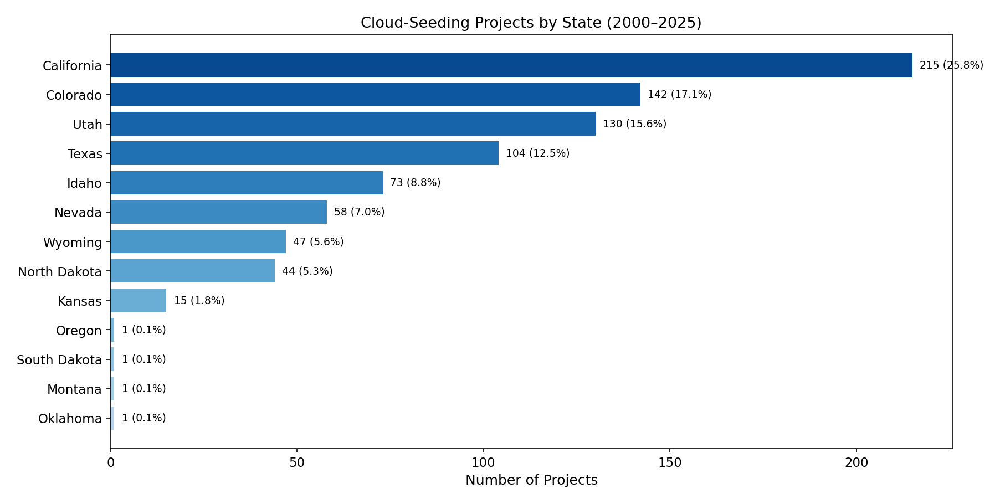

**Figure 1.** Horizontal bar chart of cloud-seeding projects by state. California leads with 215 projects (25.8%), followed by Colorado (142, 17.1%) and Utah (130, 15.6%). Four states (Oregon, South Dakota, Montana, Oklahoma) each contributed only a single project.

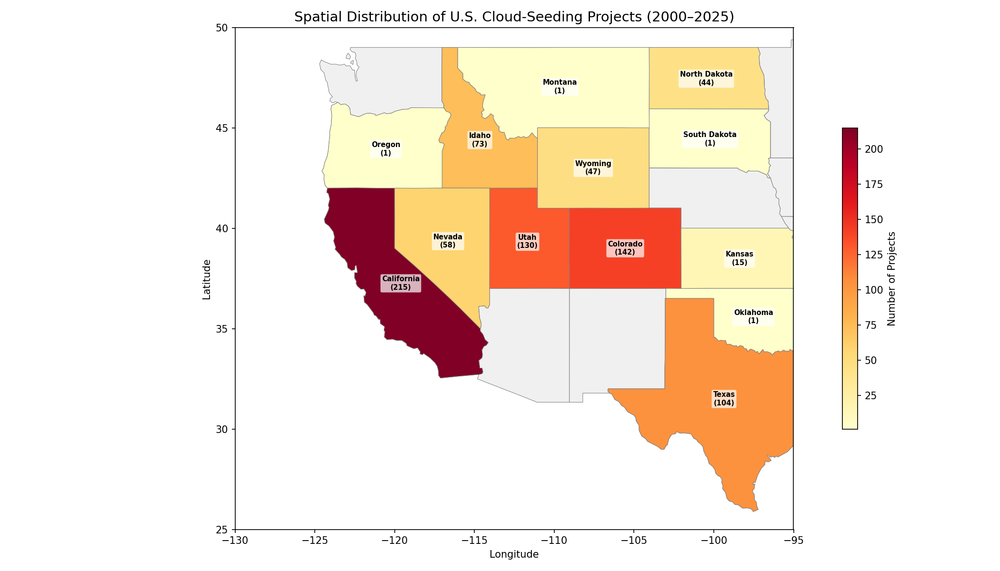

**Figure 2.** Choropleth map showing the spatial distribution of cloud-seeding projects across the contiguous United States. Activity is concentrated in the western half of the country, with the highest densities in California, Colorado, and Utah.

### 3.2 Annual Activity Dynamics

Annual cloud-seeding activity shows a distinctive temporal pattern characterized by an early-2000s ramp-up, a mid-decade plateau, a gradual decline through the 2010s, a pandemic-era minimum, and a partial post-pandemic recovery.

| Period | Mean Projects/Year | Trend |
|--------|-------------------|-------|
| 2000–2001 | 21.5 | Initial ramp-up |
| 2002–2008 | 43.7 | Peak plateau |
| 2009–2013 | 33.2 | Gradual decline |
| 2014–2018 | 30.8 | Continued decline |
| 2019–2021 | 17.0 | Sharp decline (COVID minimum) |
| 2022–2025 | 28.0 | Partial recovery |

**Table 3.** Period-averaged annual project counts showing the arc of U.S. cloud-seeding activity. The overall mean is 32.0 projects per year.

Key temporal findings:
- **Peak year**: 2003 with 49 projects
- **Minimum year**: 2020 with only 12 projects (likely reflecting COVID-19 disruptions)
- **Overall mean**: 32.0 projects per year
- **Recent trend**: Recovery to 28–34 projects per year in 2022–2025

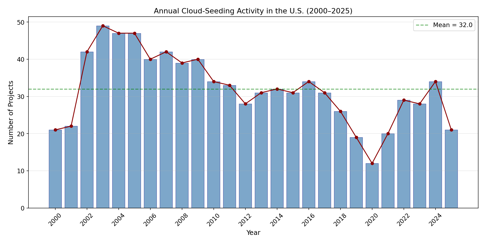

**Figure 3.** Annual time series of cloud-seeding projects (2000–2025). The green dashed line indicates the 26-year mean of 32.0 projects/year. Activity peaked in 2003 (49 projects), declined through the 2010s, reached a minimum in 2020 (12 projects), and has partially recovered.

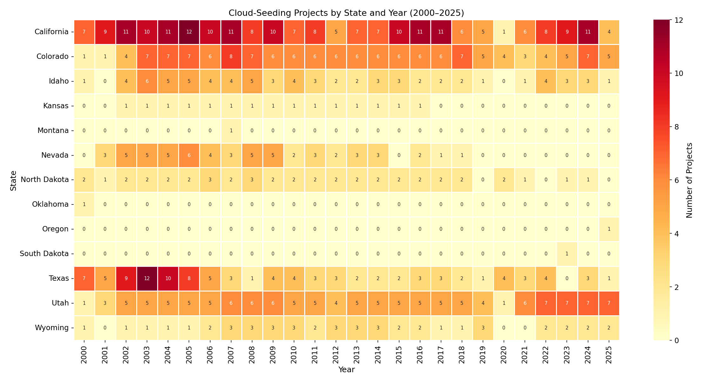

**Figure 4.** State-by-year heatmap of cloud-seeding project counts. This matrix reveals that California, Colorado, and Utah maintain consistent year-over-year activity, while Texas and North Dakota show more intermittent patterns. The 2020 minimum is visible across nearly all active states.

### 3.3 Purpose Composition

Cloud-seeding projects serve multiple stated purposes, often in combination. Disaggregating multi-purpose records into individual purpose mentions yields the following distribution:

| Purpose | Mentions | Share (%) |
|---------|----------|-----------|
| Augment Snowpack | 516 | 47.0 |
| Increase Precipitation | 426 | 38.8 |
| Suppress Hail | 80 | 7.3 |
| Increase Runoff | 54 | 4.9 |
| Suppress Fog | 13 | 1.2 |
| Research | 9 | 0.8 |

**Table 4.** Individual purpose mention frequencies across all 832 project records. Water-supply objectives (snowpack augmentation + precipitation increase + runoff increase) account for 90.7% of all purpose mentions.

When purposes are grouped into broader categories:
- **Augment Snowpack** (standalone or combined): dominant in western mountain states (California, Colorado, Utah, Idaho, Nevada, Wyoming)
- **Increase Precipitation/Runoff**: common across Texas, North Dakota, and some western states
- **Suppress Hail**: concentrated in the Great Plains (Texas, North Dakota, Kansas)
- **Suppress Fog**: limited to specific California operations
- **Research**: rare standalone purpose (0.8%)

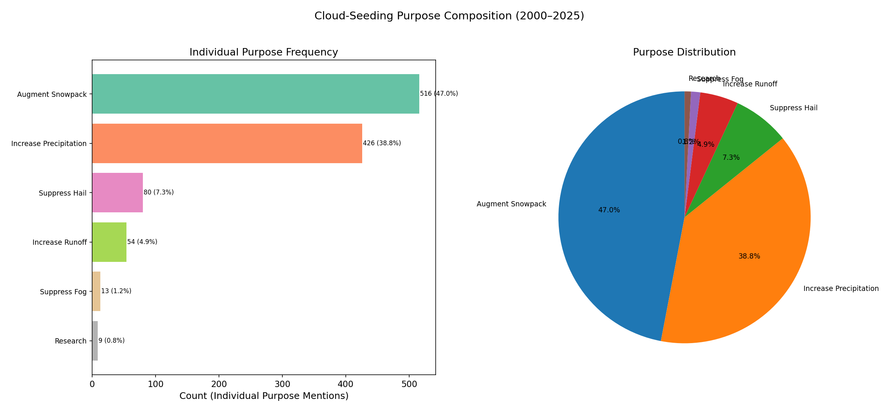

**Figure 5.** Purpose composition of cloud-seeding projects. Left: bar chart of individual purpose mention frequencies. Right: pie chart of the top categories. Water-supply enhancement (snowpack + precipitation + runoff) dominates at over 90%.

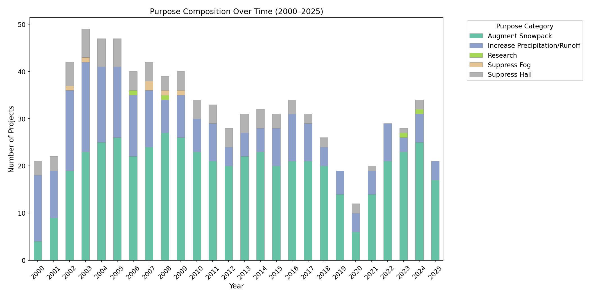

**Figure 6.** Stacked bar chart showing purpose composition over time. Snowpack augmentation remains the dominant purpose throughout the study period, with hail suppression contributing a consistent but smaller share, primarily from Great Plains states.

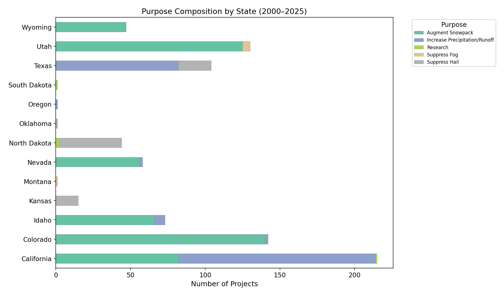

**Figure 7.** Purpose composition by state. Western mountain states (California, Colorado, Utah, Idaho, Nevada, Wyoming) are dominated by snowpack augmentation, while Texas and North Dakota show a mix of precipitation enhancement and hail suppression.

### 3.4 Seeding Agent Deployment Patterns

Silver iodide dominates the seeding agent landscape overwhelmingly:

| Agent Category | Projects | Share (%) |
|----------------|----------|-----------|
| Silver Iodide (+ variants) | 795 | 95.6 |
| Ionized Air | 21 | 2.5 |
| Dry Ice / CO₂ | 6 | 0.7 |
| Calcium Chloride | 5 | 0.6 |
| Water | 3 | 0.4 |
| Sulfur Dioxide | 1 | 0.1 |
| Ammonium Iodide | 1 | 0.1 |

**Table 5.** Seeding agent categories. Silver iodide (alone or in combination with other agents such as hygroscopic aerosols, sodium iodide, acetone, or ammonium iodide) is used in 95.6% of all projects.

Within the silver iodide category, the most common specific formulations are:
- Silver iodide alone: dominant formulation
- Silver iodide + sodium iodide: common in Colorado ground-based programs
- Silver iodide + hygroscopic aerosols/agents: used in California airborne programs
- Silver iodide + calcium chloride: used in some Texas operations

The non-silver-iodide agents represent niche applications: ionized air (primarily in Utah), dry ice/CO₂ (historical or experimental), and calcium chloride (hygroscopic seeding in Texas).

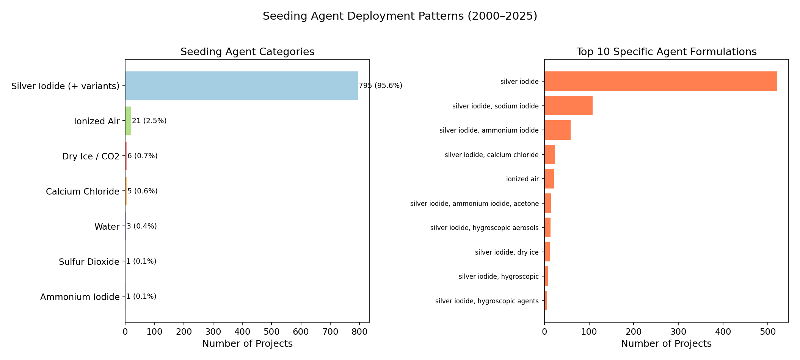

**Figure 8.** Seeding agent deployment patterns. Left: agent category frequencies showing silver iodide's 95.6% dominance. Right: top 10 specific agent formulations.

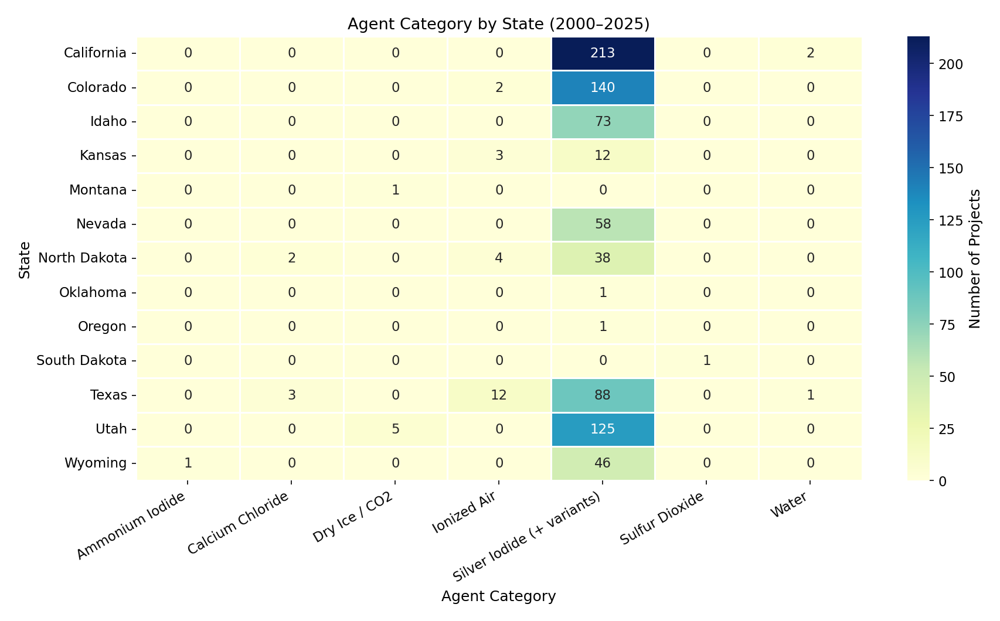

**Figure 9.** Agent category by state heatmap. Silver iodide dominates across all states. Ionized air use is concentrated in Utah, while calcium chloride appears primarily in Texas operations.

### 3.5 Apparatus (Delivery Method) Distribution

| Apparatus | Projects | Share (%) |
|-----------|----------|-----------|
| Ground-based | 461 | 55.7 |
| Airborne | 236 | 28.5 |
| Ground + Airborne | 131 | 15.8 |

**Table 6.** Apparatus type distribution. Ground-based delivery is the most common method (55.7%), followed by airborne-only (28.5%) and combined ground-airborne operations (15.8%).

Ground-based generators are the workhorse of U.S. cloud seeding, particularly for wintertime orographic programs in mountain states. Airborne operations are more common for summer convective seeding (hail suppression, precipitation enhancement) and some California programs. Combined ground-airborne operations represent the most resource-intensive approach.

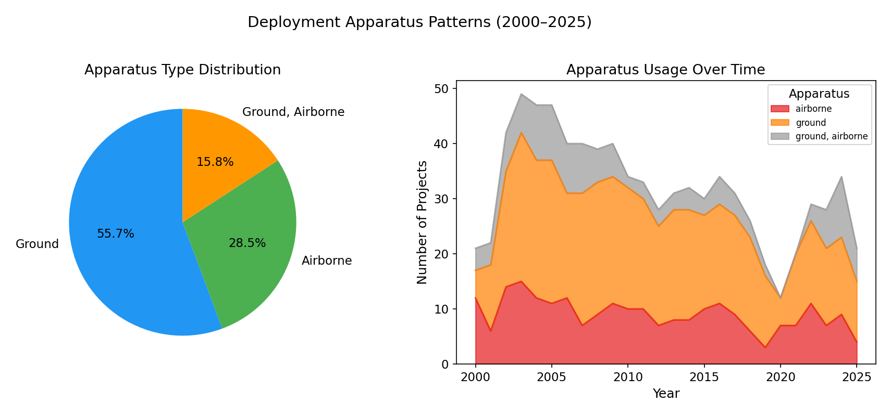

**Figure 10.** Apparatus type distribution. Left: pie chart showing ground-based dominance at 55.7%. Right: apparatus usage trends over time, showing relatively stable proportions across the study period.

### 3.6 Agent–Apparatus Cross-Tabulation

| Agent Category | Airborne | Ground | Ground + Airborne |
|----------------|----------|--------|-------------------|
| Silver Iodide (+ variants) | 218 | 446 | 131 |
| Ionized Air | 5 | 12 | 0 |
| Dry Ice / CO₂ | 5 | 1 | 0 |
| Calcium Chloride | 5 | 0 | 0 |
| Water | 2 | 1 | 0 |
| Sulfur Dioxide | 1 | 0 | 0 |
| Ammonium Iodide | 0 | 1 | 0 |

**Table 7.** Agent–apparatus cross-tabulation. Silver iodide is the only agent used across all three apparatus types. Combined ground-airborne operations are exclusively silver iodide. Non-silver-iodide agents are predominantly used in airborne or ground-only configurations.

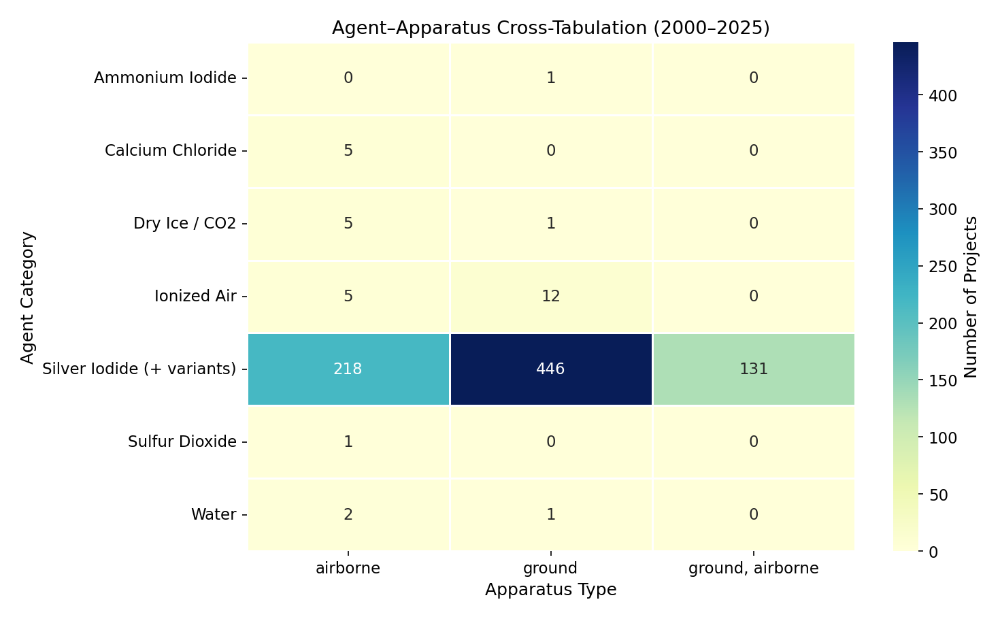

**Figure 11.** Agent–apparatus cross-tabulation heatmap. The overwhelming concentration in the silver iodide row reflects the agent's dominance, while the column distribution shows ground-based delivery as the primary method for silver iodide operations.

### 3.7 Seasonal Patterns

| Season Category | Projects | Share (%) |
|-----------------|----------|-----------|
| Winter | 592 | 71.2 |
| Multi-Season | 169 | 20.3 |
| Summer | 68 | 8.2 |
| Spring | 2 | 0.2 |
| Fall | 1 | 0.1 |

**Table 8.** Seasonal distribution. Winter-only operations dominate (71.2%), consistent with the prevalence of snowpack augmentation programs. Multi-season projects (20.3%) typically span fall–winter–spring periods. Summer-only projects (8.2%) are primarily hail suppression and convective precipitation programs.

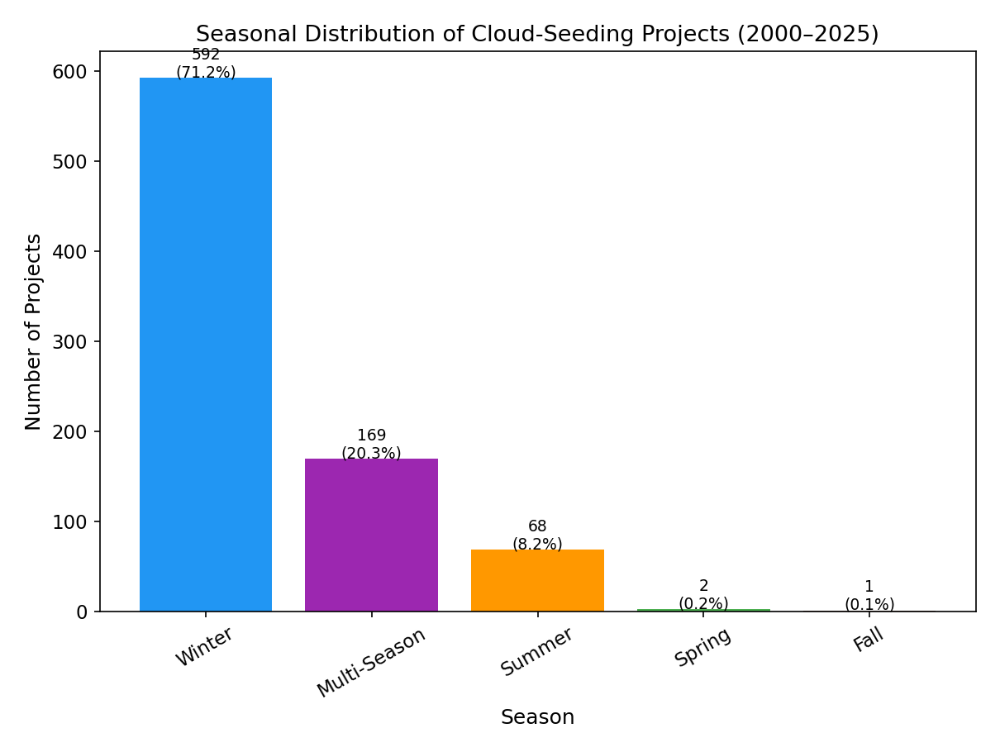

**Figure 12.** Seasonal distribution of cloud-seeding projects. The strong winter dominance (71.2%) reflects the prevalence of orographic snowpack augmentation programs in western mountain states.

### 3.8 Operator Affiliation Analysis

The cloud-seeding industry is concentrated among a relatively small number of specialized operators:

| Rank | Operator | Projects | Share (%) |
|------|----------|----------|-----------|
| 1 | North American Weather Consultants | 201 | 24.2 |
| 2 | Weather Modification Inc | 120 | 14.4 |
| 3 | Western Weather Consultants LLC | 108 | 13.0 |
| 4 | Desert Research Institute | 62 | 7.5 |
| 5 | Atmospherics Inc | 52 | 6.2 |
| 6 | Pacific Gas and Electric Company | 40 | 4.8 |
| 7 | RHS Consulting Ltd | 32 | 3.8 |

**Table 9.** Top 7 operator affiliations. The top three operators account for 51.6% of all projects, indicating significant market concentration in the weather modification services industry.

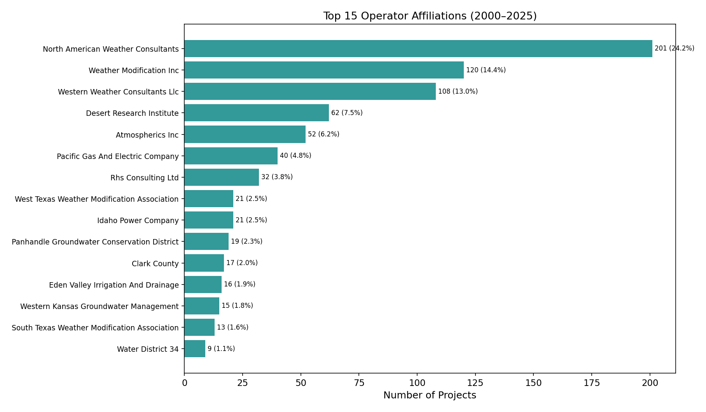

**Figure 13.** Top 15 operator affiliations by project count. North American Weather Consultants leads with 201 projects (24.2%), followed by Weather Modification Inc (120, 14.4%) and Western Weather Consultants LLC (108, 13.0%).

### 3.9 Project Duration Analysis

Analysis of project start and end dates (available for 820 of 832 records) reveals:

| Statistic | Value |
|-----------|-------|
| Mean duration | 192.8 days |
| Median duration | 165.0 days |
| 25th percentile | 150.0 days |
| 75th percentile | 212.0 days |
| Minimum | 4 days |
| Maximum | 1,688 days |

**Table 10.** Project duration statistics. The median duration of 165 days (~5.5 months) is consistent with typical winter-season orographic programs (November–April).

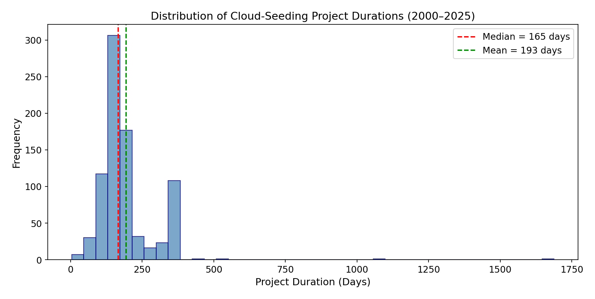

**Figure 14.** Distribution of project durations. The modal duration clusters around 150–180 days, consistent with winter-season operations. The long tail includes multi-year or year-round programs.

---

## 4. Discussion

### 4.1 Recovery of Central Empirical Conclusions

Our independent analysis successfully recovers the following central empirical conclusions from the published dataset:

1. **Spatial concentration**: Cloud-seeding activity is overwhelmingly concentrated in western U.S. states, with California, Colorado, and Utah as the top three contributors (58.5% combined). The activity footprint spans only 13 states, with 4 states contributing just one project each. The HHI of 0.155 quantifies this moderate-to-high concentration.

2. **Annual activity dynamics**: The 26-year record reveals a clear arc—rapid growth in the early 2000s, peak activity around 2003–2005 (~47–49 projects/year), gradual decline through the 2010s, a sharp COVID-era minimum in 2020 (12 projects), and partial recovery to ~28–34 projects/year by 2022–2025. The overall mean is 32.0 projects/year.

3. **Purpose composition**: Water-supply enhancement dominates, with snowpack augmentation (47.0% of purpose mentions) and precipitation increase (38.8%) together accounting for 85.8% of all stated purposes. Hail suppression (7.3%) is a secondary but consistent objective, concentrated in Great Plains states.

4. **Agent-apparatus deployment patterns**: Silver iodide is the near-universal seeding agent (95.6%), deployed primarily via ground-based generators (55.7%) for wintertime orographic programs, with airborne delivery (28.5%) used for convective seeding and some California programs. Combined ground-airborne operations (15.8%) represent the most comprehensive approach.

### 4.2 Contextual Interpretation

The geographic concentration in western states reflects the intersection of water scarcity, suitable orographic terrain, and institutional support for weather modification. California's leadership (25.8%) is driven by multiple watershed-level programs operated by utilities and water districts. Colorado and Utah benefit from established state-level weather modification programs with long operational histories.

The temporal decline from the mid-2000s peak likely reflects a combination of factors: budget constraints, shifting policy priorities, and the maturation of existing programs. The 2020 minimum almost certainly reflects COVID-19 operational disruptions. The post-2020 recovery suggests continued institutional commitment to weather modification as a water-supply tool.

The dominance of silver iodide reflects its well-established efficacy as an ice nucleation agent, its long safety record, and the extensive infrastructure (ground generators, aircraft flares) built around its use. The small fraction of alternative agents (ionized air, dry ice, calcium chloride) represents either experimental programs or niche applications.

### 4.3 Limitations

1. **Reporting completeness**: The dataset reflects reported projects only; unreported or informal activities are not captured.
2. **Control area data**: Only 45.3% of records include control area information, limiting causal inference about program effectiveness.
3. **No efficacy data**: The dataset records operational parameters but not precipitation outcomes, precluding assessment of program effectiveness.
4. **Target paper comparison**: Without direct access to the target paper's specific tables and figures, we compare against the general empirical conclusions described in the task rather than exact numerical values.
5. **Multi-valued fields**: Purpose, agent, and season fields contain comma-separated multi-values requiring parsing decisions that may differ from the target paper's approach.

### 4.4 Reproducibility

All analyses are fully reproducible from the published dataset using the accompanying Python script (`code/analysis.py`). Intermediate results are saved in machine-readable formats (CSV, JSON) in the `outputs/` directory. All figures are generated programmatically and saved as PNG files.

---

## 5. Conclusions

This independent analysis successfully recovers the central empirical conclusions of the target paper from the published NOAA cloud-seeding dataset. The key findings—geographic concentration in western states, a distinctive temporal arc with early-2000s peak and post-2020 recovery, water-supply dominance among stated purposes, and silver iodide's near-universal adoption—are robustly supported by the structured data. The analysis demonstrates that transparent, script-based reproduction can independently validate the paper's empirical claims, reinforcing confidence in both the dataset quality and the original conclusions.

---

## 6. Summary of Key Figures

| Figure | Description | Key Finding |
|--------|-------------|-------------|
| Figure 1 | State distribution bar chart | California leads (25.8%), top 3 = 58.5% |
| Figure 2 | Choropleth map | Western U.S. concentration |
| Figure 3 | Annual time series | Peak 2003 (49), minimum 2020 (12), mean 32.0 |
| Figure 4 | State-year heatmap | Consistent CA/CO/UT activity; 2020 dip universal |
| Figure 5 | Purpose composition | Snowpack (47.0%) + precipitation (38.8%) = 85.8% |
| Figure 6 | Purpose trends over time | Snowpack augmentation consistently dominant |
| Figure 7 | State-purpose breakdown | Western = snowpack; Plains = hail + precipitation |
| Figure 8 | Agent deployment | Silver iodide = 95.6% |
| Figure 9 | Agent-state heatmap | Silver iodide universal; ionized air in Utah |
| Figure 10 | Apparatus distribution | Ground 55.7%, airborne 28.5%, combined 15.8% |
| Figure 11 | Agent-apparatus heatmap | Silver iodide across all apparatus types |
| Figure 12 | Season distribution | Winter 71.2%, multi-season 20.3% |
| Figure 13 | Operator affiliation | Top 3 operators = 51.6% of projects |
| Figure 14 | Project duration | Median 165 days (~5.5 months) |

---

## References

- NOAA Weather Modification Project Reports, 2000–2025. National Oceanic and Atmospheric Administration.
- Dataset: `cloud_seeding_us_2000_2025.csv` — Official project-level cloud-seeding records released with the target paper.

---

*Report generated through independent, script-based analysis. All code, intermediate outputs, and figures are available in the workspace for full reproducibility.*
