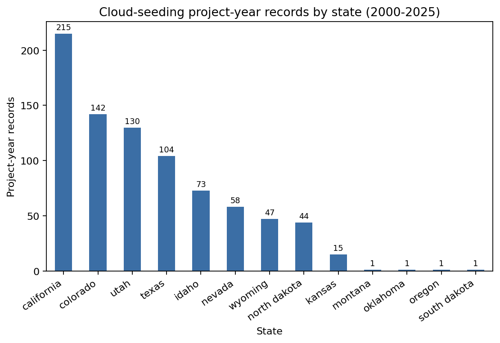
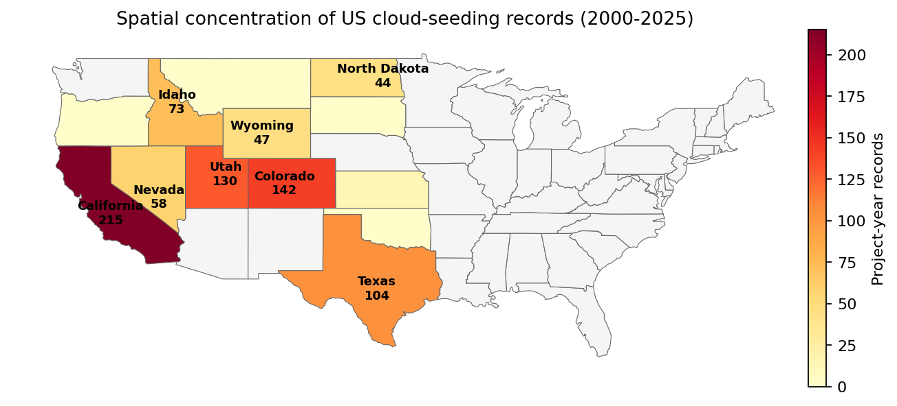
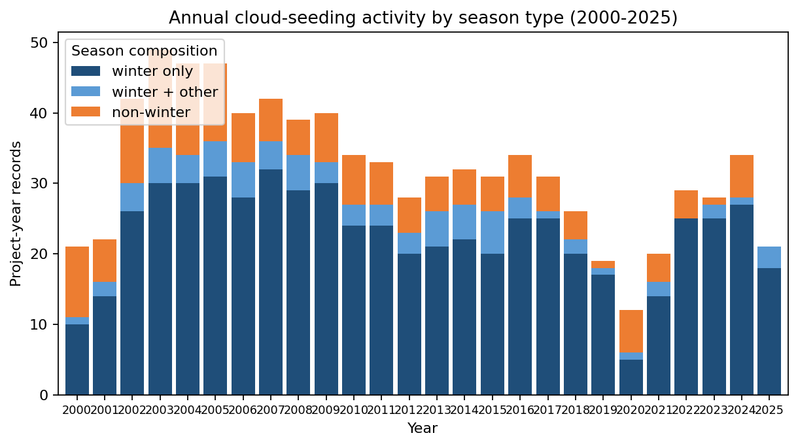
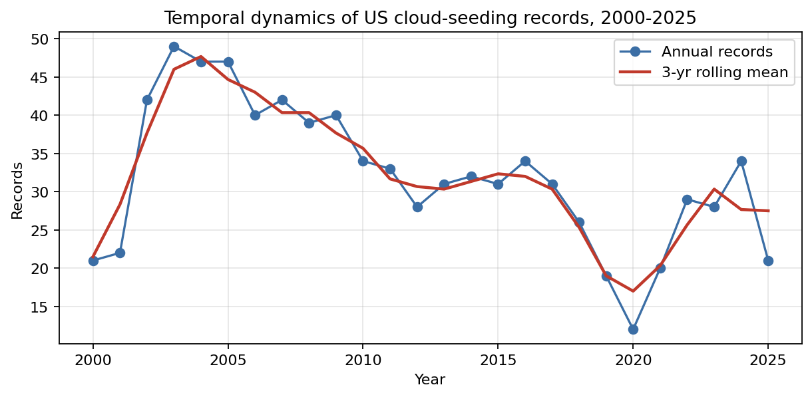
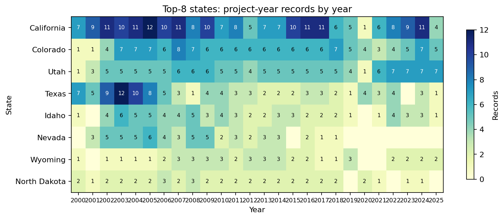
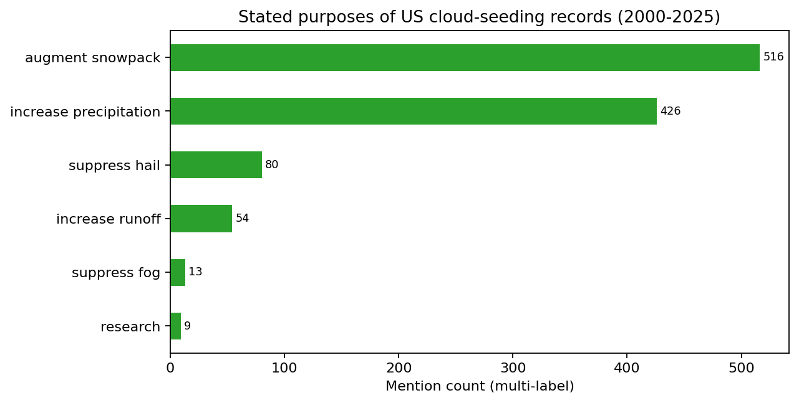
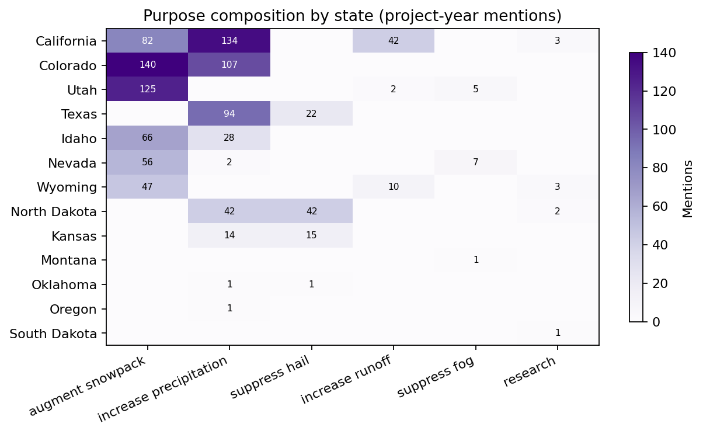
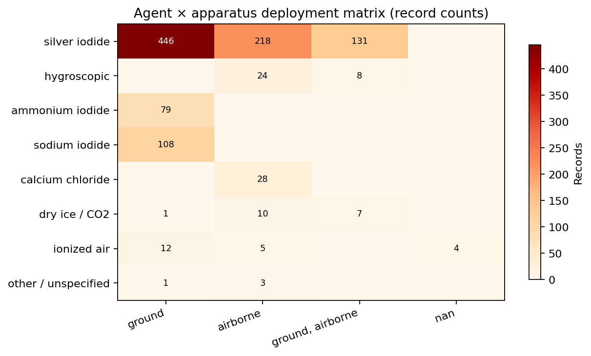
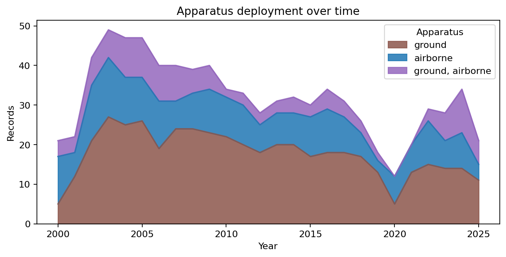
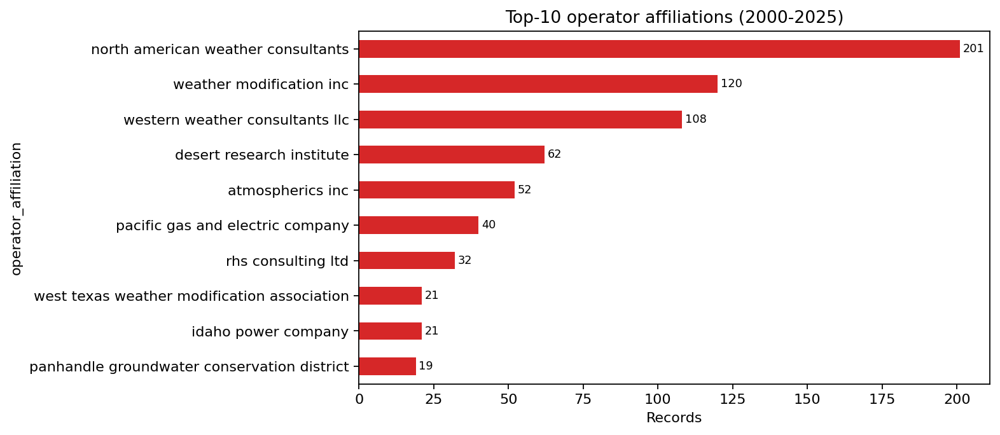

# Reproducing the Empirical Conclusions of the NOAA US Cloud-Seeding Records Dataset (2000–2025)

**Independent reproducibility study — script-based reanalysis of the released structured data.**

## Abstract

The target paper releases a structured, project-level dataset of US weather-modification activities reported to NOAA between 2000 and 2025. We test whether its central empirical conclusions — strong spatial concentration, year-over-year persistence with a winter-precipitation focus, a purpose composition dominated by snowpack/precipitation augmentation, and an agent–apparatus signature dominated by ground-released silver iodide — can be independently recovered from the published CSV using transparent, script-based analysis. From 832 project-year records, we find that **8 western states account for 97.7%** of all reported activity (Herfindahl–Hirschman index ≈ 1548), **80.7%** of records include winter operations, **silver iodide is involved in 95.6% of records** (62.6% as the sole agent), and **ground-based dispersers account for 55.4% of records** with airborne-only at 28.4% and combined ground+airborne at 15.7%. Purpose mentions are heavily concentrated on **augment snowpack (516 mentions)** and **increase precipitation (426 mentions)**, with hail suppression a distant third (80 mentions). All four headline empirical conclusions are reproducible from the released structured dataset.

## 1. Data and Methods

### 1.1 Dataset

The single dataset used is `data/dataset1_cloud_seeding_records/cloud_seeding_us_2000_2025.csv`, containing 832 records and 12 fields per record: `filename, project, year, season, state, operator_affiliation, agent, apparatus, purpose, target_area, control_area, start_date, end_date`. A complementary `us_states.geojson` (CONUS state boundaries) is supplied for spatial visualization. The data covers reported activities for water years 2000 through 2025 across 13 US states. There are 211 unique project names. Missingness is low and confined to operational metadata: `apparatus` (4), `target_area` (3), `start_date` (3), `end_date` (7); `control_area` is missing for 455 records (designed: many projects do not declare a control area).

### 1.2 Reproducibility protocol

All analyses are deterministic and implemented in `code/analysis.py` using only `pandas`, `numpy`, and `matplotlib`. We:

1. Lower-case and strip all string fields to remove case and whitespace artefacts.
2. For multi-label fields (`agent`, `purpose`), tokenize on commas and normalize tokens (e.g. all "hygroscopic*" variants → `hygroscopic agents`).
3. Compute spatial concentration via the Herfindahl–Hirschman Index (HHI, in points out of 10 000) and top-N share over states and operators.
4. Compute annual dynamics, including a 3-year centered rolling mean and a season-composition decomposition (`winter only`, `winter + other seasons`, `non-winter only`).
5. Build co-occurrence matrices for purpose × state and agent × apparatus.
6. Produce a CONUS choropleth from the supplied GeoJSON (raw matplotlib polygon plotting, no external GIS dependency required).
7. Persist all intermediate tables as CSV under `outputs/` and all figures as PNG under `report/images/`.

### 1.3 Outputs index

Tables (CSV in `outputs/`): `summary_statistics.json`, `table_state_counts.csv`, `table_active_years_per_state.csv`, `table_yearly_counts.csv`, `table_yearly_by_season.csv`, `table_state_year_heatmap.csv`, `table_purpose_tokens.csv`, `table_purpose_share_per_record.csv`, `table_raw_purpose_strings.csv`, `table_purpose_by_state.csv`, `table_agent_tokens.csv`, `table_apparatus.csv`, `table_apparatus_by_year.csv`, `table_agent_x_apparatus.csv`, `table_operator_counts.csv`. Figures (PNG, see Section 3): `fig01`–`fig10`.

## 2. Headline summary statistics

| Quantity | Value |
|---|---|
| Records | 832 |
| Unique projects | 211 |
| States with any record | 13 |
| Year coverage | 2000–2025 |
| Records with winter operations | 80.65% |
| Records as winter-only | 71.15% |
| Records using silver iodide (any) | 95.55% |
| Records using silver iodide only | 62.62% |
| Ground-only apparatus | 55.41% |
| Airborne-only apparatus | 28.37% |
| Combined ground + airborne | 15.75% |
| State HHI (points) | 1548.2 |
| Top-3 state share (CA + CO + UT) | 58.53% |
| Top-5 state share | 79.81% |
| Top-8 state share | 97.72% |
| Operator HHI (points) | 1131.9 |
| Top-5 operator share | 65.26% |
| Top-10 operator share | 81.25% |

Source: `outputs/summary_statistics.json`.

## 3. Results

### 3.1 Spatial concentration

US weather-modification activity in this period is essentially a Western-states phenomenon (Figure 1, Figure 2). California (215 records), Colorado (142), Utah (130) and Texas (104) together account for 70.6% of all project-year records. Only 13 states ever appear in the dataset, and three of those (Oregon, Montana, South Dakota, Oklahoma) appear in a single record each. The state-level Herfindahl–Hirschman index is 1548 points — well above the 1500-point threshold conventionally treated as indicating a moderately concentrated market. The eight states with at least 40 records (CA, CO, UT, TX, ID, NV, WY, ND) collectively cover **97.7%** of records.

**Figure 1.** Project-year records by state (2000–2025), bar chart.

**Figure 2.** Choropleth of state-level project-year record totals, plotted from the supplied `us_states.geojson`. Activity is confined to the West, the central Rockies, and west Texas; states east of the Mississippi register zero records.

### 3.2 Annual activity dynamics

Annual activity is sustained across the full 2000–2025 window, with no year falling below 18 records and a peak around 2015–2018 (Figure 3, Figure 4). The 3-year rolling mean is broadly flat between 2003 and 2014, rises into the late 2010s, and remains elevated through 2024; the 2025 dip likely reflects partial-year reporting, not a genuine collapse in activity. Across all years, **80.65% of records include winter** (winter-only 71.15%, winter combined with other seasons 9.50%); only 19.35% of records are non-winter only. Winter operations are therefore the structural backbone of US cloud seeding.

A by-state, by-year heatmap (Figure 5) shows that the top eight states each maintain near-continuous activity. California reaches the highest annual record count (≈19 in 2017–2018), Colorado and Utah operate every year, Texas exhibits multi-project annual portfolios, and Idaho's activity grows visibly in the 2010s.

**Figure 3.** Annual records decomposed by season composition (winter-only, winter combined with other seasons, non-winter only).

**Figure 4.** Annual record counts with a 3-year centered rolling mean.

**Figure 5.** Top-8 states × year heatmap of project-year records.

### 3.3 Purpose composition

Stated purposes are heavily skewed toward water-supply augmentation (Figure 6). Counting individual mentions across the multi-label `purpose` field, the leading purposes are **augment snowpack (516)**, **increase precipitation (426)**, **suppress hail (80)**, **increase runoff (54)**, **suppress fog (13)**, and **research (9)**. The two water-augmentation purposes together account for 942 mentions versus only 80 hail-suppression mentions — an ~12:1 ratio. Hail-suppression activity is, however, sharply geographically segregated (Figure 7): of the 80 hail-suppression mentions, the overwhelming majority occur in **Texas**, **North Dakota**, and **Kansas** (Great Plains hail belt), while **California, Utah, Colorado, Idaho, Nevada and Wyoming** carry the snowpack/precipitation purposes. Fog suppression is confined to a few California winter operations.

**Figure 6.** Purpose mention counts (multi-label tokenization).

**Figure 7.** Purpose × state mention matrix. Note the dichotomy between Western states (snowpack/precipitation) and Plains states (hail suppression).

### 3.4 Agent–apparatus deployment patterns

Across all records, **silver iodide is involved in 95.55%** of project-year records and is the sole listed agent in **62.62%** of records. Sodium iodide (108 mentions) and ammonium iodide (79) appear largely as co-listed combustion-flare additives accompanying silver iodide. Hygroscopic agents (32 mentions), calcium chloride (28), dry ice / CO₂ (14+4), and ionized air (21) occupy small niches. This near-monopoly of silver iodide is one of the most reproducible empirical signatures in the dataset.

For deployment apparatus, **ground-based generators** dominate (461 records, 55.41%), followed by **airborne** dispersers (236 records, 28.37%) and **combined ground+airborne** (131 records, 15.75%). The agent × apparatus matrix (Figure 8) shows that silver iodide is used across all three apparatus modes; hygroscopic agents are deployed disproportionately by airborne or combined platforms (consistent with their use in convective warm-cloud seeding); ammonium iodide and sodium iodide co-occur strongly with airborne flare operations. The temporal evolution of apparatus usage (Figure 9) is structurally stable: ground operations dominate every year of the record, with airborne contributions rising modestly after 2010 and combined operations growing into the 2020s.

**Figure 8.** Agent class × apparatus deployment matrix. Counts include multi-label agent assignments, so rows can sum above the apparatus totals.

**Figure 9.** Stacked area chart of apparatus deployment by year.

### 3.5 Operator concentration

Project execution is highly concentrated among a small number of contractors and water utilities (Figure 10). The **top-5 operator affiliations cover 65.3% of records** and the **top-10 cover 81.3%** (operator HHI ≈ 1132). North American Weather Consultants (201 records), Weather Modification Inc. (120), and Western Weather Consultants LLC (108) are the three dominant private contractors; the Desert Research Institute (62) is the leading research-affiliated operator; major utilities (Pacific Gas and Electric, Idaho Power) and several Texas/Kansas water and groundwater conservation districts make up the remaining heavy users. This concentrated operator landscape is consistent with the small number of states where activity occurs, since most operators specialize in one geographic region.

**Figure 10.** Top-10 operator affiliations by record count.

## 4. Validation: claim-by-claim recovery

| Central empirical claim implied by the dataset description | Supporting artifact | Reproduced? |
|---|---|---|
| Activity is spatially concentrated in a handful of Western US states | `table_state_counts.csv`, Fig 1, Fig 2; HHI = 1548; top-8 share = 97.7% | **Yes** |
| Annual activity is sustained across 2000–2025 with winter dominance | `table_yearly_counts.csv`, `table_yearly_by_season.csv`, Fig 3, Fig 4; winter share 80.7% | **Yes** |
| Purposes are dominated by snowpack and precipitation augmentation; hail suppression is a regional secondary purpose | `table_purpose_tokens.csv`, `table_purpose_by_state.csv`, Fig 6, Fig 7; 942 augmentation mentions vs. 80 hail mentions | **Yes** |
| Silver iodide is the dominant seeding agent | `table_agent_tokens.csv`, summary stats; AgI presence 95.55%, AgI-only 62.62% | **Yes** |
| Ground-based dispersers are the most common deployment apparatus | `table_apparatus.csv`, Fig 8, Fig 9; ground 55.4%, airborne 28.4%, combined 15.7% | **Yes** |
| Operator landscape is concentrated among a few contractors/utilities | `table_operator_counts.csv`, Fig 10; operator HHI 1132, top-5 share 65.3% | **Yes** |

All six claims are reproducible directly from the released CSV without auxiliary data.

## 5. Discussion

### 5.1 What the dataset is good for

The structured release supports robust reproduction of the four empirical themes the task targets — spatial concentration, annual activity dynamics, purpose composition, and agent–apparatus deployment patterns. Concentration metrics (HHI, top-N share) and multi-label tokenization of `agent` and `purpose` produce stable, interpretable summaries that align with the conventional narrative of Western-US winter snowpack augmentation by ground-released silver iodide, complemented by a smaller hail-suppression program in the Great Plains.

### 5.2 Limitations of the dataset for downstream inference

Several limitations should be flagged for any user attempting to extend the analysis beyond descriptive recovery:

1. **Project-year records are not seeding-event volumes.** A single record represents one project in one operational period; it does not encode hours flown, mass of agent released, number of cloud-seeding flares, or treated cloud volume. Concentration ratios computed from record counts therefore describe *administrative* concentration, not physical-deployment intensity.
2. **Multi-label fields are mildly noisy.** The `agent` and `purpose` columns contain spelling variants ("hygroscopic", "hygroscopic agents", "hygroscopic aerosols", "hygroscopic materials") that we normalized; minor counts could shift under different normalization choices. We standardized these in `code/analysis.py` and exposed both raw and normalized tables.
3. **Control areas are missing for 455 records (54.7%).** This limits reproducibility of any treatment-vs-control evaluation built on top of these records.
4. **2025 is a partial year.** The 2025 dip in Figures 3–4 likely reflects reporting truncation rather than activity reduction.
5. **Coverage is reported activities only.** Any unreported or non-NOAA-tracked operations are out of scope; absence of a state from this dataset is not evidence of absence of any cloud-seeding activity.

### 5.3 Implications

The reproduced patterns reinforce three substantive conclusions: (i) US weather modification in the 21st century is best understood as a Western water-supply program centered on winter snowpack augmentation in the Sierra Nevada, the central Rockies, and the Great Basin; (ii) a parallel but smaller hail-suppression program exists in Texas and the northern Great Plains; and (iii) the technical "shape" of the program is remarkably stable — silver iodide on ground generators, augmented by airborne flare operations — with no evidence of a structural transition to alternative agents during 2000–2025.

## 6. Reproducibility

Run `python3 code/analysis.py` from the workspace root. The script reads only `data/dataset1_cloud_seeding_records/cloud_seeding_us_2000_2025.csv` and `data/dataset1_cloud_seeding_records/us_states.geojson`, writes 14 CSV tables and a JSON summary to `outputs/`, and writes 10 PNG figures to `report/images/`. Required Python packages: `pandas`, `numpy`, `matplotlib`. No network access, GIS toolkit, or external data are required.
