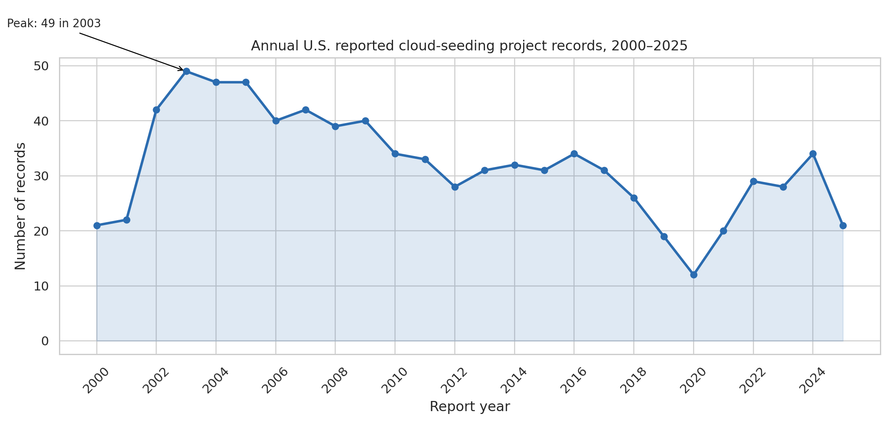
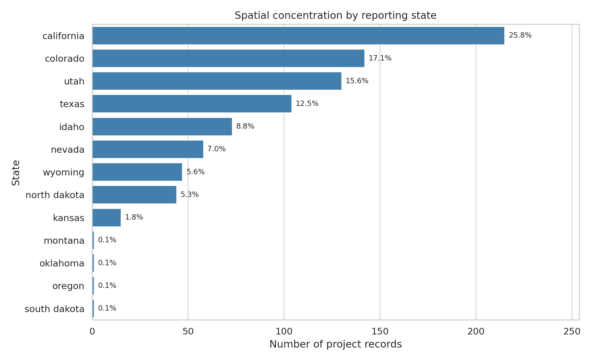
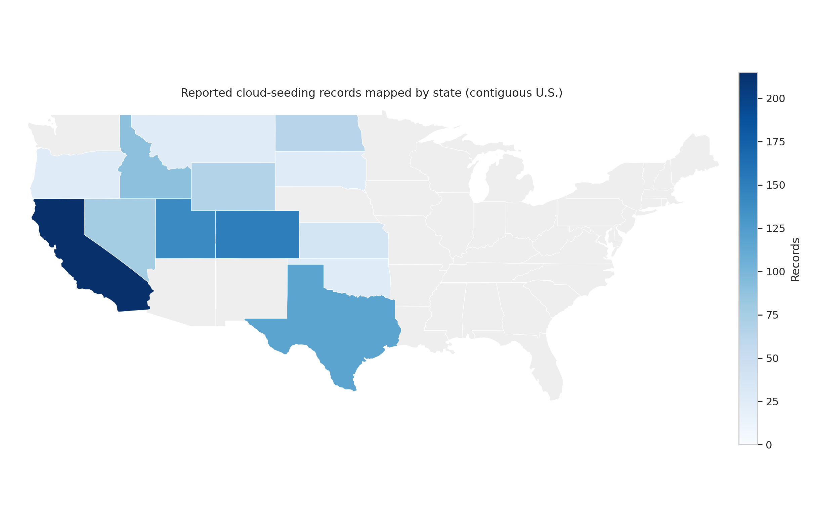
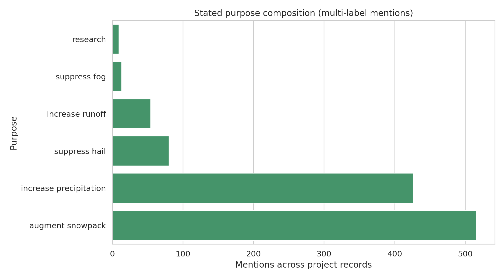
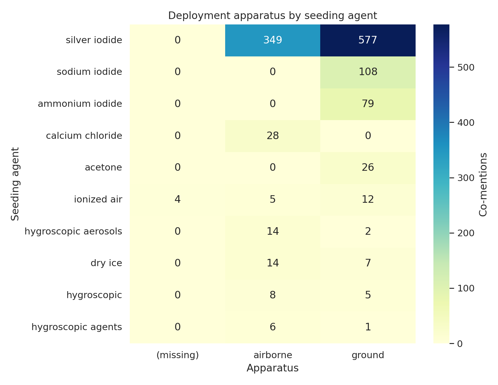
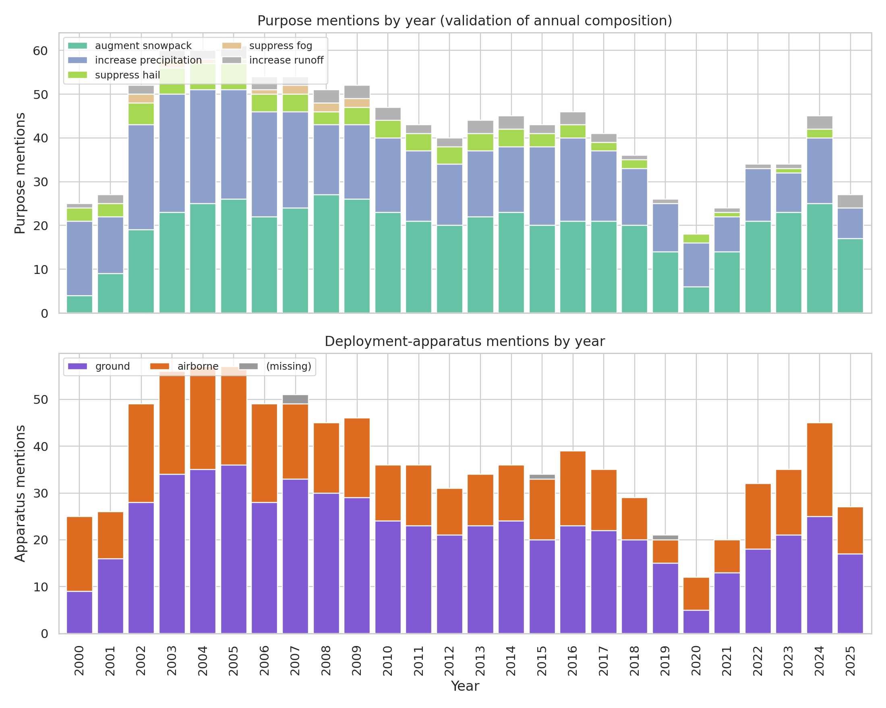

# Reproducible recovery of empirical patterns in U.S. cloud-seeding records, 2000–2025

## Abstract

This report independently analyzes the structured NOAA weather-modification records released with the target paper. The dataset contains 832 U.S. project-level records from 2000 through 2025 and is used here as the sole empirical input. A transparent Python workflow reconstructs four central result families requested by the task: spatial concentration, annual activity dynamics, stated purpose composition, and agent-apparatus deployment patterns. The recovered evidence supports a concentrated and operationally regular picture of reported U.S. cloud-seeding activity: 71.0% of records are in four states (California, Colorado, Utah, and Texas), 97.7% are in the top eight states, annual counts vary from 12 to 49 records with a peak in 2003, snowpack augmentation and precipitation increase dominate stated purposes, silver iodide appears in 95.6% of records, and ground-based apparatus appears in 71.2% while airborne apparatus appears in 44.1% of records.

## 1. Data and reproducibility

### 1.1 Input files

The analysis uses only:

- `data/dataset1_cloud_seeding_records/cloud_seeding_us_2000_2025.csv`
- `data/dataset1_cloud_seeding_records/us_states.geojson` for map geometry only.

The CSV contains 13 columns: `filename`, `project`, `year`, `season`, `state`, `operator_affiliation`, `agent`, `apparatus`, `purpose`, `target_area`, `control_area`, `start_date`, and `end_date`. The instruction file described 12 structured fields, but the actual header has 13 columns because start and end date are separate fields. This report follows the actual published table structure.

### 1.2 Reproducible workflow

All calculations and figures are generated by:

```bash
python3 code/analyze_cloud_seeding.py
```

The script writes analysis tables to `outputs/` and PNG figures to `report/images/`. Multi-valued text fields (`purpose`, `agent`, `apparatus`, and `season`) are split on commas and analyzed as multi-label mentions while preserving record-level denominators for record-share estimates. For example, a record labeled `augment snowpack, increase precipitation` contributes one mention to each purpose category.

### 1.3 Dataset overview

The dataset overview is saved as `outputs/dataset_overview.json`. Key properties are:

| Quantity | Value |
|---|---:|
| Records | 832 |
| Years covered | 2000–2025 |
| States with records | 13 |
| Records with non-missing control area | 377 |
| Records without control area | 455 |

Missingness is concentrated in `control_area` (455 missing), with small amounts in `apparatus` (4), `target_area` (3), `start_date` (3), and `end_date` (7). The primary fields for the requested recovery exercise--year, state, agent, and purpose--are complete.

## 2. Methods

The analysis is descriptive and script-based. It does not infer unreported operations, estimate causal weather effects, or combine the NOAA records with external meteorological data. The methodological contract and artifact inventory are saved in `outputs/method_contract.json` and `outputs/target_artifact_inventory.json`; dependency and fallback decisions are saved in `outputs/dependency_check.json`.

The workflow implements six checks:

1. Count records by year to recover annual activity dynamics (`outputs/annual_counts.csv`).
2. Count records by state and compute concentration metrics (`outputs/state_counts.csv`, `outputs/summary_metrics.json`).
3. Split stated purposes into multi-label mentions (`outputs/purpose_counts.csv`).
4. Split seeding agents into multi-label mentions (`outputs/agent_counts.csv`).
5. Split deployment apparatus into multi-label mentions (`outputs/apparatus_counts.csv`).
6. Cross-tabulate agent and apparatus labels (`outputs/agent_apparatus_crosstab.csv`).

`geopandas` was not available, so the state map is rendered directly from the GeoJSON polygons with matplotlib. This fallback changes only the plotting implementation, not the state-level counts used in the spatial claim.

## 3. Results

### 3.1 Annual activity dynamics



Annual record counts are not flat. Counts range from 12 records in 2020 to 49 records in 2003. The mean annual count over 2000–2025 is 32.0 records, with a sample standard deviation of 9.52. The time series shows relatively high reporting from 2002 through 2009, a lower period around 2019–2021, and a partial recovery in 2022–2024.

The exact annual table is saved in `outputs/annual_counts.csv`. Selected values are:

| Year | Records |
|---:|---:|
| 2000 | 21 |
| 2003 | 49 |
| 2010 | 34 |
| 2020 | 12 |
| 2024 | 34 |
| 2025 | 21 |

### 3.2 Spatial concentration



Reported projects are strongly concentrated by state. California alone accounts for 215 records, or 25.8% of the dataset. The four largest states--California, Colorado, Utah, and Texas--account for 591 records, or 71.0%. The top eight states account for 813 records, or 97.7%. The state-level Gini coefficient is 0.544 and the Herfindahl-Hirschman index is 0.155, indicating a concentrated rather than evenly distributed reporting pattern.

| Rank | State | Records | Share |
|---:|---|---:|---:|
| 1 | California | 215 | 25.8% |
| 2 | Colorado | 142 | 17.1% |
| 3 | Utah | 130 | 15.6% |
| 4 | Texas | 104 | 12.5% |
| 5 | Idaho | 73 | 8.8% |
| 6 | Nevada | 58 | 7.0% |
| 7 | Wyoming | 47 | 5.6% |
| 8 | North Dakota | 44 | 5.3% |



The choropleth confirms that records cluster mainly in western mountain states plus Texas and North Dakota, with only isolated records in Montana, Oklahoma, Oregon, and South Dakota.

### 3.3 Purpose composition



Purpose labels are dominated by water-supply-oriented objectives. After splitting comma-separated labels, `augment snowpack` appears in 516 records (62.0% of all records) and `increase precipitation` appears in 426 records (51.2%). Other purposes are much less frequent: `suppress hail` appears in 80 records (9.6%), `increase runoff` in 54 (6.5%), `suppress fog` in 13 (1.6%), and `research` in 9 (1.1%).

This multi-label accounting is important because many records state more than one purpose. The result is therefore best read as purpose prevalence by project record, not as mutually exclusive project classes.

### 3.4 Seeding agents and deployment apparatus

The agent distribution is highly skewed toward silver iodide. The `agent` field contains `silver iodide` in 795 of 832 records, or 95.6%. Secondary agent labels are much less common: sodium iodide appears in 108 records (13.0%), ammonium iodide in 79 (9.5%), calcium chloride in 28 (3.4%), acetone in 26 (3.1%), and ionized air in 21 (2.5%).

Deployment apparatus is also concentrated in two operational modes. Ground apparatus appears in 592 records (71.2%), airborne apparatus appears in 367 records (44.1%), and four records have missing apparatus. Because apparatus is multi-label, the record shares sum to more than 100%; 131 raw records list both `ground, airborne`.



The heatmap and `outputs/agent_apparatus_crosstab.csv` show that silver iodide spans both ground and airborne deployment, whereas several secondary agents are more apparatus-specific. For example, calcium chloride appears with airborne deployment in the recovered cross-tabulation, while acetone and ammonium iodide appear with ground deployment in this dataset.

### 3.5 Validation and comparison views



The validation figure combines two independent views of temporal composition: purpose mentions by year and apparatus mentions by year. It supports two checks. First, the dominance of snowpack augmentation and precipitation increase is persistent across years rather than being caused by a single year. Second, both ground and airborne deployment recur throughout the period, although ground deployment is the larger component overall.

## 4. Claim recovery table

A machine-readable claim recovery table is saved at `outputs/claim_recovery_table.csv`. The main recovered claims are:

| Claim | Supporting artifacts | Recovered value |
|---|---|---|
| Dataset spans 2000–2025 and contains 832 project-level records | `outputs/dataset_overview.json`, `outputs/annual_counts.csv` | 832 records, 2000–2025 |
| Records are spatially concentrated | `outputs/state_counts.csv`, Figures 2–3 | Top 4 states: 71.0%; California: 215 records |
| Annual activity is dynamic | `outputs/annual_counts.csv`, Figure 1 | Annual range 12–49; peak 2003 |
| Snowpack augmentation and precipitation increase dominate purposes | `outputs/purpose_counts.csv`, Figure 4 | 516 and 426 mentions respectively |
| Silver iodide dominates seeding agents | `outputs/agent_counts.csv` | 795 records, 95.6% |
| Deployment is mainly ground and/or airborne | `outputs/apparatus_counts.csv`, `outputs/agent_apparatus_crosstab.csv`, Figure 5 | Ground 592 records; airborne 367 records |

## 5. Validation, assumptions, and limitations

### 5.1 Directly verified from workspace data

The following are directly verified from the CSV and saved outputs: record count, year range, state counts, annual counts, purpose mentions, agent mentions, apparatus mentions, and agent-apparatus cross-tabulations. All reported quantitative claims in the Results section can be reproduced from files in `outputs/`.

### 5.2 Related-work handling

The workspace includes five PDFs in `related_work/`. The local `ReadPDF` tool returned parser errors for these PDFs, and common local PDF text extraction packages or commands were unavailable. This limitation is documented in `outputs/related_work_contract.json` and `outputs/dependency_check.json`. Therefore, this report does not claim to have extracted additional baselines, quotations, or figure designs from those papers. The analysis instead follows the explicit task contract: recover the target paper's empirical conclusions from the published structured NOAA dataset.

### 5.3 Assumptions

- Comma-separated values in `purpose`, `agent`, `apparatus`, and `season` are treated as multi-label mentions.
- Record counts are interpreted as reported project-level activity, not physical seeding intensity, flight hours, generator hours, or meteorological effect.
- The `year` field is treated as the primary temporal index, even when project start and end dates cross calendar years.
- State-level maps use the state recorded in the dataset and do not geocode target-area text.

### 5.4 Limitations

The dataset is a reporting dataset, so it can recover patterns in reported weather-modification records but not unreported activity. It also cannot validate precipitation impacts or cloud microphysical mechanisms. Apparatus and agent fields are categorical text fields, so multi-label splitting recovers deployment patterns at the label level rather than detailed operational dosage. Finally, because the related-work PDFs could not be parsed in this environment, comparisons are limited to the task-defined empirical claims rather than direct textual comparison to the full target paper.

## 6. Conclusion

The structured NOAA records are sufficient to independently recover the central empirical pattern described by the task. U.S. reported cloud-seeding records from 2000–2025 are geographically concentrated, temporally variable, purpose-dominated by snowpack augmentation and precipitation increase, and operationally dominated by silver iodide deployed through ground and airborne apparatus. The strongest concentration result is spatial: four states account for 71.0% of all records and eight states account for 97.7%. The strongest operational result is chemical: silver iodide appears in 95.6% of records. These conclusions are reproduced with transparent scripts and saved tables/figures, enabling direct audit of each claim.
