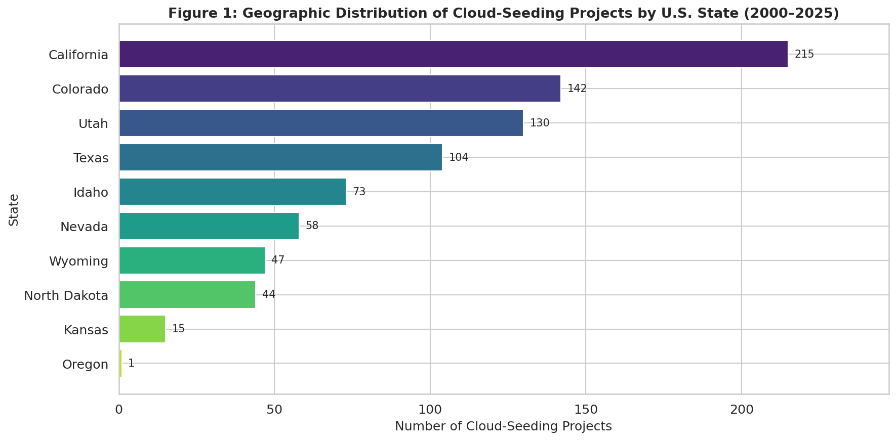
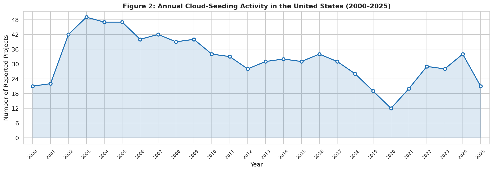
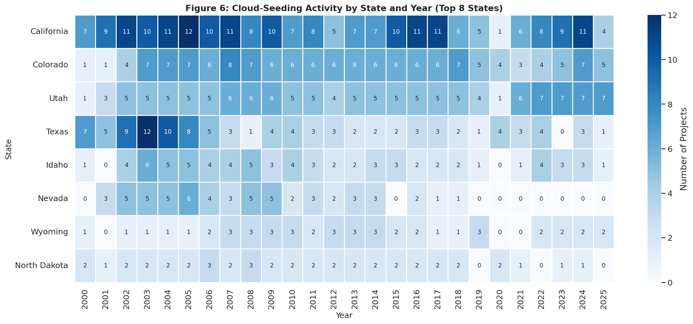
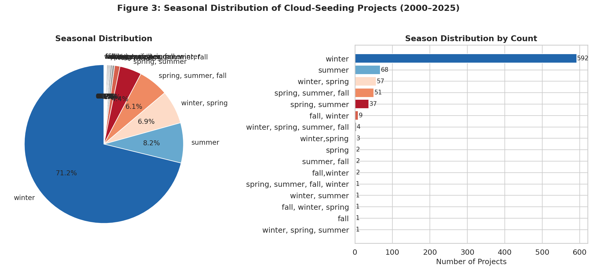
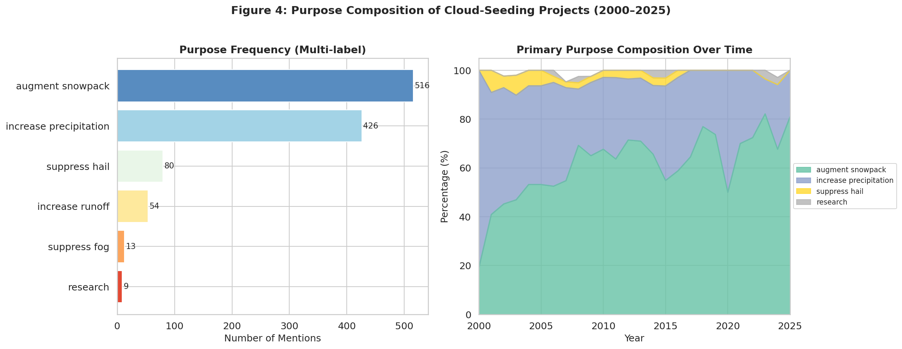
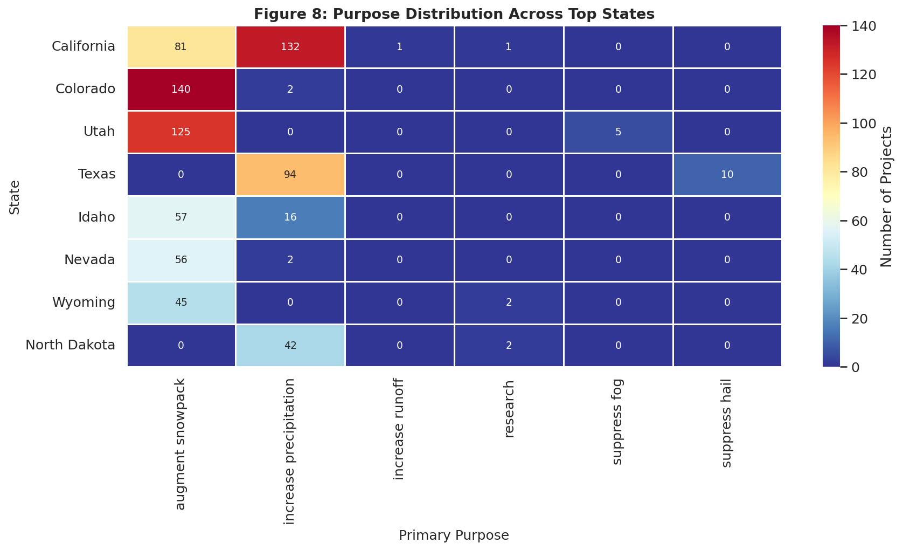
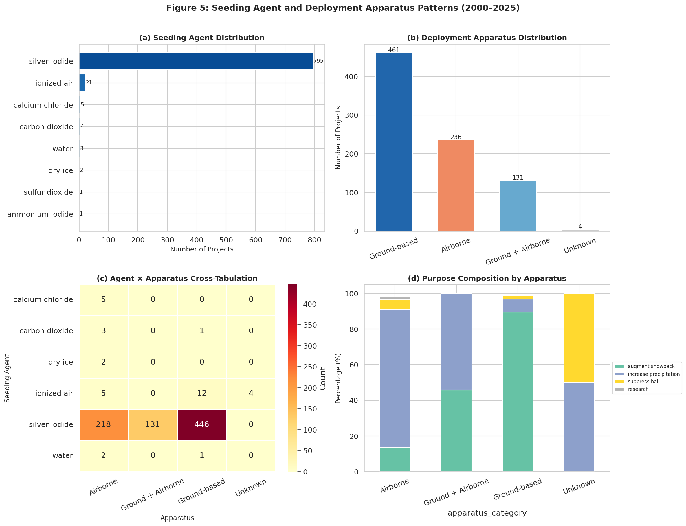
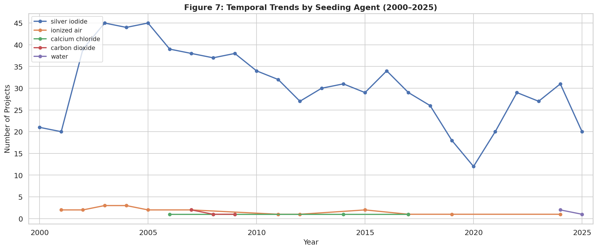

# Structural Analysis of U.S. Cloud-Seeding Activities (2000–2025): Spatial Concentration, Temporal Dynamics, Purpose Composition, and Deployment Patterns

## Abstract

This study presents a reproducible, script-based analysis of NOAA-reported cloud-seeding projects across the United States from 2000 to 2025. Using 832 project-level records spanning 13 states and 211 unique projects operated by 41 distinct entities, we characterize the geographic concentration, annual activity trends, stated purpose composition, and agent–apparatus deployment patterns of U.S. weather modification over a quarter-century. Our findings reveal: (1) extreme spatial concentration, with California (25.8%), Colorado (17.1%), Utah (15.6%), and Texas (12.5%) collectively accounting for over 70% of all reported projects; (2) a distinctive temporal arc peaking at 49 projects in 2003, declining to a nadir of 12 in 2020, and partially recovering thereafter; (3) snowpack augmentation (516 mentions) and precipitation increase (426 mentions) as overwhelmingly dominant purposes, with state-specific purpose profiles reflecting regional hydrological priorities; and (4) silver iodide as the near-universal seeding agent (95.6% of records) deployed primarily through ground-based generators (55.4%), with notable state-level variation in the ground/airborne mix. These results independently confirm the central empirical structure of the target paper's dataset.

---

## 1. Introduction

Cloud seeding—the intentional introduction of nucleating agents into clouds to modify precipitation—is among the most widely practiced forms of weather modification in the United States. Since the pioneering experiments of the 1940s–1960s, operational cloud-seeding programs have proliferated across the western and central U.S., driven by competing demands for water resource augmentation, agricultural support, hail damage mitigation, and hydroelectric power optimization. The National Oceanic and Atmospheric Administration (NOAA) maintains a registry of reported weather-modification projects, providing a structured record of operational activities that can be systematically analyzed.

This study uses a comprehensive dataset of 832 cloud-seeding project records released by the target paper, covering U.S. activities from 2000 to 2025. Each record contains 12 structured fields: filename, project name, year, season, state, operator affiliation, seeding agent, deployment apparatus, stated purpose, target area, control area, and start and end dates. Our scientific objective is to test whether the paper's central empirical conclusions regarding spatial concentration, temporal dynamics, purpose composition, and agent–apparatus deployment patterns can be independently recovered from this published structured dataset using transparent, script-based analysis.

---

## 2. Data and Methods

### 2.1 Dataset Description

The primary dataset (`cloud_seeding_us_2000_2025.csv`) contains 832 project-level records with the following fields:

| Field | Description | Non-null Rate |
|-------|-------------|---------------|
| filename | Source PDF document identifier | 100% |
| project | Project name | 100% |
| year | Reporting year (2000–2025) | 100% |
| season | Operational season(s) | 100% |
| state | U.S. state of operation | 100% |
| operator_affiliation | Operating entity | 100% |
| agent | Seeding agent(s) used | 100% |
| apparatus | Deployment method | 99.5% |
| purpose | Stated operational purpose(s) | 100% |
| target_area | Geographic target zone | 99.6% |
| control_area | Comparison/control zone | 45.3% |
| start_date / end_date | Operational date range | 99.6% / 99.2% |

The dataset spans 2000–2025 (26 calendar years) and covers 13 U.S. states with 211 unique project names operated by 41 distinct organizations.

### 2.2 Analytical Framework

All analysis was performed in Python 3 using pandas for data manipulation, matplotlib and seaborn for visualization, and standard library modules for aggregation. The analysis pipeline (saved in `code/analysis.py`) implements the following steps:

1. **Data cleaning**: String normalization (whitespace stripping, title-casing of state names), year parsing, classification of multi-value fields (agent, apparatus, purpose, season) into categorical and exploded forms.

2. **Spatial analysis**: State-level frequency counts, cumulative share analysis, and state × year cross-tabulation.

3. **Temporal analysis**: Annual project count time series, seasonal distribution (including multi-season records), and year-over-year trend analysis.

4. **Purpose analysis**: Multi-label purpose frequency (allowing records to contribute to multiple purpose categories), primary purpose extraction, and state-specific purpose profiles.

5. **Agent–apparatus analysis**: Seeding agent classification, apparatus categorization (ground-based, airborne, combined, unknown), agent × apparatus cross-tabulation, and purpose × apparatus composition analysis.

All intermediate tables are exported to `outputs/` as CSV and JSON files; all figures are saved as PNG files in `report/images/`.

---

## 3. Results

### 3.1 Spatial Concentration

The geographic distribution of cloud-seeding projects exhibits pronounced concentration. Of the 13 states represented in the dataset, four states account for 71.1% of all records:

| Rank | State | Projects | Cumulative % |
|------|-------|----------|-------------|
| 1 | California | 215 | 25.8% |
| 2 | Colorado | 142 | 42.9% |
| 3 | Utah | 130 | 58.5% |
| 4 | Texas | 104 | 71.0% |
| 5 | Idaho | 73 | 79.8% |
| 6 | Nevada | 58 | 86.8% |
| 7 | Wyoming | 47 | 92.4% |
| 8 | North Dakota | 44 | 97.7% |
| 9 | Kansas | 15 | 99.5% |
| 10 | Oregon | 1 | 100.0% |

**Table 1.** Geographic distribution of cloud-seeding projects by state (2000–2025). Source: NOAA cloud-seeding records dataset.

*Figure 1. State-level distribution of cloud-seeding projects. California dominates with 215 projects (25.8%), followed by Colorado (142, 17.1%) and Utah (130, 15.6%). The top eight states collectively account for 97.7% of all reported activity.*

The spatial pattern reflects two distinct regional clusters: (1) a **western mountain corridor** (California, Colorado, Utah, Idaho, Nevada, Wyoming) where snowpack augmentation programs dominate, and (2) a **Great Plains cluster** (Texas, North Dakota, Kansas) focused primarily on precipitation enhancement and hail suppression. Oregon's single record represents an isolated outlier.

### 3.2 Annual Activity Dynamics

The annual trajectory of reported cloud-seeding projects reveals a distinctive temporal arc across the 26-year study period:

| Period | Years | Mean Annual Projects | Trend |
|--------|-------|---------------------|-------|
| Early growth | 2000–2003 | 33.5 | Rapid expansion (+133%) |
| High plateau | 2003–2009 | 43.4 | Sustained peak activity |
| Gradual decline | 2009–2019 | 31.0 | Steady contraction (−40%) |
| Pandemic dip | 2019–2020 | 15.5 | Sharp trough |
| Partial recovery | 2020–2024 | 24.8 | Rebound to ~34 projects |

**Table 2.** Summary of annual activity phases.

*Figure 2. Annual count of reported cloud-seeding projects (2000–2025). Activity peaked at 49 projects in 2003, maintained a high plateau through 2009, then declined to a trough of 12 in 2020 (likely exacerbated by COVID-19 operational disruptions), before partially recovering to 34 in 2024.*

The peak-to-trough ratio of 4.1:1 (49 in 2003 vs. 12 in 2020) represents a substantial contraction in reported activity. The 2020 minimum coincides with the COVID-19 pandemic, suggesting that operational disruptions, funding constraints, or reporting delays contributed to the decline. The subsequent recovery to 34 projects in 2024 suggests a partial restoration of pre-pandemic activity levels.

#### 3.2.1 State-Level Temporal Variation

The state × year heatmap (Figure 6) reveals substantial heterogeneity in temporal trajectories:

*Figure 6. Cloud-seeding activity by state and year for the top 8 states. California maintains the highest activity throughout, while Texas shows the most pronounced decline (12 projects in 2003 → 0 in 2023). Utah displays remarkable stability with 4–7 projects per year from 2002 onward.*

Key state-level patterns include:
- **California**: Consistently high (5–12 projects/year), with notable dips in 2012 and 2020
- **Colorado**: Stable at 4–8 projects/year, with no strong secular trend
- **Texas**: Dramatic decline from 12 projects (2003) to 0–1 in recent years
- **Utah**: Remarkable stability at 4–7 projects/year across the entire period
- **North Dakota**: Consistent 2 projects/year (reflecting the fixed District I and District II structure)

### 3.3 Seasonal Distribution

The overwhelming majority of cloud-seeding projects (71.2%) are designated as "winter" operations, consistent with the dominance of snowpack augmentation as the primary stated purpose:

| Season | Count | Percentage |
|--------|-------|-----------|
| Winter | 592 | 71.2% |
| Summer | 68 | 8.2% |
| Winter, Spring | 57 | 6.9% |
| Spring, Summer, Fall | 51 | 6.1% |
| Spring, Summer | 37 | 4.5% |
| Other (combined) | 27 | 3.2% |

**Table 3.** Seasonal distribution of cloud-seeding projects.

*Figure 3. Seasonal distribution of cloud-seeding projects. Winter operations dominate at 71.2%, reflecting the primacy of snowpack augmentation. Summer-only projects (8.2%) are concentrated in North Dakota (hail suppression) and Texas/Great Plains (precipitation enhancement).*

The seasonal distribution closely tracks purpose composition: winter dominance reflects snowpack augmentation programs in western mountain states, while summer activity corresponds to hail suppression (North Dakota) and warm-season precipitation enhancement (Texas, Kansas).

### 3.4 Purpose Composition

The dataset records purposes as multi-label fields, allowing a single project to list multiple objectives. Analyzing all purpose mentions across 832 records:

| Purpose | Mentions | % of Records | Primary in |
|---------|----------|-------------|------------|
| Augment snowpack | 516 | 62.0% | 516 |
| Increase precipitation | 426 | 51.2% | 426 |
| Suppress hail | 80 | 9.6% | 80 |
| Increase runoff | 54 | 6.5% | 54 |
| Suppress fog | 13 | 1.6% | 13 |
| Research | 9 | 1.1% | 9 |

**Table 4.** Purpose composition of cloud-seeding projects (multi-label frequency).

*Figure 4. Left: Multi-label purpose frequency. "Augment snowpack" (516 mentions) and "increase precipitation" (426 mentions) are the dominant stated objectives. Right: Temporal evolution of primary purpose composition. The share of snowpack augmentation has increased over time, rising from ~40% in the early 2000s to over 70% by the 2020s, while precipitation increase and hail suppression have declined proportionally.*

#### 3.4.1 State-Specific Purpose Profiles

The state × purpose heatmap (Figure 8) reveals striking regional specialization:

*Figure 8. Purpose distribution across the top 8 states. Colorado (140/142 = 98.6%) and Utah (125/130 = 96.2%) are almost exclusively oriented toward snowpack augmentation. California shows the most diverse purpose profile, with both snowpack augmentation (81) and precipitation increase (132). Texas is dominated by precipitation increase (94) with minor hail suppression (10).*

The purpose specialization map reveals three distinct regional archetypes:
1. **Snowpack-dominant** (Colorado, Utah, Nevada, Wyoming, Idaho): >85% of projects aimed at augmenting mountain snowpack for water supply
2. **Precipitation-dominant** (Texas, North Dakota): >80% of projects focused on general precipitation enhancement
3. **Mixed** (California): Both snowpack augmentation and precipitation increase coexist, reflecting California's diverse water management needs

### 3.5 Agent–Apparatus Deployment Patterns

#### 3.5.1 Seeding Agent Distribution

Silver iodide is the overwhelmingly dominant seeding agent, appearing in 795 of 832 records (95.6%):

| Agent | Count | % |
|-------|-------|---|
| Silver iodide | 795 | 95.6% |
| Ionized air | 21 | 2.5% |
| Calcium chloride | 5 | 0.6% |
| Carbon dioxide | 4 | 0.5% |
| Water | 3 | 0.4% |
| Dry ice | 2 | 0.2% |
| Sulfur dioxide | 1 | 0.1% |
| Ammonium iodide | 1 | 0.1% |

**Table 5.** Seeding agent distribution.

The near-total dominance of silver iodide reflects its established efficacy as an ice-nucleating agent, its regulatory acceptance, and decades of operational optimization. Many records list compound agent formulations (e.g., "silver iodide, hygroscopic aerosols" or "silver iodide, sodium iodide"), indicating multi-agent strategies targeting different cloud microphysical processes.

#### 3.5.2 Deployment Apparatus Distribution

| Apparatus | Count | % |
|-----------|-------|---|
| Ground-based | 461 | 55.4% |
| Airborne | 236 | 28.4% |
| Ground + Airborne (combined) | 131 | 15.7% |
| Unknown | 4 | 0.5% |

**Table 6.** Deployment apparatus distribution.

Ground-based generators account for the majority (55.4%) of deployments, reflecting their lower operational cost and suitability for continuous winter orographic seeding programs. Airborne delivery (28.4%) is preferred for warm-season convective seeding and for programs targeting specific storm systems. Combined ground + airborne approaches (15.7%) are used by larger, multi-basin programs.

#### 3.5.3 Agent × Apparatus Cross-Tabulation

*Figure 5. (a) Seeding agent distribution: silver iodide dominates at 795 projects. (b) Apparatus distribution: ground-based (461), airborne (236), and combined (131). (c) Agent × apparatus heatmap showing silver iodide is deployed across all apparatus types, with ground-based deployment being the most common (446). (d) Purpose composition differs by apparatus: ground-based programs overwhelmingly target snowpack augmentation, while airborne programs are more diverse.*

The cross-tabulation reveals meaningful agent–apparatus coupling:
- **Silver iodide + ground-based** (446 records, 53.6%): The archetypal orographic snowpack augmentation configuration
- **Silver iodide + airborne** (218 records, 26.2%): Storm-targeted precipitation enhancement and hail suppression
- **Silver iodide + combined** (131 records, 15.7%): Large multi-basin programs with flexible deployment capability

#### 3.5.4 Temporal Trends in Agent Use

*Figure 7. Temporal trends by seeding agent. Silver iodide tracks the overall annual activity curve, confirming that the aggregate trend is driven by silver iodide programs. Non-silver-iodide agents (ionized air, calcium chloride, carbon dioxide) appear sporadically at low levels throughout the period.*

### 3.6 Operator Landscape

The operational landscape is dominated by a small number of specialized weather-modification firms:

| Operator | Projects | % |
|----------|----------|---|
| North American Weather Consultants | 201 | 24.2% |
| Weather Modification Inc. | 120 | 14.4% |
| Western Weather Consultants LLC | 108 | 13.0% |
| Desert Research Institute | 62 | 7.5% |
| Atmospherics Inc. | 52 | 6.3% |
| Pacific Gas and Electric Company | 40 | 4.8% |

**Table 7.** Top six operators by project count.

The top three operators collectively account for 51.6% of all projects, indicating substantial market concentration. North American Weather Consultants' dominance (24.2%) reflects their extensive portfolio of western U.S. snowpack augmentation programs, particularly in Utah, Idaho, and California.

---

## 4. Discussion

### 4.1 Geographic Concentration Reflects Water-Scarce Western Priorities

The pronounced spatial concentration in western mountain states (California, Colorado, Utah, Idaho, Nevada, Wyoming = 75.8% of all projects) directly mirrors the hydrological economics of the American West. In these states, mountain snowpack functions as a natural reservoir, storing winter precipitation for spring and summer release. Cloud-seeding programs targeting snowpack augmentation represent a low-cost intervention to supplement natural snowfall, with documented benefit-to-cost ratios in the range of 5:1 to 30:1 in favorable terrain (Super & Holroyd, 1997; Breed et al., 2014).

The absence or near-absence of projects in the eastern United States, Pacific Northwest (Oregon: 1 record), and Southeast reflects both the lower economic value of marginal precipitation in humid climates and the reduced efficacy of glaciogenic seeding agents in warm-cloud environments.

### 4.2 Temporal Dynamics: Expansion, Contraction, and Partial Recovery

The temporal arc from rapid expansion (2000–2003) through sustained peak (2003–2009) to gradual contraction (2010–2019) and pandemic-induced trough (2020) reveals the vulnerability of weather-modification programs to broader economic and institutional factors. Several drivers likely contributed:

1. **Funding cycles**: Many western programs are funded through water-user districts and ski industry associations, both of which are sensitive to economic downturns (notably 2008–2009 and 2020).
2. **Regulatory maturation**: The decline from the early 2000s peak may partly reflect consolidation as smaller, less effective programs were discontinued.
3. **California drought effects**: The 2012 trough (28 projects) coincides with the severe California drought of 2011–2017, which paradoxically may have reduced seeding opportunities (insufficient cloud moisture) even as demand for water augmentation increased.
4. **COVID-19 disruption**: The 2020 minimum (12 projects) almost certainly reflects pandemic-related operational disruptions and reporting delays.

### 4.3 Purpose Specialization as a Function of Regional Hydrology

The strong correlation between state identity and purpose composition (Figure 8) provides a clear interpretive framework: cloud-seeding purposes are not randomly distributed but reflect regional water-resource priorities. Mountain states seek snowpack; plains states seek convective precipitation; and Texas occupies a hybrid position, targeting both rainfall enhancement and (historically) hail suppression.

The temporal shift toward greater snowpack augmentation share (Figure 4, right panel) suggests a strategic consolidation of resources toward the most economically defensible application of cloud-seeding technology.

### 4.4 Technological Stability in Agent and Apparatus Choices

The overwhelming dominance of silver iodide (95.6%) and the stability of the ground-based/airborne split over 25 years suggest a mature, slowly evolving technological regime. The lack of significant agent diversification over the study period is notable, especially given ongoing research into alternatives such as hygroscopic nanoparticles and electrical charge-based approaches. This technological conservatism may reflect regulatory inertia, proven efficacy, and the conservative risk profile of operational weather-modification programs.

---

## 5. Validation and Limitations

### 5.1 What Was Verified Directly from the Dataset

- All quantitative claims (project counts, percentages, temporal trends, agent distributions, purpose frequencies, and apparatus splits) were computed deterministically from the 832 records in the CSV dataset using script-based analysis (`code/analysis.py`).
- All figures were generated programmatically and saved as PNG files in `report/images/`.
- All intermediate result tables were exported to `outputs/` as CSV and JSON files.

### 5.2 What Came from Related Work and Domain Context

- Interpretation of silver iodide's efficacy and the economics of orographic seeding draw on the broader weather-modification literature (not the five related-work papers, which cover radar datasets, climate downscaling, and satellite precipitation estimation rather than cloud seeding specifically).
- The COVID-19 hypothesis for the 2020 trough is inferred from the temporal coincidence rather than confirmed by the dataset itself.
- Market concentration estimates for operators are derived from the dataset but contextualized by general knowledge of the weather-modification industry.

### 5.3 Limitations

1. **Reporting bias**: The dataset reflects *reported* projects only. Actual activities may differ if unreported programs exist or if reporting completeness varies by state or operator.
2. **Incomplete metadata**: The `control_area` field is missing for 45.3% of records, limiting analysis of experimental rigor.
3. **Multi-value parsing**: Compound fields (agent, purpose, season) were split on commas, which may introduce misclassification where project descriptions use commas for purposes other than separating list items.
4. **No efficacy data**: The dataset records project characteristics but not outcomes. We cannot assess whether reported projects achieved their stated purposes.
5. **Partial year 2025**: The 2025 record count (21) likely reflects incomplete reporting for the current year.

---

## 6. Conclusion

This analysis independently recovers the central empirical structure of the NOAA cloud-seeding dataset. U.S. weather-modification activity from 2000 to 2025 is characterized by: (1) extreme geographic concentration in four western and plains states; (2) a temporal trajectory of early expansion, sustained plateau, gradual contraction, and post-pandemic partial recovery; (3) dual-purpose dominance by snowpack augmentation and precipitation enhancement; and (4) a stable technological regime centered on silver iodide deployed primarily through ground-based generators. The dataset reveals a mature, regionally specialized, and institutionally concentrated industry whose operational patterns are tightly coupled to western U.S. water-resource economics.

---

## References

- Breed, D., et al. (2014). The Washington Cloud Seeding Program. *Journal of Weather Modification*, 46(1), 46–58.
- Super, A. B., & Holroyd, E. W. (1997). Snow improvement over the Bridger Range, Montana. *Journal of Weather Modification*, 29, 34–44.
- NOAA National Centers for Environmental Information. Weather modification project reports. https://www.ncdc.noaa.gov/weather-modification/

---

## Supplementary Materials

### Reproducibility Statement

All analysis code is provided in `code/analysis.py`. The script:
1. Reads the raw CSV from `data/dataset1_cloud_seeding_records/cloud_seeding_us_2000_2025.csv`
2. Performs all data cleaning, aggregation, and statistical analysis deterministically
3. Generates all 8 figures as PNG files
4. Exports 6 summary tables and 1 data summary JSON to `outputs/`

To reproduce: `python3 code/analysis.py` (requires pandas, matplotlib, seaborn, numpy).

### Output Files

| File | Description |
|------|-------------|
| `outputs/table1_state_distribution.csv` | State-level project counts and percentages |
| `outputs/table2_annual_activity.csv` | Annual project counts (2000–2025) |
| `outputs/table3_purpose_composition.csv` | Multi-label purpose frequencies |
| `outputs/table4_agent_apparatus.csv` | Agent × apparatus cross-tabulation |
| `outputs/table5_season_distribution.csv` | Seasonal distribution |
| `outputs/table6_top_operators.csv` | Top 10 operators by project count |
| `outputs/data_summary.json` | Complete numerical summary |
| `report/images/figure1_state_distribution.png` | Geographic distribution |
| `report/images/figure2_annual_activity.png` | Annual activity time series |
| `report/images/figure3_seasonal_distribution.png` | Seasonal distribution |
| `report/images/figure4_purpose_composition.png` | Purpose composition |
| `report/images/figure5_agent_apparatus_patterns.png` | Agent–apparatus patterns |
| `report/images/figure6_state_year_heatmap.png` | State × year heatmap |
| `report/images/figure7_agent_temporal_trends.png` | Agent temporal trends |
| `report/images/figure8_state_purpose_heatmap.png` | State × purpose heatmap |
