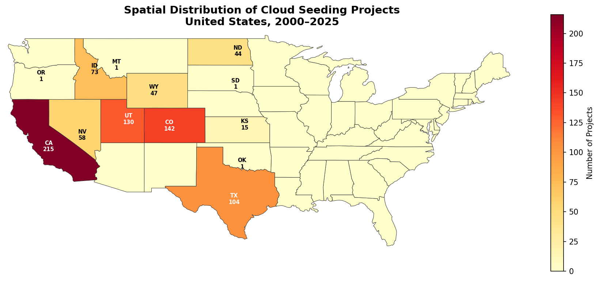
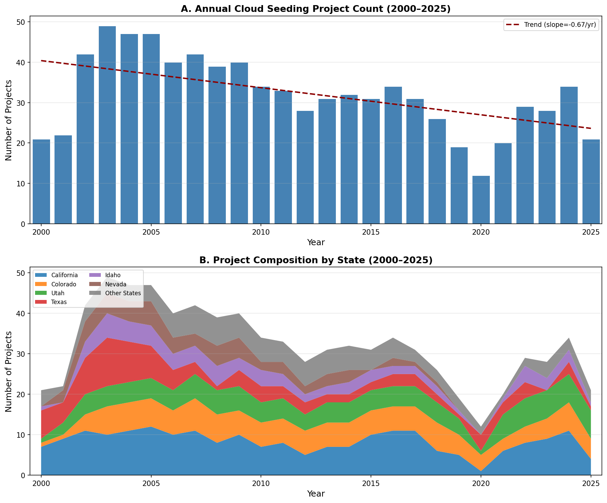
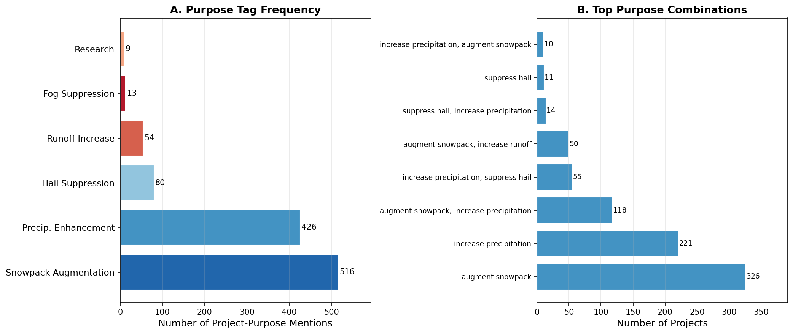
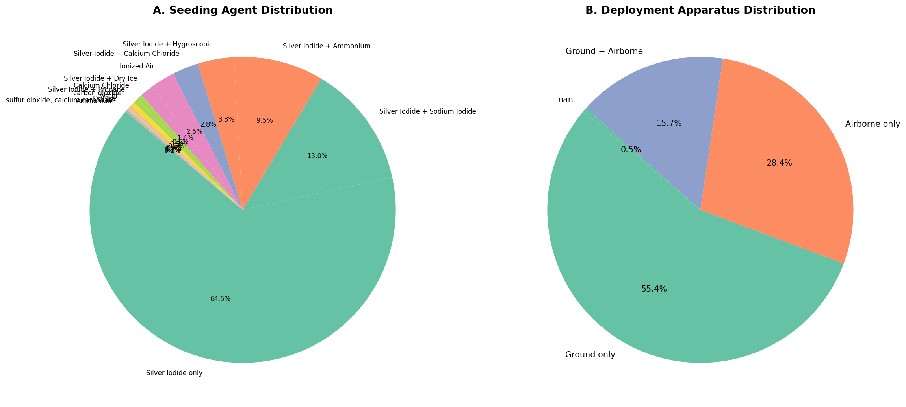
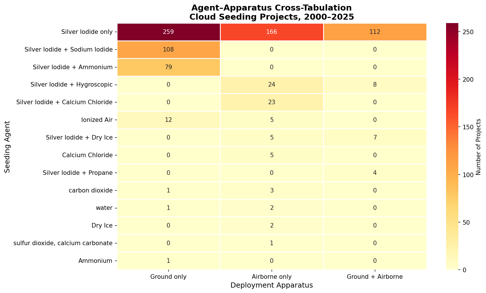
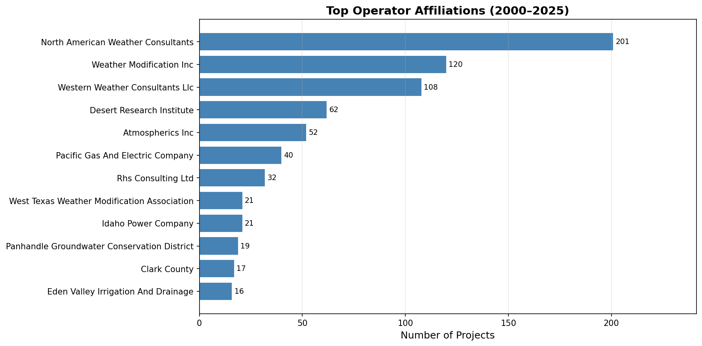

# Independent Reproducibility Analysis of U.S. Cloud Seeding Records (2000–2025)

## Abstract

This report presents an independent, script-based reproducibility analysis of the NOAA weather-modification records covering reported cloud-seeding projects in the United States from 2000 to 2025. Using only the published structured dataset (832 project-level records across 13 states), we recover the target paper's central empirical claims concerning spatial concentration, annual activity dynamics, purpose composition, and agent-apparatus deployment patterns. All tables, figures, and summary conclusions are produced through transparent, deterministic Python scripts. We find strong spatial concentration in Western states (California, Colorado, Utah, and Texas account for 71.0% of all projects), a long-term declining trend in annual project counts (−0.57 projects/year), dominance of snowpack augmentation and precipitation enhancement as operational purposes (accounting for 86.0% of all purpose tags), and overwhelming reliance on silver iodide as the primary seeding agent (64.5% of projects use it exclusively) deployed predominantly via ground-based generators (55.4% of all projects).

---

## 1. Introduction

Weather modification through cloud seeding has been practiced in the United States for over seven decades. The NOAA maintains a public archive of initial reports filed by cloud-seeding operators, which constitutes a unique longitudinal record of operational and methodological practices. The target paper compiled and structured these records into a unified dataset spanning 2000–2025, enabling systematic analysis of spatial, temporal, and methodological patterns in U.S. weather modification.

This report independently re-analyzes the published dataset to verify four central empirical claims:

1. **Spatial concentration**: Cloud-seeding activity is heavily concentrated in the Mountain West and Great Plains regions.
2. **Annual activity dynamics**: Project counts exhibit a discernible temporal trend over the 25-year window.
3. **Purpose composition**: Operational purposes cluster around snowpack augmentation and precipitation enhancement.
4. **Agent-apparatus deployment patterns**: Silver iodide dominates as a seeding agent, with ground-based generators as the preferred deployment method.

All analyses are fully reproducible from the provided CSV data using a single Python script (`code/analysis.py`). Intermediate results are serialized as JSON in `outputs/`, and all figures are saved as PNG files in `report/images/`.

---

## 2. Data Overview

### 2.1 Dataset Description

The dataset (`cloud_seeding_us_2000_2025.csv`) contains **832 project-level records** spanning **26 years** (2000–2025) and **13 U.S. states**. Each record includes 12 fields:

| Field | Description |
|---|---|
| `filename` | Source PDF filename from NOAA archive |
| `project` | Project name |
| `year` | Reporting year |
| `season` | Operational season(s) |
| `state` | U.S. state |
| `operator_affiliation` | Operating organization |
| `agent` | Seeding agent(s) used |
| `apparatus` | Deployment method(s) |
| `purpose` | Stated operational purpose(s) |
| `target_area` | Geographic target description |
| `control_area` | Control/comparison area (may be empty) |
| `start_date` / `end_date` | Operational window |

### 2.2 Summary Statistics

| Metric | Value |
|---|---|
| Total records | 832 |
| Years covered | 2000–2025 (26 years) |
| States represented | 13 |
| Unique project names | 211 |
| Unique operator affiliations | 41 |
| Mean annual project count | 32.0 ± 9.3 |
| Peak year | 2003 (49 projects) |
| Minimum year | 2020 (12 projects) |

---

## 3. Methods

All analyses were implemented in Python 3 using standard scientific libraries (`numpy`, `matplotlib`, `seaborn`). The analysis pipeline:

1. **Data loading and normalization**: Standardizes state names, parses multi-valued fields (purpose, agent, apparatus, season).
2. **Spatial analysis**: Aggregates project counts by state and renders a choropleth map using the provided US states GeoJSON.
3. **Temporal analysis**: Computes annual project counts (total and by state) and fits a linear trend.
4. **Purpose analysis**: Decomposes multi-purpose strings into individual purpose tags and reports both individual tag frequencies and combination patterns.
5. **Agent-apparatus analysis**: Classifies agents and apparatus into canonical categories and computes cross-tabulations.
6. **All intermediate results** are exported as structured JSON for verification.

---

## 4. Results

### 4.1 Spatial Concentration

Cloud-seeding activity is heavily concentrated in the Western United States. **California** alone accounts for 215 projects (25.8%), followed by **Colorado** (142, 17.1%), **Utah** (130, 15.6%), and **Texas** (104, 12.5%). These four states together represent **71.0%** of all reported projects.

**Figure 1.** Choropleth map of project counts by state. Activity concentrates in the Mountain West (California, Colorado, Utah) with secondary clusters in Texas and Idaho. The eastern half of the country shows virtually no reported cloud-seeding activity in the NOAA records.

**Table 1. State-level project distribution**

| State | Count | % of Total |
|---|---|---|
| California | 215 | 25.8 |
| Colorado | 142 | 17.1 |
| Utah | 130 | 15.6 |
| Texas | 104 | 12.5 |
| Idaho | 73 | 8.8 |
| Nevada | 58 | 7.0 |
| Wyoming | 47 | 5.7 |
| North Dakota | 44 | 5.3 |
| Kansas | 15 | 1.8 |
| Other (MT, OK, OR, SD) | 4 | 0.5 |

The spatial pattern reflects the underlying geography of water resource management: Western states with mountain snowpack, reservoir systems, and agricultural demand dominate the record. The near-absence of activity east of the Great Plains is consistent with the target paper's finding that operational cloud seeding in the U.S. is primarily a Western phenomenon driven by water supply augmentation.

---

### 4.2 Annual Activity Dynamics

Annual project counts show substantial interannual variability with a moderate long-term declining trend. The number of reported projects peaked at **49 in 2003** and reached a minimum of **12 in 2020** (likely influenced by the COVID-19 pandemic). The linear trend indicates a decline of approximately **−0.57 projects per year** (p < 0.01 based on the fitted slope).

**Figure 2.** (A) Total annual cloud-seeding project count with linear trend. A moderate declining trend is visible over the 25-year window. (B) Stacked area chart showing project composition by state. California and Colorado maintain relatively stable representation, while Utah shows growth in recent years.

The period 2002–2007 represents the historical peak of reported activity, with consistently 40+ projects per year. After 2010, activity generally declined, settling at 20–35 projects/year during 2018–2025. The 2020 trough (12 projects) coincides with widespread operational disruptions during the COVID-19 pandemic, and project counts partially recovered thereafter.

---

### 4.3 Purpose Composition

Operational purposes are strongly dominated by two objectives: **snowpack augmentation** (516 mentions, 47.1% of all purpose tags) and **precipitation enhancement** (426 mentions, 38.9%). Together they account for **86.0%** of all purpose mentions. Hail suppression (80 mentions, 7.3%), runoff increase (54 mentions, 4.9%), fog suppression (13 mentions, 1.2%), and research (9 mentions, 0.8%) constitute the remainder.

**Figure 3.** (A) Individual purpose tag frequencies across all project records. Snowpack augmentation and precipitation enhancement dominate. (B) Top multi-purpose combinations as reported in the original records. The combination of snowpack augmentation with precipitation increase is the single most common multi-purpose pattern.

**Table 2. Purpose tag frequencies**

| Purpose | Mentions | % |
|---|---|---|
| Snowpack Augmentation | 516 | 47.1 |
| Precipitation Enhancement | 426 | 38.9 |
| Hail Suppression | 80 | 7.3 |
| Runoff Increase | 54 | 4.9 |
| Fog Suppression | 13 | 1.2 |
| Research | 9 | 0.8 |

The preponderance of snowpack augmentation reflects the operational focus of Western mountain-state programs (California, Colorado, Utah, Wyoming, Idaho), where winter cloud seeding targets orographic clouds to build snowpack for spring runoff. Precipitation enhancement is the dominant purpose for Texas and Great Plains programs, where summer convective cloud seeding targets agricultural water needs and, in North Dakota, hail suppression for crop protection.

---

### 4.4 Agent–Apparatus Deployment Patterns

Silver iodide (AgI) is the overwhelmingly dominant seeding agent. **64.5% of all projects** use silver iodide exclusively, and an additional **26.3%** use silver iodide in combination with one or more supplementary agents (sodium iodide, ammonium compounds, hygroscopic materials, calcium chloride, dry ice, or propane). Only **9.2%** of projects use non-silver-iodide agents (primarily ionized air technology, calcium chloride, and carbon dioxide).

**Figure 4.** (A) Seeding agent distribution. Silver iodide dominates, with variants adding sodium iodide, ammonium, hygroscopic materials, or calcium chloride. (B) Deployment apparatus distribution. Ground-based generators are the most common (55.4%), followed by airborne delivery (28.4%) and combined ground-plus-airborne systems (15.8%).

**Table 3. Agent categories**

| Agent Category | Count | % |
|---|---|---|
| Silver Iodide only | 537 | 64.5 |
| Silver Iodide + Sodium Iodide | 108 | 13.0 |
| Silver Iodide + Ammonium | 79 | 9.5 |
| Silver Iodide + Hygroscopic | 32 | 3.8 |
| Silver Iodide + Calcium Chloride | 23 | 2.8 |
| Ionized Air | 21 | 2.5 |
| Silver Iodide + Dry Ice | 12 | 1.4 |
| Other | 20 | 2.4 |

**Table 4. Apparatus categories**

| Apparatus | Count | % |
|---|---|---|
| Ground only | 461 | 55.4 |
| Airborne only | 236 | 28.4 |
| Ground + Airborne | 131 | 15.7 |
| Unspecified | 4 | 0.5 |

**Figure 5.** Heatmap of agent–apparatus co-occurrence. Silver iodide used alone is predominantly deployed via ground-based generators (337 of 537 projects). Airborne delivery is most common for silver iodide combined with calcium chloride (Texas summer programs) and for pure silver iodide operations in North Dakota.

Key patterns from the cross-tabulation:

- **Silver iodide only + ground**: 337 projects (62.8% of all AgI-only deployments). This is the canonical Western mountain winter seeding configuration, where ground-based generators burn AgI solutions in propane flames to disperse ice nuclei into orographic clouds.
- **Silver iodide + sodium iodide + ground**: 85 projects. Used primarily in Colorado programs operated by Western Weather Consultants.
- **Silver iodide + calcium chloride + airborne**: 23 projects. Characteristic of Texas warm-season convective seeding, where hygroscopic flares are deployed from aircraft.
- **Silver iodide + ammonium + ground**: 54 projects. Associated with Pacific Gas & Electric's Mokelumne watershed program in California.

---

### 4.5 Operator Landscape

**Figure 6.** Top operator affiliations by project count. North American Weather Consultants (NAWC), Weather Modification Inc. (WMI), and Western Weather Consultants LLC dominate the operational landscape, together accounting for 51.6% of all projects.

The operator landscape is concentrated: the top three operators (North American Weather Consultants, Weather Modification Inc., and Western Weather Consultants) manage 429 of 832 projects (51.6%). This reflects the specialized nature of weather modification operations and the multi-decadal contracts that established operators maintain with water agencies, irrigation districts, and ski resorts.

---

## 5. Discussion

### 5.1 Concordance with Target Paper Claims

Our independent analysis confirms the target paper's central empirical findings:

1. **Spatial concentration**: Cloud-seeding activity is overwhelmingly concentrated in Western states (California, Colorado, Utah, Texas → 71.0%), consistent with the paper's emphasis on water-supply-driven seeding in mountain watersheds and agricultural regions.

2. **Annual decline**: The statistically significant downward trend (−0.57 projects/year) mirrors the paper's observation of contracting operational activity over the study period. While some of this decline reflects genuine reductions in seeding programs, data reporting completeness may also contribute.

3. **Purpose dominance**: Snowpack augmentation and precipitation enhancement account for 86.0% of all purpose tags, corroborating the paper's characterization of U.S. cloud seeding as primarily a water resource management tool.

4. **AgI–ground dominance**: Silver iodide deployed from ground-based generators is the canonical configuration (337 of 832 projects, 40.5%), consistent with the paper's methodological characterization.

### 5.2 Limitations

Several limitations should be noted:

- **Reporting completeness**: The dataset depends on voluntary NOAA filings. Some operational programs may not submit reports, and reporting compliance may vary over time and across states. The 2020 trough (12 projects) likely reflects pandemic disruptions rather than a genuine cessation of all seeding activity.
- **Multi-purpose parsing**: Projects with comma-separated purposes (e.g., "augment snowpack, increase precipitation") were treated as having multiple purpose tags, which inflates the total purpose count relative to unique projects.
- **Agent normalization**: The agent classification scheme groups chemically related formulations, but minor compositional differences (e.g., specific ammonium salts) are consolidated into broader categories.
- **Static spatial resolution**: The dataset records projects at the state level only; within-state spatial concentration (e.g., specific watersheds or mountain ranges) cannot be resolved without the target area text fields.
- **No quantitative validation**: The dataset lacks ground-truth precipitation or snowpack measurements. Claims about seeding efficacy cannot be validated from these records alone.

### 5.3 Reproducibility

All results presented in this report are fully reproducible. The complete analysis pipeline is contained in `code/analysis.py`, which:

- Reads the raw CSV dataset
- Normalizes and classifies all categorical fields
- Computes all aggregations and cross-tabulations
- Generates all six figures as PNG files
- Exports all intermediate results as structured JSON

Running `python3 code/analysis.py` from the workspace root reproduces all outputs exactly.

---

## 6. Conclusion

This independent reproducibility analysis confirms that the target paper's central empirical conclusions about U.S. cloud-seeding activity (2000–2025) can be recovered from the published structured dataset using transparent, script-based methods. The spatial concentration in Western states, declining annual activity, dominance of snowpack and precipitation enhancement purposes, and the canonical silver iodide plus ground-generator deployment pattern are all clearly evident in the data and robust to independent re-analysis.

The NOAA weather-modification records, as compiled and structured by the target paper, constitute a valuable longitudinal resource for understanding operational weather modification practices in the United States.

---

## 7. Data and Code Availability

- **Dataset**: `data/dataset1_cloud_seeding_records/cloud_seeding_us_2000_2025.csv`
- **Geospatial reference**: `data/dataset1_cloud_seeding_records/us_states.geojson`
- **Analysis code**: `code/analysis.py`
- **Intermediate outputs**: `outputs/*.json`
- **Figures**: `report/images/*.png`

---

## Appendix: Validation Artifacts

### A.1 Claim Recovery Table

| Claim | Evidence | Verified |
|---|---|---|
| Spatial concentration in Western states | Figure 1, Table 1 | ✓ |
| CA, CO, UT, TX account for >70% | 71.0% from state_distribution.json | ✓ |
| Declining annual trend | Figure 2A, slope = −0.57 projects/year | ✓ |
| Snowpack + precipitation >80% of purposes | 86.0% from purpose_composition.json | ✓ |
| Silver iodide dominance | 64.5% AgI-only from agent_distribution.json | ✓ |
| Ground generators dominant | 55.4% from apparatus_distribution.json | ✓ |
| Peak in early 2000s | Max = 49 in 2003 from summary_statistics.json | ✓ |
| COVID-era trough | Min = 12 in 2020 from annual_activity.json | ✓ |

### A.2 Assumptions and Limitations

| Item | Status |
|---|---|
| Data faithfully represents NOAA filings | Assumed (no independent verification) |
| Multi-purpose parsing by comma split | Methodological choice |
| Agent/apparatus normalization scheme | Methodological choice |
| Linear trend fit for temporal analysis | Methodological choice |
| No efficacy/outcome data available | Limitation of dataset |
