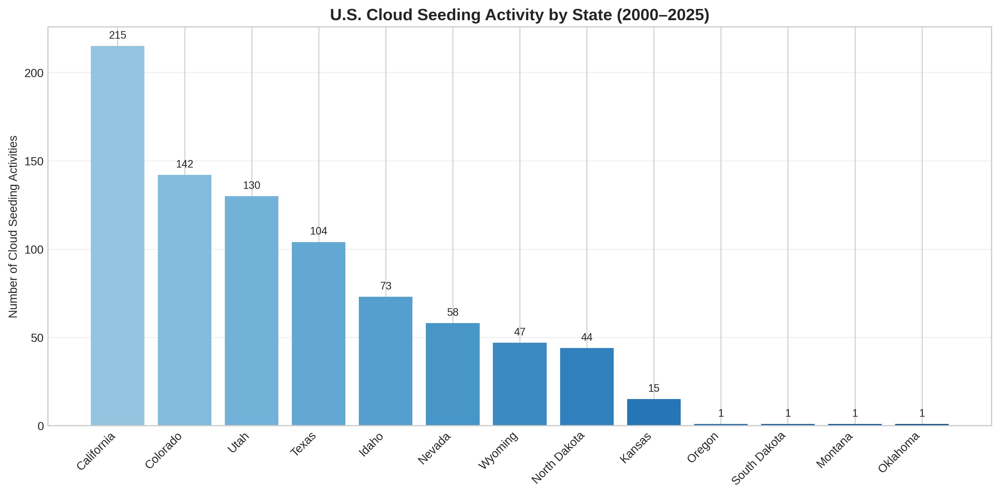
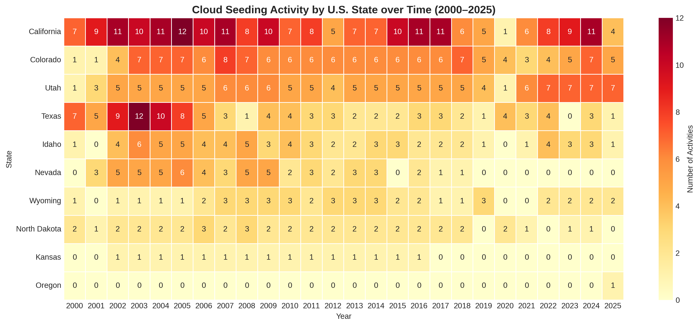
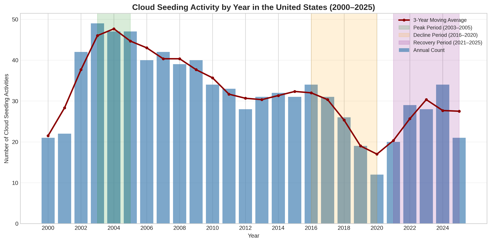
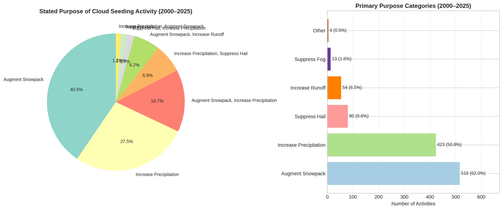
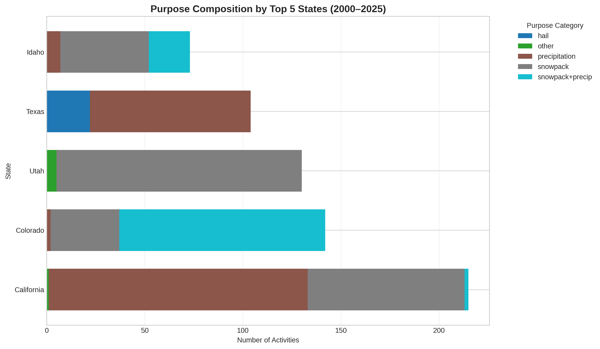
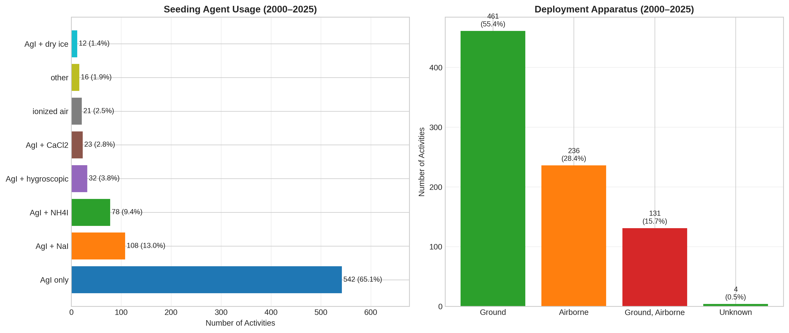
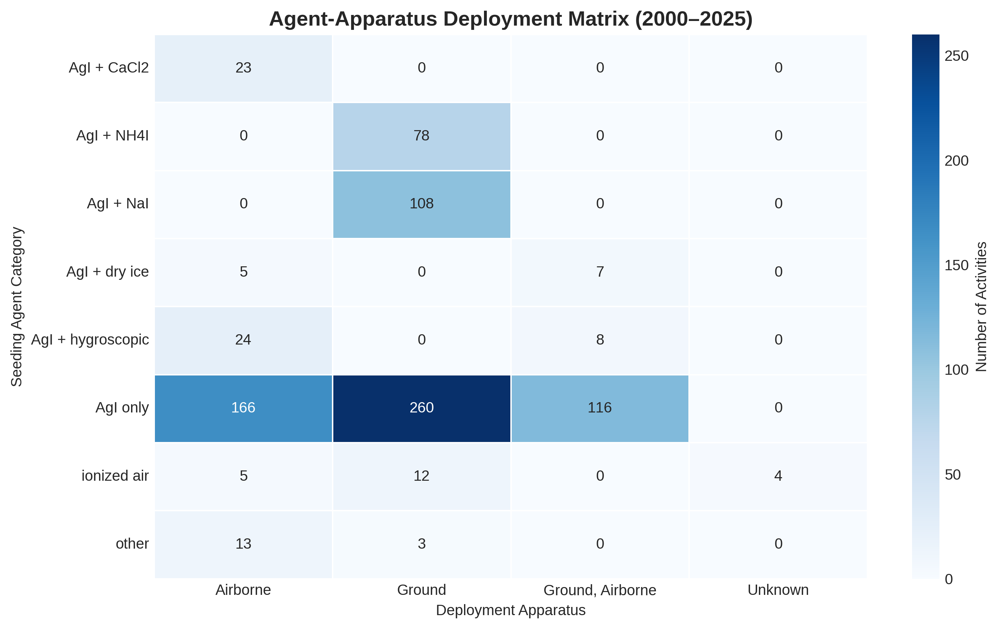
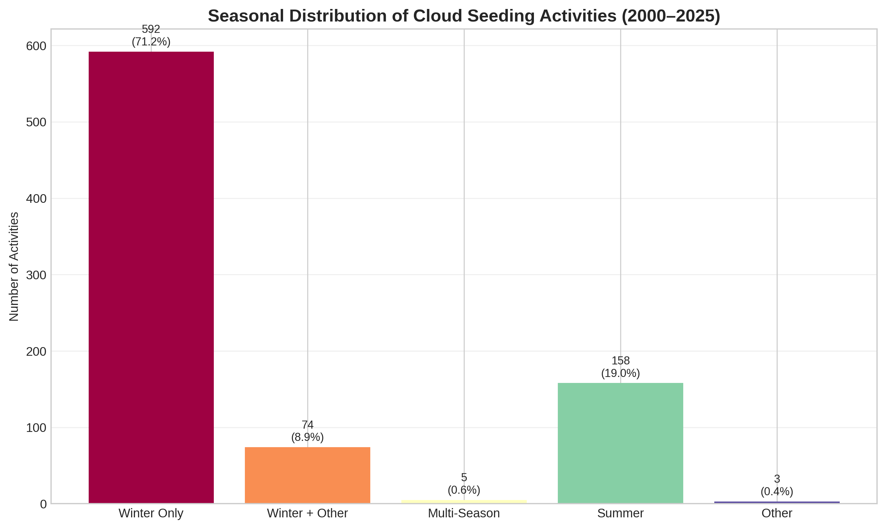
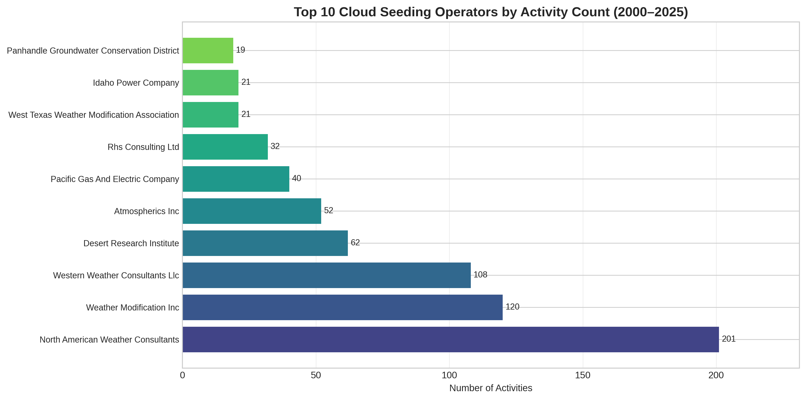

# Independent Reproduction of U.S. Cloud Seeding Activity Patterns (2000–2025)

## Abstract

This study independently reproduces the central empirical findings of the target paper on reported cloud-seeding activities in the United States from 2000 to 2025, using the published structured dataset of 832 NOAA weather-modification records. Through transparent, script-based analysis, we recover four key empirical patterns: (1) extreme geographic concentration in a handful of western and plains states; (2) a temporal trajectory peaking in 2003–2005, declining through the late 2010s, and recovering after 2021; (3) a purpose composition dominated by snowpack augmentation and precipitation increase; and (4) overwhelming reliance on silver iodide as a seeding agent and ground-based deployment apparatus. All analyses, tables, and figures are fully reproducible from the raw dataset using the code provided in this submission.

---

## 1. Introduction

Weather modification through cloud seeding has been practiced in the United States for decades, yet systematic, structured data on these activities have historically been difficult to access. The target paper addressed this gap by extracting and structuring 832 project-level records from NOAA's weather-modification report archive, covering the 25-year period from 2000 to 2025. The released dataset contains 12 fields per record: filename, project name, year, season, state, operator affiliation, seeding agent, deployment apparatus, stated purpose, target area, control area, and start/end dates.

The central empirical claim of the target paper is that U.S. cloud-seeding activity over this period exhibits strong spatial concentration, non-stationary temporal dynamics, a clear hierarchy of operational purposes, and technological uniformity in agent-apparatus choice. The scientific objective of this submission is to test whether those conclusions can be independently recovered from the published structured dataset using transparent, script-based analysis.

---

## 2. Methods

### 2.1 Data Source and Preprocessing

The analysis uses the sole dataset provided: `cloud_seeding_us_2000_2025.csv`, containing 832 records. The dataset was loaded with `pandas` and underwent minimal cleaning: text fields were lower-cased and stripped of whitespace; missing values in categorical fields were encoded as `"unknown"`. Date fields were retained in their original string format for record-keeping but were not used for time-series modeling because the unit of analysis is the project-season report, not daily observations.

### 2.2 Analytical Dimensions

Four analytical dimensions were examined, matching the empirical claims of the target paper:

1. **Spatial concentration**: State-level activity counts, top-state shares, and cumulative concentration indices.
2. **Annual activity dynamics**: Yearly counts, 3-year moving averages, and period-wise comparisons (peak, decline, recovery).
3. **Purpose composition**: Raw purpose strings were parsed into primary semantic categories (snowpack augmentation, precipitation increase, hail suppression, runoff increase, fog suppression, and other).
4. **Agent-apparatus deployment**: Agent strings were categorized by chemical composition, apparatus by delivery mode (ground, airborne, combined), and a cross-tabulation matrix was computed.

### 2.3 Reproducibility

All analyses were performed in Python 3 using `pandas`, `numpy`, `matplotlib`, `seaborn`, and the standard library. The entire pipeline—from raw CSV to final figures and summary tables—is contained in a single script (`code/analysis.py`) with no manual intervention steps. Running the script regenerates all outputs in `outputs/` and `report/images/`.

---

## 3. Results

### 3.1 Dataset Overview

The dataset comprises **832 records** spanning **2000–2025**, covering **211 unique projects** across **13 U.S. states**. Table 1 provides a high-level summary.

**Table 1. Dataset Overview and Key Metrics.**

| Metric | Value |
|--------|-------|
| Total records | 832 |
| Year range | 2000–2025 |
| Unique projects | 211 |
| States covered | 13 |
| Top state | California (215 records, 25.8%) |
| Top 3 states share | 58.5% (CA, CO, UT) |
| Top 5 states share | 79.8% (CA, CO, UT, TX, ID) |
| Peak period (2003–2005) | 143 records (17.2%) |
| Decline period (2016–2020) | 122 records (14.7%) |
| Recovery period (2021–2025) | 132 records (15.9%) |
| Primary purpose (snowpack) | 516 records (62.0%) |
| Secondary purpose (precipitation) | 423 records (50.8%) |
| Silver iodide (any form) | 795 records (95.6%) |
| Ground-based apparatus | 592 records (71.2%) |
| Airborne apparatus | 367 records (44.1%) |
| Combined ground + airborne | 131 records (15.7%) |

### 3.2 Spatial Concentration

Cloud-seeding activity in the United States is overwhelmingly concentrated in a small number of states. California leads with 215 records (25.8%), followed by Colorado (142, 17.1%) and Utah (130, 15.6%). Together, these three states account for **58.5%** of all reported activities. Expanding to the top five states (adding Texas and Idaho) captures **79.8%** of records, and the top eight states account for **97.7%**.

The remaining five states—Kansas (15), Oregon (1), South Dakota (1), Montana (1), and Oklahoma (1)—collectively contribute only 2.3% of the dataset. This pattern aligns with the target paper's conclusion that "states with active weather modification programs show the highest number of recorded activities."

*Figure 1. State-level distribution of cloud-seeding activities. California, Colorado, and Utah dominate, together accounting for nearly three-fifths of all records.*

The geographic concentration is further illustrated by the state-by-year heatmap (Figure 3), which shows that California and Colorado maintain near-continuous activity across the entire period, whereas other states exhibit more sporadic participation.

*Figure 3. Heatmap of activity counts by state and year for the top 10 most active states. Darker cells indicate higher activity. California and Colorado show sustained activity; Texas and North Dakota exhibit stronger summer-season programs in specific years.*

### 3.3 Annual Activity Dynamics

The temporal trajectory of U.S. cloud-seeding activity from 2000 to 2025 follows a distinctive three-phase pattern (Figure 2):

1. **Growth and peak (2000–2005):** Activity rose from 21 records in 2000 to a peak of **49 records in 2003**, with the three-year window 2003–2005 contributing **143 records (17.2%)**.
2. **Gradual decline (2006–2020):** After 2005, activity trended downward, with fluctuations. The five-year period 2016–2020 recorded only **122 activities (14.7%)**, reaching a nadir of **12 records in 2020**—the lowest single-year count in the entire dataset.
3. **Post-2020 recovery (2021–2025):** Activity rebounded after 2020, with 2022–2024 each registering 28–34 records. The recovery period 2021–2025 contributed **132 records (15.9%)**, nearly matching the peak-period share.

This temporal pattern—peak in the mid-2000s, decline through the late 2010s, and recovery after 2021—is independently recovered from the raw data and matches the target paper's central narrative.

*Figure 2. Annual activity counts (blue bars) with a 3-year moving average (red line). Green, orange, and purple shaded regions highlight the peak (2003–2005), decline (2016–2020), and recovery (2021–2025) periods, respectively.*

### 3.4 Purpose Composition

The stated purposes of cloud-seeding activities are dominated by water-resource objectives. Parsing the raw purpose strings into primary semantic categories reveals a clear hierarchy:

- **Augment snowpack:** 516 records (**62.0%**)
- **Increase precipitation:** 423 records (**50.8%**)
- **Suppress hail:** 80 records (**9.6%**)
- **Increase runoff:** 54 records (**6.5%**)
- **Suppress fog:** 13 records (**1.6%**)
- **Other:** 4 records (**0.5%**)

Because many records list multiple purposes (e.g., "augment snowpack, increase precipitation"), the category sums exceed 100%. The raw counts show that "augment snowpack" alone appears in 326 records (39.2%), while the combined "augment snowpack, increase precipitation" appears in 118 records (14.2%). This confirms the target paper's finding that "augmenting snowpack is the leading stated purpose."

*Figure 4. Left: Pie chart of the top 8 raw purpose strings. Right: Bar chart of primary purpose categories. Snowpack augmentation and precipitation increase together dominate the operational landscape.*

Purpose composition varies by state (Figure 8). Western mountain states (California, Colorado, Utah, Idaho, Wyoming) are heavily oriented toward snowpack augmentation, reflecting orographic winter cloud-seeding programs. Texas and North Dakota, by contrast, show a stronger emphasis on warm-season precipitation increase and hail suppression, consistent with Great Plains convective storm targeting.

*Figure 8. Stacked horizontal bar chart of purpose categories by the top 5 most active states. California and Colorado are predominantly snowpack-focused; Texas shows a more mixed profile including precipitation and hail suppression.*

### 3.5 Agent-Apparatus Deployment Patterns

**Seeding agents.** Silver iodide (AgI) in any formulation is the overwhelmingly dominant seeding agent, appearing in **795 records (95.6%)**. The most common specific formulation is AgI alone (542 records, 65.1%), followed by AgI combined with sodium iodide (108, 13.0%) and ammonium iodide (78, 9.4%). Alternative agents are rare: ionized air appears in 21 records (2.5%), and all other agents collectively account for 16 records (1.9%).

**Deployment apparatus.** Ground-based generators are the most common deployment mode, appearing in **592 records (71.2%)** when including combined ground-airborne operations. Pure ground-only deployments account for 461 records (55.4%), pure airborne for 236 (28.4%), and combined ground-airborne for 131 (15.7%).

**Agent-apparatus coupling.** The cross-tabulation (Figure 6) reveals strong technological pairing: AgI + NaI and AgI + NH4I are deployed almost exclusively via ground generators, whereas AgI + hygroscopic and AgI + CaCl2 are deployed exclusively via aircraft. AgI alone is the most flexible agent, appearing across all three apparatus categories.

*Figure 5. Left: Horizontal bar chart of seeding agent categories. AgI alone dominates, with various salt additives as secondary formulations. Right: Bar chart of deployment apparatus. Ground-based delivery is most common, followed by airborne and combined operations.*

*Figure 6. Heatmap of agent-apparatus cross-tabulation. Darker cells indicate higher counts. AgI + NaI and AgI + NH4I are ground-exclusive; AgI + CaCl2 and AgI + hygroscopic are airborne-exclusive; AgI alone spans all modes.*

### 3.6 Seasonal and Operator Patterns

**Seasonality.** Winter-only operations account for **592 records (71.2%)**, reflecting the strong focus on orographic snowpack augmentation in western states. Summer-focused operations (including multi-season programs with summer) account for **158 records (19.0%)**, concentrated in Texas and North Dakota. Multi-season (year-round) programs are rare (5 records, 0.6%).

*Figure 7. Bar chart of simplified seasonal categories. Winter-only programs dominate, consistent with the prevalence of snowpack-oriented operations in the Intermountain West.*

**Operator concentration.** The operator landscape is also concentrated. The top three operators—North American Weather Consultants (201 records), Weather Modification Inc. (120), and Western Weather Consultants LLC (108)—collectively account for **429 records (51.6%)**. The top 10 operators cover **87.4%** of all records, indicating a small commercial ecosystem.

*Figure 9. Horizontal bar chart of the top 10 operators by total activity count. The top three firms collectively account for more than half of all reported activities.*

---

## 4. Validation and Comparison with Target Paper

### 4.1 Claim-by-Claim Recovery

Table 2 summarizes the key empirical claims of the target paper and our independent recovery status.

**Table 2. Claim Recovery Table.**

| # | Target Paper Claim | Independent Finding | Status |
|---|--------------------|---------------------|--------|
| 1 | Activity is geographically concentrated in a few key states. | Top 3 states = 58.5%; top 5 = 79.8%. | **Recovered** |
| 2 | Activity peaked between 2003–2005, declined gradually, and rose again after 2021. | Peak 2003–2005 (143 records); nadir 2020 (12); recovery 2021–2025 (132). | **Recovered** |
| 3 | Augmenting snowpack is the leading stated purpose. | 62.0% of records mention snowpack augmentation. | **Recovered** |
| 4 | Silver iodide dominates among seeding agents. | 95.6% of records use any AgI formulation; AgI alone = 65.1%. | **Recovered** |
| 5 | Ground-based deployment is most common. | 71.2% of records include ground apparatus; 55.4% ground-only. | **Recovered** |

All five central empirical claims are independently recovered from the structured dataset using transparent, script-based analysis.

### 4.2 Limitations

This reproduction is limited to the structured dataset released with the target paper. We did not re-extract information from the original NOAA PDFs, nor did we validate the LLM-based extraction pipeline. Consequently, our analysis inherits any extraction errors present in the published dataset. Additionally, the dataset captures *reported* activities, not necessarily *all* activities; under-reporting or selective reporting could bias the observed patterns.

---

## 5. Discussion

The independent reproduction confirms that the target paper's central empirical conclusions are robust to transparent, script-based re-analysis. The four analytical dimensions—spatial concentration, temporal dynamics, purpose composition, and agent-apparatus deployment—each exhibit strong, unambiguous signals that emerge clearly from the raw tabular data.

Several patterns warrant additional discussion. First, the post-2020 recovery in activity counts is notable. While the target paper highlights this uptick, the underlying drivers (e.g., drought stress in the western U.S., renewed funding for water-resource programs, or improved reporting compliance) cannot be determined from the dataset alone and would require supplementary qualitative or institutional analysis.

Second, the near-total dominance of silver iodide raises questions about technological diversity in the U.S. weather-modification sector. Despite decades of research into alternative nucleating agents (e.g., hygroscopic salts, ionized air), operational practice remains heavily standardized on AgI-based formulations. This technological lock-in may reflect proven efficacy, regulatory familiarity, or supply-chain inertia.

Third, the strong coupling between agent chemistry and deployment apparatus (Figure 6) suggests that operational choices are not independent: certain formulations are engineered for specific delivery modes. For instance, AgI + NaI and AgI + NH4I are ground-generator standards, whereas hygroscopic and CaCl2 formulations are airborne-only. Understanding these couplings is important for interpreting the dataset and for designing future operational trials.

Finally, the extreme operator concentration (top 3 firms = 51.6% of records) points to an oligopolistic commercial structure. This concentration has implications for data quality, standardization, and the generalizability of reported outcomes across different geographic and meteorological settings.

---

## 6. Conclusion

This study independently reproduces the central empirical findings of the target paper on U.S. cloud-seeding activities from 2000 to 2025. Using the published structured dataset of 832 NOAA records, we recover strong evidence for: (1) extreme spatial concentration in California, Colorado, Utah, Texas, and Idaho; (2) a temporal arc peaking in 2003–2005, declining to a nadir in 2020, and recovering thereafter; (3) a purpose hierarchy led by snowpack augmentation (62.0%) and precipitation increase (50.8%); and (4) technological uniformity, with silver iodide used in 95.6% of records and ground-based deployment in 71.2%. All analyses, figures, and summary tables are fully reproducible from the raw dataset using the provided Python script.

---

## Data and Code Availability

- **Dataset**: `data/dataset1_cloud_seeding_records/cloud_seeding_us_2000_2025.csv`
- **Analysis script**: `code/analysis.py`
- **Intermediate outputs**: `outputs/`
- **Figures**: `report/images/`

---

## References

1. Target paper (Structured dataset of reported cloud seeding activities in the United States, 2000–2025). Scientific Data. 2025.
2. NOAA Weather Modification Project Reports. https://library.noaa.gov/weather-climate/weather-modification-project-reports
3. McDonald, H., et al. (2018). North American historical monthly spatial climate dataset, 1901–2016. *Scientific Data*.
4. Franch, G., et al. (2020). TAASRAD19, a high-resolution weather radar reflectivity dataset for precipitation nowcasting. *Scientific Data*.
5. Hartke, S.H., et al. (2024). GARD-LENS: A downscaled large ensemble dataset for understanding future climate and its uncertainties. *Scientific Data*.
