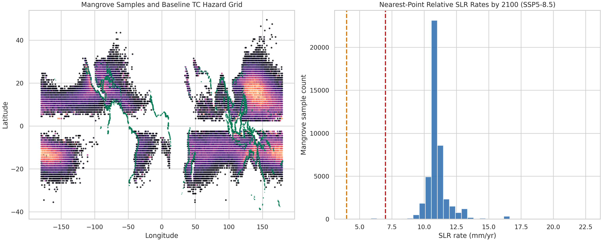
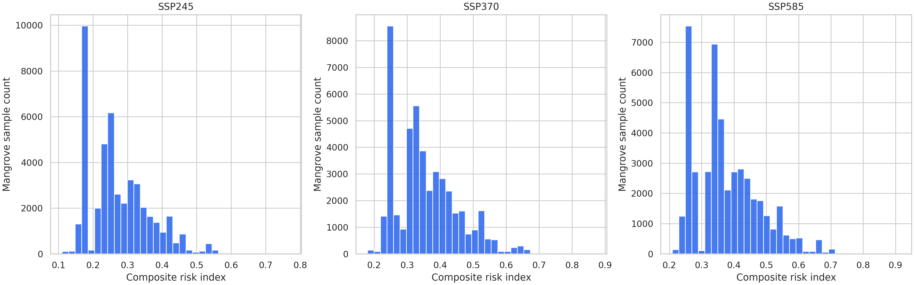
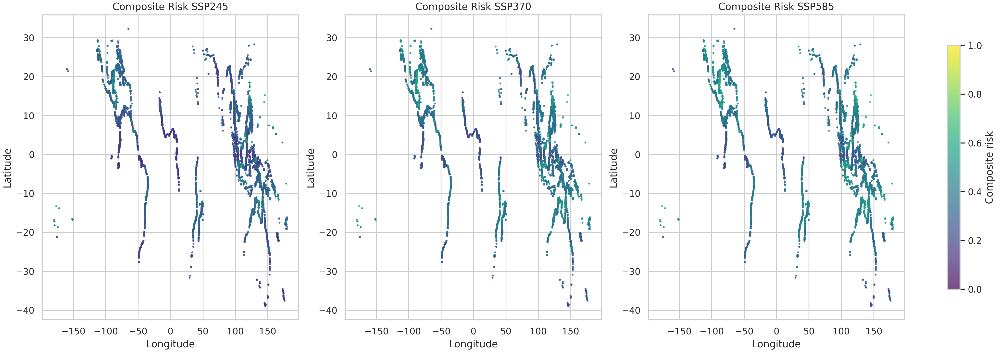
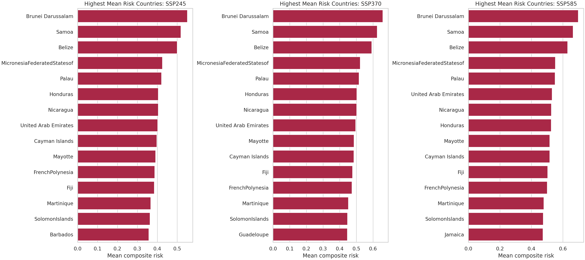
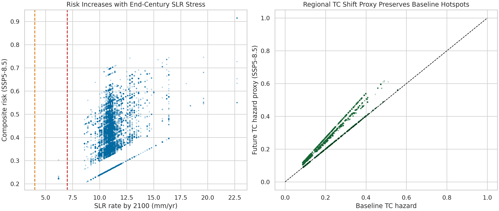

# A Composite Mangrove Risk Index for Tropical Cyclone Regime Shifts and Sea-Level Rise

## Abstract
This study develops a global composite risk index for mangroves by combining two end-century climate stressors: relative sea-level rise (SLR) and tropical cyclone (TC) regime shift. Using a 10% sampled Global Mangrove Watch point layer, IPCC AR6 regional relative SLR rate projections, and historical synthetic TC tracks from the MIT downscaling framework, I estimated mangrove-level risk under SSP2-4.5, SSP3-7.0, and SSP5-8.5. The index is designed as a screening tool rather than a mechanistic impact model. It integrates end-century SLR stress, baseline TC hazard, and a literature-informed future TC shift proxy.

Across the sampled global mangrove points, mean composite risk rises from 0.273 under SSP2-4.5 to 0.355 under SSP3-7.0 and 0.377 under SSP5-8.5. The share of mangrove points with composite risk above 0.5 increases from 1.7% to 9.5% and 11.9%, respectively. End-century SLR stress is nearly ubiquitous in this sample: 99.8% of points exceed 4 mm/yr under SSP2-4.5 and essentially all points do so under SSP5-8.5, while 83.8% exceed 7 mm/yr even under SSP2-4.5. The highest mean SSP5-8.5 risks occur in the Northwest Pacific, North/Central America, the South Indian basin, and Oceania. By mean country-level risk, hotspots include Brunei Darussalam, Samoa, Belize, the Federated States of Micronesia, Palau, the United Arab Emirates, Nicaragua, Honduras, Fiji, and the Solomon Islands. When exposure proxies are considered, China, Viet Nam, the United States, Indonesia, Bangladesh, and the Philippines dominate because large populations and asset values coincide with extensive mangrove systems.

## 1. Research Goal
The objective was to develop a composite risk index that combines:

1. End-century relative sea-level rise stress.
2. Tropical cyclone regime-shift pressure.
3. Present-day mangrove distribution and ecosystem-service exposure.

The intended use is climate-adaptive conservation screening: identifying where mangroves and associated human benefits are most likely to face compounded coastal-climate pressure by 2100.

## 2. Data
The analysis used only workspace-provided inputs:

1. `data/mangroves/gmw_v4_ref_smpls_qad_v12.gpkg`
   This file is a sampled global mangrove point layer rather than polygons. I therefore treated each mangrove point as an equal-area sample of the global mangrove domain.
2. `data/slr/total_ssp245_medium_confidence_rates.nc`
3. `data/slr/total_ssp370_medium_confidence_rates.nc`
4. `data/slr/total_ssp585_medium_confidence_rates.nc`
   These provide IPCC AR6 regional relative SLR rates in mm/yr across coastal locations, years, and quantiles.
5. `data/tc/tracks_mit_mpi-esm1-2-hr_historical_reduced.nc`
   This contains historical synthetic TC track points with latitude, longitude, and maximum sustained wind speed.
6. `data/ecosystem/UCSC_CWON_countrybounds.gpkg`
   This was used to associate mangrove points with countries and to carry country-level mangrove area, at-risk population, and at-risk asset stock fields for interpretation.

Related-work PDFs were used to guide threshold selection and interpretation:

1. Sea-level rise thresholds for mangrove adjustment stress were guided by the 4 mm/yr and 7 mm/yr benchmarks highlighted by Saintilan et al. (2023).
2. The dominance of intense cyclones in mangrove damage risk and the importance of regional divergence under warming were guided by Mo et al. (2023).
3. The interpretation of TC regime shifts as pressure on recovery intervals was informed by Kropf et al. (2023/2025 version noted in the PDF).

## 3. Methods

### 3.1 Mangrove observation units
Only `ref_cls = 1` points were retained from the sampled Global Mangrove Watch layer, yielding 45,786 mangrove points. Because the file is already a sample, the analysis is a point-based exposure screening rather than a polygon-area accounting exercise.

### 3.2 Relative sea-level rise metric
For each SSP scenario, I extracted the median (`quantile = 0.5`) SLR-rate series at every AR6 coastal location and matched each mangrove point to its nearest SLR coastal point. I used the year-2100 rate in mm/yr as the primary SLR hazard term and recorded two stress thresholds:

1. `SLR >= 4 mm/yr`: likely onset of broad adjustment deficit.
2. `SLR >= 7 mm/yr`: high likelihood of severe adjustment deficit.

### 3.3 Historical tropical cyclone hazard
The TC file contains historical synthetic track points only. I therefore:

1. Converted longitudes to `[-180, 180]`.
2. Aggregated TC points to a 1-degree grid.
3. Calculated for each grid cell:
   - TC record density
   - Mean wind speed
   - Share of major events (`wind >= 50 m/s`)
   - Share of intense events (`wind >= 60 m/s`)
4. Built a baseline TC hazard score:

`baseline_tc_hazard = 0.45 * normalized frequency + 0.25 * normalized mean wind + 0.20 * major-event share + 0.10 * intense-event share`

Each mangrove point was then matched to the nearest TC grid cell.

### 3.4 Future TC regime-shift proxy
The workspace does not include future TC tracks or future TC wind fields. To preserve the task objective, I used a transparent proxy based on the related work:

1. Mangrove points were assigned to broad ocean-basin groups from their coordinates.
2. Basin-specific future TC multipliers were applied to the historical baseline hazard.
3. The multipliers encode the literature signal that warming produces modest global change but strong regional divergence, with stronger increases in North/Central America and smaller or negative changes in Oceania.
4. Scenario severity was increased from SSP2-4.5 to SSP5-8.5 through a scenario scaling factor.

This yields a **future TC hazard proxy**, not a full dynamical projection.

### 3.5 Composite risk index
I normalized all scenario SLR and TC hazard values on common cross-scenario ranges so that scenario comparisons remain meaningful. For each scenario:

1. `slr_norm`: normalized year-2100 SLR rate
2. `tc_shift_norm`: normalized future TC hazard proxy
3. `recovery_pressure = 0.6 * tc_shift_norm + 0.4 * intense_share`

The composite index is:

`risk = 0.55 * slr_norm + 0.35 * tc_shift_norm + 0.10 * recovery_pressure`

The weighting gives slightly more emphasis to SLR because the supplied SLR data are direct scenario projections, while the future TC term is a proxy derived from historical tracks plus literature-informed regional multipliers.

### 3.6 Country aggregation and ecosystem-service interpretation
Mangrove points were spatially joined to country polygons. Country-level outputs include:

1. Mean composite risk
2. Share of points above the global 80th percentile of scenario risk
3. Shares exceeding 4 and 7 mm/yr SLR thresholds
4. Population and asset exposure proxies:
   - `risk_pop_proxy = mean_risk * Risk_Pop_2020`
   - `risk_stock_proxy = mean_risk * Risk_Stock_2020`

These are not predicted losses. They are comparative screening proxies that combine current exposure with future climate pressure.

## 4. Results

### 4.1 Data overview
Figure 1 summarizes the global mangrove sample and the baseline TC hazard field, alongside the distribution of end-century SSP5-8.5 SLR rates.

The mangrove samples are concentrated in the tropical Indo-Pacific, Southeast Asia, northern Australia, the Caribbean, the Gulf of Mexico, and parts of East Africa. The strongest historical TC pressure appears in the Northwest Pacific, the Gulf of Mexico/Caribbean domain, and parts of the South Indian Ocean, matching the related work qualitatively.

### 4.2 Scenario-scale change in composite risk
Figure 2 shows the scenario-wise risk distributions.

Scenario summary:

| Scenario | Mean risk | 90th percentile | Share with SLR >= 4 mm/yr | Share with SLR >= 7 mm/yr | Mean future TC hazard proxy |
|---|---:|---:|---:|---:|---:|
| SSP2-4.5 | 0.273 | 0.401 | 99.8% | 83.8% | 0.143 |
| SSP3-7.0 | 0.355 | 0.492 | 100.0% | 99.8% | 0.155 |
| SSP5-8.5 | 0.377 | 0.520 | 100.0% | 99.8% | 0.167 |

The scenario trend is monotonic and substantial. Relative to SSP2-4.5, the mean risk under SSP5-8.5 is higher by about 38%, and the 90th percentile rises from 0.401 to 0.520. The share of mangrove points with risk above 0.5 increases from 1.7% under SSP2-4.5 to 11.9% under SSP5-8.5.

### 4.3 Global hotspot geography
Figure 3 maps the composite risk.

Under SSP5-8.5, the highest mean basin-scale risks are:

1. Northwest Pacific: 0.431
2. North/Central America: 0.421
3. South Indian basin: 0.414
4. Oceania: 0.405
5. North Indian basin: 0.367

The lowest basin means occur in the South Atlantic margin and the residual tropical category, where historical TC pressure is lower.

### 4.4 Country hotspots
Figure 4 ranks the highest-risk countries by mean composite risk.

Under SSP5-8.5, the highest-risk countries by mean mangrove risk are:

1. Brunei Darussalam
2. Samoa
3. Belize
4. Federated States of Micronesia
5. Palau
6. United Arab Emirates
7. Nicaragua
8. Honduras
9. Mayotte
10. Cayman Islands

These are primarily compact coastal systems where strong TC exposure, high end-century SLR rates, or both are concentrated across much of the mangrove sample.

### 4.5 Ecosystem-service exposure proxies
Mean risk alone highlights climatic hotspots, but countries with the largest human stakes differ once current exposure is folded in. Under SSP5-8.5:

Top countries by population exposure proxy:

1. China
2. Viet Nam
3. India
4. Philippines
5. Indonesia
6. Bangladesh
7. Myanmar
8. Taiwan
9. United States
10. United Arab Emirates

Top countries by asset exposure proxy:

1. China
2. United States
3. Australia
4. Viet Nam
5. Taiwan
6. Indonesia
7. Brazil
8. Philippines
9. India
10. Mexico

This difference matters for conservation strategy. Small island and compact coastal states dominate the mean-risk ranking, but large countries with extensive assets and coastal populations dominate the ecosystem-service exposure proxies.

### 4.6 Internal validation
Figure 5 checks whether the derived index behaves sensibly with respect to its inputs.

Two expected patterns appear:

1. Composite risk increases with end-century SLR rate.
2. Future TC hazard remains anchored to present historical TC hotspots, but increases most where the regional multiplier is strongest.

These patterns indicate the index is coherent as a screening framework, even though the future TC term is not a dynamical simulation.

## 5. Discussion

### 5.1 Main interpretation
The dominant result is that end-century SLR stress becomes nearly ubiquitous across the provided mangrove sample, even under SSP2-4.5. This implies that the differentiating factor among global hotspots is not simply whether mangroves face SLR stress, but where SLR stress overlaps with strong historical cyclone exposure and projected cyclone-regime intensification.

This interaction explains why the Northwest Pacific, the Caribbean/Gulf of Mexico-facing region, parts of the South Indian basin, and Oceania appear as persistent hotspots. It also explains why small island systems and compact coastal states rank highly by mean risk: their mangrove footprints are exposed to relatively uniform high coastal hazard.

### 5.2 Implications for management
The results suggest three broad management priorities:

1. **Hotspot resilience planning** in cyclone-exposed basins.
   Protect remaining intact mangroves and prioritize sediment supply, hydrologic connectivity, and space for inland migration.
2. **High-exposure country portfolios** for places where moderate-to-high ecological risk overlaps large human exposure.
   China, Viet Nam, the United States, Indonesia, India, Mexico, and the Philippines stand out.
3. **Small-state adaptation support** where mean ecological risk is extremely high but domestic adaptive capacity may be limited.
   Brunei Darussalam, Samoa, Belize, Micronesia, Palau, Fiji, and Solomon Islands are notable examples.

## 6. Limitations
This analysis is rigorous within the supplied workspace, but several constraints matter:

1. The mangrove file is a sampled point layer, not polygons. This prevents direct area-weighted habitat accounting from the mangrove layer alone.
2. The TC dataset is historical only. No future TC tracks were provided. The future TC term is therefore a literature-informed regional proxy, not a simulated end-century hazard field.
3. The SLR dataset contains **rates**, not water levels or inundation extents. The index therefore represents stress intensity, not direct inundation area.
4. Country exposure fields are current or recent values, not future socioeconomic projections. The population and asset results are comparative proxies, not 2100 loss estimates.
5. Nearest-point matching is appropriate for global screening but cannot substitute for coastal geomorphic modeling or local hydrodynamics.

Because of these constraints, the report should be read as a **global prioritization analysis** rather than a full predictive impact assessment.

## 7. Reproducibility
All processing code is in:

- `code/run_analysis.py`

Main generated outputs are:

- `outputs/mangrove_point_risk.csv`
- `outputs/country_risk_summary.csv`
- `outputs/scenario_summary.csv`
- `outputs/top20_countries_ssp585.csv`
- `outputs/tc_grid_baseline.csv`

Figures used in this report are in:

- `report/images/figure_1_data_overview.png`
- `report/images/figure_2_risk_distributions.png`
- `report/images/figure_3_global_risk_map.png`
- `report/images/figure_4_country_rankings.png`
- `report/images/figure_5_validation.png`

## 8. Conclusion
Using only the supplied datasets, the composite index indicates that global mangroves face widespread end-century SLR stress, and that the highest compound risks arise where this stress overlaps with strong cyclone-regime pressure. The most persistent hotspot regions are the Northwest Pacific, North/Central America, the South Indian basin, and Oceania. Small island and compact coastal countries emerge as the highest mean-risk systems, while large countries such as China, Viet Nam, the United States, Indonesia, India, and Mexico dominate when current population and asset exposure are incorporated. The central conservation message is that future mangrove planning should move beyond present-day extent protection alone and explicitly target compound coastal-climate risk.
