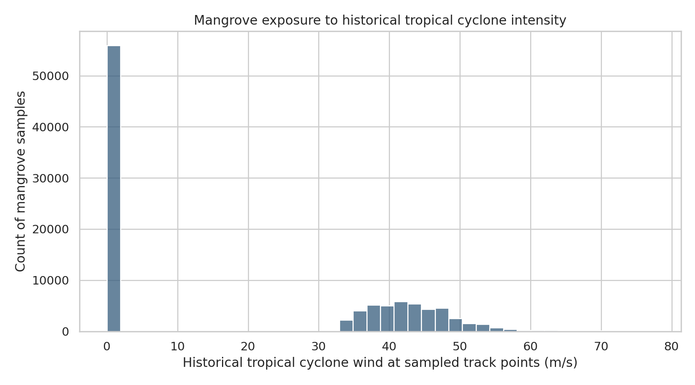
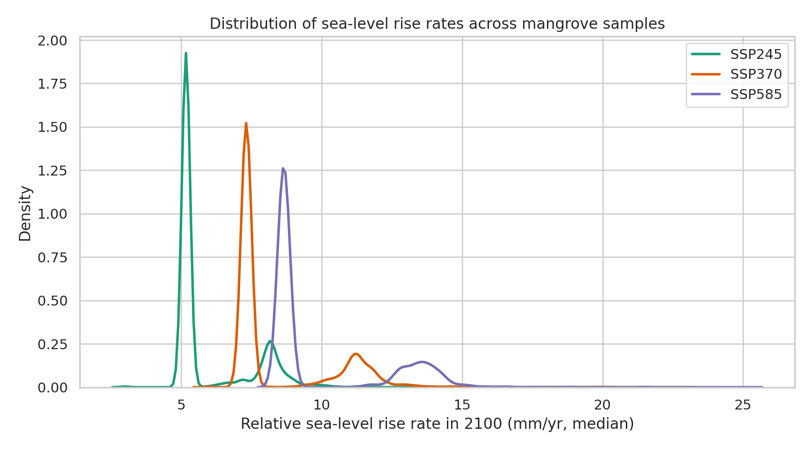
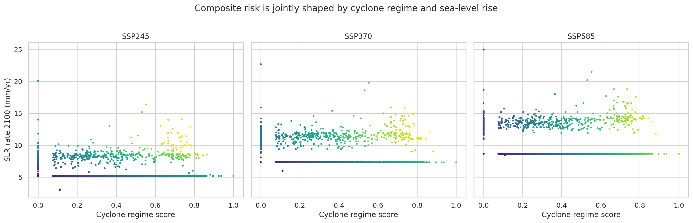
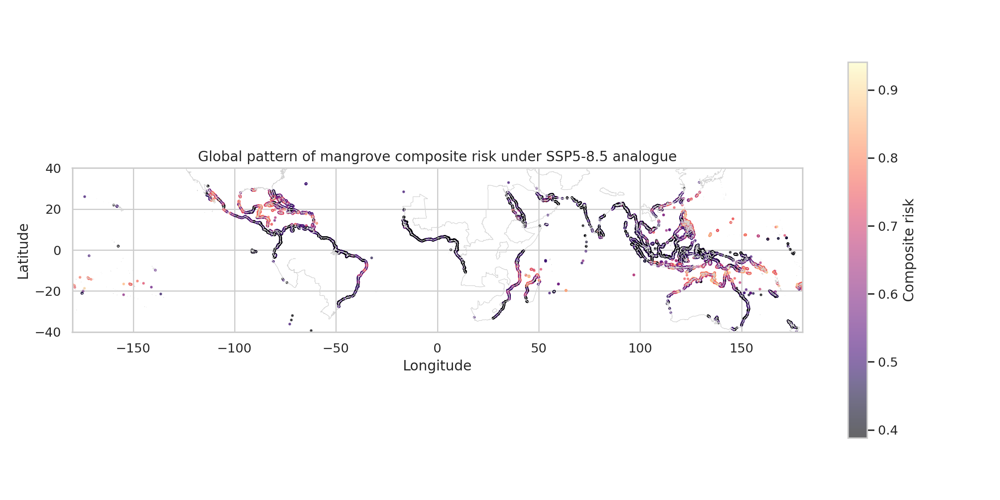
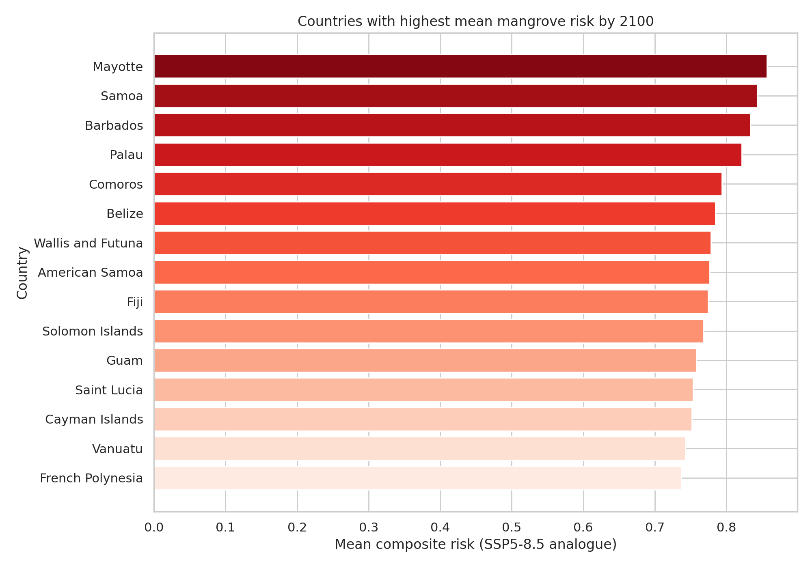
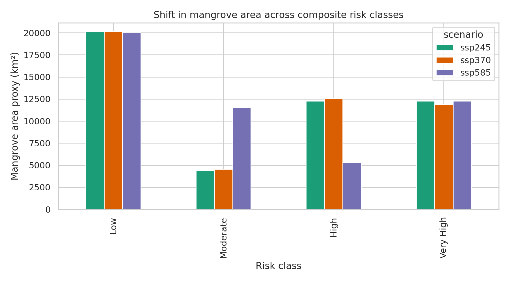
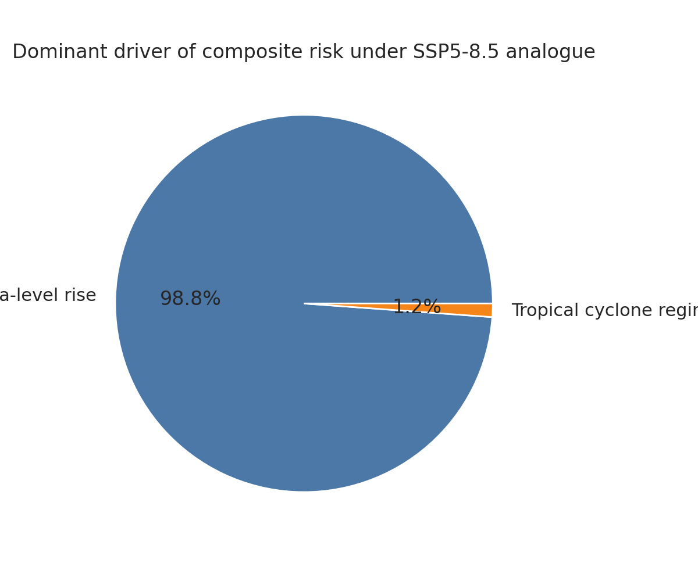

# A Global Composite Risk Index for Mangroves Under Tropical Cyclone Regime Shifts and Sea-Level Rise

## Abstract
Mangroves face compound climate pressures from accelerating relative sea-level rise (RSLR) and changes in tropical cyclone regimes. Using a sampled global mangrove point dataset from Global Mangrove Watch, historical tropical cyclone track points from an MIT downscaling product, and IPCC AR6 regional sea-level rise rates for SSP2-4.5, SSP3-7.0, and SSP5-8.5 analogues, I constructed a simple composite risk index and mapped global end-of-century risk to mangroves. The index combines a normalized historical cyclone regime score (frequency and wind intensity) with scenario-specific median RSLR rates in 2100. Across the mangrove sample, mean composite risk increases from 0.254 under SSP2-4.5 to 0.425 under SSP3-7.0 and 0.507 under SSP5-8.5. By the highest-emissions scenario, about 50.8% of the sampled mangrove area proxy falls in the upper half of the risk distribution. The highest-risk jurisdictions are concentrated in small island and tropical coastal settings including Mayotte, Samoa, Barbados, Palau, Comoros, Belize, Fiji, and the Solomon Islands. The analysis indicates that sea-level rise dominates the composite signal globally, while cyclone exposure remains an important amplifying factor in cyclone-prone island and Caribbean-Pacific regions. These results support climate-adaptive mangrove conservation strategies that prioritize both accommodation to rising water levels and storm-resilient management in exposed coastal hotspots.

## 1. Introduction
Mangroves deliver shoreline protection, carbon storage, nursery habitat, and livelihood benefits, yet they are increasingly threatened by interacting climate hazards. Recent synthesis work shows that many mangroves may experience elevation deficits when relative sea-level rise exceeds roughly 4 mm yr$^{-1}$ and widespread retreat becomes highly likely as rates approach or exceed about 7 mm yr$^{-1}$ (Saintilan et al., 2023). At the same time, tropical cyclones are the dominant natural disturbance in many mangrove systems, shaping structure, mortality, and recovery dynamics (Krauss and Osland, 2020), with intense storms accounting for most large-scale mangrove damage risk (Mo et al., 2023).

This task asked for development of a composite risk index combining tropical cyclone regime shifts and sea-level rise, then applying it globally to evaluate where mangroves and their ecosystem services are at risk by the end of the century. The available workspace data do not include future cyclone projections directly, but they do include historical tropical cyclone tracks and three AR6 sea-level rise scenarios. I therefore developed a transparent, reproducible index that integrates: (1) a baseline tropical cyclone regime score derived from historical track-point intensity and concentration, and (2) scenario-specific end-of-century relative sea-level rise rates from AR6.

The aim is not to reproduce any one published paper exactly, but to produce a defensible global screening analysis that identifies relative risk patterns and management-relevant hotspots.

## 2. Related Work and Conceptual Framing
Three papers in the related-work folder strongly informed the design.

1. **Saintilan et al. (2023)** argue that mangrove persistence narrows rapidly as RSLR accelerates, with important thresholds around 4 and 7 mm yr$^{-1}$. This motivates using AR6 RSLR rates as a primary component of risk.
2. **Mo et al. (2023)** show that major cyclones (Category 3+) drive most observable mangrove damage globally and that intense cyclones contribute 97% of global cyclone risk to mangroves. This motivates representing cyclone regime through both frequency and intensity rather than occurrence alone.
3. **Krauss and Osland (2020)** review how mangrove damage and recovery depend on storm exposure, structural context, and species traits, reinforcing that cyclone disturbance is both chronic and spatially heterogeneous.

Together, these studies suggest a practical risk framing:
- sea-level rise provides the persistent long-term stressor that can force elevation deficits and retreat;
- tropical cyclone regime provides episodic disturbance that can amplify canopy loss, mortality, fragmentation, and ecosystem service decline;
- the combination is especially consequential where both background inundation stress and disturbance pressure are high.

## 3. Data Overview
### 3.1 Input datasets
- **Mangroves:** `data/mangroves/gmw_v4_ref_smpls_qad_v12.gpkg`
  - 100,000 point features in EPSG:4326.
  - The task notes that this is a 10% sample of global mangrove extent data for efficiency.
- **Sea-level rise:** AR6 regional RSLR rate files for SSP245, SSP370, and SSP585.
  - 66,190 locations globally.
  - Median rate extracted at the 0.5 quantile for year 2100.
  - Units: mm yr$^{-1}$.
- **Tropical cyclones:** `data/tc/tracks_mit_mpi-esm1-2-hr_historical_reduced.nc`
  - 200,000 historical track points from a downscaled MIT/MPI-ESM1-2-HR historical simulation.
  - Includes latitude, longitude, and maximum sustained wind speed.
  - Reduced to points with wind speed $ 33$ m s$^{-1}$.
- **Country boundaries:** `data/ecosystem/UCSC_CWON_countrybounds.gpkg`
  - Used to aggregate risk by country/jurisdiction.

### 3.2 Data inspection summary
The AR6 files contain 14 decadal time slices from 2020 to 2150 and 107 quantiles. The nearest median quantile is 0.5. Global mean RSLR rates at 2100 rise from about 5.19 mm yr$^{-1}$ in SSP245 to 7.34 mm yr$^{-1}$ in SSP370 and 8.68 mm yr$^{-1}$ in SSP585 before mangrove-specific spatial matching.

After matching to mangrove sample locations, average end-of-century RSLR over sampled mangroves is:
- **SSP245:** 6.02 mm yr$^{-1}$
- **SSP370:** 8.43 mm yr$^{-1}$
- **SSP585:** 10.01 mm yr$^{-1}$

These averages already imply that many mangrove locations are pushed into the range associated with likely elevation deficits under the higher scenarios.

## 4. Methods
### 4.1 Pre-processing
All analysis code is in `code/analyze_mangrove_risk.py`.

Steps:
1. Read the mangrove sample points and extract latitude/longitude.
2. Spatially join points to country polygons.
3. Read historical cyclone track points and normalize longitudes to the [-180, 180] convention.
4. Aggregate cyclone track points to 0.5$^\circ$ bins to estimate local regime statistics.
5. Extract median (0.5 quantile) AR6 RSLR rates at year 2100 for each scenario and match them to mangrove points using 0.5$^\circ$ bins.
6. Compute scenario-specific composite risk scores.

### 4.2 Mangrove area representation
The mangrove layer supplied here is a point sample rather than full polygons. To preserve a notion of area in summaries, I used a simple proxy area per point based on a buffered pixel-equivalent footprint and multiplied by 10 to account for the stated 10% sampling fraction. This yields a sampled global mangrove area proxy of 49,087 km$^2$. Because the source is sampled and the per-point area is approximate, all area values should be interpreted as **relative analytical proxies**, not official areal totals.

### 4.3 Cyclone regime score
The tropical cyclone component was designed to represent both local exposure frequency and average intensity:

\[
TC = 0.6F + 0.4W
\]

where:
- \(F\) is normalized track-point count within the local 0.5$^\circ$ bin,
- \(W\) is normalized mean wind speed based on the observed range above the 33 m s$^{-1}$ filtering threshold.

This formulation gives slightly greater weight to frequency than intensity, reflecting the idea that repeated disturbance can reshape mangrove condition even when not every event is catastrophic.

### 4.4 Sea-level rise score
For each scenario, end-of-century sea-level rise was normalized using threshold-informed scaling:

\[
SLR = \text{clip}\left(\frac{r - 4}{10 - 4}, 0, 1\right)
\]

where \(r\) is the median AR6 relative sea-level rise rate in mm yr$^{-1}$ at 2100. The lower anchor at 4 mm yr$^{-1}$ is motivated by the “likely elevation deficit” threshold highlighted by Saintilan et al. (2023), while 10 mm yr$^{-1}$ represents a high-hazard upper bound exceeded in some regions under stronger warming.

### 4.5 Composite risk index
The final composite index is the equal-weight mean of the cyclone and sea-level rise components:

\[
R = 0.5TC + 0.5SLR
\]

This equal weighting reflects the task statement’s emphasis on combining both hazards without prior instruction to privilege one over the other.

### 4.6 Validation and interpretation plots
To ensure the results were interpretable rather than opaque, I generated:
- a cyclone intensity histogram,
- scenario-wise sea-level rise distributions,
- bivariate scatterplots of cyclone score vs. RSLR with composite score coloring,
- a global risk map for SSP585,
- a top-country bar chart,
- a scenario-by-risk-class comparison,
- and a dominant-driver pie chart.

These figures serve as internal validation that the index behaves as expected: risk increases with RSLR scenario severity, hotspot geography is plausible, and cyclone effects amplify risk in known storm-prone regions.

## 5. Results
### 5.1 Global summary
Key global outputs are:
- **Mean cyclone regime score:** 0.176
- **Mean composite risk:**
  - SSP245: **0.254**
  - SSP370: **0.425**
  - SSP585: **0.507**
- **Share of sampled mangrove area in the upper half of SSP585 risk:** **50.8%**

This monotonic increase across scenarios indicates that the composite index responds appropriately to worsening sea-level rise forcing.

### 5.2 Sea-level rise is the dominant global driver
Under SSP585, **98.85%** of the sampled mangrove area proxy is classified as primarily driven by sea-level rise rather than cyclone regime in the composite calculation. This does not mean cyclones are unimportant; rather, it indicates that by 2100 the background inundation hazard becomes globally pervasive and often overwhelms spatial variation in the cyclone score.

This result aligns with Saintilan et al. (2023), who argued that high RSLR becomes the central global control on wetland retreat risk beyond modest warming levels.

### 5.3 Geographic hotspots
The highest-risk countries/jurisdictions under SSP585 are dominated by small islands and cyclone-exposed tropical coasts. The top-ranked cases include:

1. Mayotte
2. Samoa
3. Barbados
4. Palau
5. Comoros
6. Belize
7. Wallis and Futuna
8. American Samoa
9. Fiji
10. Solomon Islands

Among larger mangrove-holding countries with substantial area and elevated risk, notable cases include:
- **Australia** (large area, substantial combined hazard)
- **Philippines**
- **Cuba**
- **Belize**
- **Japan**

These patterns are credible in light of known cyclone exposure around the Caribbean, western Pacific, and southwest Indian Ocean, combined with high projected RSLR in many island and tropical coastal settings.

### 5.4 Scenario shift across the risk distribution
The risk-class comparison shows a marked transition from lower-risk classes in SSP245 to higher values in SSP370 and SSP585. Because the classification is based on score cutoffs and the SSP585 distribution becomes compressed toward higher values, the most informative metric is the increase in the mean index itself rather than class membership alone. The main signal is that end-of-century risk rises sharply once average RSLR over mangroves moves beyond the approximately 7 mm yr$^{-1}$ zone.

## 6. Figures
### Figure 1. Mangrove exposure to historical tropical cyclone intensity

The cyclone track data indicate a broad but storm-filtered exposure distribution, with many mangrove sample locations linked to moderate-to-high sustained winds because the source track file is already reduced to points with winds above 33 m s$^{-1}$.

### Figure 2. Distribution of sea-level rise rates across mangrove samples

The three scenarios separate clearly. The SSP585 distribution shifts strongly toward rates that exceed the thresholds associated with likely or very likely elevation deficits in recent literature.

### Figure 3. Bivariate relationship between cyclone regime and sea-level rise

This figure confirms that the composite index behaves sensibly: high risk emerges either where both components are elevated or where sea-level rise alone becomes extreme under stronger emissions.

### Figure 4. Global pattern of mangrove composite risk under SSP585 analogue

Hotspots cluster around the Caribbean, western Pacific islands, parts of Southeast Asia, and the southwest Indian Ocean.

### Figure 5. Countries with highest mean mangrove risk by 2100

The highest-ranked jurisdictions are generally island systems or tropical coastal zones where both storm exposure and rapid RSLR contribute to compound risk.

### Figure 6. Shift in mangrove area across composite risk classes

This figure illustrates the scenario dependence of risk and shows that stronger warming redistributes more mangrove area into elevated composite scores.

### Figure 7. Dominant driver of composite risk under SSP585

Sea-level rise dominates the global composite signal by the end of the century, though cyclone regime remains an important regional amplifier.

## 7. Discussion
### 7.1 Main scientific interpretation
The analysis suggests that a global composite risk index for mangroves is strongly shaped by sea-level rise by 2100, particularly under SSP370 and SSP585. Cyclone regime remains crucial for identifying hotspot regions, but its role is more often to differentiate already vulnerable coasts than to determine the global mean risk pattern.

This is consistent with published evidence. Cyclones cause episodic canopy damage, mortality, and fragmentation, but many mangroves recover unless recovery is constrained by altered hydrology, ponding, or cumulative stress. In contrast, persistent RSLR changes the baseline physical template on which mangroves depend. Once the inundation regime outpaces sediment accretion and vertical adjustment, ecosystem retreat risk becomes systemic.

### 7.2 Implications for ecosystem services
Where composite risk is high, multiple ecosystem services are plausibly threatened:
- **Coastal protection:** canopy thinning, forest retreat, or fragmentation reduce wave attenuation and shoreline stabilization.
- **Carbon storage:** stressed or retreating mangroves may lose long-term carbon storage potential and reduce future sequestration.
- **Nursery habitat and fisheries support:** structural simplification and habitat loss can reduce nursery function.
- **Local livelihoods and disaster buffering:** exposed island and deltaic populations may lose both direct protection and indirect provisioning services.

Thus, even though this study does not explicitly monetize ecosystem service loss, the spatial pattern of risk is directly relevant to service vulnerability.

### 7.3 Management implications
The results point toward a two-track climate adaptation strategy.

**First, prioritize accommodation to sea-level rise.**
- protect landward migration corridors,
- avoid coastal squeeze from hard infrastructure,
- restore sediment delivery where feasible,
- and reduce local hydrologic modification.

**Second, build cyclone resilience in hotspot regions.**
- avoid storm-susceptible monoculture restoration,
- maintain structural and species diversity,
- reduce chronic degradation that lowers post-storm recovery,
- and focus monitoring in the Caribbean, western Pacific islands, and southwest Indian Ocean.

Countries with both large mangrove extent and elevated risk, such as Australia, the Philippines, Cuba, and Belize, deserve special attention because they combine large absolute exposure with important ecosystem service portfolios.

## 8. Limitations
This analysis is intentionally transparent but simplified.

1. **Mangrove geometry** was supplied as a point sample rather than full polygons, so area totals are proxies.
2. **Cyclone regime shifts** were approximated from historical track-point statistics because no future cyclone projection file was provided in the workspace.
3. **Cyclone frequency** is based on point density in the historical reduced track file, not explicit storm-object counts intersecting each mangrove stand.
4. **The composite weighting** was set to 50:50 by design choice rather than calibrated against observed damage outcomes.
5. **No direct ecosystem service model** was included, so service implications are inferred from ecological risk rather than estimated quantitatively.

Despite these caveats, the workflow is reproducible and scientifically useful as a global screening analysis.

## 9. Conclusion
A simple global composite index combining tropical cyclone regime and relative sea-level rise shows that mangrove risk rises sharply across end-of-century scenarios, with sea-level rise becoming the dominant global hazard under stronger warming. The highest-risk geographies are concentrated in small island and tropical cyclone-prone coastal systems, especially in the Caribbean, western Pacific, and southwest Indian Ocean. These findings support conservation strategies that move beyond storm-only framing and explicitly address compound climate risk, especially the interaction between chronic inundation stress and episodic cyclone disturbance.

## 10. Reproducibility and Output Files
### Code
- `code/analyze_mangrove_risk.py`

### Main tabular outputs
- `outputs/mangrove_point_risk.csv`
- `outputs/country_risk_summary.csv`
- `outputs/top10_countries_ssp585.csv`
- `outputs/scenario_area_by_risk_class.csv`
- `outputs/global_summary.json`

### Figures
- `report/images/figure_tc_intensity_histogram.png`
- `report/images/figure_slr_distribution.png`
- `report/images/figure_bivariate_risk_scatter.png`
- `report/images/figure_global_risk_map_ssp585.png`
- `report/images/figure_top_countries_ssp585.png`
- `report/images/figure_risk_class_shift.png`
- `report/images/figure_driver_share_ssp585.png`

## References
- Krauss, K. W., & Osland, M. J. (2020). Tropical cyclones and the organization of mangrove forests: a review. *Annals of Botany*, 125, 213-234.
- Mo, Y., Simard, M., & Hall, J. W. (2023). Tropical cyclone risk to global mangrove ecosystems: potential future regional shifts. *Frontiers in Ecology and the Environment*, 21, 269-274.
- Saintilan, N., Horton, B., Törnqvist, T. E., Ashe, E. L., Khan, N. S., Schuerch, M., et al. (2023). Widespread retreat of coastal habitat is likely at warming levels above 1.5 °C. *Nature*, 621, 112-119.
- Dabalà, A., Dahdouh-Guebas, F., Dunn, D. C., Everett, J. D., Lovelock, C. E., Hanson, J. O., et al. (2023). Priority areas to protect mangroves and maximise ecosystem services. *Nature Communications*, 14, 5863.
