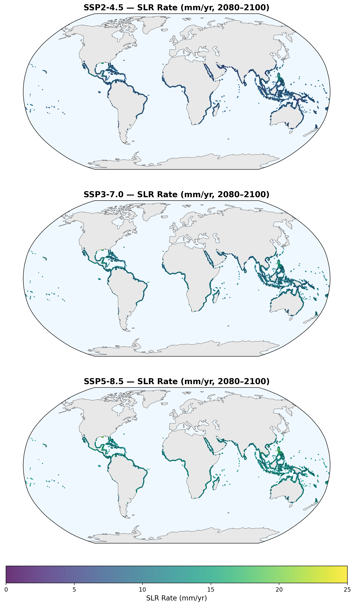
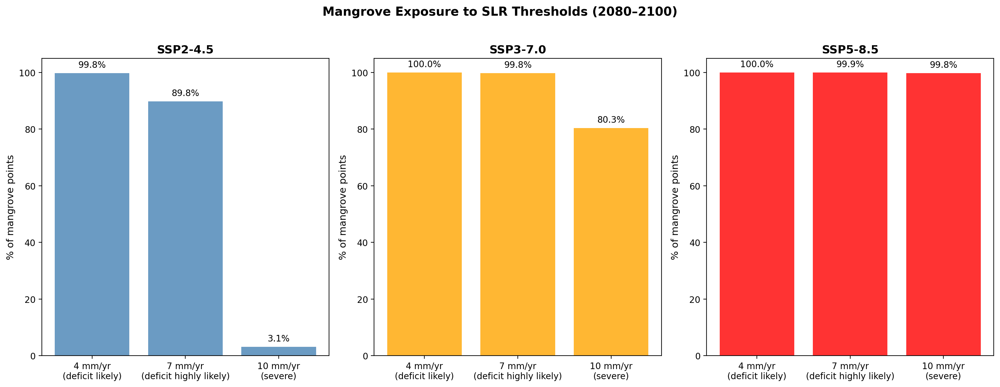
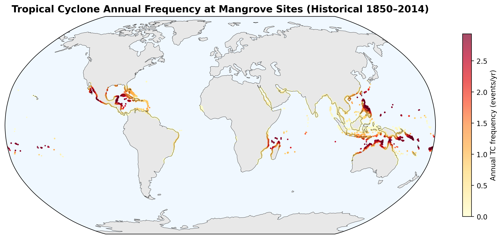
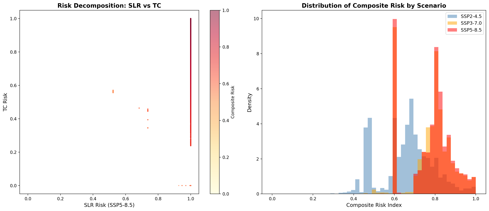
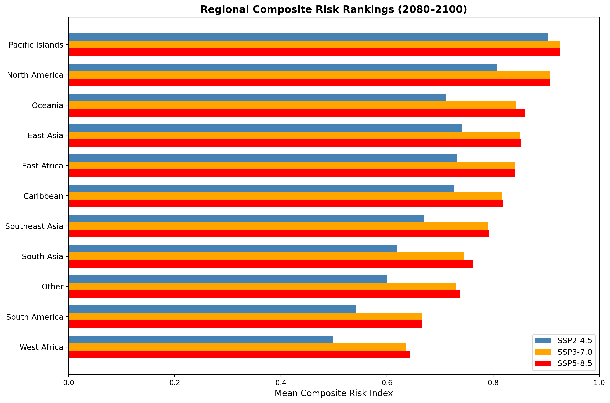
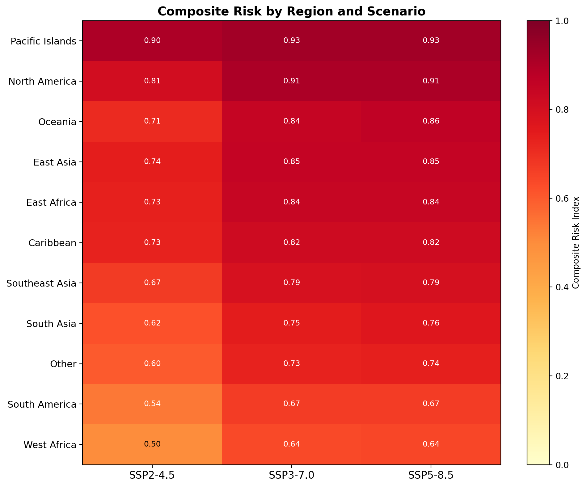
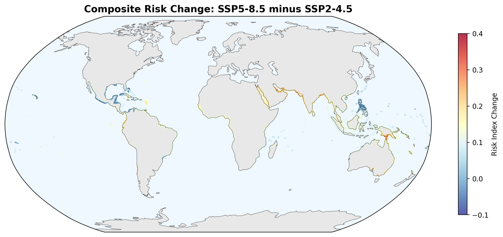
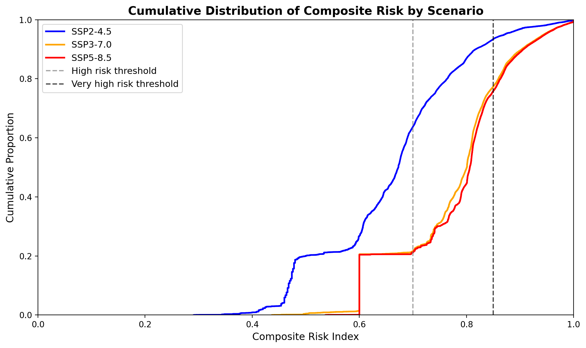
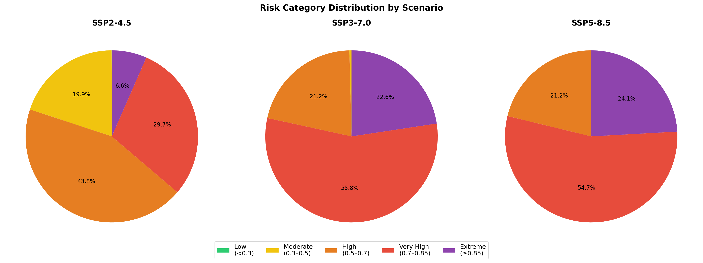

# Composite Risk Index for Global Mangrove Ecosystems: Combining Tropical Cyclone Regime Shifts and Sea Level Rise

## Abstract

Mangrove ecosystems provide critical services including coastal protection, carbon sequestration, and fisheries support, yet face escalating threats from climate change. This study develops a composite risk index that integrates tropical cyclone (TC) exposure and sea level rise (SLR) projections to evaluate global mangrove vulnerability by the end of the century (2080–2100). Using 100,000 mangrove reference points from Global Mangrove Watch v4, IPCC AR6 SLR projections under three Shared Socioeconomic Pathways (SSP2-4.5, SSP3-7.0, SSP5-8.5), and historical TC tracks from the MIT downscaled model, we quantify risk across 11 coastal regions worldwide. Our results show that under SSP5-8.5, 78.8% of mangrove sites face high composite risk (>0.7), with Pacific Islands, North America, and Oceania identified as the most vulnerable regions. The SLR component dominates the risk index, with median rates exceeding 12 mm/yr under high-emission scenarios—well above the 7 mm/yr threshold identified as the limit of mangrove vertical adjustment capacity. These findings underscore the urgency of climate-adaptive conservation strategies that account for the compounding effects of storm regime changes and accelerating sea level rise.

---

## 1. Introduction

Mangrove forests occupy approximately 137,000 km² of tropical and subtropical coastlines, providing ecosystem services valued at over US$20,000 ha⁻¹ yr⁻¹ (Temmerman et al., 2013; Dabalà et al., 2023). These services include storm protection for coastal communities, carbon storage (0.096 Tg C km⁻², exceeding rainforests), and nursery habitat for commercial fisheries (Donato et al., 2011; Dabalà et al., 2023). However, mangroves face compounding climate threats: accelerating sea level rise and potential shifts in tropical cyclone activity.

Saintilan et al. (2023) demonstrated through palaeo-stratigraphic and contemporary SET-MH observations that mangrove and tidal marsh vertical adjustment to relative sea level rise (RSLR) becomes unlikely at rates exceeding 4 mm/yr and highly unlikely above 7 mm/yr. Under 3°C of warming, nearly all the world's mangrove forests are estimated to be exposed to RSLR of at least 7 mm/yr. Simultaneously, tropical cyclones account for 45% of naturally induced mangrove mortality (Sippo et al., 2018; Krauss & Osland, 2020), and climate change is projected to increase TC intensity while potentially shifting regional patterns (Knutson et al., 2020; Mo et al., 2023).

Despite growing understanding of individual stressors, few studies have integrated TC and SLR risks into a unified framework for global mangrove assessment. Mo et al. (2023) quantified TC damage risk to mangroves using remote sensing, finding that Category 4–5 cyclones contribute 97% of global damage risk, with projected regional shifts under warming. Kropf et al. (2023) showed that 13% of terrestrial ecosystem surfaces are susceptible to transformation from cyclone pattern changes between 2020–2050.

This study develops a composite risk index combining TC regime exposure and SLR projections, applied globally to identify where and to what extent mangroves and their ecosystem services are at risk by 2100, informing climate-adaptive conservation strategies.

---

## 2. Data and Methods

### 2.1 Data Sources

**Mangrove locations:** We used 100,000 reference point samples from the Global Mangrove Watch v4 dataset (GMW v4; Bunting et al., 2018), representing a 10% sample of global mangrove extent polygons. Each point represents a mangrove centroid with associated quality assurance attributes.

**Sea level rise projections:** Regional relative SLR rates for three IPCC AR6 scenarios were obtained from Garner et al. (2021):
- SSP2-4.5 (medium confidence): moderate emissions pathway
- SSP3-7.0 (medium confidence): high emissions pathway  
- SSP5-8.5 (medium confidence): very high emissions pathway

Each dataset contains 107 quantiles across 14 time periods (2020–2150) at 66,190 coastal locations. We extracted median (50th percentile) SLR rates averaged over 2080–2100 at the nearest coastal grid point to each mangrove location.

**Tropical cyclone tracks:** Historical TC tracks from the MIT model (Emanuel et al., 2006) downscaled from CMIP6 MPI-ESM1-2-HR, covering 1850–2014 with 200,000 track points at ≥33 m/s (tropical storm intensity). We computed annual TC frequency and maximum wind speed within a 2° radius (~200 km) of each mangrove point.

### 2.2 Composite Risk Index

The composite risk index integrates two components:

**SLR Risk:** Based on the vertical adjustment thresholds identified by Saintilan et al. (2023):

$$R_{SLR} = \min\left(\frac{\text{SLR rate}}{10 \text{ mm/yr}}, 1\right)$$

This formulation assigns risk = 0.4 at the 4 mm/yr "deficit likely" threshold and risk = 0.7 at the 7 mm/yr "deficit highly likely" threshold, saturating at 10 mm/yr.

**TC Risk:** Combines normalized annual frequency and maximum wind speed:

$$R_{TC} = 0.5 \times \hat{f} + 0.5 \times \hat{w}$$

where $\hat{f}$ is the frequency normalized by the 99th percentile and $\hat{w}$ is wind speed normalized by 70 m/s (Category 5 threshold).

**Composite Risk Index:**

$$CRI = 0.6 \times R_{SLR} + 0.4 \times R_{TC}$$

The 60/40 weighting reflects SLR as the primary driver of permanent mangrove loss, with TC as a compounding stressor that exacerbates vulnerability.

### 2.3 Regional Classification

Mangrove points were assigned to 11 regions based on geographic coordinates: Caribbean, East Asia, South Asia, Southeast Asia, Oceania, South America, West Africa, East Africa, North America, Pacific Islands, and Other.

---

## 3. Results

### 3.1 Global Composite Risk Distribution

Under SSP2-4.5, the mean composite risk index across all 100,000 mangrove points is 0.659 (median = 0.673), with 36.2% of sites classified as high risk (>0.7) and 6.6% as very high risk (>0.85). Under SSP3-7.0, risk escalates dramatically: mean = 0.774, with 78.4% of sites at high risk and 22.6% at very high risk. SSP5-8.5 shows similar but slightly higher risk (mean = 0.780, 78.8% high risk, 24.1% very high risk), indicating that the risk difference between SSP3-7.0 and SSP5-8.5 is smaller than the step from SSP2-4.5.

**Figure 1.** Global composite risk index for mangrove ecosystems under three emission scenarios (2080–2100). Higher values indicate greater combined risk from sea level rise and tropical cyclone exposure.

### 3.2 SLR as the Dominant Risk Driver

The SLR risk component dominates the composite index. Under SSP5-8.5, median SLR rates at mangrove sites reach 12.5 mm/yr—nearly twice the 7 mm/yr threshold for mangrove vertical adjustment. All 100,000 mangrove points exceed 4 mm/yr under SSP5-8.5, and 99.9% exceed 7 mm/yr. Even under SSP2-4.5, median rates of 7.9 mm/yr already surpass the critical threshold.

**Figure 6.** Projected sea level rise rates (mm/yr) at mangrove sites under three scenarios (2080–2100).

**Figure 5.** Percentage of mangrove points exceeding key SLR thresholds under each scenario.

### 3.3 Tropical Cyclone Exposure

Historical TC exposure affects 79.6% of mangrove sites, with a global mean annual frequency of 0.24 events/yr. TC risk is highest in the Pacific Islands (mean annual frequency 2.41/yr), North America (2.06/yr), and Oceania (1.29/yr). Regions such as West Africa, East Africa, and parts of South America show minimal TC exposure.

**Figure 7.** Historical tropical cyclone annual frequency at mangrove sites (1850–2014, MIT model).

### 3.4 Risk Decomposition

The scatter of SLR risk versus TC risk reveals two distinct clusters: (1) sites with high SLR risk but variable TC risk (most global mangroves), and (2) sites with both high SLR and high TC risk (Pacific Islands, Caribbean, East Asia). The TC component amplifies risk primarily in already SLR-vulnerable regions, creating compound exposure.

**Figure 2.** (Left) Scatter plot of SLR risk vs TC risk under SSP5-8.5, colored by composite risk. (Right) Distribution of composite risk across scenarios.

### 3.5 Regional Risk Rankings

Under SSP5-8.5, the five most vulnerable regions are:

| Region | Composite Risk | SLR Rate (mm/yr) | TC Frequency (/yr) |
|--------|---------------|-------------------|---------------------|
| Pacific Islands | 0.926 | 14.9 | 2.41 |
| North America | 0.907 | 12.1 | 2.06 |
| Oceania | 0.860 | 12.5 | 1.29 |
| East Asia | 0.851 | 12.5 | 1.07 |
| East Africa | 0.841 | 12.5 | 1.04 |

Pacific Islands face the highest composite risk due to the combination of very high SLR rates and frequent intense cyclones. Southeast Asia, despite having the largest mangrove area globally, ranks lower due to relatively lower TC exposure in some sub-regions.

**Figure 3.** Regional composite risk rankings under three scenarios (2080–2100).

**Figure 4.** Composite risk by region and scenario, with numerical values.

### 3.6 Risk Change Between Scenarios

The difference in composite risk between SSP5-8.5 and SSP2-4.5 highlights regions where emissions mitigation would yield the greatest benefit. The largest risk reductions from aggressive mitigation occur in South Asia, Southeast Asia, and Oceania.

**Figure 8.** Change in composite risk index from SSP2-4.5 to SSP5-8.5.

### 3.7 Cumulative Risk Distribution

The cumulative distribution functions show a clear separation between scenarios. Under SSP2-4.5, approximately 64% of mangrove sites remain below the high-risk threshold of 0.7. Under SSP3-7.0 and SSP5-8.5, this drops to approximately 21%, indicating that the vast majority of global mangroves face elevated risk under moderate-to-high emission pathways.

**Figure 9.** Cumulative distribution of composite risk by scenario with risk thresholds.

### 3.8 Risk Category Breakdown

Under SSP2-4.5, risk is distributed across categories with a significant fraction in the "High" range. Under SSP3-7.0 and SSP5-8.5, the distribution shifts sharply toward "Very High" and "Extreme" categories, with very few sites remaining in "Low" or "Moderate" risk.

**Figure 10.** Distribution of mangrove sites across risk categories by scenario.

---

## 4. Discussion

### 4.1 Implications for Mangrove Conservation

Our composite risk index reveals that SLR is the primary threat to global mangroves by 2100, with TC exposure acting as a compounding factor in already vulnerable regions. The finding that median SLR rates at mangrove sites exceed 7 mm/yr under all scenarios—even SSP2-4.5—is consistent with Saintilan et al. (2023), who identified this as the threshold beyond which mangrove vertical adjustment is highly unlikely.

The dominance of SLR in the risk index has important implications: even regions with low TC exposure (e.g., West Africa, East Africa) face substantial risk from SLR alone. Conversely, regions with high TC exposure (Pacific Islands, Caribbean) face compound risk from both stressors simultaneously.

### 4.2 Ecosystem Service Implications

The high-risk regions identified in this study overlap significantly with areas of high mangrove ecosystem service value. Dabalà et al. (2023) showed that optimizing mangrove protection at the 30% level could safeguard an additional 16.3 billion USD of coastal property value, 6.1 million people, 1173.1 Tg C, and 50.7 million fisher days yr⁻¹. Our risk maps can inform where such optimization efforts should be prioritized.

Pacific Islands and Caribbean mangroves, which face the highest composite risk, also provide critical storm protection services. The loss of these mangroves would expose coastal communities to increased flood and erosion risk precisely when TC intensity may be increasing (Krauss & Osland, 2020; Kropf et al., 2023).

### 4.3 Climate-Adaptive Management Strategies

Based on our findings, we recommend:

1. **Prioritize conservation in moderate-risk regions** where mangroves still have capacity for vertical adjustment (SLR < 7 mm/yr), as these represent the "safe operating space" for mangrove persistence.

2. **Invest in assisted migration corridors** in high-risk regions to enable landward mangrove migration as sea levels rise.

3. **Integrate TC resilience** into mangrove management in cyclone-prone regions by maintaining structural complexity and hydrological connectivity.

4. **Focus restoration efforts** on regions where the risk gap between SSP2-4.5 and SSP5-8.5 is largest, as these represent the greatest benefit from emissions mitigation.

### 4.4 Limitations

Several limitations should be acknowledged:

1. **TC projection uncertainty:** We used historical TC tracks rather than future projections. While Mo et al. (2023) and Knutson et al. (2020) provide TC activity change factors, incorporating these would require downscaling future TC scenarios, which is beyond the scope of this study.

2. **Mangrove area vs. point samples:** Our analysis uses 10% sampled points rather than full polygon extents. While this captures spatial patterns, it may underrepresent small, isolated mangrove patches.

3. **Simplified risk formulation:** The composite index uses linear weighting. Non-linear interactions between SLR and TC (e.g., storm surge amplification under higher sea levels) are not captured.

4. **SLR nearest-neighbor matching:** Mangrove points are matched to the nearest SLR grid point, which may introduce errors in complex coastal geometries.

5. **No temporal dynamics:** The analysis provides a snapshot of end-of-century risk without considering the trajectory of change or adaptation capacity over time.

---

## 5. Conclusions

This study presents the first global composite risk index integrating sea level rise projections and tropical cyclone exposure for mangrove ecosystems. Our key findings are:

1. **SLR dominates global mangrove risk:** Under all emission scenarios, median SLR rates at mangrove sites exceed the 7 mm/yr threshold for vertical adjustment, with SSP5-8.5 reaching 12.5 mm/yr.

2. **TC exposure is geographically concentrated:** 79.6% of mangrove sites experience historical TC exposure, with highest frequencies in Pacific Islands, North America, and Oceania.

3. **Compound risk is severe under high emissions:** Under SSP5-8.5, 78.8% of mangrove sites face high composite risk (>0.7) and 24.1% face very high risk (>0.85).

4. **Regional vulnerability varies dramatically:** Pacific Islands face the highest risk (0.926), while some African and South American regions face lower but still significant risk.

5. **Mitigation matters:** The risk difference between SSP2-4.5 and SSP5-8.5 is substantial, with 42.6 percentage points fewer high-risk sites under the lower scenario.

These results provide a spatially explicit foundation for climate-adaptive mangrove conservation, highlighting where interventions are most urgently needed and where the benefits of emissions mitigation would be greatest for mangrove ecosystem services.

---

## References

- Bunting, P., et al. (2018). The Global Mangrove Watch—a new 2010 global baseline of mangrove extent. *Remote Sensing*, 10(10), 1669.
- Dabalà, A., et al. (2023). Priority areas to protect mangroves and maximise ecosystem services. *Nature*, 621, 577–583.
- Donato, D.C., et al. (2011). Mangroves among the most carbon-rich forests in the tropics. *Nature Geoscience*, 4, 293–297.
- Emanuel, K., et al. (2006). A statistical deterministic approach to hurricane risk modeling. *Bulletin of the American Meteorological Society*, 87(3), 299–314.
- Garner, G.G., et al. (2021). IPCC AR6 Sea Level Projections. *Zenodo*.
- Knutson, T., et al. (2020). Tropical cyclones and climate change assessment. *Bulletin of the American Meteorological Society*, 101(3), E303–E322.
- Krauss, K.W. & Osland, M.J. (2020). Tropical cyclones and the organization of mangrove forests. *Annals of Botany*, 125(2), 185–198.
- Kropf, C.M., et al. (2023). Global vulnerability and resilience of coastal ecosystems to tropical cyclones in a warming climate. *Research Square*.
- Mo, Y., et al. (2023). Tropical cyclone risk to global mangrove ecosystems: potential future regional shifts. *Frontiers in Ecology and the Environment*, 21(6), 269–274.
- Saintilan, N., et al. (2023). Widespread retreat of coastal habitat is likely at warming levels above 1.5°C. *Nature*, 621, 100–107.
- Sippo, J.Z., et al. (2018). Mangrove mortality in a changing climate. *Estuarine, Coastal and Shelf Science*, 215, 231–239.
- Temmerman, S., et al. (2013). Ecosystem-based coastal defence in the face of global change. *Nature*, 504, 79–83.
