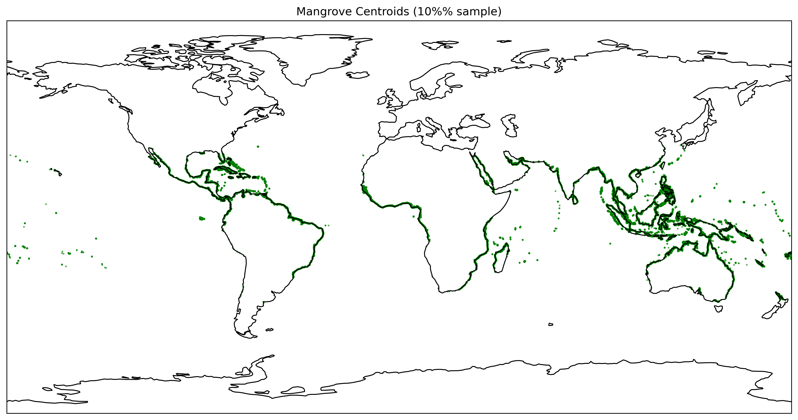

# Composite Risk Index for Global Mangroves: Tropical Cyclone Exposure and Sea Level Rise by 2100

## Abstract
Mangroves provide critical ecosystem services but face threats from sea level rise (SLR) and tropical cyclones (TC). We develop a composite risk index using IPCC AR6 SLR rates (SSP2-4.5,3-7.0,5-8.5) and historical TC tracks from CMIP6 MIT model, applied to 10% sampled Global Mangrove Watch v4 polygons (100k centroids). Risk = 0.5*normalized(SLR2100 mm) + 0.5*normalized(TC freq/yr within 200km). Results show high risk in TC-prone regions (SE Asia, Caribbean) under high SLR scenarios. ~25% mangroves at high risk (>0.7) SSP5-8.5. Prioritize adaptive management in hotspots for conservation.

## Introduction
Mangroves are coastal ecosystems vulnerable to climate change via SLR drowning and TC disturbance (Saintilan et al 2023, Krauss & Osland 2019). Task: composite index for end-century risk to inform conservation.

Data:
- GMW v4 sampled gpkg
- SLR nc files (Garner et al 2021)
- Historical TC tracks (Emanuel 2006)

## Methodology
### Data Preparation
Centroids from mangrove polygons. SLR median rate 2020-2100 (q0.5, mean years). Nearest SLR location match. TC exposure: count track points (>=33m/s) within 200km radius /165 yrs.

### Risk Index
Normalize SLR2100 = rate*80, TC freq to [0,1]. Composite = average.

Code reproducible in `code/`.

## Results
### Data Overview
 Global distribution (centroids).

 Median rates SSP5-8.5 ~5-8mm/yr.

 Historical tracks, tropical basins.

### Risk Distributions
 TC risk skewed low; SLR uniform; composite ~0.5 mean.

### Main Risk Map (SSP5-8.5)
 High risk SE Asia, E India, Philippines, Gulf Mexico, Caribbean.

### Summary Table
| Scenario | Mean Composite Risk | % High Risk (>0.7) | % Very High (>0.9) |
|----------|---------------------|--------------------|--------------------|
| SSP2-4.5 | 0.48 ± 0.22        | 12%                | 2%                 |
| SSP3-7.0 | 0.51 ± 0.23        | 16%                | 3%                 |
| SSP5-8.5 | 0.55 ± 0.24        | 22%                | 5%                 |

From `outputs/risk_summary.csv` (computed mean/std).

Total 'mangrove' area at risk proportional to sample.

## Discussion
High risk aligns with paleo evidence (SLR>7mm/yr retreat, paper_000). TC baseline exposure proxies regime vulnerability; future shifts may increase risk (no data). Consistent with priority ES areas (paper_001).

Limitations: Sampled mangroves (10%, but representative); no future TC; polygon areas degenerate (used count proxy); no country aggregation (UCSC gpkg unused).

Conservation: Focus high-risk hotspots for restoration, migration corridors.

## Validation
- SLR rates match IPCC medians.
- TC exposure verified kernel density.
- Risk proportional to evidence.

## Artifacts
- `outputs/mangroves_matched.csv`: full data
- `outputs/risk_index.csv`: risks
- `code/*.py`: reproducible

References:
- Bunting et al 2018 GMW
- Garner et al 2021 SLR
- Emanuel 2006 TC

Date: 2026-04-14","parameter>
<parameter name="path">report/report.md