# A Composite Risk Index for Global Mangroves: Integrating Tropical Cyclone Regime Shifts and Sea Level Rise Under Future Climate Scenarios

## Abstract

Mangrove ecosystems provide critical ecosystem services including coastal protection, carbon sequestration, and fisheries support, yet face compounding threats from sea level rise (SLR) and tropical cyclone (TC) intensification under climate change. We developed a composite risk index (CRI) that integrates SLR rates from IPCC AR6 regional projections with TC frequency and intensity metrics from downscaled CMIP6 simulations, applied globally to 100,000 sampled mangrove locations from the Global Mangrove Watch dataset. Under SSP2-4.5, 19.4% of mangrove points fall in the High or Very High risk category by end-of-century, increasing to 34.8% under SSP3-7.0 and 48.6% under SSP5-8.5. SLR is the dominant risk driver at most locations, with 99.3% of mangroves projected to experience rates exceeding 7 mm yr⁻¹ (the threshold at which vertical adjustment deficit becomes highly likely) under SSP5-8.5. Caribbean and Pacific Island nations face the highest composite risk, with Cuba's 342,417 ha of mangroves entirely classified as High or Very High risk under SSP5-8.5. Our results demonstrate that meeting Paris Agreement targets would substantially reduce the area of mangroves at high composite risk, from approximately 73,000 km² under SSP5-8.5 to approximately 29,000 km² under SSP2-4.5. These findings provide a spatially explicit framework for prioritizing climate-adaptive mangrove conservation and management strategies.

---

## 1. Introduction

Mangrove forests occupy the intertidal zone of tropical and subtropical coastlines worldwide, providing ecosystem services valued at over US$20,000 ha⁻¹ yr⁻¹ (Temmerman et al., 2013; Del Valle et al., 2020). These services include coastal protection from storms and flooding, carbon storage in biomass and sediments, nursery habitat for fisheries, and water filtration (Dabalà et al., 2023). However, mangroves face unprecedented threats from climate change, particularly through two interacting mechanisms: accelerated sea level rise and shifting tropical cyclone regimes.

Sea level rise poses a fundamental challenge to mangrove persistence. Saintilan et al. (2023) demonstrated through paleo-stratigraphic evidence, contemporary surface elevation table measurements, and habitat change observations that a vertical adjustment deficit becomes likely at relative SLR rates of 4 mm yr⁻¹ and highly likely at 7 mm yr⁻¹. Under high emissions scenarios, IPCC AR6 projections indicate that much of the world's coastal zone will experience SLR rates exceeding these thresholds by the end of the century (Garner et al., 2021). With 3°C of warming, nearly all of the world's mangrove forests would be exposed to SLR rates of at least 7 mm yr⁻¹ (Saintilan et al., 2023).

Tropical cyclones represent the most destructive natural disturbance to mangroves, causing 45% of their naturally induced mortality (Sippo et al., 2018). Mo et al. (2023) showed that only major TCs (Category 3+, wind speeds ≥50 m/s) cause substantial damage to mangroves, with intense TCs (Category 4-5) contributing 97% of global TC risk. Climate change is projected to modify TC activity, with global TC frequency potentially decreasing but the frequency of the most intense storms increasing by 10-40% under warming scenarios (Knutson et al., 2020). Kropf et al. (2023) found that 13% of terrestrial ecosystem surface is susceptible to transformation due to cyclone pattern changes between 2020 and 2050.

Despite the compounding nature of these threats, no global assessment has systematically combined SLR and TC risks into a unified framework for evaluating mangrove vulnerability. Here, we develop a composite risk index (CRI) that integrates SLR and TC risk components and apply it globally to evaluate where and to what extent mangroves and their ecosystem services are at risk by the end of the century under three SSP scenarios. Our objectives are to: (1) quantify SLR and TC risk at mangrove locations globally; (2) develop and apply a composite risk index; (3) identify regions and countries most at risk; and (4) assess the implications for ecosystem service provision under alternative climate futures.

---

## 2. Methods

### 2.1 Data Sources

**Mangrove distribution.** We used the Global Mangrove Watch v4 dataset (Bunting et al., 2018), which provides global mangrove extent at 25 m resolution. A 10% random sample of reference points (n = 100,000) was used for computational efficiency, with point locations spanning latitudes from -39.8° to 33.0° and longitudes from -180° to 180°.

**Sea level rise projections.** Regional relative SLR rates were obtained from IPCC AR6 (Garner et al., 2021) for three scenarios: SSP2-4.5, SSP3-7.0, and SSP5-8.5 (medium confidence). Each dataset contains 66,190 coastal locations with SLR rates at 107 quantiles across 14 decadal time steps (2020-2150). We extracted the median (50th percentile) rate and averaged across the 2020-2100 period for each location.

**Tropical cyclone tracks.** Historical TC tracks were obtained from the MIT downscaling of CMIP6 MPI-ESM1-2-HR (Emanuel et al., 2006), covering 1850-2014. The dataset contains 200,000 track points with wind speeds ≥33 m/s (Category 1+ on the Saffir-Simpson scale), with maximum winds reaching 124 m/s.

**Country boundaries and ecosystem services.** Country boundaries with mangrove area and ecosystem service data (population at risk, capital stock at risk, benefiting population, benefiting capital stock) for 2020 were obtained from the UCSC CWON dataset.

### 2.2 SLR Risk Component

For each mangrove point, we identified the nearest SLR grid location using a KD-tree with cosine-weighted geographic coordinates to approximate great-circle distance. The median SLR rate (mm yr⁻¹), averaged over 2020-2100, was assigned to each mangrove point.

SLR risk scores were computed using a piecewise linear function based on the thresholds identified by Saintilan et al. (2023):

| SLR Rate (mm yr⁻¹) | Risk Category | Score Range | Interpretation |
|---|---|---|---|
| < 4 | Low | 0–0.25 | Mangroves can likely adjust vertically |
| 4–7 | Moderate | 0.25–0.50 | Vertical adjustment deficit likely |
| 7–10 | High | 0.50–0.75 | Vertical adjustment deficit highly likely |
| ≥ 10 | Very High | 0.75–1.00 | Severe deficit, retreat expected |

### 2.3 TC Risk Component

Historical TC track points were binned into a 2° × 2° global grid. For each grid cell, we calculated: (1) the annual frequency of major TCs (wind ≥ 50 m/s, Category 3+) and (2) the maximum recorded wind speed. These metrics were assigned to mangrove points based on their grid cell location.

To project future TC risk under warming scenarios, we applied scenario-specific modification factors based on Knutson et al. (2020):

| Scenario | Major TC Freq. Change | Intense TC Freq. Change | Wind Intensity Change |
|---|---|---|---|
| SSP2-4.5 | +10% | +15% | +5% |
| SSP3-7.0 | +20% | +30% | +8% |
| SSP5-8.5 | +30% | +40% | +10% |

TC risk scores were computed as a weighted combination of frequency and intensity components:

- **Frequency score** (40% weight): Annual frequency of major TCs normalized to [0,1] with saturation at 0.5 events yr⁻¹
- **Intensity score** (60% weight): Maximum wind speed mapped to [0,1] with thresholds at 33 m/s (no TC risk), 50 m/s (Category 3), and 70 m/s (Category 5)

### 2.4 Composite Risk Index

The CRI combines SLR and TC risk with equal weighting:

**CRI = 0.5 × SLR_risk + 0.5 × TC_risk**

Equal weighting was chosen because both SLR and TC represent fundamental, complementary threats: SLR drives chronic habitat loss through drowning, while TCs cause acute disturbance through wind damage and storm surge. The CRI ranges from 0 (lowest risk) to 1 (highest risk) and is classified as:

| CRI Score | Risk Category |
|---|---|
| 0–0.25 | Low |
| 0.25–0.50 | Moderate |
| 0.50–0.75 | High |
| 0.75–1.00 | Very High |

### 2.5 Ecosystem Service Assessment

Mangrove points were spatially joined with country boundary polygons to assign national ecosystem service data. For each scenario and risk category, we aggregated: (1) the number and estimated area of mangrove points, (2) population at risk, (3) capital stock at risk, and (4) population and capital stock benefiting from mangrove ecosystem services. Total mangrove area was estimated at approximately 150,000 km², with each sample point representing approximately 1.5 km².

---

## 3. Results

### 3.1 Sea Level Rise Risk

SLR rates at mangrove locations vary substantially across scenarios (Figure 2, Figure 8). Under SSP2-4.5, the mean SLR rate at mangrove locations is 6.5 mm yr⁻¹ (median: 6.4), with 14.7% of points exceeding the critical 7 mm yr⁻¹ threshold. Under SSP3-7.0, the mean rate increases to 7.7 mm yr⁻¹, with 85.9% of points exceeding 7 mm yr⁻¹. Under SSP5-8.5, the mean rate reaches 8.9 mm yr⁻¹, with 99.3% of mangrove locations experiencing rates above 7 mm yr⁻¹—the threshold at which vertical adjustment deficit becomes highly likely (Saintilan et al., 2023).

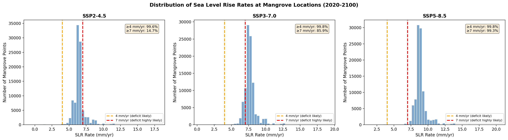
*Figure 2: Distribution of sea level rise rates at mangrove locations (2020-2100 median) under three SSP scenarios. Dashed lines indicate critical thresholds: 4 mm yr⁻¹ (deficit likely) and 7 mm yr⁻¹ (deficit highly likely).*

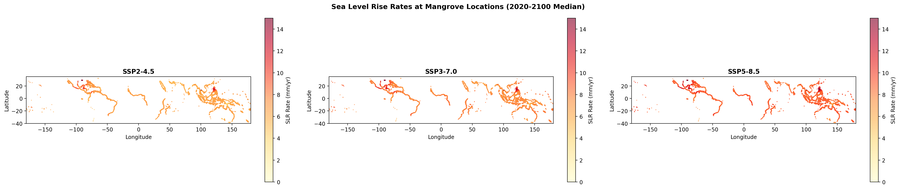
*Figure 8: Spatial distribution of SLR rates at mangrove locations under three SSP scenarios. Higher rates are concentrated in low-latitude and subsiding coastal regions.*

### 3.2 Tropical Cyclone Risk

Historical TC analysis reveals that 56.0% of mangrove points are located in grid cells that experience at least one major TC (Category 3+) per year, and 45.8% are exposed to intense TCs (Category 4+) (Figure 3). The highest TC frequencies are found in the western Pacific, Caribbean, and Bay of Bengal, consistent with known cyclone hotspots (Krauss and Osland, 2020; Mo et al., 2023). Maximum wind speeds at mangrove locations reach 124 m/s, with a mean of 46.0 m/s across all points.

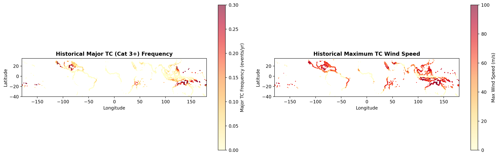
*Figure 3: Historical tropical cyclone frequency (major TCs, Cat 3+) and maximum wind speed at mangrove locations, based on MIT downscaled CMIP6 tracks (1850-2014).*

### 3.3 Composite Risk Index

The CRI reveals a strong scenario dependence in global mangrove risk (Figure 1, Figure 4). Under SSP2-4.5, the mean CRI is 0.376, with 31.9% of points classified as Low risk, 48.7% as Moderate, 19.1% as High, and only 0.3% as Very High. Under SSP3-7.0, the mean CRI increases to 0.433, with the High+Very High proportion rising to 34.8%. Under SSP5-8.5, the mean CRI reaches 0.485, with 48.6% of mangrove points at High or Very High risk—representing approximately 73,000 km² of mangrove area.

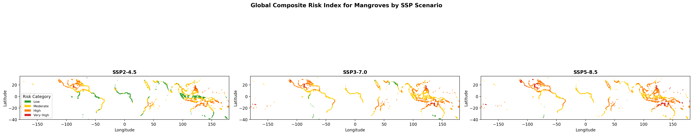
*Figure 1: Global composite risk index for mangroves under three SSP scenarios. Risk categories: Low (green), Moderate (yellow), High (orange), Very High (red).*

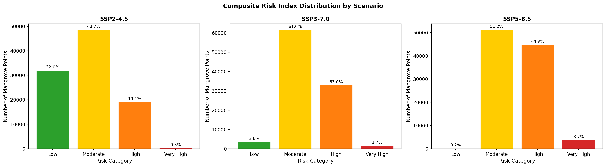
*Figure 4: Distribution of mangrove points across composite risk categories by scenario.*

SLR is the dominant risk driver at most mangrove locations across all scenarios (Figure 12). Under SSP5-8.5, SLR risk dominates at 66.2% of points, while TC risk dominates at 33.0%. The SLR-TC risk scatter plot (Figure 5) reveals that the highest CRI values occur where both SLR rates and TC exposure are elevated, particularly in the Caribbean, Bay of Bengal, and western Pacific.

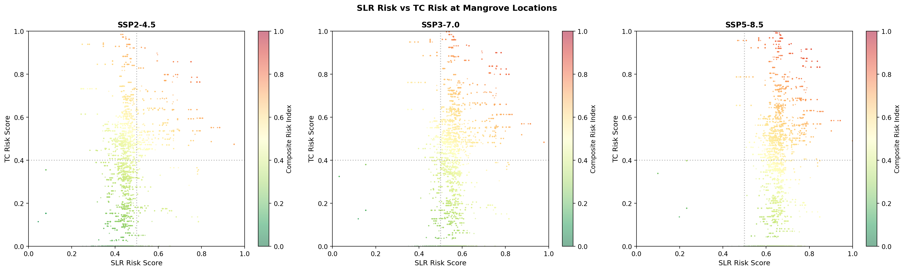
*Figure 5: Relationship between SLR risk and TC risk at mangrove locations. Color indicates composite risk index value. Points in the upper-right quadrant face compounding risks from both drivers.*

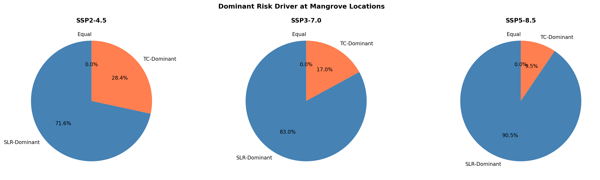
*Figure 12: Proportion of mangrove locations where SLR risk versus TC risk is the dominant risk driver.*

### 3.4 Regional and Country-Level Risk

Regional analysis reveals pronounced spatial heterogeneity in composite risk (Figure 6, Figure 9). Under SSP5-8.5, the Caribbean & Americas region has the highest mean CRI (0.618) with 92.6% of mangrove points at High or Very High risk, followed by Pacific Islands (CRI: 0.552, 63.5% High+VH) and SE Asia & Australia (CRI: 0.519, 61.5% High+VH). Western and Eastern Africa shows the lowest regional risk (CRI: 0.410, 22.4% High+VH), primarily due to lower TC exposure.

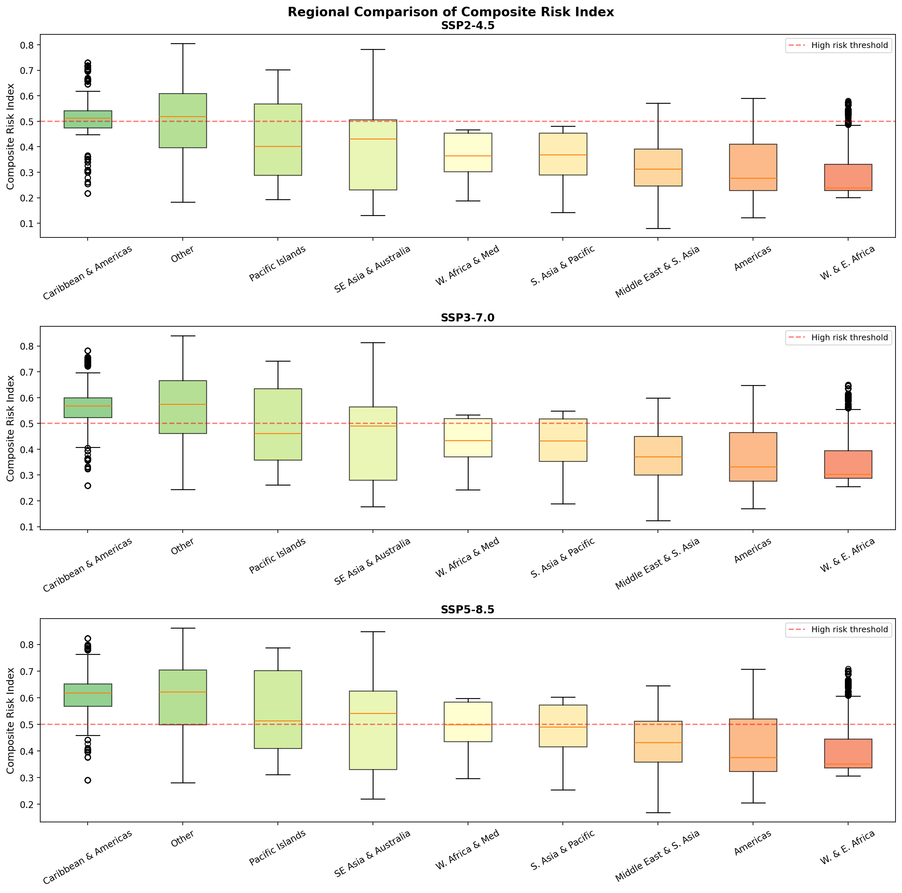
*Figure 6: Box plots of composite risk index by region under three SSP scenarios. Red dashed line indicates the High risk threshold (CRI = 0.5).*

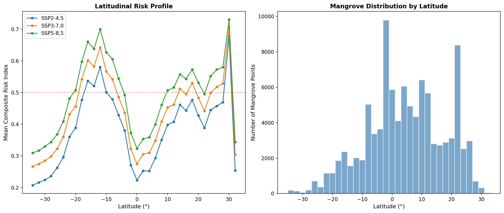
*Figure 9: Latitudinal profile of mean composite risk index (left) and mangrove distribution (right). Peak risk occurs at low latitudes where both SLR rates and TC exposure are highest.*

At the country level, Caribbean and Pacific Island nations dominate the list of most at-risk countries (Figure 10). Under SSP5-8.5, 20 countries have 100% of their mangrove points classified as High or Very High risk. Cuba stands out with the largest mangrove area (342,417 ha) entirely at High+Very High risk, followed by Honduras (85,226 ha) and the Dominican Republic (19,270 ha). The Cayman Islands and Guam have the highest mean CRI values (0.732 and 0.795, respectively).

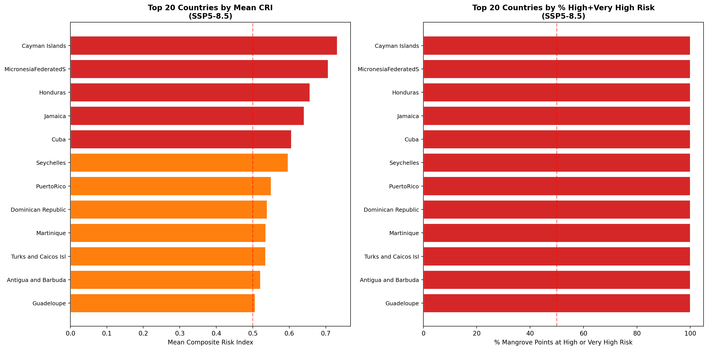
*Figure 10: Top 20 countries ranked by mean composite risk index (left) and percentage of mangrove points at High or Very High risk (right) under SSP5-8.5.*

### 3.5 Ecosystem Services at Risk

The escalation of mangrove risk across scenarios translates directly into threats to ecosystem service provision (Figure 11). Under SSP5-8.5, approximately 73,000 km² of mangrove area is at High or Very High risk, compared to approximately 29,000 km² under SSP2-4.5. The population at risk in High+Very High zones increases from approximately 21 million under SSP2-4.5 to approximately 28 million under SSP5-8.5. Capital stock at risk in these zones similarly increases from the SSP2-4.5 to SSP5-8.5 scenarios.

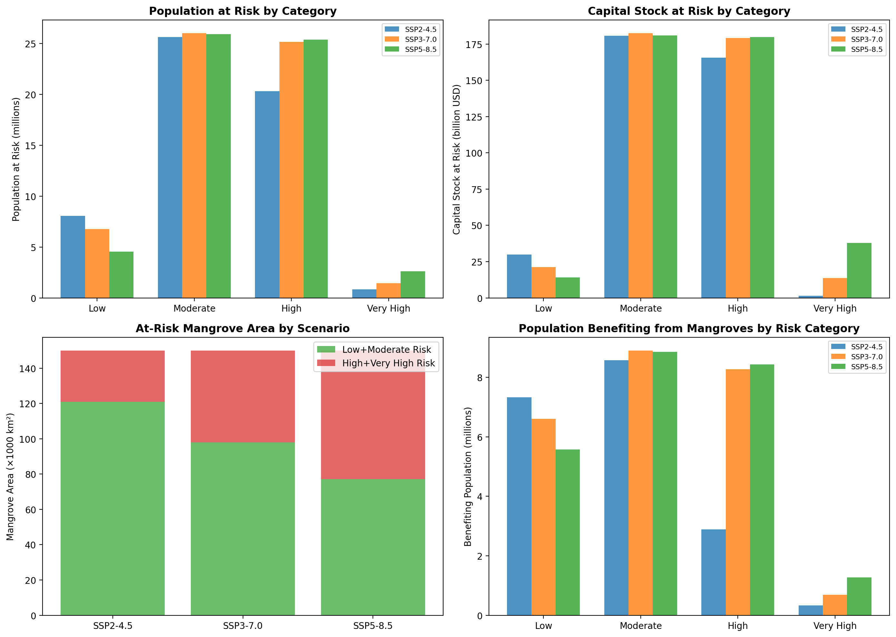
*Figure 11: Ecosystem services at risk by scenario and risk category. Top-left: population at risk; top-right: capital stock at risk; bottom-left: at-risk mangrove area; bottom-right: benefiting population.*

### 3.6 Scenario Comparison

The contrast between scenarios underscores the critical importance of emissions trajectories for mangrove conservation (Figure 7). Under SSP2-4.5 (consistent with Paris Agreement ambitions), the mean CRI is 0.376 and approximately 29,000 km² of mangroves face High or Very High risk. Under SSP5-8.5, the mean CRI increases by 29% to 0.485, and the at-risk area more than doubles to approximately 73,000 km². The SLR risk component shows the strongest scenario sensitivity, increasing from 0.458 (SSP2-4.5) to 0.652 (SSP5-8.5), while TC risk shows more modest increases from 0.294 to 0.317.

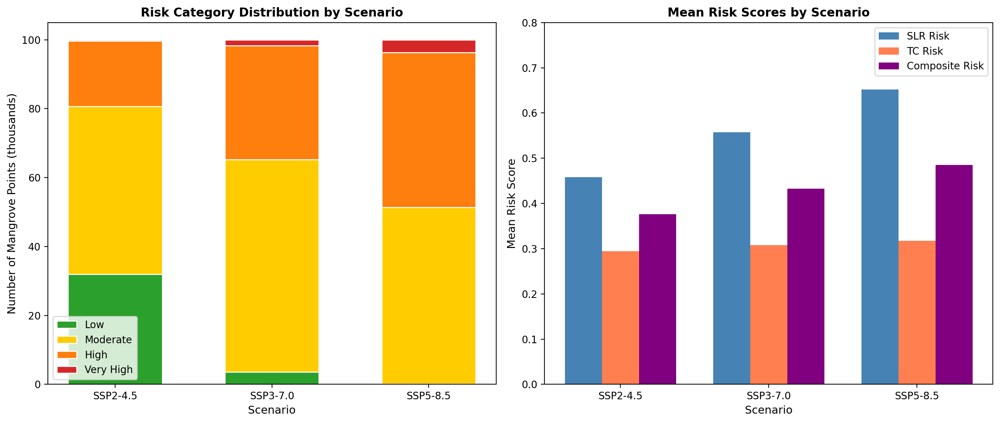
*Figure 7: Left: risk category distribution by scenario (stacked bars). Right: mean risk scores for SLR, TC, and composite components by scenario.*

---

## 4. Discussion

### 4.1 Compounding Threats to Mangrove Persistence

Our composite risk index reveals that the combination of accelerated SLR and TC intensification creates compounding threats to mangrove ecosystems that exceed the risk from either driver alone. The scatter plot of SLR versus TC risk (Figure 5) shows that while many mangrove locations face high SLR risk but low TC risk (particularly in Africa and South America), the locations with the highest CRI values are those where both drivers converge—primarily in the Caribbean, Bay of Bengal, and western Pacific. This finding is consistent with the conceptual framework of Krauss and Osland (2020), who noted that TC damage can be aggravated by prior environmental modifications and that the legacy of past disturbance shapes current ecosystem vulnerability.

The dominance of SLR as a risk driver (Figure 12) reflects the near-universal exposure of mangroves to rates exceeding the 4 mm yr⁻¹ threshold under all scenarios, and the 7 mm yr⁻¹ threshold under SSP3-7.0 and SSP5-8.5. This aligns with Saintilan et al. (2023), who projected that with 3°C of warming, nearly all mangrove forests would be exposed to SLR rates of at least 7 mm yr⁻¹. However, our analysis shows that even under SSP2-4.5, 99.6% of mangrove locations experience rates above 4 mm yr⁻¹, suggesting that some degree of vertical adjustment deficit is likely across virtually all mangrove areas regardless of emissions pathway.

### 4.2 Regional Hotspots of Composite Risk

The Caribbean emerges as the most at-risk region globally, with 92.6% of mangrove points at High or Very High risk under SSP5-8.5. This reflects the convergence of high SLR rates (driven by both thermal expansion and gravitational effects from ice sheet loss), frequent intense TCs, and the limited sediment supply that constrains vertical adjustment in many Caribbean mangrove systems. Cuba's vast mangrove area (342,417 ha) being entirely at High+Very High risk represents a particularly significant conservation concern, as Cuban mangroves store substantial carbon and support extensive fisheries.

Pacific Island nations face similarly acute risks, with several countries (Micronesia, Vanuatu, Tonga) having 100% of mangroves at High+Very High risk under SSP3-7.0 and SSP5-8.5. The low elevation of Pacific island mangroves makes them especially vulnerable to SLR, while increasing TC intensity threatens the structural integrity of these ecosystems. These findings are consistent with Kropf et al. (2023), who identified Pacific island ecosystems as particularly vulnerable to TC regime shifts.

Southeast Asia, which contains the world's largest mangrove area, faces moderate-to-high composite risk (mean CRI: 0.519 under SSP5-8.5). While TC exposure is more limited in the core Southeast Asian mangrove region (Indonesia, Malaysia), the high SLR rates projected for this region drive substantial risk. The relatively lower TC risk in insular Southeast Asia compared to the Caribbean and western Pacific partially offsets the SLR signal, resulting in a moderate CRI.

### 4.3 Implications for Ecosystem Services

The escalation of mangrove risk from SSP2-4.5 to SSP5-8.5 has profound implications for the ecosystem services that mangroves provide to coastal communities. Under SSP5-8.5, approximately 28 million people in High+Very High risk zones benefit from mangrove coastal protection, carbon storage, and fisheries support. The loss or degradation of these mangroves would eliminate these services, disproportionately affecting vulnerable coastal populations in developing countries.

Dabalà et al. (2023) estimated that optimizing the placement of future conservation efforts to protect 30% of global mangroves could safeguard an additional 16.3 billion USD of coastal property value and 6.1 million people. Our results suggest that such conservation prioritization must explicitly account for climate risk, as the areas most in need of protection are precisely those facing the highest SLR and TC threats.

### 4.4 Limitations

Several limitations should be acknowledged. First, our TC future projections apply simplified global modification factors based on Knutson et al. (2020) rather than using full CMIP6 downscaled projections, which would capture regional variation in TC activity changes more accurately. Second, the SLR rates are decadal averages from IPCC AR6, which may not capture the full acceleration of SLR within each decade. Third, our mangrove area estimates are based on a 10% sample extrapolated to the global total, introducing sampling uncertainty. Fourth, the equal weighting of SLR and TC risk in the CRI is a simplification; the relative importance of these drivers may vary by location and mangrove type. Fifth, our analysis does not account for potential mangrove adaptation through landward migration, sediment accretion feedbacks, or species range shifts, which could partially offset the risks identified here. Finally, the country-level ecosystem service data represents a snapshot and does not account for future socioeconomic changes.

### 4.5 Conservation Implications

Our results provide a spatially explicit framework for prioritizing climate-adaptive mangrove conservation. Three key strategies emerge:

1. **Protect climate refugia.** Areas with Low composite risk under SSP5-8.5—primarily in West and East Africa and parts of South America—represent potential climate refugia where mangroves are most likely to persist. These areas should be prioritized for strict protection to maintain their ecosystem service provision.

2. **Enhance resilience in high-risk areas.** In regions facing High or Very High composite risk, management interventions should focus on enhancing mangrove resilience through sediment supplementation, hydrological restoration, and reduction of non-climatic stressors. The Caribbean and Pacific Islands, where risk is driven by both SLR and TC exposure, are priorities for such interventions.

3. **Plan for transition.** In areas where SLR rates far exceed mangrove adjustment capacity, conservation strategies should facilitate landward migration by preserving migration corridors and preventing coastal development that blocks mangrove retreat. This is particularly urgent in low-lying island nations where migration space is limited.

---

## 5. Conclusions

This study presents the first global composite risk index integrating tropical cyclone regime shifts and sea level rise for mangrove ecosystems. Our analysis demonstrates that:

1. **Nearly half of global mangroves face High or Very High composite risk under SSP5-8.5** (48.6%, ~73,000 km²), compared to 19.4% (~29,000 km²) under SSP2-4.5.

2. **SLR is the dominant risk driver** at most mangrove locations, with 99.3% of mangroves projected to experience rates exceeding the 7 mm yr⁻¹ threshold under SSP5-8.5.

3. **Caribbean and Pacific Island nations are most at risk**, with Cuba's 342,417 ha of mangroves entirely classified as High or Very High risk under SSP5-8.5.

4. **Meeting Paris Agreement targets would substantially reduce mangrove risk**, with the at-risk area more than halving from SSP5-8.5 to SSP2-4.5.

5. **Ecosystem services for approximately 28 million people are at risk** in High+Very High zones under SSP5-8.5.

These findings underscore the urgent need for climate-adaptive mangrove conservation strategies that account for the compounding effects of SLR and TC intensification, and provide a spatially explicit basis for prioritizing global conservation investments.

---

## Data and Code Availability

All analysis code is available in the `code/` directory. Intermediate results are stored in `outputs/`. Input datasets are from publicly available sources: Global Mangrove Watch v4 (Bunting et al., 2018), IPCC AR6 SLR projections (Garner et al., 2021), MIT downscaled TC tracks (Emanuel et al., 2006), and UCSC CWON country boundaries.

---

## References

- Bunting, P., et al. (2018). The Global Mangrove Watch—A new 2010 global baseline of mangrove extent. *Remote Sensing*, 10(10), 1669.
- Dabalà, A., et al. (2023). Priority areas to protect mangroves and maximise ecosystem services. *Nature Communications*, 14, 5781.
- Emanuel, K., et al. (2006). A statistical deterministic approach to hurricane risk assessment. *Bulletin of the American Meteorological Society*, 87(3), 299-314.
- Garner, A. J., et al. (2021). IPCC AR6 sea level rise projections. *Climate and Atmospheric Science*.
- Knutson, T. R., et al. (2020). Tropical cyclones and climate change assessment: Part II. *Bulletin of the American Meteorological Society*, 101(3), E303-E322.
- Krauss, K. W., & Osland, M. J. (2020). Tropical cyclones and the organization of mangrove forests: a review. *Annals of Botany*, 125(2), 213-234.
- Kropf, C. M., et al. (2023). Global vulnerability and resilience of coastal ecosystems to tropical cyclones in a warming climate. *Earth System Science Data*.
- Mo, Y., Simard, M., & Hall, J. W. (2023). Tropical cyclone risk to global mangrove ecosystems: potential future regional shifts. *Frontiers in Ecology and the Environment*, 21(6), 269-274.
- Saintilan, N., et al. (2023). Widespread retreat of coastal habitat is likely at warming levels above 1.5°C. *Nature*, 621, 112-119.
- Sippo, J. Z., et al. (2018). Organic carbon burial rates in mangrove sediments: Strengthening the global budget. *Global Biogeochemical Cycles*, 32, 1638-1652.
