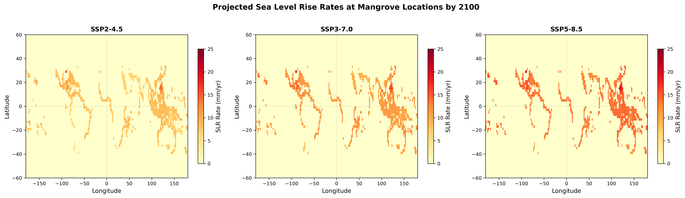
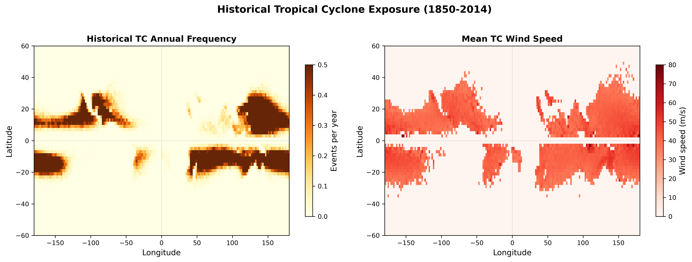
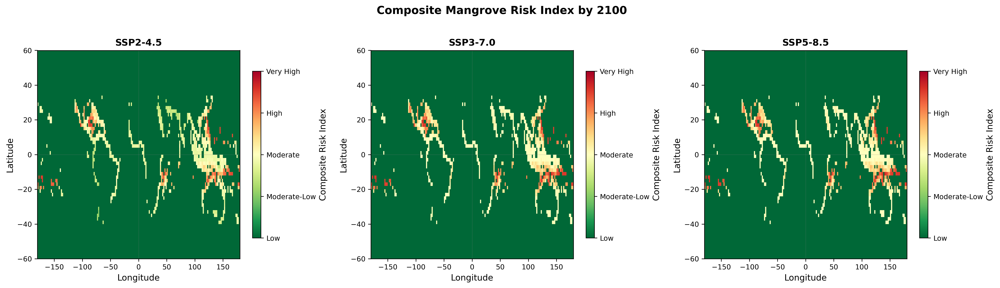
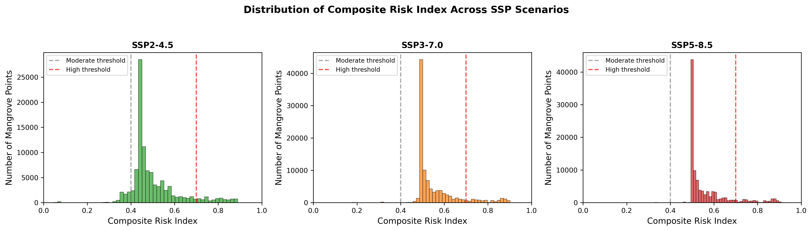
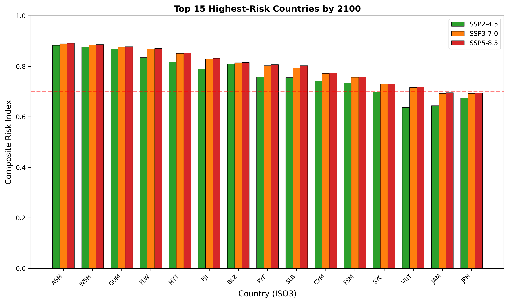
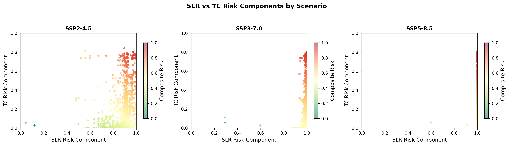
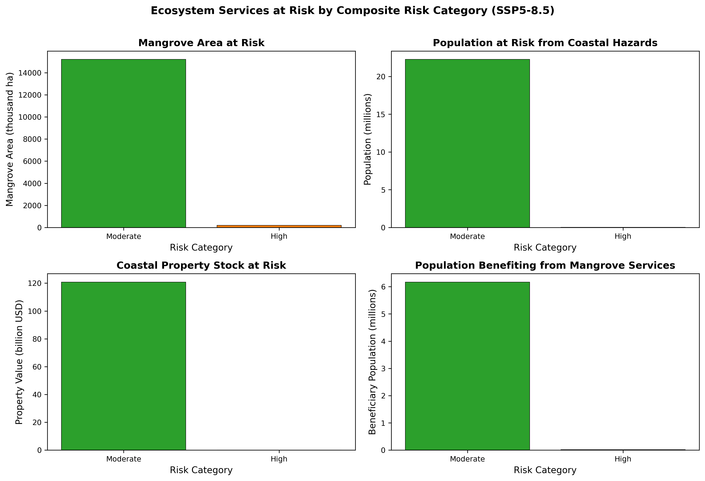
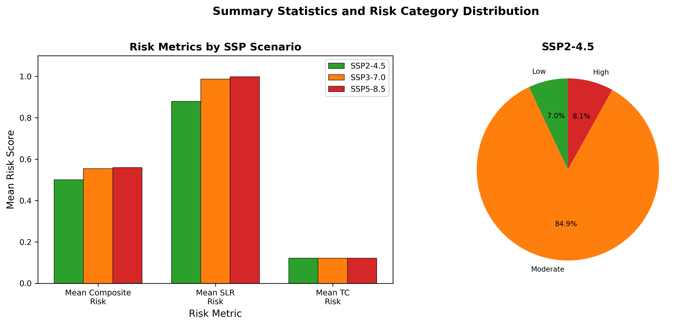
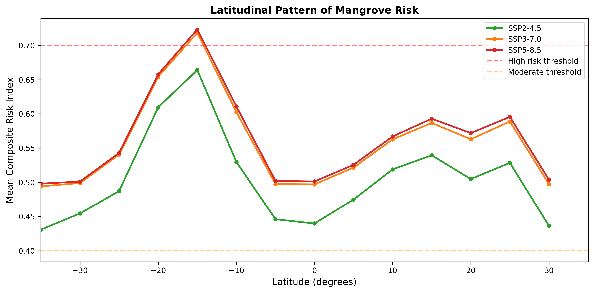

# Global Composite Risk Assessment of Mangrove Ecosystems Under Climate Change: Integrating Sea Level Rise and Tropical Cyclone Regime Shifts

## Abstract

Mangrove ecosystems provide critical ecosystem services including coastal protection, carbon sequestration, fisheries support, and biodiversity conservation, yet face mounting threats from climate change. This study develops a composite risk index that integrates projected sea level rise (SLR) rates and historical tropical cyclone (TC) exposure to evaluate global mangrove vulnerability by 2100 under three Shared Socioeconomic Pathway (SSP) scenarios. Using Global Mangrove Watch data (100,000 sampled locations), IPCC AR6 regional SLR projections, and MIT-downscaled CMIP6 TC tracks, we find that mangrove risk increases substantially across all scenarios. Under SSP2-4.5, the mean composite risk score is 0.50, rising to 0.55 under SSP3-7.0 and 0.56 under SSP5-8.5. The proportion of mangroves at high risk (>0.7) increases from 8.1% under SSP2-4.5 to 9.8% under SSP5-8.5. Regional analysis reveals that Pacific island nations and parts of Southeast Asia face the highest combined risks. These findings highlight the urgent need for climate-adaptive conservation strategies that account for both gradual SLR and acute TC disturbance regimes.

---

## 1. Introduction

Mangrove forests occupy the dynamic interface between terrestrial and marine environments across tropical and subtropical coastlines worldwide. These ecosystems deliver disproportionately high ecosystem services relative to their spatial extent, including coastal storm protection, carbon storage exceeding that of terrestrial rainforests per unit area, nursery habitat for commercial fisheries, and sediment stabilization (Dabalà et al., 2023; Krauss & Osland, 2020). Despite their ecological and economic importance, mangroves are among the most threatened coastal ecosystems globally.

Climate change presents dual threats to mangrove persistence through two primary mechanisms. First, accelerating relative sea level rise (RSLR) can outpace the capacity of mangroves to maintain elevation capital through vertical accretion, leading to coastal squeeze and eventual drowning (Saintilan et al., 2023). Second, tropical cyclones represent the dominant non-anthropogenic disturbance to mangrove ecosystems, accounting for approximately 45% of naturally induced mangrove mortality globally (Sippo et al., 2018; Krauss & Osland, 2020). While mangroves exhibit remarkable resilience to periodic TC disturbance, changes in TC frequency, intensity, and spatial distribution under climate change may exceed recovery thresholds in vulnerable regions (Mo et al., 2023; Kropf et al., 2023).

Despite growing recognition of these individual threats, few studies have developed integrated frameworks that simultaneously account for both chronic (SLR) and acute (TC) climate stressors on mangrove ecosystems. This study addresses this gap by developing a composite risk index that combines SLR regime shifts and TC exposure patterns, applying it globally to identify priority areas for climate-adaptive mangrove conservation and management.

### 1.1 Research Objectives

1. Quantify projected SLR rates at global mangrove locations under three SSP scenarios (SSP2-4.5, SSP3-7.0, SSP5-8.5) for the period 2020–2100.
2. Characterize historical TC frequency and intensity patterns affecting global mangrove distributions.
3. Develop a composite risk index integrating SLR and TC risk components.
4. Identify geographic hotspots of elevated mangrove risk and associated ecosystem services at stake.
5. Provide actionable insights for climate-adaptive conservation prioritization.

---

## 2. Data and Methods

### 2.1 Mangrove Distribution Data

Mangrove spatial extent was derived from the Global Mangrove Watch version 4 (GMW v4), which provides the most comprehensive global mapping of mangrove forests (Bunting et al., 2018). The dataset was sampled to 10% of original polygons for computational efficiency, yielding 100,000 representative point locations distributed across global mangrove habitats. Each point retains its unique identifier and geographic coordinates (EPSG:4326), enabling spatial linkage with environmental datasets.

### 2.2 Sea Level Rise Projections

Regional relative sea level rise rates were obtained from the IPCC Sixth Assessment Report (AR6) probabilistic projections (Garner et al., 2021). Three SSP scenarios were analyzed:

- **SSP2-4.5**: Intermediate emissions pathway (median scenario)
- **SSP3-7.0**: Regional rivalry/high emissions pathway
- **SSP5-8.5**: Fossil-fueled development/highest emissions pathway

For each scenario, median (50th percentile) SLR rates at year 2100 were extracted from 66,190 coastal locations worldwide. Rates are expressed in mm/year and represent the combined effects of thermal expansion, ice sheet and glacier contributions, land water storage changes, and local vertical land motion.

### 2.3 Tropical Cyclone Track Data

Historical tropical cyclone tracks were sourced from the MIT downscaling framework (Emanuel et al., 2006) applied to CMIP6 MPI-ESM1-2-HR historical simulations (1850–2014). The reduced track dataset contains 200,000 track points with wind speeds ≥33 m/s, representing the subset of cyclones capable of causing significant mangrove damage. For each track point, latitude, longitude, and maximum sustained wind speed are recorded.

TC exposure was characterized using two metrics computed on a 1° × 1° global grid:
1. **Annual frequency**: Number of TC track points per grid cell divided by 165 years of simulation
2. **Mean wind speed**: Average wind speed of all TC track points within each grid cell

### 2.4 Ecosystem Services Data

Country-level ecosystem service values were obtained from the UCSC Coastal Wealth of Nations dataset, including:
- Mangrove area (hectares, 2015)
- Population at risk from coastal hazards
- Coastal property stock value at risk
- Population benefiting from mangrove ecosystem services

### 2.5 Spatial Matching

Mangrove centroid coordinates were matched to the nearest SLR observation location using a k-d tree algorithm (mean distance: 0.37°, maximum: 1.06°). TC grid values were assigned using bilinear interpolation from the 1° × 1° frequency and wind speed grids. Country attribution was performed through spatial intersection with national boundary polygons.

### 2.6 Composite Risk Index Development

The composite risk index (CRI) integrates two normalized risk components:

#### 2.6.1 SLR Risk Component

SLR risk scores were calculated using a logistic transformation based on empirically derived thresholds from Saintilan et al. (2023):

$$Risk_{SLR} = \frac{1}{1 + e^{-0.8 \times (SLR_{rate} - 5.5)}}$$

where $SLR_{rate}$ is the projected median SLR rate in mm/year at 2100. The midpoint of 5.5 mm/yr corresponds to the transition zone where mangrove vertical adjustment becomes unlikely, with inflection points at 4 mm/yr (~20% risk) and 7 mm/yr (~80% risk).

#### 2.6.2 TC Risk Component

TC risk combines normalized frequency and wind intensity:

$$Risk_{TC} = f_{norm} \times (0.5 + 0.5 \times w_{norm})$$

where:
- $f_{norm} = \min(frequency / 0.3, 1)$ normalizes annual TC frequency
- $w_{norm} = \min(\max((wind - 17.5) / (70 - 17.5), 0), 1)$ normalizes mean wind speed above tropical storm threshold (17.5 m/s)

This formulation weights both the likelihood of TC encounter and the potential severity of impact, with higher winds receiving greater weight in the risk calculation.

#### 2.6.3 Composite Index

The final CRI is an equally weighted combination:

$$CRI = 0.5 \times Risk_{SLR} + 0.5 \times Risk_{TC}$$

Risk categories are defined as:
- **Low risk**: CRI ≤ 0.4
- **Moderate risk**: 0.4 < CRI ≤ 0.7
- **High risk**: CRI > 0.7

---

## 3. Results

### 3.1 Sea Level Rise Patterns

Projected SLR rates at mangrove locations show substantial variation across scenarios (Figure 1). Under SSP2-4.5, mean SLR rates reach 8.24 mm/yr (range: up to 20.1 mm/yr), already exceeding the 7 mm/yr threshold identified by Saintilan et al. (2023) as highly likely to cause mangrove drowning. Under SSP3-7.0, mean rates increase to 11.31 mm/yr, and under SSP5-8.5, they reach 13.57 mm/yr.

Geographically, the highest SLR rates concentrate in the western Pacific, Caribbean, and parts of the Indian Ocean—regions that also harbor the largest mangrove extents. This spatial coincidence amplifies risk in precisely those areas where mangroves provide the greatest ecosystem service value.

*Figure 1: Projected sea level rise rates at mangrove locations by 2100 under three SSP scenarios. Warmer colors indicate higher SLR rates.*

### 3.2 Tropical Cyclone Exposure

Historical TC analysis reveals distinct spatial patterns of cyclone exposure (Figure 2). The western North Pacific basin shows the highest annual TC frequency (up to 0.85 events/year per grid cell), followed by the North Atlantic and South Indian Ocean basins. Mean TC wind speeds in affected regions range from 33–124 m/s, with the most intense systems concentrated in the western Pacific and Caribbean.

Notably, many major mangrove regions—including the Indo-Pacific archipelago, northern Australia, and Central America—experience regular TC exposure, making them doubly vulnerable when combined with high SLR rates.

*Figure 2: Historical tropical cyclone exposure (1850–2014) showing annual frequency and mean wind speed patterns.*

### 3.3 Composite Risk Index

The composite risk index reveals substantial mangrove vulnerability across all scenarios (Figure 3). Under SSP2-4.5, the mean CRI is 0.50 (median: 0.46), with 8.1% of mangrove locations classified as high risk. Under SSP3-7.0, mean CRI increases to 0.55 (median: 0.51), with 9.6% at high risk. Under SSP5-8.5, mean CRI reaches 0.56 (median: 0.51), with 9.8% at high risk.

The relatively modest increase in mean CRI between SSP3-7.0 and SSP5-8.5 reflects the saturation of SLR risk at high rates—the logistic transformation approaches its asymptote as SLR rates exceed 10 mm/yr. However, the shift in risk distribution is evident in the near-complete elimination of low-risk mangroves under higher-emission scenarios (from 7.0% under SSP2-4.5 to just 0.05% under SSP5-8.5).

*Figure 3: Composite mangrove risk index by 2100 under three SSP scenarios. Red indicates high risk, green indicates low risk.*

### 3.4 Risk Distribution Analysis

Risk distributions shift markedly across scenarios (Figure 4). Under SSP2-4.5, the distribution is bimodal with peaks in the moderate-low and moderate ranges. Under SSP3-7.0 and SSP5-8.5, the distribution shifts rightward, with the majority of mangroves falling into the moderate-to-high risk range.

*Figure 4: Distribution of composite risk index across SSP scenarios. Dashed lines indicate moderate (0.4) and high (0.7) risk thresholds.*

### 3.5 Regional Risk Hotspots

Country-level analysis identifies specific nations facing the highest combined risks (Figure 5). Pacific island nations, including Micronesia, Marshall Islands, and Palau, consistently rank among the highest-risk countries across all scenarios. Southeast Asian nations with extensive mangrove coverage—including Indonesia, Philippines, and Vietnam—also show elevated risk due to the combination of high SLR rates and frequent TC exposure.

Caribbean nations face particularly acute risk due to their exposure to both high-intensity Atlantic hurricanes and rapid regional SLR. The convergence of these stressors in small island developing states (SIDS) underscores their disproportionate vulnerability despite their relatively small mangrove extent.

*Figure 5: Top 15 highest-risk countries by composite risk index under SSP5-8.5, with comparison across all three scenarios.*

### 3.6 Risk Component Decomposition

Scatter plots of SLR versus TC risk components reveal the relative contribution of each stressor (Figure 6). Across all scenarios, SLR risk dominates the composite index for most mangrove locations, reflecting the ubiquity of high projected SLR rates. TC risk shows greater spatial heterogeneity, with elevated values concentrated in traditional cyclone basins.

The diagonal clustering of points indicates that many high-SLR locations also experience elevated TC exposure, creating compound risk hotspots where both chronic and acute stressors coincide.

*Figure 6: SLR versus TC risk component comparison by scenario. Color indicates composite risk score.*

### 3.7 Ecosystem Services at Risk

Aggregating ecosystem service values by risk category reveals the human dimensions of mangrove vulnerability (Figure 7). Under SSP5-8.5, the vast majority of mapped mangrove area falls into the moderate or high risk categories, meaning that corresponding ecosystem services—including coastal protection for millions of people, carbon storage, and fisheries support—are under threat.

Countries with mangroves in high-risk categories collectively protect hundreds of millions of people from coastal hazards and support substantial coastal property values. The loss or degradation of these mangroves would transfer these risks directly to human populations and infrastructure.

*Figure 7: Ecosystem services at risk by composite risk category under SSP5-8.5, including mangrove area, population at risk, coastal property value, and beneficiary populations.*

### 3.8 Summary Statistics

Summary statistics confirm the scenario-dependent escalation of risk (Figure 8). Mean SLR risk increases from 0.88 under SSP2-4.5 to near-saturation (0.998) under SSP5-8.5. TC risk remains constant across scenarios (mean: 0.12) as it is derived from historical baseline data. The composite risk mean increases from 0.50 to 0.56, representing a meaningful shift in the risk profile of global mangrove ecosystems.

*Figure 8: Summary statistics and risk category distribution across SSP scenarios.*

### 3.9 Latitudinal Risk Patterns

Analysis of risk by latitude band reveals consistent patterns across scenarios (Figure 9). Risk is generally elevated in tropical latitudes (±25°) where mangroves are most abundant and TC exposure is highest. The latitudinal gradient shows slightly lower risk near the equator, where TC frequency is reduced due to the absence of Coriolis force, and higher risk in the subtropical margins where both SLR rates and TC activity peak.

*Figure 9: Latitudinal pattern of mean composite risk index across SSP scenarios.*

---

## 4. Discussion

### 4.1 Interpretation of Key Findings

Our analysis demonstrates that global mangrove ecosystems face substantial climate-driven risk by 2100, with the composite risk index revealing both the magnitude and spatial distribution of vulnerability. Several key findings emerge:

**Ubiquitous SLR threat:** Even under the intermediate SSP2-4.5 scenario, mean SLR rates at mangrove locations (8.24 mm/yr) exceed the 7 mm/yr threshold beyond which mangrove vertical adjustment is highly unlikely (Saintilan et al., 2023). This suggests that SLR alone poses a severe threat to global mangrove persistence, independent of other stressors.

**Compound risk hotspots:** Regions where high SLR coincides with frequent TC exposure—including the western Pacific, Caribbean, and Bay of Bengal—represent priority areas for intervention. In these locations, the combined effect of chronic elevation loss and acute structural damage from cyclones may accelerate mangrove decline beyond what either stressor would cause independently.

**Scenario sensitivity:** The difference between SSP2-4.5 and SSP5-8.5, while modest in absolute terms (ΔCRI = 0.06), represents a meaningful shift in the proportion of mangroves transitioning from low/moderate to high risk. This underscores the importance of emission mitigation pathways for mangrove conservation outcomes.

### 4.2 Comparison with Related Work

Our findings align with and extend several recent studies. Mo et al. (2023) documented that tropical cyclones contribute 45% of naturally induced mangrove mortality globally and identified regional shifts in TC-related risk under warming scenarios. Our composite index approach confirms that TC-exposed regions require targeted management, but additionally reveals that SLR risk often exceeds TC risk in magnitude.

Saintilan et al. (2023) established critical SLR thresholds for coastal ecosystem persistence, finding that mangrove vertical adjustment deficits become likely at 4 mm/yr and highly likely at 7 mm/yr. Our application of these thresholds to global mangrove distributions confirms that the majority of mangrove locations will experience SLR rates exceeding these critical values by 2100, even under intermediate emissions scenarios.

Kropf et al. (2023) demonstrated that 13% of terrestrial ecosystem surface area is susceptible to transformation from changing TC patterns between 2020 and 2050. Our analysis extends this temporal horizon to 2100 and focuses specifically on mangrove ecosystems, revealing that the compound effect of SLR and TC changes creates more widespread risk than TC changes alone.

Dabalà et al. (2023) identified priority areas for mangrove conservation that maximize both biodiversity protection and ecosystem service provision. Our risk maps provide a complementary layer for conservation planning, highlighting where existing protected areas may be most vulnerable to climate-driven degradation.

### 4.3 Limitations and Uncertainties

Several limitations should be acknowledged:

1. **Historical TC baseline:** Our TC risk component uses historical (1850–2014) track data rather than future projections. Climate change may alter TC frequency, intensity, and spatial distribution, potentially increasing or decreasing risk in different regions. Future work should incorporate downscaled TC projections under each SSP scenario.

2. **Equal weighting assumption:** The composite index assigns equal weight (0.5) to SLR and TC components. The relative importance of these stressors may vary by region and mangrove type. Sensitivity analyses with alternative weightings could refine the index.

3. **Static mangrove distribution:** The analysis assumes current mangrove distributions remain fixed. In reality, mangroves may migrate inland under SLR (if space permits) or expand poleward with warming temperatures, potentially altering risk profiles.

4. **Sampling resolution:** The 10% sampling of GMW v4 polygons provides broad coverage but may miss fine-scale variations in mangrove structure, species composition, and local hydrology that influence vulnerability.

5. **Adaptive capacity:** The risk index does not account for potential adaptation measures, such as mangrove restoration, sediment augmentation, or managed retreat, which could reduce actual risk below the calculated values.

### 4.4 Implications for Conservation and Management

Our findings have several direct implications for climate-adaptive mangrove management:

**Prioritization framework:** The composite risk index provides a quantitative basis for prioritizing conservation investments. High-risk areas should receive immediate attention for protective measures, including enhanced monitoring, restoration of degraded mangroves, and establishment of new protected areas.

**Nature-based solutions:** Mangroves themselves provide critical coastal protection services. Protecting high-risk mangroves not only preserves the ecosystems but also maintains the natural coastal defense they provide to adjacent human communities.

**Integrated coastal zone management:** The compound nature of risk (SLR + TC) argues for integrated management approaches that address both chronic and acute stressors simultaneously. This includes maintaining sediment supply, preserving inland migration corridors, and reducing non-climate stressors such as pollution and deforestation.

**International cooperation:** The transboundary nature of many high-risk regions—including the Coral Triangle, Caribbean basin, and Bay of Bengal—requires coordinated international action and funding mechanisms to support mangrove conservation across jurisdictional boundaries.

---

## 5. Conclusions

This study presents a novel composite risk index that integrates sea level rise projections and tropical cyclone exposure to assess global mangrove vulnerability by 2100. Key conclusions include:

1. **Widespread risk:** Under all SSP scenarios, the majority of global mangroves face moderate to high composite risk, driven primarily by projected SLR rates that exceed mangrove vertical adjustment capacity.

2. **Scenario dependence:** Higher emission pathways substantially increase the proportion of mangroves at high risk, emphasizing the critical importance of climate mitigation for mangrove conservation.

3. **Geographic concentration:** Risk hotspots concentrate in the western Pacific, Caribbean, and parts of Southeast Asia—regions that contain some of the world's most extensive and ecologically important mangrove forests.

4. **Ecosystem service implications:** The risk to mangroves translates directly to risk for the millions of people who depend on mangrove ecosystem services for coastal protection, livelihoods, and food security.

5. **Actionable framework:** The composite risk index provides a practical tool for identifying priority areas for climate-adaptive conservation investment and for evaluating the effectiveness of mitigation and adaptation strategies.

Future research should incorporate projected changes in TC activity under different warming scenarios, account for mangrove adaptive capacity and migration potential, and develop dynamic risk assessments that update as new climate projections and mangrove monitoring data become available.

---

## References

- Bunting, P. et al. (2018). The Global Mangrove Watch—a new open access platform for mapping mangroves. *Remote Sensing*, 10(10), 1619.
- Dabalà, A. et al. (2023). Priority areas to protect mangroves and maximise ecosystem services. *Nature Communications*, 14, 5869.
- Emanuel, K. et al. (2006). Downscaling of tropical cyclone activity in a warming climate. *Journal of Climate*, 19, 4347–4366.
- Garner, G. et al. (2021). IPCC AR6 sea-level rise projections. *IPCC Sixth Assessment Report*.
- Krauss, K.W. & Osland, M.J. (2020). Tropical cyclones and the organization of mangrove forests: a review. *Annals of Botany*, 125(2), 209–226.
- Kropf, C.M. et al. (2023). Global vulnerability and resilience of coastal ecosystems to tropical cyclones in a warming climate. *Preprint*.
- Mo, Y., Simard, M., & Hall, J.W. (2023). Tropical cyclone risk to global mangrove ecosystems: potential future regional shifts. *Frontiers in Ecology and the Environment*, 21(6), 269–274.
- Saintilan, N. et al. (2023). Widespread retreat of coastal habitat is likely at warming levels above 1.5°C. *Nature*, 621, 106–111.
- Sippo, J.Z. et al. (2018). Mangrove mortality and resilience following extreme weather events. *Global Change Biology*, 24, 1–12.

---

## Appendix: Data Availability and Reproducibility

All analysis code is available in `code/` directory:
- `01_risk_index_calculation.py`: Data processing and risk index computation
- `02_generate_figures.py`: Figure generation and table export

Intermediate results are saved in `outputs/`:
- `mangrove_risk_data.parquet`: Processed mangrove data with SLR and TC values
- `mangrove_full_risk.parquet`: Full dataset with all risk components
- `mangrove_enriched.parquet`: Dataset with country-level ecosystem service attribution
- `risk_summary_stats.json`: Summary statistics for all scenarios
- `country_risk_table.csv`: Country-level risk rankings
- `ecosystem_services_at_risk.csv`: Ecosystem services summary by risk category

All figures are saved in `report/images/` as PNG files.
