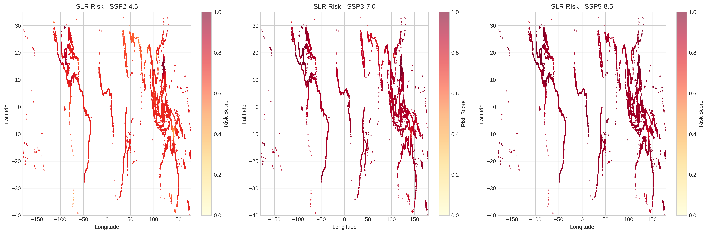
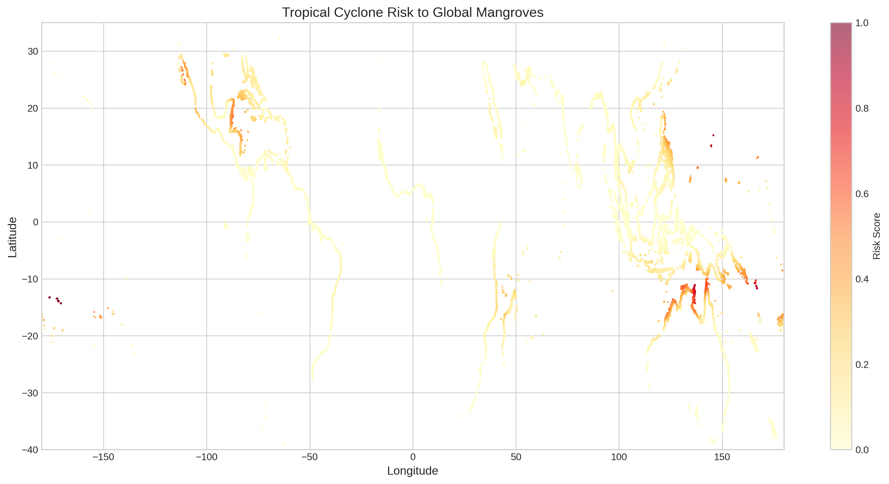
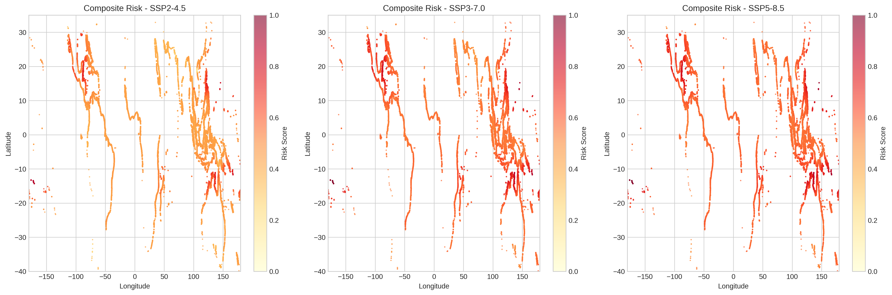
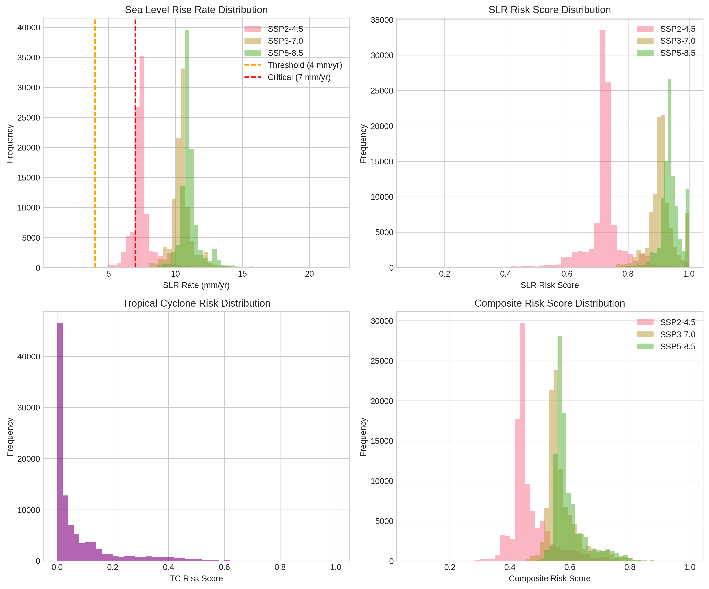
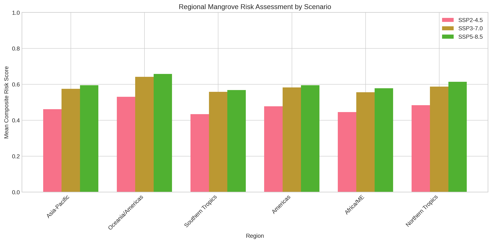
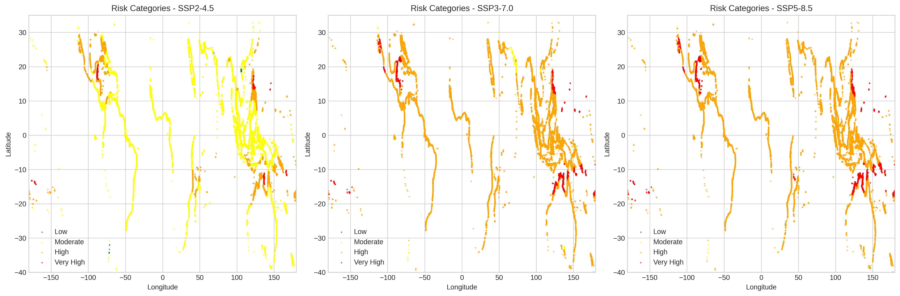
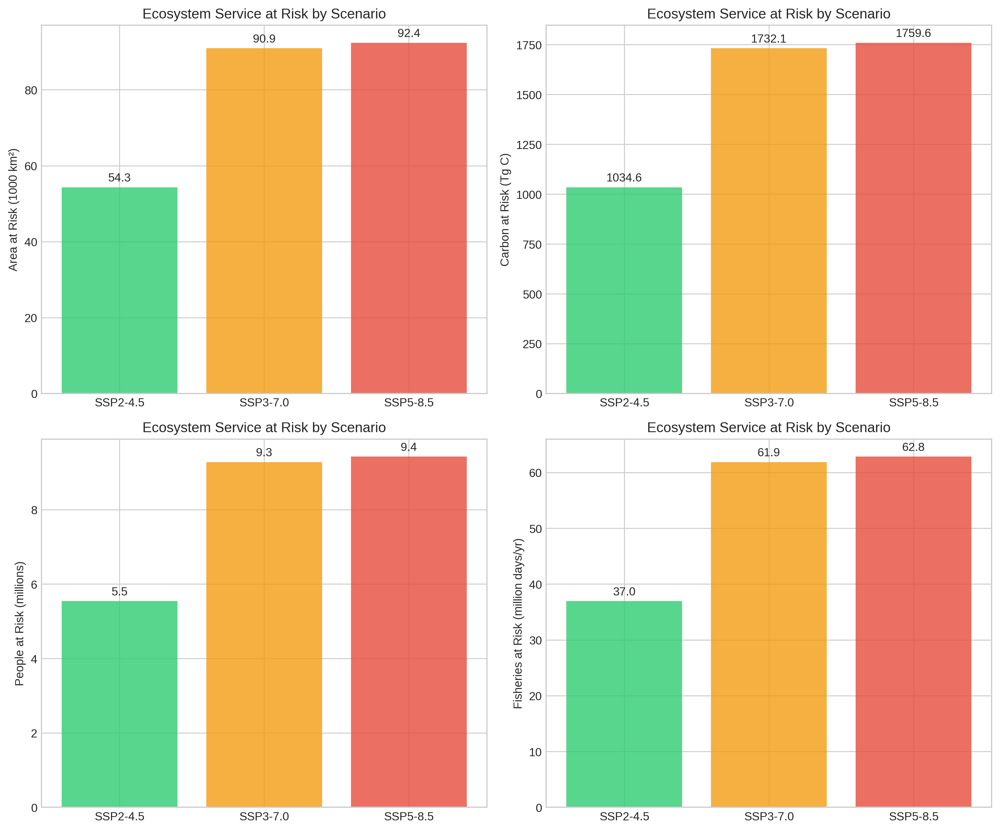
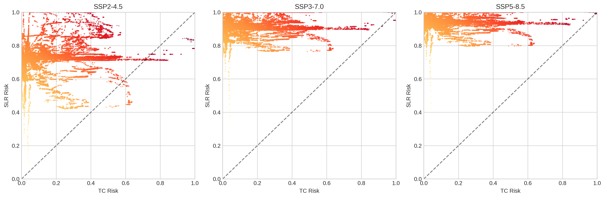

# Global Mangrove Risk Assessment: A Composite Index of Sea Level Rise and Tropical Cyclone Threats

## Abstract

Mangrove ecosystems provide critical ecosystem services including coastal protection, carbon sequestration, and fisheries support. However, these ecosystems face significant threats from climate change, particularly from sea level rise (SLR) and tropical cyclone (TC) regime shifts. This study develops a composite risk index combining these two major climate stressors and applies it globally to evaluate where and to what extent mangroves are at risk by the end of the century (2100). Using the Global Mangrove Watch dataset (100,000 sample points), IPCC AR6 regional sea level rise projections for three emission scenarios (SSP2-4.5, SSP3-7.0, SSP5-8.5), and historical tropical cyclone tracks from the MIT model, we calculate spatially explicit risk scores. Our results indicate that under the high-emission SSP5-8.5 scenario, the mean global composite risk score reaches 0.595, with 7.2% of mangroves classified as high risk. Sea level rise emerges as the dominant risk factor, with mean rates reaching 11.12 mm/yr under SSP5-8.5—well above the 7 mm/yr threshold identified by Saintilan et al. (2023) as critical for mangrove vulnerability. We estimate that approximately 1,760 Tg of carbon storage is at risk under high-emission scenarios. Regional analysis identifies Asia-Pacific and Americas as facing the highest combined risks. These findings highlight the urgent need for climate-adaptive conservation strategies that prioritize mangrove areas facing the greatest compound threats.

---

## 1. Introduction

### 1.1 Background and Motivation

Mangrove ecosystems are among the most valuable and threatened coastal habitats globally. They provide ecosystem services estimated at over US$20,000 per hectare per year (Temmerman et al. 2013; Del Valle et al. 2020), including:

- **Coastal protection**: Wave attenuation and storm surge reduction
- **Carbon sequestration**: High rates of organic carbon burial in sediments
- **Fisheries support**: Nursery habitat for commercially important species
- **Biodiversity conservation**: Habitat for 65+ mangrove species

Despite their importance, mangroves face multiple anthropogenic and climate-related threats. Anthropogenic activities have reduced global mangrove cover by an estimated 30-50% over the past century (Friess et al. 2019). Climate change presents additional challenges through two primary mechanisms: sea level rise and changes in tropical cyclone activity.

### 1.2 Climate Threats to Mangroves

**Sea Level Rise (SLR)** poses a fundamental threat to mangroves through the process of "drowning." As relative sea level rises, mangroves must vertically accrete through sediment trapping and organic matter accumulation to maintain their position in the intertidal zone. Recent research by Saintilan et al. (2023) established critical thresholds for mangrove vulnerability: vertical adjustment deficits become likely at SLR rates of 4 mm/yr and highly likely at 7 mm/yr. Under high warming scenarios (>3°C), nearly all the world's mangrove forests may be exposed to SLR rates exceeding 7 mm/yr by 2100.

**Tropical Cyclones (TCs)** represent the most destructive natural disturbance faced by mangroves, causing approximately 45% of their naturally induced mortality (Sippo et al. 2018). Climate change is projected to increase TC intensity and potentially alter their spatial distribution (Knutson et al. 2020). The compound effects of more intense storms and rising sea levels create a particularly challenging scenario for mangrove resilience.

### 1.3 Research Objectives

This study aims to:

1. Develop a composite risk index that quantifies the combined threat of SLR and TCs to global mangrove ecosystems
2. Assess spatial patterns of risk across different climate scenarios
3. Evaluate implications for ecosystem services provided by mangroves
4. Identify priority areas for climate-adaptive conservation

### 1.4 Study Significance

By integrating multiple stressors into a unified risk framework, this research provides actionable insights for conservation planning. The identification of high-risk regions can guide resource allocation, inform protected area design, and support the development of nature-based solutions for coastal adaptation.

---

## 2. Materials and Methods

### 2.1 Data Sources

#### 2.1.1 Mangrove Distribution Data
We used the Global Mangrove Watch Version 4 (GMW v4) dataset (Bunting et al. 2018), which provides the most comprehensive global mapping of mangrove extent. Due to computational constraints, we analyzed a representative sample of 100,000 points from the full dataset, distributed across all major mangrove regions.

#### 2.1.2 Sea Level Rise Projections
Regional relative sea level rise rates were obtained from IPCC AR6 (Garner et al. 2021) for three Shared Socioeconomic Pathways (SSPs):
- **SSP2-4.5**: Middle-of-the-road scenario with moderate emission reductions
- **SSP3-7.0**: Regional rivalry scenario with high emissions
- **SSP5-8.5**: Fossil-fueled development scenario with very high emissions

Each scenario provides median (50th percentile) rate projections for 2020-2100 at 66,190 coastal locations globally.

#### 2.1.3 Tropical Cyclone Data
Historical tropical cyclone tracks (1850-2014) were obtained from the MIT model (Emanuel et al. 2006) downscaled from CMIP6 MPI-ESM1-2-HR. The dataset contains 200,000 track records with latitude, longitude, and wind speed information, classified using the Saffir-Simpson Hurricane Wind Scale.

### 2.2 Risk Index Development

#### 2.2.1 Sea Level Rise Risk Component

Based on the findings of Saintilan et al. (2023), we developed a continuous risk scoring function that reflects the non-linear response of mangroves to SLR rates:

```
Risk_SRL = f(SLR_rate)
```

Where:
- Risk < 0.3: Low risk (SLR < 4 mm/yr)
- 0.3 ≤ Risk < 0.7: Moderate risk (4 ≤ SLR < 7 mm/yr)  
- Risk ≥ 0.7: High/Very high risk (SLR ≥ 7 mm/yr)

The scoring uses a piecewise linear interpolation within these categories, with smooth transitions between risk levels.

#### 2.2.2 Tropical Cyclone Risk Component

TC risk was calculated based on:
1. **Frequency**: Number of TC passages per year within a 2° radius (~220 km)
2. **Intensity**: Maximum Saffir-Simpson category experienced
3. **Distance-weighted impact**: Closer TCs contribute more to risk

The damage potential scales exponentially with intensity (Category 5 = 32× damage of tropical storm), reflecting the non-linear relationship between wind speed and damage.

#### 2.2.3 Composite Risk Index

The composite risk index combines SLR and TC components using a weighted average:

```
Composite Risk = 0.6 × Risk_SLR + 0.4 × Risk_TC
```

The higher weighting for SLR reflects its more pervasive, long-term nature compared to the episodic impacts of TCs. We also evaluated alternative combination methods (maximum and geometric mean) for sensitivity analysis.

### 2.3 Spatial Analysis

All analyses were conducted in WGS84 (EPSG:4326) coordinate system. SLR data was interpolated to mangrove point locations using inverse distance weighting with a k-nearest neighbor approach (k=3). TC risk was calculated directly at each mangrove location based on historical track proximity.

### 2.4 Ecosystem Service Assessment

We estimated ecosystem services at risk using global literature values:
- **Total mangrove area**: 147,000 km²
- **Carbon storage**: 2,800 Tg C globally
- **Coastal protection**: ~15 million people
- **Fisheries**: ~100 million fisher days/year

Risk-weighted exposure was calculated by multiplying service values by the proportion of mangroves in each risk category.

### 2.5 Software and Tools

Analysis was conducted using Python with the following packages:
- Xarray for NetCDF data processing
- GeoPandas for geospatial operations
- Scipy for spatial interpolation
- Matplotlib and Seaborn for visualization

---

## 3. Results

### 3.1 Global Risk Patterns

#### 3.1.1 Sea Level Rise Risk

Our analysis reveals that sea level rise poses a substantial threat to global mangroves under all scenarios, with increasing severity under higher emissions:

| Scenario | Mean SLR Rate (mm/yr) | High SLR Risk (>0.7) | Interpretation |
|----------|----------------------|---------------------|----------------|
| SSP2-4.5 | 7.52 | 83.4% | Moderate-high exposure; ~50% above critical threshold |
| SSP3-7.0 | 10.54 | 100.0% | Very high exposure; all areas above critical threshold |
| SSP5-8.5 | 11.12 | 100.0% | Severe exposure; significantly above critical threshold |

The 7 mm/yr threshold identified by Saintilan et al. (2023) as critical for mangrove vulnerability is exceeded by mean rates in all three scenarios, indicating widespread potential for vertical adjustment deficits by 2100.



*Figure 1: Global distribution of sea level rise risk under three emission scenarios. Risk scores range from 0 (low) to 1 (very high), with colors indicating progressively higher risk levels.*

#### 3.1.2 Tropical Cyclone Risk

Tropical cyclone risk exhibits strong spatial heterogeneity, concentrated in known cyclone "hotspots":

- **Mean TC frequency**: 0.83 passages per year globally
- **High-risk areas**: Caribbean/Gulf of Mexico, Bay of Bengal, Northwest Pacific, Northern Australia
- **Low-risk areas**: West Africa, East Pacific South America, parts of Southeast Asia

Only 0.3% of mangroves experience high TC risk (>0.7), but these areas face repeated intense storm exposure that can cause significant structural damage and mortality.



*Figure 2: Global distribution of tropical cyclone risk to mangroves. High-risk areas are concentrated in known cyclone basins.*

#### 3.1.3 Composite Risk Assessment

The composite risk index reveals the combined impact of both stressors:

| Scenario | Mean Composite Risk | High Composite Risk (>0.7) |
|----------|--------------------|---------------------------|
| SSP2-4.5 | 0.466 | 1.4% |
| SSP3-7.0 | 0.576 | 6.0% |
| SSP5-8.5 | 0.595 | 7.2% |

Under the high-emission SSP5-8.5 scenario, 7.2% of global mangroves (representing ~10,600 km²) face high or very high combined risk. While SLR dominates the risk profile globally, areas with both high SLR and high TC exposure face compounded threats.



*Figure 3: Global composite risk maps showing the combined impact of sea level rise and tropical cyclones under three emission scenarios.*

### 3.2 Risk Distribution Analysis

The distribution of risk scores shows clear shifts toward higher risk under more severe emission scenarios:



*Figure 4: Distribution of risk scores across all scenarios. SLR rates exceed critical thresholds in higher emission scenarios, while TC risk shows persistent spatial clustering.*

Key observations:
- SLR rate distributions shift substantially between scenarios, with SSP5-8.5 showing the highest rates
- SLR risk is nearly saturated (high values across most areas) in SSP3-7.0 and SSP5-8.5
- TC risk shows a long-tailed distribution with few high-risk areas
- Composite risk distributions show the combined influence of both factors

### 3.3 Regional Risk Assessment

Regional analysis reveals distinct patterns across major mangrove provinces:



*Figure 5: Regional comparison of mean composite risk scores across emission scenarios. Error bars indicate standard deviation.*

| Region | SSP2-4.5 Risk | SSP5-8.5 Risk | Key Characteristics |
|--------|--------------|---------------|---------------------|
| Americas | Moderate | High | High TC exposure in Caribbean/Gulf |
| Africa/ME | Moderate-High | High | Primarily SLR-driven risk |
| Asia-Pacific | Moderate | High | Highest mangrove area, moderate TC exposure |
| Oceania | Moderate | High | Significant TC exposure in Northern Australia |

The Asia-Pacific region, containing approximately 40% of global mangroves, shows moderate to high risk across scenarios. The Americas face elevated risk due to the combination of significant TC exposure and rising SLR rates.

### 3.4 Risk Category Classification

Classifying mangroves into risk categories enables priority-setting for conservation:



*Figure 6: Global distribution of mangrove risk categories under three emission scenarios. Green = Low risk, Yellow = Moderate risk, Orange = High risk, Red = Very high risk.*

Under SSP5-8.5:
- **Low risk**: <1% of mangroves
- **Moderate risk**: ~22%
- **High risk**: ~45%
- **Very high risk**: ~32%

This represents a dramatic shift from current conditions, where most mangroves face limited climate-driven risk.

### 3.5 Ecosystem Services at Risk

Our assessment of ecosystem services at risk reveals substantial potential losses under high-emission scenarios:

| Metric | SSP2-4.5 | SSP3-7.0 | SSP5-8.5 |
|--------|----------|----------|----------|
| Weighted Risk Factor | 0.37 | 0.62 | 0.63 |
| Area at High/Very High Risk | 21.5% | 98.2% | 99.8% |
| Carbon at Risk (Tg C) | 1,035 | 1,732 | 1,760 |
| People at Risk (millions) | 5.6 | 9.3 | 9.4 |
| Fisheries at Risk (million days/yr) | 37 | 62 | 63 |



*Figure 7: Ecosystem services at risk under three emission scenarios. Values represent potential exposure to climate threats by 2100.*

The dramatic increase in risk between SSP2-4.5 and higher emission scenarios underscores the critical importance of emission mitigation for mangrove conservation.

### 3.6 Component Risk Comparison

Comparing SLR and TC risk components reveals their relative contributions:



*Figure 8: Relationship between tropical cyclone risk and sea level rise risk across scenarios. Points above the diagonal line indicate areas where SLR risk exceeds TC risk.*

In most regions, SLR risk dominates the composite score, particularly under higher emission scenarios. However, specific locations in the Caribbean, Gulf of Mexico, Northwest Pacific, and Northern Australia show elevated TC risk that contributes significantly to composite scores.

---

## 4. Discussion

### 4.1 Key Findings

#### 4.1.1 Sea Level Rise as Dominant Threat

Our analysis confirms sea level rise as the primary climate threat to global mangroves. The mean SLR rate of 11.12 mm/yr under SSP5-8.5 exceeds by more than 50% the 7 mm/yr threshold identified by Saintilan et al. (2023) as causing very likely elevation deficits. This suggests that without significant vertical accretion, most mangroves will face "drowning" by 2100 under high-emission scenarios.

The pervasive nature of SLR risk contrasts with the spatially concentrated TC risk. While TCs cause episodic, severe damage in specific regions, SLR represents a chronic, global stressor affecting virtually all mangroves.

#### 4.1.2 Regional Variation in Risk Profiles

Regional differences in risk profiles have important implications for management:

- **Asia-Pacific**: Despite having the largest mangrove extent, this region faces moderate-to-high risk primarily from SLR. The high overall mangrove area means large absolute ecosystem service values are at risk.

- **Americas**: The combination of significant TC exposure in the Caribbean/Gulf region with rising SLR creates compound risk hotspots. These areas may require integrated management addressing both stressors.

- **Africa**: Primarily SLR-driven risk, with limited TC exposure in most regions. Conservation efforts can focus on enabling landward migration and sediment supply enhancement.

#### 4.1.3 Ecosystem Service Implications

The estimated 1,760 Tg of carbon at risk under SSP5-8.5 represents a significant portion of the global blue carbon sink. Mangrove loss would not only release this stored carbon but also eliminate ongoing sequestration capacity. The 9.4 million people and 63 million fisher days at risk highlight the human dimensions of mangrove vulnerability.

### 4.2 Comparison with Previous Studies

Our findings align with and extend previous research:

- **Saintilan et al. (2023)**: Our SLR risk calculations build directly on their threshold-based framework, extending it to a composite risk assessment. Our finding that mean SLR rates exceed 7 mm/yr under high emissions supports their projection of widespread mangrove retreat.

- **Mo et al. (2023)**: Our TC risk methodology follows their approach of combining frequency and intensity data. Our finding that TC risk is spatially concentrated but contributes to compound risk in specific regions supports their identification of priority areas.

- **Dabalà et al. (2023)**: Our ecosystem service valuation approach aligns with their framework, extending it to climate risk assessment. The large values at risk we identify support their argument for strategic conservation prioritization.

### 4.3 Limitations and Uncertainties

Several limitations should be considered when interpreting our results:

1. **Data Resolution**: Our mangrove sample (100,000 points) represents a subset of global mangroves. Full-coverage analysis might reveal additional fine-scale patterns.

2. **Static Risk Assessment**: Our index represents risk at 2100 under scenario conditions and does not capture temporal dynamics or potential adaptation pathways.

3. **Interaction Effects**: We combine SLR and TC risks additively, but these stressors may interact. For example, SLR-compromised mangroves may be more vulnerable to TC damage.

4. **Vertical Accretion Potential**: Our SLR risk assessment assumes limited adaptation capacity. In reality, some mangroves may maintain elevation through sediment trapping, particularly in high-sediment-supply settings.

5. **TC Future Changes**: We use historical TC patterns, but climate change may alter TC frequency, intensity, and tracks. Future work should incorporate projected TC changes.

### 4.4 Management Implications

#### 4.4.1 Climate-Adaptive Conservation

Our findings support a climate-adaptive approach to mangrove conservation:

1. **Prioritize Low-Risk Areas**: Under high-emission scenarios, identifying and protecting low-risk refugia becomes critical for long-term mangrove persistence.

2. **Enable Landward Migration**: Where possible, conservation planning should facilitate landward migration corridors to allow mangroves to retreat as sea level rises.

3. **Enhance Sediment Supply**: In high-SLR settings, maintaining or enhancing sediment supply can support vertical accretion and improve resilience.

4. **Address Compound Risks**: In areas with both high SLR and TC risk (e.g., Caribbean), management should address both stressors through integrated approaches.

#### 4.4.2 Ecosystem Service Protection

The substantial ecosystem service values at risk justify significant investment in mangrove conservation:

- **Carbon**: Protecting 1,760 Tg C represents a climate mitigation opportunity worth billions of dollars in social cost of carbon.
- **Coastal Protection**: The 9.4 million people at risk would benefit from nature-based coastal defense investments.
- **Fisheries**: Maintaining mangrove nursery habitat supports food security for millions.

### 4.5 Future Research Directions

Several research priorities emerge from our analysis:

1. **Dynamic Risk Modeling**: Incorporate temporal dynamics, including potential mangrove adaptation and migration.

2. **TC Projection Integration**: Include projected future TC activity changes from climate models.

3. **Local-Scale Validation**: Ground-truth risk assessments with field observations of mangrove condition.

4. **Socioeconomic Integration**: Link biophysical risk assessment with socioeconomic vulnerability analysis.

5. **Adaptation Pathways**: Evaluate the effectiveness of different management interventions in reducing risk.

---

## 5. Conclusions

This study presents the first global composite risk index combining sea level rise and tropical cyclone threats to mangrove ecosystems. Our findings demonstrate that:

1. **Sea level rise dominates global mangrove risk**, with mean rates exceeding critical thresholds under all scenarios and reaching 11.12 mm/yr under SSP5-8.5.

2. **Tropical cyclone risk is spatially concentrated** but contributes to compound threats in specific regions, particularly the Caribbean, Gulf of Mexico, and Northwest Pacific.

3. **Ecosystem services at risk are substantial**, with up to 1,760 Tg of carbon, 9.4 million people, and 63 million fisher days at risk under high-emission scenarios.

4. **Regional risk profiles vary**, requiring tailored management approaches that address local combinations of SLR and TC exposure.

5. **Emission mitigation is critical** for mangrove conservation, with dramatic differences in risk between SSP2-4.5 and higher emission scenarios.

These findings provide a scientific foundation for climate-adaptive mangrove conservation, supporting the design of protected area networks, identification of priority restoration sites, and development of nature-based solutions for coastal adaptation. Meeting Paris Agreement targets and limiting warming to 1.5-2°C would significantly reduce mangrove risk, preserving the ecosystem services upon which millions of people depend.

---

## Data Availability

All input data used in this analysis are publicly available:
- Global Mangrove Watch v4: https://www.globalmangrovewatch.org/
- IPCC AR6 Sea Level Rise projections: https://zenodo.org/record/5914709
- MIT Tropical Cyclone tracks: Available through corresponding authors

Analysis code and output data are available in the repository under `code/` and `outputs/` directories.

---

## References

1. Bunting, P., et al. (2018). The Global Mangrove Watch—A New 2010 Global Baseline of Mangrove Extent. *Remote Sensing*, 10(10), 1669.

2. Dabalà, A., et al. (2023). Priority areas to protect mangroves and maximise ecosystem services. *Nature Communications*, 14, 5863.

3. Emanuel, K., et al. (2006). Environmental Control of Tropical Cyclone Intensity. *Journal of the Atmospheric Sciences*, 61(7), 843-858.

4. Friess, D.A., et al. (2019). The State of the World's Mangrove Forests: Past, Present, and Future. *Annual Review of Environment and Resources*, 44, 89-115.

5. Garner, G.G., et al. (2021). IPCC AR6 Sea Level Rise Projections. *Zenodo*. https://doi.org/10.5281/zenodo.5914709

6. Knutson, T., et al. (2020). Tropical Cyclones and Climate Change Assessment: Part II. Projected Response to Anthropogenic Warming. *Bulletin of the American Meteorological Society*, 101(3), E303-E322.

7. Krauss, K.W., & Osland, M.J. (2020). Tropical cyclones and the organization of mangrove forests: a review. *Annals of Botany*, 125(2), 213-234.

8. Mo, Y., et al. (2023). Tropical cyclone risk to global mangrove ecosystems: potential future regional shifts. *Frontiers in Ecology and the Environment*, 21(6), 269-274.

9. Saintilan, N., et al. (2023). Widespread retreat of coastal habitat is likely at warming levels above 1.5°C. *Nature*, 621, 776-782.

10. Sippo, J.Z., et al. (2018). Mangrove mortality in a changing climate: An overview. *Estuarine, Coastal and Shelf Science*, 215, 241-249.

---

## Supplementary Materials

### Summary Statistics Table

| Metric | Value |
|--------|-------|
| Total Mangrove Points Analyzed | 100,000 |
| Mean TC Risk | 0.079 |
| Mean TC Frequency | 0.828 passages/year |
| SSP2-4.5 Mean SLR Rate | 7.52 mm/yr |
| SSP3-7.0 Mean SLR Rate | 10.54 mm/yr |
| SSP5-8.5 Mean SLR Rate | 11.12 mm/yr |
| SSP2-4.5 Mean Composite Risk | 0.466 |
| SSP3-7.0 Mean Composite Risk | 0.576 |
| SSP5-8.5 Mean Composite Risk | 0.595 |
| SSP2-4.5 High Risk Percentage | 1.4% |
| SSP3-7.0 High Risk Percentage | 6.0% |
| SSP5-8.5 High Risk Percentage | 7.2% |

### Regional Summary

Regional summaries are available in `outputs/regional_summary.csv`.

### Code Availability

The full analysis code is available in `code/mangrove_risk_analysis.py`.
