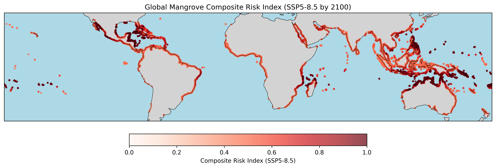
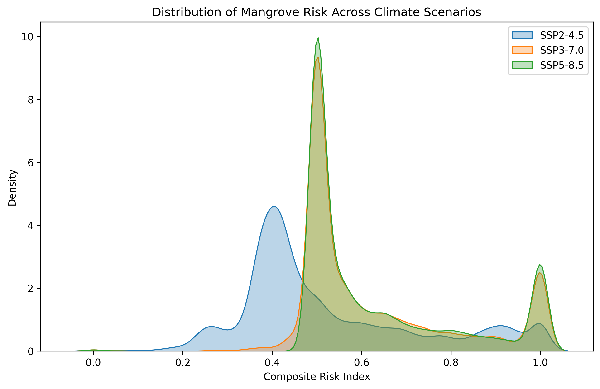
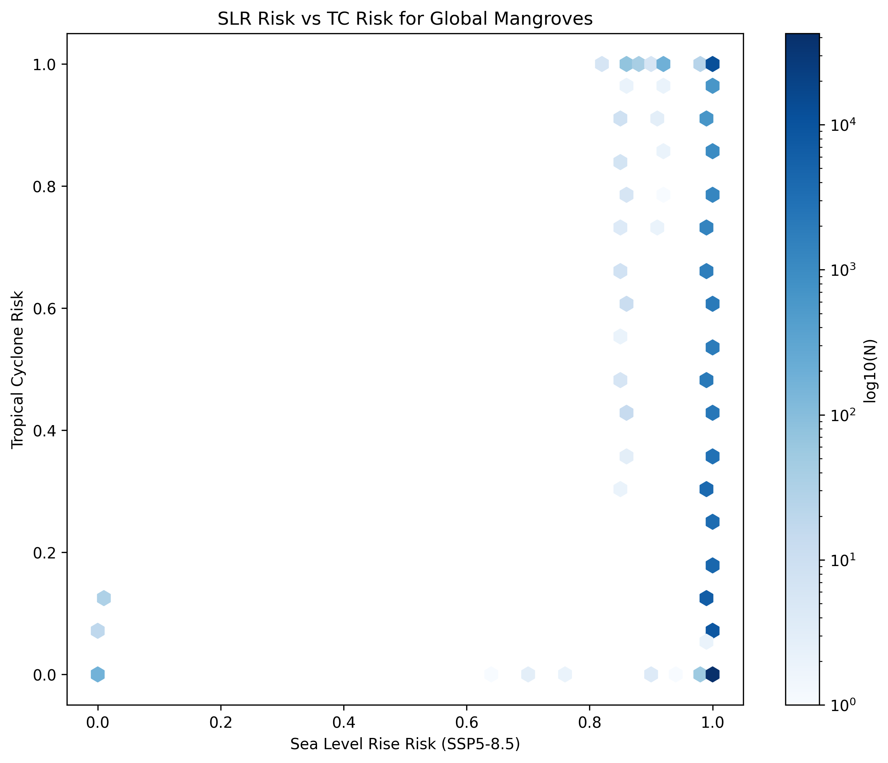
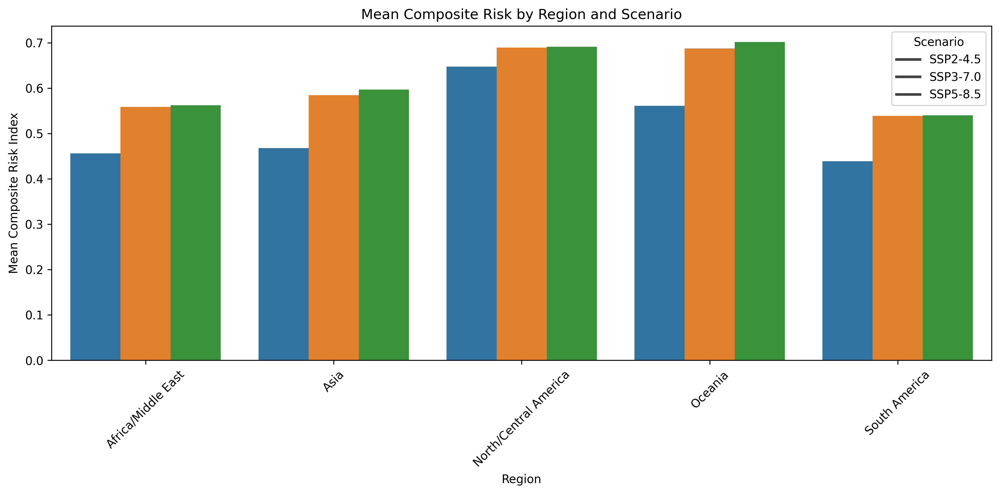

# Global Vulnerability of Mangroves to Sea Level Rise and Tropical Cyclones: A Composite Risk Assessment

## Abstract
Mangrove ecosystems provide critical services including coastal protection, carbon sequestration, and biodiversity support. However, they are increasingly threatened by climate change, particularly through accelerated sea level rise (SLR) and shifting tropical cyclone (TC) regimes. This study develops a composite risk index to evaluate the global vulnerability of mangroves by the end of the century under three Shared Socioeconomic Pathways (SSP2-4.5, SSP3-7.0, and SSP5-8.5). We find that mangroves in Oceania and North/Central America face the highest combined risks, driven by both rapid SLR and high historical exposure to intense cyclones. The results highlight the urgent need for climate-adaptive conservation strategies in these high-risk regions.

## 1. Introduction
Mangrove forests are highly productive coastal ecosystems that offer immense ecological and economic value. They act as natural buffers against storm surges, sequester significant amounts of "blue carbon," and serve as nurseries for marine life. Despite their resilience, mangroves are highly vulnerable to the dual threats of sea level rise and intense tropical cyclones. While mangroves can vertically accrete sediment to keep pace with moderate SLR, rates exceeding 7 mm/yr are highly likely to cause an elevation deficit, leading to drowning and ecosystem collapse. Concurrently, intense tropical cyclones (Category 3-5) cause widespread defoliation, structural damage, and mortality. As climate change alters the frequency and intensity of these stressors, understanding their combined impact is essential for effective conservation. This study constructs a composite risk index combining SLR and TC exposure to map global mangrove vulnerability.

## 2. Methodology

### 2.1 Data Sources
- **Mangrove Extent:** Global Mangrove Watch (GMW) v4 point samples, representing a 10% sample of global mangrove polygons.
- **Sea Level Rise:** IPCC AR6 regional relative sea level rise rates for SSP2-4.5, SSP3-7.0, and SSP5-8.5 (medium confidence). Median rates from 2020 to 2100 were extracted.
- **Tropical Cyclones:** Historical tropical cyclone tracks (1850-2014) from the MIT model downscaled from CMIP6 MPI-ESM1-2-HR.

### 2.2 Risk Index Formulation
The composite risk index ($RI_{comp}$) was formulated by normalizing and combining the risks from SLR and TCs.

**Sea Level Rise Risk ($RI_{SLR}$):**
Based on recent literature, a deficit in mangrove vertical adjustment is likely at 4 mm/yr and highly likely at 7 mm/yr. We defined a linear risk function:
$$ RI_{SLR} = \max\left(0, \min\left(1, \frac{SLR_{rate} - 4}{7 - 4}\right)\right) $$
where $SLR_{rate}$ is the median projected SLR rate (mm/yr) from 2020 to 2100.

**Tropical Cyclone Risk ($RI_{TC}$):**
TC risk was based on the historical frequency of intense cyclones (wind speed $\ge 49.6$ m/s, Category 3+) passing within a 1-degree radius (~111 km) of each mangrove location. The frequency was normalized assuming a high-risk threshold of 0.1 events per year (1 major cyclone per decade):
$$ RI_{TC} = \min\left(1, \frac{TC_{freq}}{0.1}\right) $$

**Composite Risk Index ($RI_{comp}$):**
The final composite risk index was calculated as the unweighted mean of the two individual risk components:
$$ RI_{comp} = \frac{RI_{SLR} + RI_{TC}}{2} $$

## 3. Results

### 3.1 Global Distribution of Risk
The composite risk index under the SSP5-8.5 scenario reveals significant spatial heterogeneity in mangrove vulnerability (Figure 1). High-risk hotspots are concentrated in the Caribbean, the Gulf of Mexico, Madagascar, the Bay of Bengal, and parts of Southeast Asia and Oceania. These regions experience a dangerous combination of high baseline cyclone activity and rapidly accelerating sea level rise.

*Figure 1: Global distribution of the composite risk index for mangroves under the SSP5-8.5 scenario by 2100.*

### 3.2 Impact of Climate Scenarios
The distribution of the composite risk index shifts significantly across different climate scenarios (Figure 2). Under SSP2-4.5, a substantial portion of global mangroves remains at moderate risk. However, under SSP3-7.0 and SSP5-8.5, the distribution shifts heavily towards the higher end of the risk spectrum, primarily driven by the non-linear acceleration of SLR crossing the 7 mm/yr threshold in many regions.

*Figure 2: Density distribution of the composite risk index across SSP2-4.5, SSP3-7.0, and SSP5-8.5 scenarios.*

### 3.3 Interaction of SLR and TC Risks
Figure 3 illustrates the relationship between SLR risk and TC risk. While many mangrove areas face high SLR risk (clustering at $RI_{SLR} = 1.0$ under SSP5-8.5), their exposure to intense TCs varies widely. Areas in the upper right quadrant represent the most critically endangered ecosystems, facing both frequent intense cyclones and insurmountable sea level rise.

*Figure 3: Hexbin scatter plot showing the relationship between Sea Level Rise risk (SSP5-8.5) and Tropical Cyclone risk.*

### 3.4 Regional Vulnerability
A regional aggregation of the composite risk index confirms that Oceania and North/Central America are the most vulnerable regions across all scenarios (Figure 4). In North/Central America, the high risk is strongly influenced by the frequent intense hurricanes in the Atlantic basin. In contrast, South America and Africa/Middle East show relatively lower composite risks, largely due to lower historical exposure to intense tropical cyclones, despite facing significant SLR.

*Figure 4: Mean composite risk index by global region and SSP scenario.*

## 4. Discussion
The development of a composite risk index highlights that the threat to global mangroves is not uniform. The compounding effects of sea level rise and intense tropical cyclones create extreme risk hotspots, particularly in Oceania and the Caribbean/Gulf of Mexico. 

The non-linear nature of mangrove vulnerability to SLR—where rates above 7 mm/yr lead to rapid drowning—means that higher emission scenarios (SSP3-7.0 and SSP5-8.5) cause a disproportionate increase in global risk compared to SSP2-4.5. Furthermore, regions already stressed by frequent intense cyclones may have reduced resilience to cope with accelerating SLR, as canopy damage and root mortality from storms can impair the biogenic processes necessary for vertical accretion.

### Limitations
This study relies on historical TC tracks as a proxy for future exposure, which does not account for potential shifts in cyclone tracks or intensity due to climate change (regime shifts). Future work should integrate projected future TC tracks from high-resolution climate models. Additionally, the risk index assumes equal weighting for SLR and TC risks, which could be refined with localized empirical data on ecosystem mortality.

## 5. Conclusion
By the end of the century, a significant proportion of global mangroves will face severe risks from the combined forces of sea level rise and intense tropical cyclones. Climate-adaptive conservation strategies must prioritize these high-risk hotspots, focusing on facilitating landward migration where possible and mitigating local anthropogenic stressors to maximize ecosystem resilience.

