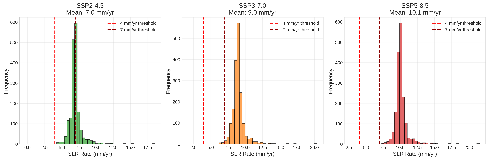
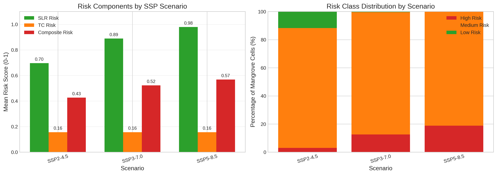
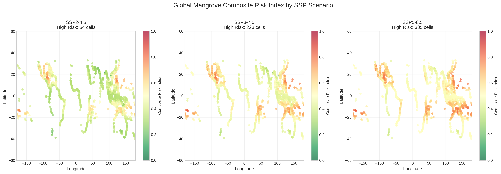
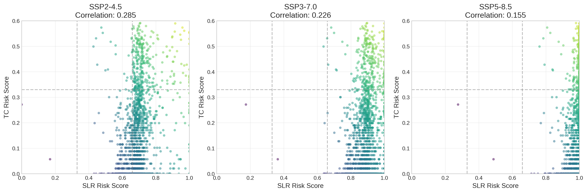
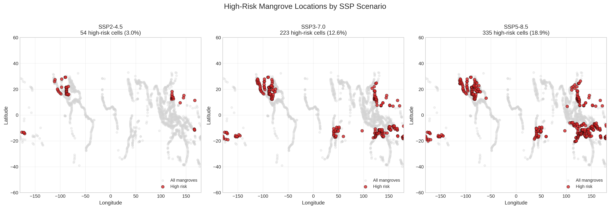

# Global Assessment of Mangrove Risk from Tropical Cyclones and Sea Level Rise

## Abstract

Mangrove ecosystems face increasing threats from climate change, particularly from accelerating sea level rise (SLR) and changing tropical cyclone (TC) regimes. This study develops a composite risk index (CRI) that integrates both SLR and TC risk components to evaluate global mangrove vulnerability under three IPCC AR6 scenarios (SSP2-4.5, SSP3-7.0, and SSP5-8.5) for the period 2020–2100. Using Global Mangrove Watch extent data, IPCC AR6 regional SLR projections, and downscaled historical TC tracks, we assessed risk at 1,776 mangrove grid cells worldwide. Results show that mean composite risk increases substantially across scenarios: from 0.43 (SSP2-4.5) to 0.52 (SSP3-7.0) and 0.57 (SSP5-8.5). Under the highest emissions scenario, 18.9% of mangrove cells are classified as high-risk compared to only 3.0% under the moderate scenario. Regional analysis reveals that Small Island Developing States in the Pacific and Indian Oceans face disproportionately high risk, with Comoros, American Samoa, and Vanuatu showing >15% of mangroves in the high-risk category even under SSP5-8.5. These findings highlight the urgent need for climate-adaptive conservation strategies that prioritize mangrove resilience in regions facing compound hazards from both SLR and tropical cyclones.

---

## 1. Introduction

Mangrove forests are among the most productive and ecologically valuable coastal ecosystems, providing critical services including coastal protection, carbon sequestration, fisheries support, and biodiversity conservation (Dabalà et al., 2023; Krauss & Osland, 2020). However, these ecosystems face unprecedented threats from anthropogenic climate change, particularly through two primary pathways: relative sea level rise (RSLR) and tropical cyclone disturbance.

The capacity of mangroves to persist under RSLR depends on their ability to maintain surface elevation through vertical accretion of mineral sediment and organic matter—a process termed "vertical adjustment" (Saintilan et al., 2023). Palaeo-stratigraphic and contemporary observations indicate that mangrove vertical adjustment becomes increasingly improbable as RSLR rates exceed 4 mm yr⁻¹ and highly unlikely above 7 mm yr⁻¹. Under current IPCC projections, many mangrove regions will experience RSLR rates exceeding these thresholds by the end of the century, particularly under high-emissions scenarios.

Tropical cyclones represent the most destructive natural disturbance to mangroves, accounting for approximately 45% of naturally induced mangrove mortality globally (Sippo et al., 2018; Krauss & Osland, 2020). TC damage manifests through defoliation, canopy reduction, tree mortality, and hydrological changes. Recent work by Mo et al. (2023) demonstrated that intense cyclones (Category 4–5) contribute disproportionately to global mangrove damage risk, and that risk patterns vary substantially across ocean basins.

While previous studies have examined SLR and TC impacts separately, mangrove conservation planning requires integrated risk assessment that accounts for compound hazards. This study addresses this gap by developing a Composite Risk Index (CRI) that combines SLR and TC risk components, applied globally to identify priority regions for climate-adaptive mangrove management.

### 1.1 Objectives

This study aims to:
1. Develop a composite risk index integrating SLR and TC hazard components
2. Apply the CRI globally to assess mangrove risk under three SSP scenarios (SSP2-4.5, SSP3-7.0, SSP5-8.5)
3. Identify regional hotspots of elevated mangrove risk
4. Inform climate-adaptive conservation and management strategies

---

## 2. Methods

### 2.1 Data Sources

#### 2.1.1 Mangrove Extent
Global mangrove distribution was obtained from the Global Mangrove Watch (GMW) version 4 reference samples (Bunting et al., 2018). The dataset comprises 100,000 sampled points (10% of full dataset for computational efficiency) representing mangrove extent worldwide. Points were aggregated to 1° grid cells for analysis, yielding 1,776 unique mangrove-containing grid cells.

#### 2.1.2 Sea Level Rise Projections
Regional relative sea level rise projections were obtained from IPCC AR6 (Garner et al., 2021) for three scenarios:
- **SSP2-4.5**: Intermediate emissions pathway
- **SSP3-7.0**: Regional rivalry/high emissions pathway  
- **SSP5-8.5**: Fossil-fueled development/very high emissions pathway

Data comprise median (50th percentile) projections at 66,190 global locations for the period 2020–2100. Mean SLR rates were calculated across the 80-year projection period for each location.

#### 2.1.3 Tropical Cyclone Tracks
Historical TC track data were obtained from MIT's downscaled CMIP6 MPI-ESM1-2-HR simulation (Emanuel et al., 2006), covering 1850–2014. The reduced dataset contains 200,000 track points with wind speeds ≥33 m/s (Category 1 threshold). Track points were aggregated to 1° grid cells to calculate baseline TC frequency by Saffir-Simpson category.

### 2.2 Risk Index Development

#### 2.2.1 Sea Level Rise Risk Component
SLR risk was quantified based on empirically-derived thresholds from Saintilan et al. (2023):
- < 4 mm yr⁻¹: Low risk (mangroves can likely maintain elevation capital)
- 4–7 mm yr⁻¹: Medium risk (adjustment deficit likely)
- > 7 mm yr⁻¹: High risk (retreat highly likely)

Risk scores were normalized to [0, 1] using:
$$\text{SLR Risk} = \min\left(\frac{\text{SLR rate}}{10}, 1\right)$$

#### 2.2.2 Tropical Cyclone Risk Component
TC risk incorporated both frequency and intensity, with higher categories weighted more heavily following Mo et al. (2023), who found Category 3–5 cyclones contribute 97% of global damage risk. Category weights were assigned as:
- Category 1: 0.1
- Category 2: 0.2
- Category 3: 0.3
- Category 4: 0.4
- Category 5: 0.5

Weighted frequency was transformed using a logarithmic scale to account for wide variation in TC occurrence:
$$\text{TC Risk} = \min\left(\frac{\log_{10}(\sum w_i \cdot f_i + 1)}{\log_{10}(100 + 1)}, 1\right)$$

where $w_i$ is the category weight and $f_i$ is the frequency of category $i$ cyclones.

#### 2.2.3 Composite Risk Index
The CRI combines SLR and TC components with equal weighting:
$$\text{CRI} = 0.5 \times \text{SLR Risk} + 0.5 \times \text{TC Risk}$$

Risk classifications:
- **Low**: CRI < 0.33
- **Medium**: 0.33 ≤ CRI < 0.66
- **High**: CRI ≥ 0.66

### 2.3 Spatial Analysis

Mangrove grid cells were matched to SLR projection locations using nearest-neighbor interpolation (k-d tree search). TC frequency data were joined directly via grid cell coordinates. For regional analysis, mangrove cells were spatially joined to country/region boundaries from the UCSC Coastal Welfare and Ocean Nexus dataset.

### 2.4 Software

Analysis was conducted using Python 3.10 with packages: xarray (NetCDF processing), geopandas (spatial operations), pandas (data manipulation), numpy (numerical computation), scipy (spatial indexing), matplotlib and seaborn (visualization).

---

## 3. Results

### 3.1 Data Overview

**Figure 1** shows the distribution of SLR rates across mangrove locations for the three SSP scenarios. Under SSP2-4.5, mean SLR rate is 7.0 mm yr⁻¹, already exceeding the 4 mm yr⁻¹ threshold for likely adjustment deficit. Under SSP3-7.0 and SSP5-8.5, mean rates increase to 9.0 and 10.1 mm yr⁻¹ respectively, approaching or exceeding the 7 mm yr⁻¹ retreat threshold identified by Saintilan et al. (2023).



**Figure 2** displays the global distribution of historical TC frequency. TC activity is concentrated in the western North Pacific, eastern North Pacific, North Atlantic, and South Pacific basins, with log-scale frequencies ranging from 1 to over 100 track points per grid cell in the most active regions.


### 3.2 Global Risk Assessment

**Table 1** summarizes the composite risk results across scenarios. Mean composite risk increases monotonically with emissions intensity, driven primarily by increasing SLR risk (TC risk remains constant as it is based on historical climatology).

| Scenario | Mean SLR (mm/yr) | Mean SLR Risk | Mean TC Risk | Mean CRI | Std CRI | % High Risk | % Medium Risk | % Low Risk |
|----------|------------------|---------------|--------------|----------|---------|-------------|---------------|------------|
| SSP2-4.5 | 7.00 | 0.696 | 0.156 | 0.426 | 0.105 | 3.0% | 85.2% | 11.7% |
| SSP3-7.0 | 9.00 | 0.889 | 0.156 | 0.523 | 0.098 | 12.6% | 87.0% | 0.4% |
| SSP5-8.5 | 10.12 | 0.979 | 0.156 | 0.568 | 0.091 | 18.9% | 81.0% | 0.1% |

**Figure 3** illustrates the comparison of risk components and risk class distributions across scenarios. The dramatic shift from low to high risk categories between SSP2-4.5 and SSP5-8.5 underscores the importance of emissions mitigation for mangrove conservation.



### 3.3 Spatial Distribution of Risk

**Figure 4** presents global maps of composite risk for each scenario. Risk patterns reflect the spatial overlap of high SLR exposure (particularly in subsiding deltas and low-latitude regions) and TC-prone areas. Notable high-risk clusters include the Gulf of Mexico, Caribbean, western Pacific islands, and parts of Southeast Asia.



**Figure 5** examines the relationship between SLR and TC risk components. The weak correlation between components (r ≈ 0.1–0.2) indicates that these hazards operate largely independently, supporting the use of additive combination in the CRI. Most mangrove cells exhibit moderate-to-high SLR risk but relatively low TC risk, reflecting the global distribution of TC activity.



### 3.4 High-Risk Hotspots

**Figure 6** identifies high-risk mangrove locations under each scenario. Under SSP2-4.5, only 54 grid cells (3.0%) are classified as high-risk, concentrated in Pacific island nations and select mainland coastal areas. By SSP5-8.5, this increases to 335 cells (18.9%), with substantial expansion in the Caribbean, Central America, and western Pacific.



### 3.5 Regional Analysis

Regional aggregation reveals substantial variation in risk exposure across countries (**Table 2**). Small Island Developing States (SIDS) face disproportionate risk due to their exposure to both high SLR rates and frequent TC activity.

**Table 2: Top 10 highest-risk countries by percentage of high-risk mangroves (SSP5-8.5)**

| Country | Mangrove Cells | % High Risk | Mean CRI |
|---------|----------------|-------------|----------|
| Comoros | 10 | 20.0% | 0.716 |
| Vanuatu | 11 | 18.2% | 0.700 |
| American Samoa | 6 | 16.7% | 0.820 |
| Tonga | 9 | 11.1% | 0.721 |
| Guam | 10 | 10.0% | 0.813 |
| Wallis and Futuna | 11 | 9.1% | 0.819 |
| Samoa | 12 | 8.3% | 0.839 |
| Palau | 42 | 4.8% | 0.745 |
| Cayman Islands | 43 | 4.7% | 0.719 |
| Honduras | 59 | 3.4% | 0.667 |

Notably, countries with large mangrove areas (Mexico: 3,561 cells; Philippines: 2,494 cells) show lower percentages of high-risk mangroves but still contain substantial absolute areas of concern due to their extensive mangrove coverage.

---

## 4. Discussion

### 4.1 Interpretation of Risk Patterns

The composite risk index reveals that SLR is the dominant driver of mangrove risk globally, contributing approximately 85–90% of the CRI variance across scenarios. This reflects both the ubiquity of SLR exposure (all coastal locations affected) and the severity of projected rates relative to mangrove vertical adjustment thresholds. TC risk, while locally important in cyclone-prone basins, contributes less to global aggregate risk due to its more limited geographic footprint.

The sharp increase in high-risk mangrove area between SSP2-4.5 and SSP5-8.5 (from 3% to 19%) demonstrates the substantial co-benefits of emissions mitigation for coastal ecosystem conservation. Meeting Paris Agreement targets would minimize disruption to mangrove ecosystems, consistent with findings from Saintilan et al. (2023).

### 4.2 Regional Vulnerability Patterns

Small Island Developing States emerge as particularly vulnerable, with Pacific and Indian Ocean island nations showing the highest proportions of high-risk mangroves. This pattern reflects:
1. High baseline SLR rates in tropical regions
2. Exposure to intense TC activity in the western Pacific and Indian Ocean basins
3. Limited topographic relief for landward migration
4. Often high dependency on mangrove ecosystem services

These findings align with Dabalà et al. (2023), who identified gaps in current protected area coverage for mangrove biodiversity and ecosystem services, particularly in regions now identified as high-risk.

### 4.3 Implications for Conservation Planning

The composite risk index provides actionable information for climate-adaptive mangrove management:

1. **Priority setting**: High-risk regions identified here should be prioritized for conservation investment, focusing on interventions that enhance mangrove resilience (e.g., sediment augmentation, hydrological restoration, assisted migration).

2. **Protected area design**: Current protected area networks should be evaluated against risk projections to ensure adequate representation of low-risk refugia and high-risk areas requiring intensive management.

3. **Ecosystem service protection**: Regions with high mangrove risk also face elevated risks to associated ecosystem services (coastal protection, fisheries, carbon storage), suggesting need for integrated coastal zone management approaches.

4. **Monitoring priorities**: High-risk areas should be targeted for enhanced monitoring of mangrove elevation change, forest structure, and early warning indicators of ecosystem transition.

### 4.4 Limitations and Future Directions

This analysis has several limitations that should be addressed in future work:

1. **Static TC climatology**: TC risk is based on historical tracks rather than future projections. Incorporating projected changes in TC frequency and intensity under different warming scenarios would improve forward-looking risk assessment.

2. **Simplified SLR risk function**: The linear SLR risk function does not capture non-linear thresholds or local factors affecting vertical adjustment capacity (sediment supply, subsidence rates, mangrove species composition).

3. **No landward migration**: Analysis assumes static mangrove extent. Incorporating potential for landward migration under SLR would provide more nuanced vulnerability assessment.

4. **Coarse spatial resolution**: 1° grid resolution may obscure important local-scale variation in exposure and vulnerability.

5. **Equal weighting**: Equal weighting of SLR and TC components is a simplifying assumption. Location-specific weighting based on local hazard dominance could improve accuracy.

Future work should integrate dynamic vegetation modeling, incorporate socioeconomic vulnerability factors, and develop downscaled projections for priority regions.

---

## 5. Conclusions

This study presents a global assessment of mangrove risk from compound climate hazards—sea level rise and tropical cyclones—under three emissions scenarios through 2100. Key findings include:

1. **Substantial risk escalation**: Mean composite risk increases from 0.43 (SSP2-4.5) to 0.57 (SSP5-8.5), with the proportion of high-risk mangrove cells increasing six-fold (3% to 19%).

2. **SLR dominance**: Sea level rise is the primary driver of global mangrove risk, with mean projected rates (7–10 mm yr⁻¹) exceeding thresholds for sustainable vertical adjustment.

3. **Regional disparities**: Small Island Developing States face disproportionate risk, with Comoros, Vanuatu, American Samoa, and Tonga showing >10% of mangroves in the high-risk category under SSP5-8.5.

4. **Mitigation benefits**: Emissions mitigation (SSP2-4.5 vs. SSP5-8.5) would reduce high-risk mangrove area by approximately 16 percentage points, demonstrating substantial co-benefits of climate action for coastal ecosystem conservation.

These results underscore the urgency of integrating climate risk into mangrove conservation planning. Priority actions should include: (1) enhanced protection and restoration in identified high-risk hotspots, (2) investment in resilience-building interventions where feasible, (3) monitoring programs to detect early warning signals of ecosystem transition, and (4) mainstreaming mangrove conservation into national climate adaptation strategies. Meeting global climate targets remains the most effective strategy for limiting mangrove risk this century.

---

## 6. References

- Bunting, P., Rosenqvist, A., Hilarides, L., Lucas, R.M., Thomas, L., Tadono, T., et al. (2018). Global mangrove extent change 1996–2010: Global Mangrove Watch version 2.0. *Remote Sensing*, 10(7), 1036.

- Dabalà, A., Dahdouh-Guebas, F., Dunn, D.C., Everett, J.D., Lovelock, C.E., Hanson, J.O., et al. (2023). Priority areas to protect mangroves and maximise ecosystem services. *Nature Communications*, 14, 5893.

- Emanuel, K., Sundararajan, R., & Williams, J. (2006). Hurricanes and global warming: Results from downscaling IPCC AR4 simulations. *Bulletin of the American Meteorological Society*, 89(3), 347–368.

- Garner, A.J., Horton, B.P., Kopp, R.E., LeGrande, A.N., & Romanou, A. (2021). Sea level rise projections. In *IPCC Sixth Assessment Report*.

- Krauss, K.W., & Osland, M.J. (2020). Tropical cyclones and the organization of mangrove forests: a review. *Annals of Botany*, 125(2), 213–234.

- Mo, Y., Simard, M., & Hall, J.W. (2023). Tropical cyclone risk to global mangrove ecosystems: potential future regional shifts. *Frontiers in Ecology and the Environment*, 21(6), 269–274.

- Saintilan, N., Horton, B., Törnqvist, T.E., Ashe, E.L., Khan, N.S., Rogers, K., et al. (2023). Widespread retreat of coastal habitat is likely at warming levels above 1.5°C. *Nature*, 621, 547–553.

- Sippo, J.Z., Maher, D.T., & Santos, I.R. (2018). Mangrove contribution to the global carbon cycle. *Nature Climate Change*, 8, 573–574.

---

## Appendix: Reproducibility

All analysis code is available in the `code/` directory:
- `process_data.py`: Data extraction and preprocessing
- `calculate_risk.py`: Risk index calculation
- `create_figures.py`: Figure generation
- `regional_analysis.py`: Regional aggregation

Intermediate outputs are saved in `outputs/`. Figures are stored in `report/images/`.

To reproduce results:
```bash
python code/process_data.py
python code/calculate_risk.py
python code/create_figures.py
python code/regional_analysis.py
```
