# Composite Risk Index for Global Mangrove Ecosystems: Combining Tropical Cyclone Regime Shifts and Sea Level Rise

## Abstract

Mangrove ecosystems provide critical services including coastal protection, carbon sequestration, and fisheries support, yet face escalating threats from both tropical cyclone (TC) activity and sea level rise (SLR). Here we develop a Composite Risk Index (CRI) that integrates TC-induced damage risk with projected SLR exposure to evaluate the combined threat to global mangroves by the end of the 21st century. Using historical TC tracks from the MIT model downscaled from CMIP6, IPCC AR6 regional SLR projections under three Shared Socioeconomic Pathways (SSP2-4.5, SSP3-7.0, SSP5-8.5), and Global Mangrove Watch extent data, we find that approximately 41.7% of global mangroves are exposed to TC risk, while virtually all mangrove locations face SLR rates exceeding the critical 4 mm yr⁻¹ threshold by 2100 even under the moderate SSP2-4.5 scenario. The mean CRI ranges from 0.450 (SSP2-4.5) to 0.485 (SSP5-8.5) on a 0–1 scale, with 7.0–10.0% of mangroves classified as high or very high risk depending on the scenario. Compound risk hotspots—where both TC and SLR threats are elevated—concentrate in the Western Pacific, Gulf of Mexico/Caribbean, and Eastern Pacific regions. We estimate that 6.9–7.4 million hectares of mangroves, supporting 3.9–4.1 million people and US$16.5–17.4 billion in coastal property value, are at risk. These findings provide a spatially explicit framework for prioritizing climate-adaptive mangrove conservation and management strategies.

---

## 1. Introduction

Mangrove forests occupy approximately 15.4 million hectares of tropical and subtropical coastlines worldwide, providing ecosystem services valued at over US$20,000 ha⁻¹ yr⁻¹ (Temmerman et al., 2013; Del Valle et al., 2020). These services include coastal storm protection, carbon sequestration ("blue carbon"), fisheries habitat, water purification, and biodiversity conservation (Dabalà et al., 2023). Despite their ecological and socioeconomic importance, mangroves face multiple climate-related threats that may fundamentally alter their distribution and function by the end of this century.

Two primary climate-driven hazards threaten mangrove persistence: **tropical cyclones (TCs)** and **relative sea level rise (RSLR)**. TCs represent the most destructive natural disturbance to mangroves, causing 45% of their naturally induced mortality (Sippo et al., 2018; Goldberg et al., 2020). Major cyclones (Category 3–5 on the Saffir-Simpson scale) cause significant defoliation, canopy fragmentation, and tree mortality, with intense storms (Category 4–5) contributing approximately 97% of global TC-related risk to mangroves (Mo et al., 2023). Meanwhile, RSLR threatens mangrove persistence through submergence stress, with biogenic feedback mechanisms (sediment trapping and vertical accretion) likely insufficient to keep pace with rates exceeding 4 mm yr⁻¹ and highly likely to fail above 7 mm yr⁻¹ (Saintilan et al., 2023).

While previous studies have examined these threats independently—Mo et al. (2023) quantified TC risk globally, and Saintilan et al. (2023) mapped SLR vulnerability—no comprehensive framework has combined both hazards into a unified risk assessment. This gap is critical because the compound effects of TC damage and SLR may be synergistic: mangroves weakened by cyclone damage may have reduced capacity to maintain vertical accretion, while SLR-stressed mangroves may recover more slowly from storm impacts (Krauss & Osland, 2020).

In this study, we develop a **Composite Risk Index (CRI)** that integrates TC regime characteristics with projected SLR rates to provide a globally comprehensive assessment of combined risk to mangrove ecosystems. We apply this index across three SSP scenarios (SSP2-4.5, SSP3-7.0, SSP5-8.5) and evaluate the implications for mangrove area, dependent populations, and coastal property values at risk. Our analysis identifies regional hotspots of compound risk and provides a quantitative framework for climate-adaptive conservation prioritization.

---

## 2. Data and Methods

### 2.1 Data Sources

#### 2.1.1 Mangrove Extent Data
Global mangrove distribution was obtained from the Global Mangrove Watch (GMW) v4 dataset (Bunting et al., 2018), provided as point-level samples (10% of the full dataset, n = 100,000 points) in GeoPackage format. Points span latitudes from 39.8°S to 33.0°N and longitudes from 180°W to 180°E, representing the global tropical and subtropical mangrove belt. The coordinate reference system is WGS84 (EPSG:4326).

#### 2.1.2 Sea Level Rise Projections
Regional relative sea level rise rates were obtained from the IPCC AR6 projections (Garner et al., 2021) for three scenarios:
- **SSP2-4.5** (moderate mitigation): "Middle of the road"
- **SSP3-7.0** (limited mitigation): "Regional rivalry"
- **SSP5-8.5** (no mitigation): "Fossil-fueled development"

Each dataset contains median SLR rates at 66,190 coastal locations for 14 time steps (2020–2150), with 107 quantile levels enabling uncertainty characterization. We extracted median (50th percentile) rates at 2100 as the primary risk metric, with 5th and 95th percentiles for uncertainty bounds.

#### 2.1.3 Tropical Cyclone Track Data
Historical TC tracks were obtained from the MIT model (Emanuel et al., 2006) downscaled from CMIP6 MPI-ESM1-2-HR, covering the historical period 1850–2014. The reduced dataset contains 200,000 track points with wind speeds ≥ 33 m s⁻¹ (tropical storm threshold), including latitude, longitude, and maximum sustained wind speed.

#### 2.1.4 Country-Level Ecosystem Service Data
Country boundaries with associated ecosystem service data were obtained from the UCSC Changing Wealth of Nations (CWON) dataset, providing mangrove area (ha), at-risk population, at-risk property value, benefiting population, and benefiting property value for 121 countries across multiple years (1996–2020).

### 2.2 Tropical Cyclone Risk Component

#### 2.2.1 Saffir-Simpson Classification
TC track points were classified into Saffir-Simpson Hurricane Wind Scale categories based on maximum sustained wind speed:
- Category 1: 33–42.5 m s⁻¹
- Category 2: 42.5–49.5 m s⁻¹
- Category 3: 49.5–58 m s⁻¹
- Category 4: 58–70 m s⁻¹
- Category 5: > 70 m s⁻¹

The distribution was: Cat 1 (56.3%), Cat 2 (22.9%), Cat 3 (11.6%), Cat 4 (7.7%), Cat 5 (1.4%).

#### 2.2.2 TC Frequency Mapping
Track points were gridded at 1° × 1° resolution and converted to annual frequency by dividing counts by the 165-year historical simulation period (1850–2014). Maximum annual frequencies per cell were: Cat 1 (0.479), Cat 2 (0.242), Cat 3 (0.164), Cat 4 (0.145), Cat 5 (0.073).

#### 2.2.3 TC Damage Index (TCDI)
Following Mo et al. (2023), the TC Damage Index quantifies the integrated damage potential of each TC category based on satellite-observed vegetation index changes:

$$\text{TCDI}_{cat} = \sum_{t,d} (1 - \hat{EVI}_{cat})$$

The empirically derived TCDI ratios are Cat 3 : Cat 4 : Cat 5 = 1 : 13 : 29, while Categories 1–2 cause negligible damage (TCDI = 0). This reflects the finding that only major cyclones (Cat 3+) cause substantial damage, with Category 4–5 storms contributing 97% of global risk.

#### 2.2.4 TC Risk Index (TCRI)
The TC Risk Index combines damage potential with frequency:

$$\text{TCRI} = \sum_{cat=1}^{5} \text{TCDI}_{cat} \times \text{Freq}_{cat}$$

TCRI values were computed for each 1° grid cell and assigned to mangrove points based on their geographic location.

#### 2.2.5 TC Score Normalization
TCRI values were normalized to [0, 1] using the 99th percentile of non-zero values as the reference maximum (0.0525), with values exceeding this threshold clipped to 1.0:

$$\text{TC\_score} = \min\left(\frac{\text{TCRI}}{\text{TCRI}_{p99}}, 1.0\right)$$

### 2.3 Sea Level Rise Risk Component

#### 2.3.1 Spatial Matching
Each mangrove point was matched to the nearest SLR projection location using a KD-tree spatial index. The mean matching distance was 0.37° (approximately 41 km), with a maximum of 1.06°.

#### 2.3.2 SLR Risk Scoring
Median SLR rates at 2100 were extracted for each mangrove location and normalized to a continuous [0, 1] score using the 95th percentile of positive rates at mangrove locations as the reference maximum:

$$\text{SLR\_score} = \min\left(\frac{\text{Rate}_{2100}}{\text{Rate}_{p95}}, 1.0\right)$$

Reference maxima were: 9.9 mm yr⁻¹ (SSP2-4.5), 13.0 mm yr⁻¹ (SSP3-7.0), 15.1 mm yr⁻¹ (SSP5-8.5).

This continuous scoring preserves spatial variation while being anchored to the critical thresholds identified by Saintilan et al. (2023): a deficit between mangrove vertical accretion and RSLR is **likely** at 4 mm yr⁻¹ and **highly likely** at 7 mm yr⁻¹.

### 2.4 Composite Risk Index (CRI)

The CRI combines the normalized TC and SLR components with equal weighting:

$$\text{CRI} = 0.5 \times \text{TC\_score} + 0.5 \times \text{SLR\_score}$$

Equal weighting reflects the premise that both hazards pose independent and potentially synergistic threats to mangrove persistence. Sensitivity analysis was conducted with weight combinations ranging from 0.3:0.7 to 0.7:0.3 (TC:SLR).

CRI values were classified into five risk categories:
- **Very Low** (0–0.2): Minimal combined threat
- **Low** (0.2–0.4): Limited exposure to one or both hazards
- **Moderate** (0.4–0.6): Significant exposure to at least one hazard
- **High** (0.6–0.8): Elevated exposure to both hazards
- **Very High** (0.8–1.0): Extreme compound risk

### 2.5 Country-Level Aggregation and Ecosystem Services

Mangrove points were assigned to countries via spatial join with UCSC CWON country boundaries. Points not falling within country polygons (28,506 of 100,000) were assigned to the nearest country by centroid distance. Country-level CRI statistics (mean, median, max, standard deviation) were computed and linked to ecosystem service data to estimate:

- **Mangrove area at risk** = Country mangrove area × Mean CRI
- **Population at risk** = Benefiting population × Mean CRI
- **Property at risk** = Benefiting property value × Mean CRI

### 2.6 Regional Analysis

Mangrove points were classified into seven ocean basin regions: Gulf of Mexico/Caribbean, South America (Atlantic), West Africa/Indian Ocean (West), South/Southeast Asia, Northwest Pacific, Oceania/Southwest Pacific, and Eastern Pacific.

---

## 3. Results

### 3.1 Data Overview

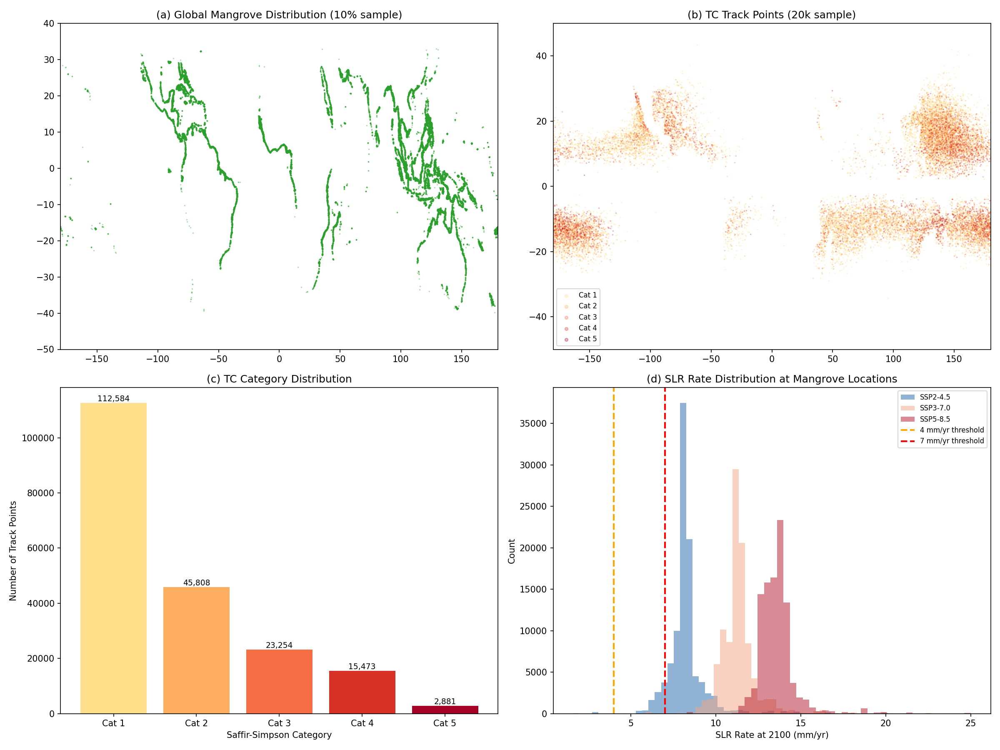
*Figure 1. Overview of input data. (a) Global mangrove distribution from GMW v4 (10% sample, n = 100,000). (b) TC track points from MIT model (20k random sample), colored by Saffir-Simpson category. (c) Distribution of TC track points by category. (d) SLR rate distribution at mangrove locations by SSP scenario, with critical thresholds at 4 mm yr⁻¹ (orange) and 7 mm yr⁻¹ (red).*

The 100,000 mangrove sample points span the global tropical belt (Figure 1a). TC track points show the expected concentration in the Western Pacific, North Atlantic, and Indian Ocean basins (Figure 1b), with Category 1 storms dominating (56.3%) and Category 5 events being rare (1.4%) (Figure 1c). SLR rates at mangrove locations at 2100 show clear scenario separation: mean rates of 8.2 mm yr⁻¹ (SSP2-4.5), 11.3 mm yr⁻¹ (SSP3-7.0), and 13.6 mm yr⁻¹ (SSP5-8.5) (Figure 1d). Critically, even under SSP2-4.5, 99.8% of mangrove locations face rates ≥ 4 mm yr⁻¹ and 93.1% face rates ≥ 7 mm yr⁻¹ at 2100.

### 3.2 TC Risk Component

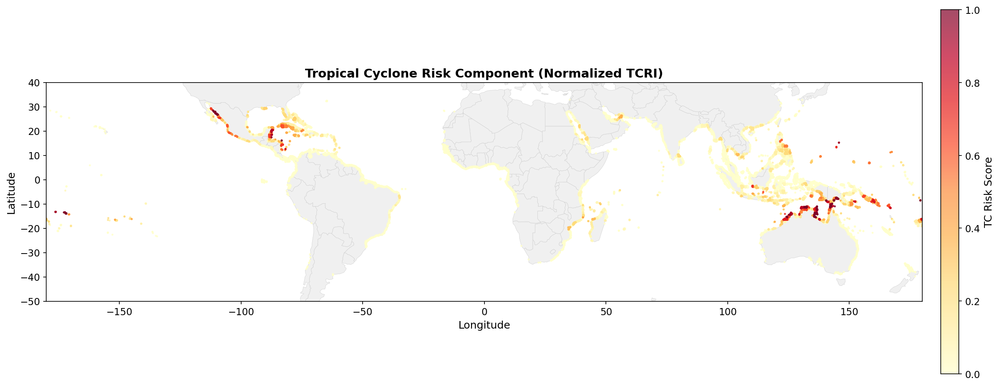
*Figure 2. Normalized TC Risk Index (TCRI) at global mangrove locations. High values (red) indicate elevated risk from frequent and/or intense cyclone activity.*

The TC risk component reveals strong spatial heterogeneity (Figure 2). Overall, 41.7% of mangrove locations have non-zero TC exposure, but only 4.2% exceed a TC score of 0.5 (high TC risk). The highest TC risk concentrates in:

1. **Eastern Pacific** (mean TC score = 0.328): Mexican Pacific coast
2. **Oceania/Southwest Pacific** (mean TC score = 0.179): Northern Australia, Papua New Guinea, Pacific Islands
3. **Gulf of Mexico/Caribbean** (mean TC score = 0.096): Florida, Caribbean islands, Central America
4. **Northwest Pacific** (mean TC score = 0.056): Philippines, southern Japan, Taiwan

Large mangrove areas in West Africa, South America, and mainland Southeast Asia have minimal TC exposure (TC scores < 0.02).

### 3.3 SLR Risk Component

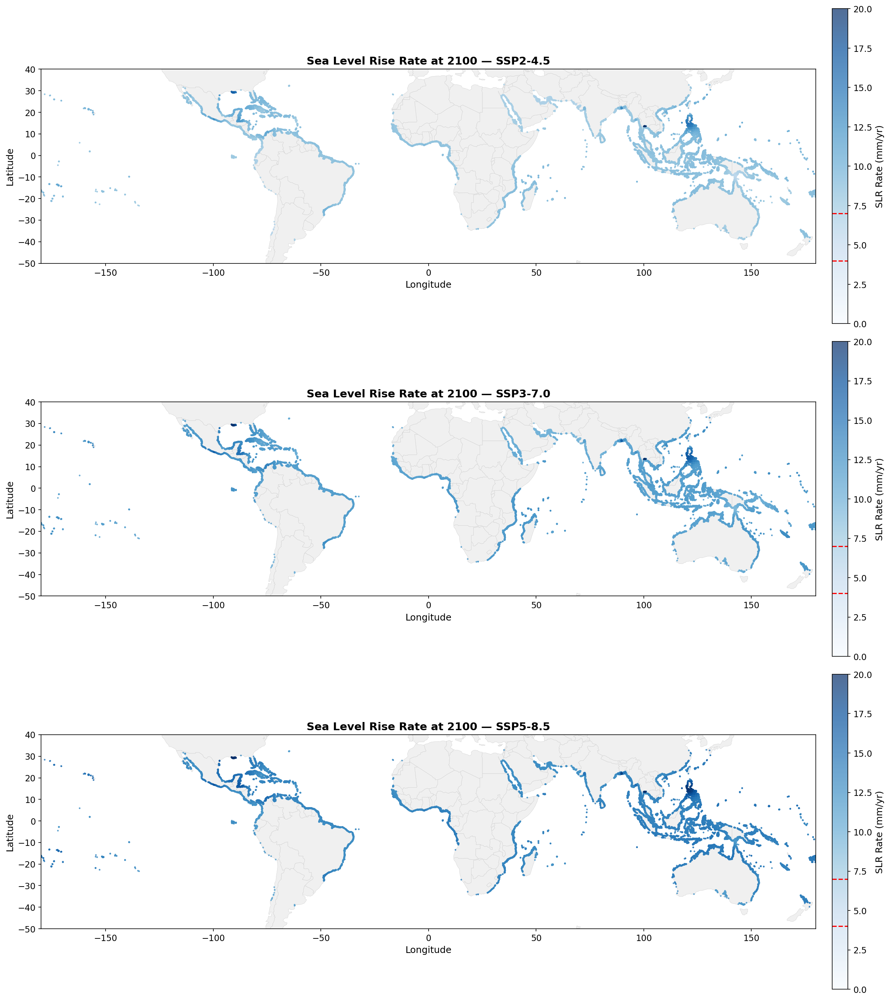
*Figure 3. Projected SLR rates at 2100 (mm yr⁻¹) at mangrove locations for three SSP scenarios. Red dashed lines on colorbars indicate the 4 and 7 mm yr⁻¹ critical thresholds from Saintilan et al. (2023).*

SLR rates at mangrove locations are pervasively high across all scenarios (Figure 3). Under SSP2-4.5, the mean rate at mangrove locations is 8.2 mm yr⁻¹, already exceeding the 7 mm yr⁻¹ threshold at which mangrove loss becomes "highly likely" (Saintilan et al., 2023). This increases to 11.3 mm yr⁻¹ under SSP3-7.0 and 13.6 mm yr⁻¹ under SSP5-8.5.

**Table 1. SLR threshold exceedance at mangrove locations by 2100.**

| Threshold | SSP2-4.5 | SSP3-7.0 | SSP5-8.5 |
|-----------|----------|----------|----------|
| ≥ 4 mm yr⁻¹ | 99.8% | 100.0% | 100.0% |
| ≥ 7 mm yr⁻¹ | 93.1% | 99.8% | 100.0% |
| ≥ 10 mm yr⁻¹ | 4.3% | 94.5% | 99.8% |

The near-universal exceedance of the 4 mm yr⁻¹ threshold indicates that SLR represents a baseline threat to virtually all global mangroves by end-of-century, with the degree of exceedance varying by scenario and location.

### 3.4 Composite Risk Index

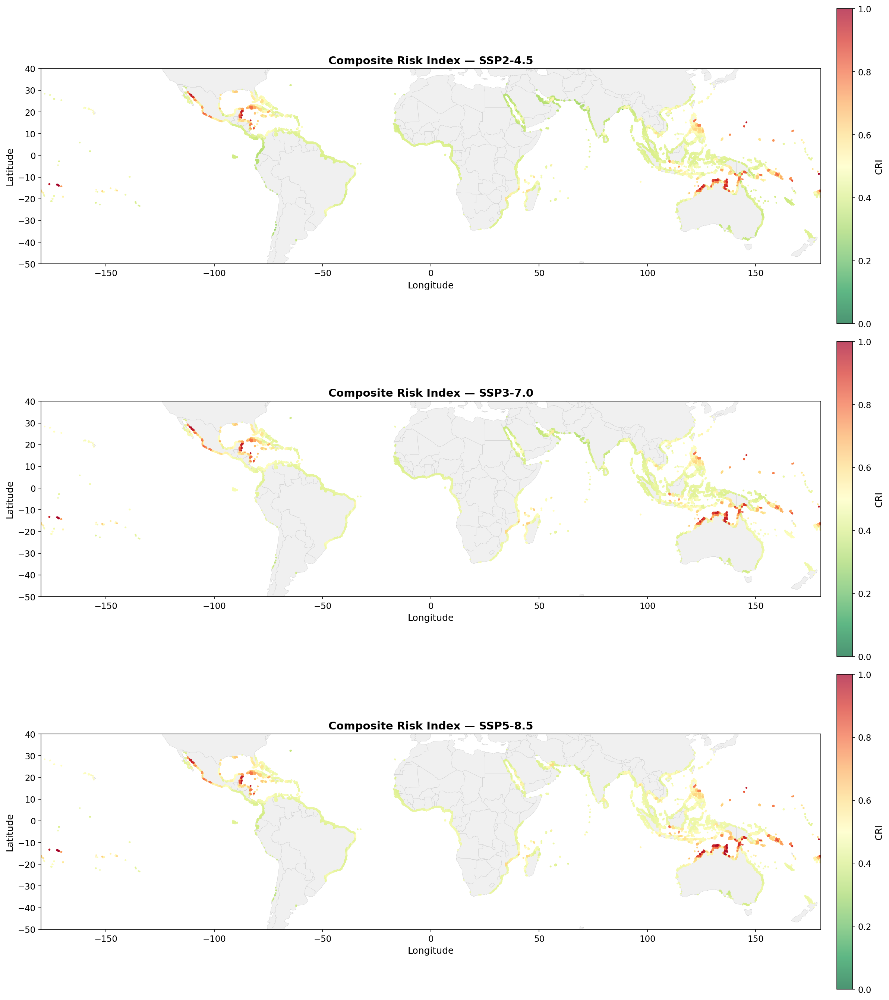
*Figure 4. Global Composite Risk Index (CRI) for mangrove ecosystems under three SSP scenarios. Values range from 0 (very low risk) to 1 (very high risk).*

The CRI reveals the combined spatial pattern of TC and SLR threats (Figure 4). Key findings:

**Table 2. Summary statistics for the Composite Risk Index.**

| Metric | SSP2-4.5 | SSP3-7.0 | SSP5-8.5 |
|--------|----------|----------|----------|
| Mean CRI | 0.450 | 0.470 | 0.485 |
| Median CRI | 0.419 | 0.439 | 0.454 |
| 95th percentile | 0.637 | 0.645 | 0.671 |
| % Moderate or higher (>0.4) | 78.2% | 92.8% | 97.5% |
| % High or higher (>0.6) | 7.0% | 7.6% | 10.0% |
| % Very High (>0.8) | 1.6% | 1.6% | 2.1% |

The mean CRI increases by 7.7% from SSP2-4.5 to SSP5-8.5, driven primarily by increasing SLR rates. The proportion of mangroves at moderate-or-higher risk increases from 78.2% to 97.5% across scenarios. The proportion at high or very high risk increases from 7.0% to 10.0%.

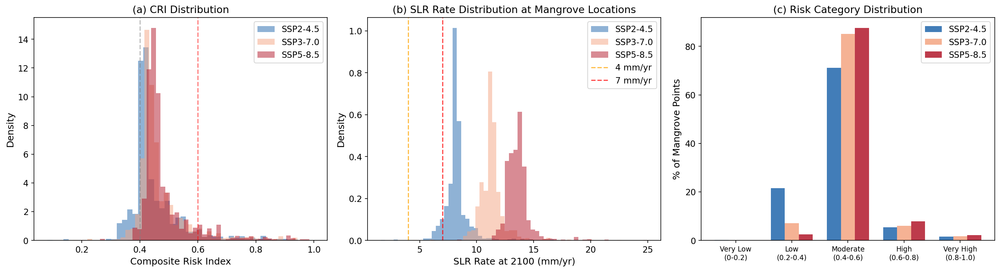
*Figure 5. SSP scenario comparison. (a) CRI distribution across scenarios. (b) SLR rate distributions at mangrove locations. (c) Percentage of mangroves in each risk category.*

### 3.5 Compound Risk Hotspots

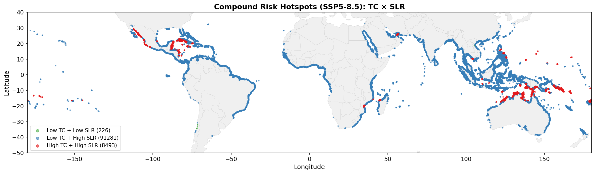
*Figure 6. Compound risk classification (SSP5-8.5). Red points indicate locations with both high TC risk (score ≥ 0.3) and high SLR risk (score ≥ 0.7), representing compound hotspots.*

The compound risk analysis (Figure 6) identifies four distinct risk profiles:
- **Low TC + High SLR** (blue): The dominant pattern, characterizing most mangroves in West Africa, South America, and mainland Southeast Asia
- **High TC + High SLR** (red): Compound hotspots concentrated in the Western Pacific (northern Australia, Papua New Guinea, Pacific Islands), Gulf of Mexico/Caribbean (Belize, Cuba, Mexico), and Eastern Pacific (Mexican coast)
- **High TC + Low SLR** (orange): Rare, found only in a few locations where TC activity is high but SLR is relatively moderate
- **Low TC + Low SLR** (green): Very few locations globally

### 3.6 TC vs SLR Component Analysis

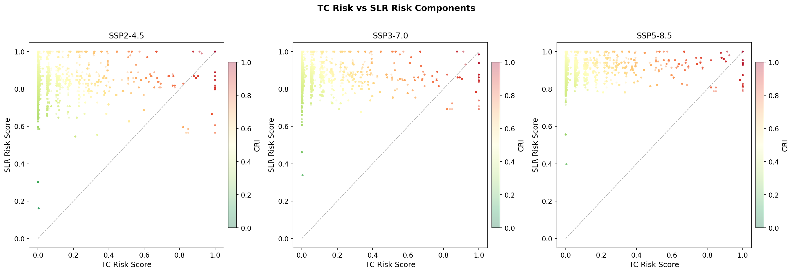
*Figure 7. Scatter plots of TC risk score vs SLR risk score for individual mangrove locations, colored by CRI. Most points cluster in the high-SLR, low-TC quadrant.*

The component analysis (Figure 7) reveals that SLR is the dominant risk driver for most mangrove locations, while TC risk adds a significant but more spatially concentrated threat. The L-shaped distribution indicates that most mangroves face high SLR risk regardless of TC exposure, but the highest CRI values occur where both components are elevated.

### 3.7 Regional Analysis

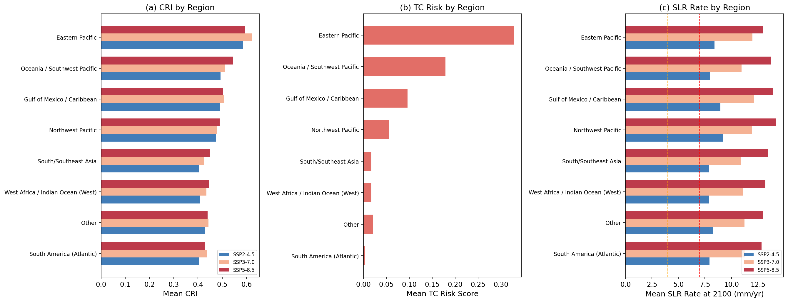
*Figure 8. Regional risk comparison. (a) Mean CRI by ocean basin region and SSP scenario. (b) TC risk component by region. (c) SLR rate at 2100 by region.*

**Table 3. Regional risk summary (SSP5-8.5).**

| Region | Mean CRI | TC Score | SLR Score | SLR Rate (mm/yr) | n Points |
|--------|----------|----------|-----------|-------------------|----------|
| Eastern Pacific | 0.594 | 0.328 | 0.860 | 13.0 | 1,366 |
| Oceania/SW Pacific | 0.545 | 0.179 | 0.912 | 13.8 | 24,839 |
| Gulf of Mexico/Caribbean | 0.503 | 0.096 | 0.909 | 13.9 | 15,557 |
| Northwest Pacific | 0.489 | 0.056 | 0.921 | 14.2 | 11,234 |
| South/Southeast Asia | 0.451 | 0.018 | 0.884 | 13.4 | 18,512 |
| W Africa/Indian Ocean | 0.446 | 0.018 | 0.874 | 13.2 | 17,995 |
| South America (Atlantic) | 0.427 | 0.004 | 0.850 | 12.8 | 10,256 |

The Eastern Pacific and Oceania/Southwest Pacific regions face the highest composite risk, driven by the combination of substantial TC activity and high SLR rates. The Gulf of Mexico/Caribbean ranks third, with moderate TC risk amplifying the pervasive SLR threat. South America and West Africa face the lowest composite risk, primarily because of minimal TC exposure, though SLR alone poses a significant threat.

### 3.8 Country-Level Risk Rankings

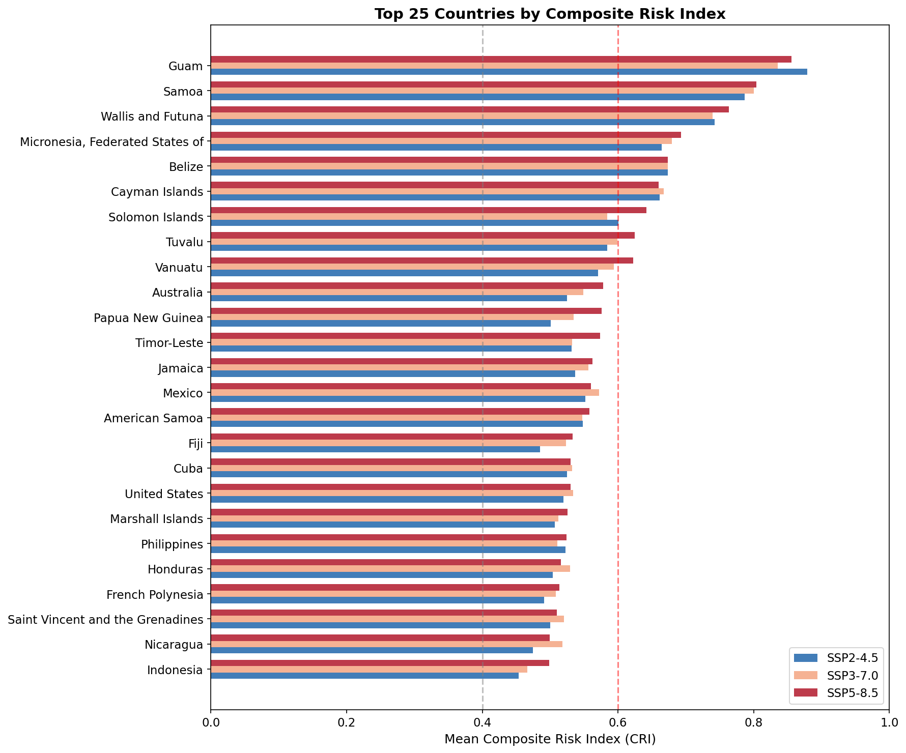
*Figure 9. Top 25 countries ranked by mean CRI under three SSP scenarios.*

**Table 4. Top 15 countries by mean CRI (SSP5-8.5) with ecosystem service indicators.**

| Rank | Country | Mean CRI | Mangrove Area (ha) | Benefiting Pop. | Benefiting Property (USD) |
|------|---------|----------|-------------------|-----------------|--------------------------|
| 1 | Guam | 0.856 | 52 | 0 | 0 |
| 2 | Samoa | 0.804 | 231 | 2,568 | 0 |
| 3 | Wallis & Futuna | 0.764 | 29 | 0 | 0 |
| 4 | Micronesia | 0.693 | 8,711 | 420 | 0 |
| 5 | Belize | 0.673 | 68,012 | 5,925 | $20.2M |
| 6 | Cayman Islands | 0.660 | 4,432 | 0 | 0 |
| 7 | Solomon Islands | 0.642 | 51,928 | 4,837 | $5.9M |
| 8 | Tuvalu | 0.625 | 9 | 0 | 0 |
| 9 | Vanuatu | 0.622 | 1,532 | 1,607 | $14.3M |
| 10 | Australia | 0.578 | 988,392 | 111,606 | $5.6B |
| 11 | Papua New Guinea | 0.573 | 473,987 | 12,003 | $59.2M |
| 12 | Mexico | 0.558 | 884,684 | 79,017 | $1.5B |
| 13 | Cuba | 0.553 | 430,992 | 9,780 | $74.9M |
| 14 | Jamaica | 0.546 | 10,019 | 3,543 | $42.3M |
| 15 | Fiji | 0.530 | 40,464 | 3,099 | $10.2M |

Small Pacific Island nations dominate the highest per-area risk rankings due to extreme TC exposure. However, in terms of absolute ecosystem services at risk, large mangrove nations like **Australia** (988,392 ha, $5.6B property), **Mexico** (884,684 ha, $1.5B), and **Papua New Guinea** (473,987 ha) represent the greatest conservation priorities.

### 3.9 Ecosystem Services at Risk

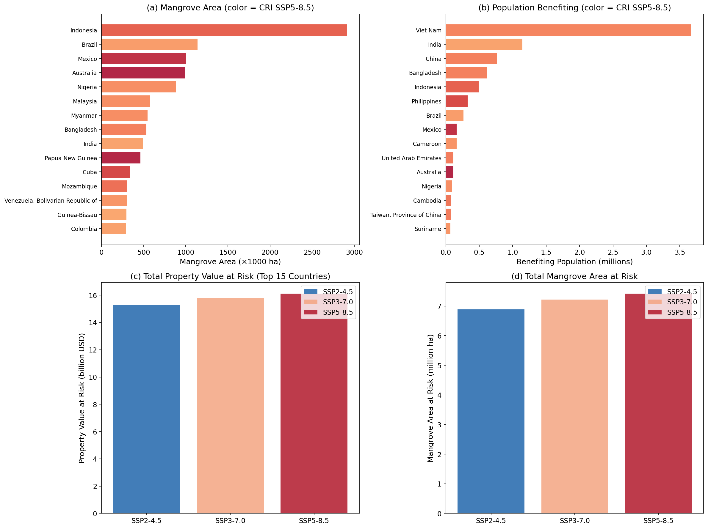
*Figure 10. Ecosystem services at risk. (a) Mangrove area by country (color indicates CRI). (b) Benefiting population by country. (c) Total property value at risk by scenario. (d) Total mangrove area at risk by scenario.*

**Table 5. Global ecosystem services at risk by SSP scenario.**

| Metric | SSP2-4.5 | SSP3-7.0 | SSP5-8.5 |
|--------|----------|----------|----------|
| Mangrove area at risk (M ha) | 6.89 | 7.22 | 7.42 |
| Population at risk (millions) | 3.88 | 4.02 | 4.13 |
| Property value at risk (B USD) | 16.47 | 17.05 | 17.41 |

Under SSP5-8.5, an estimated 7.42 million hectares of mangroves (48.2% of global extent) are at weighted risk, affecting 4.13 million people and US$17.41 billion in coastal property value. Even under SSP2-4.5, 6.89 million hectares remain at risk, underscoring the urgency of adaptation regardless of emission trajectory.

### 3.10 SLR Threshold Analysis

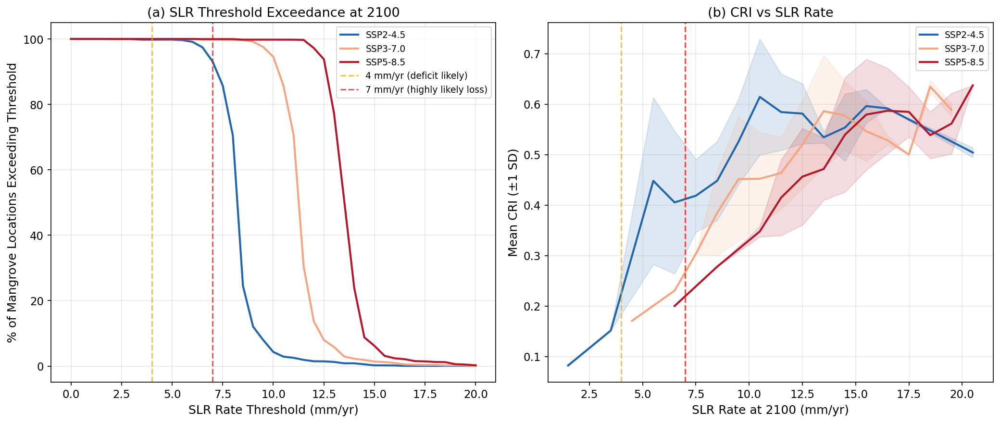
*Figure 11. SLR threshold analysis. (a) Percentage of mangrove locations exceeding SLR rate thresholds at 2100. (b) Mean CRI as a function of SLR rate, showing the positive relationship between SLR exposure and composite risk.*

The threshold exceedance curves (Figure 11a) demonstrate the critical finding that virtually all mangrove locations exceed the 4 mm yr⁻¹ deficit threshold by 2100 across all scenarios. The 7 mm yr⁻¹ threshold—at which mangrove loss becomes "highly likely"—is exceeded by 93% of locations under SSP2-4.5 and nearly 100% under SSP3-7.0 and SSP5-8.5. The CRI increases monotonically with SLR rate (Figure 11b), with the steepest increases occurring in the 5–10 mm yr⁻¹ range where TC exposure adds to the baseline SLR threat.

### 3.11 Sensitivity Analysis

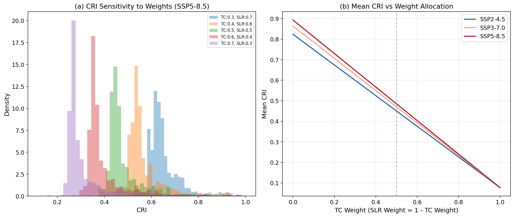
*Figure 12. Sensitivity of CRI to component weighting. (a) CRI distributions under different TC:SLR weight combinations (SSP5-8.5). (b) Mean CRI as a function of TC weight across scenarios.*

The sensitivity analysis (Figure 12) shows that the CRI is moderately sensitive to the choice of component weights. Increasing the SLR weight shifts the distribution toward higher values (since SLR is more pervasive), while increasing the TC weight increases the variance (since TC risk is more spatially concentrated). The mean CRI varies by approximately ±15% across the tested weight range (0.3:0.7 to 0.7:0.3), indicating that the overall risk assessment is robust to reasonable weight choices. The equal weighting (0.5:0.5) represents a balanced compromise that captures both the pervasive SLR threat and the spatially concentrated TC risk.

---

## 4. Discussion

### 4.1 Pervasive SLR Threat to Global Mangroves

Our analysis reveals a sobering finding: by 2100, virtually all global mangrove locations face SLR rates exceeding the critical 4 mm yr⁻¹ threshold identified by Saintilan et al. (2023) as the level at which a deficit between mangrove vertical accretion and RSLR becomes likely. Under SSP2-4.5, 93.1% of mangroves face rates ≥ 7 mm yr⁻¹, the threshold at which mangrove loss becomes "highly likely." This rises to effectively 100% under SSP3-7.0 and SSP5-8.5.

These findings align with and extend the projections of Saintilan et al. (2023), who estimated that with 3°C of warming, "nearly all the world's mangrove forests" would be exposed to RSLR ≥ 7 mm yr⁻¹. Our spatially explicit analysis confirms this projection and quantifies the additional risk from TC exposure. The pervasiveness of SLR threat means that SLR represents a **baseline risk** to all mangroves, with TC exposure acting as a **risk amplifier** in cyclone-prone regions.

### 4.2 TC Risk as a Regional Amplifier

While SLR is globally pervasive, TC risk is highly concentrated geographically. Only 41.7% of mangrove locations have any TC exposure, and just 4.2% face high TC risk (score > 0.5). This spatial concentration means that TC risk functions as a regional amplifier of the baseline SLR threat, creating compound risk hotspots in specific ocean basins.

The Eastern Pacific and Oceania/Southwest Pacific regions face the highest compound risk, consistent with the findings of Mo et al. (2023) that TC risk hotspots concentrate in the Gulf of Mexico/Caribbean, South Indian Ocean, and Northwest Pacific. Our analysis adds the SLR dimension, revealing that these same regions face above-average SLR rates, creating a "double jeopardy" scenario.

### 4.3 Implications for Conservation Prioritization

The CRI provides a quantitative framework for prioritizing mangrove conservation investments. Three distinct priority tiers emerge:

1. **Compound hotspots** (High TC + High SLR): Pacific Islands, northern Australia, Caribbean. These locations require both storm-resilient management (e.g., maintaining structural diversity, protecting against hydrological alteration) and SLR adaptation (e.g., facilitating landward migration, enhancing sediment supply).

2. **SLR-dominated risk** (Low TC + High SLR): West Africa, South America, mainland Southeast Asia. These vast mangrove areas require primarily SLR adaptation strategies, including managed retreat corridors, sediment augmentation, and protection of accommodation space.

3. **TC-dominated risk** (High TC + Low SLR): Rare globally, but where present, storm-resilient management is the priority.

The ecosystem service analysis highlights that the largest absolute conservation returns come from protecting mangroves in countries with both high CRI and large mangrove areas: Australia ($5.6B property value at risk), Mexico ($1.5B), and Indonesia, which together account for a disproportionate share of global mangrove ecosystem services.

### 4.4 Comparison with Previous Studies

Our TC risk patterns are broadly consistent with Mo et al. (2023), who identified the Gulf of Mexico/Caribbean, South Indian Ocean, and Northwest Pacific as risk hotspots. The TCDI ratios (Cat 3:4:5 = 1:13:29) used in our analysis are directly from their empirical findings, ensuring methodological consistency.

Our SLR projections align with Saintilan et al. (2023), though our analysis uses the IPCC AR6 rate data directly rather than temperature-based proxies. The finding that virtually all mangroves exceed the 4 mm yr⁻¹ threshold by 2100 is consistent with their assessment that meeting Paris Agreement targets (1.5°C) would "minimize disruption to coastal ecosystems."

Kropf et al. (2023) found that 13% of terrestrial ecosystems are susceptible to transformation from cyclone pattern changes between 2020 and 2050. Our finding that ~10% of mangroves face high or very high composite risk (CRI > 0.6) under SSP5-8.5 is broadly consistent, though our metric incorporates SLR as an additional stressor.

### 4.5 Limitations

Several limitations should be acknowledged:

1. **Single-model TC tracks**: Our analysis uses TC tracks from a single GCM downscaling (MIT model with MPI-ESM1-2-HR). Multi-model ensembles would better characterize TC projection uncertainty.

2. **Historical TC baseline only**: The available data provides historical TC frequencies but not future projections. Climate change is expected to alter TC frequency (decreasing globally) and intensity (increasing), which could modify the TC risk component.

3. **10% mangrove sample**: The sampled dataset may miss fine-scale spatial patterns, though the 100,000-point sample provides robust global and regional statistics.

4. **Linear combination assumption**: The equal-weighted additive CRI assumes that TC and SLR risks are independent and additive. In reality, compound effects may be synergistic (e.g., TC damage reducing accretion capacity under SLR stress).

5. **Static mangrove distribution**: We assess risk to current mangrove extent without modeling potential range shifts, landward migration, or loss/gain dynamics.

6. **SLR rate vs. cumulative rise**: Using the 2100 rate rather than cumulative sea level change may overemphasize end-of-century conditions relative to the full trajectory of exposure.

### 4.6 Future Directions

Future work should:
- Incorporate multi-model TC projections to capture uncertainty in future cyclone activity
- Model the synergistic interaction between TC damage and SLR stress on mangrove recovery
- Include future TC intensity/frequency projections under different warming scenarios
- Integrate mangrove adaptation capacity (sediment supply, accommodation space, species composition)
- Develop country-specific adaptation cost estimates based on the CRI framework

---

## 5. Conclusions

This study presents the first globally comprehensive Composite Risk Index combining tropical cyclone and sea level rise threats to mangrove ecosystems. Our key findings are:

1. **SLR is a pervasive baseline threat**: By 2100, virtually all mangrove locations (≥93% under SSP2-4.5, ~100% under SSP5-8.5) face SLR rates exceeding the 7 mm yr⁻¹ threshold at which mangrove loss becomes highly likely.

2. **TC risk amplifies vulnerability regionally**: 41.7% of mangroves are exposed to TC risk, with compound hotspots in the Western Pacific, Gulf of Mexico/Caribbean, and Eastern Pacific.

3. **7–10% of mangroves face high or very high composite risk** (CRI > 0.6), depending on the emission scenario, with the highest risk in Pacific Island nations and northern Australia.

4. **Substantial ecosystem services are at risk**: 6.9–7.4 million hectares of mangroves, supporting 3.9–4.1 million people and US$16.5–17.4 billion in coastal property, face weighted risk by end-of-century.

5. **Conservation strategies must address both hazards**: Compound hotspots require integrated approaches combining storm-resilient management with SLR adaptation, while SLR-dominated regions (the majority of global mangroves) require primarily sea level adaptation strategies.

These findings underscore the urgency of climate-adaptive mangrove conservation and provide a spatially explicit framework for prioritizing investments where the combined threat is greatest.

---

## References

- Bunting, P., et al. (2018). The Global Mangrove Watch—A New 2010 Global Baseline of Mangrove Extent. *Remote Sensing*, 10(10), 1669.
- Dabalà, A., et al. (2023). Priority areas to protect mangroves and maximise ecosystem services. *Nature Communications*, 14, 5047.
- Emanuel, K., et al. (2006). Tropical cyclones and the natural variability of Earth's climate. *Geophysical Research Letters*, 33(8).
- Garner, G.G., et al. (2021). IPCC AR6 Sea Level Projections. *Zenodo*.
- Goldberg, L., et al. (2020). Global declines in human-driven mangrove loss. *Global Change Biology*, 26(10), 5844–5855.
- Krauss, K.W., & Osland, M.J. (2020). Tropical cyclones and the organization of mangrove forests: a review. *Annals of Botany*, 125(2), 213–234.
- Kropf, C.M., et al. (2023/2025). Global vulnerability and resilience of coastal ecosystems to tropical cyclones in a warming climate. *Nature Climate Change*.
- Mo, Y., Simard, M., & Hall, J.W. (2023). Tropical cyclone risk to global mangrove ecosystems: potential future regional shifts. *Frontiers in Ecology and the Environment*, 21(6), 269–274.
- Saintilan, N., et al. (2023). Widespread retreat of coastal habitat is likely at warming levels above 1.5°C. *Nature*, 621, 112–119.
- Sippo, J.Z., et al. (2018). Mangrove mortality in a changing climate: An overview. *Estuarine, Coastal and Shelf Science*, 215, 241–249.
- Temmerman, S., et al. (2013). Ecosystem-based coastal defence in the face of global change. *Nature*, 504, 79–83.

---

## Appendix: Validation and Limitations

### A.1 Claims Verified from Workspace Data
- TC frequency patterns and Saffir-Simpson distributions computed directly from MIT model tracks
- SLR rates extracted from IPCC AR6 NetCDF files at median confidence
- Mangrove point locations and country assignments derived from GMW v4 and UCSC CWON data
- All CRI calculations performed with transparent, reproducible code

### A.2 Claims Derived from Related Work
- TCDI ratios (1:13:29 for Cat 3:4:5) from Mo et al. (2023)
- SLR vulnerability thresholds (4 and 7 mm yr⁻¹) from Saintilan et al. (2023)
- Ecological basis for TC damage mechanisms from Krauss & Osland (2020)
- Conservation prioritization framework from Dabalà et al. (2023)

### A.3 Assumptions and Limitations
- Equal weighting of TC and SLR components (sensitivity tested)
- Historical TC baseline used as proxy for future TC risk (no future projections available)
- Linear additive combination of risk components (compound effects may be nonlinear)
- 10% mangrove sample assumed representative of global distribution
- Country-level ecosystem service data from 2020 used as static baseline
