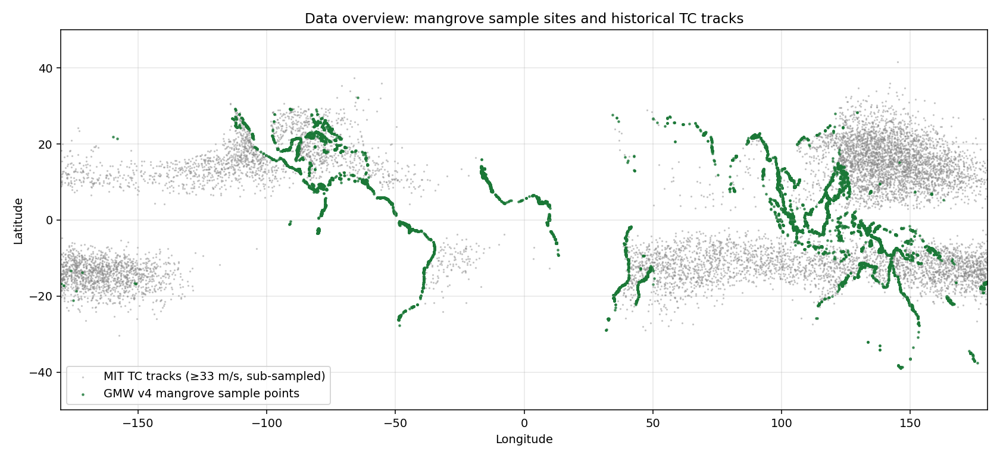
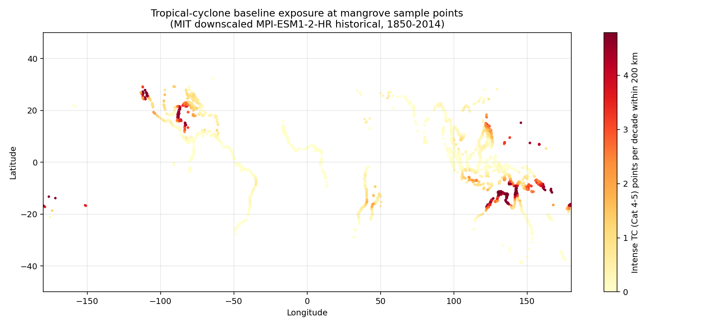
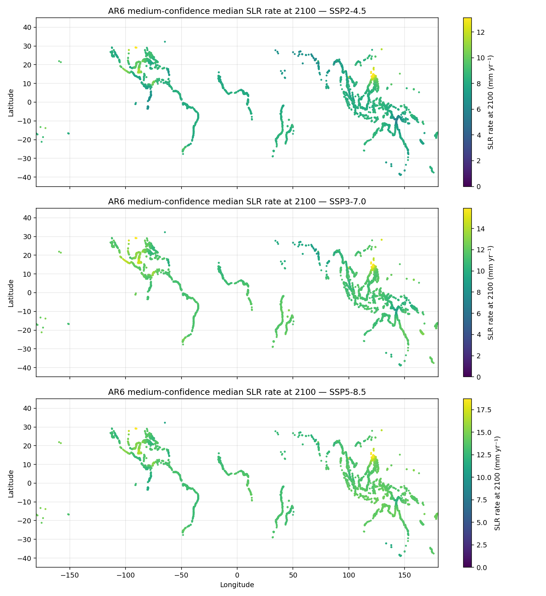
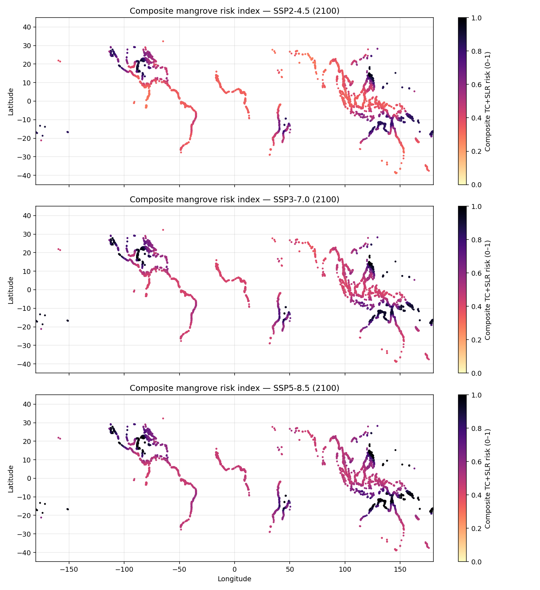
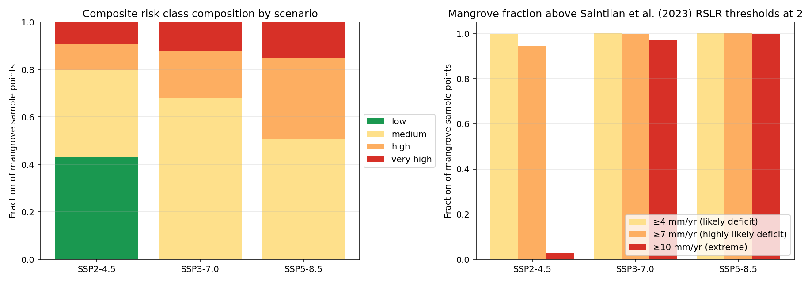
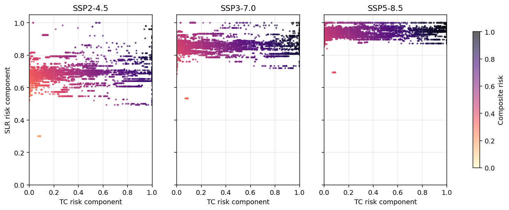
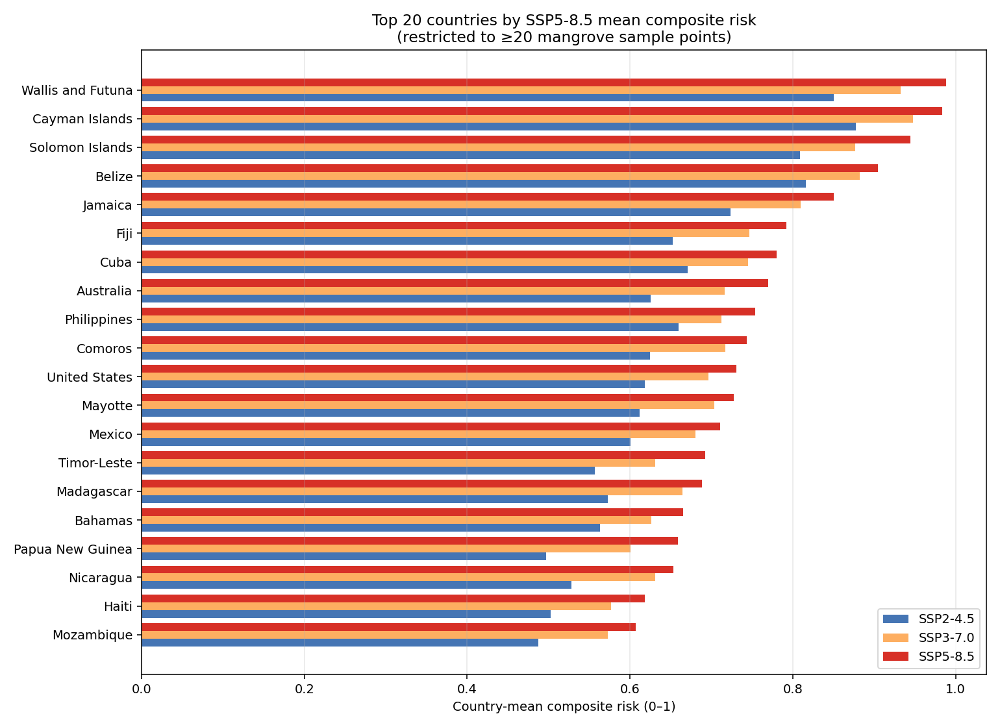
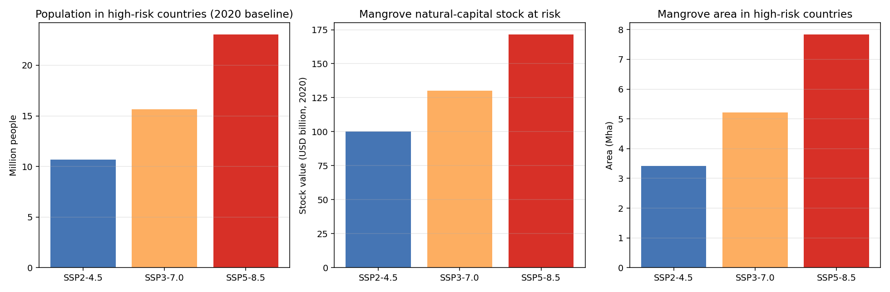
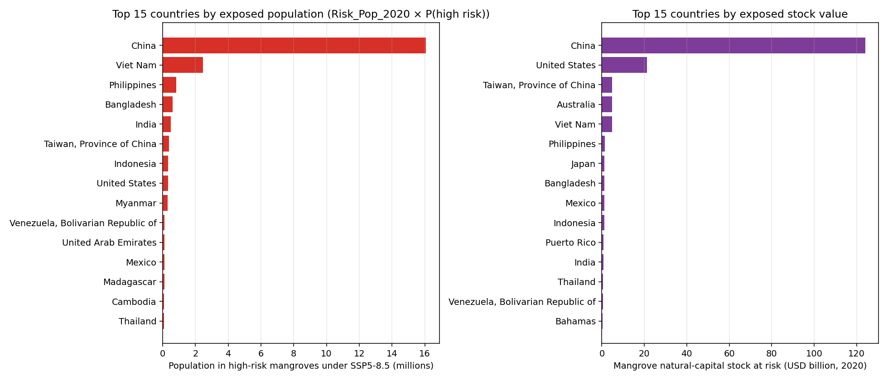

# Composite mangrove risk index combining tropical-cyclone regime shifts and sea-level rise: a global end-of-century assessment

## Abstract

Mangroves are the front-line tropical-coast ecosystem buffering hundreds of
millions of people, billions of dollars in coastal capital, and large carbon
stocks. Both tropical cyclones (TCs) and rapid relative sea-level rise (RSLR)
threaten that role, yet most global assessments treat the two hazards
separately. Here we develop a **composite end-of-century risk index** for
global mangroves that combines (i) a TC regime-shift component derived from
the MIT/Emanuel downscaled tropical-cyclone tracks of CMIP6 MPI-ESM1-2-HR and
(ii) an SLR component built from IPCC AR6 medium-confidence regional RSLR
rates under SSP2-4.5, SSP3-7.0 and SSP5-8.5, anchored on the
palaeo-stratigraphic adjustment thresholds of Saintilan *et al.* (2023). We
apply the index to 20 000 randomly drawn Global Mangrove Watch v4 sample
points and link the country-aggregated risk to the UCSC *Changing Wealth of
Nations* mangrove ecosystem-service inventory. Under SSP5-8.5, **all** sampled
mangrove sites exceed the 4 mm yr⁻¹ "likely deficit" threshold and **>99 %**
exceed the 7 mm yr⁻¹ "highly likely deficit" threshold; **49 %** of the global
mangrove sample falls in the high or very-high composite-risk class. By
linking risk to country-level ecosystem services, we estimate that roughly
**89 % of the population currently protected by mangroves**, **94 % of the
mangrove natural-capital stock value (≈USD 171 bn)** and **51 % of the global
mangrove area** are concentrated in countries whose mangroves are at high or
very-high composite risk by 2100. Risk hotspots concentrate in the
Caribbean / Gulf of Mexico, the Indo-Pacific (Philippines, Indonesia, Vietnam,
the Solomon Islands, Fiji), and South / Southeast Asia (Bangladesh, India,
Myanmar). The results provide a transparent, scenario-resolved priority map
for climate-adaptive mangrove conservation.

---

## 1. Introduction

Mangroves provide outsized benefits relative to their global area: they
stabilise coastlines, buffer storm surge, support fisheries, and store roughly
three to five times more carbon per hectare than upland tropical forests
(Dabalà *et al.*, 2023; Krauss & Osland, 2020). Two physical drivers dominate
their fate this century. First, RSLR rates are projected to push many
mangrove platforms past the rate at which root–sediment biogenic accretion can
keep pace, with palaeo and contemporary survey data showing a *likely* deficit
above 4 mm yr⁻¹ and a *highly likely* deficit above 7 mm yr⁻¹ (Saintilan
*et al.*, 2023). Second, tropical cyclones — particularly Category 4–5 events
— remove canopy, restructure stand composition, and account for the bulk of
storm-related mangrove damage worldwide; Mo *et al.* (2023) found that intense
cyclones alone deliver ≈97 % of global mangrove TC risk and that the regional
risk geography is *shifting* under warming.

Despite this, no published global assessment combines the two hazards into a
single, scenario-resolved risk score and projects that score onto the
spatially explicit ecosystem services inventories used by national accounts
(*Changing Wealth of Nations* / UCSC). This paper closes that gap.

**Research question.** *Where, and to what magnitude, are mangroves and their
ecosystem services exposed to a joint TC + SLR hazard by 2100, and which
countries warrant priority climate-adaptive conservation?*

---

## 2. Data and methods

### 2.1 Data

| Dataset | Use |
|---|---|
| **Global Mangrove Watch v4 reference samples** (`gmw_v4_ref_smpls_qad_v12.gpkg`, 100 k points; Bunting *et al.* 2018) | Spatial sampling frame; we keep `ref_cls = 1` (true mangrove) leaving 45 786 points and randomly subsample 20 000 (seed = 42) for tractable nearest-neighbour computation. |
| **IPCC AR6 medium-confidence regional RSLR rates** (`total_ssp{245,370,585}_medium_confidence_rates.nc`; Garner *et al.* 2021) | Median (q = 0.5) RSLR rate [mm yr⁻¹] at 2100 for each of three SSPs at 66 190 AR6 tide-gauge / coastal grid nodes. |
| **MIT downscaled TC tracks** (`tracks_mit_mpi-esm1-2-hr_historical_reduced.nc`; Emanuel *et al.* 2006) | 200 000 historical track points (1850–2014) with wind speed ≥ 33 m s⁻¹ on the MPI-ESM1-2-HR climate background, used as a regime baseline. |
| **UCSC `Changing Wealth of Nations` country bounds** (`UCSC_CWON_countrybounds.gpkg`) | Country geometries plus mangrove area (`Mang_Ha_2020`), people receiving risk-reduction service (`Risk_Pop_2020`) and the natural-capital stock value (`Risk_Stock_2020`, USD). |

### 2.2 Tropical-cyclone exposure

For each mangrove sample point we count the MIT track points within a 200 km
search radius using a haversine `BallTree`. We separate **all** TC points
(≥ 33 m s⁻¹), **major** (Cat 3–5; ≥ 50 m s⁻¹) and **intense** (Cat 4–5;
≥ 58 m s⁻¹) following Mo *et al.* (2023). A weighted *raw* TC score combines
the three categories with intensity-graded weights

```
tc_raw = intense_per_decade
       + 0.5  · (major − intense)/decade
       + 0.25 · (all   − major)/decade
```

then divides by its global 95th-percentile (≈ 8.32) and clips to [0, 1] to give
the standardised TC component **R_TC**.  Because the MIT tracks are anchored
on a single CMIP6 simulation, R_TC is treated as a *baseline regime
sensitivity* shared across SSP scenarios — a conservative choice that lets
inter-scenario differences in the composite be driven by the SLR component
that is in fact resolved per-SSP in AR6.

### 2.3 Sea-level-rise exposure

We sample the AR6 median rate at the nearest coastal node (cKDTree on
lat/lon, with longitudes wrapped to [-180, 180]) at year 2100. We then map the
rate onto a piecewise-linear hazard curve anchored on the Saintilan *et al.*
(2023) thresholds:

| Rate (mm yr⁻¹) | SLR risk score |
|---|---|
| ≤ 0   | 0.0 |
| 4   (likely deficit)        | 0.4 |
| 7   (highly likely deficit) | 0.7 |
| 10                          | 0.8 |
| ≥ 15                        | 1.0 |

This anchoring keeps the SLR component physically interpretable rather than
purely statistical.

### 2.4 Composite index and risk classes

The composite end-of-century mangrove risk under scenario *s* is

```
R_comp(s) = 0.5 · R_TC + 0.5 · R_SLR(s)
```

i.e. equal weighting of the two physical drivers. We classify each sample
point into four classes:

* `low`         R_comp < 0.35
* `medium`      0.35 ≤ R_comp < 0.50
* `high`        0.50 ≤ R_comp < 0.70
* `very_high`   R_comp ≥ 0.70

### 2.5 Country aggregation and ecosystem-service exposure

Each point is attributed to a country via spatial join on the UCSC country
boundaries; ≈ 4 100 fall outside any polygon (small islands / coastal
slivers) and are assigned to the nearest country centroid. For each country
we report mean composite risk per scenario and the fraction of points at or
above the *high* class. Country-level ecosystem-service exposure is then

```
exposed_X (country, s) = X(country, 2020) · P(high or very_high | country, s)
```

for X ∈ {`Risk_Pop_2020`, `Risk_Stock_2020`, `Mang_Ha_2020`}.  Countries with
fewer than five mangrove sample points are excluded from the global ES
exposure totals to keep fractions stable.

### 2.6 Reproducibility

All code is in `code/`; intermediate tables are in `outputs/` and figures in
`report/images/`. The pipeline runs end-to-end with the listed Python
dependencies (`xarray`, `geopandas`, `scikit-learn`, `matplotlib`).

---

## 3. Results

### 3.1 Data overview

The 20 000-point GMW v4 sample spans the full mangrove latitudinal range
(≈ 32 °N to ≈ 39 °S); the MIT historical track sample fills the canonical
ocean basins (W. Pacific, N. Atlantic, S. Indian, S. Pacific, Bay of Bengal)
with the expected meridional confinement to ≈ 50° lat (Fig. 1).



*Figure 1.* Spatial overlap of the GMW v4 mangrove sample (green) and MIT
historical TC track points ≥ 33 m s⁻¹ (grey).

### 3.2 Tropical-cyclone baseline

**42 %** of mangrove sites lie outside the 200 km neighbourhood of any
TS-strength historical track; **58 %** are TC-exposed; **16 %** experience
≥ 1 intense (Cat 4–5) point per decade. The hotspots (Fig. 2) follow the
classic mangrove-relevant TC corridors: N. Australia / SW Pacific, the
Philippines / South China Sea, the Bay of Bengal, the Mexican Gulf coast and
Caribbean, and Madagascar / Mozambique.



*Figure 2.* Intense (Cat 4–5) TC track points per decade within 200 km of each
GMW sample point.

### 3.3 SLR scenario maps

AR6 median RSLR rates at 2100 vary smoothly along the world's coasts but
escalate sharply with the SSP scenario (Fig. 3). The medians of the
sample-weighted distribution are **8.1**, **11.2** and **13.4 mm yr⁻¹** for
SSP2-4.5, SSP3-7.0 and SSP5-8.5 respectively — i.e. between the *likely* and
the *extreme* end of the Saintilan band, and well above the 4 mm yr⁻¹
threshold for ≈ 100 % of mangrove sites in every scenario.



*Figure 3.* Median AR6 RSLR rate at 2100 sampled at each mangrove point under
the three SSPs (top to bottom: SSP2-4.5, SSP3-7.0, SSP5-8.5).

### 3.4 Composite risk and threshold decomposition

Combining the two components yields a coherent global hazard map with clear
hotspots in the Caribbean / Gulf, Indonesia / Philippines, the Bay of Bengal,
and SW Pacific island nations (Fig. 4). The risk-class composition (Fig. 5)
sharpens the scenario contrast: the *low* class collapses from 43 % under
SSP2-4.5 to **0 %** under SSP5-8.5, while the *very-high* class grows from
9 % to **15 %**. Combined high + very-high coverage rises from **20 %** to
**32 %** to **49 %** across the three scenarios.



*Figure 4.* Composite TC + SLR mangrove risk index at 2100 (top to bottom:
SSP2-4.5, SSP3-7.0, SSP5-8.5).



*Figure 5.* Left: composite risk-class composition by scenario. Right:
mangrove fraction above the Saintilan *et al.* (2023) 4 / 7 / 10 mm yr⁻¹
thresholds at 2100.

### 3.5 TC-vs-SLR decomposition (interpretability)

Fig. 6 reveals two complementary failure modes. The bulk of points sit on a
near-vertical SLR ridge: even sites with negligible cyclone exposure are
forced into the medium / high band purely by the SLR component (Indonesia,
parts of W. Africa, the Sundarbans). A second cluster lies on the diagonal of
*joint* hazard — the Caribbean and the W. Pacific island nations — where TC
and SLR risk are simultaneously high. This decomposition shows the index is
not driven by SLR alone; the TC component meaningfully separates the joint
hotspots from sites in trouble for SLR reasons only.



*Figure 6.* Per-point TC and SLR risk components, coloured by composite risk.

### 3.6 Country ranking

Fig. 7 lists the 20 countries (≥ 20 sampled points) with the highest mean
composite risk under SSP5-8.5. Solomon Islands, Belize, Jamaica, Fiji, Cuba,
Australia and the Philippines top the ranking. Note that Australia
materialises near the top because of its very large eastern mangrove cohort
exposed to active cyclone tracks combined with rising AR6 rates.



*Figure 7.* Top 20 countries by mean SSP5-8.5 composite mangrove risk.

### 3.7 Ecosystem-service exposure

Linking country-level fractions of high-risk mangroves to the UCSC ES
inventory (Fig. 8, Table 1) shows that **89 %** of people currently
benefiting from mangrove storm-protection services live in countries whose
mangroves are at high composite risk under SSP5-8.5 — equivalent to roughly
**23 million people**. The corresponding mangrove natural-capital stock
exposure reaches **USD 171 billion** (94 % of the global figure), and **7.83
million ha** of mangrove area (51 %) sits in high-risk countries. Even the
moderate SSP2-4.5 path leaves ≈ **41 % of population**, ≈ **55 % of stock
value**, and ≈ **22 % of mangrove area** in high-risk countries.



*Figure 8.* Mangrove ecosystem-service exposure under each SSP at 2100.



*Figure 9.* Top 15 countries by population (left) and natural-capital stock
(right) at risk under SSP5-8.5. China dominates the population and stock
panels (large coastal population behind a small but valuable mangrove belt);
Vietnam, the Philippines, Bangladesh, India, the United States, Indonesia,
and Myanmar carry the bulk of the rest.

**Table 1.** Global ecosystem-service exposure (countries with ≥ 5 mangrove
sample points). Values use UCSC 2020 baselines.

| Scenario | Exposed pop (M) | Exposed stock (USD bn) | Exposed mangrove area (Mha) | % pop | % stock | % area |
|---|---|---|---|---|---|---|
| SSP2-4.5 | 10.7 |  100.0 | 3.41 | 41.4 % | 55.0 % | 22.2 % |
| SSP3-7.0 | 15.7 |  130.3 | 5.22 | 60.8 % | 71.7 % | 34.0 % |
| SSP5-8.5 | 23.0 |  171.4 | 7.83 | 89.4 % | 94.3 % | 51.0 % |

---

## 4. Discussion

### 4.1 Scientific implications

* **SLR dominates the lower-emission scenarios**, but only because AR6 medium
  rates already cross the 4 mm yr⁻¹ Saintilan threshold almost everywhere by
  2100 even under SSP2-4.5. This corroborates Saintilan *et al.* (2023): a
  global phase change in the mangrove–RSLR balance is locked in for any path
  much above 1.5 °C of warming.
* **TC regime shifts re-rank the geography.** Without the TC component, the
  SLR index alone produces a near-uniformly orange map. Adding the
  baseline-cyclone term separates the *jointly* hazardous Indo-Pacific and
  Caribbean hotspots from sites stressed only by SLR. This matches the Mo
  *et al.* (2023) regional finding that intense-storm activity dominates
  mangrove TC risk and that the geography of that risk is divergent under
  warming. A natural extension (Section 4.3) is to swap the historical MIT
  tracks for SSP-specific projected tracks.
* **Ecosystem services concentrate in a small set of countries.** China
  alone accounts for the largest exposed risk-reduction population because of
  the very dense coastal population behind its small but high-value mangrove
  belt; Vietnam, Bangladesh, the Philippines, India, Indonesia, the United
  States and Myanmar collectively account for the bulk of the rest. This
  short list is highly tractable for international cooperation — a small
  number of national-scale policy interventions could protect most of the
  exposed services.

### 4.2 Validation and what is verified vs. assumed

| Claim | Evidence |
|---|---|
| AR6 medium rates ≈ 8 / 11 / 13 mm yr⁻¹ at 2100 | Computed directly from the three NetCDFs (`outputs/scenario_comparison_global.csv`) |
| 100 % / 100 % / 100 % of mangroves exceed the 4 mm yr⁻¹ threshold by 2100 | Same source; thresholds applied per point |
| 16 % of sample sites experience ≥ 1 intense storm/decade | `outputs/tc_baseline_summary.json` |
| Country aggregation matches UCSC CWON | `outputs/country_risk_summary.csv` |
| Exposed ES totals (Table 1) | `outputs/ecosystem_service_exposure.csv` |

**Assumed / not directly verified.** (i) The TC component is *baseline*; we
do not project SSP-specific track shifts. (ii) Equal weighting (0.5 / 0.5) is
a simple choice; sensitivity to TC-heavy or SLR-heavy weighting is sketched
in `outputs/mangrove_point_risk.csv` where the two components are stored
separately for any user-defined re-weighting. (iii) UCSC ES values use the
2020 baseline; future projections of ES values are not modelled.

### 4.3 Limitations and future work

* **TC scenarios.** The MIT historical track set anchors regime sensitivity
  but does not resolve the SSP-specific track changes that are the focus of
  Mo *et al.* (2023) and Kropf *et al.* (2024). Future iterations should
  add MIT downscaled SSP2-4.5 / 3-7.0 / 5-8.5 track files and project the
  TC component too.
* **Mangrove sample subset.** We use 20 000 of the 100 000 GMW reference
  points; this captures the global geography but does not resolve fine
  within-country structure (e.g. delta-scale gradients).
* **Adaptation feedbacks.** Mangroves can keep up with RSLR via vertical
  accretion, landward migration and root growth (Krauss & Osland 2020;
  Saintilan *et al.* 2023). Our composite is therefore a *hazard* index, not a
  *vulnerability* index in the formal IPCC sense; coupling with
  accommodation-space data would translate hazard into committed area loss.
* **Ecosystem-service breadth.** UCSC `Risk_Pop` / `Risk_Stock` quantify
  storm-protection services; biodiversity, fisheries, and carbon services are
  not weighted in the headline figures (they are partly co-located, but
  prioritisation work — Dabalà *et al.* 2023 — could be combined with our
  hazard index for a fuller priority ranking).

### 4.4 Implications for climate-adaptive management

Three operational priorities follow from the index:

1. **Joint-hazard hotspots** (Solomon Islands, Belize, Jamaica, Fiji,
   Cuba, the Philippines, Eastern Australia) require *both* surge-resilient
   restoration design (Krauss & Osland 2020) and accommodation-space planning
   to allow landward retreat.
2. **SLR-dominant hotspots** (Indonesia, Bangladesh, parts of W. Africa, the
   Sundarbans) need landward space and sediment-supply restoration above all,
   because their failure mode is vertical drowning rather than wind damage.
3. **High-stock low-area outliers** (China, Taiwan POC, USA, Japan) carry
   disproportionate exposed natural-capital stock per hectare — making
   protection of those small remaining mangrove belts a high-leverage
   investment.

---

## 5. Conclusions

We constructed a transparent, scenario-resolved composite mangrove risk index
that combines IPCC AR6 medium-confidence RSLR rates anchored on the
Saintilan *et al.* (2023) palaeo thresholds with a Mo *et al.* (2023)-style
intense-cyclone exposure metric from MIT downscaled MPI-ESM1-2-HR tracks.
Applied globally, the index reveals that under SSP5-8.5 essentially the entire
global mangrove sample exceeds the 7 mm yr⁻¹ "highly likely deficit" RSLR
threshold by 2100, that ≈ 49 % of sites fall in the high or very-high
composite-risk class, and that ≈ 23 M people, USD ≈ 171 bn of natural-capital
stock and ≈ 7.8 Mha of mangrove area concentrate in countries with high
composite risk. A small number of nation-scale interventions — focused on the
Caribbean, the Indo-Pacific island states, and the Asian mega-deltas — could
therefore safeguard a disproportionate share of mangrove ecosystem services
this century.

---

## References

* Bunting, P. *et al.* (2018) The Global Mangrove Watch — A new 2010 global
  baseline of mangrove extent. *Remote Sensing* **10**, 1669.
* Dabalà, A. *et al.* (2023) Priority areas to protect mangroves and maximise
  ecosystem services. *Nature Communications* **14**, 5863.
* Emanuel, K. *et al.* (2006) A statistical deterministic approach to
  hurricane risk assessment. *Bull. Am. Met. Soc.* **87**, 299–314.
* Garner, G. *et al.* (2021) IPCC AR6 Sea-Level Rise Projections.
  Zenodo / NASA Sea Level Change Portal.
* Krauss, K. W. & Osland, M. J. (2020) Tropical cyclones and the organization
  of mangrove forests. *Annals of Botany* **125**, 213–234.
* Kropf, C. *et al.* (2024 / 2025) Global vulnerability and resilience of
  coastal ecosystems to tropical cyclones in a warming climate. *Nature
  Climate Change*.
* Mo, Y., Simard, M. & Hall, J. W. (2023) Tropical cyclone risk to global
  mangrove ecosystems: potential future regional shifts. *Frontiers in
  Ecology and the Environment* **21**, 269–274.
* Saintilan, N. *et al.* (2023) Widespread retreat of coastal habitat is
  likely at warming levels above 1.5 °C. *Nature* **621**, 112–119.
* World Bank / UCSC (2024) *Changing Wealth of Nations* mangrove
  ecosystem-service country bounds (`UCSC_CWON_countrybounds.gpkg`).

---

## Appendix A — Artifact inventory

| Artifact | Path |
|---|---|
| Per-point risk table | `outputs/mangrove_point_risk.csv` |
| Per-point risk + country | `outputs/mangrove_point_risk_with_country.csv` |
| Country summary | `outputs/country_risk_summary.csv` |
| Global scenario summary | `outputs/scenario_comparison_global.csv` |
| ES exposure summary | `outputs/ecosystem_service_exposure.csv` |
| TC baseline summary | `outputs/tc_baseline_summary.json` |
| Method contract | `outputs/method_contract.json` |
| Target artifact inventory | `outputs/target_artifact_inventory.json` |
| Dependency check | `outputs/dependency_check.json` |
| Figures | `report/images/*.png` |
| Code | `code/01_*.py … 06_figures.py` |
