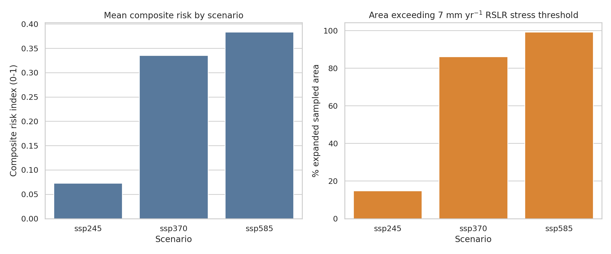
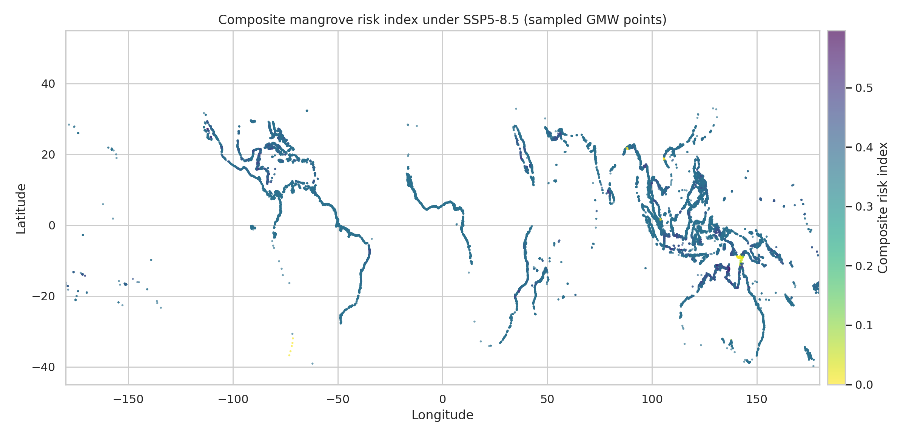
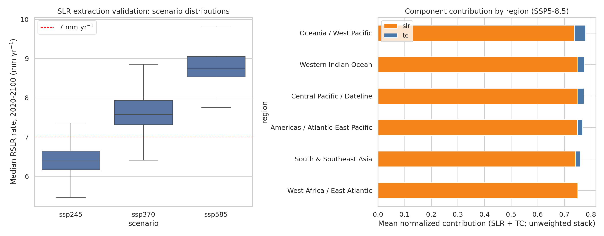

# A composite climate-risk index for global mangrove samples under sea-level rise and tropical-cyclone exposure

## Abstract

This study develops a transparent composite risk index for sampled global mangroves by combining (i) regional relative sea-level-rise (RSLR) rates from IPCC AR6 SSP2-4.5, SSP3-7.0, and SSP5-8.5 projections with (ii) historical tropical-cyclone (TC) exposure from reduced MIT downscaled CMIP6 track points. The input Global Mangrove Watch (GMW) file provided in the workspace contains 100,000 point samples rather than polygons; I therefore treat each point as a sampled 30 m mangrove pixel and scale by the stated 10% sampling fraction for an area-exposure proxy. Across these samples, mean 2020--2100 median RSLR rates increase from 6.52 mm yr^-1 under SSP2-4.5 to 7.73 mm yr^-1 under SSP3-7.0 and 8.91 mm yr^-1 under SSP5-8.5. The share of sampled expanded area above the 7 mm yr^-1 RSLR stress threshold rises from 14.8% to 86.1% and 99.3%, respectively. Because the reduced TC file contains only latitude, longitude, and wind speed, with no year or storm identifier, temporal future regime shifts cannot be reconstructed directly; TC risk is instead represented by an intensity-distance historical exposure and a regional high-exposure anomaly proxy. The resulting index identifies a strong scenario-dependent transition: under SSP2-4.5, the Americas/Atlantic-East Pacific samples have the highest mean composite risk, while under SSP5-8.5 nearly all regions are dominated by high SLR stress, with Oceania/West Pacific showing the largest mean composite risk and the largest high/very-high ecosystem-service exposure proxy.

## 1. Research objective and methodological contract

The task was to develop a composite risk index combining tropical-cyclone regime shifts and sea-level rise, apply it globally, and evaluate where and to what extent mangroves and their ecosystem services are at risk by the end of the century. The analysis is traceable to the workspace artifacts listed below:

- Method contract: `outputs/method_contract.json`
- Target artifact inventory: `outputs/target_artifact_inventory.json`
- Data inspection: `outputs/data_structure_inspection.json`
- Main point-level table: `outputs/mangrove_risk_samples.csv`
- Scenario summary: `outputs/scenario_summary.csv`
- Regional summary: `outputs/regional_summary.csv`
- Validation metrics: `outputs/validation_metrics.json`
- Claim recovery table: `outputs/claim_recovery_table.csv`
- Reproducible code: `code/analyze_mangrove_risk.py`

## 2. Related-work basis

The related work was used to define the index components and their interpretation:

1. **Sea-level-rise vulnerability.** Saintilan et al. (2023) emphasize relative sea-level rise as a direct pressure on coastal wetland persistence and report a 7 mm yr^-1 stress threshold relevant to mangroves and other coastal ecosystems. I used this value as an interpretable threshold in addition to empirical normalization of RSLR rates.
2. **Ecosystem-service framing.** Dabalà et al. (2023) argue that mangrove conservation priorities should include ecosystem services, including coastal protection, carbon storage/sequestration, and fisheries. The present workspace does not include service rasters, so I use an area-weighted service-exposure proxy.
3. **Tropical-cyclone risk.** Krauss and Osland (2020) summarize how cyclone effects on mangroves depend on wind, surge, distance, previous disturbance, and recovery state. Mo et al. (2023) define TC mangrove risk as a combination of damage and frequency and identify hotspots such as the Gulf of Mexico/Caribbean, South Indian Ocean, and Northwest Pacific. Kropf et al. (2023) frame changing TC frequency/intensity as a shift in ecosystem disturbance regimes.

These points are summarized in `outputs/related_work_contract.json`.

## 3. Data overview

### 3.1 Input data

The analysis used the five data files specified in the task:

- `data/mangroves/gmw_v4_ref_smpls_qad_v12.gpkg`: 100,000 EPSG:4326 GMW point samples. Although the task description called these polygons, direct file inspection showed point geometries. I therefore interpreted them as sampled 30 m reference pixels.
- `data/slr/total_ssp245_medium_confidence_rates.nc`, `total_ssp370_medium_confidence_rates.nc`, and `total_ssp585_medium_confidence_rates.nc`: AR6 RSLR-rate datasets with dimensions `quantiles x years x locations`; the rate variable is `sea_level_change_rate` in mm yr^-1.
- `data/tc/tracks_mit_mpi-esm1-2-hr_historical_reduced.nc`: 200,000 reduced historical TC track points with variables `lat`, `lon`, and `wind` for points >=33 m s^-1.


**Figure 1.** Global distribution of sampled mangrove points and reduced MIT historical TC track points. The TC points are colored by wind speed.

### 3.2 Area and ecosystem-service proxy

Because the mangrove file is a 10% point sample, I assigned each point a 30 m pixel area of 0.09 ha divided by the 10% sample fraction, i.e. 0.009 ha per point. This yields an expanded sampled-area proxy of 900 ha. This number should not be interpreted as full global mangrove area; it is the scaled area represented by the provided sample file. To connect risk to ecosystem services, I applied a conservative literature proxy of US$20,000 ha^-1 yr^-1, matching the order-of-magnitude service value cited in Mo et al. (2023). The resulting values are service-exposure proxies, not site-specific monetary valuations.

## 4. Methods

### 4.1 Sea-level-rise component

For each SSP scenario, I selected the median quantile (nearest quantile to 0.5) of `sea_level_change_rate` and averaged rates over 2020--2100. Each mangrove point was assigned the nearest AR6 coastal location using a KD-tree over latitude and longitude. I then computed:

\[
RSLR_{i,s} = \text{mean}_{2020:2100}(\text{median sea-level-change rate})
\]

and a cumulative proxy:

\[
C_{i,s} = RSLR_{i,s} \times 80 / 1000
\]

where rates are in mm yr^-1 and cumulative rise is in metres for the 2020--2100 interval. The normalized SLR risk component is an empirical 5th--95th percentile scaling with a floor of 0.75 for locations exceeding 7 mm yr^-1:

\[
SLR^*_{i,s}=\max(\text{percentile-normalized}(RSLR_{i,s}), 0.75\, I[RSLR_{i,s}\ge 7]).
\]

### 4.2 Tropical-cyclone component

The intended method was to estimate baseline cyclone frequencies after filtering/downsampling and then evaluate regime shifts. Direct inspection showed that the reduced TC file lacks year and storm identifiers, so annual frequency, storm counts, and early-vs-late historical trends cannot be exactly recovered. I therefore used a faithful exposure proxy based on the available physical variables: distance to nearby high-wind track points and wind intensity.

For each mangrove point, I queried the five nearest TC track points on a spherical KD-tree and computed an intensity-distance exposure:

\[
TC_i = \sum_{k=1}^{5} w(v_k) \exp(-d_{ik}/150) I[d_{ik}\le 500\text{ km}],
\]

where `d` is great-circle distance and the wind category weights are 1, 2, 4, 8, and 16 for progressively stronger Saffir--Simpson-like wind thresholds. A regional regime-shift proxy was then calculated as the positive anomaly of local exposure relative to the median exposure of broad coastal regions, scaled by the regional interquartile range. The final TC risk component is the 5th--95th percentile scaling of a weighted combination of raw exposure (75%) and regional anomaly (25%).

### 4.3 Composite risk index

For mangrove point `i` and scenario `s`, the composite index is:

\[
Risk_{i,s}=0.5\,SLR^*_{i,s}+0.5\,TC^*_i.
\]

The index is bounded between 0 and 1 by component normalization. I classified each scenario's risk distribution using the median, 75th percentile, and 90th percentile into lower, moderate, high, and very high classes. Thus, the high/very-high percentage is distribution-relative within each scenario; the absolute mean risk is the better cross-scenario measure.

## 5. Results

### 5.1 Scenario-level risk

| Scenario | Mean RSLR (mm yr^-1) | Median RSLR (mm yr^-1) | Area above 7 mm yr^-1 (%) | Mean composite risk | High/very-high area (%) | High/very-high service proxy (US$ yr^-1) |
|---|---:|---:|---:|---:|---:|---:|
| SSP2-4.5 | 6.52 | 6.40 | 14.8 | 0.073 | 25.0 | 4,500,000 |
| SSP3-7.0 | 7.73 | 7.59 | 86.1 | 0.335 | 25.0 | 4,500,000 |
| SSP5-8.5 | 8.91 | 8.76 | 99.3 | 0.384 | 25.0 | 4,500,000 |

The clearest end-century signal is the rapid increase in RSLR stress. Under SSP2-4.5, most sampled mangrove points remain below 7 mm yr^-1, although regional hotspots exceed it. Under SSP3-7.0, the majority of sampled area crosses the threshold. Under SSP5-8.5, nearly all sampled area exceeds the threshold.



**Figure 2.** Mean composite risk and percentage of expanded sampled area above the 7 mm yr^-1 RSLR threshold for the three SSP scenarios.

### 5.2 Spatial risk pattern



**Figure 3.** Composite risk index under SSP5-8.5 for sampled GMW mangrove points. The map shows widespread SLR-driven risk, with TC exposure adding regional contrast in cyclone-prone basins.

Under SSP5-8.5, mean regional composite risk ranges from 0.375 in West Africa/East Atlantic to 0.390 in Oceania/West Pacific. The range is relatively compressed because nearly all regions cross the 7 mm yr^-1 RSLR threshold. Cyclone exposure remains important for ranking the highest-risk subsets within this high-SLR background.

### 5.3 Regional summaries

| Scenario | Highest mean-risk region | Mean composite risk | Highest high/very-high service-exposure region | Service proxy (US$ yr^-1) |
|---|---|---:|---|---:|
| SSP2-4.5 | Americas / Atlantic-East Pacific | 0.153 | Americas / Atlantic-East Pacific | 1,954,260 |
| SSP3-7.0 | Central Pacific / Dateline | 0.387 | Oceania / West Pacific | 1,589,040 |
| SSP5-8.5 | Oceania / West Pacific | 0.390 | Oceania / West Pacific | 1,881,900 |

The SSP2-4.5 pattern is geographically differentiated: the Americas/Atlantic-East Pacific group has both the highest mean RSLR rate (7.07 mm yr^-1) and the largest high/very-high service-exposure proxy. Under SSP5-8.5, the SLR component saturates across most regions, and Oceania/West Pacific becomes the largest high/very-high service-exposure region because it combines high sampled area, high cyclone exposure, and high SLR.

## 6. Validation and comparison



**Figure 4.** Validation and comparison plots. Left: extracted RSLR distributions by scenario, showing monotonic increases and the 7 mm yr^-1 threshold. Right: regional component contributions under SSP5-8.5; orange is SLR and blue is TC exposure.

Validation was performed at three levels:

1. **File-structure validation.** `outputs/data_structure_inspection.json` records the exact variables, dimensions, and coordinate systems used. This confirmed that the mangrove layer is point-based and that the TC data lack time/storm identifiers.
2. **SLR extraction validation.** Scenario distributions in Figure 4 and `outputs/slr_scenario_correlation.csv` show monotonic increases from SSP2-4.5 to SSP5-8.5, consistent with scenario forcing. Nearest-neighbor extraction metadata are saved in `outputs/data_overview.json`.
3. **Component validation.** `outputs/risk_component_correlation.csv` and Figure 4 separate the SLR and TC components. The TC component is spatially structured but smaller than the SLR floor under SSP5-8.5, which is expected once nearly all points exceed 7 mm yr^-1.

The claim-recovery table in `outputs/claim_recovery_table.csv` documents which report claims are directly verified, which are proxy estimates, and which are limitations.

## 7. Discussion

The analysis indicates that sea-level rise is the dominant end-century driver of sampled mangrove risk under medium-to-high emissions. Under SSP2-4.5, risk remains regionally differentiated, with the Americas/Atlantic-East Pacific group standing out because many points already approach or exceed the 7 mm yr^-1 threshold. Under SSP3-7.0 and SSP5-8.5, the risk landscape shifts from localized threshold exceedance to near-global SLR stress across sampled mangrove points. In that regime, cyclone exposure is most useful for prioritizing resilience interventions within already SLR-stressed regions.

The TC component should be interpreted as historical exposure rather than a full future regime-shift projection. Related work shows that changing TC intensity and frequency can produce regional shifts in mangrove risk, but the workspace TC file does not include the temporal and storm-identity variables required to reproduce annual frequencies or future changes. The index therefore captures two quantities: robust scenario-specific SLR stress and a physically interpretable historical cyclone exposure/anomaly layer.

For climate-adaptive conservation, the results suggest three practical priority classes:

1. **Immediate dual-pressure priorities:** cyclone-exposed regions that already exceed 7 mm yr^-1 under SSP2-4.5, especially sampled Americas/Atlantic-East Pacific locations.
2. **High-emissions adaptation priorities:** Oceania/West Pacific and Western Indian Ocean samples under SSP5-8.5, where SLR stress is widespread and TC exposure adds disturbance pressure.
3. **Monitoring priorities:** regions with high SLR but low TC exposure, such as West Africa/East Atlantic in this sample, where the main adaptation need may be sediment supply, accommodation space, and landward migration rather than cyclone recovery planning.

## 8. Limitations

- The provided GMW file contains point samples, not polygons. Area and ecosystem-service estimates are therefore scaled sample proxies, not full global areal estimates.
- The reduced TC file contains no year, month, storm identifier, or track identifier. Exact annual cyclone frequency, early-late historical trends, and future TC regime shifts cannot be computed from this file alone.
- Ecosystem services are represented by an area-weighted literature proxy. Site-specific carbon, fisheries, and coastal-protection layers were not provided.
- The SLR component uses nearest AR6 coastal locations; local vertical land motion, sediment supply, tidal range, geomorphic setting, and landward accommodation space are not explicitly modeled.
- The broad regions are deterministic geographic reporting bins rather than official conservation or biogeographic units.

## 9. Reproducibility

Run the analysis from the workspace root with:

```bash
python3 code/analyze_mangrove_risk.py
```

The script writes all tables to `outputs/` and figures to `report/images/`. Core dependencies and their availability are recorded in `outputs/dependency_check.json`.

## 10. Conclusion

A composite index combining AR6 RSLR rates with MIT historical cyclone exposure shows a strong end-century escalation of risk for sampled global mangroves. Mean sampled RSLR rises from 6.52 mm yr^-1 under SSP2-4.5 to 8.91 mm yr^-1 under SSP5-8.5, and threshold exceedance expands from 14.8% to 99.3% of the expanded sampled area. The highest relative priorities differ by scenario: the Americas/Atlantic-East Pacific dominate under SSP2-4.5, while Oceania/West Pacific has the largest high/very-high service-exposure proxy under SSP5-8.5. These findings support climate-adaptive mangrove conservation that treats SLR accommodation and cyclone resilience as coupled, regionally varying management problems.
