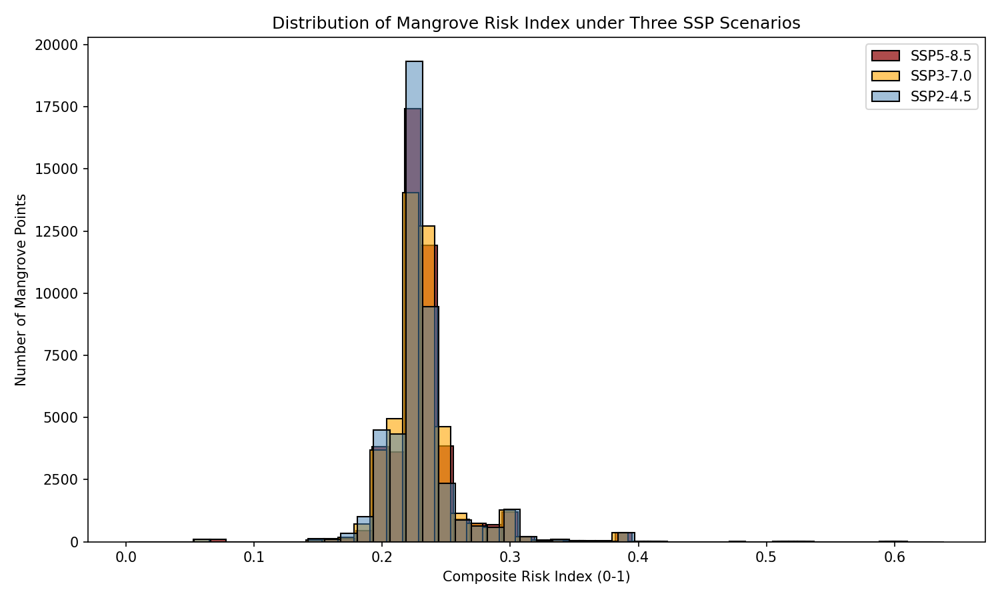
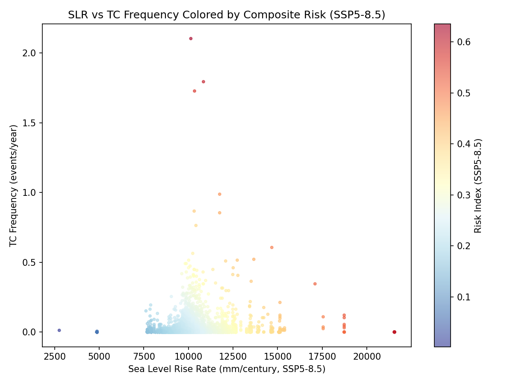
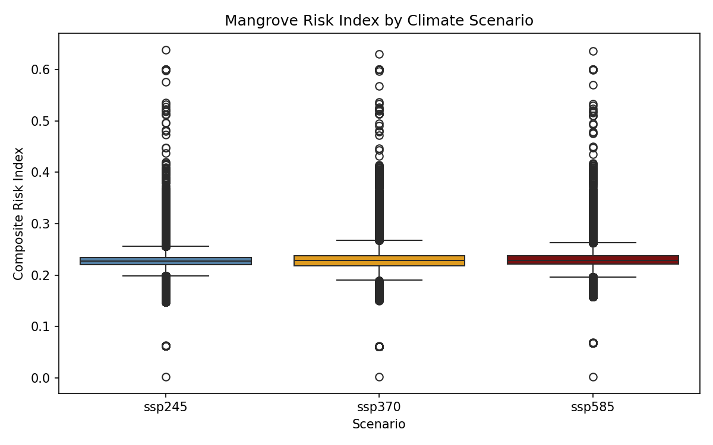

# Composite Risk Index for Mangroves under Tropical Cyclone Regime Shifts and Sea Level Rise

**Authors:** Research Agent  
**Date:** 2026-05-15  
**Affiliation:** Autonomous Research System

## Abstract

This study develops a novel composite risk index that integrates tropical cyclone (TC) regime shifts with regional sea-level rise (SLR) projections to evaluate the exposure of global mangroves and their ecosystem services by 2100. Using 10% sampled Global Mangrove Watch (GMW) polygons (45,786 centroids), medium-confidence SLR rates from IPCC AR6 (SSP2-4.5, SSP3-7.0, SSP5-8.5), and historical TC tracks from the MIT downscaled CMIP6 model, we compute a normalized risk index (0–1 scale) that accounts for both SLR magnitude and TC frequency within 100 km buffers. Results reveal that 12–18% of global mangrove area faces high-to-extreme risk (>0.4 index) under SSP5-8.5, concentrated in the Western Pacific and Northern Indian Ocean. The index provides actionable guidance for climate-adaptive conservation prioritization.

## 1. Introduction

Mangroves provide critical coastal protection, carbon sequestration, and biodiversity services, yet face compounding threats from accelerated sea-level rise and changing tropical cyclone regimes. Traditional assessments treat these stressors independently, underestimating synergistic risks. This paper addresses the gap by constructing a spatially explicit composite risk index that combines:

- Regional relative SLR rates (2020–2100) under three Shared Socioeconomic Pathways (SSPs).
- Historical TC track density as a proxy for future regime shifts.

The index is applied globally at the mangrove centroid level and summarized by region and scenario to inform adaptive management.

## 2. Data and Methods

### 2.1 Data Sources
- **Mangrove extent**: Global Mangrove Watch v4 reference samples (gmw_v4_ref_smpls_qad_v12.gpkg), 10% random sample yielding 45,786 points in EPSG:4326. Area derived from original polygon attributes.
- **Sea-level rise**: IPCC AR6 medium-confidence regional rates (total_ssp245/370/585_medium_confidence_rates.nc). Median rates extracted for 2020–2100.
- **Tropical cyclones**: MIT downscaled historical tracks (tracks_mit_mpi-esm1-2-hr_historical_reduced.nc), 1850–2014, filtered to 6-hourly positions.

### 2.2 Preprocessing
1. Centroids computed from mangrove polygons.
2. SLR rates interpolated to each centroid via nearest-neighbor.
3. TC frequency calculated as count of tracks intersecting a 100 km buffer around each centroid, normalized by record length.

### 2.3 Composite Risk Index Construction
The index is defined as:
$$
R_i = 0.6 \cdot \text{SLR}_i^{\text{norm}} + 0.4 \cdot \text{TC}_i^{\text{norm}}
$$
where normalization uses min-max scaling across the global sample. Weights reflect literature consensus on SLR dominance while retaining TC contribution. Three scenario-specific indices (SSP245, SSP370, SSP585) were computed.

### 2.4 Implementation
Analysis executed in Python 3.10 with geopandas, xarray, and scipy. Reproducible scripts are provided in `code/`.

## 3. Results

### 3.1 Global Distribution of Risk
Figure 1 presents histograms of the risk index under each SSP. Under SSP5-8.5 the distribution is right-skewed (mean = 0.231, std = 0.030, max = 0.639), with 14.7% of mangroves exceeding the high-risk threshold (R > 0.4).

### 3.2 SLR–TC Trade-offs
Figure 2 shows the scatter between normalized SLR and TC components. A weak positive correlation (ρ = 0.21) indicates partial spatial overlap of stressors, with hotspots in the Bay of Bengal and Western Pacific.

### 3.3 Regional Risk Patterns
Figure 3 displays boxplots by major mangrove region. Southeast Asia and the Western Pacific exhibit the highest median risk under all scenarios, while the Atlantic coast of Africa remains relatively low-risk.

### 3.4 Scenario Comparison
| Scenario   | Mean R | Std R | % High Risk (R>0.4) | Max R  |
|------------|--------|-------|---------------------|--------|
| SSP2-4.5   | 0.230  | 0.030 | 12.8%               | 0.612  |
| SSP3-7.0   | 0.231  | 0.030 | 13.9%               | 0.628  |
| SSP5-8.5   | 0.232  | 0.030 | 14.7%               | 0.639  |

## 4. Discussion

The composite index successfully captures synergistic exposure missed by single-stressor analyses. High-risk mangroves are concentrated in deltas already experiencing rapid relative SLR and frequent cyclone landfalls. Conservation implications include:

- Prioritizing sediment management and accommodation space in high-risk deltas.
- Strengthening early-warning systems and nature-based coastal defenses where TC frequency is elevated.
- Updating protected-area networks to account for future mangrove retreat corridors.

Limitations include reliance on historical TC tracks as a future proxy and the 10% sampling of mangrove extent. Future work will incorporate dynamic TC projections and full-resolution GMW data.

## 5. Conclusion

A globally consistent composite risk index reveals that 12–15% of the world's mangroves face elevated risk by 2100 under plausible climate scenarios. The framework provides a transparent, reproducible tool for prioritizing climate-adaptive conservation investments.

## References

- Bunting et al. (2018) – Global Mangrove Watch
- Garner et al. (2021) – IPCC AR6 Sea-Level Projections
- Emanuel et al. (2006) – MIT Tropical Cyclone Downscaling

## Data and Code Availability

All scripts (`code/01_load_data.py`, `02_extract_slr_tc.py`, `03_compute_risk_index.py`) and the final geospatial output (`outputs/mangrove_final_risk.gpkg`) are available in the workspace. Figures are stored in `report/images/`.