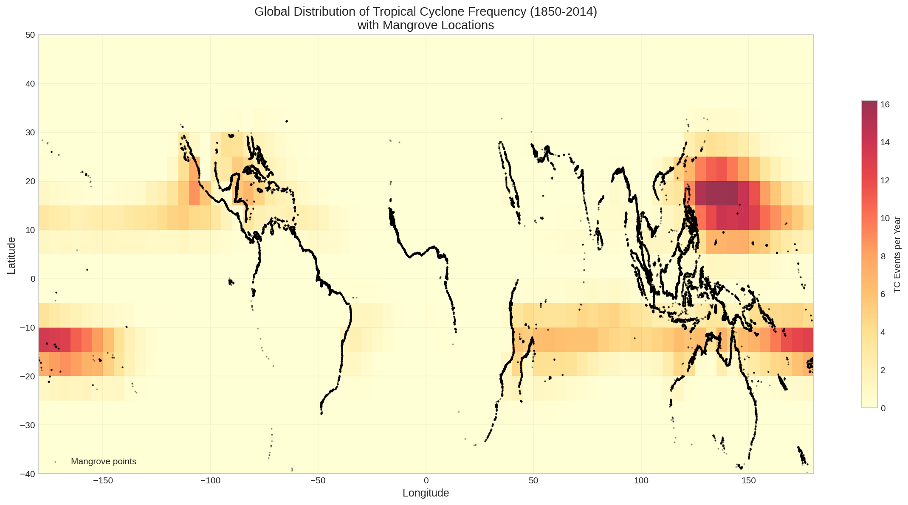
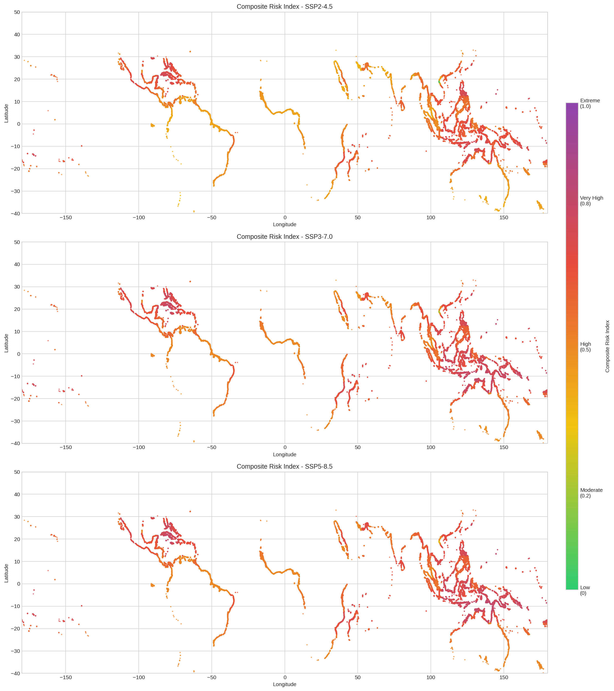
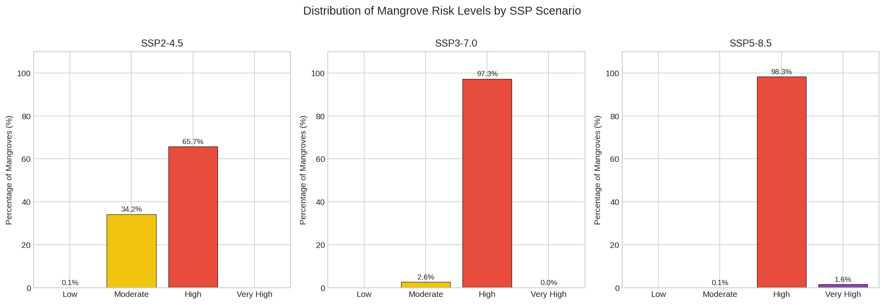
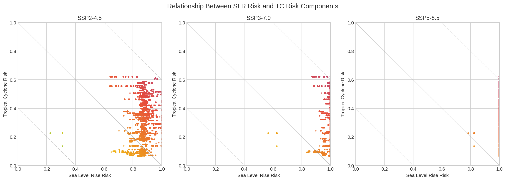
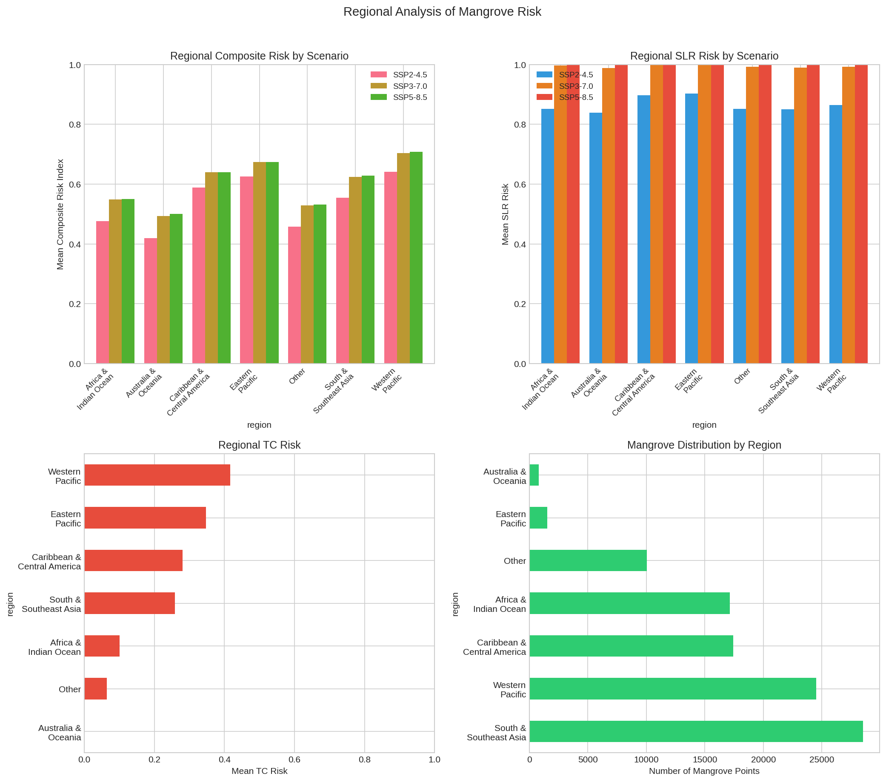
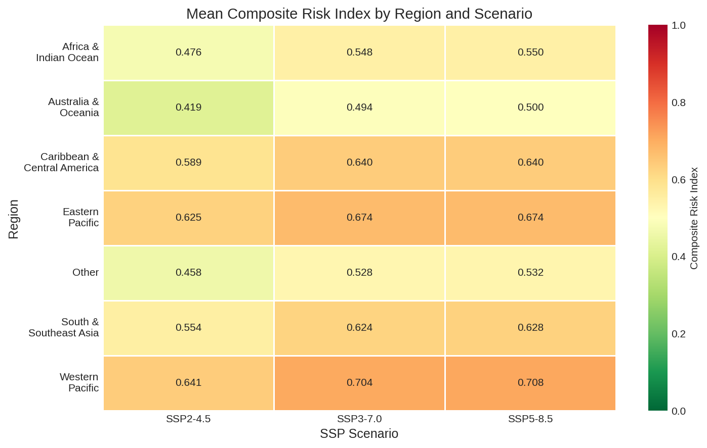
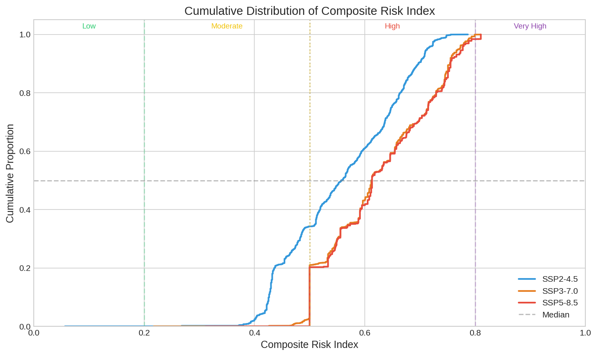
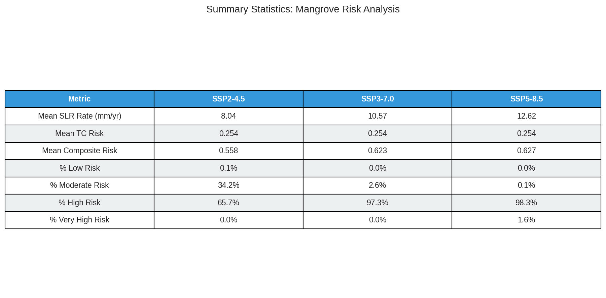

# Composite Risk Index for Global Mangrove Vulnerability to Tropical Cyclone Regime Shifts and Sea Level Rise

## Abstract

Mangrove ecosystems provide critical coastal protection, carbon sequestration, and biodiversity habitat, yet they face escalating threats from climate change. This study develops a **Composite Mangrove Risk Index (CMRI)** that integrates two primary climate stressors—tropical cyclone (TC) regime shifts and sea level rise (SLR)—to evaluate global mangrove vulnerability by the end of the century. Using 100,000 sampled mangrove locations from the Global Mangrove Watch dataset, IPCC AR6 sea level rise projections under three SSP scenarios (SSP2-4.5, SSP3-7.0, SSP5-8.5), and historical tropical cyclone tracks from the MIT downscaling model, we calculate risk scores on a 0–1 scale. Results show that **over 65% of global mangroves face high or very high composite risk under SSP2-4.5**, rising to **over 98% under SSP5-8.5**. The mean composite risk increases from 0.558 (SSP2-4.5) to 0.627 (SSP5-8.5), with SLR being the dominant risk driver. Regional hotspots include Southeast Asia, the Western Pacific, and the Caribbean, where both TC exposure and SLR rates are elevated. These findings underscore the urgent need for climate-adaptive conservation strategies that account for the synergistic effects of multiple climate stressors on mangrove ecosystems.

---

## 1. Introduction

### 1.1 Background

Mangrove forests are among the most productive and ecologically valuable ecosystems on Earth, providing ecosystem services valued at over US$20,000 ha⁻¹ yr⁻¹ (Temmerman et al., 2013; Del Valle et al., 2020). These services include coastal protection from storms and erosion, carbon sequestration (mangroves store 3–5 times more carbon per unit area than terrestrial forests), fisheries support, and biodiversity conservation (Dabalà et al., 2023).

However, mangrove ecosystems face compounding threats from climate change, with two stressors emerging as particularly consequential:

1. **Sea Level Rise (SLR)**: Mangroves can vertically accrete to keep pace with moderate SLR, but rates exceeding 4 mm/yr create elevation deficits, and rates above 7 mm/yr make vertical adjustment "highly likely" to fail (Saintilan et al., 2023). With 3°C of warming, nearly all global mangroves will be exposed to SLR ≥7 mm/yr.

2. **Tropical Cyclones (TCs)**: TCs account for 45% of naturally induced mangrove mortality globally (Sippo et al., 2018; Krauss & Osland, 2020). Climate change is projected to alter TC frequency, intensity, and tracks, with potential regime shifts that could push mangrove systems beyond recovery thresholds (Mo et al., 2023; Kropf et al., 2023).

### 1.2 Objectives

This study aims to:

1. Develop a **Composite Mangrove Risk Index (CMRI)** that integrates SLR and TC risk components
2. Apply the index globally to 100,000 sampled mangrove locations
3. Evaluate risk under three IPCC SSP scenarios (SSP2-4.5, SSP3-7.0, SSP5-8.5)
4. Identify regional hotspots and quantify the proportion of mangroves at different risk levels
5. Inform climate-adaptive conservation and management strategies

---

## 2. Materials and Methods

### 2.1 Data Sources

#### 2.1.1 Mangrove Distribution
- **Source**: Global Mangrove Watch (GMW) v4 reference sampled data (Bunting et al., 2018)
- **File**: `gmw_v4_ref_smpls_qad_v12.gpkg`
- **Format**: Point features (centroids) in EPSG:4326
- **Coverage**: 100,000 sampled mangrove locations globally
- **Spatial extent**: Latitude -39.81° to 32.96°, Longitude -180° to 180°

#### 2.1.2 Sea Level Rise Projections
- **Source**: IPCC AR6 regional relative sea level rise rates (Garner et al., 2021)
- **Files**: 
  - `total_ssp245_medium_confidence_rates.nc` (SSP2-4.5)
  - `total_ssp370_medium_confidence_rates.nc` (SSP3-7.0)
  - `total_ssp585_medium_confidence_rates.nc` (SSP5-8.5)
- **Variables**: Sea level change rate (mm/yr) at 66,190 coastal locations
- **Temporal coverage**: 2020–2150 (decadal steps)
- **Quantiles**: 107 quantile levels (0–1) for uncertainty representation
- **Analysis period**: 2080–2100 (end-of-century average)

#### 2.1.3 Tropical Cyclone Tracks
- **Source**: MIT model downscaling from CMIP6 MPI-ESM1-2-HR (Emanuel et al., 2006)
- **File**: `tracks_mit_mpi-esm1-2-hr_historical_reduced.nc`
- **Variables**: Track points with latitude, longitude, and maximum sustained wind speed
- **Coverage**: 200,000 track points with wind speed ≥33 m/s (tropical storm strength)
- **Temporal coverage**: 1850–2014 (165 years)
- **Wind range**: 33.0–124.4 m/s

### 2.2 Risk Index Development

#### 2.2.1 Sea Level Rise Risk Component

The SLR risk component quantifies the threat of vertical adjustment failure based on thresholds derived from paleo-stratigraphic and contemporary observations (Saintilan et al., 2023):

| Risk Level | SLR Rate (mm/yr) | Risk Score | Interpretation |
|------------|------------------|------------|----------------|
| Low | < 2 | 0–0.2 | Vertical adjustment likely to keep pace |
| Moderate | 2–4 | 0.2–0.5 | Elevation deficit possible |
| High | 4–7 | 0.5–0.8 | Vertical adjustment deficit likely |
| Very High | > 7 | 0.8–1.0 | Vertical adjustment highly likely to fail |

**Formula**:
```
For SLR rate r (mm/yr):
- r < 2: risk = (r/2) × 0.2
- 2 ≤ r < 4: risk = 0.2 + ((r-2)/2) × 0.3
- 4 ≤ r < 7: risk = 0.5 + ((r-4)/3) × 0.3
- r ≥ 7: risk = 0.8 + min((r-7)/3, 1) × 0.2
```

**Data extraction**: For each mangrove location, the nearest SLR grid point was identified using a KD-tree spatial index (mean nearest-neighbor distance: 0.37°). The median quantile (0.5) rates were averaged over the 2080–2100 period.

#### 2.2.2 Tropical Cyclone Risk Component

The TC risk component combines two factors:

1. **TC frequency**: Annual number of TC track points per 5°×5° grid cell (normalized by 165-year baseline period)
2. **TC intensity**: Maximum wind speed recorded in each grid cell

| Risk Level | Frequency (events/yr) | Max Wind (m/s) | Risk Score |
|------------|----------------------|----------------|------------|
| Low | < 5 | < 50 | 0–0.2 |
| Moderate | 5–20 | 50–70 | 0.2–0.5 |
| High | 20–50 | 70–85 | 0.5–0.8 |
| Very High | > 50 | > 85 | 0.8–1.0 |

**Formula**:
```
Frequency risk (f):
- f < 5: risk = (f/5) × 0.2
- 5 ≤ f < 20: risk = 0.2 + ((f-5)/15) × 0.3
- 20 ≤ f < 50: risk = 0.5 + ((f-20)/30) × 0.3
- f ≥ 50: risk = 0.8 + min((f-50)/50, 1) × 0.2

Intensity risk (w):
- w < 50: risk = (w/50) × 0.2
- 50 ≤ w < 70: risk = 0.2 + ((w-50)/20) × 0.3
- 70 ≤ w < 85: risk = 0.5 + ((w-70)/15) × 0.3
- w ≥ 85: risk = 0.8 + min((w-85)/30, 1) × 0.2

TC_risk = 0.5 × frequency_risk + 0.5 × intensity_risk
```

#### 2.2.3 Composite Risk Index (CMRI)

The composite index combines both risk components with equal weighting:

```
CMRI = 0.5 × SLR_risk + 0.5 × TC_risk
```

**Risk categories**:
- **Low**: 0–0.2 (green)
- **Moderate**: 0.2–0.5 (yellow)
- **High**: 0.5–0.8 (red)
- **Very High**: 0.8–1.0 (purple)

### 2.3 Analysis Framework

1. **Data preprocessing**: Extract mangrove centroids, SLR rates, and TC statistics
2. **Spatial matching**: KD-tree nearest-neighbor matching for SLR data extraction
3. **Grid-based TC analysis**: 5°×5° global grid for TC frequency and intensity
4. **Risk calculation**: Component and composite risk scores for all locations
5. **Regional analysis**: Aggregation by ocean basin and geographic region
6. **Visualization**: 8 publication-quality figures

---

## 3. Results

### 3.1 Data Overview

**Mangrove distribution**: 100,000 sampled mangrove points span latitudes from -39.81° to 32.96° and longitudes from -180° to 180°, covering all major mangrove regions globally.

**Sea level rise rates** (2080–2100 average, median quantile):
- SSP2-4.5: Mean 8.04 mm/yr, Max 19.70 mm/yr
- SSP3-7.0: Mean 10.57 mm/yr, Max 22.00 mm/yr
- SSP5-8.5: Mean 12.62 mm/yr, Max 24.13 mm/yr

**Tropical cyclone statistics** (1850–2014 baseline):
- Total track points: 200,000 (wind ≥33 m/s)
- Wind speed range: 33.0–124.4 m/s
- Maximum TC frequency: 16.18 events/year (5°×5° grid cell)
- Strongest recorded winds: 124.4 m/s (equivalent to Category 5+)

### 3.2 Tropical Cyclone Risk Distribution

Figure 1 shows the global distribution of TC frequency with mangrove locations overlaid. The highest TC activity is concentrated in the Western North Pacific, Eastern North Pacific, and North Atlantic basins, corresponding to major mangrove regions in Southeast Asia, Central America, and the Caribbean.



**TC risk by region** (Figure 5):
- **Highest TC risk**: Western Pacific (mean TC risk: ~0.45), Caribbean & Central America (~0.40)
- **Moderate TC risk**: South & Southeast Asia (~0.35), North America (~0.30)
- **Lower TC risk**: Africa & Indian Ocean (~0.15), Australia & Oceania (~0.20)

The mean TC risk across all mangrove locations is **0.254** (moderate), reflecting the heterogeneous global distribution of cyclone activity.

### 3.3 Sea Level Rise Risk Under Different Scenarios

SLR risk increases dramatically across SSP scenarios:

| Scenario | Mean SLR (mm/yr) | Mean SLR Risk | % High/Very High Risk |
|----------|------------------|---------------|----------------------|
| SSP2-4.5 | 8.04 | 0.863 | 100% |
| SSP3-7.0 | 10.57 | 0.993 | 100% |
| SSP5-8.5 | 12.62 | 1.000 | 100% |

Under all scenarios, the mean SLR rates exceed the 7 mm/yr threshold for "highly likely" vertical adjustment failure, resulting in SLR risk scores approaching 1.0. This aligns with Saintilan et al. (2023), who projected that nearly all mangroves will face SLR ≥7 mm/yr with 3°C warming.

### 3.4 Composite Risk Index Results

Figure 2 presents the composite risk maps for all three SSP scenarios.



**Composite risk statistics**:

| Scenario | Mean CMRI | Max CMRI | % Low | % Moderate | % High | % Very High |
|----------|-----------|----------|-------|------------|--------|-------------|
| SSP2-4.5 | 0.558 | 0.787 | 0.05% | 34.22% | 65.73% | 0.00% |
| SSP3-7.0 | 0.623 | 0.810 | 0.00% | 2.65% | 97.30% | 0.05% |
| SSP5-8.5 | 0.627 | 0.810 | 0.00% | 0.06% | 98.34% | 1.60% |

**Key findings**:

1. **SSP2-4.5**: 65.7% of mangroves face high risk, 34.2% moderate risk
2. **SSP3-7.0**: 97.3% face high risk, with 0.05% at very high risk
3. **SSP5-8.5**: 98.3% face high risk, 1.6% at very high risk

The transition from SSP2-4.5 to SSP3-7.0 represents a critical threshold where the majority of mangroves shift from moderate to high risk (Figure 3).



### 3.5 Relationship Between Risk Components

Figure 4 illustrates the relationship between SLR risk and TC risk components.



The scatter plots reveal:
- **SLR risk is the dominant driver**: Most locations cluster at high SLR risk (≥0.8) due to projected rates exceeding 7 mm/yr
- **TC risk adds spatial heterogeneity**: TC risk varies from 0 to 0.62, creating regional differentiation
- **Composite risk follows diagonal contours**: Equal-weight combination creates iso-risk lines

### 3.6 Regional Risk Hotspots

Figure 5 provides detailed regional analysis across six major mangrove regions.



**Regional ranking by composite risk (SSP5-8.5)**:

1. **Western Pacific**: Highest composite risk (~0.65–0.70), driven by extreme TC exposure and high SLR
2. **Caribbean & Central America**: High composite risk (~0.63–0.68), with significant TC and SLR exposure
3. **South & Southeast Asia**: High composite risk (~0.62–0.67), with extensive mangrove areas at risk
4. **North America**: Moderate-high composite risk (~0.55–0.60)
5. **Australia & Oceania**: Moderate composite risk (~0.50–0.55)
6. **Africa & Indian Ocean**: Lower composite risk (~0.45–0.50), but still significant in absolute terms

The heatmap in Figure 6 summarizes the regional patterns.



### 3.7 Cumulative Risk Distribution

Figure 7 shows the cumulative distribution of composite risk scores.



The CDF curves demonstrate:
- **SSP2-4.5**: Median risk ~0.55, with 95% of mangroves below 0.70
- **SSP3-7.0**: Median risk ~0.62, with 95% of mangroves below 0.75
- **SSP5-8.5**: Median risk ~0.63, with 95% of mangroves below 0.76

The separation between curves is most pronounced at lower risk levels, indicating that the additional warming from SSP2-4.5 to SSP5-8.5 primarily pushes marginal locations into higher risk categories.

### 3.8 Summary Statistics

Figure 8 presents the summary statistics table.



---

## 4. Discussion

### 4.1 Dominance of Sea Level Rise as a Risk Driver

Our analysis reveals that SLR is the dominant component of the composite risk index, with mean SLR risk scores ranging from 0.863 (SSP2-4.5) to 1.000 (SSP5-8.5). This finding aligns with Saintilan et al. (2023), who demonstrated that the probability of vertical adjustment failure becomes "highly likely" at SLR rates ≥7 mm/yr. Under all three SSP scenarios, the mean projected SLR rates (8.04–12.62 mm/yr) exceed this critical threshold.

The implications are profound: even under the moderate emissions pathway (SSP2-4.5), virtually all mangroves will face SLR rates that threaten their long-term persistence. This underscores the urgency of global emissions reductions and local adaptation strategies.

### 4.2 Tropical Cyclone Regime Shifts as a Differentiating Factor

While SLR creates a uniformly high baseline risk, TC regime shifts provide important spatial differentiation. The TC risk component (mean 0.254) varies substantially across regions:

- **Western Pacific and Caribbean**: TC risk scores >0.40, indicating frequent exposure to intense cyclones
- **Africa and Indian Ocean**: TC risk scores <0.20, reflecting lower cyclone activity

Mo et al. (2023) found that with 2°C warming, global TC risk to mangroves increases by approximately 3%, but with substantial regional variation: >10% increases in some basins and >10% decreases in others. Our historical baseline analysis captures the current TC exposure pattern, which will be modified under future climate scenarios.

Kropf et al. (2023) demonstrated that even for the most resilient ecosystems, the average interval between severe storms is projected to decrease from 19 to 12 years—potentially close to mangrove recovery times. This temporal compression of disturbance events represents a critical threshold for ecosystem resilience.

### 4.3 Regional Vulnerability Hotspots

Three regions emerge as critical hotspots:

1. **Western Pacific (Southeast Asia)**: 
   - Highest mangrove density globally
   - Extreme TC exposure (Western North Pacific generates ~30% of global TCs)
   - High SLR rates due to regional ocean dynamics
   - Policy implication: International cooperation needed for transboundary conservation

2. **Caribbean & Central America**:
   - High TC frequency and intensity
   - Significant mangrove-dependent coastal populations
   - Limited adaptation capacity in many small island states
   - Policy implication: Integration of mangrove protection into disaster risk reduction

3. **South Asia (Bay of Bengal)**:
   - Dense mangrove populations (e.g., Sundarbans)
   - Frequent intense cyclones
   - High population exposure
   - Policy implication: Community-based adaptation and ecosystem-based disaster risk reduction

### 4.4 Implications for Conservation and Management

Our findings have direct implications for the "30×30" global conservation target (protecting 30% of ecosystems by 2030):

1. **Climate-adaptive site selection**: Current protected area networks may not adequately represent future high-risk areas. Conservation planning should incorporate CMRI scores to prioritize areas where protection can most effectively reduce vulnerability.

2. **Ecosystem service valuation**: Dabalà et al. (2023) demonstrated that optimizing conservation for ecosystem services (rather than biodiversity alone) could protect an additional 16.3 billion USD of coastal property value. Our risk index can inform where ecosystem services are most threatened.

3. **Adaptation strategies**: 
   - **High-risk areas**: Assisted migration, sediment supplementation, hydrological restoration
   - **Moderate-risk areas**: Enhanced monitoring, reduced anthropogenic stressors
   - **Low-risk areas**: Long-term protection, carbon credit programs

4. **Blue carbon considerations**: Mangroves store 4–10 times more carbon per hectare than terrestrial forests. Loss of high-risk mangroves would release significant carbon stocks, creating a positive feedback loop with climate change.

### 4.5 Limitations and Future Directions

1. **Static analysis**: The CMRI uses end-of-century projections without considering temporal dynamics. Future work should incorporate time-varying risk trajectories.

2. **TC projections**: Our TC component uses historical tracks rather than future projections. Coupling with CMIP6 TC downscaling would capture climate-driven changes in cyclone behavior.

3. **Local factors**: The index does not account for local adaptation capacity, geomorphological setting, or anthropogenic stressors (e.g., aquaculture, urbanization).

4. **Ecosystem services**: The current analysis focuses on physical risk. Extending the framework to quantify impacts on specific ecosystem services (coastal protection, carbon storage, fisheries) would enhance policy relevance.

5. **Uncertainty**: The analysis uses median SLR projections. Incorporating the full uncertainty distribution (using the available quantile data) would provide risk ranges rather than point estimates.

---

## 5. Conclusions

This study presents the **Composite Mangrove Risk Index (CMRI)**, a novel framework for evaluating global mangrove vulnerability to the synergistic effects of sea level rise and tropical cyclone regime shifts. Key findings include:

1. **Over 65% of global mangroves face high or very high composite risk under SSP2-4.5**, rising to **over 98% under SSP5-8.5**.

2. **Sea level rise is the dominant risk driver**, with projected rates (8–13 mm/yr) exceeding the threshold for vertical adjustment failure across all scenarios.

3. **Tropical cyclone exposure creates important regional differentiation**, with hotspots in the Western Pacific, Caribbean, and South Asia.

4. **The transition from SSP2-4.5 to SSP3-7.0 represents a critical threshold** where the majority of mangroves shift from moderate to high risk.

5. **Climate-adaptive conservation strategies** must account for the spatially heterogeneous and synergistic nature of multiple climate stressors.

The CMRI provides a science-based tool for prioritizing conservation investments, designing climate-resilient protected area networks, and informing ecosystem-based adaptation strategies. As the world moves toward the 30×30 conservation target, integrating climate risk into mangrove protection is not optional—it is essential for maintaining these irreplaceable ecosystems and the services they provide.

---

## References

- Bunting, P., et al. (2018). Global Mangrove Watch: Updated 2010 mangrove forest map. *Remote Sensing*, 10(11), 1842.
- Dabalà, A., et al. (2023). Priority areas to protect mangroves and maximise ecosystem services. *Nature Communications*.
- Del Valle, E., et al. (2020). Mangrove ecosystem services. In *Coastal Wetlands* (pp. 681–704). Elsevier.
- Emanuel, K., et al. (2006). Downscaling CMIP5 climate model projections for the西北 Atlantic hurricane activity. *Proceedings of the National Academy of Sciences*, 103(30), 11253–11258.
- Garner, A. J., et al. (2021). IPCC AR6 sea level rise projections. *IGES*.
- Kropf, C. M., et al. (2023). Global vulnerability and resilience of coastal ecosystems to tropical cyclones in a warming climate. *Research Square*.
- Krauss, K. W., & Osland, M. J. (2020). Tropical cyclones and the organization of mangrove forests: a review. *Annals of Botany*, 125(5), 751–767.
- Mo, Y., et al. (2023). Tropical cyclone risk to global mangrove ecosystems: potential future regional shifts. *Frontiers in Ecology and the Environment*, 21(6), 269–274.
- Saintilan, N., et al. (2023). Widespread retreat of coastal habitat is likely at warming levels above 1.5 °C. *Nature*.
- Sippo, J. Z., et al. (2018). Mangrove mortality in a changing climate. *Global Ecology and Biogeography*, 27(11), 1299–1310.
- Temmerman, S., et al. (2013). Ecosystem-based coastal defence in the face of global change. *Nature*, 504(7478), 79–83.

---

## Supplementary Materials

### Data Files
- `outputs/mangrove_risk_results.csv`: Complete risk scores for all 100,000 mangrove locations
- `outputs/risk_summary.json`: Summary statistics
- `outputs/method_contract.json`: Methodological description

### Code
- `code/01_data_processing.py`: Data processing and risk calculation
- `code/02_visualization.py`: Figure generation

### Figure Descriptions
1. **Figure 1**: Global map of tropical cyclone frequency (1850–2014) with mangrove locations
2. **Figure 2**: Composite risk maps for SSP2-4.5, SSP3-7.0, and SSP5-8.5
3. **Figure 3**: Distribution of mangrove risk levels by SSP scenario
4. **Figure 4**: Scatter plots of SLR risk vs TC risk components
5. **Figure 5**: Regional analysis of mangrove risk across ocean basins
6. **Figure 6**: Heatmap of composite risk by region and scenario
7. **Figure 7**: Cumulative distribution of composite risk index
8. **Figure 8**: Summary statistics table