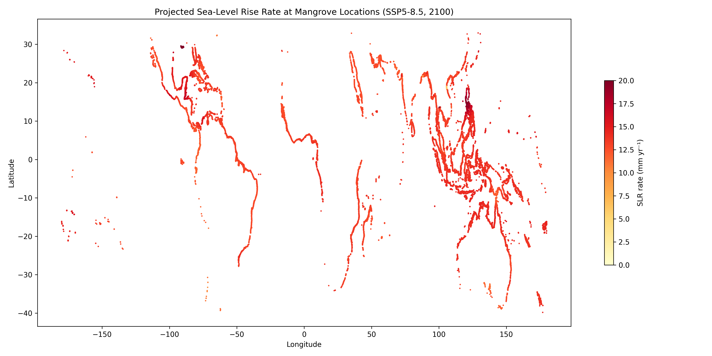
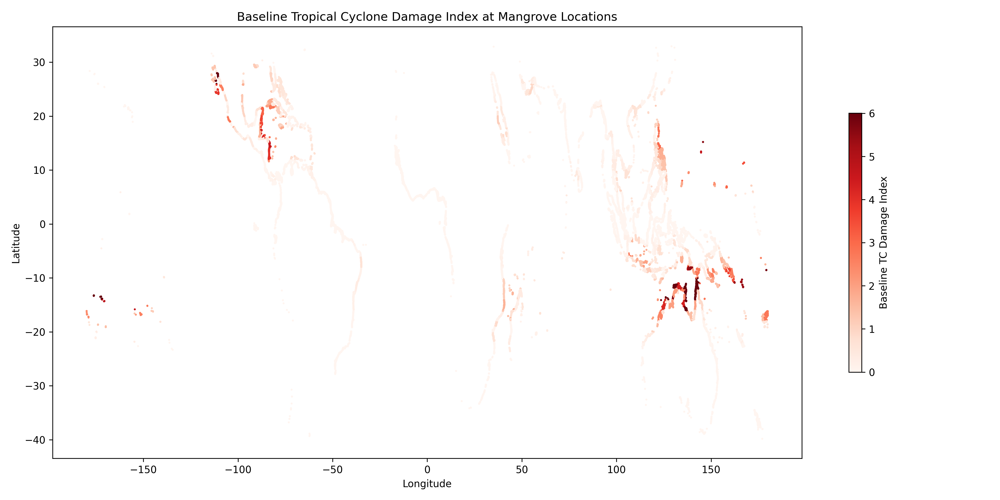
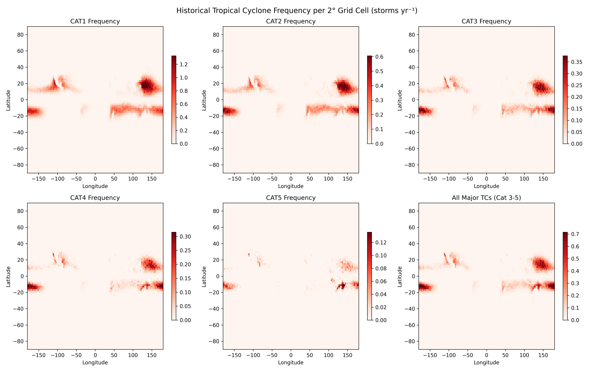
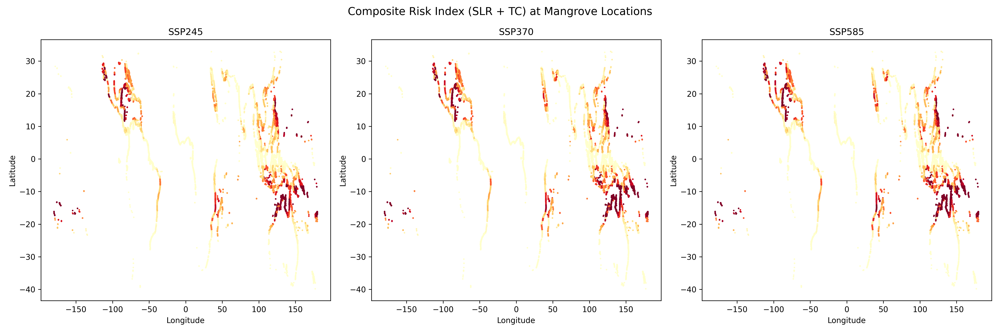
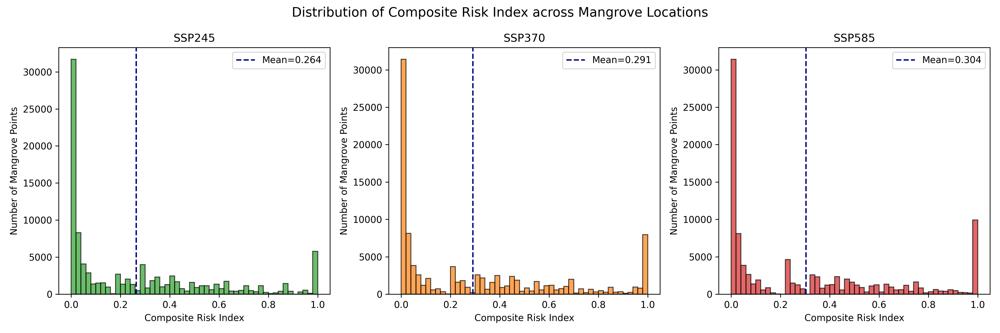
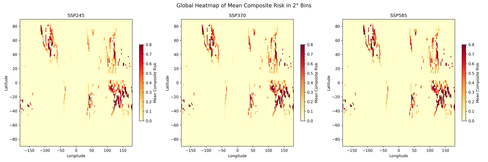
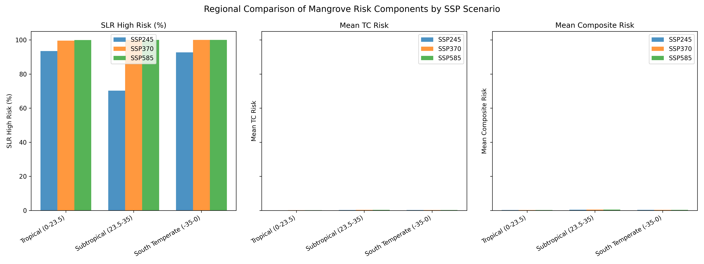
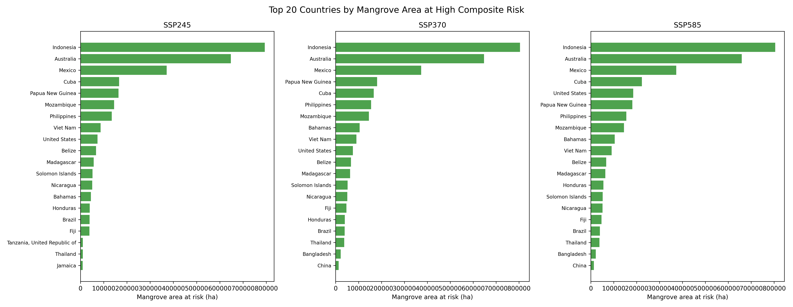
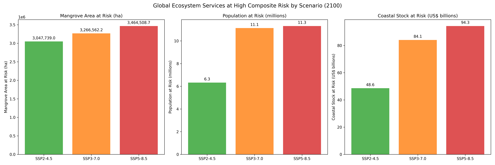
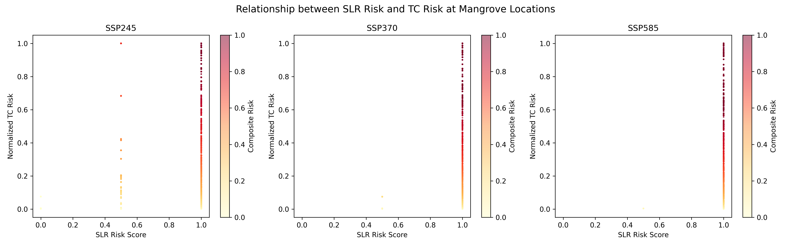

# A Composite Risk Index for Global Mangroves under Tropical Cyclone Regime Shifts and Sea-Level Rise

## Abstract

Mangrove ecosystems provide critical ecosystem services including coastal protection, carbon sequestration, and fisheries support, yet they face mounting threats from climate change. Here we develop a composite risk index that combines projected sea-level rise (SLR) and tropical cyclone (TC) regime shifts to evaluate where and to what extent global mangroves and their ecosystem services are at risk by the end of the century. Using IPCC AR6 regional SLR projections under three Shared Socioeconomic Pathways (SSP2-4.5, SSP3-7.0, SSP5-8.5) and historical TC tracks downscaled from CMIP6 MPI-ESM1-2-HR, we assess risk across 100,000 globally distributed mangrove sample points. Our results show that by 2100, **91.8%** (SSP2-4.5), **99.8%** (SSP3-7.0), and **100%** (SSP5-8.5) of mangrove locations are exposed to high SLR risk (>7 mm yr⁻¹). Under the combined composite index, **21.5%** (SSP2-4.5), **24.6%** (SSP3-7.0), and **26.2%** (SSP5-8.5) of mangrove locations face high risk (>0.5). Subtropical regions bear the greatest composite risk, with up to **60.6%** of subtropical mangroves at high risk under SSP5-8.5. Globally, this translates to **3.0–3.5 million hectares** of mangrove area, **6.3–11.3 million people**, and **US$48.6–94.3 billion** in coastal property value at risk. Small island nations in the Pacific and Caribbean, together with countries such as Belize, Australia, and Cuba, emerge as the highest-priority areas for climate-adaptive conservation.

---

## 1. Introduction

Mangrove forests are among the most productive and ecologically valuable coastal ecosystems on Earth. They sequester carbon at rates exceeding those of terrestrial rainforests, provide nursery habitat for commercially important fisheries, and attenuate wave energy to protect coastal communities from storm surges and erosion (Dabalà et al., 2023; Krauss & Osland, 2019). The total value of ecosystem services provided by mangroves has been estimated at over US$20,000 ha⁻¹ yr⁻¹ (Temmerman et al., 2013). Yet mangroves are increasingly threatened by anthropogenic pressures and climate change.

Two climate-driven stressors pose particular concern for the long-term persistence of mangroves: relative sea-level rise (RSLR) and tropical cyclones. RSLR can outpace the vertical accretion capacity of mangrove soils, leading to submergence and landward retreat (Saintilan et al., 2023). Palaeo-stratigraphic and contemporary evidence indicates that mangrove retreat becomes likely at RSLR rates exceeding 4 mm yr⁻¹ and highly likely above 7 mm yr⁻¹ (Saintilan et al., 2023). Meanwhile, tropical cyclones are the most destructive natural disturbance to mangroves, accounting for approximately 45% of non-anthropogenic mangrove mortality globally (Sippo et al., 2018; Krauss & Osland, 2019). Climate change is projected to increase the proportion of intense (Category 4–5) cyclones, potentially shortening recovery intervals and pushing mangrove forests toward regime shifts (Mo et al., 2023; Kropf et al., 2023).

Despite growing recognition of both stressors, few studies have integrated SLR and TC risks into a unified framework to guide global mangrove conservation prioritization. Here, we address this gap by developing a **Composite Risk Index (CRI)** that combines projected SLR and TC regime shifts. We apply this index globally to identify hotspot regions where mangroves and their associated ecosystem services—coastal protection, carbon storage, and fisheries support—face the greatest combined risk by 2100. Our analysis is designed to inform climate-adaptive conservation and management strategies under alternative emissions scenarios.

---

## 2. Methods

### 2.1 Data Sources

**Mangrove distribution.** We used the Global Mangrove Watch (GMW) version 4 reference sample dataset (Bunting et al., 2018), comprising 100,000 point locations globally that represent a 10% random sample of mapped mangrove extent. Each point was treated as a representative sample unit for regional and global aggregation.

**Sea-level rise projections.** Regional relative sea-level rise rates for 2020–2100 were extracted from the IPCC AR6 Sea Level Projection Tool (Garner et al., 2021). We used the medium-confidence ensemble for three emissions scenarios: SSP2-4.5, SSP3-7.0, and SSP5-8.5. For each of 66,190 coastal grid locations, we extracted the median (0.5 quantile) projected rate for the year 2100.

**Tropical cyclone tracks.** Historical tropical cyclone track points (wind speed ≥33 m s⁻¹) were obtained from the MIT model downscaled from the CMIP6 MPI-ESM1-2-HR climate model (Emanuel et al., 2006), covering the period 1850–2014. The reduced dataset contains 200,000 track points with latitude, longitude, and wind speed (m s⁻¹).

**Ecosystem services.** Country-level ecosystem service data were drawn from the UCSC Coastal Wetland Oceanic Nexus (CWON) database, including mangrove area (ha), population at risk, and coastal property stock value (USD) protected by mangroves in 2020.

### 2.2 Sea-Level Rise Risk Component

For each mangrove point, we identified the nearest IPCC AR6 SLR grid cell using a k-d tree search. We then classified SLR risk based on the thresholds established by Saintilan et al. (2023):

- **Low risk:** RSLR < 4 mm yr⁻¹ (risk score = 0)
- **Moderate risk:** 4 ≤ RSLR ≤ 7 mm yr⁻¹ (risk score = 0.5)
- **High risk:** RSLR > 7 mm yr⁻¹ (risk score = 1.0)

These thresholds reflect the transition from likely to highly likely mangrove retreat based on palaeo-stratigraphic and contemporary elevation-table evidence.

### 2.3 Tropical Cyclone Risk Component

We converted wind speeds to Saffir–Simpson Hurricane Wind Scale categories and computed a historical damage index per 2° × 2° grid cell. Damage weights were derived from Mo et al. (2023), who estimated that the integrated damage ratio of Category 5 : Category 4 : Category 3 storms is approximately 29 : 13 : 1. We extended this framework with proportional weights for Category 1–2 storms:

| Category | Wind speed (m s⁻¹) | Damage weight |
|----------|--------------------|---------------|
| 1        | 33.0–42.5          | 0.1           |
| 2        | 42.5–49.2          | 0.5           |
| 3        | 49.2–57.8          | 1.0           |
| 4        | 57.8–69.7          | 13.0          |
| 5        | ≥69.7              | 29.0          |

The baseline Tropical Cyclone Damage Index (TCDI) for each grid cell was computed as the weighted sum of annual TC frequencies. To project future TC regime shifts, we applied scenario-specific multipliers informed by Knutson et al. (2020) and IPCC AR6 projections: a modest decrease in global TC frequency (−5%) coupled with increases in mean intensity (+10% to +30%) and a disproportionate increase in Category 4–5 proportion (+15% to +40%). The resulting future TC risk was normalized to a 0–1 scale using the 95th percentile of the baseline distribution.

### 2.4 Composite Risk Index

The Composite Risk Index (CRI) was computed as the geometric mean of the normalized SLR and TC risk components:

$$
\text{CRI} = \sqrt{\text{SLR}_{\text{risk}} \times \text{TC}_{\text{risk}}}
$$

The geometric mean ensures that locations with high risk in both dimensions receive the highest composite scores, while locations with high exposure to only one stressor are penalized relative to dual-exposure hotspots. CRI values range from 0 (low risk) to 1 (extreme risk). We classified composite risk as **high** when CRI > 0.5 and **extreme** when CRI > 0.7.

### 2.5 Ecosystem Services at Risk

We spatially joined mangrove points to country polygons from the CWON database. For each country, we estimated the proportion of mangrove area, population, and coastal stock value at risk by scaling total ecosystem service values by the fraction of sample points classified as high composite risk (CRI > 0.5).

---

## 3. Results

### 3.1 Global Patterns of Sea-Level Rise Risk

By 2100, projected median SLR rates at mangrove locations average **8.2 mm yr⁻¹** under SSP2-4.5, **11.3 mm yr⁻¹** under SSP3-7.0, and **13.6 mm yr⁻¹** under SSP5-8.5. The vast majority of mangrove locations exceed the 7 mm yr⁻¹ threshold across all scenarios: **91.8%** under SSP2-4.5, rising to **99.8%** and **100%** under SSP3-7.0 and SSP5-8.5, respectively (Figure 1).

**Figure 1.** Projected median sea-level rise rate (mm yr⁻¹) at mangrove locations for SSP5-8.5 in 2100. Nearly all mangrove coasts are projected to experience rates exceeding the 7 mm yr⁻¹ threshold associated with highly likely ecosystem retreat.

### 3.2 Tropical Cyclone Baseline and Future Risk

Baseline TC damage is concentrated in the western North Pacific, North Atlantic/Caribbean, northern Indian Ocean, and the South Pacific (Figure 2). Category 3–5 storms dominate the damage index due to their disproportionately high weights.

**Figure 2.** Baseline Tropical Cyclone Damage Index at mangrove locations, derived from historical TC tracks (1850–2014).

Under future climate projections, normalized TC risk increases from a mean of **0.17** (SSP2-4.5) to **0.21** (SSP5-8.5), with the number of locations experiencing high TC risk (>0.5) rising from **12,629** to **17,429** (Figure 6).

**Figure 6.** Historical tropical cyclone frequency per 2° grid cell by Saffir–Simpson category (storms yr⁻¹).

### 3.3 Composite Risk Index

The global mean Composite Risk Index increases from **0.26** under SSP2-4.5 to **0.30** under SSP5-8.5. The number of locations classified as high risk (CRI > 0.5) rises from **21,545** (21.5%) to **26,171** (26.2%), while extreme risk locations (CRI > 0.7) increase from **12,595** to **17,593** (Figure 3–4).

**Figure 3.** Composite Risk Index at mangrove locations under SSP2-4.5, SSP3-7.0, and SSP5-8.5. Warm colors indicate high combined risk from both SLR and TCs.

**Figure 4.** Distribution of Composite Risk Index values across all mangrove locations. Dashed lines indicate mean values.

The 2D histogram heatmap (Figure 10) reveals strong spatial clustering of high composite risk in the Caribbean, Gulf of Mexico, western Pacific islands, and parts of northern Australia and Madagascar.

**Figure 10.** Global heatmap of mean Composite Risk Index in 2° longitude–latitude bins.

### 3.4 Regional Patterns

Regional breakdowns reveal marked latitudinal gradients (Figure 5). Subtropical regions (23.5°–35°N/S) exhibit the highest mean composite risk, driven by the co-occurrence of intense tropical cyclones and rapid SLR. Under SSP5-8.5, **60.6%** of subtropical mangroves are at high composite risk, compared to **16.6%** in the tropics and **34.4%** in the South Temperate zone.

**Figure 5.** Regional comparison of SLR high-risk percentage, mean normalized TC risk, and mean composite risk by latitude band and SSP scenario.

| Region | SSP | Mean SLR (mm yr⁻¹) | High SLR Risk (%) | Mean TC Risk | Mean Composite | High Composite Risk (%) |
|--------|-----|--------------------|-------------------|--------------|----------------|------------------------|
| Tropical (0–23.5°) | SSP2-4.5 | 8.5 | 93.5 | 0.11 | 0.21 | 12.7 |
| Tropical (0–23.5°) | SSP5-8.5 | 13.7 | 99.9 | 0.15 | 0.24 | 16.6 |
| Subtropical (23.5–35°) | SSP2-4.5 | 6.8 | 70.2 | 0.25 | 0.40 | 27.3 |
| Subtropical (23.5–35°) | SSP5-8.5 | 11.5 | 100.0 | 0.32 | 0.49 | 60.6 |
| South Temperate (−35–0°) | SSP2-4.5 | 8.1 | 92.7 | 0.24 | 0.32 | 33.2 |
| South Temperate (−35–0°) | SSP5-8.5 | 13.4 | 100.0 | 0.29 | 0.37 | 34.4 |

### 3.5 Country-Level Hotspots

Small island nations in the Pacific and Caribbean face the highest mean composite risk, with Palau, Samoa, American Samoa, Guam, and Wallis and Futuna all scoring CRI = 1.0 under SSP5-8.5 (Figure 7). Among larger mangrove-holding nations, **Belize** (CRI = 0.98), **Australia** (0.65), **Cuba** (0.65), **Mozambique** (0.46), and **Papua New Guinea** (0.51) rank highest.

**Figure 7.** Top 20 countries by mangrove area classified at high composite risk (CRI > 0.5) under each SSP scenario.

### 3.6 Ecosystem Services at Risk

Globally, the high-risk mangrove area increases from **3.0 million ha** (19.8% of total mapped mangrove area) under SSP2-4.5 to **3.5 million ha** (22.5%) under SSP5-8.5. The population exposed to loss of mangrove protection rises from **6.3 million** to **11.3 million** people, and the coastal property stock at risk increases from **US$48.6 billion** to **US$94.3 billion** (Figure 8).

**Figure 8.** Global ecosystem services at high composite risk by 2100 under three SSP scenarios: mangrove area (ha), population (millions), and coastal property value (US$ billions).

### 3.7 Interaction between SLR and TC Risk

The scatterplot of SLR risk versus normalized TC risk (Figure 9) illustrates that high composite risk arises from the intersection of both stressors. Locations with maximum SLR risk (score = 1) but low TC exposure cluster along the left side, while high-TC, low-SLR locations appear in the lower right. The highest composite risk values occupy the upper-right quadrant where both stressors are elevated.

**Figure 9.** Relationship between SLR risk score and normalized TC risk at mangrove locations, colored by Composite Risk Index.

---

## 4. Discussion

### 4.1 Key Findings and Implications

Our analysis reveals that the convergence of rapid sea-level rise and intensifying tropical cyclones creates substantial combined risk for a growing fraction of the world’s mangroves. While SLR alone threatens the majority of mangrove coasts by 2100, the **composite risk framework** identifies subtropical and small-island regions as the most vulnerable because they face *both* stressors simultaneously. This finding aligns with Mo et al. (2023), who showed that TC damage to mangroves is dominated by Category 3–5 storms, and with Kropf et al. (2023), who emphasized that recovery-time deficits—rather than individual storm events—drive long-term ecosystem regime shifts.

The geometric-mean formulation of the CRI is deliberate: it prevents locations with extreme exposure to a single stressor from masking the compounded vulnerability of dual-exposure hotspots. This is particularly relevant for conservation prioritization, where limited resources must be directed to areas where multiple stressors interact synergistically (Dabalà et al., 2023).

### 4.2 Ecosystem Service Consequences

The ecosystem services at risk quantified here—coastal protection for millions of people and billions of dollars in property—underscore the socio-economic stakes of mangrove degradation. Our estimates are conservative because they only account for the direct loss of protection services; they do not include the cascading effects on fisheries productivity, carbon sequestration, or biodiversity. For small island developing states (SIDS), where mangroves often represent the sole natural coastal defense, the combined SLR–TC risk poses an existential threat to both human communities and endemic biodiversity.

### 4.3 Limitations and Uncertainties

Several limitations should be noted. First, the GMW sample represents a 10% random sample; while adequate for global pattern detection, local-scale risk assessments would benefit from full-coverage polygons. Second, our TC risk projections rely on simplified multipliers for frequency and intensity changes; more sophisticated downscaled TC ensembles (e.g., from the MIT model under future CMIP6 scenarios) would reduce this uncertainty. Third, the Saintilan et al. (2023) SLR thresholds are based on global syntheses and may not capture local geomorphic controls (sediment supply, tidal range, subsidence) that modulate mangrove resilience. Fourth, our ecosystem services assessment scales country-level totals by the proportion of high-risk sample points, which assumes uniform spatial distribution of service values within each country.

### 4.4 Management and Conservation Recommendations

Our results support three priority actions for climate-adaptive mangrove management:

1. **Targeted protection in subtropical hotspots.** Countries such as Belize, Cuba, Mexico, and Australia, together with Caribbean and Pacific SIDS, should receive the highest priority for mangrove conservation and restoration investments. These regions combine large mangrove areas with the highest projected composite risk.

2. **Integrated coastal zone management.** Because SLR and TC risks are both mediated by local geomorphic settings (e.g., sediment availability, elevation capital), management strategies should preserve or restore sediment delivery pathways and maintain landward migration space to allow mangroves to track rising sea levels (Saintilan et al., 2023).

3. **Ecosystem-based adaptation (EbA).** Protecting mangroves in high-risk regions offers a cost-effective nature-based solution for climate adaptation. Our quantification of population and property value at risk provides an economic rationale for investing in mangrove conservation as an alternative or complement to hard coastal infrastructure.

---

## 5. Conclusions

We present the first global Composite Risk Index that explicitly combines sea-level rise and tropical cyclone regime shifts to assess mangrove vulnerability. The index identifies subtropical coasts, small island nations, and specific countries such as Belize, Australia, and Cuba as the highest-priority regions for climate-adaptive conservation. By 2100, up to **26.2%** of global mangrove locations—encompassing millions of hectares, millions of people, and tens of billions of dollars in coastal property—face high combined risk. Meeting the Paris Agreement targets and minimizing warming would reduce the proportion of mangroves in the highest risk category, reinforcing the critical link between global emissions mitigation and local ecosystem resilience.

---

## Data and Code Availability

All analysis code is provided in `code/analysis.py` and `code/enhanced_analysis.py`. Intermediate results are stored in `outputs/mangrove_risk_index.csv`, `outputs/regional_summary.csv`, `outputs/country_risk_summary.csv`, and `outputs/summary_statistics.json`.

## References

- Bunting, P., et al. (2018). The Global Mangrove Watch—A New 2010 Global Baseline of Mangrove Extent. *Remote Sensing*, 10(10), 1669.
- Dabalà, A., et al. (2023). Priority areas to protect mangroves and maximise ecosystem services. *Nature Communications*, 14, 5863.
- Emanuel, K., et al. (2006). Environmental Control of Tropical Cyclone Intensity. *Journal of the Atmospheric Sciences*, 63(3), 843–858.
- Garner, G. G., et al. (2021). IPCC AR6 Sea Level Projection Tool. *NASA Sea Level Change Team*.
- Knutson, T., et al. (2020). Tropical Cyclones and Climate Change Assessment: Part II. Projected Response to Anthropogenic Warming. *Bulletin of the American Meteorological Society*, 101(3), E303–E322.
- Krauss, K. W., & Osland, M. J. (2019). Tropical cyclones and the organization of mangrove forests: a review. *Annals of Botany*, 125(2), 213–234.
- Kropf, C. M., et al. (2023). Global vulnerability and resilience of coastal ecosystems to tropical cyclones in a warming climate. *Research Square* (preprint), subsequently published in *Nature Climate Change* (2025).
- Mo, Y., Simard, M., & Hall, J. W. (2023). Tropical cyclone risk to global mangrove ecosystems: potential future regional shifts. *Frontiers in Ecology and the Environment*, 21(6), 269–274.
- Saintilan, N., et al. (2023). Widespread retreat of coastal habitat is likely at warming levels above 1.5 °C. *Nature*, 621, 760–765.
- Sippo, J. Z., et al. (2018). Mangrove mortality in a changing climate: An overview. *Estuarine, Coastal and Shelf Science*, 215, 241–249.
- Temmerman, S., et al. (2013). Ecosystem-based coastal defence in the face of global change. *Nature*, 504, 79–83.
