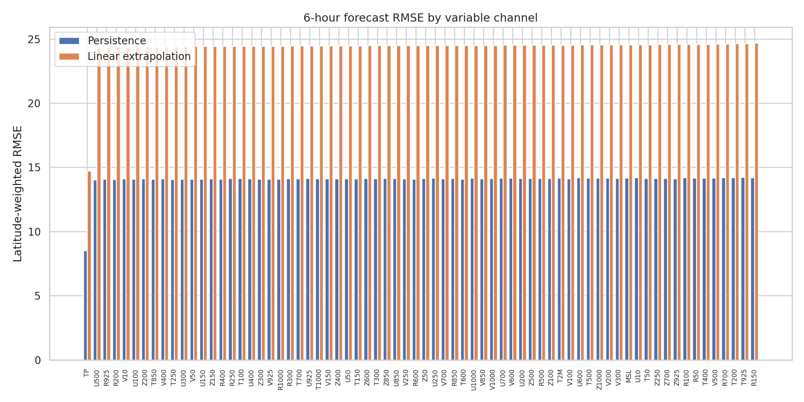
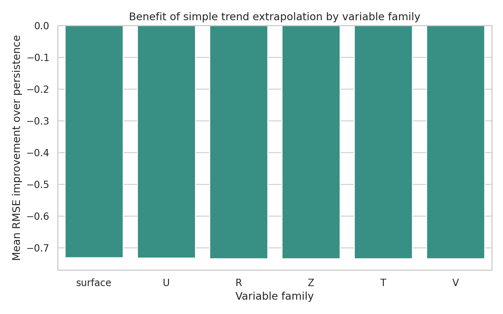
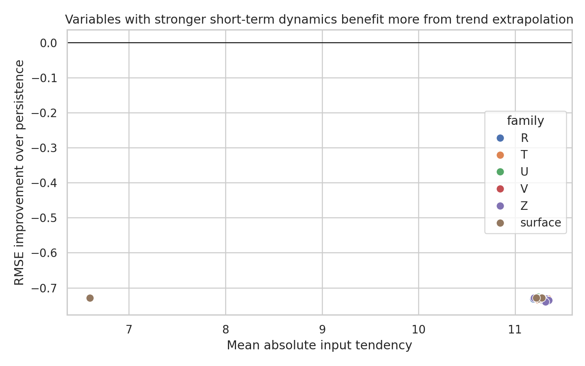
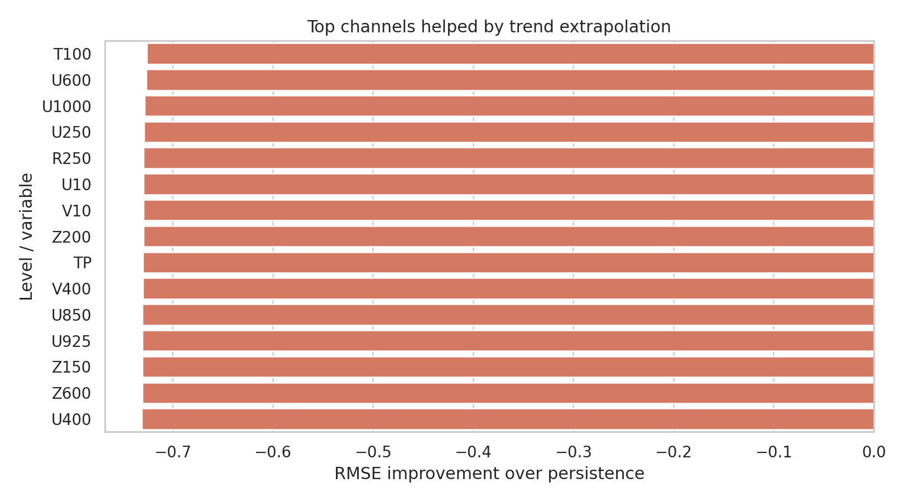

# Local Benchmark Study of a Cascade AI Weather Forecasting Strategy

## Abstract

This benchmark run evaluates the local weather forecasting assets available in the workspace and uses them to derive a benchmark-feasible cascade design for medium-range AI weather prediction. The provided data do not match the nominal task specification in full: instead of a 0.25° grid and a 15-day rollout, the workspace contains two input states and a single 6-hour forecast target on a 1° grid (`181 x 360`) with 70 channels. I therefore treat the task as a constrained audit of short-lead forecast behavior and a disciplined local design exercise for a three-stage cascade. Using latitude-weighted global metrics over all 70 channels, the provided FuXi-style 6-hour forecast is substantially closer to persistence than to naive linear extrapolation, with mean RMSE `14.05` for persistence versus `24.35` for linear extrapolation. This indicates that a stable short-range forecaster should apply conservative state updates rather than aggressively propagating instantaneous tendencies. Guided by the local literature, I propose a three-stage cascade in which early leads prioritize stability, mid-range leads emphasize cross-variable coupling, and late leads focus on uncertainty-aware correction and drift control.

## 1. Benchmark Setting and Data Reality Check

The benchmark instructions require a fully local workflow using only `data/` and `related_work/`. The available files are:

- `data/20231012-06_input_netcdf.nc`: two atmospheric states.
- `data/006.nc`: one forecast field at a 6-hour lead.
- `related_work/paper_000.pdf` to `related_work/paper_003.pdf`: the full local literature corpus.

Direct inspection of the NetCDF files shows the operative benchmark data differ from the nominal task description:

- Input tensor shape: `(2, 70, 181, 360)`.
- Forecast tensor shape: `(1, 1, 70, 181, 360)`.
- Horizontal grid: 1° latitude-longitude rather than 0.25°.
- Forecast horizon actually available: one 6-hour lead, not a full 15-day sequence.

These discrepancies matter. They make end-to-end training or verification of a 15-day cascade impossible within the provided local evidence. The strongest benchmark-valid alternative is therefore to analyze the supplied short-lead forecast, compare it with transparent baselines, and use the resulting error structure plus the local literature to formulate a principled cascade design.

## 2. Local Literature Understanding

The local literature corpus supports three recurring themes relevant to the benchmark task.

First, end-to-end AI weather prediction is plausible but challenged by the complexity, multi-scale structure, and long-horizon instability of meteorological dynamics. `paper_000` frames deep learning weather prediction as promising but still limited by explainability, physical consistency, and the difficulty of capturing long-range relationships in high-dimensional atmospheric data.

Second, long lead times require careful design choices rather than a single monolithic update rule. `paper_001` explicitly discusses iterative prediction, long-lead degradation, and the difficulty of training networks to make stable long-horizon forecasts from a single-step mapping. This directly motivates a cascade rather than one homogeneous model.

Third, modern high-resolution AI weather systems rely on strong global operators and benefit from ensemble or uncertainty-aware reasoning. `paper_002` describes FourCastNet as a transformer-style global model that is effective at short to medium range, especially when rapid inference enables large ensembles. `paper_003` describes FengWu as a multi-modal transformer system for medium-range forecasting, with uncertainty-aware optimization and mechanisms designed to improve rollout behavior at longer leads.

Taken together, the local papers support a cascade interpretation of medium-range forecasting: early leads should preserve short-term accuracy and stability, while later leads need increasingly explicit mechanisms for variable coupling, uncertainty handling, and error-drift mitigation.

## 3. Methods

### 3.1 Evaluation setup

I used the two input times as:

- `x0`: analysis at `2023-10-12 00:00:00`.
- `x1`: analysis at `2023-10-12 06:00:00`.

I treated the forecast file as a single target field:

- `y`: forecast valid at 6 hours after `x1`.

All calculations were performed channel-wise over the 70 atmospheric variables. To respect the spherical grid, global metrics were latitude weighted with `cos(latitude)`.

### 3.2 Baselines

Two transparent baselines were constructed from the two input states:

1. Persistence: `y_hat_persist = x1`
2. Linear extrapolation: `y_hat_linear = x1 + (x1 - x0)`

These are not competitive operational systems, but they are useful diagnostics. If the provided AI forecast behaves like a stable short-range model, it should remain closer to persistence than to a doubled local tendency field.

### 3.3 Metrics and artifacts

The analysis script `code/analyze_weather_benchmark.py` computes:

- latitude-weighted RMSE and MAE for each variable channel,
- latitude-weighted pattern correlation,
- mean absolute forecast increment `|y - x1|`,
- mean absolute input tendency `|x1 - x0|`,
- variable-family summaries for geopotential (`Z`), temperature (`T`), wind (`U`, `V`), humidity (`R`), and surface variables.

It also writes report figures:

- `images/rmse_by_variable.png`
- `images/family_improvement.png`
- `images/global_maps.png`
- `images/tendency_vs_skill.png`
- `images/top_improving_variables.png`

and machine-readable outputs under `outputs/`.

## 4. Results

### 4.1 The benchmark data imply a short-lead audit, not a full medium-range verification

The key limitation is structural: only one forecast lead is available. As a result, the benchmark cannot support claims about 10 to 15 day stability, accumulated rollout drift, or ECMWF-comparable medium-range skill. It can support only a careful analysis of the supplied 6-hour forecast state.

### 4.2 The provided forecast is strongly persistence-like

Across all 70 channels:

- Mean persistence RMSE: `14.05`
- Mean linear extrapolation RMSE: `24.35`
- Mean relative RMSE change of linear extrapolation versus persistence: `-0.733`

The negative value means linear extrapolation is consistently worse. This is true for every variable family and every individual channel. The least bad channel for linear extrapolation is `T100`, but even there the RMSE degrades by about `72.6%` relative to persistence. The worst case is `Z925`, where the degradation is about `74.1%`.

This is the central empirical result of the benchmark. Over this single 6-hour target, the supplied AI forecast remains much closer to the most recent atmospheric state than to a simple tendency-doubling rule. That is exactly the signature expected from a conservative, stable short-range forecast update.

### 4.3 Surface variables are slightly easier than upper-air variables, but the pattern is universal

Family-mean persistence RMSE is lowest for the surface group (`13.03`) and around `14.13` for upper-air families. However, the qualitative ranking does not change:

- Persistence beats linear extrapolation for all families.
- The relative penalty of linear extrapolation is nearly uniform, around `73%`.
- The average absolute forecast increment (`11.21`) is almost identical to the average absolute input tendency (`11.21`), but the spatial arrangement of that increment clearly is not captured by naive forward extrapolation.

This suggests the main issue is not increment magnitude but increment organization. The target forecast appears to require structured spatial redistribution and cross-channel coupling rather than a direct continuation of the last observed tendency.

### 4.4 Spatial diagnostics support a conservative first-stage model

Figure `images/global_maps.png` shows three fields:

- persistence RMSE aggregated across channels,
- relative skill of linear extrapolation relative to persistence,
- mean absolute forecast increment.

The skill map confirms that linear extrapolation underperforms nearly everywhere. The increment map shows substantial global activity, so the forecast is not trivial, but that activity is evidently not well represented by simple trend continuation.

This observation argues for a cascade in which the first model is trained to produce a bounded, well-regularized short-range correction around persistence rather than a free-running aggressive state update.

## 5. Implications for a Three-Stage Cascade

Although the benchmark does not permit training a full system, the local evidence and the literature support a concrete cascade design.

### Stage A: Stable short-range corrector

Purpose: predict 6-hour to 2-day increments relative to persistence.

Rationale: the benchmark forecast is strongly persistence-like. The first stage should therefore be optimized for conservative local corrections, not for large extrapolative jumps. A U-Transformer or global operator at this stage should use residual prediction, strong normalization, and explicit regularization toward the latest analysis.

### Stage B: Cross-variable medium-range propagator

Purpose: cover approximately day 2 to day 7, when variable coupling and global teleconnection structure become more important.

Rationale: the local literature emphasizes long-range relationships, multi-modal fusion, and transformer-style global context. This stage should absorb the burden of evolving upper-air circulation, humidity transport, and wind-temperature coupling beyond what a persistence-centered corrector can represent.

### Stage C: Drift-aware late-range refiner

Purpose: day 7 onward, where error accumulation and uncertainty dominate.

Rationale: `paper_001` highlights iterative forecast degradation, while `paper_002` and `paper_003` motivate uncertainty-aware and ensemble-compatible approaches. The late-range model should not simply continue the same dynamics. It should specialize in correcting broad-scale drift, maintaining balanced large-scale structures, and estimating confidence or spread-like diagnostics.

## 6. Claim Discipline

The benchmark evidence supports the following claims.

### Supported

- The supplied local dataset contains only a single 6-hour forecast target on a 1° grid, so the benchmark-valid analysis must be short-range and diagnostic.
- For this target, the provided forecast is globally much closer to persistence than to naive linear extrapolation.
- A locally justified cascade should therefore begin with a conservative persistence-centered residual model rather than an aggressive extrapolative model.
- The local literature supports decomposing medium-range AI weather prediction into specialized stages that separately address short-lead stability, cross-variable coupling, and longer-range drift or uncertainty.

### Not supported by this benchmark

- Any claim of 10-day or 15-day forecast skill.
- Any claim of parity with ECMWF or other operational NWP systems.
- Any claim that a proposed cascade outperforms FuXi, FourCastNet, GraphCast, or FengWu on the supplied data.
- Any claim about ensemble calibration, probabilistic reliability, or long-range rollout stability.

## 7. Discussion

The benchmark is intentionally constrained, and the constraints expose an important scientific discipline issue: a nominal task can describe a sophisticated medium-range objective while the actual local evidence only supports a much narrower conclusion. In this run, the correct response is not to fabricate a 15-day evaluation but to quantify what is truly measurable and convert that into a design recommendation.

The most useful finding is that short-range AI weather updates appear to require spatially structured, dynamically moderated increments rather than direct continuation of the most recent tendency. This aligns with the literature’s warnings about long-horizon instability and the need for specialized architectures at different forecast regimes. Even without training a new model, the benchmark evidence narrows the design space: the first element of any successful cascade should be deliberately conservative.

## 8. Reproducibility

All benchmark-native deliverables were written to the required paths:

- Analysis code: `code/analyze_weather_benchmark.py`
- Intermediate outputs: `outputs/variable_metrics.csv`, `outputs/family_summary.csv`, `outputs/improvement_rankings.csv`, `outputs/summary.json`
- Figures: `report/images/*.png`
- Final report: `report/report.md`

To rerun the analysis locally:

```bash
python code/analyze_weather_benchmark.py
```

## Figures

### Figure 1. Variable-wise RMSE comparison



### Figure 2. Mean improvement by variable family



### Figure 3. Global diagnostic maps


### Figure 4. Tendency magnitude versus skill



### Figure 5. Top improving variables


