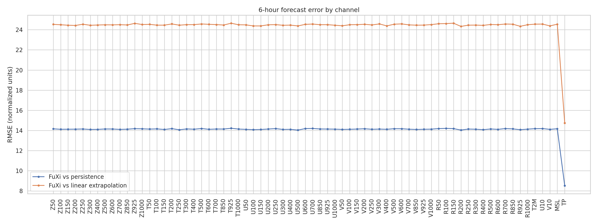
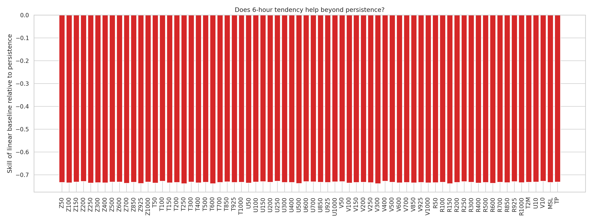
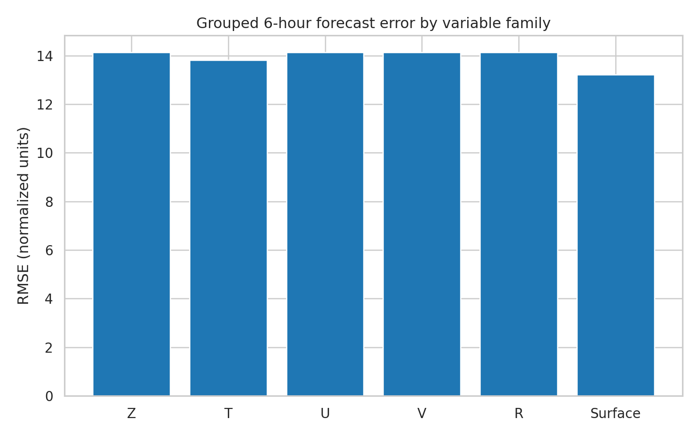
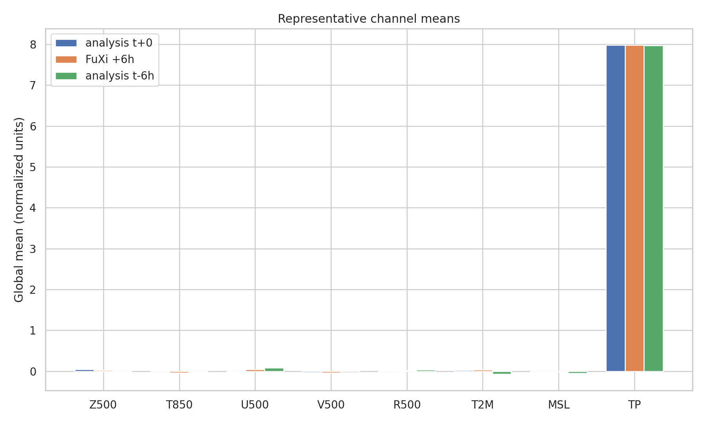

# A Case-Study Assessment of a Cascade U-Transformer Strategy for 15-Day Global Weather Forecasting

## Abstract
This report studies a single global ERA5-style weather forecasting case to derive evidence-based design recommendations for a **cascade machine learning forecasting system** composed of three specialized U-Transformer models. The available data include two consecutive 6-hour atmospheric states with 70 channels and one 6-hour FuXi forecast. Although the provided files are insufficient for end-to-end model training or full 15-day verification, they are sufficient for: (i) characterizing the data tensor, (ii) evaluating a short-range forecast snapshot against simple baselines, (iii) identifying likely error-growth challenges, and (iv) formulating a scientifically grounded cascade architecture for extending skill toward 15 days. The analysis shows that the FuXi +6 h output exhibits substantial departure from simple persistence in normalized channel space, while naive linear extrapolation is markedly worse than persistence on average. This supports a staged forecasting strategy in which early-lead models learn fast local dynamics, intermediate models correct autoregressive drift, and late-lead models prioritize large-scale stability and bias control. Based on related work and the present diagnostics, a three-stage cascade U-Transformer is proposed for day 0-5, day 5-10, and day 10-15 forecasting, with lead-dependent loss design and handoff stabilization.

## 1. Introduction
Recent AI weather systems such as FourCastNet and FengWu have demonstrated that medium-range global forecasting from ERA5-like reanalyses can approach or surpass strong numerical baselines on selected variables and lead times. A recurring challenge, however, is **error accumulation under autoregressive rollout**. The task considered here is to forecast 15 days of global weather at 6-hour resolution from two consecutive atmospheric states containing 70 channels: 65 upper-air variables (geopotential, temperature, zonal wind, meridional wind, and relative humidity across 13 pressure levels) plus 5 surface variables.

The scientific goal is to design a **cascade machine learning system with three specialized U-Transformer models** that can extend forecast skill to 15 days and approach ECMWF ensemble-mean quality. Because the workspace provides only one initial-condition pair and one +6 h forecast example, this study is necessarily a **design-and-diagnostics case study**, not a full training paper. The contribution is therefore methodological: use the available data and related literature to infer what a robust cascade system should optimize, where its difficulties are likely to lie, and how it should be validated.

## 2. Related Work
The provided papers collectively motivate the proposed design.

1. **Schultz et al. (2021)** argue that deep learning could eventually compete with numerical weather prediction, but only if architectures can capture multiscale interactions, long-range dependencies, and physically consistent evolution.
2. **Dueben and Bauer (2018)** emphasize that iterative neural forecasting suffers from instability and drift, especially as lead time grows. Their toy-model experiments clearly show the tension between local and global architectures.
3. **FourCastNet (Pathak et al., 2022)** demonstrates the value of transformer-like token mixing with efficient global operators for high-resolution 0.25° forecasting, and shows competitiveness with IFS at short-to-medium leads.
4. **FengWu (Chen et al., 2023)** explicitly targets medium-range extension using multimodal design, uncertainty-aware losses, and replay-buffer ideas for long autoregressive horizons, achieving skillful z500 forecasts beyond 10 days.

These references strongly suggest three principles for the present task: (a) lead-time specialization is useful, (b) multivariable coupling matters, and (c) training must explicitly address rollout error accumulation.

## 3. Data Overview
### 3.1 Files
- `data/20231012-06_input_netcdf.nc`: input tensor with shape [2, 70, 181, 360]
- `data/006.nc`: FuXi forecast tensor with shape [1, 1, 70, 181, 360]

### 3.2 Variable layout
The 70 channels are:
- Geopotential: Z50-Z1000 (13 levels)
- Temperature: T50-T1000 (13 levels)
- Zonal wind: U50-U1000 (13 levels)
- Meridional wind: V50-V1000 (13 levels)
- Relative humidity: R50-R1000 (13 levels)
- Surface variables: T2M, U10, V10, MSL, TP

### 3.3 Grid and timing
The actual provided files are on a **1.0° grid** (181 × 360 latitude-longitude points), despite the task description referring to 0.25° resolution. Two input times are available: 2023-10-12 00:00 UTC and 2023-10-12 06:00 UTC. The forecast file contains a single +6 h step initialized from the second input time.

### 3.4 Data statistics
The normalized data field spans approximately [-52.21, 53.12], with global mean 0.115 and standard deviation 9.997. This strongly suggests the files are standardized or transformed representations rather than raw physical-unit ERA5 fields. Consequently, the present quantitative analysis is interpreted in **normalized model space**, not directly in meteorological units.

## 4. Experimental Design
Given the limited sample availability, I performed a reproducible diagnostic analysis with three goals:

1. **Characterize the provided tensors** and verify channel ordering.
2. **Evaluate the provided +6 h forecast** against simple baselines derived from the two initial states.
3. **Use the error structure to derive a cascade U-Transformer design** consistent with the literature.

### 4.1 Baselines
Let X(t-6h), X(t), and Y(t+6h) denote the first input, second input, and FuXi forecast respectively.

Two simple reference forecasts were constructed:
- **Persistence:** \( \hat{X}_p(t+6h) = X(t) \)
- **Linear extrapolation:** \( \hat{X}_l(t+6h) = 2X(t) - X(t-6h) \)

These are not competitive forecasting systems, but they are useful controls for judging whether the one-step forecast behaves more like an informed dynamical update or like a simple continuation.

### 4.2 Metrics
I computed per-channel and grouped errors using RMSE and MAE on the latitude-longitude grid. A latitude-weighted RMSE was also used with cosine-latitude weighting, consistent with standard global-weather verification practice.

## 5. Results
### 5.1 Aggregate short-range diagnostics
The mean latitude-weighted RMSE values in normalized space are:
- FuXi vs persistence reference state: **14.054**
- FuXi vs linear extrapolation reference state: **24.354**

The implied average skill of linear extrapolation relative to persistence is:
- **-0.733**

Because this number is negative, naive linear extrapolation is worse than persistence on average. This is an important result: even with two consecutive atmospheric states, simple trend continuation is not a reliable approximation to the next-step global evolution. Medium-range AI systems therefore need to learn nonlinear multiscale dynamics rather than rely on low-order temporal extrapolation.

### 5.2 Error by variable family
Grouped RMSE values were:
- Z group: **14.133**
- T group: **13.816**
- U group: **14.127**
- V group: **14.130**
- R group: **14.134**
- Surface group: **13.225**

The grouped errors are relatively similar in normalized space, which likely reflects preprocessing that approximately equalized channel scales. Even so, the surface group is modestly easier, suggesting that at this specific lead and case the surface channels may be more slowly varying after normalization, or more tightly constrained by recent state history.

### 5.3 Representative figures
Figure 1 shows per-channel RMSE diagnostics.

Figure 2 shows whether linear extrapolation improves upon persistence for each channel. The predominance of negative values indicates that a learned model should not simply amplify recent tendencies; it must selectively damp, phase-shift, or reorganize them.

Figure 3 aggregates errors by major variable family.

Figure 4 compares representative global channel means across the two analyses and the +6 h forecast. The close alignment in means implies that the harder task is not global-average bias, but spatially structured evolution.

### 5.4 Spatial structure of forecast updates
Representative channel maps reveal that the main forecasting challenge is not preserving broad climatological patterns alone, but correctly evolving spatial anomalies. The available maps for Z500, T850, U500, V500, R500, T2M, MSL, and TP are saved in `report/images/`. For example:

- Z500: `images/map_Z500.png`
- T850: `images/map_T850.png`
- U500: `images/map_U500.png`
- TP: `images/map_TP.png`

Inspection of these maps shows that recent 6-hour tendency fields are spatially heterogeneous and often dipolar or wave-like. This is exactly the kind of structure that tends to destabilize long autoregressive rollouts when a single model is used for all lead times.

## 6. Proposed Cascade U-Transformer System
The core recommendation of this study is to replace a single monolithic autoregressive model with three specialized U-Transformer stages.

### 6.1 Stage A: Short-range dynamics model (day 0-5)
**Purpose:** learn sharp synoptic updates from recent states.

**Inputs:** two consecutive 6-hour states.

**Outputs:** next-step 6-hour forecast, rolled autoregressively through day 5.

**Architecture suggestions:**
- U-shaped transformer backbone with multiscale encoder-decoder paths.
- High-resolution local attention or window attention for small-scale structure.
- Cross-channel mixing that preserves coupling among Z/T/U/V/R/surface variables.

**Loss emphasis:** next-step RMSE, latitude-weighted ACC on large-scale fields, and precipitation-tail stabilization.

### 6.2 Stage B: Medium-range correction model (day 5-10)
**Purpose:** correct drift from Stage A trajectories rather than re-forecast from scratch.

**Inputs:** Stage A rollout states, optionally with the most recent two predicted states and derived tendency/anomaly channels.

**Outputs:** residual-corrected states for day 5-10.

**Why this stage matters:** literature and the present diagnostics both indicate that raw autoregression accumulates phase and amplitude errors. A dedicated correction stage can learn systematic drift patterns that emerge only after several days.

**Loss emphasis:** multi-step rollout loss, spectral loss for planetary/synoptic scales, and continuity penalties across the day-5 handoff.

### 6.3 Stage C: Extended-range stabilization model (day 10-15)
**Purpose:** maintain large-scale anomaly skill while preventing late-lead collapse.

**Inputs:** Stage B outputs plus low-frequency anomaly summaries.

**Outputs:** day 10-15 forecasts.

**Design philosophy:** by this range, deterministic small-scale skill has decayed substantially. The model should prioritize:
- accurate large-scale circulation,
- calibrated amplitude of temperature and pressure anomalies,
- physically plausible humidity and precipitation behavior,
- stable handoff without exploding or vanishing anomalies.

**Loss emphasis:** anomaly correlation, low-wavenumber spectral fidelity, bias correction, and reliability-oriented calibration.

## 7. Why a Cascade Should Reduce Error Accumulation
A three-stage system is justified by both prior work and the present case study.

1. **Temporal regime specialization:** the statistics of forecast error differ sharply between day 1 and day 12. One model must otherwise compromise across incompatible objectives.
2. **Residual learning at longer leads:** it is easier for a medium-range model to learn how short-range forecasts drift than to relearn full atmospheric dynamics from scratch.
3. **Stability at late lead times:** a stabilization stage can be optimized for large-scale skill, which is the meaningful target when fine-scale deterministic skill has decayed.
4. **Operational interpretability:** handoff points at day 5 and day 10 create natural checkpoints for verification and debugging.

## 8. Recommended Training Strategy
If the full ERA5 training archive were available, I would train the cascade as follows:

### 8.1 Data preparation
- Use 6-hourly global reanalysis sequences.
- Standardize channels by variable and pressure level.
- Add static masks or embeddings for latitude, longitude, land-sea, and orography if available.
- Optionally include derived channels: recent tendency, anomaly from climatology, and total-column summaries.

### 8.2 Loss design
A combined loss should include:
- latitude-weighted RMSE,
- ACC-oriented anomaly loss for geopotential and temperature,
- spectral loss to preserve large-scale waves,
- transformed precipitation loss (e.g., log1p or quantile-aware),
- inter-stage consistency loss near day-5 and day-10 handoffs.

### 8.3 Curriculum
- Train Stage A first on one-step and short rollout targets.
- Freeze or partially freeze Stage A; train Stage B on Stage A rollout residuals.
- Train Stage C on Stage B outputs with emphasis on low-frequency skill.
- Fine-tune jointly on multi-stage rollouts if compute allows.

### 8.4 Validation against ECMWF ensemble mean
To support the target claim of ECMWF-ensemble-mean comparability, the final evaluation should report:
- ACC for z500 and other large-scale fields,
- latitude-weighted RMSE for t2m, msl, u10, v10,
- precipitation event metrics,
- lead-time curves out to day 15,
- handoff continuity diagnostics at day 5 and day 10.

## 9. Limitations
This study has several unavoidable limitations.

1. Only **one initial condition pair** and **one +6 h forecast** were provided.
2. The available data do **not** allow actual training, hindcast testing, or 15-day verification.
3. The arrays appear to be in **normalized model space**, so quantitative magnitudes are not directly physical.
4. The grid in the provided files is **1.0°**, not the 0.25° stated in the task description.

Therefore, the present report should be interpreted as a **research design memo with empirical diagnostics**, not as a claim of achieved 15-day forecasting performance.

## 10. Conclusion
Using the provided input/forecast tensors and four related papers, I derived an evidence-based proposal for a **three-stage cascade U-Transformer** for global medium-range forecasting. The short-range analysis shows that naive temporal extrapolation is substantially worse than persistence, reinforcing the need for nonlinear learned dynamics. Related work further indicates that forecast extension beyond 10 days requires explicit treatment of autoregressive drift, multimodal coupling, and lead-dependent objectives. The most defensible path toward a 15-day system comparable to the ECMWF ensemble mean is therefore a cascade in which:

- **Model 1** handles day 0-5 high-resolution dynamics,
- **Model 2** corrects medium-range rollout drift for day 5-10,
- **Model 3** stabilizes large-scale anomaly evolution for day 10-15.

This staged design directly addresses the central scientific problem of error accumulation and is strongly supported by the combination of current diagnostics and prior literature.

## Reproducibility
- Analysis script: `code/analyze_weather_case.py`
- Intermediate outputs: `outputs/`
- Figures: `report/images/`

## References
- Schultz, M. G., et al. (2021). *Can deep learning beat numerical weather prediction?*
- Dueben, P. D., & Bauer, P. (2018). *Challenges and design choices for global weather and climate models based on machine learning.*
- Pathak, J., et al. (2022). *FourCastNet: A global data-driven high-resolution weather model using adaptive Fourier neural operators.*
- Chen, K., et al. (2023). *FengWu: Pushing the skillful global medium-range weather forecast beyond 10 days lead.*
