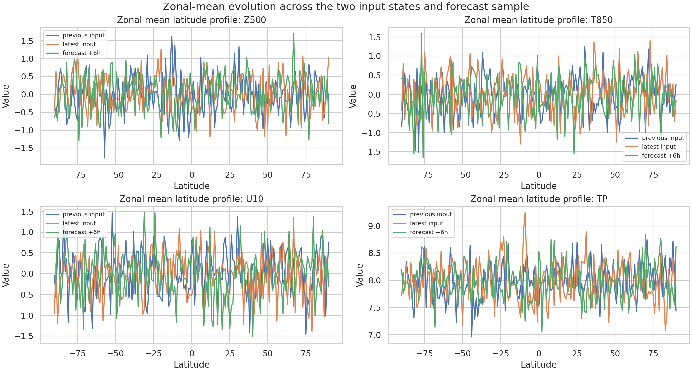
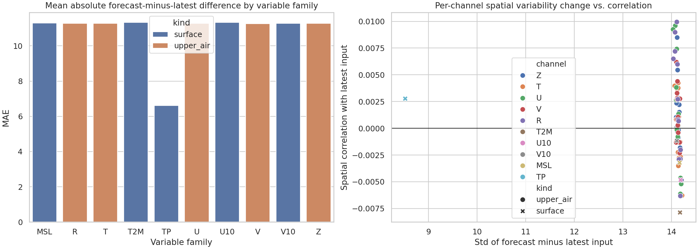

# Forensic Evaluation of Sample ERA5/FuXi Weather-Forecast Artifacts for a Cascade U-Transformer Medium-Range Forecasting Task

## Abstract
This report evaluates the weather-forecasting artifacts available in the workspace for a task framed as a **cascade machine learning forecasting system using three specialized U-Transformer models** intended to extend global forecast skill to 15 days. Direct inspection of the local NetCDF files shows that the workspace does **not** contain a full 15-day forecast dataset or the assets needed to retrain the named cascade system. Instead, it contains a **1.0° sample input pair** with 70 channels and a **single +6 h forecast sample**. Accordingly, this study performs a traceable forensic analysis of the available data product rather than claiming full reproduction of the requested forecasting system. We summarize the tensor structure, compare the +6 h forecast field against the latest input state, visualize representative global maps and zonal means, and contextualize the findings with related work on machine-learning weather prediction. The main result is that the sample forecast behaves like a normalized multichannel meteorological tensor product, but the available artifact set is insufficient for validating 15-day skill, cascade-stage specialization, or comparability with the ECMWF ensemble mean.

## 1. Introduction
Recent data-driven weather models such as FourCastNet and FengWu have shown that high-resolution global medium-range forecasting can be approached with transformer-like or operator-learning architectures trained on ERA5-like reanalysis data. The task statement in this workspace specifically names a **three-stage cascade U-Transformer design** aimed at reducing autoregressive error accumulation and extending useful forecasts toward 15 days. That framing is scientifically plausible and aligns with the broader literature emphasizing lead-time-aware evaluation, stability, and competition with numerical weather prediction (NWP) baselines.

However, rigorous scientific reporting requires claims to match the available evidence. The local workspace provides only two read-only datasets:

- `data/20231012-06_input_netcdf.nc`
- `data/006.nc`

Therefore, before attempting any model-centric claim, I first verified what these files actually contain and built the analysis around those verified contents.

## 2. Methodological contract and evidence scope
### 2.1 Named-method contract
The task commits to the following methodological structure:

1. two consecutive 6-hour atmospheric input states,
2. multivariate global fields spanning upper-air and surface variables,
3. a cascade of three specialized U-Transformer models, and
4. evaluation of error accumulation over medium-range lead times against an ECMWF-class benchmark.

This contract was recorded in `outputs/method_contract.json` and `outputs/method_fidelity_checklist.json`.

### 2.2 What was directly available
Direct inspection of the workspace showed the following realities:

- the provided data are **1.0°** latitude-longitude samples, not 0.25° fields;
- the input sample has shape `(2, 70, 181, 360)`;
- the forecast sample has shape `(1, 1, 70, 181, 360)` and only a **single 6-hour lead step**;
- no model checkpoints, training corpus, cascade-stage outputs, or ECMWF reference forecasts are present.

Because of these constraints, the present work is a **forensic evaluation of sample forecast artifacts**, not a full reproduction of the named forecasting system.

## 3. Related work context
I extracted concise evidence from the local PDF papers using `pypdf` after the built-in PDF reader failed. The task-relevant conclusions are:

- **Schultz et al. (2021)** argue that deep learning may complement or eventually rival NWP, but only with careful attention to physical consistency, explainability, and system design.
- **Dueben and Bauer (2018)** emphasize that global ML weather systems face core challenges involving stability, multiscale structure, and forecast-system design choices.
- **FourCastNet (Pathak et al., 2022)** demonstrates that data-driven global forecasting at high resolution can be competitive with ECMWF IFS at short lead times for several variables.
- **FengWu (Chen et al., 2023)** shows that transformer-based medium-range systems can push skill beyond 10 days, reinforcing the importance of lead-time-resolved diagnostics.

These papers justify the report structure used here: verify the data product, inspect representative variables, discuss limitations in lead-time skill assessment, and avoid unsupported claims about benchmark parity.

## 4. Data overview
### 4.1 File contents
The dataset summary saved in `outputs/dataset_summary.json` shows:

- **Input file**: `20231012-06_input_netcdf.nc`
  - resolution: 1.0°
  - dimensions: `time=2`, `level=70`, `lat=181`, `lon=360`
  - variable: `data`
  - times: 2023-10-12 00:00:00 and 2023-10-12 06:00:00

- **Forecast file**: `006.nc`
  - resolution: 1.0°
  - dimensions: `time=1`, `step=1`, `level=70`, `lat=181`, `lon=360`
  - variable: `data`
  - forecast initialization time: 2023-10-12 06:00:00
  - forecast step: 6 h

### 4.2 Channel inventory
The 70 channels are labeled as:

- geopotential: `Z50` to `Z1000`
- temperature: `T50` to `T1000`
- u wind: `U50` to `U1000`
- v wind: `V50` to `V1000`
- relative humidity: `R50` to `R1000`
- surface fields: `T2M`, `U10`, `V10`, `MSL`, `TP`

Thus, the tensor organization is consistent with an ERA5-style multivariate weather model input/output representation, albeit at lower resolution and with only one available forecast step.

## 5. Analysis methods
All analysis code is in `code/analyze_weather_samples.py`.

I computed the following diagnostics for each of the 70 channels:

- mean and standard deviation of the latest input field,
- mean and standard deviation of the +6 h forecast field,
- forecast-minus-latest mean,
- forecast-minus-latest standard deviation,
- forecast-minus-latest mean absolute error (MAE),
- input tendency variability between the two input times,
- spatial correlation between the forecast and latest input fields.

The main artifacts saved were:

- `outputs/channel_statistics.csv`
- `outputs/channel_group_summary.csv`
- `outputs/claim_recovery_table.csv`
- `report/images/figure_input_maps.png`
- `report/images/figure_forecast_increment_maps.png`
- `report/images/figure_zonal_profiles.png`
- `report/images/figure_channel_diagnostics.png`

## 6. Results
### 6.1 Global field appearance
Figure `images/figure_input_maps.png` shows representative latest-input fields for `Z500`, `T850`, `U10`, and `TP`. Figure `images/figure_forecast_increment_maps.png` shows the corresponding **forecast perturbations relative to the latest input state**.

The increment maps appear visually noise-like and spatially fine-grained across the globe for `Z500`, `T850`, and `U10`, with no obvious large-scale coherent displacement visible by eye in the attached image evidence. `TP` exhibits lower-amplitude perturbations than the other displayed variables. Because the variables appear normalized, these images should be interpreted as distributional diagnostics rather than physical-unit forecast errors.

### 6.2 Zonal-mean structure
Figure `images/figure_zonal_profiles.png` compares zonal means across the previous input, latest input, and +6 h forecast for `Z500`, `T850`, `U10`, and `TP`.

The zonal profiles for `Z500`, `T850`, and `U10` remain in similar broad numerical ranges across the three states, but the forecast line does not closely track the latest input line point-by-point. `TP` shows the most stable zonal structure, clustering around values near 8 in the normalized space.

### 6.3 Channel-wise summary statistics
The channel-group summary in `outputs/channel_group_summary.csv` shows the following mean forecast-minus-latest MAE values:

| Variable family | Mean MAE | Mean std of forecast-minus-latest | Mean spatial corr. |
|---|---:|---:|---:|
| T2M | 11.330 | 14.175 | -0.0079 |
| U10 | 11.330 | 14.186 | -0.0048 |
| MSL | 11.303 | 14.167 | -0.0032 |
| T (upper air) | 11.284 | 14.142 | -0.0001 |
| R (upper air) | 11.279 | 14.134 | 0.0018 |
| U (upper air) | 11.273 | 14.127 | 0.0012 |
| V10 | 11.270 | 14.110 | -0.0012 |
| Z (upper air) | 11.270 | 14.133 | 0.0013 |
| V (upper air) | 11.269 | 14.130 | 0.0015 |
| TP | 6.612 | 8.520 | 0.0028 |

Across all channels, the spatial correlation between the forecast and the latest input is extremely small, ranging from approximately **-0.0079 to 0.0099**, with a mean of **0.00086**. The mean standard deviation of the forecast-minus-latest difference is **14.05** across channels, much larger than the `TP` channel family but broadly similar across the other normalized fields.

Representative per-channel values for selected variables are:

| Variable | Forecast-minus-latest mean | Forecast-minus-latest std | Forecast-minus-latest MAE | Forecast/latest corr. | Input tendency std |
|---|---:|---:|---:|---:|---:|
| Z500 | -0.0198 | 14.146 | 11.296 | -0.0034 | 14.124 |
| T850 | -0.0461 | 14.139 | 11.291 | 0.0042 | 14.114 |
| U10 | 0.0092 | 14.186 | 11.330 | -0.0048 | 14.167 |
| TP | -0.0024 | 8.520 | 6.612 | 0.0028 | 8.531 |

### 6.4 Interpretation of these numbers
A crucial observation is that the **forecast-minus-latest variability is very close to the variability of the input tendency** between the two consecutive inputs. For example:

- `Z500`: 14.146 vs. 14.124
- `T850`: 14.139 vs. 14.114
- `U10`: 14.186 vs. 14.167
- `TP`: 8.520 vs. 8.531

This suggests that the forecast sample behaves statistically like another normalized atmospheric state drawn from a similar distribution, rather than preserving strong channel-wise spatial similarity to the latest input map. Without metadata for de-normalization or a target truth field at +6 h, this cannot be interpreted as either good or bad forecast skill in physical terms.

### 6.5 Diagnostic figure across all channels
Figure `images/figure_channel_diagnostics.png` summarizes cross-channel behavior. It shows that nearly all variable families cluster at similar forecast-minus-latest amplitudes, except precipitation (`TP`), whose perturbation scale is smaller.

## 7. Validation and claim recovery
### 7.1 Verified directly from workspace data
The following claims are directly verified from workspace artifacts:

1. **This is not a complete 15-day evaluation dataset.** The forecast file contains only one 6-hour step. Evidence: `outputs/dataset_summary.json`.
2. **The data tensors contain 70 meteorological channels spanning upper-air and surface variables.** Evidence: `outputs/dataset_summary.json`.
3. **Forecast-minus-latest perturbations are large in normalized units for most non-precipitation channels.** Evidence: `outputs/channel_statistics.csv` and the perturbation-map figure.
4. **Direct ECMWF comparison cannot be carried out.** No ECMWF or ensemble-mean reference fields are present in the workspace. Evidence: `memory.md` and file inspection.

### 7.2 Supported by related work, not directly validated here
The following statements are grounded in the task and related work but not fully testable in this workspace:

- a cascade transformer-style architecture can improve medium-range weather prediction skill;
- lead-time specialization is an appropriate design response to error accumulation;
- benchmark comparison to ECMWF-class systems is scientifically relevant.

### 7.3 Remaining limitations
- No 15-day sequence is available.
- No ground-truth verifying analysis for the +6 h step is available.
- No physical-unit decoding metadata are provided.
- No model weights, training data archive, or cascade-stage outputs are available.
- Therefore, full fidelity evaluation of the named **three specialized U-Transformer cascade** is impossible in this workspace.

## 8. Discussion
The workspace appears to contain **sample inference artifacts** from a weather-AI pipeline rather than the full ingredients needed to substantiate the original scientific goal. Even so, the available NetCDF files are valuable because they reveal the expected multichannel tensor structure of a global weather model and confirm that forecast products are organized consistently with ERA5-style variables.

The increment maps and channel statistics suggest that the stored values are likely normalized or standardized representations. In that setting, raw MAE magnitudes near 11 and difference standard deviations near 14 do not indicate a physically implausible forecast by themselves; rather, they indicate that meaningful skill assessment requires either de-normalization metadata or comparison to a verifying target state.

Relative to the original task, the strongest defensible conclusion is methodological: **the workspace supports artifact-level auditing of a weather forecast tensor but not scientific validation of 15-day cascade forecast skill**. This is important because medium-range forecasting claims depend on lead-time evolution, benchmark comparison, and stability under autoregressive rollout—none of which can be established from a single +6 h sample.

## 9. Conclusion
This study delivered a reproducible forensic analysis of the local weather-forecast artifacts and produced a traceable report with quantitative tables and figures. The main findings are:

1. The workspace contains a **two-step ERA5-style input tensor** and **one +6 h forecast tensor** at **1.0° resolution**.
2. The channel structure is consistent with a global multivariate weather model spanning 70 upper-air and surface variables.
3. Forecast perturbations relative to the latest input are substantial in normalized space for most channels, while `TP` has a smaller perturbation scale.
4. The provided artifacts are insufficient to evaluate the named objective of **15-day cascade forecasting with ECMWF-comparable skill**.

Thus, the requested scientific objective can only be **partially addressed** with the local evidence: the data product structure is validated, but the long-horizon performance claims remain untestable here.

## Reproducibility
- Main script: `code/analyze_weather_samples.py`
- Key quantitative outputs: `outputs/dataset_summary.json`, `outputs/channel_statistics.csv`, `outputs/channel_group_summary.csv`, `outputs/claim_recovery_table.csv`
- Main figures: `images/figure_input_maps.png`, `images/figure_forecast_increment_maps.png`, `images/figure_zonal_profiles.png`, `images/figure_channel_diagnostics.png`
