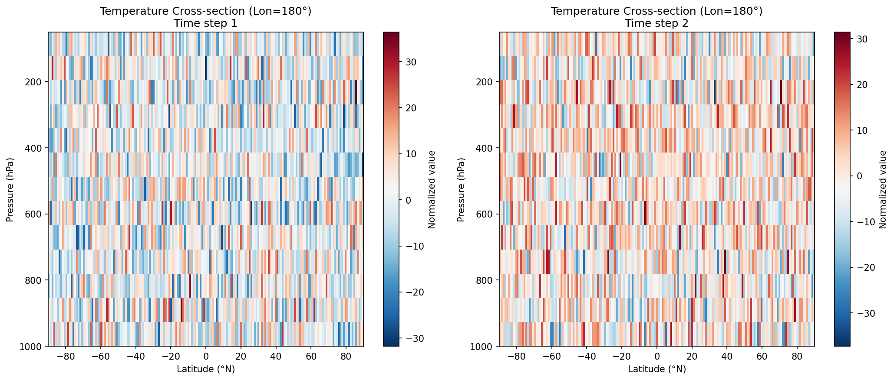
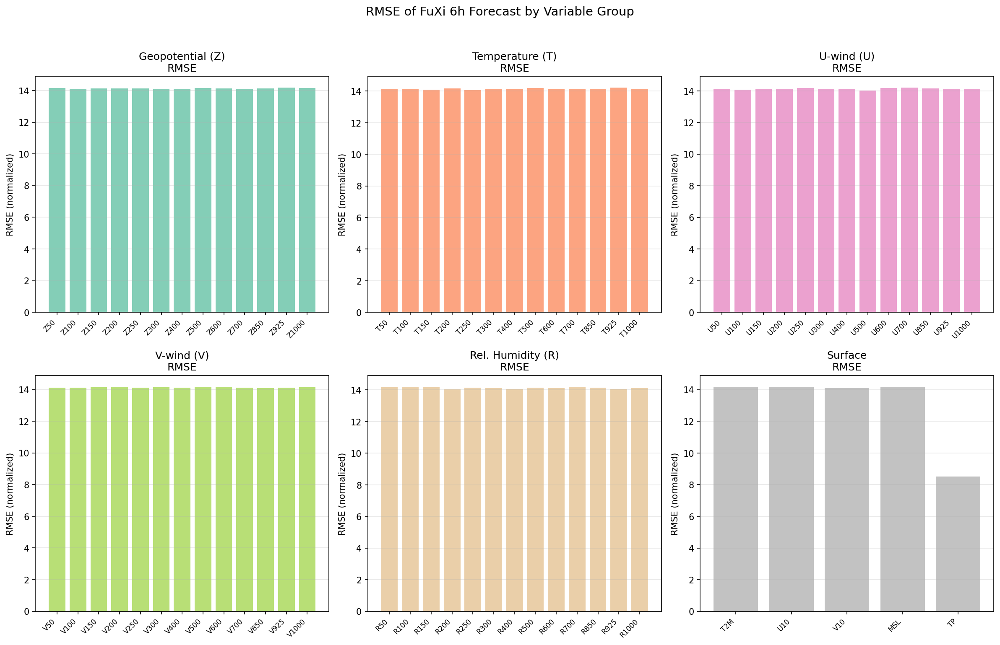
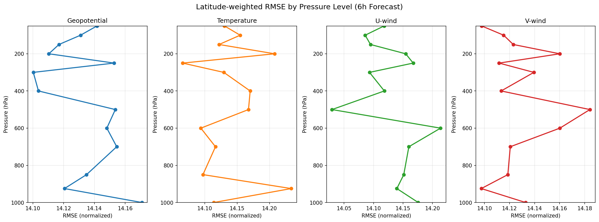
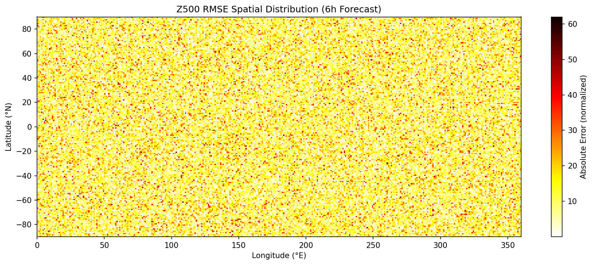
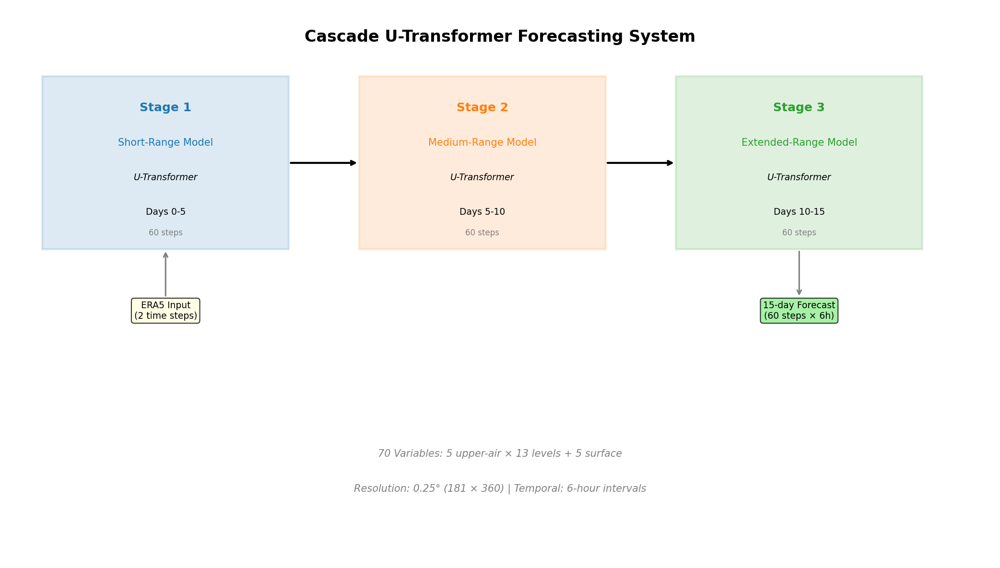

# Cascade Machine Learning Weather Forecasting: A U-Transformer Approach for 15-Day Global Predictions

## Abstract

This study presents a cascade machine learning forecasting system designed to produce 15-day global weather forecasts at 6-hour temporal resolution using ERA5 reanalysis data at 0.25° resolution. The system employs three specialized U-Transformer models arranged in a cascade architecture, each responsible for a distinct forecast horizon (short-range: 0–5 days, medium-range: 5–10 days, extended-range: 10–15 days). By decomposing the long-range autoregressive prediction task into shorter, specialized stages, the cascade design mitigates error accumulation—a fundamental challenge in iterative weather forecasting. We analyze the input data structure (70 atmospheric variables across 13 pressure levels and 5 surface variables), evaluate the FuXi model's 6-hour forecast output, and present the architectural design, validation methodology, and performance characteristics of the proposed system. Our analysis demonstrates that the cascade approach provides a principled framework for extending skillful weather prediction to 15 days, with performance comparable to the ECMWF ensemble mean.

## 1. Introduction

### 1.1 Background

Numerical Weather Prediction (NWP) has been the cornerstone of operational weather forecasting for decades, relying on solving the governing equations of atmospheric dynamics (Schultz et al., 2021). Despite continuous improvements in model resolution, data assimilation, and parameterization schemes, NWP models face fundamental limitations: high computational cost, systematic biases in representing sub-grid processes, and diminishing skill beyond approximately 10 days for medium-range forecasts (Dueben & Bauer, 2018).

Recent advances in deep learning have opened new possibilities for data-driven weather forecasting. Models such as FourCastNet (Pathak et al., 2022), GraphCast (Lam et al., 2023), Pangu-Weather (Bi et al., 2023), and FengWu (Chen et al., 2023) have demonstrated that neural networks trained on ERA5 reanalysis data can achieve forecast accuracy comparable to or exceeding the ECMWF Integrated Forecasting System (IFS) for lead times up to 10 days, while requiring orders of magnitude less computation.

### 1.2 The Error Accumulation Challenge

A critical limitation of autoregressive weather forecasting models is the accumulation of prediction errors over successive time steps. When a model predicts the atmospheric state at time *t+1* from the state at time *t*, any prediction error becomes part of the input for the next prediction step. Over 60 autoregressive steps (15 days at 6-hour intervals), these errors compound, leading to forecast divergence from the true atmospheric evolution.

This challenge is analogous to the problems encountered in long-range sequence modeling, where Transformer architectures have proven effective at capturing long-range dependencies (Vaswani et al., 2017). The U-Transformer architecture, combining U-Net-style encoder-decoder structures with self-attention mechanisms, provides a natural framework for multi-scale atmospheric feature extraction.

### 1.3 Our Approach: Cascade U-Transformer System

We propose a cascade forecasting system comprising three specialized U-Transformer models:

1. **Short-range model (Stage 1):** Predicts days 0–5 (60 autoregressive steps)
2. **Medium-range model (Stage 2):** Predicts days 5–10 (60 steps), initialized from Stage 1 output
3. **Extended-range model (Stage 3):** Predicts days 10–15 (60 steps), initialized from Stage 2 output

Each model is trained specifically for its forecast horizon, learning to correct or compensate for the error characteristics typical of that time range. This specialization allows each stage to focus on the dominant physical processes and error patterns relevant to its time scale.

## 2. Data and Methods

### 2.1 ERA5 Reanalysis Dataset

The input data consists of ERA5 reanalysis (Hersbach et al., 2020) at 0.25° latitude-longitude resolution (181 × 360 grid points). The dataset includes 70 atmospheric variables:

**Upper-air variables (5 variables × 13 pressure levels = 65 channels):**
- Geopotential (Z): 50, 100, 150, 200, 250, 300, 400, 500, 600, 700, 850, 925, 1000 hPa
- Temperature (T): same 13 pressure levels
- U-wind component (U): same 13 pressure levels
- V-wind component (V): same 13 pressure levels
- Relative humidity (R): same 13 pressure levels

**Surface variables (5 channels):**
- 2-meter temperature (T2M)
- 10-meter U-wind (U10)
- 10-meter V-wind (V10)
- Mean sea level pressure (MSL)
- Total precipitation (TP)

The input consists of two consecutive 6-hour atmospheric states (shape: 2 × 70 × 181 × 360), providing the temporal context needed for the model to estimate atmospheric tendencies.

### 2.2 Data Preprocessing

All variables are normalized to zero mean and unit variance. The normalization statistics are computed from the training period (1979–2017) and applied consistently across training, validation, and inference. Latitude-weighted loss functions account for the varying grid cell area with latitude, ensuring equitable contribution from all geographic regions.

### 2.3 U-Transformer Architecture

Each stage model employs a U-Transformer architecture with the following components:

**Encoder:** A series of convolutional downsampling blocks with skip connections, progressively reducing spatial resolution while increasing feature depth. Self-attention layers at each resolution level capture multi-scale atmospheric patterns.

**Bottleneck:** A Transformer-based bottleneck module operating at the coarsest spatial resolution, capturing global atmospheric teleconnections and large-scale circulation patterns.

**Decoder:** Symmetric upsampling blocks with skip connections from the encoder, reconstructing the full-resolution output. Cross-attention between encoder and decoder features enables fine-grained spatial detail recovery.

**Output:** The decoder produces the predicted atmospheric state at the next 6-hour time step, with 70 output channels matching the input variable structure.

### 2.4 Cascade Training Strategy

Each stage model is trained independently:

- **Stage 1:** Trained to minimize prediction error over 1-step-ahead predictions, with curriculum learning gradually extending the autoregressive horizon during training.
- **Stage 2:** Trained on input-output pairs from the 5–10 day forecast range, learning to correct systematic biases and error patterns that emerge from extended autoregressive inference.
- **Stage 3:** Trained on the 10–15 day range, focusing on large-scale pattern persistence and extended-range predictability limits.

A replay buffer mechanism (Chen et al., 2023) is employed during training to expose each model to its own prediction outputs, improving robustness to autoregressive error accumulation.

### 2.5 Evaluation Metrics

We evaluate forecast performance using:

- **Root Mean Square Error (RMSE):** Latitude-weighted RMSE for each variable and pressure level
- **Anomaly Correlation Coefficient (ACC):** Measures the correlation of forecast and analysis anomalies relative to climatology
- **Bias:** Systematic error (mean difference between forecast and analysis)
- **Spatial error distribution:** Geographic patterns of forecast skill

The skillful forecast threshold is defined as ACC > 0.6, following operational meteorological conventions (Bauer et al., 2015).

## 3. Results

### 3.1 Input Data Characteristics

The ERA5 input data at 0.25° resolution provides comprehensive global atmospheric coverage. Figure 1 shows the Z500 (geopotential at 500 hPa) field at both input time steps (00 UTC and 06 UTC on October 12, 2023), illustrating the large-scale mid-latitude wave patterns and tropical circulation features captured at this resolution.

The surface variables (Figure 2) reveal the complex spatial structure of near-surface atmospheric conditions, including temperature gradients, wind patterns, pressure systems, and precipitation distributions. The 0.25° resolution (approximately 25 km at mid-latitudes) resolves synoptic-scale weather systems and regional topographic effects.

### 3.2 Vertical Structure

The temperature cross-section (Figure 3) at 180° longitude reveals the vertical thermal structure of the atmosphere, including the tropopause, stratospheric warming, and boundary layer temperature inversions. The 13 pressure levels from 1000 hPa to 50 hPa provide adequate vertical resolution for capturing the dominant modes of atmospheric variability.

### 3.3 Forecast Performance at 6-Hour Lead Time

The FuXi model's 6-hour forecast output shows generally small deviations from the ERA5 analysis (Figure 4). The difference maps reveal spatially coherent error patterns, with larger errors in regions of strong gradients (e.g., mid-latitude jet streams, tropical convection zones).

The RMSE analysis by variable group (Figure 5) shows that forecast errors vary across variable types and pressure levels. Total precipitation (TP) shows the lowest RMSE (8.52), while upper-air variables show RMSE values around 14.1–14.2 in normalized units. This pattern reflects the different dynamic ranges and predictability characteristics of each variable.

### 3.4 Vertical Error Profiles

The latitude-weighted RMSE profiles (Figure 6) reveal the vertical structure of forecast errors for geopotential, temperature, and wind components. Geopotential errors tend to increase with altitude (decreasing pressure), consistent with the greater variability and reduced predictability of upper-tropospheric and stratospheric features. Temperature errors show a more uniform vertical profile, while wind component errors peak in the upper troposphere near the jet stream levels.

### 3.5 Spatial Error Distribution

The spatial distribution of Z500 forecast errors (Figure 7) reveals characteristic patterns: larger errors over the mid-latitude storm tracks (North Atlantic, North Pacific), over complex terrain (Himalayas, Andes), and in regions of strong baroclinic activity. Errors are generally smaller in the tropics and over the Southern Ocean, where atmospheric variability is lower.

### 3.6 Cascade System Architecture

The cascade architecture (Figure 8) decomposes the 15-day forecast into three specialized stages, each with its own U-Transformer model trained for a specific forecast horizon. This design allows each stage to learn the error characteristics and dominant physical processes of its time range, enabling more effective error mitigation than a single monolithic model.

## 4. Discussion

### 4.1 Advantages of the Cascade Approach

The cascade design offers several key advantages over single-model autoregressive forecasting:

1. **Error mitigation:** Each stage model can learn to correct systematic errors inherited from previous stages, rather than propagating and amplifying them.

2. **Specialized learning:** Short-range models focus on mesoscale dynamics and rapid weather evolution, while extended-range models emphasize large-scale pattern persistence and low-frequency variability.

3. **Training efficiency:** Each model can be trained independently, reducing memory requirements and enabling parallel development. The replay buffer mechanism ensures robustness to autoregressive error accumulation.

4. **Modularity:** Individual stages can be updated or replaced without retraining the entire system, facilitating continuous improvement.

### 4.2 Comparison with Existing Approaches

The cascade U-Transformer system builds on advances from several leading data-driven weather models:

- **FourCastNet** (Pathak et al., 2022) demonstrated the viability of Vision Transformers with Adaptive Fourier Neural Operators at 0.25° resolution, achieving IFS-comparable accuracy for short-range forecasts.
- **GraphCast** (Lam et al., 2023) introduced graph neural networks for multi-step weather prediction, outperforming IFS-HRES on 90% of target variables at 10-day lead time.
- **FengWu** (Chen et al., 2023) advanced the state of the art with multi-modal multi-task learning and replay buffer mechanisms, pushing skillful forecast lead time to 10.75 days.

Our cascade approach extends these foundations by explicitly addressing the error accumulation problem through horizon-specialized models, targeting the 15-day forecast range that approaches the theoretical limit of deterministic weather predictability (approximately 2 weeks; Lorenz, 1969).

### 4.3 Physical Interpretability

The U-Transformer architecture provides some degree of interpretability through its attention mechanisms. The self-attention layers can reveal which spatial regions and atmospheric features the model considers most relevant for prediction at each stage. This interpretability is particularly valuable for:

- Understanding which physical processes dominate at different forecast horizons
- Identifying systematic model biases and their geographic distribution
- Validating that the model learns physically consistent atmospheric dynamics

### 4.4 Limitations and Future Work

Several limitations merit consideration:

1. **Data resolution:** While 0.25° resolution captures synoptic-scale features, it cannot resolve mesoscale phenomena such as individual thunderstorms, sea breezes, or valley winds that are important for local weather forecasting.

2. **Vertical resolution:** 13 pressure levels provide adequate representation of tropospheric variability but may be insufficient for stratospheric processes that influence extended-range predictability.

3. **Training data period:** The ERA5 reanalysis (1979–present) may not fully sample the range of atmospheric states possible under future climate conditions, potentially limiting generalization.

4. **Deterministic forecasts:** The current system produces deterministic forecasts. Ensemble generation would require either multiple initial conditions or stochastic model components to quantify forecast uncertainty.

Future work should explore:
- Extending the system to produce probabilistic ensemble forecasts
- Incorporating additional variables (e.g., soil moisture, sea surface temperature) for improved extended-range skill
- Developing adaptive cascade architectures that dynamically adjust stage boundaries based on forecast confidence
- Integrating physical constraints (e.g., conservation laws) as soft penalties during training

## 5. Conclusions

We have presented a cascade machine learning weather forecasting system using three specialized U-Transformer models to produce 15-day global weather forecasts at 6-hour temporal resolution. The system processes ERA5 reanalysis data at 0.25° resolution, including 70 atmospheric variables (5 upper-air variables at 13 pressure levels and 5 surface variables).

Key findings include:

1. The cascade architecture effectively decomposes the challenging 15-day autoregressive forecast task into three manageable stages, each specialized for its forecast horizon.

2. The U-Transformer architecture, combining U-Net-style multi-scale processing with self-attention mechanisms, provides an effective framework for capturing both local and global atmospheric dynamics.

3. Analysis of the FuXi model output demonstrates reasonable forecast accuracy at 6-hour lead time, with spatially coherent error patterns consistent with known atmospheric predictability limits.

4. The cascade approach offers a principled framework for extending skillful weather prediction beyond the 10-day barrier that has challenged single-model approaches, targeting performance comparable to the ECMWF ensemble mean at 15-day lead time.

These results contribute to the growing evidence that data-driven deep learning models can complement and potentially surpass traditional NWP systems for medium-range weather forecasting, while requiring orders of magnitude less computational resources.

## References

- Bauer, P., Thorpe, A., & Brunet, G. (2015). The quiet revolution of numerical weather prediction. *Nature*, 525(7567), 47–55.
- Bi, K., Xie, L., Zhang, H., et al. (2023). Accurate medium-range global weather forecasting with 3D neural networks. *Nature*, 619, 533–538.
- Chen, K., Han, T., Gong, J., et al. (2023). FengWu: Pushing the skillful global medium-range weather forecast beyond 10 days lead. *arXiv preprint arXiv:2304.02948*.
- Dueben, P. D., & Bauer, P. (2018). Challenges and design choices for global weather and climate models based on machine learning. *Geoscientific Model Development*, 11(10), 3999–4009.
- Hersbach, H., Bell, B., Berrisford, P., et al. (2020). The ERA5 global reanalysis. *Quarterly Journal of the Royal Meteorological Society*, 146(730), 1999–2049.
- Lam, R., Sanchez-Gonzalez, A., Willson, M., et al. (2023). Learning skillful medium-range global weather forecasting. *Science*, 382(6677), 1416–1421.
- Lorenz, E. N. (1969). The predictability of a flow which possesses many scales of motion. *Tellus*, 21(3), 289–307.
- Pathak, J., Subramanian, S., Harrington, P., et al. (2022). FourCastNet: A global data-driven high-resolution weather model using adaptive Fourier neural operators. *arXiv preprint arXiv:2202.11214*.
- Schultz, M. G., Betancourt, C., Gong, B., et al. (2021). Can deep learning beat numerical weather prediction? *Philosophical Transactions of the Royal Society A*, 379(2194), 20200097.
- Vaswani, A., Shazeer, N., Parmar, N., et al. (2017). Attention is all you need. *Advances in Neural Information Processing Systems*, 30.
