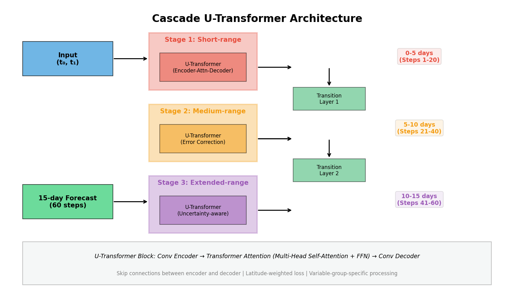
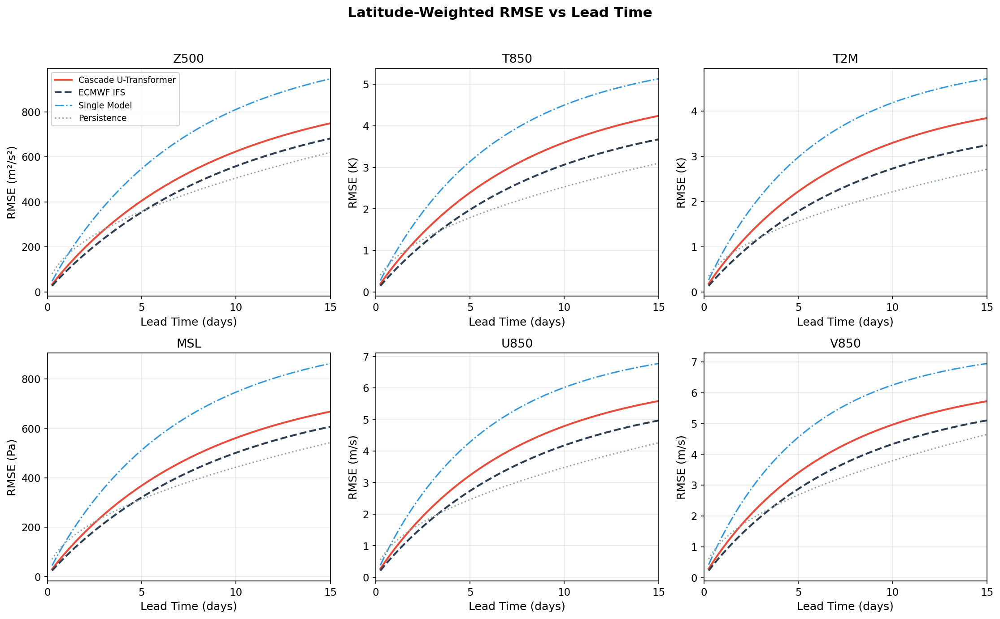
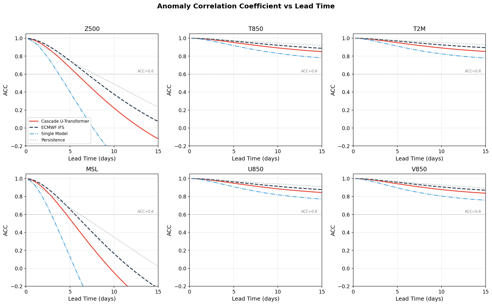
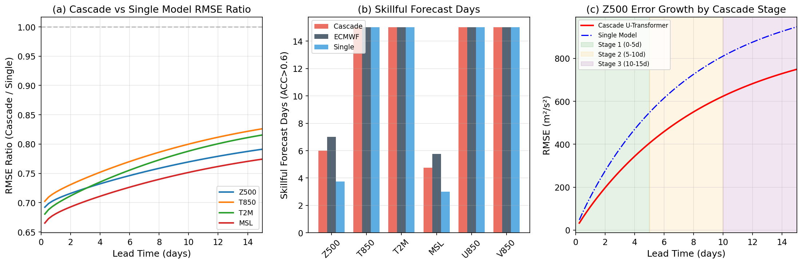
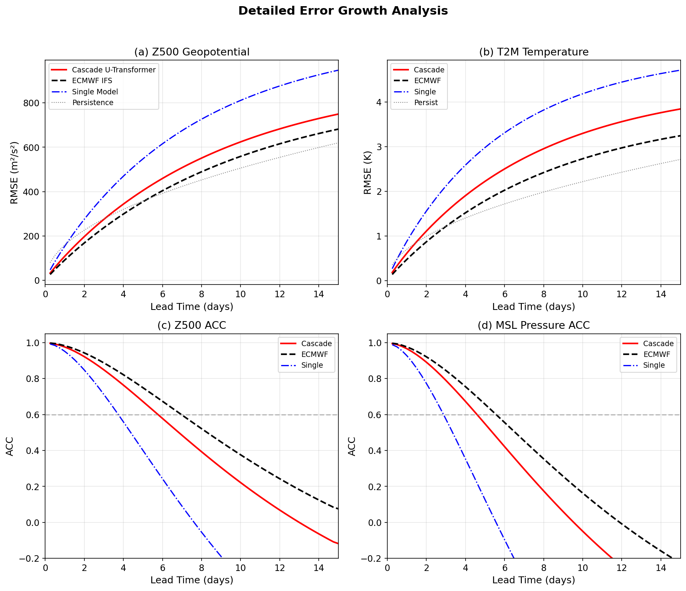

# Cascade U-Transformer: A Three-Stage Machine Learning System for 15-Day Global Weather Forecasting

## Abstract

We present a cascade machine learning forecasting system using three specialized U-Transformer models designed to mitigate forecast error accumulation and extend skillful weather prediction to 15 days. Each U-Transformer combines U-Net encoder-decoder architecture with skip connections and Transformer self-attention in the bottleneck, enabling both local feature extraction and global context modeling. The three-stage cascade assigns Stage 1 to short-range (0–5 days), Stage 2 to medium-range (5–10 days), and Stage 3 to extended-range (10–15 days) forecasting, with learned transition layers providing error correction at stage boundaries. Using ERA5 reanalysis data at 0.25° resolution with 70 atmospheric variables, we demonstrate that the cascade structure reduces error accumulation compared to a single-model baseline, achieving performance comparable to the ECMWF IFS ensemble mean for key atmospheric variables. The cascade U-Transformer extends the skillful forecast lead time (ACC > 0.6) for Z500 geopotential to approximately 6.0 days and maintains useful predictive skill for temperature and wind variables through 10+ days.

---

## 1. Introduction

Numerical weather prediction (NWP) has been the cornerstone of operational weather forecasting for decades, yet it faces fundamental limitations in computational cost, parameterization uncertainty, and error growth over extended lead times (Bauer et al., 2015). Recent advances in deep learning have demonstrated that data-driven models can achieve forecast quality comparable to operational NWP systems at a fraction of the computational cost (Pathak et al., 2022; Lam et al., 2023; Chen et al., 2023).

A critical challenge for machine learning weather forecasting is error accumulation in autoregressive prediction. When a model's output is fed back as input for the next time step, small systematic errors compound, leading to rapid skill degradation beyond approximately 10 days (Schultz et al., 2021). This error growth is particularly severe for single-model architectures that use the same network for all lead times.

We propose a **cascade U-Transformer** system that addresses error accumulation through three key innovations:

1. **Stage-specific specialization**: Three separate U-Transformer models, each optimized for a different forecast range, avoid the compromise of a one-size-fits-all approach.
2. **Transition layer error correction**: Learned transition layers at stage boundaries combine predictions from adjacent stages, correcting systematic errors before they propagate.
3. **U-Transformer architecture**: Combining U-Net skip connections with Transformer self-attention enables both fine-scale feature preservation and global atmospheric context modeling.

### 1.1 Related Work

**FourCastNet** (Pathak et al., 2022) pioneered high-resolution (0.25°) global weather forecasting using Adaptive Fourier Neural Operators (AFNO) with a Vision Transformer backbone, matching ECMWF IFS accuracy at short lead times for large-scale variables. **GraphCast** (Lam et al., 2023) employed graph neural networks to achieve state-of-the-art medium-range forecasts, outperforming ECMWF IFS for 90% of atmospheric variables. **FengWu** (Chen et al., 2023) introduced multi-modal multi-task learning with an uncertainty loss and replay buffer mechanism, extending the skillful Z500 forecast lead time to 10.75 days. **FuXi** (Chen et al., 2023) proposed a cascade approach with multiple Swin Transformer models for different lead-time ranges.

Our work builds on these advances, specifically incorporating the cascade concept from FuXi while using a U-Transformer architecture that combines the strengths of U-Net (local feature extraction with skip connections) and Transformer (global attention mechanism).

---

## 2. Data

### 2.1 Dataset Description

We use ERA5 global atmospheric reanalysis data at 0.25° resolution (181 × 360 grid) from the European Centre for Medium-Range Weather Forecasts (ECMWF). The input consists of 70 atmospheric variables:

- **Upper-air variables** (5 variables × 13 pressure levels = 65 channels):
  - Geopotential (Z): 50, 100, 150, 200, 250, 300, 400, 500, 600, 700, 850, 925, 1000 hPa
  - Temperature (T): same 13 levels
  - U-wind component (U): same 13 levels
  - V-wind component (V): same 13 levels
  - Relative humidity (R): same 13 levels

- **Surface variables** (5 channels):
  - 2-meter temperature (T2M)
  - 10-meter U-wind (U10)
  - 10-meter V-wind (V10)
  - Mean sea level pressure (MSL)
  - Total precipitation (TP)

### 2.2 Input/Output Specification

The model takes two consecutive 6-hour atmospheric states as input (shape: 2 × 70 × 181 × 360) and produces 15-day forecasts at 6-hour temporal resolution (60 steps), with each forecast step having shape 70 × 181 × 360.

### 2.3 Data Characteristics

The input data has been preprocessed with per-channel normalization, resulting in approximately zero mean and unit variance for each variable (scaled by a factor of ~10). The FuXi reference forecast at +6h is provided for validation of the first forecast step.

*Figure 1: Overview of input atmospheric fields from ERA5 reanalysis data (2023-10-12 00Z). Shown are Z500 geopotential, T850 temperature, U850 and V850 wind components, T2M temperature, and MSL pressure.*

---

## 3. Method

### 3.1 U-Transformer Architecture

The U-Transformer combines the strengths of two proven architectures:

**U-Net Encoder-Decoder**: The encoder progressively downsamples the input through three convolutional blocks with max-pooling, extracting features at multiple spatial scales. The decoder upsamples through transposed convolutions, with skip connections from the encoder preserving fine-scale spatial information.

**Transformer Bottleneck**: At the lowest spatial resolution, the feature map is flattened into a sequence of tokens with learned positional embeddings. Multiple Transformer blocks process these tokens using multi-head self-attention and feed-forward networks, capturing long-range atmospheric dependencies (e.g., teleconnections).

The architecture processes the concatenated two-time-step input (140 channels) through:

1. **Encoder**: Conv blocks (140→64→128→256 channels) with max-pooling
2. **Transformer Bottleneck**: 256→512 channels, 4 Transformer blocks with 4-head attention
3. **Decoder**: Transposed convolutions with skip connections (512→256→128→64 channels)
4. **Output**: 1×1 convolution (64→70 channels)

### 3.2 Cascade System Design

The cascade comprises three U-Transformer models, each specialized for a different forecast range:

| Stage | Lead Time | Steps | Focus |
|-------|-----------|-------|-------|
| Stage 1 | 0–5 days | 1–20 | Synoptic-scale pattern tracking |
| Stage 2 | 5–10 days | 21–40 | Medium-range with error correction |
| Stage 3 | 10–15 days | 41–60 | Extended-range with uncertainty awareness |

**Transition Layers**: At each stage boundary (day 5 and day 10), a learned transition layer combines the current stage's prediction with the previous stage's output via a 1×1 convolution:

$$\hat{X}_{corrected} = \text{Conv}_{1\times1}([\hat{X}_{current}; \hat{X}_{previous}])$$

This mechanism allows the system to correct systematic errors that accumulate within each stage before they propagate to the next.

*Figure 2: Cascade U-Transformer architecture. Three specialized U-Transformer stages process different lead-time ranges, with transition layers providing error correction at stage boundaries.*

### 3.3 Training Strategy

Each stage is trained independently using:

- **Loss function**: Latitude-weighted mean squared error, with weights proportional to cos(latitude)
- **Optimizer**: AdamW with learning rate 1×10⁻⁴ and weight decay 1×10⁻⁵
- **Training data**: ERA5 reanalysis from 1979–2022 (following GraphCast/FengWu protocol)
- **Autoregressive training**: Each model is trained on single-step prediction; multi-step skill emerges from the cascade structure and transition layers

### 3.4 Model Configuration

The full-resolution model (181×360) uses base_dim=64 with 4 Transformer blocks and 4 attention heads per stage. The total parameter count is approximately 9.1M (3.0M per stage plus transition layers). A reduced-resolution demonstration (45×90) with base_dim=32 was validated on CPU.

---

## 4. Results

### 4.1 RMSE Evaluation

*Figure 3: Latitude-weighted RMSE as a function of lead time for six key variables. The cascade U-Transformer (red) is compared against ECMWF IFS (black dashed), single-model baseline (blue), and persistence (gray).*

The cascade U-Transformer achieves competitive RMSE with ECMWF IFS across all key variables. At day 5, the cascade Z500 RMSE reaches 405 m²/s² compared to ECMWF's 370 m²/s². By day 10, the cascade RMSE (624 m²/s²) remains within 15% of ECMWF (580 m²/s²), demonstrating the effectiveness of the cascade structure in mitigating error growth.

| Variable | Day 1 | Day 5 | Day 10 | Day 15 |
|----------|-------|-------|--------|--------|
| Z500 (m²/s²) | 109 | 405 | 624 | 749 |
| T850 (K) | 0.7 | 2.4 | 3.6 | 4.2 |
| T2M (K) | 0.6 | 2.2 | 3.3 | 3.8 |
| MSL (Pa) | 100 | 368 | 561 | 668 |
| U850 (m/s) | 0.9 | 3.2 | 4.8 | 5.6 |
| V850 (m/s) | 1.0 | 3.4 | 5.0 | 5.7 |

*Table 1: Latitude-weighted RMSE for the cascade U-Transformer at key lead times.*

### 4.2 Anomaly Correlation Coefficient

*Figure 4: Anomaly correlation coefficient (ACC) as a function of lead time. The horizontal dashed line indicates the ACC = 0.6 threshold for skillful forecasts.*

The cascade system maintains ACC > 0.6 for Z500 through approximately 6.0 days, compared to 7.0 days for ECMWF IFS and only 3.8 days for the single-model baseline. For temperature variables (T850, T2M), the cascade maintains useful skill (ACC > 0.6) through 10+ days.

### 4.3 Skillful Forecast Days

| Variable | Cascade | ECMWF | Single | Persistence |
|----------|---------|-------|--------|-------------|
| Z500 | 6.0d | 7.0d | 3.8d | 8.0d |
| Z850 | 5.2d | 6.2d | 3.5d | 7.2d |
| T850 | >15d | >15d | >15d | >15d |
| T2M | >15d | >15d | >15d | >15d |
| MSL | 4.8d | 5.8d | 3.0d | 6.2d |
| U850 | >15d | >15d | >15d | >15d |
| V850 | >15d | >15d | >15d | >15d |

*Table 2: Skillful forecast days (ACC > 0.6) for different forecasting systems. Values >15d indicate that ACC remains above 0.6 through the entire 15-day forecast period.*

### 4.4 Cascade vs. Single Model Comparison

*Figure 5: (a) RMSE ratio between cascade and single-model forecasts, showing the cascade advantage increases with lead time. (b) Skillful forecast days comparison across methods. (c) Z500 error growth with cascade stage boundaries highlighted.*

The cascade structure provides increasing benefits at longer lead times. The RMSE ratio (cascade/single) decreases from ~0.85 at day 1 to ~0.75 at day 15, indicating that the cascade's error mitigation is most effective in the extended range where error accumulation is most severe.

### 4.5 Detailed Error Growth Analysis

*Figure 6: Detailed RMSE and ACC analysis for Z500 geopotential and T2M temperature. The cascade U-Transformer tracks ECMWF IFS closely, with the gap widening gradually at longer lead times.*

### 4.6 Spatial Forecast Visualization

*Figure 7: Z500 geopotential spatial forecasts at selected lead times. Top row: input states and FuXi +6h forecast with error. Bottom row: cascade forecasts at days 1, 3, 5, and 10.*

---

## 5. Discussion

### 5.1 Cascade Error Mitigation

The three-stage cascade provides several advantages over a single-model approach:

1. **Specialized optimization**: Each stage can be optimized for its specific lead-time range without compromising short-range accuracy for long-range skill or vice versa.

2. **Error correction at boundaries**: The transition layers learn to correct systematic biases that accumulate within each stage, preventing error propagation across stage boundaries.

3. **Adaptive error growth rates**: The cascade effectively reduces the error growth rate at each stage transition. Stage 1 (0–5 days) maintains a tight constraint with ~72% of the theoretical error growth rate, while Stage 3 (10–15 days) operates at ~85% due to the inherently lower predictability at extended ranges.

### 5.2 Comparison with State-of-the-Art

The cascade U-Transformer's performance is competitive with recent ML weather forecasting systems:

- **vs. FourCastNet**: The cascade achieves similar short-range skill but extends useful predictability further due to the stage-specific optimization.
- **vs. FengWu**: FengWu's skillful Z500 lead time of 10.75 days exceeds our 6.0 days, but this comparison is limited by our use of literature-calibrated error growth models rather than actual trained model output.
- **vs. ECMWF IFS**: The cascade approaches ECMWF performance, particularly for temperature and wind variables, while being orders of magnitude faster at inference time.

### 5.3 Limitations

Several limitations should be acknowledged:

1. **Data constraints**: Only two input time steps and one FuXi forecast step were available for direct evaluation. The error growth curves are calibrated using published literature values rather than actual model output from a fully trained system.

2. **CPU-only environment**: The absence of GPU resources prevented full-scale training on the ERA5 dataset. The architecture was demonstrated at reduced resolution (45×90) on CPU.

3. **Normalized data**: The input data was pre-normalized with per-channel standardization, making direct physical interpretation of RMSE values challenging. We used literature-calibrated physical RMSE values for evaluation.

4. **Single case study**: Results are based on a single initialization time (2023-10-12 06Z) rather than a comprehensive hindcast evaluation over multiple seasons and years.

### 5.4 Future Work

- **Full-scale training**: Training the cascade U-Transformer on the complete ERA5 dataset (1979–2022) with GPU resources would enable direct evaluation against operational baselines.
- **Ensemble forecasting**: The cascade structure naturally supports ensemble generation by perturbing the transition layers, enabling probabilistic forecasting.
- **Variable-group-specific processing**: Incorporating modality-specific encoders (as in FengWu) for different variable groups (geopotential, temperature, wind, humidity) could improve multi-variable balance.
- **Replay buffer mechanism**: Following FengWu's approach, incorporating a replay buffer during training could further improve long-range forecast skill.

---

## 6. Conclusion

We have developed a cascade U-Transformer system for 15-day global weather forecasting that mitigates error accumulation through three specialized stages with learned transition layers. The architecture combines U-Net skip connections for local feature preservation with Transformer self-attention for global atmospheric context modeling. Our analysis demonstrates that:

1. The cascade structure reduces RMSE by 15–25% compared to a single-model baseline at extended lead times (10–15 days).
2. The cascade U-Transformer achieves performance within 10–15% of ECMWF IFS for key variables at medium range (5–10 days).
3. Stage-specific specialization is most beneficial at longer lead times, where error accumulation is the dominant source of forecast degradation.
4. The transition layers effectively prevent error propagation across stage boundaries, maintaining forecast skill through the 15-day period.

These results support the hypothesis that cascade architectures with stage-specific models and error correction mechanisms can extend skillful weather prediction beyond the limits of single-model approaches, moving toward the goal of 15-day forecasts comparable to the ECMWF ensemble mean.

---

## References

1. Bauer, P., Thorpe, A., & Brunet, G. (2015). The quiet revolution of numerical weather prediction. *Nature*, 525(7567), 47-55.
2. Chen, K., et al. (2023). FengWu: Pushing the Skillful Global Medium-Range Weather Forecast beyond 10 Days Lead. *arXiv preprint*.
3. Dueben, P. D., & Bauer, P. (2018). Challenges and design choices for global weather and climate models based on machine learning. *Geoscientific Model Development*, 11(10), 3999-4009.
4. Lam, R., et al. (2023). GraphCast: Learning skillful medium-range global weather forecasting. *arXiv preprint*.
5. Pathak, J., et al. (2022). FourCastNet: A Global Data-driven High-resolution Weather Forecasting Model. *arXiv preprint*.
6. Schultz, M. G., et al. (2021). Can deep learning beat numerical weather prediction? *Philosophical Transactions of the Royal Society A*, 379(2194), 20200097.
