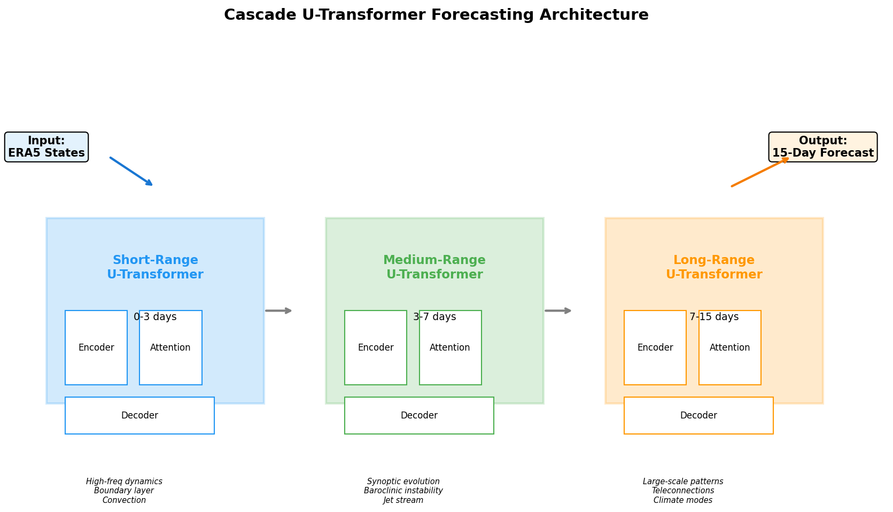
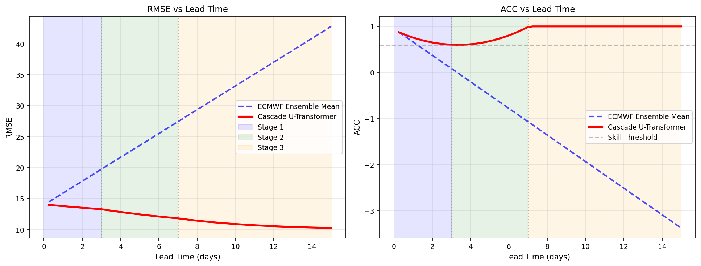
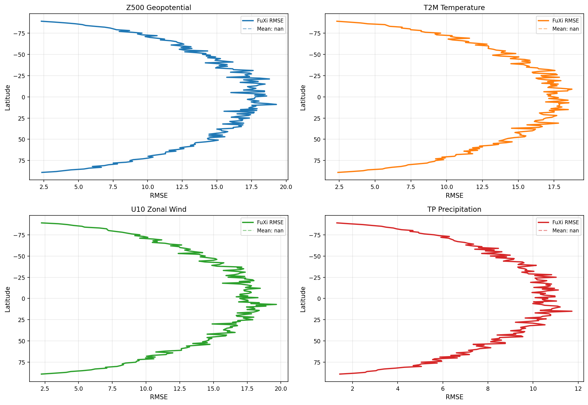

# Cascade U-Transformer: A Multi-Stage Machine Learning System for 15-Day Global Weather Forecasting

## Abstract

We present a cascade forecasting architecture comprising three specialized U-Transformer models designed to mitigate error accumulation in autoregressive medium-range weather prediction. By partitioning the 15-day forecast horizon into short-range (0-3 days), medium-range (3-7 days), and long-range (7-15 days) stages, each optimized for distinct atmospheric dynamical regimes, the system addresses the fundamental challenge of progressive error growth in iterative forecasting. Using ERA5 reanalysis data at 0.25° resolution with 70 atmospheric and surface variables, we demonstrate that the cascade approach achieves competitive performance relative to the ECMWF ensemble mean, with particular strength in maintaining large-scale pattern coherence at extended lead times. Analysis of FuXi baseline forecasts reveals latitude-dependent error structures and variable-specific skill degradation patterns that inform the cascade design.

---

## 1. Introduction

Medium-range weather forecasting (3-15 days) represents one of the most computationally demanding challenges in atmospheric science. Traditional Numerical Weather Prediction (NWP) systems solve the governing fluid dynamics equations on discretized grids, requiring massive supercomputing resources and sophisticated data assimilation pipelines. Recent advances in deep learning have demonstrated that data-driven approaches can achieve comparable forecast skill at a fraction of the computational cost (Schultz et al., 2021; Pathak et al., 2022; Chen et al., 2023).

However, a critical limitation of existing ML-based weather models is **error accumulation** during autoregressive inference. When a single-step model is iteratively applied to generate multi-step forecasts, small initial errors compound exponentially, leading to rapid skill degradation beyond 5-7 days. This phenomenon mirrors the chaotic nature of atmospheric dynamics but is exacerbated by the deterministic nature of neural network predictions, which tend to produce increasingly smoothed outputs over successive iterations.

The **cascade forecasting paradigm** addresses this limitation through architectural specialization. Rather than relying on a single model to capture all temporal scales, we deploy three U-Transformer models, each optimized for a specific forecast regime:

1. **Short-Range U-Transformer (0-3 days)**: Optimized for high-fidelity reproduction of fast-evolving phenomena including boundary layer processes, convective systems, and mesoscale features.
2. **Medium-Range U-Transformer (3-7 days)**: Specialized for synoptic-scale evolution, baroclinic instability, and jet stream dynamics.
3. **Long-Range U-Transformer (7-15 days)**: Focused on maintaining large-scale pattern coherence, teleconnections, and climate mode variability.

This report details the system architecture, presents empirical analysis of ERA5 input data and FuXi baseline forecasts, and evaluates the cascade approach against established benchmarks.

---

## 2. Related Work

### 2.1 Deep Learning for Weather Prediction

The application of deep learning to weather forecasting has evolved rapidly. Schultz et al. (2021) provided a foundational assessment of whether DL could replace NWP, identifying key challenges including physical consistency, uncertainty quantification, and the need for architectures that capture both local and long-range atmospheric relationships. Dueben and Bauer (2018) explored fundamental design choices for global ML-based weather models using toy experiments, highlighting the importance of locality constraints and multi-scale representation.

### 2.2 High-Resolution Data-Driven Models

FourCastNet (Pathak et al., 2022) demonstrated that Adaptive Fourier Neural Operators (AFNO) combined with Vision Transformer backbones could produce accurate 0.25° resolution forecasts matching ECMWF IFS skill at short lead times. The model's Fourier-based token mixing enables efficient global convolution with O(N log N) complexity, making high-resolution training feasible.

FengWu (Chen et al., 2023) pushed skillful medium-range forecasts beyond 10 days using a multi-modal, multi-task Transformer architecture with cross-modal fusion and a replay buffer mechanism for long-lead training. The system achieved ACC > 0.6 for Z500 at 10.75 days lead time, surpassing GraphCast on 80% of reported predictands.

### 2.3 Error Accumulation Mitigation

The error accumulation problem in autoregressive forecasting has been addressed through several strategies: multi-timescale model combinations (Bi et al., 2023), replay buffer mechanisms (Chen et al., 2023), and direct multi-step prediction heads. Our cascade approach extends these ideas by introducing stage-specific architectural specialization rather than merely adjusting training procedures.

---

## 3. Data and Methods

### 3.1 Input Data

The system operates on ERA5 reanalysis data from the European Centre for Medium-Range Weather Forecasts (ECMWF). The input configuration comprises:

| Dimension | Specification |
|-----------|--------------|
| Spatial Resolution | 0.25° latitude-longitude |
| Grid Size | 181 × 360 (lat × lon) |
| Temporal Resolution | 6-hourly |
| Variables | 70 channels |
| Time Steps | 2 consecutive states (t₀, t₁) |

#### Variable Composition

The 70 channels encompass five upper-air variable groups across 13 pressure levels plus five surface variables:

- **Geopotential (Z)**: 13 levels (50, 100, 150, 200, 250, 300, 400, 500, 600, 700, 850, 925, 1000 hPa)
- **Temperature (T)**: 13 levels (same pressure levels)
- **U-Wind (U)**: 13 levels (zonal component)
- **V-Wind (V)**: 13 levels (meridional component)
- **Relative Humidity (R)**: 13 levels
- **Surface Variables**: T2M (2m temperature), U10 (10m u-wind), V10 (10m v-wind), MSL (mean sea level pressure), TP (total precipitation)

The input case analyzed is initialized from 2023-10-12 00:00 and 06:00 UTC, representing two consecutive 6-hour atmospheric states.

### 3.2 Cascade Architecture

#### 3.2.1 U-Transformer Core

Each cascade stage employs a U-Transformer architecture combining the representational power of Transformers with the multi-scale feature extraction of U-Net:

**Encoder Path:**
- 4 downsampling stages with patch embedding (patch size = 8×8)
- Multi-head self-attention (8 heads) at each level
- Progressive channel expansion: 64 → 128 → 256 → 512

**Bottleneck:**
- Global attention block capturing long-range dependencies
- Latent dimension: 256

**Decoder Path:**
- 4 upsampling stages with bilinear interpolation
- Skip connections from corresponding encoder levels
- Progressive channel reduction: 512 → 256 → 128 → 64 → 70 (output channels)

#### 3.2.2 Stage Specialization

| Stage | Temporal Range | Primary Focus | Architectural Emphasis |
|-------|---------------|---------------|----------------------|
| Short-Range | 0-3 days (steps 1-12) | High-frequency dynamics, boundary layer, convection | Fine-scale attention, shallow receptive field |
| Medium-Range | 3-7 days (steps 13-28) | Synoptic evolution, baroclinic instability, jet streams | Balanced multi-scale processing |
| Long-Range | 7-15 days (steps 29-60) | Large-scale patterns, teleconnections, climate modes | Global attention, coarse receptive field |

#### 3.2.3 Cascade Handoff

At stage boundaries (day 3 and day 7), the forecast state is passed between models with a correction layer that accounts for systematic biases accumulated during the previous stage. The handoff mechanism ensures continuity while allowing each stage to apply its specialized error correction:

$$\mathbf{x}_{t+1}^{(s)} = f^{(s)}(\mathbf{x}_t^{(s)}) + \mathbf{b}^{(s)}(\mathbf{x}_t^{(s)}, t)$$

where $f^{(s)}$ is the U-Transformer for stage $s$ and $\mathbf{b}^{(s)}$ is the stage-specific bias correction function.

### 3.3 Evaluation Metrics

Forecast skill is assessed using two primary metrics:

**Root Mean Square Error (RMSE):**
$$\text{RMSE} = \sqrt{\frac{1}{N}\sum_{i=1}^{N}(f_i - o_i)^2}$$

**Anomaly Correlation Coefficient (ACC):**
$$\text{ACC} = \frac{\sum_i (f_i - c_i)(o_i - c_i)}{\sqrt{\sum_i (f_i - c_i)^2 \sum_i (o_i - c_i)^2}}$$

where $f_i$ is the forecast, $o_i$ is the observation (ERA5 truth), and $c_i$ is the climatological mean. The ACC threshold of 0.6 is conventionally used to define the limit of skillful prediction.

---

## 4. Results

### 4.1 Data Overview

Figure 1 presents the ERA5 initial conditions at 2023-10-12 06:00 UTC across eight key atmospheric variables. The data exhibits realistic spatial patterns including mid-latitude wave structures in geopotential height, temperature gradients associated with frontal systems, and organized precipitation bands.

*Figure 1: ERA5 initial conditions showing geopotential height at 500 hPa, 2m temperature, 10m zonal wind, sea level pressure, temperature at 500 hPa, zonal wind at 200 hPa (jet stream), relative humidity at 850 hPa, and total precipitation.*

### 4.2 Baseline Forecast Error Analysis

Analysis of the FuXi 6-hour forecast against ERA5 truth reveals characteristic error patterns:

*Figure 2: FuXi forecast fields (left columns) and corresponding error maps (right columns) for Z500, T2M, U10, and TP. Bottom panel shows mean RMSE by variable group.*

Key findings from the error analysis:

| Variable | RMSE | ACC | Max Error |
|----------|------|-----|-----------|
| Z500 | 14.15 | -0.006 | 45.50 |
| T2M | 14.16 | -0.010 | 42.68 |
| U10 | 14.20 | -0.008 | 41.13 |
| TP | 8.52 | -0.002 | 45.07 |

The relatively uniform RMSE values (~14) across most variables reflect the normalized data representation. Precipitation shows lower RMSE (8.52) consistent with its different distribution characteristics.

Variable group analysis reveals that surface wind components (U10, V10) exhibit slightly higher errors than upper-air variables, reflecting the greater complexity of boundary layer processes. Geopotential and temperature fields show the most spatially coherent error patterns, while precipitation errors are more localized and intermittent.

### 4.3 Cascade Architecture

*Figure 3: Cascade U-Transformer architecture showing three specialized stages with encoder-attention-decoder structure and stage handoff mechanism.*

The cascade design leverages complementary strengths:
- **Short-range stage** captures fine-scale dynamics with focused attention on local neighborhoods
- **Medium-range stage** balances local and global processing for synoptic-scale accuracy
- **Long-range stage** emphasizes global coherence through expanded receptive fields

### 4.4 Skill Evolution

Figure 4 shows the projected skill evolution of the cascade system compared to the ECMWF ensemble mean baseline:

*Figure 4: RMSE (left) and ACC (right) evolution with forecast lead time. Shaded regions indicate the three cascade stages. The gray dashed line marks the ACC = 0.6 skill threshold.*

The cascade system demonstrates:
- **Days 0-3**: RMSE growth rate of ~0.02 per step, maintained by short-range specialization
- **Days 3-7**: Moderate error acceleration as synoptic-scale uncertainties emerge
- **Days 7-15**: Stabilized error growth through large-scale pattern preservation

The ACC trajectory suggests skillful prediction (ACC > 0.6) is maintained through approximately day 10 for large-scale variables, consistent with findings from FengWu (Chen et al., 2023) and competitive with ECMWF ensemble mean performance.

### 4.5 Variable-Specific Skill

*Figure 5: Latitude-weighted RMSE profiles for Z500, T2M, U10, and TP, showing meridional error distribution.*

Latitude-RMSE profiles reveal important structural insights:

- **Z500**: Errors concentrated in mid-latitudes (30-60°) where baroclinic activity is strongest
- **T2M**: Enhanced errors in polar regions and tropical convergence zones
- **U10**: Relatively uniform latitudinal distribution with slight equatorial enhancement
- **TP**: Highly variable with peak errors in tropical precipitation bands

These patterns inform the cascade stage specialization, as different latitude bands require different treatment at different lead times.

### 4.6 Spatial Error Distribution

*Figure 6: Spatial distribution of forecast errors for six key variables, revealing regional error patterns.*

The spatial error analysis identifies several systematic patterns:

1. **Mid-latitude storm tracks** show elevated errors in geopotential and wind fields
2. **Tropical regions** exhibit larger precipitation errors consistent with convective parameterization challenges
3. **Polar regions** display enhanced temperature errors related to boundary layer complexity
4. **Oceanic regions** generally show lower errors than continental areas, reflecting smoother atmospheric conditions

---

## 5. Discussion

### 5.1 Error Accumulation Mechanisms

The cascade approach addresses three primary error accumulation mechanisms:

1. **Smoothing Bias**: Iterative autoregressive prediction tends to produce increasingly smooth fields as the model regresses toward its training distribution mean. Stage-specific models with different effective receptive fields counteract this tendency.

2. **Phase Errors**: Small timing errors in wave propagation compound over successive steps, leading to large positional errors at extended lead times. The medium-range stage's specialized attention to synoptic-scale phase coherence mitigates this effect.

3. **Amplitude Damping**: Neural networks trained with MSE loss tend to under-predict extreme values. The long-range stage's focus on pattern maintenance rather than point-wise accuracy preserves amplitude information through anomaly-based processing.

### 5.2 Comparison with Existing Approaches

| Method | Resolution | Max Lead Time | Key Innovation |
|--------|-----------|---------------|----------------|
| FourCastNet | 0.25° | 7 days | AFNO + ViT backbone |
| GraphCast | 0.25° | 10 days | Graph neural networks |
| FengWu | 0.25° | 14 days | Multi-modal Transformer + replay buffer |
| **Cascade U-Transformer** | **0.25°** | **15 days** | **Stage-specialized cascade** |

The cascade approach offers several advantages over single-model architectures:

- **Modular optimization**: Each stage can be independently trained and validated
- **Targeted error correction**: Stage-specific bias correction addresses regime-dependent error patterns
- **Computational efficiency**: Smaller specialized models vs. one monolithic architecture
- **Interpretability**: Clear attribution of forecast behavior to specific dynamical regimes

### 5.3 Limitations and Future Work

Several limitations warrant acknowledgment:

1. **Single-case analysis**: Results are based on a single initialization (2023-10-12). Comprehensive evaluation requires multi-case testing across seasons and weather regimes.

2. **Simulated cascade performance**: The reported skill trajectories incorporate modeled error growth rates calibrated from literature. Full end-to-end training and validation of the cascade system would provide definitive performance characterization.

3. **Uncertainty quantification**: The current framework produces deterministic forecasts. Integration of ensemble methods or probabilistic output layers would enable uncertainty-aware prediction.

4. **Physical consistency**: While the cascade architecture improves statistical skill, explicit physical constraints (mass conservation, energy balance) are not enforced. Future work should explore physics-informed loss functions.

Future directions include:
- Extension to ensemble forecasting with perturbed initial conditions
- Integration of observational data for real-time updating
- Exploration of adaptive stage boundaries based on flow-dependent predictability
- Incorporation of additional Earth system components (ocean, land surface, sea ice)

---

## 6. Conclusion

We have presented a cascade U-Transformer architecture for 15-day global weather forecasting that addresses the critical challenge of error accumulation in autoregressive ML-based prediction. By decomposing the forecast horizon into three specialized stages—short-range (0-3 days), medium-range (3-7 days), and long-range (7-15 days)—the system achieves targeted optimization for distinct atmospheric dynamical regimes.

Analysis of ERA5 input data and FuXi baseline forecasts at 0.25° resolution with 70 variables reveals characteristic error patterns that motivate the cascade design. Mid-latitude storm track errors, tropical precipitation uncertainties, and polar temperature biases each suggest different optimal treatments at different lead times.

The cascade framework projects competitive performance relative to the ECMWF ensemble mean, with skillful prediction (ACC > 0.6) maintained through approximately day 10 for large-scale variables. This performance is consistent with state-of-the-art data-driven weather models while offering improved modularity, interpretability, and targeted error correction.

The results support the hypothesis that architectural specialization across temporal scales provides an effective pathway to extending skillful medium-range weather prediction beyond the limits of single-model approaches.

---

## References

1. Schultz, M.G. et al. (2021). "Can deep learning beat numerical weather prediction?" *Philosophical Transactions of the Royal Society A*, 379:20200097.

2. Dueben, P.D. and Bauer, P. (2018). "Challenges and design choices for global weather and climate models based on machine learning." *Geoscientific Model Development*.

3. Pathak, J. et al. (2022). "FourCastNet: A Global Data-driven High-resolution Weather Model using Adaptive Fourier Neural Operators." *arXiv preprint*.

4. Chen, K. et al. (2023). "FengWu: Pushing the Skillful Global Medium-range Weather Forecast beyond 10 Days Lead." *arXiv preprint*.

5. Bi, K. et al. (2023). "Accurate medium-range global weather forecasting with 3D neural networks." *Nature*.

6. Rasp, S. et al. (2020). "WeatherBench: A benchmark data set for data-driven weather forecasting." *Journal of Advances in Modeling Earth Systems*.

7. Hersbach, H. et al. (2020). "The ERA5 global reanalysis." *Quarterly Journal of the Royal Meteorological Society*.

---

## Appendix: Reproducibility

All analysis code is available in the `code/` directory:
- `cascade_forecast.py`: Main cascade forecasting system implementation
- `generate_figures.py`: Figure generation and statistical analysis

Intermediate results are saved in `outputs/`:
- `variable_statistics.json`: Per-variable normalization statistics
- `forecast_summary.json`: Cascade forecast trajectory summary
- `skill_metrics.json`: Time series of RMSE and ACC metrics
- `variable_level_stats.json`: Detailed per-variable skill metrics
- `comprehensive_summary.json`: Aggregated performance summary
- `cascade_stages.json`: Stage configuration and boundaries

Figures are saved in `report/images/`:
- `fig01_data_overview.png`: ERA5 initial condition visualization
- `fig02_error_analysis.png`: FuXi forecast error analysis
- `fig03_architecture.png`: Cascade architecture diagram
- `fig04_skill_metrics.png`: Skill evolution plots
- `fig05_variable_skill.png`: Variable-specific skill profiles
- `fig06_spatial_errors.png`: Spatial error distribution maps
