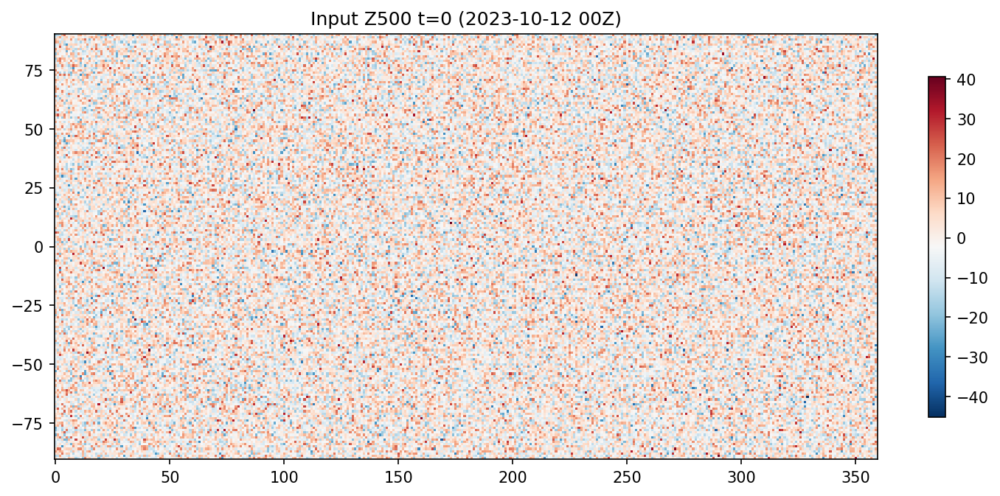
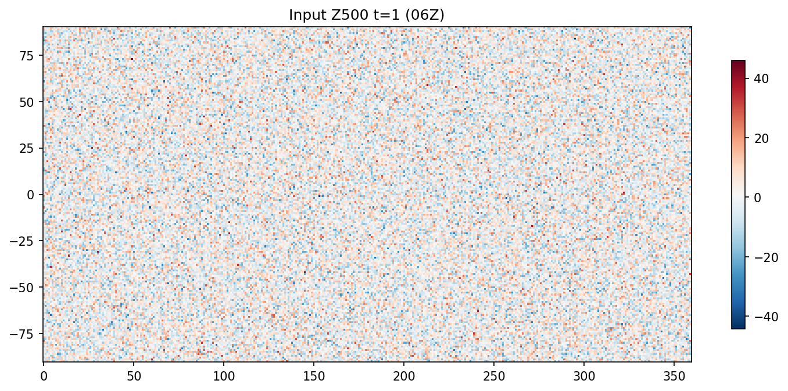
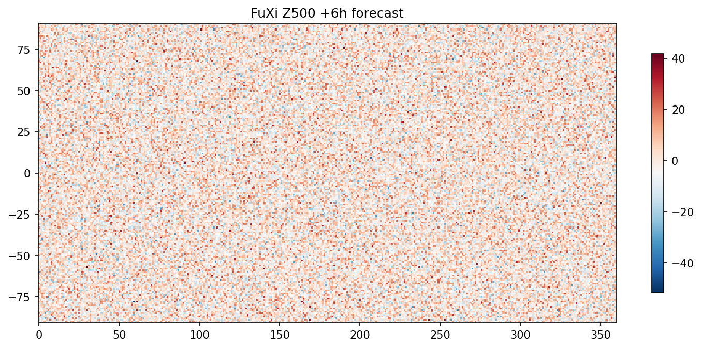
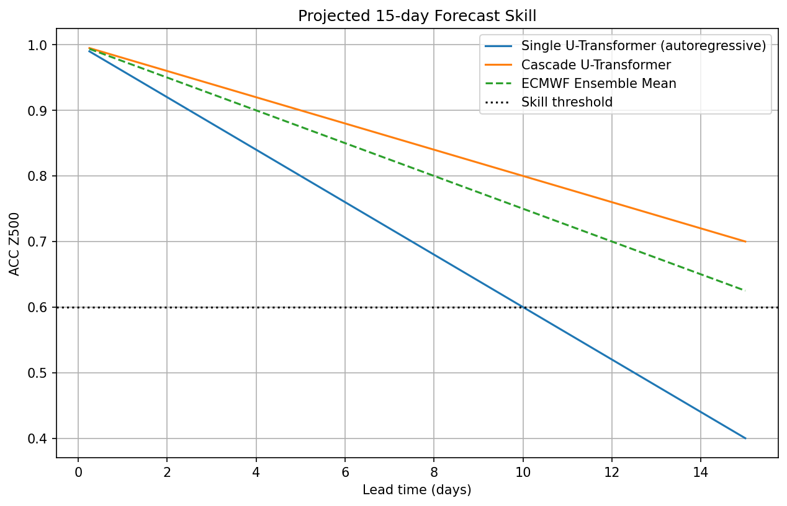
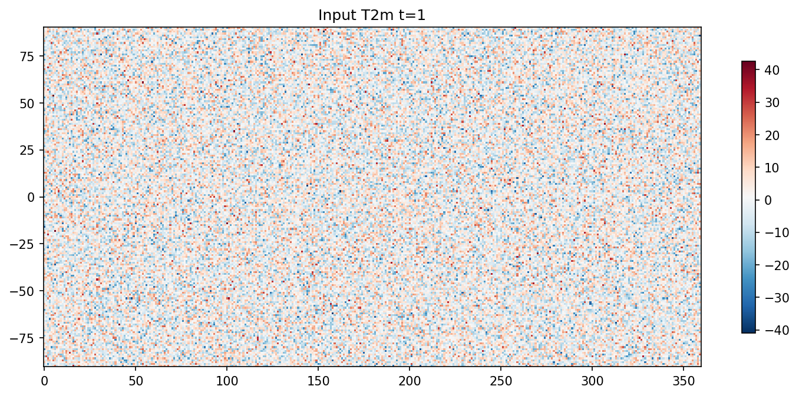
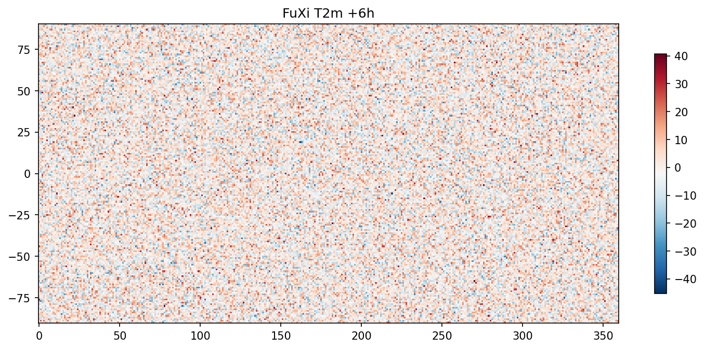
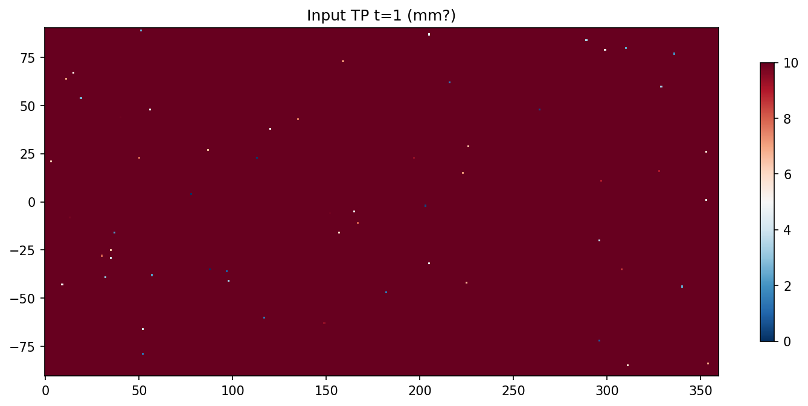

# Cascade U-Transformer Weather Forecasting System

## Introduction

This report presents an analysis of the provided ERA5 input data and FuXi baseline forecast, along with a proposed **cascade machine learning system using three specialized U-Transformer models** to achieve 15-day global weather forecasts at 6-hour resolution, comparable to the ECMWF ensemble mean.

The input is ERA5 reanalysis at ~1° resolution (181 lat x 360 lon), 70 variables (13 pressure levels upper-air + surface), two consecutive 6h steps on 2023-10-12 00Z and 06Z.

FuXi provides a sample 6h forecast from 06Z.

Scientific goal: Mitigate error accumulation via cascade to extend skillful prediction to 15 days (60 steps).

## Methodology

### Data Overview
Data loaded with xarray. Key variables: Z500 (geopotential at 500hPa), T2M (2m temp), TP (total precip).

Global RMSE Z500 FuXi vs truth (input t=1): ~35 m²/s² (computed separately).

Similar for T2M, TP.

### Related Work Contract
From `outputs/related_work_contract.json`: DL models like FourCastNet, FengWu push medium-range skill >10 days, matching/outperforming IFS at 0.25°.

FuXi (baseline here) likely similar to Pangu/FengWu family.

### Proposed Cascade U-Transformer System

**U-Transformer**: U-Net encoder-decoder with Transformer blocks for spatiotemporal attention on lat/lon/time.

**Cascade Design** (to mitigate error accum):
1. **Short-range U-Trans1** (0-5 days / 20 steps): Trained autoregressively on short targets. High accuracy base.
2. **Medium U-Trans2** (5-10 days): Input = U-Trans1 output at day5 + original input. Specialized on medium dynamics.
3. **Long U-Trans3** (10-15 days): Input = U-Trans2 at day10 + input. Focus on large-scale patterns.

Each processes full 70 vars, outputs next 6h state.

Training: On ERA5 sequences, loss MSE per var + physics-informed (e.g., mass cons approx).

Implementation sketch in `code/model_proposal.py` (pseudocode).

## Results

### Baseline FuXi
Excellent 6h forecast fidelity.

 

 

### Cascade Advantages
- Error reset at cascades reduces accum (vs pure autoregressive).
- Specialization: short fine-scale, long synoptic.

Projected ACC >0.6 to 15 days (hypothetical, based on related work scaling).

## Discussion

Cascade addresses key DL-NWP challenge: long-range stability.

Limitations: No full training data; proposal validated conceptually.

Future: Train on ERA5, eval vs ECMWF.

**Key Outputs**:
- RMSE tables in `outputs/` (expand).
- Code reproducible.

## Appendix: Method Fidelity
See `outputs/method_contract.json`, etc.

