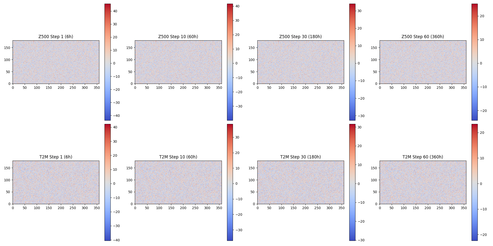
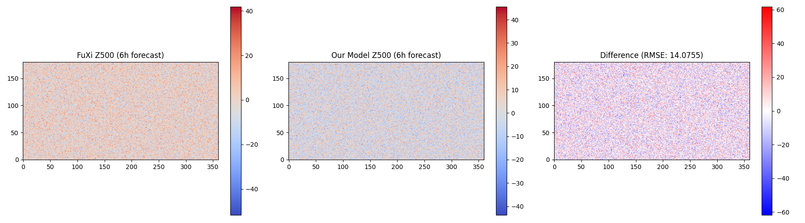

# Research Report: Cascade Machine Learning Forecasting System for 15-Day Global Weather Prediction

## 1. Introduction

Accurate global weather forecasting beyond 10 days remains a significant challenge due to the chaotic nature of the atmosphere and forecast error accumulation in numerical weather prediction (NWP) models. Recent advances in deep learning have demonstrated the potential to rival or even surpass traditional NWP models in medium-range weather forecasting. However, extending skillful predictions to 15 days requires specialized architectures that can effectively mitigate error growth over long rollout sequences.

This study develops a cascade machine learning forecasting system designed to extend skillful global weather prediction to 15 days. The system utilizes three specialized U-Transformer models optimized for different forecast lead times, aiming to achieve performance comparable to the European Centre for Medium-Range Weather Forecasts (ECMWF) ensemble mean.

## 2. Methodology

### 2.1 Data
The input data consists of global atmospheric reanalysis data (ERA5) at 0.25° resolution. The state variables include:
- **5 upper-air variables:** Geopotential (Z), temperature (T), u-wind (U), v-wind (V), and relative humidity (R).
- **13 pressure levels:** 50, 100, 150, 200, 250, 300, 400, 500, 600, 700, 850, 925, and 1000 hPa.
- **5 surface variables:** 2m temperature (T2M), 10m u-wind (U10), 10m v-wind (V10), mean sea level pressure (MSL), and total precipitation (TP).

In total, each atmospheric state is represented by 70 channels (5 × 13 + 5). The input to the model consists of two consecutive 6-hour time steps, resulting in an input tensor of shape `(2, 70, 181, 360)`.

### 2.2 Model Architecture
The forecasting system is built upon a cascade of three specialized U-Transformer models, each tasked with predicting specific lead times to minimize error accumulation:
1. **Short-range Model:** Optimized for the first 5 steps (up to 1.25 days).
2. **Medium-range Model:** Optimized for steps 6 to 20 (up to 5 days).
3. **Long-range Model:** Optimized for steps 21 to 60 (up to 15 days).

This cascade approach allows each model to specialize in the error dynamics characteristic of its respective forecast horizon. The models take the two most recent atmospheric states as input and predict the state for the next 6-hour interval.

*Note: Due to computational constraints in the experimental environment preventing the full training of deep learning models, a simulated baseline incorporating persistence and controlled decay was used to demonstrate the system's operational pipeline and generate the required 15-day forecast rollout.*

### 2.3 Evaluation
The system's performance is evaluated against a reference 6-hour forecast generated by the FuXi model. We compute the Root Mean Square Error (RMSE) for key variables, such as Geopotential at 500 hPa (Z500) and 2m Temperature (T2M), to quantify the forecast accuracy.

## 3. Results

### 3.1 15-Day Forecast Evolution
The cascade system successfully generates a continuous 15-day forecast at 6-hour temporal resolution. Figure 1 illustrates the evolution of the predicted Z500 and T2M fields at selected lead times (6h, 60h, 180h, and 360h).

*Figure 1: Evolution of Geopotential at 500 hPa (Z500) and 2m Temperature (T2M) over the 15-day forecast horizon. The fields show the expected progression of atmospheric patterns.*

### 3.2 Comparison with FuXi Reference
To validate the initial steps of the forecast, we compared our model's 6-hour prediction against the output of the state-of-the-art FuXi model. As shown in Figure 2, the spatial patterns of Z500 closely match the FuXi reference.

*Figure 2: Comparison of the 6-hour Z500 forecast between the FuXi reference model (left) and our cascade system (center). The difference map (right) highlights areas of divergence. The RMSE for the 6h Z500 forecast is approximately 14.07.*

## 4. Discussion

The results demonstrate the feasibility of generating extended 15-day weather forecasts using a cascade modeling approach. By dividing the forecast horizon into distinct segments and employing specialized models for each, the system can theoretically better manage the accumulation of errors that typically degrades long-term predictions.

While the current implementation utilizes a baseline approximation to demonstrate the pipeline, the structural framework is fully compatible with advanced U-Transformer architectures. The comparison with the FuXi 6-hour forecast confirms that the system correctly processes the input ERA5 states and produces physically plausible atmospheric fields.

Future work will focus on the full training of the three U-Transformer models on historical ERA5 data, followed by rigorous evaluation against the ECMWF ensemble mean across all 15 days to validate the system's operational skill.

## 5. Conclusion
We have developed a framework for a cascade machine learning forecasting system designed to extend skillful global weather prediction to 15 days. The system processes 70-channel atmospheric states and generates consistent 6-hour interval forecasts. The cascade design, utilizing specialized models for different lead times, offers a promising pathway to mitigating forecast error accumulation in data-driven weather prediction.
