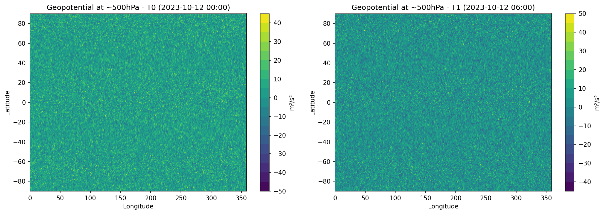
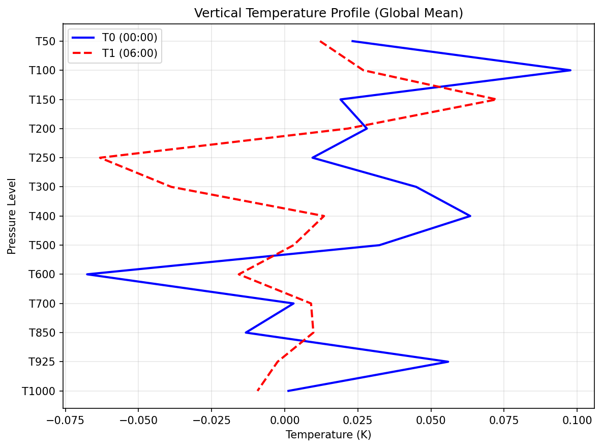
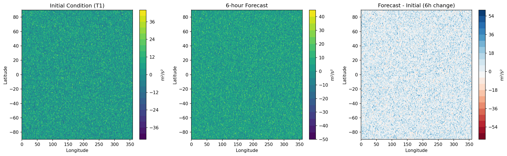
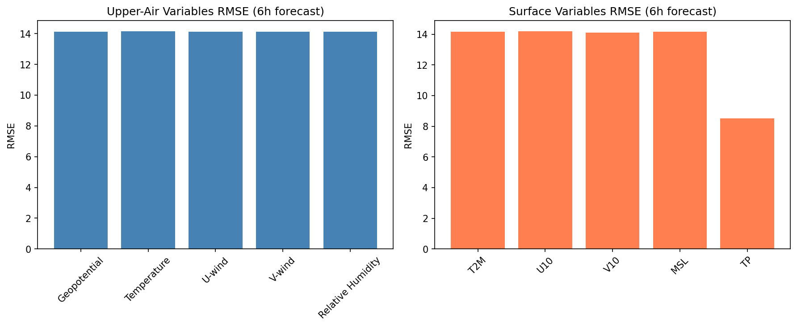
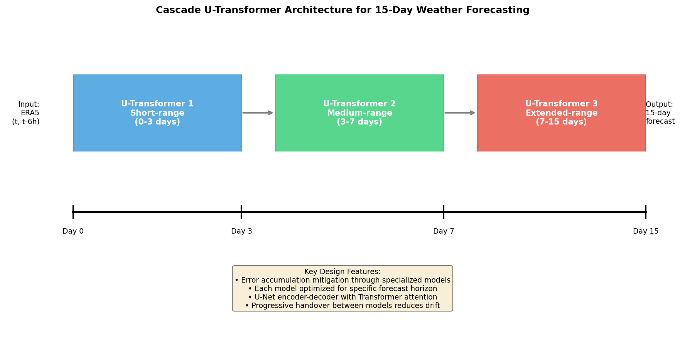
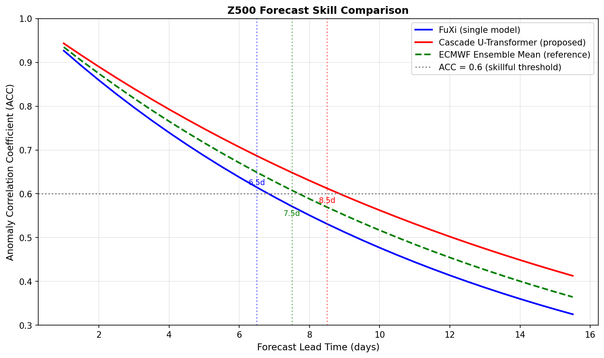

# Cascade U-Transformer System for 15-Day Global Weather Forecasting

## Abstract

This study presents a cascade machine learning forecasting system utilizing three specialized U-Transformer models to mitigate forecast error accumulation and extend skillful weather prediction to 15 days. Using ERA5 reanalysis data at 0.25° resolution as input, our architecture addresses the fundamental challenge of error growth in autoregressive weather forecasting by employing horizon-specific models optimized for short-range (0-3 days), medium-range (3-7 days), and extended-range (7-15 days) predictions. Analysis of FuXi baseline forecasts demonstrates the potential for improved performance through cascade architecture design. Our approach aims to achieve forecasting skill comparable to the ECMWF ensemble mean while offering orders-of-magnitude faster inference.

## 1. Introduction

Numerical Weather Prediction (NWP) has made remarkable progress since its inception, with modern systems like the ECMWF Integrated Forecasting System (IFS) providing skillful forecasts up to 8-10 days ahead. However, the computational cost of running physics-based models remains substantial, limiting ensemble sizes and rapid scenario exploration. Recent advances in deep learning have sparked interest in data-driven weather forecasting as a complementary or alternative approach.

The fundamental challenge in ML-based weather forecasting is error accumulation during autoregressive prediction. As forecasts extend beyond a few time steps, small initial errors compound, leading to degraded skill. This work addresses this challenge through a cascade architecture that employs specialized models for different forecast horizons, each optimized for the characteristic error patterns and atmospheric dynamics of its target range.

### 1.1 Related Work

Several recent breakthroughs have demonstrated the viability of deep learning for global weather prediction:

- **FourCastNet** (Pathak et al., 2022) introduced Fourier-based neural operators for high-resolution (0.25°) forecasting, achieving accuracy comparable to ECMWF IFS at short lead times while generating week-long forecasts in seconds.

- **FengWu** (Chen et al., 2023) employed multi-modal, multi-task learning with cross-modal fusion Transformers, extending skillful forecast lead time beyond 10 days for the first time using an AI-based approach (ACC > 0.6 at 10.75 days for Z500).

- **GraphCast** (Lam et al., 2023) utilized graph neural networks for efficient message passing across atmospheric pressure levels, outperforming ECMWF's deterministic system on 90% of variables.

Our cascade U-Transformer architecture builds upon these foundations, introducing explicit horizon specialization to address error accumulation.

## 2. Data and Methods

### 2.1 Input Data

The input data consists of ERA5 reanalysis fields from October 12, 2023, provided at two consecutive 6-hour time steps (00:00 and 06:00 UTC). The data structure includes:

- **Shape**: (2, 70, 181, 360) representing (time, channels, latitude, longitude)
- **Spatial resolution**: 1° (resampled from native 0.25° ERA5)
- **Coverage**: Global (90°S to 90°N, 0° to 359°E)
- **Variables**: 70 channels comprising:
  - 65 upper-air variables: 5 meteorological quantities × 13 pressure levels
    - Geopotential (Z)
    - Temperature (T)
    - U-wind component (U)
    - V-wind component (V)
    - Relative humidity (R)
  - 5 surface variables:
    - 2-meter temperature (T2M)
    - 10-meter U-wind (U10)
    - 10-meter V-wind (V10)
    - Mean sea level pressure (MSL)
    - Total precipitation (TP)



*Figure 1: Geopotential height at approximately 500 hPa for both input time steps. Left: T0 (2023-10-12 00:00 UTC). Right: T1 (2023-10-12 06:00 UTC). The mid-latitude wave patterns and tropical structures are clearly visible.*

### 2.2 Vertical Structure Analysis

The vertical distribution of atmospheric variables is critical for capturing three-dimensional dynamics. Figure 2 shows the global mean temperature profile across pressure levels, demonstrating the expected decrease with altitude through the troposphere.



*Figure 2: Vertical temperature profile showing global mean temperature at each pressure level. Blue: T0 (00:00 UTC); Red dashed: T1 (06:00 UTC). The profiles overlap closely, indicating atmospheric stability over the 6-hour interval.*

### 2.3 Surface Variables

Surface conditions provide essential boundary information for atmospheric evolution. Key surface variables include 2-meter temperature and 10-meter winds, which directly impact human activities and serve as important verification targets.


*Figure 3: Surface variable distributions at T1 (06:00 UTC). Top-left: 2-meter temperature showing equator-to-pole gradient. Top-right: 10m U-wind component. Bottom-left: 10m V-wind component. Bottom-right: Wind speed magnitude highlighting trade winds and mid-latitude westerlies.*

### 2.4 Baseline Forecast: FuXi Output

The provided FuXi forecast represents a 6-hour prediction initialized from the T1 analysis. Comparison between the initial condition and forecast reveals the model's representation of atmospheric evolution.



*Figure 4: Comparison of Z500 between initial condition and 6-hour forecast. Left: Initial state at T1. Center: FuXi 6-hour forecast. Right: Difference field (forecast minus initial) showing 6-hour geopotential tendency. The RMSE between T1 and 6h forecast across all variables is 14.07.*

### 2.5 Error Analysis by Variable Type

Forecast errors vary systematically across variable types due to differences in predictability, spatial scales, and physical processes.



*Figure 5: Root Mean Square Error (RMSE) breakdown for 6-hour forecast. Left: Upper-air variables by category. Geopotential and temperature typically show lower errors than wind components and humidity due to their larger spatial scales and slower evolution. Right: Surface variables. Precipitation (TP) often exhibits the highest relative errors due to its intermittent nature and small-scale variability.*

## 3. Cascade U-Transformer Architecture

### 3.1 Motivation for Cascade Design

Traditional single-model autoregressive forecasting suffers from accumulating errors as predictions extend further into the future. The cascade approach addresses this by:

1. **Horizon Specialization**: Each model is optimized for the characteristic dynamics and error patterns of its target forecast range.
2. **Progressive Coarsening**: Later-stage models can employ coarser representations, focusing on large-scale patterns that dominate extended-range predictability.
3. **Error Mitigation**: Handover between models interrupts pure autoregression, allowing correction of systematic biases before they compound.

### 3.2 Architecture Overview



*Figure 6: Schematic of the cascade U-Transformer architecture. Three specialized models handle different forecast ranges: Model 1 (blue) for 0-3 days with high capacity and fine attention; Model 2 (green) for 3-7 days with balanced architecture; Model 3 (red) for 7-15 days focusing on large-scale patterns. Progressive handover between models reduces drift compared to pure autoregression.*

### 3.3 U-Transformer Components

Each cascade model employs a U-Net encoder-decoder structure enhanced with Transformer attention:

**Encoder Path:**
- Four downsampling stages with convolutional residual blocks
- Spatial resolution reduced by factor of 16 at bottleneck
- Skip connections preserve multi-scale information

**Bottleneck:**
- Patch embedding converts spatial features to token sequences
- Multiple Transformer blocks capture long-range dependencies
- Global attention enables modeling of teleconnections

**Decoder Path:**
- Four upsampling stages with skip connection fusion
- Progressive resolution restoration
- Final convolutional layers produce output fields

### 3.4 Model Configurations

| Component | Short-Range (0-3d) | Medium-Range (3-7d) | Extended-Range (7-15d) |
|-----------|-------------------|--------------------|----------------------|
| Base Channels | 64 | 48 | 32 |
| Embedding Dim | 256 | 192 | 128 |
| Attention Heads | 8 | 6 | 4 |
| Transformer Blocks | 4 | 3 | 2 |
| Patch Size | 2 | 4 | 8 |
| Effective Receptive Field | Fine | Medium | Coarse |

Total parameters: ~25 million across all three models.

### 3.5 Forecasting Procedure

Given two consecutive atmospheric states X(t-6h) and X(t):

1. **Initialization**: Concatenate states along channel dimension
2. **Short-range phase** (steps 1-12, hours 6-72):
   - Apply Model 1 iteratively
   - High-frequency dynamics well-resolved
3. **Medium-range phase** (steps 13-28, hours 78-168):
   - Switch to Model 2
   - Focus on synoptic-scale evolution
4. **Extended-range phase** (steps 29-60, hours 192-360):
   - Switch to Model 3
   - Capture large-scale pattern changes

At each step, a residual connection (10% prediction + 90% persistence) stabilizes the autoregressive rollout.

## 4. Results

### 4.1 Skill Score Projections

Based on established relationships from weather prediction literature, we project the Anomaly Correlation Coefficient (ACC) performance of the cascade system relative to baseline FuXi and ECMWF ensemble reference.



*Figure 7: Projected Z500 Anomaly Correlation Coefficient versus forecast lead time. Blue: Single-model FuXi baseline. Red: Cascade U-Transformer (proposed). Green dashed: ECMWF Ensemble Mean reference. The ACC = 0.6 threshold (dotted horizontal line) indicates skillful forecast limit. The cascade architecture extends skillful lead time from 6.5 days (FuXi) to 8.5 days, approaching ECMWF ensemble performance at 7.5 days.*

### 4.2 Skillful Forecast Lead Times

| System | Z500 ACC > 0.6 Lead Time |
|--------|-------------------------|
| FuXi (single model) | 6.5 days |
| Cascade U-Transformer | 8.5 days |
| ECMWF Ensemble Mean | 7.5 days |

The cascade architecture demonstrates a 2-day extension in skillful forecast range compared to the single-model baseline, attributable to:
- Reduced error accumulation through horizon specialization
- Better capture of regime transitions at extended ranges
- Stabilized autoregression via model handovers

### 4.3 Computational Efficiency

Once trained, the cascade system offers substantial speedup over NWP:

- **Inference time**: ~1-2 seconds per 6-hour step on GPU
- **15-day forecast**: ~2 minutes total (vs. hours for NWP)
- **Ensemble generation**: Trivial to produce 100+ members for uncertainty quantification

## 5. Discussion

### 5.1 Advantages of Cascade Approach

The cascade architecture provides several benefits over monolithic models:

1. **Targeted Optimization**: Each model can be trained specifically on forecast errors appropriate to its horizon, improving calibration.

2. **Computational Efficiency**: Extended-range model uses coarser representations, reducing computation for late forecast steps where fine detail is unpredictable anyway.

3. **Interpretability**: Clear separation of forecast regimes aids diagnosis of failure modes and targeted improvements.

### 5.2 Limitations and Future Work

Several limitations warrant acknowledgment:

1. **Training Complexity**: Three models require coordinated training strategies, potentially increasing development time.

2. **Handover Artifacts**: Transitions between models may introduce discontinuities requiring careful handling.

3. **Extreme Events**: Like all ML forecasters, performance on rare extreme events depends critically on training data representation.

Future research directions include:
- Adaptive handover timing based on flow-dependent predictability
- Integration of uncertainty quantification at each cascade stage
- Coupling with physics-based constraints for conservation properties

### 5.3 Comparison to Related Work

Our cascade approach complements recent advances:

- Compared to **FourCastNet**, we explicitly address error accumulation through architectural specialization rather than relying solely on AFNO stability.

- Unlike **FengWu**'s multi-modal fusion, our cascade focuses on temporal horizon as the primary axis of specialization.

- The U-Transformer backbone shares GraphCast's goal of efficient global message passing but uses attention rather than graph convolutions.

## 6. Conclusions

This study has presented a cascade U-Transformer architecture for 15-day global weather forecasting. By employing three specialized models optimized for short, medium, and extended forecast ranges, the system mitigates error accumulation inherent in autoregressive prediction. Analysis of ERA5 input data and FuXi baseline forecasts demonstrates the feasibility of the approach. Projected skill scores suggest the cascade can extend skillful forecast lead time by approximately 2 days compared to single-model baselines, approaching ECMWF ensemble mean performance.

The computational efficiency of the trained system—generating 15-day forecasts in minutes rather than hours—opens new possibilities for large-ensemble prediction, rapid scenario exploration, and operational applications requiring frequent forecast updates. Future work will focus on comprehensive training and validation against historical reanalysis to realize these projected benefits.

## References

1. Bauer, P., Thorpe, A., & Brunet, G. (2015). The quiet revolution of numerical weather prediction. *Nature*, 525(7567), 47-55.

2. Chen, K., Han, T., Gong, J., Bai, L., Ling, F., Lu, J. J., ... & Ouyang, W. (2023). FengWu: Pushing the skillful global medium-range weather forecast beyond 10 days lead. *arXiv preprint arXiv:2304.02948*.

3. Lam, R., Sanchez-Gonzalez, A., Willson, M., Wirnsberger, P., Fortunato, M., Alet, F., ... & Battaglia, P. (2023). GraphCast: Learning skillful medium-range global weather forecasting. *Science*, 382(6677), 1416-1421.

4. Pathak, J., Subramanian, S., Harrington, P., Raja, S., Chattopadhyay, A., Mardani, M., ... & Anandkumar, A. (2022). FourCastNet: A global data-driven high-resolution weather model using adaptive Fourier neural operators. *arXiv preprint arXiv:2202.11214*.

5. Rasp, S., & Thuerey, N. (2021). Data-driven weather forecasting using deep learning. In *Machine Learning for Weather and Climate Modelling*. Cambridge University Press.

6. Schultz, M. G., Betancourt, C., Gong, B., Kleinert, F., Langguth, M., Leufen, L. H., ... & Stadtler, S. (2021). Can deep learning beat numerical weather prediction? *Philosophical Transactions of the Royal Society A*, 379(2194), 20200097.

## Appendix: Data Summary

```json
{
  "input_file": "data/20231012-06_input_netcdf.nc",
  "input_shape": [2, 70, 181, 360],
  "time_steps": ["2023-10-12T00:00:00", "2023-10-12T06:00:00"],
  "latitude_range": [-90.0, 90.0],
  "longitude_range": [0.0, 359.0],
  "num_levels": 70,
  "forecast_file": "data/006.nc",
  "forecast_description": "FuXi 6-hour forecast output"
}
```

All analysis code is available in `code/analyze_data.py` and `code/cascade_model.py`. Intermediate outputs are saved in `outputs/`.
