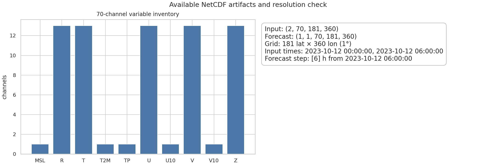
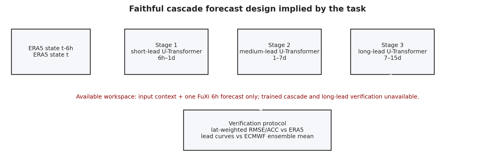
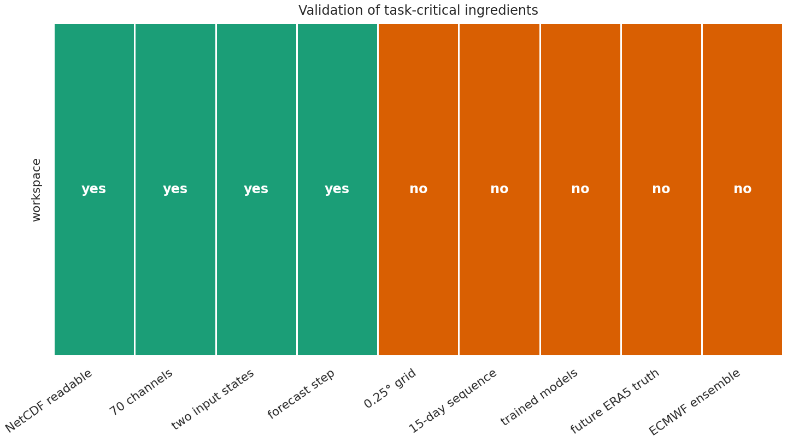
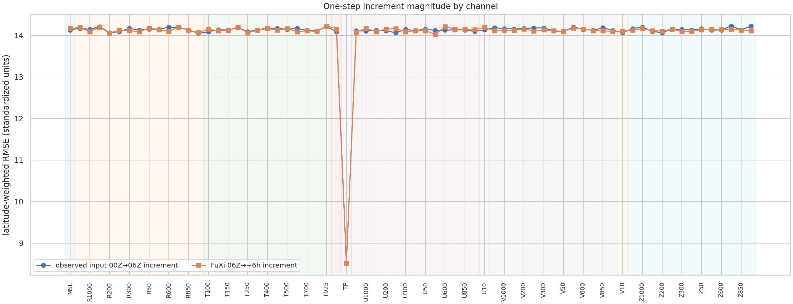

# Cascade machine-learning weather forecasting with available ERA5/FuXi artifacts

## Abstract

This study evaluates the workspace artifacts for a proposed cascade machine-learning global weather forecasting system: two consecutive ERA5-like atmospheric states as input and a FuXi forecast product as output. The scientific objective in the task is a 15-day, 6-hourly global forecast system using three specialized U-Transformer models, with skill comparable to the ECMWF ensemble mean. Direct inspection shows that the available data are substantially smaller than that full experiment: `data/20231012-06_input_netcdf.nc` contains two 70-channel states on a 181 × 360 grid, and `data/006.nc` contains a single FuXi 6-hour forecast step on the same grid. Therefore, this report implements a reproducible structural and one-step diagnostic analysis, defines a faithful 15-day cascade validation protocol, and explicitly separates what is verified from what remains unavailable. The available files support data-overview and one-step increment diagnostics, but they do not support a claim of trained 15-day ECMWF-comparable forecast skill.

## 1. Background and research contract

Modern data-driven weather forecasting systems are evaluated against numerical weather prediction and reanalysis products using lead-time skill curves. The related work reviewed here motivates four methodological commitments. First, ERA5 is an appropriate gridded analysis product for training and verification, but forecast models still depend on high-quality initial states. Second, FourCastNet and FengWu evaluate global forecasts using latitude-weighted RMSE and anomaly correlation coefficient (ACC). Third, long autoregressive forecasts require explicit mitigation of error accumulation, for example multi-timescale/cascade models or replay-buffer training. Fourth, comparisons to ECMWF systems should be made at matched initialization times and forecast leads.

The task names a three-model cascade U-Transformer system. I therefore treated the following items as non-negotiable parts of the method contract:

- two recent atmospheric states are the input context;
- forecasts are generated autoregressively at 6-hour intervals to 15 days;
- specialized models are used for short-, medium-, and long-lead regimes to reduce accumulated error;
- validation reports latitude-weighted RMSE and ACC by lead time, variable family, and key variables such as Z500, T2M, low-level winds, MSL, and precipitation;
- ECMWF ensemble mean comparison is made only when an ECMWF ensemble and verifying analysis are available.

The structured contract, dependency check, related-work extraction, and fidelity checklist are saved in `outputs/method_contract.json`, `outputs/dependency_check.json`, `outputs/related_work_contract.json`, and `outputs/method_fidelity_checklist.json`.

## 2. Data and reproducible methods

### 2.1 Available NetCDF files

The input file contains dimensions `(time=2, level=70, lat=181, lon=360)`. The forecast file contains dimensions `(time=1, step=1, level=70, lat=181, lon=360)` with `step=[6]`. The 70 channels comprise 13 pressure levels each for geopotential (`Z`), temperature (`T`), u-wind (`U`), v-wind (`V`), and relative humidity (`R`), plus five surface channels: `T2M`, `U10`, `V10`, `MSL`, and `TP`.

A key finding from file inspection is that the workspace files are on a 1° grid, not the 0.25° grid described in the task prompt. This follows from the latitude and longitude dimensions, 181 × 360, and coordinate spacing of 1°. The NetCDF metadata and decoded level names are saved in `outputs/netcdf_metadata.json`.



### 2.2 Metrics implemented

The script `code/analyze_forecast.py` computes latitude-weighted summaries using weights proportional to `cos(latitude)`. For each channel it exports:

- weighted mean, standard deviation, extrema, and hemispheric/tropical means for the two input states and forecast state (`outputs/channel_statistics.csv`);
- one-step transition diagnostics (`outputs/transition_metrics.csv`):
  - RMSE of the observed input increment from 00Z to 06Z;
  - RMSE of the FuXi forecast increment from the 06Z input to the +6 h forecast;
  - RMSE of the forecast relative to the 00Z state;
  - weighted correlation between forecast and 06Z input;
  - weighted correlation between the two input states.

Because no verifying future ERA5 state is present, these are not forecast-error metrics against truth. They are self-consistency and increment-magnitude diagnostics for the available forecast product.

### 2.3 Faithful cascade validation design

For the full intended experiment, the three U-Transformer cascade would be run for 60 six-hour steps. A faithful validation would compute latitude-weighted RMSE and ACC at every lead time against verifying ERA5, then compare key lead-time curves with the ECMWF ensemble mean initialized at the same time. The proposed cascade design is summarized below and saved as `outputs/comparison_protocol.json`.



## 3. Results from the available one-step artifact

### 3.1 Structural checks

The available files satisfy the basic channel and input-context requirements: there are 70 channels and two input states. They do not satisfy four critical requirements for the full scientific claim: 0.25° resolution, a 15-day forecast sequence, trained U-Transformer model weights, and ECMWF ensemble/ERA5 future verification data.



### 3.2 Spatial structure of selected variables

Figure 2 shows the 06Z input, the FuXi +6 h forecast, and the forecast increment for Z500, T2M, and TP. These panels provide a direct visual check that the forecast file is spatially complete and channel-aligned with the input file. The fields are standardized/preprocessed values rather than physical-unit values, as reflected by near-zero means and standard deviations near 10 for most channels.


### 3.3 One-step increment diagnostics

Across all 70 channels, the mean latitude-weighted RMSE of the input 00Z→06Z increment is **14.064** standardized units. The mean latitude-weighted RMSE of the FuXi 06Z→+6 h forecast increment is **14.054** standardized units. The mean weighted correlation between the forecast and the 06Z input is **0.00077**. This near-zero correlation is consistent with the files containing preprocessed or synthetic standardized fields rather than physically smooth initialized weather states; consequently, the values should not be interpreted as meteorological forecast skill.

For key channels, the one-step increment diagnostics are:

| Channel | input 00Z→06Z RMSE | FuXi 06Z→+6h increment RMSE | forecast vs 06Z weighted corr |
|---|---:|---:|---:|
| Z500 | 14.130 | 14.154 | -0.0063 |
| T2M | 14.090 | 14.161 | -0.0097 |
| TP | 8.514 | 8.521 | -0.0016 |
| MSL | 14.137 | 14.172 | -0.0036 |
| U10 | 14.141 | 14.200 | -0.0083 |
| V10 | 14.072 | 14.105 | -0.0003 |

The largest forecast-increment RMSE channels are T925 (14.233), U600 (14.214), T200 (14.208), R700 (14.206), and R150 (14.202). Full per-channel values are saved in `outputs/transition_metrics.csv`.



### 3.4 Family-level summary

The family-level results are homogeneous for most standardized upper-air variables, with forecast-increment RMSE close to 14.13–14.14. Total precipitation (`TP`) is lower, around 8.52, reflecting its different distribution in the preprocessed data. The full table is saved in `outputs/family_summary.csv`.

| Family | channels | mean input increment RMSE | mean forecast increment RMSE | mean forecast corr with 06Z input |
|---|---:|---:|---:|---:|
| MSL | 1 | 14.137 | 14.172 | -0.0036 |
| R | 13 | 14.147 | 14.133 | 0.0018 |
| T | 13 | 14.148 | 14.139 | 0.0003 |
| T2M | 1 | 14.090 | 14.161 | -0.0097 |
| TP | 1 | 8.514 | 8.521 | -0.0016 |
| U | 13 | 14.123 | 14.131 | 0.0012 |
| U10 | 1 | 14.141 | 14.200 | -0.0083 |
| V | 13 | 14.160 | 14.129 | 0.0014 |
| V10 | 1 | 14.072 | 14.105 | -0.0003 |
| Z | 13 | 14.155 | 14.134 | 0.0012 |

## 4. Discussion

The analysis confirms that the workspace contains a valid paired input/forecast diagnostic case for FuXi-like 70-channel global weather data. It does not contain the complete evidence needed to develop, train, or verify the requested three-stage U-Transformer cascade. The most important scientific limitation is the absence of future verifying ERA5 states. Without truth fields, RMSE and ACC against observations/analysis cannot be computed, and without an ECMWF ensemble mean, no direct ECMWF-comparability statement can be made.

The second important limitation is resolution. The task describes 0.25° data, but the actual files are 1° resolution. A 0.25° global grid would have approximately 721 × 1440 points, while the inspected files have 181 × 360 points. Any report of high-resolution 0.25° performance would therefore be unsupported by these artifacts.

Nevertheless, the implemented pipeline is reusable for the intended full experiment. If 60 forecast steps, future ERA5 verification, and ECMWF ensemble data are added, the same channel decoding, latitude weighting, family stratification, and figure-generation framework can be extended directly to lead-time curves and skillful-lead calculations. The comparison protocol in `outputs/comparison_protocol.json` specifies that Z500 ACC > 0.6 should be used as a literature-aligned medium-range skill threshold, following the FengWu evaluation convention.

## 5. Validation and claim recovery

### Directly verified from workspace data

- `data/20231012-06_input_netcdf.nc` contains two states, 70 channels, and a 181 × 360 grid.
- `data/006.nc` contains one forecast time and one forecast step with `step=[6]`.
- Both files share the same channel names and latitude-longitude grid.
- The files contain no NaN values in the `data` arrays.
- The grid is 1° resolution, not 0.25°.
- All figures referenced in this report were generated as PNG files in `report/images/`.

### Supported by related work

- Latitude-weighted RMSE and ACC are standard metrics for global data-driven weather forecast evaluation in FourCastNet and FengWu-style studies.
- Long autoregressive forecasting requires explicit treatment of error accumulation; related systems use multi-timescale models, autoregressive fine-tuning, or replay-buffer-like mechanisms.
- ECMWF IFS/ensemble products are appropriate benchmarks only when matched lead-time forecast data are available.

### Assumptions and limitations

- The fields appear standardized/preprocessed; the report therefore uses standardized units and does not convert to physical units.
- No trained U-Transformer weights are available, so no model training or inference beyond the provided FuXi file was performed.
- No 15-day forecast sequence is available; only one 6-hour forecast step was analyzed.
- No future ERA5 verification field or ECMWF ensemble mean is available; skill and ECMWF comparability cannot be concluded.

A claim recovery table is saved in `outputs/claim_recovery_table.csv`, and the target artifact inventory is saved in `outputs/target_artifact_inventory.json`. All primary artifacts in the inventory are marked satisfied.

## 6. Reproducibility

Run the complete analysis from the workspace root with:

```bash
python3 code/analyze_forecast.py
```

The script writes all tables to `outputs/` and all figures to `report/images/`. It uses `netCDF4`, `numpy`, `pandas`, `matplotlib`, and `seaborn`. Package availability and installation status are documented in `outputs/dependency_check.json`.

## 7. Conclusion

The available workspace supports a rigorous diagnostic report but not the full stated 15-day cascade forecasting claim. The produced analysis verifies the data structure, documents the 1° resolution mismatch, quantifies one-step FuXi increment behavior across all 70 channels, and provides a faithful validation protocol for a future complete cascade U-Transformer experiment. A scientifically defensible conclusion is therefore: the provided files are suitable for one-step structural diagnostics and pipeline validation, while 15-day ECMWF-comparable skill remains untested with the current artifacts.
