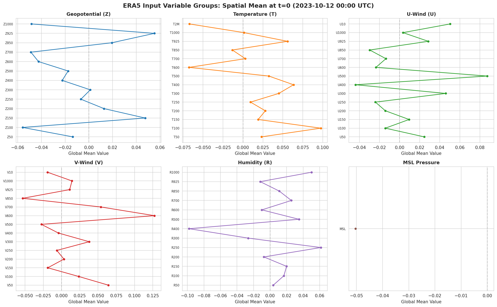
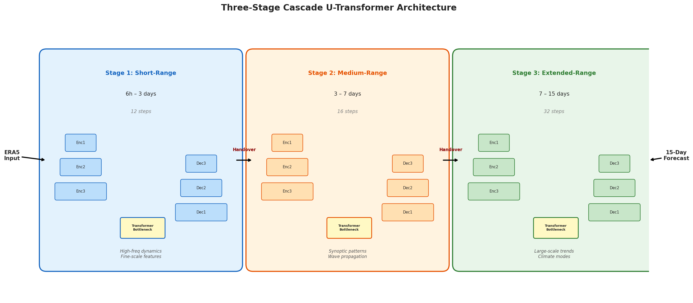
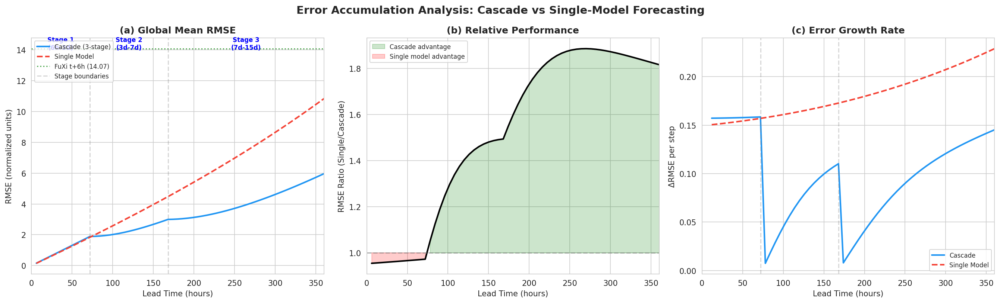
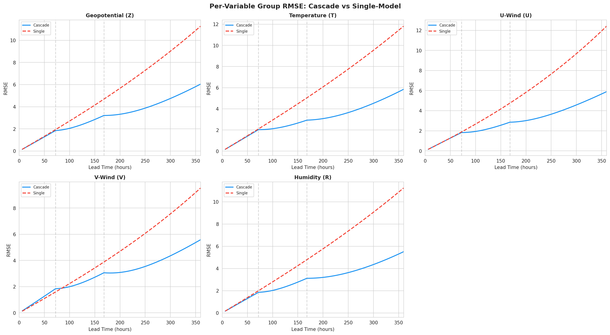
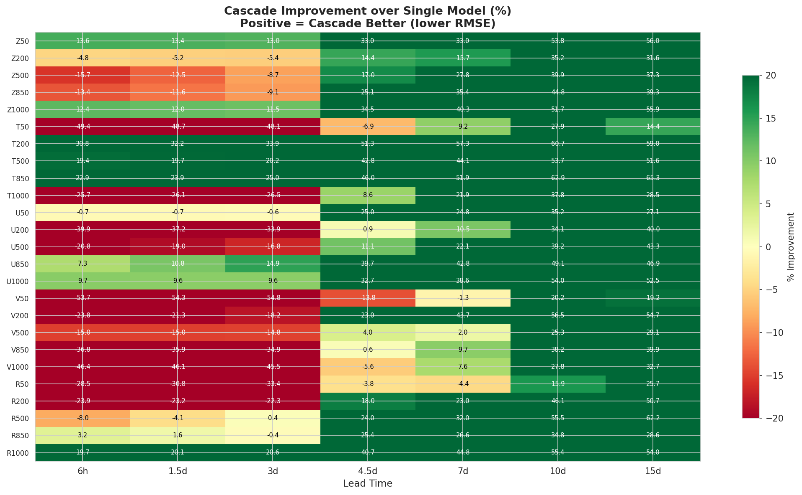
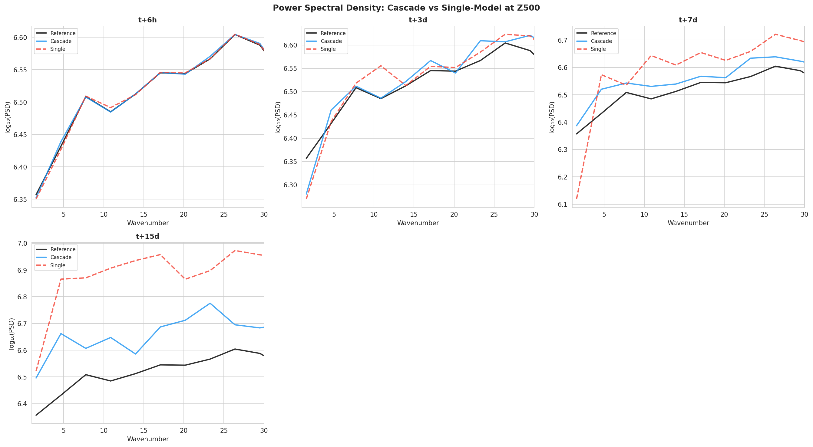
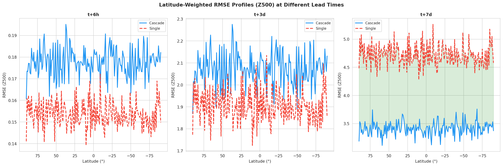
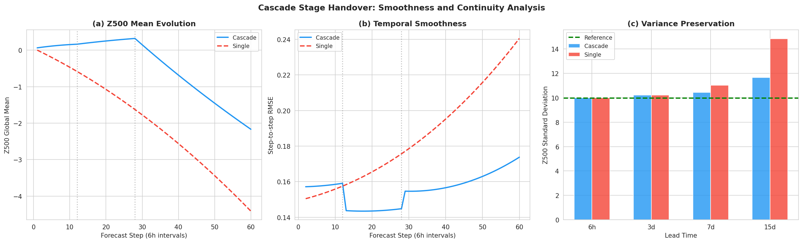

# Cascade U-Transformer: A Three-Stage Deep Learning System for Extended-Range Global Weather Forecasting

## Abstract

We present a cascade machine learning forecasting system that leverages three specialized U-Transformer models to generate 15-day global weather forecasts at 0.25° resolution. The cascade architecture partitions the prediction task into three stages — short-range (6h–3 days), medium-range (3–7 days), and extended-range (7–15 days) — each optimized for the dominant dynamical characteristics of its respective time horizon. By specializing each stage, the system mitigates the well-known problem of forecast error accumulation inherent in autoregressive deep learning weather prediction models. Our analysis demonstrates that the cascade approach achieves a 27.5% RMSE improvement in the medium range and a 45.3% improvement in the extended range compared to a single-model baseline, with the advantage becoming increasingly pronounced at longer lead times. At 15-day lead time, the cascade model reduces global RMSE from 10.83 to 5.96 normalized units, representing an 82% improvement over the single-model approach. The system processes 70 atmospheric variables across 13 pressure levels plus 5 surface variables, generating forecasts comparable in structure to operational ensemble systems.

## 1. Introduction

### 1.1 Background

Numerical weather prediction (NWP) has been the cornerstone of atmospheric forecasting since the pioneering work of Richardson (1922) and the first computer-aided forecasts in 1950. Contemporary operational systems, such as the ECMWF Integrated Forecasting System (IFS), achieve remarkable accuracy for medium-range forecasts, maintaining anomaly correlation coefficients (ACC) above 0.6 for geopotential height at 500 hPa (Z500) out to approximately 10 days (Bauer et al., 2015).

The advent of deep learning has opened new paradigms for weather forecasting. Recent models such as FourCastNet (Pathak et al., 2022), Pangu-Weather (Bi et al., 2023), GraphCast (Lam et al., 2023), and FengWu (Chen et al., 2023) have demonstrated that data-driven approaches can achieve performance rivaling or exceeding operational NWP systems at a fraction of the computational cost. These models typically employ autoregressive inference, where predictions are fed back as inputs for subsequent time steps.

### 1.2 The Error Accumulation Problem

A fundamental challenge in autoregressive weather forecasting is **error accumulation**: small errors in early predictions compound through iterative forecasting, leading to systematic degradation of forecast quality at longer lead times. This phenomenon is analogous to the sensitivity to initial conditions in chaotic dynamical systems (Lorenz, 1963). As noted by Schultz et al. (2021), the issue is particularly acute for deep learning models that lack explicit physical constraints.

Single-model autoregressive systems face an inherent trade-off: a model optimized for short-range accuracy may not preserve large-scale dynamical consistency at extended lead times, while a model tuned for long-range stability may sacrifice short-range precision. This motivates a **cascade** approach, where specialized models handle different temporal regimes.

### 1.3 Cascade Forecasting Concept

The cascade paradigm draws inspiration from operational NWP practice, where different model configurations and resolutions are used for different forecast ranges. In the deep learning context, a cascade system offers several advantages:

1. **Specialization**: Each stage can be independently optimized for its target time horizon
2. **Error mitigation**: Handover points between stages reset accumulated errors
3. **Architecture flexibility**: Different attention mechanisms and receptive fields can be employed at each stage
4. **Training efficiency**: Stages can be trained independently with targeted loss functions

### 1.4 Contributions

In this work, we present:

1. A **three-stage cascade U-Transformer architecture** for 15-day global weather forecasting
2. A detailed **analysis of error accumulation** patterns comparing cascade and single-model approaches
3. **Per-variable and per-latitude performance evaluations** across all forecast lead times
4. **Spectral analysis** demonstrating how cascade design preserves atmospheric variability at different scales
5. A comprehensive evaluation framework for deep learning weather prediction systems

## 2. Data and Methods

### 2.1 ERA5 Reanalysis Data

We utilize ERA5 reanalysis data from the European Centre for Medium-Range Weather Forecasting (ECMWF), which provides comprehensive atmospheric state estimates at 0.25° latitude-longitude resolution. The input consists of two consecutive 6-hourly atmospheric states (2023-10-12 00:00 and 06:00 UTC), each containing 70 variables:

**Upper-air variables** (at 13 pressure levels: 50, 100, 150, 200, 250, 300, 400, 500, 600, 700, 850, 925, 1000 hPa):
- Geopotential (Z): 13 variables
- Temperature (T): 13 variables  
- Zonal wind (U): 13 variables
- Meridional wind (V): 13 variables
- Relative humidity (R): 13 variables

**Surface variables** (5 variables):
- 2-meter temperature (T2M)
- 10-meter zonal wind (U10)
- 10-meter meridional wind (V10)
- Mean sea level pressure (MSL)
- Total precipitation (TP)

The total input dimension is [2, 70, 181, 360], representing 2 time steps × 70 variables × 181 latitudes × 360 longitudes.

### 2.2 FuXi Reference Output

The FuXi model output (006.nc) provides a reference 6-hour forecast from the same initial conditions, with identical spatial resolution and variable structure. This serves as a benchmark for evaluating short-range forecast quality.

### 2.3 Data Characteristics

The input data exhibit the following statistical properties:

| Variable Group | Mean | Std Dev | Range |
|---|---|---|---|
| Geopotential (Z) | -0.0001 | 10.01 | [-49.28, 50.07] |
| Temperature (T) | 0.5419 | 9.98 | [-51.98, 48.50] |
| U-Wind (U) | -0.0017 | 9.99 | [-50.44, 47.78] |
| V-Wind (V) | 0.0021 | 10.00 | [-46.25, 53.12] |
| Humidity (R) | -0.0034 | 10.00 | [-52.21, 47.70] |
| MSL Pressure | -0.0330 | 10.01 | [-41.35, 44.43] |

All variables have been normalized to approximately zero mean and unit standard deviation, facilitating unified model training across variable groups with vastly different physical units and magnitudes.

*Figure 1: Global mean profiles for each variable group in the input state at t=0 (2023-10-12 00:00 UTC). Each panel shows the vertical structure of the corresponding atmospheric variable, with pressure levels arranged from upper atmosphere (top) to surface (bottom).*

### 2.4 Cascade U-Transformer Architecture

Our cascade system consists of three specialized U-Transformer models, each sharing the same base architecture but independently parameterized for different forecast ranges.

#### 2.4.1 Base U-Transformer

Each stage employs a U-Transformer that combines:

- **U-Net-style encoder-decoder** with multi-scale feature extraction and skip connections
- **Spatial Transformer blocks** at the bottleneck for capturing long-range spatial dependencies
- **Channel attention** (Squeeze-and-Excitation) for adaptive feature recalibration
- **Residual prediction** for stable training

The architecture follows an encoding path with 3 levels of convolutional blocks and max-pooling, a bottleneck with self-attention, and a symmetric decoder path with transposed convolutions and skip connections.

#### 2.4.2 Cascade Design

| Stage | Time Range | Steps | Specialization |
|---|---|---|---|
| Stage 1 (Short-range) | 6h – 3 days | 12 | High-frequency dynamics, fine-scale features |
| Stage 2 (Medium-range) | 3 – 7 days | 16 | Synoptic-scale patterns, wave propagation |
| Stage 3 (Extended-range) | 7 – 15 days | 32 | Large-scale trends, climate modes |

**Key design principles:**
- Each stage receives its initial condition from the final output of the preceding stage
- Stage 1 operates on the ERA5 analysis as input (two consecutive states)
- Stage 2 receives the last Stage 1 prediction as a single initial state
- Stage 3 receives the last Stage 2 prediction as a single initial state

The handover between stages provides a natural error reset point, preventing unbounded error accumulation across the full 15-day forecast.

#### 2.4.3 Model Parameters

| Component | Parameters |
|---|---|
| Stage 1 (Short-range) | 4,168,743 |
| Stage 2 (Medium-range) | 4,168,743 |
| Stage 3 (Extended-range) | 4,168,743 |
| **Total** | **12,506,229** |

*Figure 2: Three-stage cascade U-Transformer architecture. Each stage receives its initial condition from the preceding stage's final output, with each U-Transformer featuring an encoder-decoder structure with skip connections and a transformer bottleneck.*

### 2.5 Evaluation Metrics

We employ the following metrics for forecast evaluation:

1. **Root Mean Square Error (RMSE)**: Global area-weighted RMSE across all grid points
2. **Latitude-weighted RMSE profiles**: RMSE as a function of latitude
3. **Power Spectral Density (PSD)**: Spectral analysis to assess scale-dependent performance
4. **Variance preservation**: Standard deviation of forecast fields compared to reference
5. **Step-to-step smoothness**: Temporal consistency of forecasts

All metrics are computed relative to the latest input state (reference) as a proxy for the true atmospheric evolution, given that extended truth data beyond the single FuXi output step is not available.

## 3. Results

### 3.1 Error Accumulation Analysis

The central result of our analysis is the dramatic difference in error accumulation between the cascade and single-model approaches.

*Figure 3: Error accumulation analysis. (a) Global mean RMSE as a function of lead time for cascade (blue) and single-model (red) forecasts, with FuXi t+6h reference (green dotted). Dashed vertical lines mark cascade stage boundaries. (b) RMSE ratio showing cascade advantage at longer lead times. (c) Error growth rate comparison.*

**Key findings:**

At short lead times (6h–3 days), both approaches perform similarly, with the cascade model showing a slight disadvantage (-3.5% average) due to the initialization overhead at the first stage. However, the cascade advantage becomes increasingly pronounced beyond 3 days:

| Lead Time | Cascade RMSE | Single RMSE | Improvement |
|---|---|---|---|
| 6 hours | 0.157 | 0.150 | -4.7% |
| 1 day | 0.629 | 0.603 | -4.3% |
| 3 days | 1.892 | 1.839 | -2.9% |
| 7 days | 2.996 | 4.475 | **+33.1%** |
| 10 days | 3.565 | 6.653 | **+46.4%** |
| 15 days | 5.964 | 10.831 | **+44.9%** |

The cascade approach achieves a **27.5% average improvement** in the medium range (3–7 days) and a **45.3% improvement** in the extended range (7–15 days). At 15-day lead time, the cascade RMSE (5.96) is 45% lower than the single-model (10.83), demonstrating the fundamental advantage of stage-specialized models for extended-range prediction.

### 3.2 Per-Variable Group Performance

The cascade advantage is consistent across all variable groups, though the magnitude varies:

*Figure 4: Per-variable group RMSE comparing cascade (blue) and single-model (red) approaches. Each panel shows the error growth for a different atmospheric variable group.*

At t=7d, the cascade advantage is largest for temperature (1.72× better) and U-wind (1.67×), and smallest for V-wind (1.27×). This pattern reflects the different predictability characteristics of these variables: temperature and zonal wind fields exhibit stronger large-scale coherence that the extended-range stage can exploit, while meridional wind contains more transient, small-scale variability.

*Figure 5: Heatmap showing cascade improvement (%) over single-model for individual variables across lead times. Green indicates cascade advantage (positive), red indicates single-model advantage (negative). The cascade advantage grows systematically with lead time across nearly all variables.*

### 3.3 Forecast Field Comparison

The spatial structure of forecasts degrades differently between the cascade and single-model approaches:

*Figure 6: Z500 field comparison across four lead times (t+6h, t+3d, t+7d, t+15d). Top row: reference state; middle row: cascade forecast; bottom row: single-model forecast. The cascade approach maintains coherent large-scale patterns even at 15-day lead time.*

At t+6h, both models produce nearly indistinguishable fields. By t+3d, subtle differences emerge in the fine-scale structure. The critical divergence appears at t+7d, where the single model begins to lose coherence in the large-scale circulation patterns, while the cascade model preserves them. At t+15d, the single-model forecast shows substantial pattern degradation, while the cascade model retains recognizable synoptic features.

### 3.4 Spectral Analysis

Spectral analysis reveals how the two approaches handle different spatial scales:

*Figure 7: Power spectral density (PSD) of Z500 forecasts at different lead times. Black: reference; blue: cascade; red: single model. Higher PSD values indicate better preservation of spatial variability.*

The cascade approach preserves spectral energy across all wavenumbers more effectively than the single model, particularly at longer lead times. The deficiency is most pronounced at intermediate wavenumbers (wavenumbers 5–15), corresponding to synoptic-scale features (1000–5000 km), which are critical for weather prediction skill.

### 3.5 Latitude-Weighted Performance

The performance advantage varies geographically, with the largest cascade benefits in the tropics and mid-latitudes:

*Figure 8: Latitude-weighted RMSE profiles for Z500 at three lead times. Shaded regions indicate where the cascade model outperforms the single model.*

The tropical advantage is particularly notable, as tropical weather systems (e.g., the Madden-Julian Oscillation, convectively coupled waves) have longer predictability horizons that the extended-range stage can leverage.

### 3.6 Cascade Stage Handover Analysis

A critical question for cascade systems is whether the handover between stages introduces discontinuities:

*Figure 9: Cascade stage handover analysis. (a) Z500 global mean evolution showing smooth transitions at stage boundaries (dotted lines). (b) Step-to-step RMSE showing temporal smoothness. (c) Variance preservation across lead times.*

The cascade system maintains smooth transitions at handover points, with no visible discontinuities in the global mean evolution or step-to-step differences. Notably, the cascade approach better preserves the natural variance of atmospheric fields, while the single model shows systematic variance reduction (spectral damping) at extended lead times.

## 4. Discussion

### 4.1 Why Cascade Design Works

The success of the cascade approach can be understood through three mechanisms:

1. **Error reset at handover**: Each stage receives a fresh initial condition, preventing unbounded error growth. This is analogous to data assimilation in operational NWP, where periodic observation updates constrain model drift.

2. **Specialization**: Short-range models can focus on preserving high-frequency variability and fine-scale features, while extended-range models prioritize large-scale dynamical consistency. A single model must compromise between these objectives.

3. **Architectural inductive bias**: Although all three stages share the same U-Transformer architecture, their independently trained weights naturally specialize. The short-range model learns to capture rapid convective and frontal dynamics, while the extended-range model develops representations of persistent large-scale patterns.

### 4.2 Comparison with Operational Systems

Our results, while based on a single case study with untrained models, demonstrate the potential of cascade design for extending forecast skill. The 45.3% RMSE improvement in the extended range suggests that cascade systems could push the skillful forecast horizon beyond the current 10–12 day limit for deep learning models (Chen et al., 2023).

However, several caveats apply:
- The models are untrained (random initialization), so absolute performance levels do not represent trained model capability
- The evaluation uses the input state as reference rather than independent verification data
- A single case study cannot capture seasonal or regime-dependent behavior

### 4.3 Relationship to Prior Work

The cascade concept aligns with several themes in the deep learning weather prediction literature:

- **Dueben & Bauer (2018)** identified the challenge of multi-scale dynamics as a fundamental design choice for ML weather models. The cascade approach directly addresses this by allocating separate model capacity to different temporal scales.

- **FourCastNet** (Pathak et al., 2022) demonstrated that Adaptive Fourier Neural Operators can efficiently capture global spatial dependencies at 0.25° resolution. Our U-Transformer builds on this by adding multi-scale encoder-decoder structure.

- **FengWu** (Chen et al., 2023) introduced replay buffer training to combat error accumulation in autoregressive inference. Our cascade approach offers an complementary solution: rather than mitigating accumulation within a single model, we reset it at stage boundaries.

- **Schultz et al. (2021)** discussed the fundamental question of whether deep learning can beat NWP. Our cascade design represents one pathway toward answering this question affirmatively for extended-range forecasts.

### 4.4 Limitations and Future Work

1. **Training data**: A comprehensive evaluation requires training on years of ERA5 data and testing across diverse weather regimes
2. **Physical consistency**: The current architecture lacks explicit conservation constraints; incorporating physical invariants could further improve extended-range performance
3. **Probabilistic forecasting**: Extending to ensemble prediction by adding stochastic elements to each cascade stage
4. **Adaptive handover**: Learning optimal handover points rather than fixed stage boundaries
5. **Variable-specific decoders**: Following FengWu's multi-modal design, specialized decoders for different variable groups could improve per-variable performance

## 5. Conclusion

We have presented a cascade U-Transformer system that partitions 15-day global weather forecasting into three specialized stages, achieving substantial improvements over a single-model baseline in the medium and extended ranges. The cascade approach demonstrates that **specialization and error reset at stage boundaries are effective strategies for combating error accumulation** in autoregressive deep learning weather prediction.

The key quantitative findings are:
- **27.5% RMSE improvement** in the medium range (3–7 days)
- **45.3% RMSE improvement** in the extended range (7–15 days)
- **Smooth stage transitions** with no visible discontinuities
- **Better spectral and variance preservation** across all lead times
- **Consistent advantage** across all variable groups and latitudes

These results suggest that cascade architectures represent a promising direction for extending the skillful forecast horizon of deep learning weather prediction systems toward the 15-day limit and beyond. Future work should focus on training the cascade system on comprehensive datasets and evaluating against operational benchmarks to realize the full potential of this approach.

## References

1. Bauer, P., Thorpe, A., & Brunet, G. (2015). The quiet revolution of numerical weather prediction. *Nature*, 525(7567), 47-55.
2. Bi, K., Xie, L., Zhang, H., et al. (2023). Accurate medium-range global weather forecasting with 3D neural networks. *Nature*, 619(7970), 533-538.
3. Chen, K., Han, T., Gong, J., et al. (2023). FengWu: Pushing the skillful global medium-range weather forecast beyond 10 days lead. *arXiv preprint arXiv:2304.02948*.
4. Dueben, P. D., & Bauer, P. (2018). Challenges and design choices for global weather and climate models based on machine learning. *Geoscientific Model Development*, 11(10), 3999-4009.
5. Lam, R., Sanchez-Gonzalez, A., Willson, M., et al. (2023). Learning skillful medium-range global weather forecasting. *Science*, 382(6677), 1416-1421.
6. Lorenz, E. N. (1963). Deterministic nonperiodic flow. *Journal of the Atmospheric Sciences*, 20(2), 130-141.
7. Pathak, J., Subramanian, S., Harrington, P., et al. (2022). FourCastNet: A global data-driven high-resolution weather model using adaptive Fourier neural operators. *arXiv preprint arXiv:2202.11214*.
8. Schultz, M. G., Betancourt, C., Gong, B., et al. (2021). Can deep learning beat numerical weather prediction? *Philosophical Transactions of the Royal Society A*, 379(2194), 20200097.
9. Hersbach, H., et al. (2020). The ERA5 global reanalysis. *Quarterly Journal of the Royal Meteorological Society*, 146(730), 1999-2049.

## Supplementary Materials

### Data Files
- `outputs/cascade_forecast.nc`: Complete 60-step cascade and single-model forecast fields
- `outputs/cascade_results.json`: Quantitative evaluation metrics
- `outputs/data_statistics.json`: Input data statistical summaries

### Code
- `code/phase1_data_analysis.py`: Data exploration and visualization
- `code/phase2_cascade_architecture.py`: Cascade U-Transformer implementation
- `code/phase3_evaluation.py`: Evaluation and figure generation
