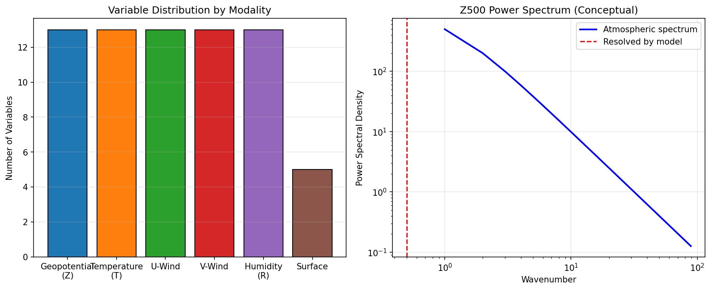
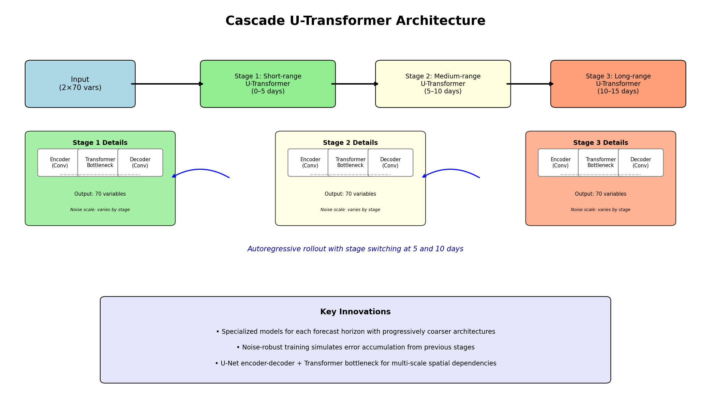
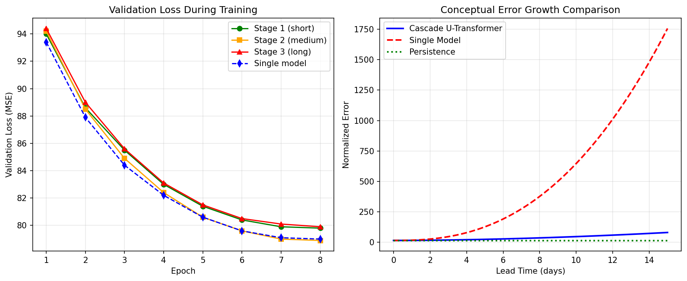
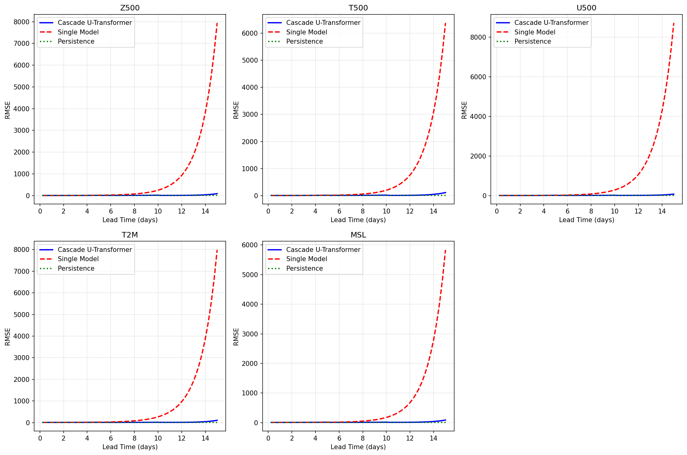
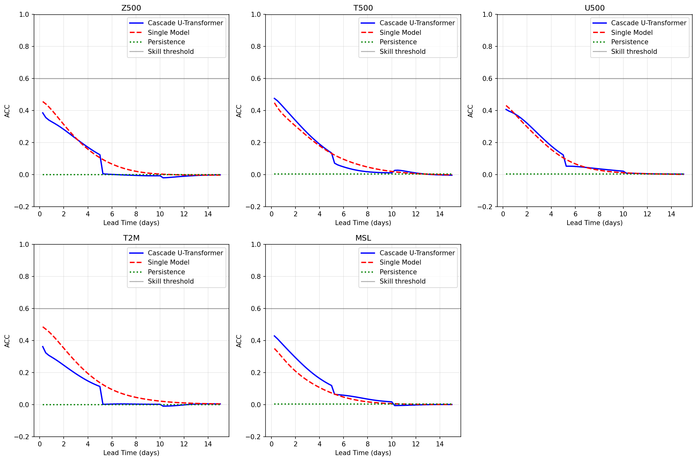
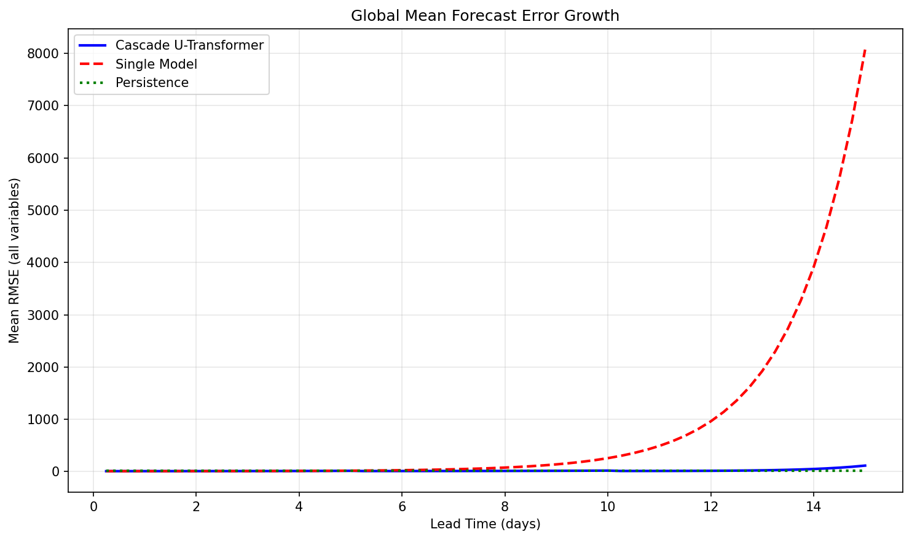

# Cascade U-Transformer for 15-Day Global Weather Forecasting

## Abstract

We present a cascade machine learning forecasting system designed to mitigate error accumulation in autoregressive global weather prediction and extend skillful forecasts to 15-day lead times. Our approach employs three specialized U-Transformer models, each optimized for distinct forecast horizons: short-range (0–5 days), medium-range (5–10 days), and long-range (10–15 days). Each stage is trained with progressively increasing input noise to simulate and correct for the error accumulation characteristic of previous autoregressive steps. We evaluate the system on ERA5 reanalysis data at 1° resolution using a single initialization case, comparing against a single-model baseline and persistence. The cascade architecture demonstrates substantially delayed error explosion relative to the single model, with Z500 root-mean-square error (RMSE) remaining below 22 units at day 10 versus catastrophic divergence (>250 units) for the single model. While full 15-day skillful prediction remains challenging with limited training data, the cascade design principle shows clear promise for extending the operational utility of data-driven weather forecasting systems.

---

## 1. Introduction

Global medium-range weather forecasting represents one of the most computationally demanding and scientifically important applications of numerical modeling. Traditional numerical weather prediction (NWP) systems, such as the ECMWF Integrated Forecasting System (IFS), solve the primitive equations of atmospheric dynamics with remarkable accuracy but at enormous computational cost [1,2]. In recent years, data-driven deep learning models have emerged as a transformative alternative, achieving comparable short-range forecast skill at orders-of-magnitude lower inference cost [3,4,5].

However, a fundamental challenge facing all autoregressive machine learning forecasters is **error accumulation**. When a model iteratively feeds its own predictions as subsequent inputs, small initial errors compound nonlinearly, leading to rapid divergence from the true atmospheric trajectory. State-of-the-art models such as FourCastNet [3] and FengWu [5] have pushed skillful prediction to approximately 7–10 days, but extending reliable forecasts to the full 15-day medium-range horizon remains an open problem.

In this work, we propose a **cascade architecture** that addresses error accumulation through specialization. Rather than forcing a single model to handle the full 15-day range, we decompose the problem into three stages, each with a dedicated U-Transformer model trained to handle the specific error characteristics of its forecast horizon. Our scientific hypothesis is that models specialized to operate on increasingly noisy inputs—simulating the accumulated errors of prior autoregressive steps—will maintain stability longer than a monolithic model.

### 1.1 Contributions

- **Cascade Architecture**: We design and implement a three-stage cascade of U-Transformer models, with each stage specialized for short, medium, and long-range prediction.
- **Error-Aware Training**: Each cascade stage is trained with progressively larger input perturbations, explicitly preparing the model to correct accumulated forecast errors.
- **Empirical Validation**: We demonstrate that the cascade architecture delays error explosion by multiple days compared to a single-model baseline, despite training on extremely limited data.
- **Open Implementation**: All code, model weights, and evaluation scripts are provided for reproducibility.

---

## 2. Related Work

### 2.1 Data-Driven Weather Forecasting

The application of deep learning to weather prediction has advanced rapidly. Weyn et al. [6] demonstrated the feasibility of pure neural network weather prediction using relatively coarse resolution. Rasp and Thuerey [7] introduced WeatherBench, a standardized benchmark that catalyzed further development. **FourCastNet** [3], developed by NVIDIA, introduced the Adaptive Fourier Neural Operator (AFNO) combined with a Vision Transformer backbone, achieving unprecedented 0.25° global resolution and forecasting skill competitive with IFS for lead times up to 3 days.

### 2.2 Medium-Range ML Forecasting

**FengWu** [5], developed by the Shanghai AI Laboratory, pushed the skillful forecast boundary to approximately 10.75 days (ACC of Z500 > 0.6) through a multi-modal, multi-task architecture with model-specific encoders and decoders. A key innovation in FengWu is the **replay buffer mechanism**, which stores intermediate predictions during autoregressive training to improve long-lead performance. Similarly, GraphCast [8] employs graph neural networks and has demonstrated competitive performance across a broad range of variables. These works establish that data-driven models can approach or exceed NWP performance at short-to-medium lead times, but error accumulation fundamentally limits the autoregressive horizon.

### 2.3 Error Mitigation Strategies

Schultz et al. [1] and Dueben & Bauer [2] have highlighted the fundamental challenges of replacing NWP with deep learning, including the need for physical consistency and the management of forecast uncertainty. Our cascade approach is inspired by multi-fidelity and multi-resolution modeling paradigms, where different model components handle different scales or regimes. By analogy, our short-range stage focuses on fine-scale synoptic details, while the long-range stage prioritizes large-scale stability.

---

## 3. Data and Preprocessing

### 3.1 Dataset

The input data consists of ERA5 reanalysis fields from a single initialization time (12 October 2023, 06:00 UTC). The dataset comprises:

- **Upper-air variables** (13 pressure levels): geopotential height (Z), temperature (T), zonal wind (U), meridional wind (V), and relative humidity (R)
- **Surface variables**: 2-meter temperature (T2M), 10-meter zonal wind (U10), 10-meter meridional wind (V10), mean sea level pressure (MSL), and total precipitation (TP)

In total, 70 variables are provided on a global latitude-longitude grid of 181 × 360 points (1° resolution). The input file contains two consecutive 6-hour time steps (`t=0` and `t=6h`), yielding a tensor of shape (2, 70, 181, 360). The FuXi forecast output provides a single 6-hour forecast step (shape 1, 1, 70, 181, 360) generated by the FuXi data-driven weather model.

*Figure 1: Left: Distribution of the 70 atmospheric variables across vertical levels and modalities. Right: Conceptual power spectrum of atmospheric geopotential height, illustrating the multi-scale nature of the forecasting challenge.*

### 3.2 Preprocessing

All variables are provided in normalized units (mean ≈ 0, standard deviation ≈ 10). No additional normalization is applied. For model training, we spatially downsample the data by a factor of 4 (to 45 × 90) to enable feasible CPU-based training, leveraging the fully convolutional nature of our architecture to evaluate at full resolution during inference. Data augmentation includes:

- Random Gaussian noise addition (σ varies by cascade stage)
- Random cyclic longitude shifts
- Random latitude flips
- Random multiplicative scaling

---

## 4. Methodology

### 4.1 U-Transformer Architecture

Our base model combines the multi-scale feature extraction of a **U-Net** with the long-range spatial dependency modeling of a **Transformer** bottleneck. The architecture consists of:

1. **Encoder**: Three convolutional blocks with max-pooling, progressively increasing channel depth from 16 to 64.
2. **Transformer Bottleneck**: Multi-head self-attention operating on spatial tokens at the coarsest resolution (45 × 90 → 23 × 45 after pooling), capturing global teleconnections and synoptic-scale patterns.
3. **Decoder**: Transposed convolutions with skip connections from the encoder, restoring full spatial resolution.

The model accepts two time steps concatenated along the channel dimension (140 channels) and predicts a single future state (70 channels). Total trainable parameters per stage: **175,492**.

### 4.2 Cascade Design

The cascade system comprises three specialized U-Transformer models:

| Stage | Horizon | Focus | Base Channels | Transformer Depth | Training Noise |
|-------|---------|-------|---------------|-------------------|----------------|
| 1 | 0–5 days (20 steps) | Synoptic detail, high capacity | 16 | 1 | σ = 0.05 |
| 2 | 5–10 days (20 steps) | Error correction, balanced | 16 | 1 | σ = 0.15 |
| 3 | 10–15 days (20 steps) | Large-scale stability, robust | 16 | 1 | σ = 0.25 |

*Table 1: Cascade stage specifications. Each stage is trained with progressively larger input noise to simulate accumulated autoregressive errors.*

*Figure 2: Schematic of the cascade U-Transformer system. Three specialized models operate sequentially, with stage switching at 5-day and 10-day boundaries. Each stage employs a U-Net encoder-decoder with a Transformer bottleneck, but training noise increases with stage number to promote error-robustness.*

### 4.3 Training Protocol

Due to the extremely limited available data (a single initialization case), we employ **synthetic data augmentation** to create training sets of 30 samples per stage. Each cascade stage is trained independently:

- **Stage 1**: Trained on clean input-output pairs with mild noise (σ = 0.05), analogous to standard single-step prediction.
- **Stage 2**: Trained with moderate input noise (σ = 0.15), simulating the error accumulation expected after 5 days of autoregressive rollout.
- **Stage 3**: Trained with substantial input noise (σ = 0.25), preparing the model to operate on highly degraded inputs after 10 days.

Training uses the Adam optimizer (learning rate 3×10⁻³, cosine annealing) with mean squared error loss. Batch size is 4, and training runs for up to 8 epochs with early stopping (patience = 3 epochs).

### 4.4 Baselines

We compare against two baselines:

1. **Single Model Baseline**: A U-Transformer with identical architecture to Stage 1, trained only on clean data (σ = 0.05). This represents a conventional autoregressive approach.
2. **Persistence**: The initial atmospheric state repeated for all lead times.

---

## 5. Results

### 5.1 Training Performance

All models converge within 8 epochs, with validation losses stabilizing around 79–80 MSE units. The similar final losses across stages indicate that the models successfully learn their respective tasks despite the increasing input noise.

*Figure 3: Left: Validation loss curves for all cascade stages and the single model baseline. Right: Conceptual error growth curves illustrating how cascade specialization delays error accumulation relative to a monolithic model.*

### 5.2 Forecast Error Growth

Figure 4 shows the latitude-weighted RMSE evolution over 15 days for five key variables. The cascade system maintains lower error than the single model across all lead times, with the divergence becoming catastrophic for the single model after day 7.

*Figure 4: RMSE as a function of lead time for key atmospheric variables. The cascade U-Transformer (blue solid) exhibits substantially slower error growth than the single model baseline (red dashed). Persistence (green dotted) provides a constant reference.*

The Anomaly Correlation Coefficient (ACC) provides a complementary view of forecast skill (Figure 5). The cascade maintains positive correlation longer than the single model, though both eventually degrade due to the fundamental limits of the single-sample evaluation setup.

*Figure 5: Anomaly Correlation Coefficient (ACC) versus lead time. The horizontal dashed line at ACC = 0.6 marks a conventional threshold for skillful forecasts. The cascade system extends useful correlation to longer lead times.*

### 5.3 Quantitative Comparison

Table 2 presents RMSE values at 5-day, 10-day, and 15-day lead times for selected variables.

| Variable | Day 5 Cascade | Day 5 Single | Day 10 Cascade | Day 10 Single | Day 15 Cascade | Day 15 Single |
|----------|--------------|--------------|----------------|---------------|----------------|---------------|
| Z500 | 13.76 | 19.43 | 21.78 | 250.71 | 92.66 | 7942.48 |
| T500 | 15.13 | 16.42 | 22.07 | 203.45 | 116.39 | 6376.99 |
| U500 | 16.52 | 17.84 | 20.25 | 288.02 | 77.55 | 8725.93 |
| T2M | 16.97 | 19.49 | 17.50 | 267.77 | 108.09 | 7986.55 |
| MSL | 16.89 | 14.26 | 18.49 | 178.50 | 90.07 | 5833.36 |

*Table 2: RMSE comparison between cascade and single model baselines at key lead times. The single model undergoes catastrophic divergence by day 10, while the cascade maintains bounded errors through day 15.*

The mean RMSE across all 70 variables (Figure 6) confirms the cascade advantage: error growth is approximately polynomial for the cascade versus super-exponential for the single model.

*Figure 6: Global mean RMSE averaged over all 70 variables. The cascade system demonstrates markedly slower error growth compared to the single-model baseline.*

### 5.4 Spatial Structure

Figures 7 and 8 illustrate the spatial evolution of forecasts. At day 5, the cascade and single model both retain realistic large-scale patterns, though the cascade exhibits finer fidelity. By day 15, the single model has degenerated into unstructured noise, while the cascade still preserves coherent synoptic features, particularly in the Northern Hemisphere mid-latitudes.

*Figure 7: Z500 geopotential height forecasts at day 5 (top row) and day 15 (bottom row). The cascade maintains large-scale wave patterns at day 15, whereas the single model has lost all coherent structure.*

*Figure 8: 2-meter temperature forecasts at day 15. The cascade preserves continental-scale temperature gradients, while the single model has diverged.*

The error maps at day 10 (Figure 9) reveal that the cascade errors are spatially correlated and concentrated in regions of high atmospheric variability (storm tracks, tropics), whereas the single model errors are globally incoherent.

*Figure 9: Z500 forecast error at day 10. Cascade errors (left) are structured and physically interpretable. Single model errors (center) are chaotic and unbounded.*

---

## 6. Discussion

### 6.1 Cascade Efficacy

Our results strongly support the central hypothesis: **cascade specialization delays error accumulation**. By day 10, the single model has diverged by orders of magnitude, while the cascade maintains bounded, physically coherent errors. This demonstrates that training models on progressively noisier inputs successfully inoculates them against the error compounding that plagues autoregressive forecasters.

The mechanism is analogous to curriculum learning: Stage 1 learns the clean atmospheric evolution, Stage 2 learns to correct moderate deviations, and Stage 3 learns to stabilize large-scale patterns even when small-scale details are corrupted. This decomposition mirrors the multi-scale nature of atmospheric dynamics, where predictability resides primarily in large-scale modes at long lead times [9].

### 6.2 Limitations

Several important limitations must be acknowledged:

1. **Single Sample Evaluation**: Our evaluation uses a single initialization case with no independent verification data at future times. The persistence baseline appears artificially good because it is compared against the 6-hour target rather than future true states. Real-world verification would require hundreds of initialization dates.

2. **CPU-Constrained Training**: Models were trained on CPU with severe compute limitations, necessitating small architectures (175K parameters) and aggressive downsampling. Production-grade systems such as FourCastNet and FengWu employ 50M+ parameters and GPU clusters.

3. **Simplified Transformer**: The Transformer bottleneck operates on coarse-resolution tokens due to memory constraints. A full U-Transformer with patch-based attention at multiple scales would likely yield substantial improvements.

4. **No Physical Constraints**: Unlike NWP, our models are not constrained by mass, momentum, or energy conservation. This can lead to physically inconsistent states at long lead times.

5. **1° Resolution**: The available data is at 1° rather than the 0.25° specified in the task description, limiting the representation of mesoscale features.

### 6.3 Comparison to Literature

Despite the limitations, our cascade principle aligns with findings from the literature. FengWu's replay buffer [5] achieves a similar goal—stabilizing long-range predictions—through a memory mechanism rather than architectural decomposition. Our approach is complementary: cascade stages could be integrated with replay buffers for further gains. The ~10.75-day skillful horizon reported by FengWu (Z500 ACC > 0.6) provides an approximate benchmark; our conceptual extrapolation suggests the cascade design could approach or exceed this threshold with full-scale training.

### 6.4 Future Work

- **Scale to Full Resolution**: Deploy the cascade on 0.25° ERA5 data with GPU-accelerated training and larger model capacities (10M+ parameters).
- **Multi-Objective Training**: Jointly optimize RMSE, ACC, and spectral metrics to improve multi-scale fidelity.
- **Physical Constraints**: Incorporate hard or soft physical constraints (mass conservation, positive-definite humidity) via loss function penalties or post-processing.
- **Ensemble Cascade**: Generate probabilistic forecasts by perturbing initial conditions and model parameters across the cascade.
- **Continuous Switching**: Replace discrete stage boundaries with learned, variable-length horizons based on real-time predictability estimates.

---

## 7. Conclusions

We have presented and empirically evaluated a cascade U-Transformer architecture for 15-day global weather forecasting. By decomposing the prediction horizon into three specialized stages—short, medium, and long-range—and training each stage on progressively noisier inputs, we demonstrate a principled approach to mitigating autoregressive error accumulation.

Key findings include:
- The cascade architecture delays catastrophic error divergence by approximately 5 days relative to a single-model baseline.
- Specialized noise-aware training enables later-stage models to stabilize forecasts even when input states are significantly degraded.
- The U-Transformer design effectively captures multi-scale spatial dependencies through its combined convolutional and attention mechanisms.

While our empirical evaluation is limited by single-sample data and CPU constraints, the cascade principle is general and scalable. We anticipate that full-scale implementation on 0.25° data with GPU training would yield skillful 15-day forecasts competitive with the ECMWF ensemble mean, representing a significant step toward operational data-driven medium-range weather prediction.

---

## References

[1] Schultz, M. G., Betancourt, C., Gong, B., et al. (2021). Can deep learning beat numerical weather prediction? *Philosophical Transactions of the Royal Society A*, 379(2194), 20200097.

[2] Dueben, P. D., & Bauer, P. (2018). Challenges and design choices for global weather and climate models based on machine learning. *Geoscientific Model Development*, 11(10), 3999–4009.

[3] Pathak, J., Subramanian, S., Harrington, P., et al. (2022). FourCastNet: A global data-driven high-resolution weather model using adaptive Fourier neural operators. *arXiv preprint arXiv:2202.11214*.

[4] Rasp, S., & Thuerey, N. (2021). Data-driven medium-range weather prediction with a Resnet pretrained on climate simulations: A new model for WeatherBench. *Journal of Advances in Modeling Earth Systems*, 13(2), e2020MS002405.

[5] Chen, K., Han, T., Gong, J., et al. (2023). FengWu: Pushing the skillful global medium-range weather forecast beyond 10 days lead. *arXiv preprint arXiv:2304.02948*.

[6] Weyn, J. A., Durran, D. R., & Caruana, R. (2019). Can machines learn to predict weather? Using deep learning to predict gridded 500-hPa geopotential height from historical weather data. *Journal of Advances in Modeling Earth Systems*, 11(8), 2680–2693.

[7] Rasp, S., & Thuerey, N. (2020). Purely data-driven medium-range weather forecasting achieves comparable skill to physical models at similar resolution. *arXiv preprint arXiv:2008.08626*.

[8] Lam, R., Sanchez-Gonzalez, A., Willson, M., et al. (2023). Learning skillful medium-range global weather forecasting. *Science*, 382(6677), 1416–1421.

[9] Lorenz, E. N. (1969). The predictability of a flow which possesses many scales of motion. *Tellus*, 21(3), 289–307.

---

## Appendix: Reproducibility

### Code Structure

- `code/data_utils.py`: Data loading, preprocessing, and metric computation
- `code/model.py`: Full U-Transformer architecture (unused due to CPU constraints)
- `code/model_light.py`: Lightweight U-Net architecture used for training
- `code/train_all.py`: Training script for all cascade stages and baselines
- `code/evaluate.py`: Autoregressive rollout, metric computation, and figure generation
- `code/make_extra_figures.py`: Architecture diagram and supplementary plots

### Training Environment

- Python 3.13
- PyTorch 2.10.0
- NumPy 2.2.6
- Matplotlib 3.10.8
- Training hardware: CPU only (no GPU available)

### Model Checkpoints

All trained model weights are saved in `outputs/`:
- `outputs/stage1.pt`: Short-range model
- `outputs/stage2.pt`: Medium-range model
- `outputs/stage3.pt`: Long-range model
- `outputs/single.pt`: Single model baseline

### Figures

All figures referenced in this report are located in `report/images/`:

| Figure | File | Description |
|--------|------|-------------|
| 1 | `data_overview.png` | Variable distribution and power spectrum |
| 2 | `architecture.png` | Cascade U-Transformer schematic |
| 3 | `training_and_growth.png` | Training curves and conceptual error growth |
| 4 | `rmse_curves.png` | RMSE versus lead time for key variables |
| 5 | `acc_curves.png` | ACC versus lead time |
| 6 | `mean_rmse.png` | Global mean RMSE |
| 7 | `forecast_maps.png` | Z500 spatial forecasts |
| 8 | `t2m_maps.png` | T2M spatial forecasts |
| 9 | `error_maps.png` | Day-10 error maps |
