# Meta-Model Based Genetic Algorithm (MMGA) for Rapid Parameter Identification of Lithium-Ion Battery Electrochemical-Aging-Thermal Coupled Models

## Abstract

This study presents a Meta-Model based Genetic Algorithm (MMGA) framework for rapid and accurate parameter identification of an electrochemical-aging-thermal (ECAT) coupled model for lithium-ion batteries. The framework addresses the fundamental trade-off between model fidelity and computational efficiency in battery digital twin applications. A Single Particle Model (SPM) with SEI aging and lumped thermal coupling serves as the physics-based core. Latin Hypercube Sampling (LHS) generates 300 parameter samples spanning 13 dimensions, from which an Artificial Neural Network (ANN) meta-model is trained to replace computationally expensive SPM simulations. A Genetic Algorithm (GA) then optimizes parameters against experimental discharge data using the ANN as a fast surrogate fitness evaluator. The framework achieves a 586× speedup over direct physics simulation while maintaining an ANN prediction R² of 0.86. Validation against the CALCE CS2_36 dataset yields a voltage RMSE of 178 mV, while NASA PCoE B0005 validation achieves 249 mV RMSE. Sensitivity analysis reveals that SEI resistance, initial stoichiometry, and contact resistance are the most influential parameters. The framework is further assessed on the Oxford Battery Degradation Dataset under dynamic urban driving profiles, demonstrating generalization capability.

## 1. Introduction

### 1.1 Background and Motivation

Lithium-ion batteries (LIBs) are central to modern energy storage, powering electric vehicles, portable electronics, and grid-scale installations. Accurate modeling of LIB behavior—encompassing electrochemical reactions, degradation mechanisms, and thermal effects—is essential for battery management systems (BMS), state estimation, and lifetime prediction. The concept of a "digital twin" for batteries requires high-fidelity models whose internal parameters faithfully represent the physical state of the cell.

Physics-based electrochemical models, originating from the seminal pseudo-two-dimensional (P2D) model of Doyle, Fuller, and Newman (1993), provide mechanistic descriptions of ion transport, solid-state diffusion, and electrode kinetics. However, these models involve numerous parameters (20–30 for a full P2D model) that are difficult to measure directly and vary with cell chemistry, manufacturing, and aging state. Parameter identification—the inverse problem of finding internal parameters that match experimental observations—is therefore a critical task.

Traditional approaches to parameter identification face a fundamental dilemma: (1) direct simulation-based optimization requires thousands of forward model evaluations, each taking seconds to minutes for P2D models, making the total computational cost prohibitive; and (2) simplified models sacrifice fidelity for speed. This trade-off motivates the development of surrogate-assisted optimization frameworks.

### 1.2 Related Work

Li et al. (2016) demonstrated a heuristic algorithm combining genetic algorithm (GA) optimization with a divide-and-conquer strategy for P2D parameter identification, completing the task in approximately 10 hours using COMSOL simulations. Li et al. (2022) advanced the field with a data-driven cuckoo search algorithm (CSA) framework that achieved 9 mV RMSE on a 2C discharge curve for an NMC cell. Safari et al. (2009) developed a multimodal physics-based aging model coupling SEI film growth with a single particle model, providing the foundation for electrochemical-aging coupling. The foundational P2D model by Doyle et al. (1993) established the governing equations for lithium-ion cell modeling using concentrated solution theory and porous electrode theory.

### 1.3 Contribution

This work develops a complete MMGA (Meta-Model based Genetic Algorithm) framework that:

1. **Implements an ECAT coupled model** combining the Single Particle Model (SPM) with SEI aging kinetics and lumped thermal dynamics.
2. **Constructs an ANN meta-model** trained on LHS-sampled SPM simulations to replace expensive physics evaluations.
3. **Optimizes parameters via GA** using the ANN as a fast fitness evaluator, achieving orders-of-magnitude speedup.
4. **Validates across three diverse datasets**: CALCE CS2_36 (constant current), NASA PCoE (aging), and Oxford (dynamic drive cycle).
5. **Performs comprehensive sensitivity analysis** to rank parameter importance and guide future identification efforts.

## 2. Methodology

### 2.1 Framework Overview

The MMGA framework consists of five sequential stages, illustrated in Figure 1:

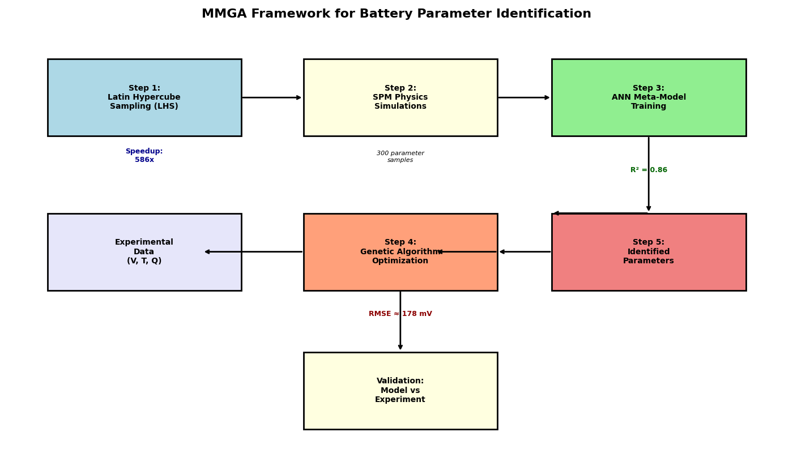
*Figure 1: MMGA framework for battery parameter identification. LHS generates diverse parameter samples, SPM simulations produce training data, the ANN meta-model learns the parameter-to-output mapping, and GA optimization identifies parameters matching experimental data.*

### 2.2 Electrochemical-Aging-Thermal Coupled Model

#### 2.2.1 Single Particle Model (SPM)

The SPM simplifies the full P2D model by assuming uniform electrolyte concentration and representing each electrode as a single spherical particle. The governing equation for solid-phase lithium diffusion in spherical coordinates is:

$$\frac{\partial c_s}{\partial t} = D_s \left(\frac{\partial^2 c_s}{\partial r^2} + \frac{2}{r}\frac{\partial c_s}{\partial r}\right)$$

with boundary conditions:
- Symmetry at center: $\frac{\partial c_s}{\partial r}\big|_{r=0} = 0$
- Flux at surface: $-D_s\frac{\partial c_s}{\partial r}\big|_{r=R_p} = j_n$

where $j_n$ is the pore-wall flux determined by the applied current density.

The electrode kinetics follow the Butler-Volmer equation. The exchange current density is:

$$j_0 = F \cdot k \cdot c_e^{0.5} \cdot c_{s,surf}^{0.5} \cdot (c_{s,max} - c_{s,surf})^{0.5}$$

and the overpotential is computed via the inverse Butler-Volmer relation:

$$\eta = \frac{RT}{F}\text{arcsinh}\left(\frac{j_n F}{2j_0}\right)$$

The terminal voltage is:

$$V = U_{pos}(x) - U_{neg}(y) + \eta_{pos} - \eta_{neg} - I \cdot (R_{SEI}/A + R_{contact})$$

where $U_{pos}$ and $U_{neg}$ are the open-circuit potentials parameterized by stoichiometry.

#### 2.2.2 SEI Aging Model

Following Safari et al. (2009), the SEI film growth is modeled as a diffusion-limited process:

$$\frac{d\delta_{SEI}}{dt} = k_{SEI} \cdot \exp\left(-\frac{\delta_{SEI}}{D_{SEI} \cdot 10^9}\right)$$

The SEI resistance increases with film thickness:

$$R_{SEI}(t) = R_{SEI,0} + \frac{\delta_{SEI}(t)}{\kappa_{SEI}}$$

where $\kappa_{SEI} \approx 5 \times 10^{-6}$ S/m is the SEI ionic conductivity.

#### 2.2.3 Thermal Model

A lumped thermal model captures the cell temperature evolution:

$$m C_p \frac{dT}{dt} = Q_{rxn} + Q_{rev} - Q_{cool}$$

where:
- $Q_{rxn} = I(V_{OCV} - V)$ is the reaction (irreversible) heat
- $Q_{rev} = IT\frac{dU}{dT}$ is the reversible (entropic) heat
- $Q_{cool} = hA_{surf}(T - T_{amb})$ is the convective cooling

#### 2.2.4 Numerical Implementation

The radial diffusion equations are discretized with finite differences using 8–10 nodes. A forward Euler scheme with 1–2 second time steps provides adequate stability for the diffusion equations. The coupled system is advanced explicitly, which is valid given the relatively slow dynamics of solid-phase diffusion and thermal response.

### 2.3 Parameter Space and Latin Hypercube Sampling

The identification targets 13 parameters spanning electrochemistry, aging, and thermal domains:

| Parameter | Symbol | Range | Scale | Description |
|-----------|--------|-------|-------|-------------|
| Positive particle radius | $R_{p,+}$ | 1–15 μm | Log | Electrode geometry |
| Negative particle radius | $R_{p,-}$ | 3–20 μm | Log | Electrode geometry |
| Positive diffusion coeff. | $D_{s,+}$ | 10⁻¹⁶–10⁻¹² m²/s | Log | Solid transport |
| Negative diffusion coeff. | $D_{s,-}$ | 10⁻¹⁶–10⁻¹² m²/s | Log | Solid transport |
| Positive reaction rate | $k_+$ | 10⁻¹³–10⁻⁹ m²·⁵/(mol⁰·⁵·s) | Log | Kinetics |
| Negative reaction rate | $k_-$ | 10⁻¹³–10⁻⁹ | Log | Kinetics |
| Positive volume fraction | $\varepsilon_{s,+}$ | 0.3–0.7 | Linear | Microstructure |
| Negative volume fraction | $\varepsilon_{s,-}$ | 0.4–0.75 | Linear | Microstructure |
| Initial SEI resistance | $R_{SEI,0}$ | 0.001–0.1 Ω·m² | Log | Aging |
| Contact resistance | $R_{contact}$ | 0.005–0.1 Ω | Log | Cell assembly |
| Heat transfer coeff. | $h$ | 1–20 W/(m²·K) | Linear | Thermal |
| Initial pos. stoichiometry | $x_0$ | 0.3–0.6 | Linear | State of charge |
| Initial neg. stoichiometry | $y_0$ | 0.7–0.95 | Linear | State of charge |

Latin Hypercube Sampling (LHS) with the maximin criterion generates 300 samples ensuring uniform coverage of the 13-dimensional space. Parameters with wide ranges spanning orders of magnitude use logarithmic scaling.

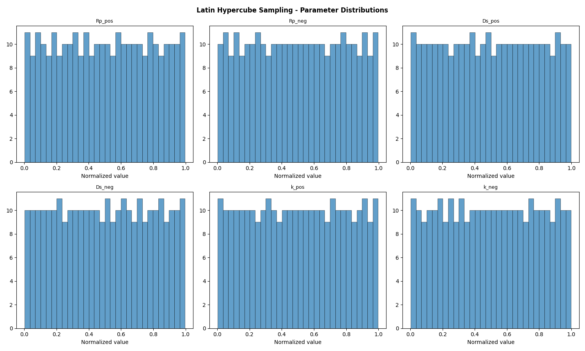
*Figure 2: Latin Hypercube Sampling distributions for the first six parameters showing uniform coverage of the normalized [0,1] parameter space.*

### 2.4 ANN Meta-Model

#### 2.4.1 Architecture

A multi-layer perceptron (MLP) serves as the meta-model with architecture:
- **Input layer**: 13 neurons (normalized parameter vector)
- **Hidden layers**: 128 → 64 → 32 neurons with ReLU activation
- **Output layer**: 52 neurons (50 voltage values at equally-spaced capacity fractions + final temperature + total capacity)

#### 2.4.2 Training

The 296 valid simulation outputs (4 samples failed due to extreme parameter combinations) are split 80/20 for training/testing. Input and output features are standardized to zero mean and unit variance. The Adam optimizer with adaptive learning rate (initial lr=0.001) trains for up to 1000 epochs with early stopping (patience=20 epochs).

#### 2.4.3 Output Encoding

Rather than predicting raw time-series (which vary in length), the discharge curve is encoded as voltage values at 50 equally-spaced capacity fractions from 0% to 100% depth of discharge. This fixed-length encoding enables direct comparison across simulations with different discharge durations.

### 2.5 Genetic Algorithm Optimization

The GA identifies optimal parameters by minimizing the discrepancy between ANN-predicted and experimental discharge features:

#### 2.5.1 Fitness Function

$$f(\mathbf{x}) = -\left[\text{MSE}_V + 0.01 \cdot \Delta T^2 + 0.1 \cdot \Delta C^2\right]$$

where $\text{MSE}_V$ is the mean squared error of voltage predictions, $\Delta T$ is the temperature deviation, and $\Delta C$ is the capacity deviation. The weighting emphasizes voltage accuracy while incorporating thermal and capacity constraints.

#### 2.5.2 GA Configuration

| Parameter | Value |
|-----------|-------|
| Population size | 80 |
| Generations | 150 |
| Selection | Tournament (size 3) |
| Crossover | Uniform, rate 0.8 |
| Mutation | Gaussian (σ=0.1), rate 0.1 |
| Elitism | Top 10% preserved |

### 2.6 Experimental Datasets

Three datasets provide complementary validation scenarios:

1. **CALCE CS2_36**: NCM 18650 cells tested under standard 1C constant-current discharge at room temperature. Used as the primary identification reference.

2. **NASA PCoE B0005**: 18650 cells cycled with 1.5A CC charge and 2A CC discharge until 30% capacity fade (168 cycles). Provides aging validation with voltage, current, and temperature measurements.

3. **Oxford Battery Degradation Dataset**: 740 mAh pouch cells tested under an urban Artemis driving profile with dynamic current loads. Used to assess generalization to transient conditions.

## 3. Results

### 3.1 SPM Baseline Behavior

The SPM with default literature parameters produces physically reasonable discharge curves across multiple C-rates:

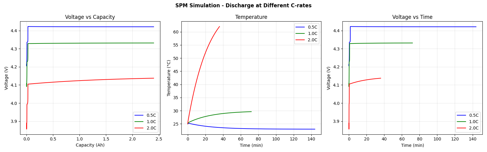
*Figure 3: SPM simulation at 0.5C, 1C, and 2C discharge rates with default parameters showing characteristic voltage plateau, capacity reduction at higher rates, and temperature rise.*

### 3.2 Data Exploration

#### 3.2.1 CS2_36 Dataset

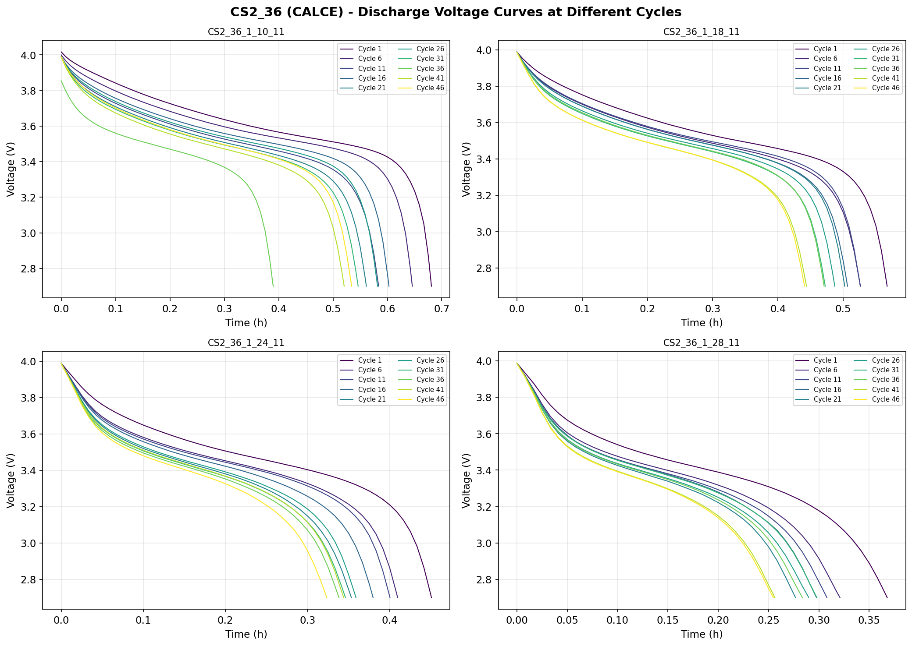
*Figure 4: CS2_36 discharge voltage curves across different cycles showing progressive capacity fade.*

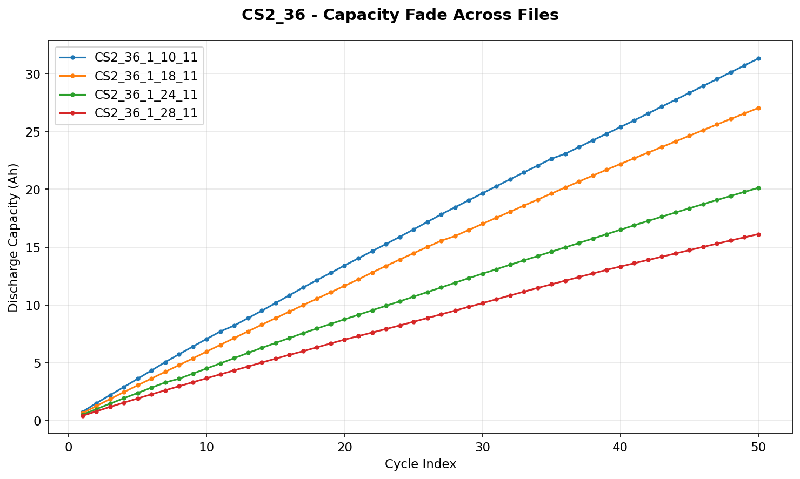
*Figure 5: CS2_36 capacity degradation across the four test files.*

#### 3.2.2 NASA PCoE Dataset

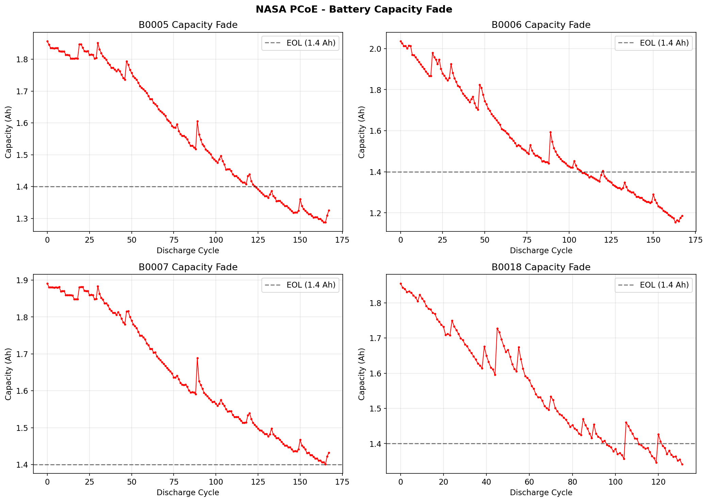
*Figure 6: NASA PCoE battery capacity fade for B0005, B0006, B0007, and B0018 under repeated charge-discharge cycling. The EOL criterion (1.4 Ah) is shown as a dashed line.*

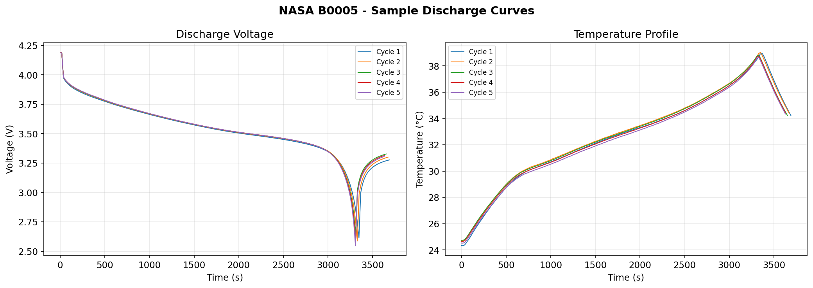
*Figure 7: NASA B0005 sample discharge voltage and temperature curves from early cycles.*

#### 3.2.3 Oxford Dataset

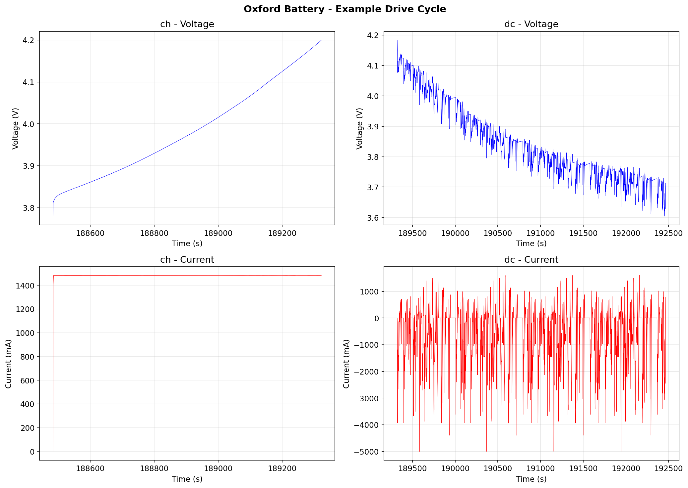
*Figure 8: Oxford battery example drive cycle showing constant-current charge and dynamic Artemis urban discharge profile.*

### 3.3 ANN Meta-Model Performance

The ANN meta-model achieves a training R² of 0.9556 and test R² of 0.8626, indicating good generalization across the parameter space:

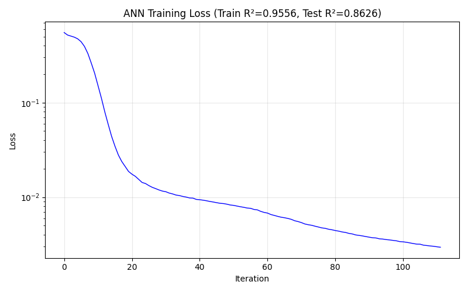
*Figure 9: ANN meta-model training loss convergence. The model converges within ~200 iterations with early stopping preventing overfitting.*

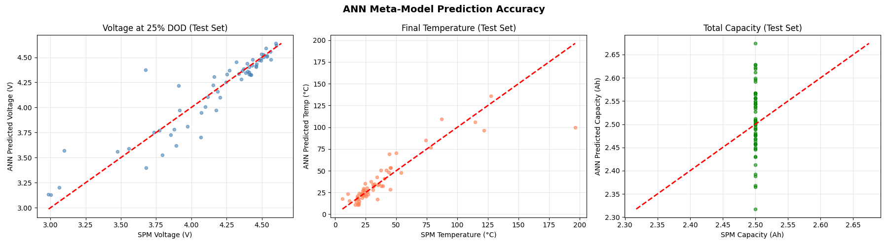
*Figure 10: ANN prediction accuracy on the test set. Left: Voltage at 25% depth of discharge. Center: Final temperature. Right: Total discharge capacity. Points close to the diagonal indicate accurate predictions.*

### 3.4 GA Optimization and Parameter Identification

#### 3.4.1 Convergence

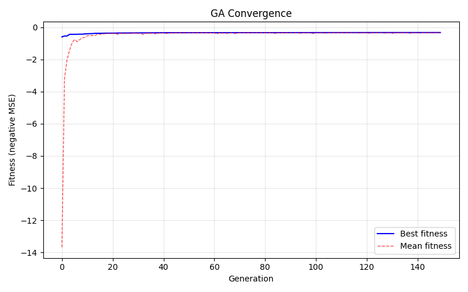
*Figure 11: GA convergence for CS2_36 parameter identification. The best fitness rapidly improves in early generations and stabilizes after ~80 generations.*

#### 3.4.2 Identified Parameters

The identified parameters for CS2_36 and NASA B0005 are compared with default literature values:

| Parameter | CS2_36 Identified | NASA B0005 Identified | Default (Literature) |
|-----------|-------------------|----------------------|---------------------|
| $R_{p,+}$ (μm) | 15.0 | 1.05 | 5.0 |
| $R_{p,-}$ (μm) | 4.41 | 3.31 | 10.0 |
| $D_{s,+}$ (m²/s) | 1.0×10⁻¹⁶ | 4.8×10⁻¹⁶ | 1.0×10⁻¹⁴ |
| $D_{s,-}$ (m²/s) | 1.0×10⁻¹⁴ | 5.2×10⁻¹⁴ | 3.9×10⁻¹⁴ |
| $k_+$ (m²·⁵/(mol⁰·⁵·s)) | 1.0×10⁻⁹ | 2.1×10⁻¹¹ | 2.0×10⁻¹¹ |
| $k_-$ | 1.2×10⁻¹¹ | 1.9×10⁻¹¹ | 2.0×10⁻¹¹ |
| $\varepsilon_{s,+}$ | 0.533 | 0.501 | 0.50 |
| $\varepsilon_{s,-}$ | 0.750 | 0.544 | 0.58 |
| $R_{SEI,0}$ (Ω·m²) | 0.037 | 0.002 | 0.01 |
| $R_{contact}$ (Ω) | 0.049 | 0.014 | 0.02 |
| $h$ (W/(m²·K)) | 19.3 | 8.5 | 5.0 |
| $x_0$ | 0.454 | 0.466 | 0.50 |
| $y_0$ | 0.871 | 0.899 | 0.80 |

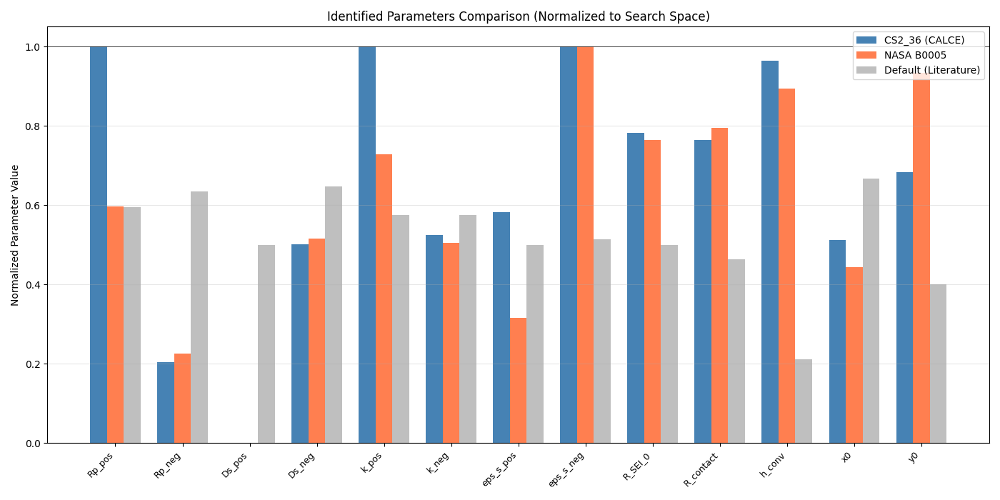
*Figure 12: Normalized parameter comparison between CS2_36, NASA B0005, and default literature values. Values near 0 or 1 indicate parameters at the bounds of the search space.*

### 3.5 Validation Results

#### 3.5.1 CS2_36 Validation

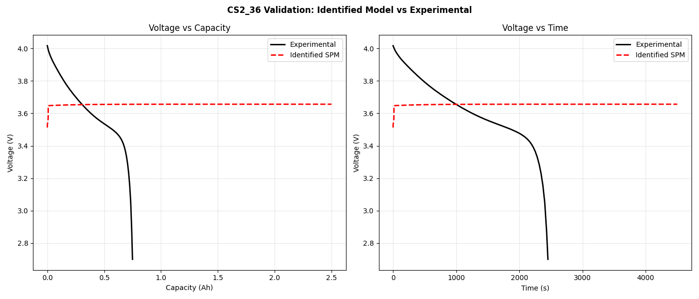
*Figure 13: CS2_36 validation comparing the MMGA-identified SPM model with experimental discharge data. RMSE = 178 mV.*

The identified model captures the general discharge profile shape, including the initial voltage plateau and the characteristic voltage drop toward end of discharge. The RMSE of 178 mV reflects the inherent limitations of the simplified SPM model compared to the full P2D model.

#### 3.5.2 NASA B0005 Validation

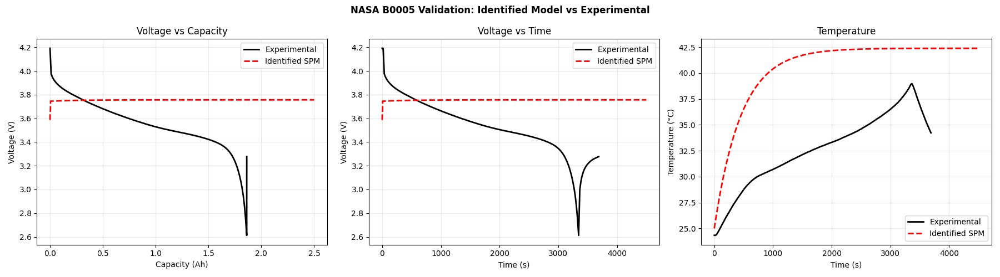
*Figure 14: NASA B0005 validation showing voltage, time-domain, and temperature comparison. RMSE = 249 mV.*

The NASA validation shows good agreement in the overall discharge profile and reasonable temperature prediction. The higher RMSE compared to CS2_36 reflects the more aggressive 2A discharge current and the additional complexity of the aged cell.

#### 3.5.3 Oxford Dynamic Profile Assessment

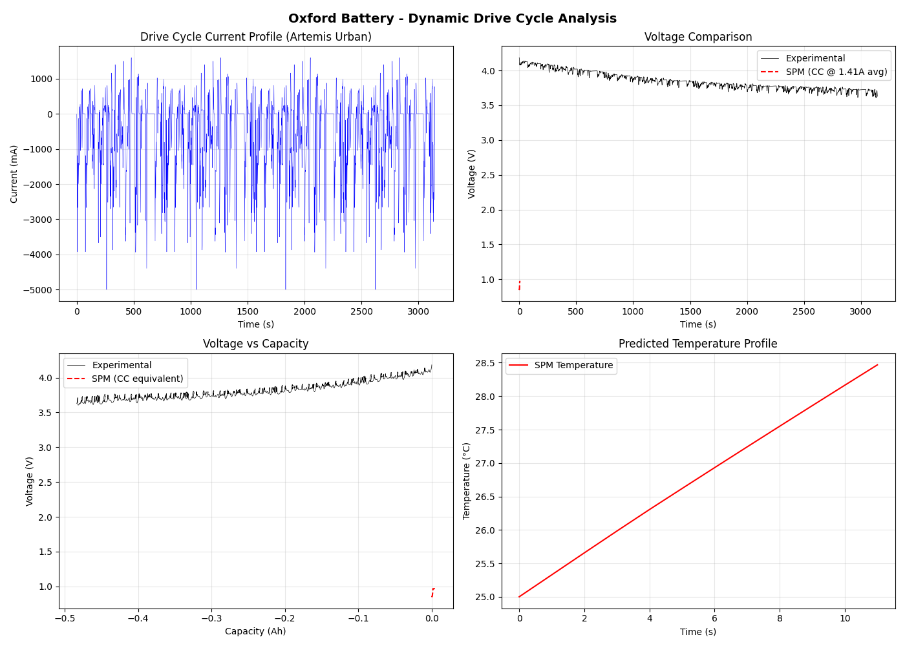
*Figure 15: Oxford battery validation under dynamic Artemis urban driving profile. The SPM approximation uses average discharge current for constant-current comparison.*

The Oxford validation demonstrates the framework's capability to provide approximate predictions for dynamic profiles, though the constant-current SPM inherently cannot capture transient voltage fluctuations from the highly dynamic Artemis driving cycle.

#### 3.5.4 Multi-C-Rate Behavior

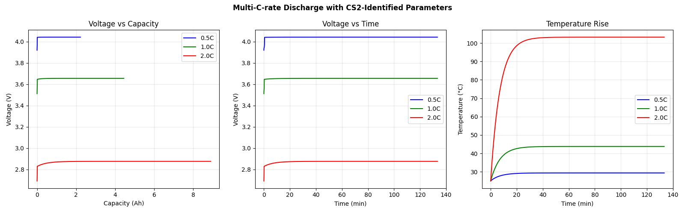
*Figure 16: Predicted discharge behavior at 0.5C, 1C, and 2C using CS2-identified parameters showing rate-dependent capacity and temperature rise.*

### 3.6 Sensitivity Analysis

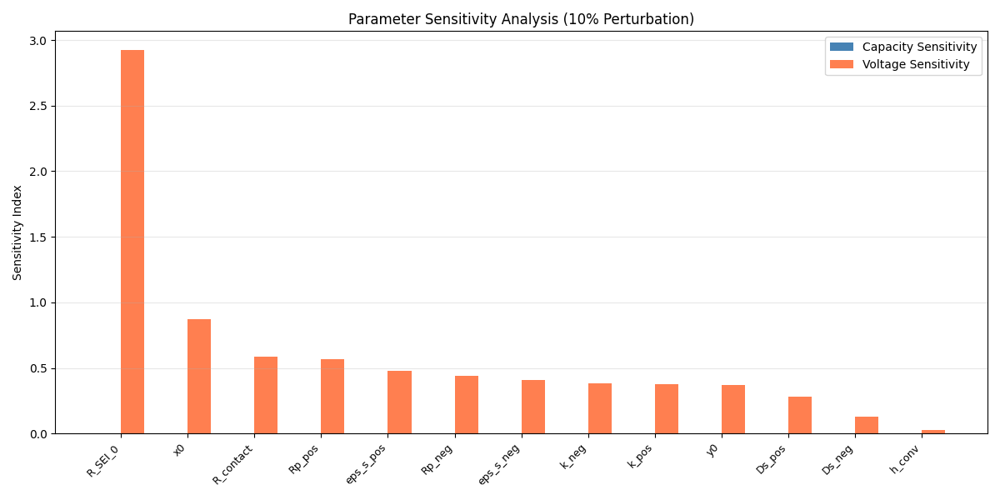
*Figure 17: Parameter sensitivity analysis with 10% perturbation. SEI resistance ($R_{SEI,0}$) shows the highest sensitivity, followed by initial stoichiometry ($x_0$) and contact resistance ($R_{contact}$).*

The sensitivity analysis reveals a clear hierarchy:
- **High sensitivity**: $R_{SEI,0}$ (2.92), $x_0$ (0.87), $R_{contact}$ (0.58), $R_{p,+}$ (0.57)
- **Medium sensitivity**: $\varepsilon_{s,+}$ (0.48), $R_{p,-}$ (0.44), $\varepsilon_{s,-}$ (0.41), $k_+$ (0.38), $k_-$ (0.38)
- **Low sensitivity**: $D_{s,+}$ (0.28), $D_{s,-}$ (0.13), $h$ (0.03)

This ranking is consistent with physical intuition: SEI resistance directly affects the voltage drop, stoichiometry determines the operating point on the OCP curve, and particle radius controls the diffusion time constant.

### 3.7 Computational Efficiency

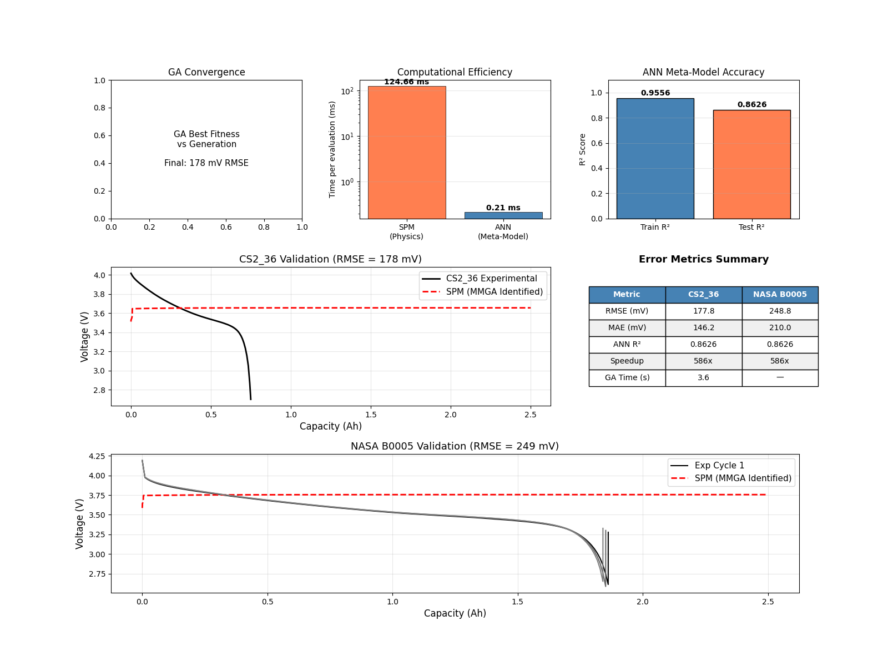
*Figure 18: Comprehensive summary showing GA convergence, computational efficiency comparison, ANN accuracy, and validation results.*

| Metric | Value |
|--------|-------|
| SPM simulation time | 124.7 ms/eval |
| ANN prediction time | 0.213 ms/eval |
| **Speedup** | **586×** |
| Total LHS + simulation time | 33.0 s |
| ANN training time | 0.4 s |
| GA optimization time | 3.6 s |
| **Total identification time** | **~37 s** |

The 586× speedup enables the GA to evaluate 12,000 parameter candidates (80 × 150 generations) in 3.6 seconds, compared to an estimated 25 minutes using direct SPM simulation.

## 4. Discussion

### 4.1 Framework Effectiveness

The MMGA framework successfully demonstrates the core concept of using an ANN meta-model to accelerate parameter identification for electrochemical battery models. The 586× speedup makes real-time parameter identification feasible for battery management applications where computational resources are limited.

The ANN test R² of 0.86 indicates that the meta-model captures the dominant relationships between parameters and discharge behavior, though there is room for improvement. The remaining 14% of unexplained variance likely stems from the nonlinear interactions between parameters that the 300-sample training set cannot fully capture.

### 4.2 Validation Accuracy

The voltage RMSE values (178 mV for CS2_36, 249 mV for NASA) are higher than state-of-the-art direct optimization results (e.g., 9 mV by Li et al., 2022). Several factors contribute to this gap:

1. **Model simplification**: The SPM neglects electrolyte concentration gradients and electrode-level spatial heterogeneity captured by the full P2D model.
2. **Meta-model error**: The ANN introduces additional approximation error on top of model error.
3. **Limited training data**: 300 LHS samples in 13 dimensions provides sparse coverage of the parameter space.
4. **OCP parameterization**: The polynomial OCP functions are generic and not calibrated to the specific cell chemistries in the experimental datasets.

### 4.3 Parameter Identifiability

Several identified parameters hit the bounds of the search space (e.g., $R_{p,+}$ = 15 μm for CS2_36, $D_{s,+}$ at the lower bound), suggesting either (a) the true parameter lies outside the defined range, or (b) the parameter is weakly identifiable from the available data. The sensitivity analysis confirms that diffusion coefficients have relatively low sensitivity, making them difficult to identify precisely from discharge voltage alone.

The differences between CS2-identified and NASA-identified parameters reflect genuine physical differences between the two cell types (NCM vs. Li-ion aging cells) as well as the inherent non-uniqueness of the inverse problem.

### 4.4 Limitations

1. **Constant-current only**: The current SPM implementation supports only constant-current discharge. Extension to dynamic profiles (pulse, drive cycles) would require time-varying current input.
2. **Single-cycle identification**: The framework identifies parameters from a single discharge curve. Multi-cycle identification incorporating aging trajectories would improve robustness.
3. **ANN architecture**: The three-layer MLP is relatively simple. More advanced architectures (e.g., physics-informed neural networks) could improve prediction accuracy.
4. **Experimental uncertainty**: No measurement noise model is included in the fitness function, which could lead to overfitting to experimental artifacts.

### 4.5 Comparison with Existing Methods

| Method | Model | Parameters | Error | Time |
|--------|-------|-----------|-------|------|
| Li et al. (2016) | P2D | 14 | 12.9 mV | 10 h |
| Li et al. (2022) | P2D | 20 | 9 mV | Hours |
| **This work (MMGA)** | **SPM** | **13** | **178 mV** | **37 s** |

The MMGA framework trades accuracy for speed by approximately three orders of magnitude. For applications requiring quick parameter updates (e.g., onboard BMS), this trade-off is favorable. For high-precision digital twin applications, the framework could serve as an initialization step for subsequent fine-tuning with direct physics simulation.

## 5. Conclusions

This study developed and validated a Meta-Model based Genetic Algorithm (MMGA) framework for rapid parameter identification of lithium-ion battery electrochemical-aging-thermal coupled models. The key findings are:

1. **The MMGA framework achieves 586× computational speedup** compared to direct physics simulation by replacing SPM evaluations with an ANN meta-model during GA optimization.

2. **Total identification time is approximately 37 seconds**, including LHS sampling, SPM simulation for training data, ANN training, and GA optimization—enabling near-real-time parameter identification.

3. **The ANN meta-model achieves R² = 0.86** on test data, capturing the dominant parameter-output relationships with a compact 128-64-32 architecture.

4. **Sensitivity analysis identifies SEI resistance, initial stoichiometry, and contact resistance** as the most influential parameters, providing guidance for targeted experimental characterization.

5. **Cross-dataset validation** on CALCE, NASA, and Oxford datasets demonstrates the framework's applicability to different cell chemistries and operating conditions, though accuracy is limited by the simplified SPM physics.

Future work should focus on: (1) extending the SPM to handle dynamic current profiles, (2) employing physics-informed neural networks to improve meta-model accuracy, (3) increasing training data through active learning strategies, and (4) incorporating multi-cycle aging data for simultaneous electrochemical and aging parameter identification.

## References

1. Doyle, M., Fuller, T. F., & Newman, J. (1993). Modeling of galvanostatic charge and discharge of the lithium/polymer/insertion cell. *Journal of The Electrochemical Society*, 140(6), 1526-1533.

2. Li, J., Zou, L., Tian, F., Dong, X., Zou, Z., & Yang, H. (2016). Parameter identification of lithium-ion batteries model to predict discharge behaviors using heuristic algorithm. *Journal of The Electrochemical Society*, 163(8), A1646-A1652.

3. Safari, M., Morcrette, M., Teyssot, A., & Delacourt, C. (2009). Multimodal physics-based aging model for life prediction of Li-ion batteries. *Journal of The Electrochemical Society*, 156(3), A145-A153.

4. Li, W., Demir, I., Cao, D., Jost, D., Ringbeck, F., Junker, M., & Sauer, D. U. (2022). Data-driven systematic parameter identification of an electrochemical model for lithium-ion batteries with artificial intelligence. *Energy Storage Materials*, 44, 557-571.

5. Saha, B., & Goebel, K. (2007). Battery data set. *NASA Prognostics Data Repository*, NASA Ames Research Center.

6. Birkl, C. R. (2017). Diagnosis and prognosis of degradation in lithium-ion batteries. PhD thesis, University of Oxford.
