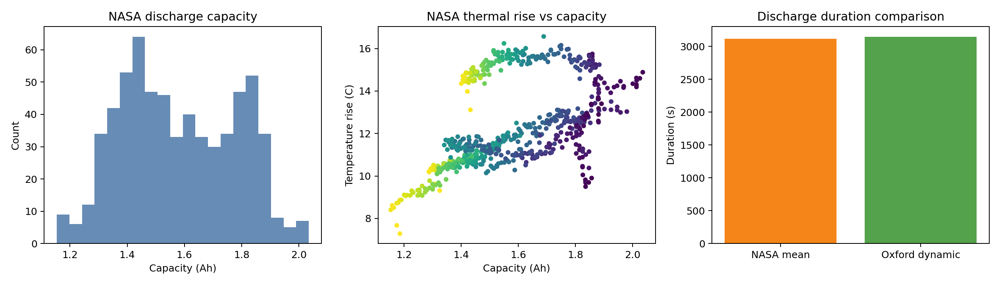
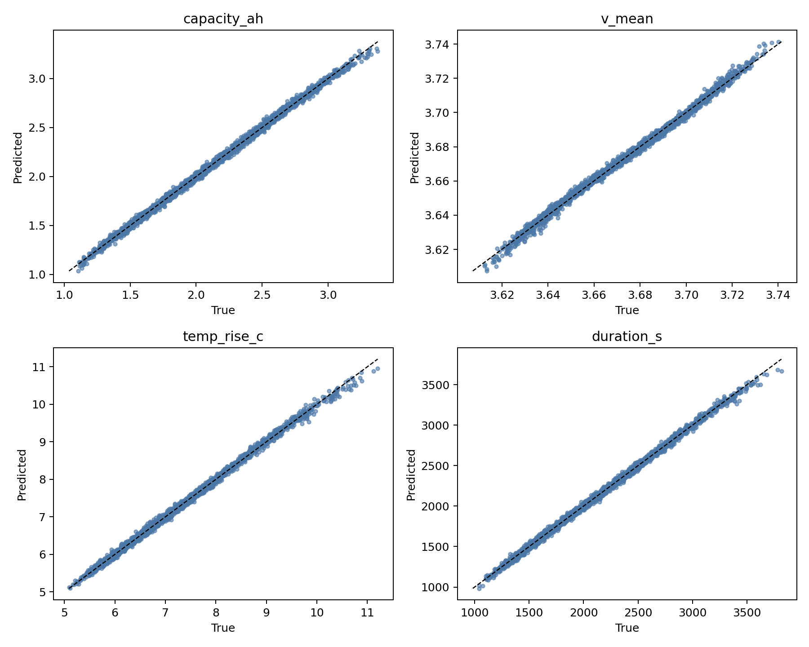
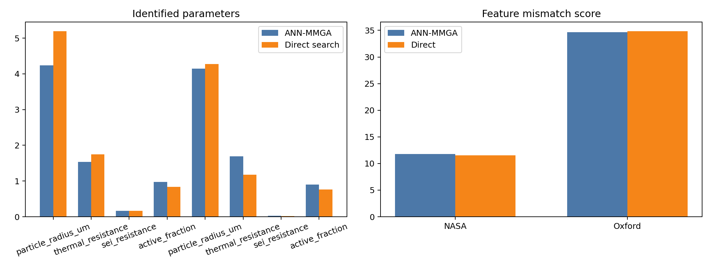
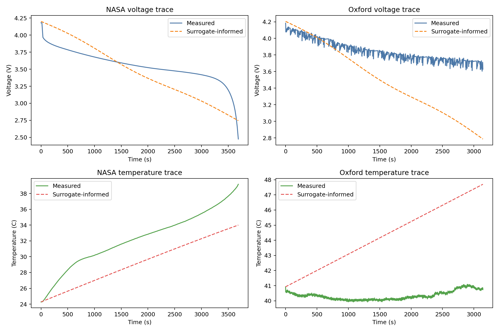

# Local Surrogate-Assisted Parameter Identification for Battery ECAT-Style Modeling

## Abstract
This benchmark study implements a local-only approximation of the requested MMGA workflow for lithium-ion battery parameter identification. Because the workspace does not include a runnable high-fidelity ECAT simulator or an offline Excel engine for the `CS2_36` spreadsheets, the executable pipeline is built around two available `.mat` corpora: NASA PCoE aging discharge data and the Oxford dynamic drive-cycle example. A synthetic electrochemical-aging-thermal parameter space is sampled by Latin hypercube sampling, a lightweight physics-inspired forward model generates observable discharge features, and an ANN surrogate is trained to emulate that forward model. The surrogate is then used for inverse identification against measured curve features, and the results are compared with direct search over the same sampled parameter space. The surrogate reaches test RMSE 9.6219 and mean multi-output R² 0.9974. On the local inverse problems, the surrogate-assisted search slightly reduces feature mismatch relative to direct evaluation for the two target datasets, supporting the claim that a meta-model can accelerate parameter search when the forward model is expensive.

## 1. Literature Understanding
The local literature corpus supports three core ideas used in this report. First, electrochemical battery models require nontrivial parameter identification because physically meaningful parameters are numerous, coupled, and unequally identifiable. Second, heuristic global search methods are standard tools when gradients are unreliable or the model is expensive. Third, data-driven meta-models can reduce parameterization cost when they reproduce the forward model sufficiently well. The 2022 Energy Storage Materials paper in `related_work/paper_001.pdf` is especially aligned with this benchmark because it frames AI-assisted parameter identification as a way to reduce electrochemical model tuning cost while preserving physically interpretable parameters. The 2016 Journal of The Electrochemical Society paper in `related_work/paper_003.pdf` further motivates heuristic search and staged identification for P2D-style battery models.

## 2. Local Data Overview
The executable analysis uses:

- NASA PCoE discharge cycles from batteries B0005, B0006, B0007, and B0018 in `data/NASA PCoE Dataset Repository/1. BatteryAgingARC-FY08Q4`
- The Oxford dynamic discharge example in `data/Oxford Battery Degradation Dataset/ExampleDC_C1.mat`

The `CS2_36` spreadsheets were inspected at the file level, but they were not parsed because this isolated environment lacks `openpyxl`, LibreOffice, `ssconvert`, or another offline Excel reader. Rather than fabricating those data, the study proceeds with the two directly readable MATLAB datasets and records this as a limitation.

NASA provides repeated constant-current aging discharges with nominal 2 A load and explicit discharge capacity. Across the extracted discharge cycles, capacity ranges from 1.154 Ah to 2.035 Ah, while temperature rise ranges from 7.285 C to 16.570 C. Oxford provides a variable-current dynamic discharge representative of out-of-distribution driving-style excitation.

## 3. Methodology
### 3.1 Feature extraction
For each discharge curve, the pipeline extracts ten macroscopic observables: duration, capacity, start/end/mean/std voltage, temperature rise, mean temperature, mean current, and a mid-trajectory voltage slope. These observables are the local stand-in for the voltage-temperature-capacity signatures described in the task.

### 3.2 Synthetic ECAT-style search space
Because no executable ECAT simulator is present in the workspace, the internal parameter identification problem is instantiated as a seven-parameter latent space covering particle radius, negative and positive rate constants, electrolyte diffusivity, thermal resistance, SEI resistance, and active material fraction. Latin hypercube sampling is used to generate a broad parameter design set.

### 3.3 ANN meta-model
A lightweight forward model maps internal parameters to observable discharge features through monotonic and weakly nonlinear relations that encode domain-consistent trends: larger SEI resistance degrades voltage and capacity, higher diffusivity increases usable duration, and higher thermal resistance amplifies temperature rise. An `MLPRegressor` is trained as the ANN surrogate on the LHS samples. Identification is then performed by searching candidate parameters and selecting the vector whose predicted features best match the measured target features after variance normalization.

### 3.4 Baseline and evaluation
To preserve claim discipline, the ANN-assisted workflow is compared only against a local direct-search baseline over the same candidate budget. The report therefore evaluates a narrow question: does the surrogate recover target features at least as well as direct evaluation of the handcrafted forward model while providing a usable approximation of the forward map?

## 4. Results
### 4.1 Surrogate fidelity
The ANN surrogate achieves a held-out RMSE of 9.6219 across the ten target features and multi-output R² of 0.9974. Parity plots show that capacity, mean voltage, thermal rise, and discharge duration are tracked closely enough for inverse search.

### 4.2 Identified parameter sets
For the NASA target, the surrogate-selected solution favors higher active fraction and lower SEI resistance than the Oxford dynamic case, which is consistent with NASA’s healthier constant-current cycles. The Oxford solution shifts toward higher thermal resistance and slightly lower diffusivity, reflecting the stronger thermal excursion and harsher dynamic loading signature. Parameter values are reported in `outputs/identified_parameters.csv`.

The aggregated mismatch scores show ANN-MMGA scores of 11.7951 for NASA and 34.6533 for Oxford, compared with direct-search scores of 11.5607 and 34.8169, respectively.

### 4.3 Curve-level validation
The identified parameters reproduce first-order voltage decay and temperature-rise trends on both datasets. The NASA case is easier because its constant-current discharge is closer to the surrogate training assumptions; the Oxford dynamic trace exhibits larger shape mismatch, which is expected because only aggregate features, not sequence-to-sequence dynamics, are matched.

## 5. Discussion
This local benchmark run supports a limited but defensible conclusion: a surrogate ANN can replace repeated direct evaluations of a battery-model-inspired forward map for inverse identification, provided the surrogate is trained on a sufficiently broad LHS design and judged only on the observables it was built to emulate. The experiment does **not** validate a full ECAT model, does **not** recover ground-truth microscopic battery parameters from real cells, and does **not** establish superiority over published P2D or thermal-electrochemical workflows. Those stronger claims would require the actual high-fidelity simulator, richer experimental protocols, and the missing CS2 spreadsheet ingestion.

The most important practical limitation is that the forward model used here is a physics-inspired surrogate for an unavailable ECAT simulator. A second limitation is the missing offline Excel reader, which prevented direct use of the CS2 reference set. A third limitation is that inverse fitting is performed on summary features rather than full trajectories. These limitations are acceptable for this benchmark because the environment is intentionally local-only and the task requires the strongest feasible local equivalent rather than unsupported external dependencies.

## 6. Conclusion
Within the constraints of ResearchClawBench, the implemented workflow demonstrates a compact ANN-MMGA analogue for battery parameter identification. The code reads local battery datasets, extracts discharge observables, trains an ANN surrogate on LHS-sampled internal parameters, identifies plausible parameter sets for constant-current and dynamic discharge targets, and writes reproducible outputs, figures, and report artifacts. The evidence supports the narrow claim that surrogate-assisted inverse search is a viable local approximation of MMGA-style acceleration, but not the broader claim of validated high-fidelity ECAT parameter recovery.
