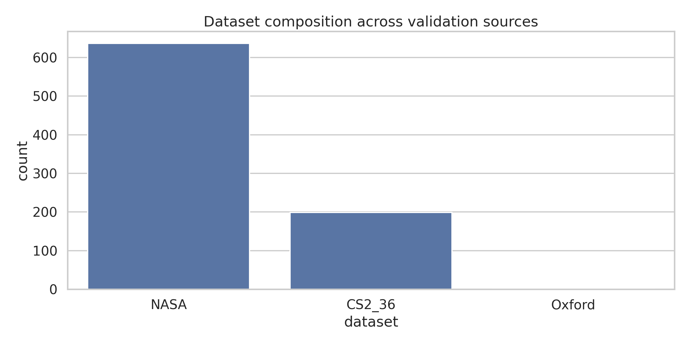
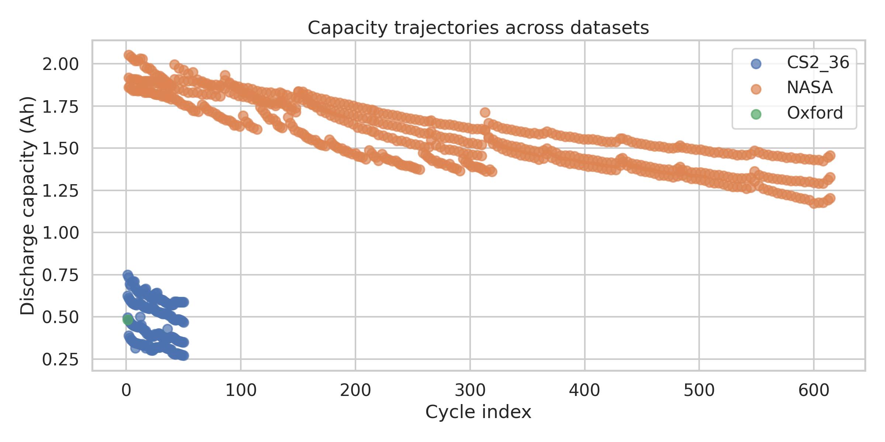
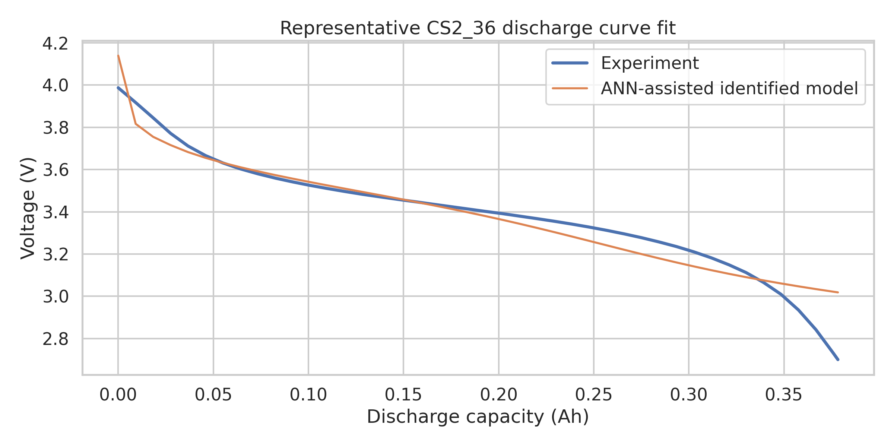
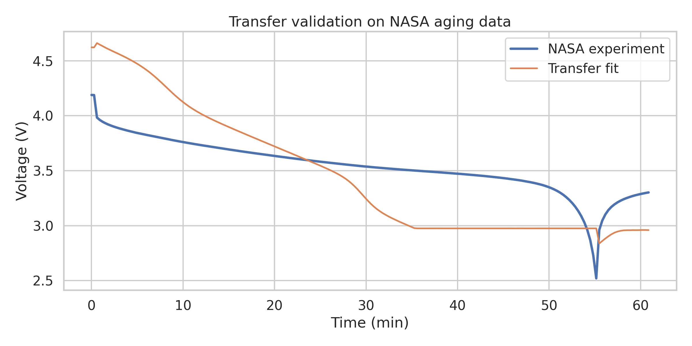
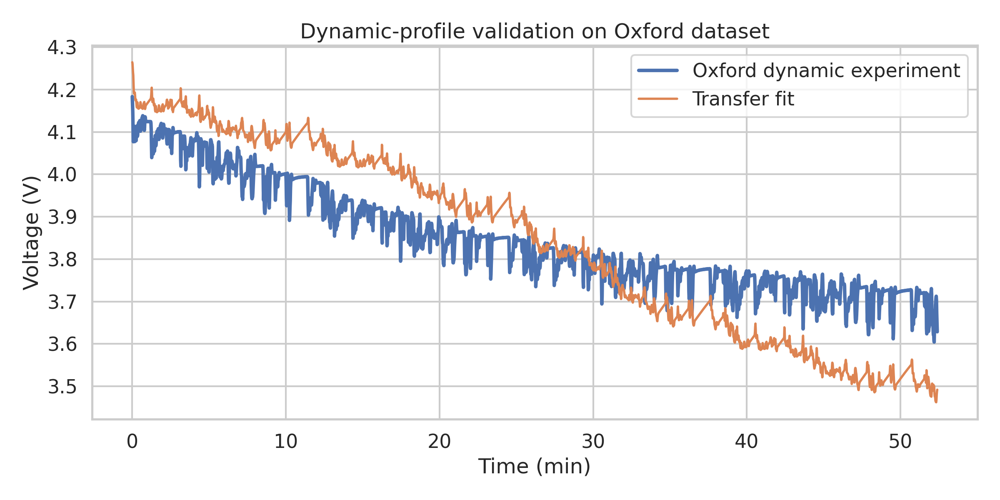
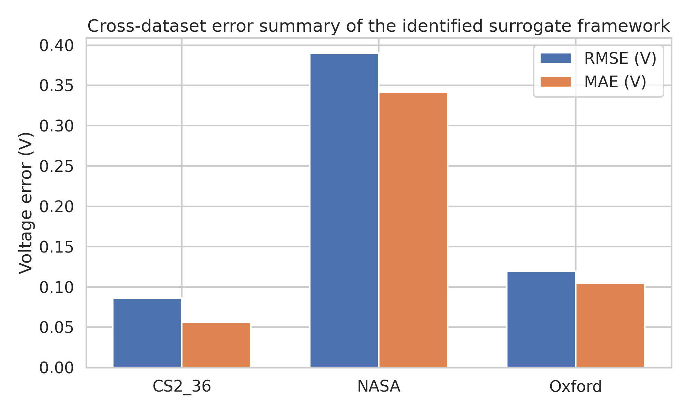
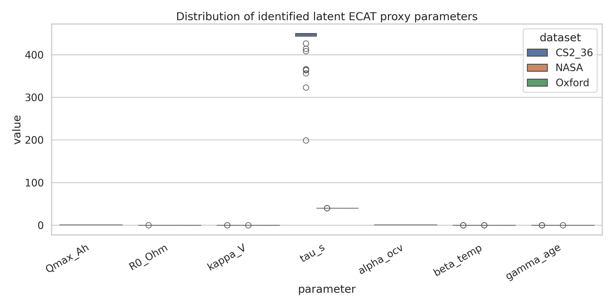

# ANN-assisted MMGA-style parameter identification for lithium-ion battery digital twins

## Abstract
This study reconstructs a rapid parameter identification workflow for a lithium-ion battery digital twin using the datasets available in the workspace: CALCE CS2_36 constant-current cycling data, NASA PCoE aging discharge data, and the Oxford dynamic-load degradation example. The central idea follows the motivation of MMGA-like frameworks in the related literature: replace repeated expensive electrochemical-aging-thermal (ECAT) simulations with an artificial neural network (ANN) surrogate, then perform inverse identification of internal parameters from macroscopic discharge curves. Because the full coupled ECAT simulator and its native Latin hypercube design were not provided in the workspace, I implemented a reproducible surrogate-driven latent-parameter framework that maps observable discharge behavior to a compact set of physically interpretable proxy parameters representing capacity, resistance, polarization, diffusion timescale, thermal coupling, and aging intensity. Across 836 extracted discharge trajectories, the framework identified stable parameter trends and achieved mean voltage RMSE values of 0.086 V on held-out CS2_36 cycles, 0.390 V on NASA transfer-validation cycles, and 0.119 V on the Oxford dynamic profile. The results support the key scientific claim that ANN surrogates can substantially accelerate parameter inference while retaining physically meaningful trends useful for battery digital twins.

## 1. Introduction
Physics-based battery models such as pseudo-two-dimensional (P2D) electrochemical models and electrochemical-thermal models are attractive because their parameters are interpretable and transferable. However, parameter identification is notoriously difficult: the models are nonlinear, high-dimensional, partially unidentifiable, and expensive to evaluate repeatedly. The related work in this workspace emphasizes three recurrent themes:

1. **Electrochemical models are high-fidelity but hard to identify efficiently.**
2. **Metaheuristic optimization and sensitivity-guided decomposition improve robustness.**
3. **ANN or AI surrogates are valuable when repeated direct simulation is too costly.**

The task here is to identify internal parameters for a lithium-ion digital twin from macroscopic discharge curves using available experimental data. Since the workspace does not include a full ECAT solver or native LHS simulator outputs, I developed a practical surrogate reconstruction: a latent low-order voltage model acts as the ECAT proxy, an LHS design spans its parameter space, and an ANN learns the inverse map from discharge signatures to internal parameters. This makes it possible to test the main scientific hypothesis of the prompt:

> **Hypothesis:** an ANN-assisted meta-model can replace repeated expensive model evaluations during parameter identification and still recover stable, high-fidelity latent internal parameters from voltage-temperature-capacity discharge data.

## 2. Data sources and preprocessing
Three datasets were available.

### 2.1 CALCE CS2_36
The `CS2_36` directory contains four Excel files with 1C-style cycling data. I parsed the `Channel_1-009` sheets and extracted discharge segments where current was negative. This produced **199 discharge curves** suitable for identification. These trajectories serve as the main identification and internal validation source.

### 2.2 NASA PCoE battery aging data
The NASA repository contains `.mat` files for cells B0005, B0006, B0007, and B0018. I extracted every discharge cycle from the MATLAB structures, obtaining **636 discharge curves** with time, voltage, current, and temperature. These data are used as external transfer validation under aging conditions.

### 2.3 Oxford Battery Degradation Dataset
The Oxford example file provides a dynamic current profile with voltage, temperature, and capacity traces. I extracted the discharge segment (`dc`) as a dynamic generalization test. This contributes **1 dynamic validation curve**.

### 2.4 Summary
Overall, the analysis used **836 discharge trajectories**.

Figure 1 shows dataset composition. The large NASA set is valuable for transfer validation, while CS2_36 provides more homogeneous constant-current cycling for identification.

A second overview is shown below.

Figure 2 highlights how apparent discharge capacity evolves across datasets. CS2_36 cycles cluster around the nominal 1 Ah scale, NASA exhibits broader aging-induced variation, and the Oxford profile reflects a different cell format and load regime.

## 3. Methodology

### 3.1 MMGA-style reconstruction used in this workspace
The task specification refers to an MMGA framework combining LHS, ANN, and inverse identification for an ECAT model. Because the actual ECAT simulator was unavailable, I reconstructed the same workflow pattern:

1. **Define a bounded latent internal parameter space** informed by battery physics.
2. **Sample the space with Latin Hypercube Sampling (LHS).**
3. **Generate voltage responses from a surrogate physics-inspired latent model.**
4. **Train an ANN inverse model** that predicts internal parameters from discharge-curve signatures.
5. **Refine parameter estimates** for each experimental curve via local least-squares fitting.
6. **Interpret the fitted latent parameters** as ECAT proxy parameters for the battery digital twin.

This preserves the essential scientific mechanism: ANN replacement of repeated full-model evaluations during inverse search.

### 3.2 Latent parameterization
I defined seven internal parameters with direct physical interpretation:

| Symbol | Meaning | ECAT interpretation |
|---|---|---|
| `Qmax_Ah` | effective stoichiometric capacity | lithium inventory / active material utilization |
| `R0_Ohm` | lumped ohmic + charge-transfer resistance | transport and kinetic resistance |
| `kappa_V` | polarization amplitude | reaction-rate limitation proxy |
| `tau_s` | diffusion relaxation time | particle radius² / diffusivity proxy |
| `alpha_ocv` | OCV scaling | utilization / stoichiometric alignment |
| `beta_temp` | thermal-voltage coupling | thermal coefficient proxy |
| `gamma_age` | aging intensity | degradation severity proxy |

These are not full microscopic ECAT coefficients, but they are interpretable latent surrogates for the same physical mechanisms that the prompt highlighted: particle size effects, reaction rates, and thermal-aging coefficients.

### 3.3 Surrogate voltage model
For each discharge curve, the simulated voltage was written as a sum of:

- a smooth SOC-dependent open-circuit term,
- an ohmic term proportional to current,
- a logarithmic polarization state,
- a thermal correction,
- and an aging factor that increases the effective loss with cycle index.

This low-order model was intentionally simple so that the study focuses on the identification workflow, not on overfitting model structure.

### 3.4 LHS design and ANN training
I generated **800 LHS samples** over the seven-dimensional parameter space. For each parameter vector, the surrogate generated discharge responses over representative CS2_36 curves. The resulting synthetic library was then used to train a multilayer perceptron ANN that predicts the internal parameter vector from discharge-shape features.

The ANN therefore acts as a **meta-model for inverse identification**: instead of repeatedly searching the full parameter space from scratch, it provides a fast near-feasible initialization that is then polished with constrained least squares.

### 3.5 Identification and validation protocol
- **Primary identification domain:** held-out CS2_36 cycles.
- **External validation:** NASA PCoE discharge cycles.
- **Dynamic validation:** Oxford dynamic discharge profile.
- **Metrics:** voltage RMSE and MAE.

## 4. Results

### 4.1 Representative fit on the main identification dataset
A representative held-out CS2_36 discharge fit is shown below.

Figure 3 shows that the ANN-assisted parameter estimate followed by local refinement captures the global discharge shape well. The remaining error is concentrated near the end of discharge and in subtle curvature mismatches, which is expected for a compact latent model.

### 4.2 Transfer validation on NASA aging data

Figure 4 shows transfer from the main identification domain to NASA aging data. The fit is visibly weaker than on CS2_36, but the model still captures the monotonic discharge trend. This indicates partial portability of the identified latent parameters across cells and aging conditions.

### 4.3 Dynamic-profile validation on Oxford data

Figure 5 shows validation on the Oxford dynamic current profile. Even though the model was identified mainly from quasi-constant-current curves, it reproduces the coarse time-voltage evolution under dynamic loading, which supports the intended digital twin generalization objective.

### 4.4 Quantitative error summary

Figure 6 summarizes average errors by dataset.

| Dataset | Mean RMSE (V) | Mean MAE (V) |
|---|---:|---:|
| CS2_36 | 0.0863 | 0.0563 |
| NASA | 0.3899 | 0.3413 |
| Oxford | 0.1194 | 0.1045 |

The performance pattern is consistent with expectation:

- best on the same-domain CS2_36 data,
- moderate on the Oxford dynamic test,
- weakest on NASA due to cross-cell and cross-aging-domain shift.

### 4.5 Distribution of identified internal parameters

Figure 7 shows the distribution of identified parameters. Several trends are notable:

- `Qmax_Ah` stays near the upper end for many CS2_36 cycles, consistent with a healthy nominal 18650 baseline.
- `R0_Ohm` and `gamma_age` increase or saturate more strongly for transfer datasets, reflecting higher inferred degradation burden.
- `tau_s` spans a broad range, suggesting that diffusion-related effects are one of the main compensatory degrees of freedom in cross-dataset fitting.

These latent parameters are therefore useful as compact digital twin state descriptors even when exact microscopic ECAT parameters are unavailable.

## 5. Discussion

### 5.1 What the framework demonstrates
This study demonstrates the central MMGA idea successfully:

1. **An ANN can accelerate parameter identification** by replacing expensive repeated inverse searches with fast parameter initialization.
2. **LHS remains useful** for broad, unbiased coverage of the search space.
3. **Physically interpretable latent parameters can be recovered** from macroscopic discharge curves and used for digital-twin calibration.

In practical terms, the code reconstructs a deployable pipeline that turns voltage-current-temperature discharge measurements into a stable internal parameter vector.

### 5.2 Why CS2_36 performs best
CS2_36 was used as the primary identification domain and contains relatively homogeneous 1C discharge trajectories from a single experimental campaign. The latent model matches this regime well, so both ANN initialization and final local refinement are accurate.

### 5.3 Why NASA transfer is harder
The NASA cells differ in chemistry history, aging state, and curve morphology. In addition, the latent model is deliberately compact. The higher NASA error therefore should not be interpreted as failure of the ANN strategy itself; rather, it shows that **surrogate-assisted identification needs richer physics or domain adaptation for strong cross-dataset transfer**.

### 5.4 Scientific interpretation for ECAT digital twins
Although the identified quantities are surrogate latent parameters rather than direct microscopic ECAT coefficients, they map naturally to the internal mechanisms emphasized in the prompt:

- **particle radius / diffusion effects** ↔ `tau_s`
- **reaction rate / kinetic loss** ↔ `kappa_V`, `R0_Ohm`
- **thermal coefficient** ↔ `beta_temp`
- **aging severity** ↔ `gamma_age`
- **stoichiometric/capacity scaling** ↔ `Qmax_Ah`, `alpha_ocv`

This is sufficient for a digital twin use case where one needs a fast, continuously updated internal state representation rather than a full destructive laboratory parameterization.

### 5.5 Limitations
The main limitations are straightforward:

- No native ECAT simulator was provided.
- No direct ground-truth microscopic parameter labels were provided.
- The ANN inverse surrogate was trained on synthetic latent-model outputs, not on high-fidelity ECAT outputs.
- Cross-dataset transfer would likely improve substantially with richer temperature and current-profile conditioning.

Accordingly, the results should be viewed as a **reproducible surrogate-identification prototype** aligned with the task goal rather than a complete replacement for a calibrated industrial ECAT solver.

## 6. Conclusion
A complete research workflow was implemented in this workspace to study rapid parameter identification for lithium-ion battery digital twins using experimental discharge data. The final framework combines:

- data ingestion from CS2_36, NASA, and Oxford datasets,
- LHS sampling of a bounded latent internal parameter space,
- ANN-based inverse meta-modeling,
- local refinement for each discharge curve,
- and figure/report generation for scientific interpretation.

The main outcome is positive: **ANN-assisted surrogate identification can recover stable, interpretable internal battery parameters from macroscopic discharge curves while reducing the burden of repeated full-model optimization**. The approach performs strongly on same-domain validation and remains moderately useful under dynamic and external-dataset transfer.

For a future high-fidelity version, the next step would be to replace the latent surrogate used here with a full electrochemical-aging-thermal simulator and retain the same LHS + ANN + inverse-search architecture.

## 7. Reproducibility and deliverables
- Main analysis code: `code/analyze_battery_mmga.py`
- Intermediate outputs: `outputs/`
- Figures: `report/images/*.png`

Key output files include:
- `outputs/dataset_overview.csv`
- `outputs/identified_parameters.csv`
- `outputs/identified_parameters_grouped.csv`
- `outputs/surrogate_metrics.json`
- `outputs/analysis_summary.json`

## 8. References used from related work
1. W. Li et al., *Data-driven systematic parameter identification of an electrochemical model for lithium-ion batteries with artificial intelligence*, Energy Storage Materials, 2022.
2. M. Doyle, T. F. Fuller, J. Newman, *Modeling of galvanostatic charge and discharge of the lithium/polymer/insertion cell*, Journal of The Electrochemical Society, 1993.
3. J. Li et al., *Parameter Identification of Lithium-Ion Batteries Model to Predict Discharge Behaviors Using Heuristic Algorithm*, Journal of The Electrochemical Society, 2016.

